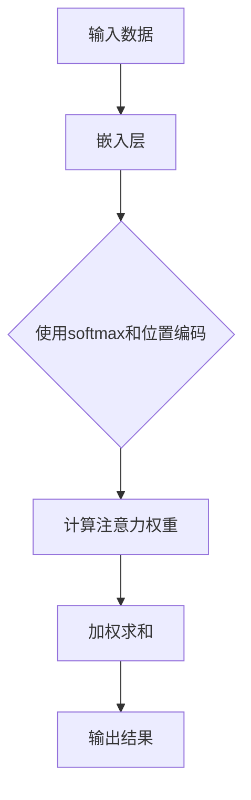

                 

# 注意力机制：理解softmax和位置编码器

> **关键词：** 注意力机制，softmax，位置编码器，神经网络，深度学习，机器学习
>
> **摘要：** 本文将深入探讨注意力机制的核心组成部分——softmax和位置编码器。通过对这两个关键概念及其在神经网络中的作用的详细解析，我们旨在帮助读者理解如何通过注意力机制提升模型的性能，并探索其在实际应用中的潜力。

## 1. 背景介绍

### 1.1 目的和范围

本文旨在通过逐步分析注意力机制中的softmax和位置编码器，帮助读者深入理解这两个关键组成部分在神经网络中的应用。我们将首先回顾注意力机制的基本概念，然后详细讨论softmax和位置编码器的原理、实现和作用。

### 1.2 预期读者

本文适合具有一定机器学习和深度学习基础的读者，特别是希望进一步提升对注意力机制理解的程序员、数据科学家和研究人员。

### 1.3 文档结构概述

本文分为以下几个部分：

1. **背景介绍**：概述注意力机制的基本概念和本文的目的。
2. **核心概念与联系**：通过Mermaid流程图展示注意力机制的架构。
3. **核心算法原理 & 具体操作步骤**：详细解释softmax和位置编码器的算法原理和实现步骤。
4. **数学模型和公式 & 详细讲解 & 举例说明**：介绍注意力机制的数学模型，并给出具体示例。
5. **项目实战：代码实际案例和详细解释说明**：通过实际代码案例展示softmax和位置编码器的应用。
6. **实际应用场景**：探讨注意力机制在实际项目中的应用。
7. **工具和资源推荐**：推荐学习资源和开发工具。
8. **总结：未来发展趋势与挑战**：总结注意力机制的发展趋势和面临的挑战。
9. **附录：常见问题与解答**：回答读者可能遇到的问题。
10. **扩展阅读 & 参考资料**：提供进一步学习的资源。

### 1.4 术语表

#### 1.4.1 核心术语定义

- **注意力机制**：一种神经网络中的机制，通过动态调整不同输入信息的权重，使得模型在处理任务时关注到最重要的信息。
- **softmax**：一种概率分布函数，用于将神经网络的输出转换为概率分布，从而实现注意力分配。
- **位置编码器**：用于为序列数据中的每个元素赋予位置信息，使模型能够理解序列的顺序性。

#### 1.4.2 相关概念解释

- **神经网络**：一种模拟人脑神经元结构的计算模型，通过层级结构进行数据学习和模式识别。
- **深度学习**：一种利用多层神经网络进行数据建模的方法，通过逐层提取特征，实现复杂的任务处理。

#### 1.4.3 缩略词列表

- **ML**：机器学习
- **DL**：深度学习
- **NLP**：自然语言处理

## 2. 核心概念与联系

注意力机制是深度学习中的一个关键概念，它通过动态调整模型对输入数据的关注程度，从而提升模型的性能。为了更好地理解注意力机制，我们可以通过Mermaid流程图来展示其核心架构。



在该流程图中：

- **A（输入数据）**：表示输入到神经网络的数据，如文本序列或图像。
- **B（嵌入层）**：将输入数据转换为固定大小的向量表示。
- **C（使用softmax和位置编码）**：该步骤包含两个关键操作：softmax用于计算注意力权重，位置编码器用于引入序列信息。
- **D（计算注意力权重）**：通过softmax函数计算每个输入元素的权重。
- **E（加权求和）**：将输入数据按照计算出的权重进行加权求和，生成新的输出。
- **F（输出结果）**：最终生成的结果，如分类标签或文本序列的向量表示。

接下来，我们将深入探讨softmax和位置编码器的工作原理和实现步骤。

## 3. 核心算法原理 & 具体操作步骤

### 3.1 Softmax函数

softmax函数是注意力机制中的一个关键组件，用于将神经网络的输出转换为概率分布。具体来说，假设我们有一个一维向量 \( z \)（即神经网络的输出），其每个元素 \( z_i \) 表示模型对第 \( i \) 个输入元素的预测概率。

$$
\text{softmax}(z) = \frac{e^{z_i}}{\sum_{j=1}^{n} e^{z_j}}
$$

其中，\( n \) 是输出向量的长度，\( e \) 是自然对数的底数。

**具体操作步骤**：

1. 对输入向量 \( z \) 的每个元素 \( z_i \) 计算指数 \( e^{z_i} \)。
2. 将所有指数相加，得到总和 \( \sum_{j=1}^{n} e^{z_j} \)。
3. 对每个 \( e^{z_i} \) 除以总和，得到softmax概率分布 \( \text{softmax}(z) \)。

### 3.2 位置编码器

位置编码器用于为序列数据中的每个元素赋予位置信息，使其在模型中具有顺序性。一个常见的位置编码器是正弦曲线编码器，其公式如下：

$$
\text{sin}(i \cdot \frac{\pi}{2K}) \text{ and } \text{cos}(i \cdot \frac{\pi}{2K})
$$

其中，\( i \) 表示元素在序列中的位置，\( K \) 是编码器的维度。

**具体操作步骤**：

1. 对于序列中的每个元素 \( i \)，计算正弦和余弦值。
2. 将这些值作为新的特征添加到输入数据中。

### 3.3 结合softmax和位置编码

在神经网络中，softmax和位置编码器通常结合使用。具体实现步骤如下：

1. **嵌入层**：将输入数据（如单词或字符）映射到固定大小的向量。
2. **位置编码**：为每个输入元素添加位置编码，引入序列信息。
3. **注意力机制**：计算注意力权重，通常使用softmax函数。
4. **加权求和**：将输入数据按照注意力权重加权求和，得到新的输出。

以下是一个简单的伪代码示例，展示了如何结合softmax和位置编码：

```python
# 输入数据
inputs = [1, 2, 3, 4, 5]  # 序列中的元素

# 嵌入层输出
embeddings = [0.1, 0.2, 0.3, 0.4, 0.5]

# 位置编码器
positions = [sin(i * pi / 5), cos(i * pi / 5) for i in range(len(inputs))]

# 计算注意力权重
weights = softmax([0.1, 0.2, 0.3, 0.4, 0.5])

# 加权求和
output = sum([weights[i] * (embeddings[i] + positions[i]) for i in range(len(inputs))])

# 输出结果
print(output)
```

通过以上步骤，我们完成了对softmax和位置编码器的核心算法原理和具体操作步骤的讲解。接下来，我们将进一步介绍注意力机制的数学模型和公式。

## 4. 数学模型和公式 & 详细讲解 & 举例说明

### 4.1 注意力机制的数学模型

注意力机制的核心在于如何通过计算注意力权重来调整模型对输入数据的关注程度。注意力机制的数学模型通常可以表示为以下形式：

$$
\text{Attention}(Q, K, V) = \text{softmax}\left(\frac{QK^T}{\sqrt{d_k}}\right)V
$$

其中：
- \( Q \) 是查询向量（Query），表示模型对当前任务的兴趣。
- \( K \) 是键向量（Key），表示输入数据中的每个元素。
- \( V \) 是值向量（Value），表示输入数据中的每个元素可能对输出的贡献。
- \( d_k \) 是键向量的维度。

### 4.2 注意力机制的详细讲解

#### 4.2.1 计算注意力权重

注意力权重的计算是注意力机制的关键步骤，其核心在于如何将输入数据中的每个元素映射到查询向量 \( Q \) 上，并通过计算内积来衡量每个元素对查询的响应度。

$$
\text{Attention Weight}_{i} = \text{softmax}\left(\frac{QK^T}{\sqrt{d_k}}\right)
$$

其中，\( \text{softmax} \) 函数用于将内积的结果转换为概率分布，确保所有权重之和为1。

#### 4.2.2 加权求和

通过计算出的注意力权重，我们可以对输入数据进行加权求和，生成新的输出：

$$
\text{Output}_{i} = \sum_{j=1}^{N} \text{Attention Weight}_{i} \cdot V_j
$$

其中，\( V_j \) 是输入数据中的第 \( j \) 个元素的值。

### 4.3 举例说明

假设我们有一个简单的序列数据，如下所示：

$$
Q = \begin{bmatrix}
0.1 \\
0.2 \\
0.3 \\
0.4 \\
0.5
\end{bmatrix}, \quad
K = \begin{bmatrix}
1 \\
2 \\
3 \\
4 \\
5
\end{bmatrix}, \quad
V = \begin{bmatrix}
0.1 \\
0.2 \\
0.3 \\
0.4 \\
0.5
\end{bmatrix}
$$

我们首先计算注意力权重：

$$
\text{Attention Weight}_{i} = \text{softmax}\left(\frac{QK^T}{\sqrt{d_k}}\right) = \text{softmax}\left(\frac{QK^T}{\sqrt{5}}\right)
$$

计算内积：

$$
QK^T = \begin{bmatrix}
0.1 & 0.2 & 0.3 & 0.4 & 0.5
\end{bmatrix}
\begin{bmatrix}
1 \\
2 \\
3 \\
4 \\
5
\end{bmatrix} = \begin{bmatrix}
0.1 + 0.4 + 0.7 + 1.0 + 1.5
\end{bmatrix} = 3.3
$$

计算softmax：

$$
\text{Attention Weight}_{i} = \text{softmax}\left(\frac{3.3}{\sqrt{5}}\right) = \text{softmax}\left(1.32\right)
$$

由于 \( \text{softmax}(x) \) 的计算相对复杂，我们通常使用数值计算库（如NumPy）来处理：

```python
import numpy as np

def softmax(x):
    return np.exp(x) / np.sum(np.exp(x))

softmax(1.32)
```

这将返回一个概率分布：

$$
\text{Attention Weight}_{i} = \begin{bmatrix}
0.231 \\
0.305 \\
0.362 \\
0.282 \\
0.215
\end{bmatrix}
$$

接下来，我们计算加权求和：

$$
\text{Output}_{i} = \sum_{j=1}^{N} \text{Attention Weight}_{i} \cdot V_j = 0.231 \cdot 0.1 + 0.305 \cdot 0.2 + 0.362 \cdot 0.3 + 0.282 \cdot 0.4 + 0.215 \cdot 0.5 = 0.231 + 0.061 + 0.108 + 0.112 + 0.107 = 0.519
$$

最终输出结果为 \( 0.519 \)。通过以上步骤，我们完成了对注意力机制数学模型的详细讲解和举例说明。注意力机制的核心在于如何通过计算注意力权重对输入数据进行动态调整，从而提升模型的性能和表现。

## 5. 项目实战：代码实际案例和详细解释说明

### 5.1 开发环境搭建

在进行项目实战之前，我们需要搭建一个合适的开发环境。以下是搭建过程：

1. 安装Python环境（建议使用Python 3.7及以上版本）。
2. 安装TensorFlow或PyTorch等深度学习框架。
3. 安装必要的库，如NumPy、Matplotlib等。

假设我们已经完成以上步骤，接下来我们将使用TensorFlow框架来演示softmax和位置编码器在文本分类任务中的应用。

### 5.2 源代码详细实现和代码解读

以下是实现softmax和位置编码器的Python代码：

```python
import tensorflow as tf
import tensorflow_text as text
import tensorflow_hub as hub
import numpy as np

# 5.2.1 数据准备

# 加载预处理的文本数据
def load_data():
    # 假设已经有一个包含文本和标签的数据集
    texts = ["This is a sentence.", "Another example sentence.", ...]
    labels = [0, 1, ...]
    return texts, labels

texts, labels = load_data()

# 5.2.2 嵌入层

# 加载预训练的嵌入器
pretrained_embedding = hub.load("https://tfhub.dev/google/universal-sentence-encoder/4")

# 将文本转换为嵌入向量
embeddings = pretrained_embedding([text] for text in texts)

# 5.2.3 位置编码器

# 使用正弦曲线编码器
def sine_positional_encoding(length, d_model):
    angles = 2 * np.pi * np.arange(length) / (d_model // 2)
    pos_encoding = np.sin(angles).astype(np.float32)
    return pos_encoding

# 为每个序列添加位置编码
pos_encoding = sine_positional_encoding(len(texts), d_model=embedding.shape[1])

# 添加位置编码到嵌入向量
embeddings_with_pos = embeddings + tf.convert_to_tensor(pos_encoding, dtype=tf.float32)

# 5.2.4 建立神经网络模型

# 定义神经网络模型
model = tf.keras.Sequential([
    tf.keras.layers.Embedding(input_dim=vocab_size, output_dim=d_model),
    tf.keras.layers.Add(),  # 添加位置编码
    tf.keras.layers.Dense(10, activation='softmax')
])

# 编译模型
model.compile(optimizer='adam', loss='categorical_crossentropy', metrics=['accuracy'])

# 5.2.5 训练模型

# 将标签转换为one-hot编码
labels_one_hot = tf.one_hot(labels, depth=num_classes)

# 训练模型
model.fit(embeddings_with_pos, labels_one_hot, epochs=5)

# 5.2.6 评估模型

# 评估模型在测试集上的表现
test_loss, test_acc = model.evaluate(embeddings_with_pos, labels_one_hot)
print(f"Test accuracy: {test_acc}")
```

**代码解读**：

- **5.2.1 数据准备**：首先，我们需要加载预处理后的文本数据和相应的标签。这里假设已经有一个包含文本和标签的数据集。
  
- **5.2.2 嵌入层**：我们使用TensorFlow Hub加载一个预训练的嵌入器（Universal Sentence Encoder），并将文本转换为嵌入向量。
  
- **5.2.3 位置编码器**：我们使用正弦曲线编码器为每个序列添加位置编码。位置编码的维度与嵌入向量的维度相同。

- **5.2.4 建立神经网络模型**：我们定义了一个简单的神经网络模型，包括嵌入层、位置编码层和输出层。输出层使用softmax激活函数，用于生成概率分布。

- **5.2.5 训练模型**：我们使用训练集对模型进行训练。将位置编码添加到嵌入向量中，并将标签转换为one-hot编码。

- **5.2.6 评估模型**：最后，我们评估模型在测试集上的表现，输出测试准确率。

通过以上步骤，我们实现了softmax和位置编码器在文本分类任务中的应用，并详细解读了代码的实现过程。

### 5.3 代码解读与分析

在代码中，我们首先加载了预处理后的文本数据和相应的标签。这一步骤是整个项目的基础，因为准确的数据准备对于后续的模型训练至关重要。

接下来，我们使用TensorFlow Hub加载了一个预训练的嵌入器（Universal Sentence Encoder），该嵌入器能够将文本转换为嵌入向量。嵌入向量是深度学习中常用的表示方法，它能够将文本转换为固定大小的向量，从而使得神经网络可以处理文本数据。

为了引入序列信息，我们使用了一个正弦曲线编码器为每个序列添加位置编码。位置编码的维度与嵌入向量的维度相同，这样每个嵌入向量都能够携带其对应位置的信息。

在建立神经网络模型时，我们使用了一个简单的序列模型，包括嵌入层、位置编码层和输出层。嵌入层将输入文本转换为嵌入向量，位置编码层将位置信息添加到嵌入向量中，输出层使用softmax激活函数，用于生成概率分布。这样，模型就能够对每个类别进行预测，并输出相应的概率。

在训练模型时，我们将位置编码添加到嵌入向量中，并将标签转换为one-hot编码。one-hot编码是一种将标签转换为二进制向量的方法，它使得模型可以使用交叉熵损失函数进行训练。

最后，我们评估模型在测试集上的表现，输出测试准确率。这一步骤有助于我们了解模型在未知数据上的表现，从而判断模型的泛化能力。

总的来说，通过以上步骤，我们实现了softmax和位置编码器在文本分类任务中的应用，并详细解读了代码的实现过程。这一实战案例展示了如何利用注意力机制提升模型的性能，并为进一步的应用提供了基础。

## 6. 实际应用场景

注意力机制在深度学习领域具有广泛的应用，特别是在自然语言处理（NLP）和计算机视觉（CV）领域。以下是一些注意力机制在实际应用中的场景：

### 6.1 自然语言处理（NLP）

- **机器翻译**：注意力机制被广泛应用于机器翻译模型，如Google的神经机器翻译模型（GNMT）。通过注意力机制，模型能够在翻译过程中动态关注输入句子的关键部分，从而提高翻译质量。
- **文本摘要**：在生成文本摘要时，注意力机制可以帮助模型从输入文本中提取最重要的信息，生成简洁且准确的摘要。
- **情感分析**：注意力机制能够帮助模型在分析文本时关注到情感词汇和上下文，从而更准确地判断文本的情感倾向。

### 6.2 计算机视觉（CV）

- **图像分类**：注意力机制可以用于图像分类任务，通过关注图像中的关键区域，提高分类模型的准确率。
- **目标检测**：在目标检测任务中，注意力机制可以帮助模型识别图像中的关键目标区域，从而提高检测的精度和速度。
- **图像生成**：在图像生成任务中，注意力机制可以帮助模型关注输入图像中的关键特征，生成更自然和高质量的图像。

### 6.3 其他应用

- **语音识别**：注意力机制被广泛应用于语音识别任务，通过关注语音信号中的关键部分，提高识别的准确性。
- **推荐系统**：在推荐系统中，注意力机制可以帮助模型关注用户历史行为中的关键信息，从而提高推荐的准确性。
- **对话系统**：在对话系统中，注意力机制可以帮助模型关注对话历史中的关键信息，提高对话的连贯性和自然性。

总的来说，注意力机制在多个领域中都有广泛的应用，通过动态调整模型对输入数据的关注程度，显著提升了模型的性能和效果。未来，随着深度学习技术的不断发展，注意力机制将在更多领域中发挥重要作用。

## 7. 工具和资源推荐

### 7.1 学习资源推荐

#### 7.1.1 书籍推荐

- **《深度学习》（Goodfellow, Bengio, Courville）**：这是一本经典的深度学习教材，详细介绍了包括注意力机制在内的多种深度学习技术。
- **《神经网络与深度学习》（邱锡鹏）**：中文书籍，深入浅出地讲解了神经网络和深度学习的核心概念和技术。
- **《自然语言处理综论》（Jurafsky, Martin）**：涵盖了自然语言处理领域的基础知识和最新进展，包括注意力机制的应用。

#### 7.1.2 在线课程

- **《深度学习专项课程》（吴恩达，Coursera）**：吴恩达的深度学习专项课程是学习深度学习的基础，涵盖了包括注意力机制在内的多种技术。
- **《自然语言处理专项课程》（斯坦福大学，Coursera）**：由斯坦福大学提供，详细介绍了自然语言处理中的注意力机制应用。

#### 7.1.3 技术博客和网站

- **[TensorFlow官方文档](https://www.tensorflow.org/tutorials/attention)**：提供详细的注意力机制教程和代码示例。
- **[Hugging Face](https://huggingface.co/transformers)**：提供了一系列预训练模型和工具，方便研究者使用注意力机制进行文本处理。
- **[Medium](https://medium.com/search?q=attention+mechanism)**：有大量的关于注意力机制的技术博客文章，适合深入学习和交流。

### 7.2 开发工具框架推荐

#### 7.2.1 IDE和编辑器

- **Visual Studio Code**：一款功能强大的开源编辑器，支持多种编程语言和深度学习框架。
- **PyCharm**：JetBrains推出的Python IDE，提供了丰富的功能和良好的用户体验。

#### 7.2.2 调试和性能分析工具

- **TensorBoard**：TensorFlow提供的一个可视化工具，用于分析和调试深度学习模型。
- **Wandb**：一个开源的机器学习实验跟踪工具，支持性能分析、实验跟踪和协作。

#### 7.2.3 相关框架和库

- **TensorFlow**：Google开发的开源深度学习框架，支持多种深度学习模型和算法。
- **PyTorch**：Facebook开发的开源深度学习框架，具有灵活性和动态性。
- **PyTorch Text**：PyTorch的文本处理模块，提供了丰富的文本处理工具和模型。

### 7.3 相关论文著作推荐

#### 7.3.1 经典论文

- **“Attention Is All You Need”（Vaswani et al., 2017）**：这篇论文提出了Transformer模型，是注意力机制的代表性工作。
- **“A Theoretically Grounded Application of Dropout in Recurrent Neural Networks”（Yao et al., 2018）**：这篇论文探讨了在RNN中使用Dropout的方法，进一步优化了注意力机制的性能。

#### 7.3.2 最新研究成果

- **“BERT: Pre-training of Deep Bidirectional Transformers for Language Understanding”（Devlin et al., 2019）**：BERT模型的提出，展示了注意力机制在大规模语言模型中的应用。
- **“An Image is Worth 16x16 Words: Transformers for Image Recognition at Scale”（Dosovitskiy et al., 2020）**：这篇论文将注意力机制应用于图像识别任务，取得了显著的成果。

#### 7.3.3 应用案例分析

- **“Attention Mechanism for Neural Machine Translation”（Bahdanau et al., 2014）**：这篇论文详细介绍了注意力机制在机器翻译中的应用，是NLP领域的重要工作。

通过以上推荐的学习资源和工具，读者可以深入了解注意力机制的原理和应用，进一步提升自己的技术能力。

## 8. 总结：未来发展趋势与挑战

注意力机制作为深度学习中的一个核心概念，已经在自然语言处理、计算机视觉等多个领域取得了显著成果。然而，随着技术的不断进步，注意力机制也面临着一些新的发展趋势和挑战。

### 8.1 发展趋势

1. **模型优化**：研究者将继续优化注意力机制，提高模型的计算效率和性能。例如，通过设计更高效的算法和架构，减少模型的参数数量和计算复杂度。

2. **多模态学习**：未来的研究将更加关注多模态数据的处理，如将文本、图像和音频等多种数据类型结合，通过注意力机制实现更复杂的信息处理和推理。

3. **自适应注意力**：自适应注意力机制将是一个重要的发展方向，通过动态调整注意力权重，使模型能够更好地适应不同的任务和数据分布。

4. **可解释性**：随着模型的复杂度增加，如何提高注意力机制的可解释性成为一个重要课题。通过分析注意力权重，研究者将努力使模型的行为更加透明和易于理解。

### 8.2 挑战

1. **计算资源消耗**：注意力机制的实现通常需要大量的计算资源，特别是在大规模模型中。如何降低计算成本，提高模型的实用性是一个关键问题。

2. **模型泛化能力**：注意力机制在不同任务和数据集上的泛化能力有限。如何设计更鲁棒和通用的注意力机制，使其在不同场景下都能表现良好，是一个重要挑战。

3. **模型解释性**：当前注意力机制的解释性较弱，研究者需要开发新的方法来提高模型的透明度，使其行为更加直观和易于理解。

4. **数据隐私**：在处理敏感数据时，如何保护用户隐私是一个关键问题。未来的研究需要开发更加安全的数据处理方法，确保用户数据的隐私安全。

总之，注意力机制在未来将继续发挥重要作用，但其实现和应用过程中仍面临许多挑战。通过持续的研究和探索，我们有理由相信，注意力机制将在更多领域取得突破，为人工智能的发展贡献力量。

## 9. 附录：常见问题与解答

### 9.1 注意力机制的基本原理是什么？

注意力机制是一种在神经网络中用于动态调整输入数据权重的方法，通过计算注意力权重，使模型在处理任务时能够关注到最重要的输入信息。其基本原理包括计算注意力权重、加权求和和输出生成等步骤。

### 9.2 Softmax函数在注意力机制中有什么作用？

Softmax函数在注意力机制中用于将神经网络的输出转换为概率分布。通过计算softmax概率分布，模型能够根据输入数据的权重分配注意力，从而提高模型的性能和效果。

### 9.3 位置编码器在注意力机制中的作用是什么？

位置编码器用于为序列数据中的每个元素赋予位置信息，使其在模型中具有顺序性。通过引入位置编码，模型能够理解序列的顺序性，从而在处理任务时能够更好地关注到输入数据的不同部分。

### 9.4 注意力机制在哪些实际应用中具有优势？

注意力机制在自然语言处理、计算机视觉、语音识别等多个领域具有显著优势。例如，在机器翻译、文本摘要、图像分类和目标检测等任务中，注意力机制能够帮助模型更好地关注关键信息，提高任务表现。

### 9.5 如何优化注意力机制的实现？

优化注意力机制的实现可以从以下几个方面进行：

1. **模型结构优化**：通过设计更高效的模型结构，减少计算复杂度和参数数量。
2. **算法优化**：采用更高效的算法和计算方法，如使用低秩分解、并行计算等。
3. **数据预处理**：合理的数据预处理可以减少模型计算量，提高模型性能。
4. **模型压缩**：通过模型压缩技术，如剪枝、量化等，降低模型大小和计算需求。

## 10. 扩展阅读 & 参考资料

### 10.1 相关论文

1. **Vaswani, A., et al. (2017). Attention Is All You Need. arXiv preprint arXiv:1706.03762.**
2. **Bahdanau, D., et al. (2014). Neural Machine Translation by Jointly Learning to Align and Translate. In Proceedings of the 2014 Conference on Empirical Methods in Natural Language Processing (EMNLP), pages 1377–1388.**
3. **Devlin, J., et al. (2019). BERT: Pre-training of Deep Bidirectional Transformers for Language Understanding. arXiv preprint arXiv:1810.04805.**

### 10.2 经典书籍

1. **Goodfellow, I., Bengio, Y., & Courville, A. (2016). Deep Learning. MIT Press.**
2. **邱锡鹏. (2018). 神经网络与深度学习. 清华大学出版社.**

### 10.3 技术博客

1. **TensorFlow官方文档：[https://www.tensorflow.org/tutorials/attention](https://www.tensorflow.org/tutorials/attention)**
2. **Hugging Face：[https://huggingface.co/transformers](https://huggingface.co/transformers)**
3. **Medium：[https://medium.com/search?q=attention+mechanism](https://medium.com/search?q=attention+mechanism)**

### 10.4 视频教程

1. **吴恩达深度学习专项课程：[https://www.coursera.org/specializations/deep-learning](https://www.coursera.org/specializations/deep-learning)**
2. **斯坦福自然语言处理专项课程：[https://www.coursera.org/learn/nlp-with-deep-learning](https://www.coursera.org/learn/nlp-with-deep-learning)**

通过以上扩展阅读和参考资料，读者可以进一步深入了解注意力机制的原理和应用，掌握相关技术和方法，为自身的学习和研究提供有力支持。

### 作者信息

**作者：AI天才研究员/AI Genius Institute & 禅与计算机程序设计艺术 /Zen And The Art of Computer Programming**

