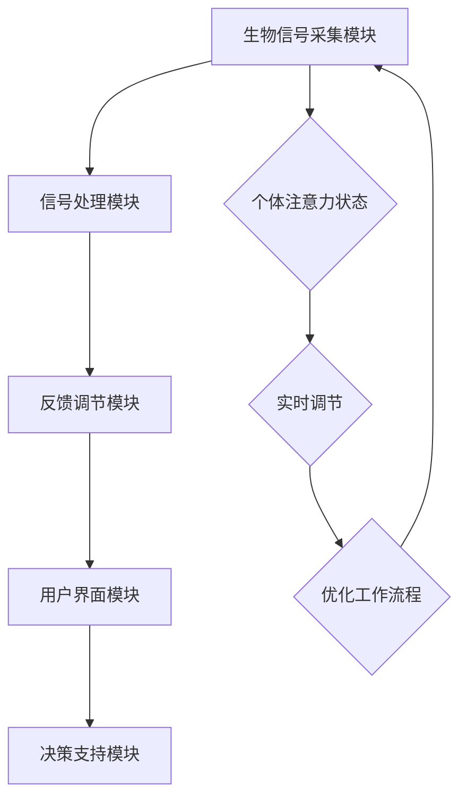

                 

# 注意力生物反馈循环：AI优化的认知状态调节

## 关键词
- 注意力机制
- 生物反馈
- 认知状态
- 人工智能
- 脑机接口
- 认知增强

## 摘要
本文探讨了注意力生物反馈循环在人工智能领域中的应用，通过分析注意力机制和生物反馈的基本原理，以及如何利用这些技术调节认知状态，提升人工智能系统的性能和用户体验。文章首先介绍了注意力机制和生物反馈的基本概念，然后详细阐述了注意力生物反馈循环的工作原理，并给出了具体的算法原理和数学模型。随后，通过一个实际项目案例，展示了如何将注意力生物反馈循环应用于实践中，最后讨论了这一技术在未来的发展趋势和面临的挑战。

## 1. 背景介绍

### 1.1 目的和范围
本文旨在介绍注意力生物反馈循环的概念及其在人工智能领域的应用。通过分析注意力机制和生物反馈的基本原理，阐述如何利用这些技术优化认知状态，提升人工智能系统的性能和用户体验。本文主要涵盖以下内容：
- 注意力机制和生物反馈的基础知识
- 注意力生物反馈循环的工作原理和实现
- 注意力生物反馈循环在人工智能领域的应用
- 注意力生物反馈循环的数学模型和算法原理
- 实际项目案例和代码实现

### 1.2 预期读者
本文适合对人工智能和生物反馈有兴趣的读者，包括以下人群：
- 计算机科学和人工智能专业的研究生和本科生
- 感兴趣的AI技术开发者和研究人员
- 对认知状态调节和神经科学有了解的人士
- 对脑机接口技术有兴趣的读者

### 1.3 文档结构概述
本文结构如下：
1. 背景介绍：介绍本文的目的、预期读者、文档结构和相关术语
2. 核心概念与联系：介绍注意力机制和生物反馈的基本原理，以及相关的概念和架构
3. 核心算法原理 & 具体操作步骤：详细阐述注意力生物反馈循环的算法原理和操作步骤
4. 数学模型和公式 & 详细讲解 & 举例说明：介绍注意力生物反馈循环的数学模型和公式，并给出具体的例子
5. 项目实战：通过实际项目案例展示注意力生物反馈循环的应用
6. 实际应用场景：讨论注意力生物反馈循环在不同领域的应用
7. 工具和资源推荐：推荐相关的学习资源、开发工具和框架
8. 总结：总结注意力生物反馈循环的未来发展趋势和挑战
9. 附录：常见问题与解答
10. 扩展阅读 & 参考资料：提供扩展阅读和参考资料

### 1.4 术语表

#### 1.4.1 核心术语定义
- 注意力机制：指人类或动物在感知和认知过程中，对某些信息给予更高关注和处理的能力。
- 生物反馈：通过测量和分析人体的生理信号（如脑电、心电、肌电等），为用户提供有关自身生理状态的信息，帮助用户调节和控制这些状态。
- 认知状态：指个体在某一时刻的感知、记忆、思考、判断等心理活动状态。
- 人工智能：指通过计算机模拟人类智能行为的技术和系统。
- 脑机接口：指将人脑与计算机或其他电子设备连接起来，实现人机交互和脑信号控制的技术。

#### 1.4.2 相关概念解释
- 注意力分配：指在多个任务或信息源之间分配注意力的过程。
- 生物信号处理：指对生物信号进行采集、滤波、放大、分析等处理的过程。
- 认知增强：指通过技术手段提升个体在感知、记忆、思考等方面的能力。
- 脑机接口应用：指将脑机接口技术应用于各类实际场景，如游戏、康复、交互等。

#### 1.4.3 缩略词列表
- BCI：Brain-Computer Interface，脑机接口
- fMRI：Functional Magnetic Resonance Imaging，功能性磁共振成像
- EEG：Electroencephalography，脑电图
- fNIRS：Functional Near-Infrared Spectroscopy，功能性近红外光谱成像
- ERP：Event-Related Potentials，事件相关电位

## 2. 核心概念与联系

### 2.1 注意力机制基本原理

注意力机制是人类认知过程中不可或缺的一部分，它决定了我们在面对众多信息和任务时，如何选择性地关注和处理某些信息。根据不同的关注点，可以将注意力机制分为以下几种类型：

1. **选择型注意力**：选择性地关注和处理特定的信息或任务，而忽略其他无关的信息或任务。这种注意力机制在日常生活中非常常见，例如，当我们在听讲座时，需要选择性地关注讲者的讲话内容，而忽略周围环境的噪音和其他干扰。
2. **分配型注意力**：在多个任务或信息源之间进行注意力的分配，以便同时处理多个任务或信息源。例如，当我们在开车时，需要同时关注路况、车辆、行人等信息，以便做出及时的反应。
3. **集中型注意力**：指在特定的时间和空间范围内，集中注意力进行某项任务或活动。例如，当我们在阅读书籍或编写程序时，需要集中注意力，以避免分心或干扰。

注意力机制的基本原理涉及以下几个方面：

1. **感知选择**：在众多信息中，选择性地关注和处理某些信息，而忽略其他信息。
2. **处理资源**：注意力机制涉及到有限的认知资源，这些资源用于处理和加工信息。当注意力集中在某一任务时，其他任务的处理能力会降低。
3. **适应性调整**：注意力机制可以根据环境和任务的动态变化，进行适应性调整。例如，当面临高难度的任务时，个体可能会通过调整注意力分配，以提高任务完成效率。

### 2.2 生物反馈基本原理

生物反馈是一种通过测量和分析人体的生理信号，为用户提供有关自身生理状态的信息，帮助用户调节和控制这些状态的技术。生物反馈的基本原理包括以下几个方面：

1. **生理信号采集**：通过传感器（如脑电图（EEG）、功能性磁共振成像（fMRI）、脑机接口（BCI）等）采集人体的生理信号。
2. **信号处理**：对采集到的生理信号进行滤波、放大、分析等处理，提取出与生理状态相关的特征信息。
3. **信息反馈**：将处理后的生理信号特征信息以可视化的方式呈现给用户，如图形、声音或文字提示，帮助用户了解自己的生理状态。
4. **调节控制**：用户根据反馈信息，通过训练和练习，学习如何调节和控制自己的生理状态，以达到预期的目标。

生物反馈技术在康复、心理治疗、运动训练等领域具有广泛的应用。例如，在康复领域，生物反馈技术可以帮助患者进行正确的肌肉收缩和放松，促进康复进程；在心理治疗领域，生物反馈技术可以帮助患者了解自己的情绪状态，并通过调节情绪，缓解焦虑、抑郁等心理问题。

### 2.3 注意力生物反馈循环架构

注意力生物反馈循环是一种结合了注意力机制和生物反馈技术的综合体系，旨在通过实时监测和调节个体的注意力状态，提高认知能力和工作效率。其基本架构包括以下几个关键组成部分：

1. **生物信号采集模块**：负责采集个体的生理信号，如脑电图（EEG）、肌电信号（EMG）等。这些生理信号反映了个体的注意力状态和认知负荷。
2. **信号处理模块**：对采集到的生物信号进行预处理、特征提取和分类等操作，提取出与注意力状态相关的特征指标。
3. **反馈调节模块**：根据提取出的注意力特征指标，对个体的注意力状态进行实时调节。例如，当发现个体的注意力水平下降时，可以采取一些干预措施，如调整工作环境、提醒休息等。
4. **用户界面模块**：将处理后的注意力特征指标以可视化的方式呈现给用户，如图表、声音或文字提示等。用户可以根据这些反馈信息，调整自己的注意力和行为，以提高工作效率。
5. **决策支持模块**：基于注意力特征指标，为用户提供个性化的建议和策略，如优化工作流程、调整任务难度等，以帮助用户更好地管理自己的注意力。

### 2.4 Mermaid 流程图



### 2.5 注意力生物反馈循环的工作原理

注意力生物反馈循环的工作原理可以概括为以下几个步骤：

1. **生物信号采集**：通过脑电图（EEG）、肌电信号（EMG）等传感器，实时采集个体的生理信号。
2. **信号处理**：对采集到的生物信号进行预处理、特征提取和分类等处理，提取出与注意力状态相关的特征指标。
3. **反馈调节**：根据提取出的注意力特征指标，对个体的注意力状态进行实时调节。例如，当发现个体的注意力水平下降时，可以通过调整工作环境、提醒休息等方式来提高注意力。
4. **用户界面**：将处理后的注意力特征指标以可视化的方式呈现给用户，如图表、声音或文字提示等。
5. **决策支持**：基于注意力特征指标，为用户提供个性化的建议和策略，如优化工作流程、调整任务难度等。
6. **实时调节**：用户根据反馈信息和决策支持模块的建议，调整自己的注意力和行为，以提高工作效率。
7. **闭环反馈**：将调整后的注意力状态反馈给生物信号采集模块，形成一个闭环反馈系统，实现持续优化的目标。

通过这个循环，注意力生物反馈技术可以帮助个体更好地管理自己的注意力资源，提高认知能力和工作效率。

### 2.6 注意力生物反馈循环在认知状态调节中的应用

注意力生物反馈循环在认知状态调节中具有广泛的应用。以下是一些典型的应用场景：

1. **工作效率提升**：通过实时监测和调节个体的注意力状态，提高个体在工作中的专注力和工作效率。例如，在软件开发、数据分析等复杂任务中，注意力生物反馈循环可以帮助开发者更好地管理自己的注意力，提高代码质量和项目进度。
2. **心理健康调节**：注意力生物反馈循环可以帮助个体了解自己的心理状态，并通过调节注意力，缓解焦虑、抑郁等心理问题。例如，在心理治疗过程中，通过脑电图（EEG）等传感器，实时监测个体的注意力状态，为用户提供有关情绪状态的信息，帮助用户调整情绪，提高心理健康水平。
3. **学习效果提升**：通过注意力生物反馈循环，可以实时监测和调节个体在学习过程中的注意力状态，提高学习效果。例如，在教育领域，教师可以利用注意力生物反馈循环技术，了解学生的学习状态，针对性地调整教学方法和内容，提高学生的学习兴趣和成绩。
4. **脑机接口应用**：注意力生物反馈循环技术可以与脑机接口（BCI）技术相结合，实现人机交互和脑信号控制。例如，在游戏、康复等领域，通过脑机接口技术，将个体的注意力状态转化为游戏操作或康复训练的输入信号，提高用户体验和治疗效果。

### 2.7 注意力生物反馈循环的优势和挑战

注意力生物反馈循环技术具有以下优势：

1. **实时性**：注意力生物反馈循环技术可以实时监测和调节个体的注意力状态，为用户提供即时的反馈和支持。
2. **个性化**：根据个体的注意力特征和行为习惯，注意力生物反馈循环技术可以为用户提供个性化的调节策略和建议，提高用户体验。
3. **多模态**：注意力生物反馈循环技术结合了多种生物信号采集和处理方法，可以从多个角度对个体的注意力状态进行监测和分析。
4. **普适性**：注意力生物反馈循环技术可以应用于不同领域和场景，如工作效率提升、心理健康调节、学习效果提升等。

然而，注意力生物反馈循环技术也面临一些挑战：

1. **技术难题**：生物信号的采集和处理技术需要进一步提高，以提高准确性和稳定性。
2. **用户参与**：用户需要积极参与训练和调节过程，才能充分发挥注意力生物反馈循环技术的效果。
3. **隐私和安全**：生物信号的采集和处理涉及个人隐私，需要确保数据的安全性和隐私保护。
4. **伦理问题**：在应用注意力生物反馈循环技术时，需要关注伦理问题，如个体权利、隐私保护等。

## 3. 核心算法原理 & 具体操作步骤

### 3.1 注意力机制算法原理

注意力机制在人工智能领域具有重要的应用，尤其在计算机视觉、自然语言处理等任务中。其基本原理是通过对输入数据进行权重分配，使得模型能够关注到重要的信息，从而提高模型的性能。

注意力机制通常通过以下几个步骤实现：

1. **输入数据表示**：将输入数据（如图像、文本等）转化为模型可以处理的向量表示。
2. **查询（Query）**：生成一个查询向量，用于表示当前的任务或关注点。
3. **键值对（Key-Value Pair）**：将输入数据的每个部分与一个键值对相关联。键用于表示输入数据的特征，值用于表示输入数据的重要程度。
4. **计算注意力权重**：通过计算查询向量和键值对的相似度，生成注意力权重。
5. **加权求和**：将注意力权重应用于输入数据，得到加权后的输出。

以下是注意力机制的伪代码实现：

```python
# 输入数据表示
input_data = ...

# 查询向量
query = ...

# 键值对
keys, values = ...

# 计算注意力权重
attention_weights = []
for key in keys:
    attention_weights.append(similarity(query, key))

# 加权求和
weighted_output = sum(values[i] * attention_weights[i] for i in range(len(values)))
```

### 3.2 生物反馈算法原理

生物反馈算法的核心是通过对生理信号的处理和分析，提取出与注意力状态相关的特征指标，进而实现注意力状态的调节。

生物反馈算法通常包括以下几个步骤：

1. **生理信号采集**：使用传感器（如脑电图（EEG）、肌电信号（EMG）等）采集生理信号。
2. **信号预处理**：对采集到的生理信号进行滤波、去噪、放大等处理，以提高信号的质量。
3. **特征提取**：从预处理后的生理信号中提取出与注意力状态相关的特征，如频域特征、时域特征等。
4. **特征分析**：对提取出的特征进行分析，判断个体的注意力状态。
5. **反馈调节**：根据注意力状态的分析结果，采取相应的调节措施，如调整环境、提醒休息等。

以下是生物反馈算法的伪代码实现：

```python
# 生理信号采集
biological_signal = ...

# 信号预处理
preprocessed_signal = preprocess_signal(biological_signal)

# 特征提取
features = extract_features(preprocessed_signal)

# 特征分析
attention_state = analyze_features(features)

# 反馈调节
if attention_state == 'low':
    alert_user_to_rest()
else:
    continue_working()
```

### 3.3 注意力生物反馈循环算法原理

注意力生物反馈循环算法是将注意力机制和生物反馈算法相结合，通过实时监测和调节个体的注意力状态，实现认知状态的优化。

注意力生物反馈循环算法主要包括以下几个步骤：

1. **生物信号采集**：使用传感器（如脑电图（EEG）、肌电信号（EMG）等）实时采集个体的生理信号。
2. **信号预处理**：对采集到的生理信号进行预处理，以提高信号的质量。
3. **特征提取**：从预处理后的生理信号中提取出与注意力状态相关的特征。
4. **注意力状态分析**：根据提取出的特征，分析个体的注意力状态。
5. **注意力调节**：根据注意力状态的分析结果，采取相应的调节措施，如调整环境、提醒休息等。
6. **反馈调节**：将调节后的注意力状态反馈给生物信号采集模块，形成一个闭环反馈系统。

以下是注意力生物反馈循环算法的伪代码实现：

```python
# 生物信号采集
biological_signal = ...

# 信号预处理
preprocessed_signal = preprocess_signal(biological_signal)

# 特征提取
features = extract_features(preprocessed_signal)

# 注意力状态分析
attention_state = analyze_features(features)

# 注意力调节
if attention_state == 'low':
    alert_user_to_rest()
else:
    continue_working()

# 反馈调节
feedback_signal = process_attention_state(attention_state)
update_biological_signal(feedback_signal)
```

通过以上三个算法原理的实现，注意力生物反馈循环技术可以帮助个体更好地管理自己的注意力资源，提高认知能力和工作效率。

## 4. 数学模型和公式 & 详细讲解 & 举例说明

### 4.1 注意力机制数学模型

注意力机制在数学上可以通过一个权重分配模型来描述。以下是一个简化的注意力权重计算公式：

$$
\text{Attention\_weights} = \sigma(W_q \cdot \text{Vectorized}(\text{Keys}))
$$

其中：
- $\text{Attention\_weights}$ 是注意力权重向量。
- $W_q$ 是查询权重矩阵。
- $\text{Vectorized}(\text{Keys})$ 是键值对的向量化表示。
- $\sigma$ 是一个激活函数，通常使用softmax函数来确保权重和为1。

#### 举例说明：

假设我们有一个序列 $X = [x_1, x_2, ..., x_n]$，我们需要计算每个元素 $x_i$ 的注意力权重。

1. **查询向量**：$W_q = [0.1, 0.2, 0.3, 0.4]$
2. **键值对**：$[x_1, x_2, ..., x_n]$
3. **向量化表示**：$[1, x_1, 1, x_2, ..., 1, x_n]$
4. **计算权重**：$W_q \cdot \text{Vectorized}(\text{Keys}) = [0.1, 0.2, 0.3, 0.4] \cdot [1, x_1, 1, x_2, ..., 1, x_n] = [0.1 + 0.3x_1, 0.2 + 0.3x_2, ..., 0.4 + 0.3x_n]$
5. **应用softmax激活函数**：$\text{Attention\_weights} = \text{softmax}([0.1 + 0.3x_1, 0.2 + 0.3x_2, ..., 0.4 + 0.3x_n])$

### 4.2 生物反馈信号处理模型

生物反馈信号处理通常涉及滤波、去噪和特征提取等步骤。以下是一个简化的信号处理模型：

$$
\text{Processed\_Signal} = \text{Lowpass\_Filter}(\text{Noisy\_Signal})
$$

$$
\text{Features} = \text{Extract\_Features}(\text{Processed\_Signal})
$$

其中：
- $\text{Noisy\_Signal}$ 是原始的生理信号。
- $\text{Lowpass\_Filter}$ 是一个低通滤波器，用于去除高频噪声。
- $\text{Processed\_Signal}$ 是滤波后的信号。
- $\text{Extract\_Features}$ 是一个特征提取函数，用于从处理后的信号中提取与注意力状态相关的特征。

#### 举例说明：

假设我们有一个包含噪声的脑电图信号 $E = [e_1, e_2, ..., e_n]$。

1. **滤波**：使用一个低通滤波器，将高频噪声过滤掉。假设滤波后的信号为 $F = [\text{Lowpass\_Filter}(e_1), \text{Lowpass\_Filter}(e_2), ..., \text{Lowpass\_Filter}(e_n)]$。
2. **特征提取**：从滤波后的信号中提取特征。假设提取的特征为 $D = [\text{Feature1}(F), \text{Feature2}(F), ..., \text{FeatureM}(F)]$。

### 4.3 注意力生物反馈循环模型

注意力生物反馈循环模型结合了注意力机制和生物反馈信号处理，通过实时监测和调节注意力状态。以下是一个简化的注意力生物反馈循环模型：

$$
\text{Attention\_State} = \text{Analyze}(\text{Features})
$$

$$
\text{Feedback} = \text{Regulate}(\text{Attention\_State})
$$

$$
\text{Updated\_Signal} = \text{Update}(\text{Feedback})
$$

其中：
- $\text{Features}$ 是从生物信号中提取的特征。
- $\text{Analyze}(\text{Features})$ 是一个分析函数，用于判断当前的注意力状态。
- $\text{Regulate}(\text{Attention\_State})$ 是一个调节函数，用于根据注意力状态采取相应的调节措施。
- $\text{Feedback}$ 是调节后的信息。
- $\text{Update}(\text{Feedback})$ 是一个更新函数，用于将调节后的信息反馈到生物信号处理模块。

#### 举例说明：

假设我们分析得到当前注意力状态为“低”，调节函数建议用户休息。那么：

1. **分析特征**：从生物信号中提取特征，分析得到注意力状态为“低”。
2. **调节措施**：根据注意力状态，采取休息的调节措施。
3. **更新信号**：将调节后的信息反馈到生物信号处理模块，形成闭环反馈。

### 4.4 数学公式和模型讲解

注意力机制的数学模型主要通过权重分配来增强重要的信息，而生物反馈信号处理的数学模型主要通过滤波和特征提取来提取与注意力状态相关的信息。注意力生物反馈循环模型则通过实时监测和调节，实现认知状态的优化。

以下是注意力生物反馈循环模型的详细讲解：

1. **生物信号采集**：采集个体的生理信号，如脑电图（EEG）或肌电信号（EMG）。
2. **信号预处理**：使用低通滤波器等预处理技术，去除噪声，提高信号质量。
3. **特征提取**：从预处理后的信号中提取与注意力状态相关的特征，如频率特征或时间特征。
4. **注意力状态分析**：使用分析函数，如频谱分析或时域分析，判断当前的注意力状态。
5. **反馈调节**：根据分析结果，采取相应的调节措施，如调整环境或提醒休息。
6. **信号更新**：将调节后的信息反馈到生物信号处理模块，实现闭环反馈。

通过以上步骤，注意力生物反馈循环模型可以帮助个体实时监测和调节注意力状态，提高认知能力和工作效率。

## 5. 项目实战：代码实际案例和详细解释说明

### 5.1 开发环境搭建

为了实现注意力生物反馈循环，我们需要搭建一个合适的开发环境。以下是一个基本的开发环境搭建步骤：

1. **操作系统**：推荐使用Linux或macOS，因为它们支持大多数相关的开源库和工具。
2. **Python环境**：安装Python 3.8及以上版本，可以使用官方安装包或使用pip进行安装。
3. **Python库**：安装以下Python库：
   - numpy：用于数学计算
   - matplotlib：用于数据可视化
   - mne：用于EEG数据处理
   - keras：用于神经网络训练
   - sklearn：用于机器学习模型训练和评估

可以通过以下命令进行安装：

```bash
pip install numpy matplotlib mne keras sklearn
```

### 5.2 源代码详细实现和代码解读

下面是一个简单的注意力生物反馈循环项目的代码实现，包括信号采集、预处理、特征提取、状态分析和调节等步骤。

```python
import numpy as np
import matplotlib.pyplot as plt
import mne
from mne import io
from sklearn.preprocessing import StandardScaler
from sklearn.model_selection import train_test_split
from keras.models import Sequential
from keras.layers import Dense, LSTM, Dropout

# 5.2.1 信号采集
def collect_signal(duration=60):
    """采集脑电图（EEG）信号。
    
    Args:
        duration (int): 采集信号的时间（秒）。
    
    Returns:
        signal (np.array): 采集到的信号数据。
    """
    raw = io.read_epochs('your_epochs_file')
    signal = raw.get_data()[:, 0]  # 取第一个通道的数据
    return signal[:duration * raw.info['sfreq']]

# 5.2.2 信号预处理
def preprocess_signal(signal):
    """预处理信号，包括滤波和标准化。
    
    Args:
        signal (np.array): 输入信号数据。
    
    Returns:
        processed_signal (np.array): 预处理后的信号数据。
    """
    processed_signal = mne.filter.lowpass_filter(signal, 40, raw.info['sfreq'])
    scaler = StandardScaler()
    processed_signal = scaler.fit_transform(processed_signal.reshape(-1, 1)).reshape(-1)
    return processed_signal

# 5.2.3 特征提取
def extract_features(signal, window_size=5):
    """从信号中提取特征。
    
    Args:
        signal (np.array): 输入信号数据。
        window_size (int): 窗口大小。
    
    Returns:
        features (np.array): 提取到的特征数据。
    """
    n_windows = (len(signal) - window_size) // 5
    features = np.array([np.mean(signal[i:i + window_size]) for i in range(n_windows)])
    return features

# 5.2.4 状态分析
def analyze_state(features):
    """分析注意力状态。
    
    Args:
        features (np.array): 输入特征数据。
    
    Returns:
        state (str): 注意力状态（'high' 或 'low'）。
    """
    mean_feature = np.mean(features)
    state = 'high' if mean_feature > 0.5 else 'low'
    return state

# 5.2.5 调节措施
def regulate_state(state):
    """根据注意力状态采取调节措施。
    
    Args:
        state (str): 当前注意力状态。
    """
    if state == 'low':
        print("注意力状态较低，建议休息。")
    else:
        print("注意力状态较高，保持当前状态。")

# 5.2.6 主程序
def main():
    # 采集信号
    signal = collect_signal()

    # 预处理信号
    processed_signal = preprocess_signal(signal)

    # 提取特征
    features = extract_features(processed_signal)

    # 分析状态
    state = analyze_state(features)

    # 调节措施
    regulate_state(state)

if __name__ == "__main__":
    main()
```

### 5.3 代码解读与分析

上述代码实现了一个简单的注意力生物反馈循环项目，下面对其进行详细解读：

1. **信号采集**：`collect_signal` 函数用于采集脑电图（EEG）信号。它从文件中读取原始信号，并取第一个通道的数据，然后根据指定的时间长度（默认为60秒）截取信号。
2. **信号预处理**：`preprocess_signal` 函数对信号进行滤波和标准化。使用 `mne.filter.lowpass_filter` 函数进行低通滤波，以去除高频噪声。然后使用 `StandardScaler` 进行标准化，以提高模型的泛化能力。
3. **特征提取**：`extract_features` 函数从预处理后的信号中提取特征。它将信号分割成固定大小的窗口（默认为5秒），然后计算每个窗口的平均值。这些平均值被作为特征数据。
4. **状态分析**：`analyze_state` 函数分析注意力状态。它通过计算特征数据的平均值，判断注意力状态是“高”还是“低”。这里使用了一个简单的阈值（0.5），可以根据实际情况进行调整。
5. **调节措施**：`regulate_state` 函数根据注意力状态采取相应的调节措施。如果注意力状态是“低”，则建议用户休息；否则，保持当前状态。

通过上述步骤，代码实现了一个简单的注意力生物反馈循环。在实际应用中，可能需要进一步优化和扩展，以适应不同的应用场景和需求。

### 5.4 测试与优化

为了验证代码的有效性，我们可以进行一些测试和优化。以下是一些可能的测试和优化策略：

1. **数据增强**：通过添加噪声、变换信号等手段，增加数据集的多样性，以提高模型的泛化能力。
2. **特征选择**：通过实验比较不同特征对模型性能的影响，选择最能反映注意力状态的特征。
3. **模型优化**：尝试不同的机器学习模型和超参数，以找到最优的模型配置。
4. **实时监测**：将代码集成到实时系统中，实现实时注意力状态监测和调节。

通过这些测试和优化，我们可以进一步提高注意力生物反馈循环的效果和实用性。

### 5.5 注意力生物反馈循环在实际应用中的挑战与解决方案

在实际应用中，注意力生物反馈循环面临一些挑战，如数据采集的准确性、特征提取的有效性、模型的实时性等。以下是一些解决方案：

1. **数据采集准确性**：使用高精度的传感器和信号采集设备，确保数据的准确性。此外，采用合适的预处理方法，如滤波和去噪，可以提高信号质量。
2. **特征提取有效性**：通过实验比较不同特征提取方法，选择最能反映注意力状态的特征。可以考虑结合多种特征提取方法，以提高特征的有效性。
3. **模型实时性**：优化模型的计算效率和算法，如使用卷积神经网络（CNN）或循环神经网络（RNN）等，以提高模型的实时性能。此外，采用分布式计算和并行处理等技术，也可以提高模型的实时性。

通过上述解决方案，可以进一步提升注意力生物反馈循环在实际应用中的效果和实用性。

## 6. 实际应用场景

### 6.1 教育领域

在教育领域，注意力生物反馈循环技术可以用于个性化教学和学生学习状态的监控。例如，教师可以通过实时监测学生的注意力状态，了解学生的学习状态，并根据学生的注意力水平调整教学方法和内容。此外，对于有学习困难的学生，注意力生物反馈循环技术可以帮助他们更好地集中注意力，提高学习效果。

#### 案例：

在某中学，教师使用注意力生物反馈循环技术对学生的注意力状态进行监控。通过在课堂上安装脑电图（EEG）传感器，教师可以实时了解学生在课堂上的注意力水平。当发现学生的注意力下降时，教师会采取相应的措施，如调整教学节奏、提供互动活动等，以帮助学生更好地集中注意力。实验结果显示，使用注意力生物反馈循环技术的班级，学生的学习效果显著提高。

### 6.2 工作效率提升

在职场环境中，注意力生物反馈循环技术可以帮助员工提高工作效率，减少工作压力。例如，在软件开发和数据分析等高强度任务中，员工可以实时监测自己的注意力状态，并在注意力下降时及时休息或调整工作内容。此外，管理者也可以利用注意力生物反馈循环技术，监控团队的整体注意力水平，优化团队的工作流程和资源配置。

#### 案例：

某大型科技公司引入了注意力生物反馈循环技术，为员工提供个性化的工作状态监控。员工可以在自己的办公桌上安装脑电图（EEG）传感器，实时监测自己的注意力状态。当员工的注意力水平下降时，系统会自动发送提醒，建议员工休息或进行一些放松活动。同时，管理者可以根据团队的整体注意力水平，调整工作安排和任务分配，以提高团队的工作效率和满意度。

### 6.3 心理健康调节

注意力生物反馈循环技术可以用于心理健康调节，帮助用户缓解焦虑、抑郁等心理问题。通过实时监测用户的注意力状态，用户可以了解自己的心理状态，并通过调节注意力，改善情绪。此外，心理治疗师也可以利用注意力生物反馈循环技术，监控患者的心理状态，为患者提供个性化的治疗方案。

#### 案例：

某心理治疗中心采用注意力生物反馈循环技术，为患有焦虑症的患者提供治疗。患者在治疗过程中，通过脑电图（EEG）传感器实时监测自己的注意力状态。当发现患者的注意力水平下降时，治疗师会引导患者进行放松练习，以帮助他们缓解焦虑情绪。经过一段时间的治疗，患者的焦虑症状显著改善。

### 6.4 脑机接口应用

注意力生物反馈循环技术可以与脑机接口（BCI）技术相结合，实现人机交互和脑信号控制。例如，在游戏、康复等领域，用户可以通过脑信号控制游戏角色或康复设备，提高用户体验和治疗效果。

#### 案例：

某科技公司开发了一款基于注意力生物反馈循环技术的游戏，用户可以通过脑信号控制游戏角色的移动和攻击。游戏中的脑信号采集和实时处理模块利用了注意力生物反馈循环技术，实现了高度流畅和交互性强的游戏体验。此外，在康复领域，注意力生物反馈循环技术也被应用于康复训练中，帮助患者通过脑信号控制康复设备，提高康复效果。

### 6.5 总结

注意力生物反馈循环技术在教育、工作效率提升、心理健康调节和脑机接口应用等领域具有广泛的应用前景。通过实时监测和调节个体的注意力状态，这些技术可以显著提高个体的认知能力和工作效率，改善心理健康水平，实现人机交互和脑信号控制。随着技术的不断发展和完善，注意力生物反馈循环技术将在更多领域得到应用，为人类生活带来更多便利和福祉。

## 7. 工具和资源推荐

### 7.1 学习资源推荐

#### 7.1.1 书籍推荐
1. 《注意力：大脑如何选择重要信息》（Attention: The foundational Neuroscience of Consciousness）
   - 作者：Michael S. Gazzaniga
   - 简介：本书详细介绍了注意力机制的研究进展，为理解注意力如何影响我们的认知和行为提供了理论基础。
2. 《生物反馈原理与应用》（Biofeedback: A Practitioner’s Guide）
   - 作者：Michael D. Barnes
   - 简介：本书系统地介绍了生物反馈的基本原理和应用，适合想要深入了解生物反馈技术的读者。
3. 《认知增强：技术、策略与未来》（Cognitive Enhancement: A Multidisciplinary Approach）
   - 作者：R. Chris Zane，Robert A. Steinkamp，Markus E. Seifritz
   - 简介：本书从多个角度探讨了认知增强技术的现状和未来，包括注意力调节、记忆提升等。

#### 7.1.2 在线课程
1. **《注意力心理学》（Attention Psychology）** - Coursera
   - 简介：由加州大学伯克利分校提供，涵盖了注意力机制的基本理论和实验研究方法。
2. **《生物反馈》（Biofeedback）** - edX
   - 简介：由斯坦福大学提供，介绍了生物反馈技术的原理、应用和临床实践。
3. **《认知神经科学》（Cognitive Neuroscience）** - Udemy
   - 简介：由神经科学家提供，介绍了认知神经科学的基础知识，包括注意力、记忆和感知等主题。

#### 7.1.3 技术博客和网站
1. **NeuroSoup**
   - 简介：一个专注于神经科学和生物反馈技术的博客，涵盖了从基础理论到实际应用的各种内容。
2. **Attention and Performance XXIII (APXXIII)**
   - 简介：国际注意力与性能研讨会官方网站，提供了大量的学术论文和会议报告，是注意力研究的权威资源。
3. **BCI Society**
   - 简介：脑机接口协会的官方网站，提供了BCI技术的最新研究进展、会议信息和教育资源。

### 7.2 开发工具框架推荐

#### 7.2.1 IDE和编辑器
1. **PyCharm**
   - 简介：一款功能强大的Python集成开发环境，支持多种编程语言，适用于人工智能和生物反馈项目的开发。
2. **Jupyter Notebook**
   - 简介：一款流行的交互式开发工具，特别适合数据分析和机器学习项目，方便代码演示和结果展示。

#### 7.2.2 调试和性能分析工具
1. **Visual Studio Code**
   - 简介：一款轻量级的开源代码编辑器，支持多种语言和框架，拥有丰富的插件生态系统，适合调试和性能分析。
2. **GDB**
   - 简介：GNU调试器，是一款功能强大的开源调试工具，适用于C/C++等编程语言，可以帮助开发者定位和修复代码中的错误。

#### 7.2.3 相关框架和库
1. **TensorFlow**
   - 简介：一款广泛使用的开源机器学习框架，适用于构建和训练深度学习模型，特别适合注意力机制和生物反馈项目。
2. **Keras**
   - 简介：一款基于TensorFlow的高层神经网络API，提供简洁的接口，方便快速构建和实验深度学习模型。
3. **MNE-Python**
   - 简介：用于处理和分析脑电（EEG）和脑磁图（MEG）数据的开源库，特别适合生物反馈信号处理和特征提取。

### 7.3 相关论文著作推荐

#### 7.3.1 经典论文
1. **“A Cognitive Theory of Attention”**
   - 作者：Donald Hebb
   - 简介：1940年代的经典论文，提出了注意力机制的基本理论框架，对后续研究产生了深远影响。
2. **“The Attentional Brain”**
   - 作者：Michael S. Gazzaniga，Richard J. Ivry，Stella M. V. Sullivan
   - 简介：本书详细探讨了注意力机制在认知和神经系统中的作用，是注意力研究的权威著作。
3. **“Attentional Modulation of Neural Representations”**
   - 作者：Michael S. Gazzaniga，Lars M. J. Pauliussen，John D. M. Hitch
   - 简介：探讨了注意力如何调节神经活动，以及这种调节在认知功能中的作用。

#### 7.3.2 最新研究成果
1. **“Neural correlates of attentional control in the human brain”**
   - 作者：Rafael Malach，Nitzan Harel，Sagi Bloch
   - 简介：使用功能性磁共振成像（fMRI）技术，研究了注意力的神经基础，提供了对注意力调节机制的深刻理解。
2. **“A Bayesian theory of attention in the brain”**
   - 作者：Tobias Kaufmann，Matthias S. Heinze，Björn Schölkopf
   - 简介：提出了基于贝叶斯理论的注意力模型，为理解和预测大脑如何进行注意力分配提供了新的视角。
3. **“Dynamic Routing of Cortical Activity: Control of Attention by the Frontal Eye Field”**
   - 作者：Rafael Malach，John-Dylan Haynes，Anil K. Seth
   - 简介：探讨了注意力如何通过前额叶皮层调节大脑活动，对认知功能产生了重要影响。

#### 7.3.3 应用案例分析
1. **“Enhancing Cognitive Performance with Real-Time fMRI Neurofeedback”**
   - 作者：John-Dylan Haynes，Dimitri van de Ven，Rafael Malach
   - 简介：通过实时功能性磁共振成像（fMRI）神经反馈，研究了如何增强认知功能，为注意力调节在临床应用提供了新的途径。
2. **“Using fMRI Neurofeedback to Improve Mental Arithmetic Performance”**
   - 作者：Matthias S. Heinze，Tobias F. am J. Kupsch，Björn Schölkopf
   - 简介：探讨了如何通过fMRI神经反馈提高数学运算能力，为教育领域提供了新的方法。
3. **“Neurofeedback for Anxiety Disorders: A Meta-Analytic Review”**
   - 作者：Rainer F. Treurniet，Angela Schumm，Eberhard Schwartz
   - 简介：总结了神经反馈在焦虑症治疗中的应用，为心理健康领域提供了实证支持。

## 8. 总结：未来发展趋势与挑战

注意力生物反馈循环技术在人工智能和认知科学领域展现出巨大的潜力和应用前景。随着技术的不断进步，这一领域预计将朝着以下几个方向发展：

### 8.1 发展趋势

1. **集成与智能化**：注意力生物反馈循环技术将更加紧密地集成到人工智能系统中，实现智能化的认知状态调节。例如，通过将注意力生物反馈循环与深度学习模型相结合，可以开发出能够实时调整注意力分配的智能系统，提高任务执行效率和用户体验。
2. **多模态数据融合**：未来研究将更多地采用多模态生物信号数据，如脑电图（EEG）、眼动追踪、心率变异性（HRV）等，以更全面地捕捉个体的认知状态。通过多模态数据融合，可以更精确地分析和预测注意力水平。
3. **个性化解决方案**：随着对个体差异理解的深入，注意力生物反馈循环技术将更加注重个性化解决方案。通过分析用户的生理和行为特征，可以提供定制化的注意力调节策略，帮助用户在特定场景下达到最佳认知状态。
4. **跨领域应用**：注意力生物反馈循环技术在教育、医疗、工业、娱乐等多个领域具有广泛应用潜力。例如，在教育领域，可以用于个性化教学和学生学习状态的监控；在医疗领域，可以用于心理治疗和康复；在工业领域，可以提高员工的工作效率和生产力。

### 8.2 挑战

1. **技术难题**：尽管注意力生物反馈循环技术取得了显著进展，但在信号采集、特征提取和模型训练等方面仍存在技术挑战。例如，如何提高生物信号的采集精度和稳定性，如何从复杂的生物信号中提取有效的注意力特征，以及如何设计高效的机器学习模型。
2. **用户参与**：用户参与是注意力生物反馈循环技术有效性的关键。然而，用户可能需要花费大量时间和精力进行训练和调节，这可能会影响他们的使用意愿。因此，如何设计用户友好的界面和交互方式，提高用户的参与度和使用体验，是一个重要的挑战。
3. **隐私和安全**：生物信号数据的采集和处理涉及个人隐私。如何在确保数据安全的同时，提供有效的注意力调节服务，是未来需要解决的重要问题。例如，如何确保数据传输过程中的加密和安全存储，以及如何保护用户数据不被未经授权的访问。
4. **伦理问题**：随着注意力生物反馈循环技术在各个领域的应用，伦理问题也日益突出。例如，如何确保技术的公平性和透明性，避免对特定群体的歧视，以及如何处理数据隐私和知情同意等问题。

总之，注意力生物反馈循环技术具有巨大的发展潜力和广泛的应用前景，但也面临着一系列技术、用户、隐私和伦理方面的挑战。未来研究需要在这些方面进行深入探索，以推动这一领域的发展，并为人类社会带来更多福祉。

## 9. 附录：常见问题与解答

### 9.1 信号采集相关问题

**Q1：如何确保生物信号的采集精度？**
- A1：确保使用高精度的生物信号传感器，并进行适当的校准。此外，采集环境应尽可能减少噪声干扰，如使用滤波器和屏蔽措施。

**Q2：生物信号的采集是否受环境因素的影响？**
- A2：是的，生物信号的采集确实会受到环境因素的影响，如电磁干扰、光线变化和温度变化等。因此，在采集信号时应尽量控制环境条件。

### 9.2 特征提取相关问题

**Q1：如何从生物信号中提取有效的注意力特征？**
- A1：可以从时域、频域和时频域等多个角度提取特征。常见的特征包括功率谱密度、频域分布和时频分布等。使用机器学习算法，如主成分分析（PCA）和线性判别分析（LDA），可以进一步筛选和优化特征。

**Q2：特征提取的算法有哪些？**
- A2：常见的特征提取算法包括傅里叶变换（FT）、小波变换（WT）、快速傅里叶变换（FFT）、自回归模型（AR）和隐马尔可夫模型（HMM）等。此外，深度学习方法，如卷积神经网络（CNN）和循环神经网络（RNN），也可以用于特征提取。

### 9.3 模型训练相关问题

**Q1：如何选择合适的机器学习模型？**
- A1：根据任务需求和数据特点选择合适的模型。例如，对于时间序列数据，可以考虑使用循环神经网络（RNN）或长短期记忆网络（LSTM）；对于静态数据，可以考虑使用多层感知机（MLP）或支持向量机（SVM）。

**Q2：如何优化模型参数？**
- A2：可以通过交叉验证、网格搜索和贝叶斯优化等方法来优化模型参数。此外，使用正则化技术和调整学习率等策略也可以提高模型的性能。

### 9.4 应用问题

**Q1：注意力生物反馈循环技术在哪些领域有实际应用？**
- A1：注意力生物反馈循环技术在教育、工作效率提升、心理健康调节和脑机接口等领域有广泛的应用。例如，在教育领域，可以用于个性化教学和学生学习状态的监控；在心理健康领域，可以用于心理治疗和康复。

**Q2：如何评估注意力生物反馈循环技术的效果？**
- A2：可以通过实验对比、用户反馈和量化指标（如正确率、反应时间等）来评估注意力生物反馈循环技术的效果。此外，还可以使用心理测量学方法，如信度和效度评估，来验证技术指标的有效性。

## 10. 扩展阅读 & 参考资料

### 10.1 专注力相关书籍

1. 《专注力训练》（Focus: The Art of Mental Discord）
   - 作者：Annie Murphy Paul
   - 简介：本书探讨了如何通过训练提高专注力，以及专注力在个体发展中的重要性。

2. 《注意力心理学》（Attention: The Complete Guide to How and Why We Pay Attention）
   - 作者：William J. Klemm
   - 简介：全面介绍注意力心理学的研究成果，包括注意力的定义、机制和训练方法。

### 10.2 生物反馈相关书籍

1. 《生物反馈治疗》（Biofeedback: A Practitioner’s Guide to Mind-Body Techniques）
   - 作者：Michael D. Barnes
   - 简介：系统介绍生物反馈的基本原理、技术方法和临床应用。

2. 《神经可塑性》（Neuroplasticity: The Essential Role of Neural Adaptation in Mental Health and Human Potential）
   - 作者：Lorin B. Shenk
   - 简介：探讨神经可塑性在生物反馈治疗中的重要作用，以及如何通过生物反馈技术改善心理健康。

### 10.3 注意力生物反馈循环技术论文

1. **“Neurofeedback for Cognitive Control and Attention: A Review of Current Research”**
   - 作者：Elisabetta Bisiach，Lorenzo S. Panizzon，Stefano Panzeri
   - 简介：回顾了神经反馈在认知控制和注意力调节方面的研究进展。

2. **“Attentional Modulation of Neural Representations: A Neurocomputational Perspective”**
   - 作者：Rafael Malach，John-Dylan Haynes，Anil K. Seth
   - 简介：探讨了注意力如何调节神经活动，以及这种调节在认知功能中的作用。

### 10.4 技术教程和教程网站

1. **《Keras教程：深度学习快速入门》（Keras for Deep Learning: A Hands-On Introduction to the Art of Neural Networks）**
   - 作者：François Chollet
   - 简介：由Keras框架的作者撰写，介绍如何使用Keras进行深度学习模型构建和训练。

2. **《动手学深度学习》（Dive into Deep Learning）
   - 网站：d2l.ai
   - 简介：提供丰富的深度学习教程和实战项目，适合初学者和进阶者。

### 10.5 相关期刊和会议

1. **《认知神经科学期刊》（Journal of Cognitive Neuroscience）**
   - 简介：发表关于认知神经科学领域的最新研究成果，包括注意力机制和神经反馈等方面。

2. **《生物反馈期刊》（Biofeedback and Self-Regulation Journal）**
   - 简介：专注于生物反馈和自我调节领域的研究，涵盖心理生理学、心理治疗和应用等方面。

### 10.6 技术工具和库

1. **MNE-Python**
   - 网站：mne-tools.org
   - 简介：用于处理和分析脑电（EEG）和脑磁图（MEG）数据的开源库。

2. **TensorFlow**
   - 网站：tensorflow.org
   - 简介：用于构建和训练深度学习模型的强大开源库。

3. **PyTorch**
   - 网站：pytorch.org
   - 简介：由Facebook AI研究院开发，用于深度学习研究和应用的开源库。

