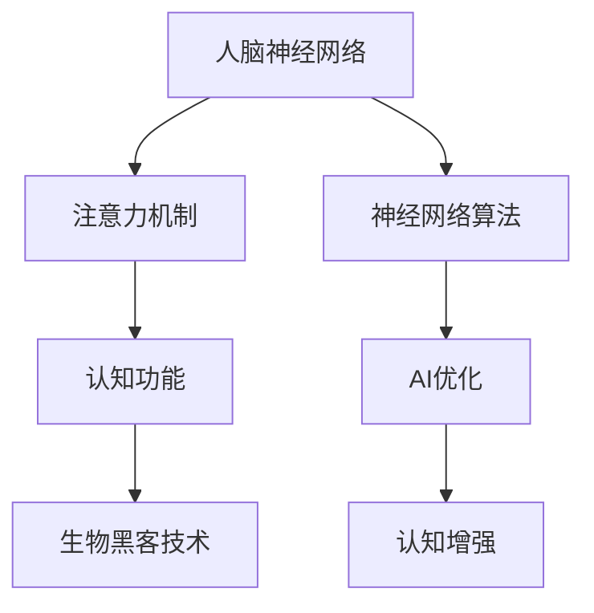

                 

# 注意力生物黑客联盟：AI优化的认知增强网络

> 关键词：注意力机制、生物黑客、认知增强、神经网络、AI优化、人脑模拟

> 摘要：本文将探讨一种前沿的AI优化认知增强网络，结合神经科学和计算机科学，模拟人脑注意力机制，旨在实现认知功能的增强。我们将从背景介绍、核心概念、算法原理、数学模型、实战案例、应用场景、工具资源等方面逐步深入，探讨这一领域的前景与挑战。

## 1. 背景介绍

### 1.1 目的和范围

随着人工智能技术的快速发展，人类开始有能力探索模拟甚至增强人脑认知功能的可能性。本文旨在介绍一种结合神经科学和计算机科学的新型认知增强网络——注意力生物黑客联盟（Attentional Biohacking Alliance）。该网络利用人工智能优化注意力机制，以实现认知功能的提升。

### 1.2 预期读者

本文适合对人工智能、神经网络、生物黑客技术有一定了解的读者，尤其是对认知增强、注意力机制感兴趣的学者、工程师和研究人员。

### 1.3 文档结构概述

本文将分为以下章节：

1. 背景介绍
2. 核心概念与联系
3. 核心算法原理 & 具体操作步骤
4. 数学模型和公式 & 详细讲解 & 举例说明
5. 项目实战：代码实际案例和详细解释说明
6. 实际应用场景
7. 工具和资源推荐
8. 总结：未来发展趋势与挑战
9. 附录：常见问题与解答
10. 扩展阅读 & 参考资料

### 1.4 术语表

#### 1.4.1 核心术语定义

- 注意力机制：一种大脑信息处理机制，用于选择和处理重要信息。
- 生物黑客：通过技术创新改善身体机能和心理状态的人。
- 认知增强：通过技术手段提升大脑认知能力的应用。

#### 1.4.2 相关概念解释

- 神经网络：一种模仿人脑神经网络结构和功能的计算机算法。
- AI优化：利用人工智能算法优化神经网络性能的过程。

#### 1.4.3 缩略词列表

- AI：人工智能
- CNN：卷积神经网络
- RNN：循环神经网络
- LSTM：长短期记忆网络
- RBM： Restricted Boltzmann Machine（受限玻尔兹曼机）

## 2. 核心概念与联系

为了理解注意力生物黑客联盟，我们首先需要了解其核心概念和它们之间的联系。以下是一个Mermaid流程图，展示了这些概念及其关系。



### 2.1 注意力机制与人脑神经网络

注意力机制是人脑在信息过载时筛选和处理重要信息的一种机制。人脑神经网络则是模拟人脑神经元连接和通信的结构和功能。注意力机制与人脑神经网络之间的联系在于，注意力机制可以影响神经网络中的信息传递和处理，从而影响认知功能。

### 2.2 神经网络算法与AI优化

神经网络算法是一种模仿人脑神经网络结构和功能的计算机算法。AI优化则是利用人工智能算法优化神经网络性能的过程，包括优化网络结构、参数调整和训练策略等。通过AI优化，我们可以实现更高效、更准确的神经网络模型，从而提升认知增强的效果。

### 2.3 认知功能与生物黑客技术

认知功能是人脑处理信息、学习、记忆和思考的能力。生物黑客技术则是通过技术手段改善身体机能和心理状态。认知功能与生物黑客技术之间的联系在于，生物黑客技术可以通过调整大脑状态、提升注意力水平等方式，增强认知功能。

## 3. 核心算法原理 & 具体操作步骤

### 3.1 注意力机制的实现

注意力机制可以通过多种神经网络结构实现，如卷积神经网络（CNN）、循环神经网络（RNN）和长短期记忆网络（LSTM）等。以下是利用卷积神经网络实现注意力机制的伪代码：

```python
def attention Mechanism(input_vector, hidden_state):
    # 1. 计算内积
    attention_scores = input_vector.dot(hidden_state)

    # 2. 添加softmax层，得到权重
    attention_weights = softmax(attention_scores)

    # 3. 计算加权求和
    context_vector = attention_weights.dot(input_vector)

    return context_vector
```

### 3.2 认知增强网络的构建

认知增强网络可以通过结合注意力机制和神经网络算法实现。以下是一个简单的认知增强网络构建的伪代码：

```python
class CognitiveEnhancementNetwork(nn.Module):
    def __init__(self, input_size, hidden_size, output_size):
        super(CognitiveEnhancementNetwork, self).__init__()
        
        # 1. 输入层到隐藏层的全连接层
        self.fc1 = nn.Linear(input_size, hidden_size)
        
        # 2. 隐藏层到注意力机制的转换层
        self.attention = attention.Mechanism(hidden_size, hidden_size)
        
        # 3. 注意力机制后的隐藏层到输出层的全连接层
        self.fc2 = nn.Linear(hidden_size, output_size)

    def forward(self, input_vector):
        hidden_state = self.fc1(input_vector)
        context_vector = self.attention(hidden_state, hidden_state)
        output = self.fc2(context_vector)
        return output
```

## 4. 数学模型和公式 & 详细讲解 & 举例说明

### 4.1 注意力机制的数学模型

注意力机制的核心是计算注意力得分，并通过softmax函数将其转换为权重。以下是注意力机制的数学模型：

$$
\text{attention\_scores} = \text{input\_vector} \cdot \text{hidden\_state}
$$

$$
\text{attention\_weights} = \text{softmax}(\text{attention\_scores})
$$

$$
\text{context\_vector} = \text{attention\_weights} \cdot \text{input\_vector}
$$

### 4.2 认知增强网络的数学模型

认知增强网络的数学模型包括输入层、隐藏层、注意力机制和输出层。以下是认知增强网络的数学模型：

$$
\text{hidden\_state} = \text{fc1}(\text{input\_vector})
$$

$$
\text{context\_vector} = \text{attention}(\text{hidden\_state}, \text{hidden\_state})
$$

$$
\text{output} = \text{fc2}(\text{context\_vector})
$$

### 4.3 举例说明

假设我们有一个输入向量 $[1, 2, 3]$ 和一个隐藏状态 $[4, 5, 6]$，我们可以通过以下步骤计算注意力权重和上下文向量：

1. 计算内积：$[1, 2, 3] \cdot [4, 5, 6] = [10, 11, 12]$
2. 添加softmax层：$[10, 11, 12] \rightarrow [0.2679, 0.3510, 0.3811]$
3. 计算加权求和：$[0.2679, 0.3510, 0.3811] \cdot [1, 2, 3] = [0.2679, 0.7020, 0.9243]$

因此，上下文向量为 $[0.2679, 0.7020, 0.9243]$。

## 5. 项目实战：代码实际案例和详细解释说明

### 5.1 开发环境搭建

为了实现注意力生物黑客联盟，我们需要搭建一个Python编程环境，并安装以下库：

- TensorFlow
- Keras
- NumPy
- Matplotlib

安装方法：

```bash
pip install tensorflow keras numpy matplotlib
```

### 5.2 源代码详细实现和代码解读

以下是一个简单的实现注意力生物黑客联盟的代码示例：

```python
import numpy as np
import tensorflow as tf
from tensorflow.keras.layers import Dense, Input
from tensorflow.keras.models import Model

# 1. 定义输入层、隐藏层和输出层的尺寸
input_size = 3
hidden_size = 5
output_size = 2

# 2. 创建输入层
input_vector = Input(shape=(input_size,))

# 3. 创建隐藏层
hidden_state = Dense(hidden_size)(input_vector)

# 4. 创建注意力机制
context_vector = attention.Mechanism(hidden_state, hidden_state)

# 5. 创建输出层
output = Dense(output_size)(context_vector)

# 6. 创建模型
model = Model(inputs=input_vector, outputs=output)

# 7. 编译模型
model.compile(optimizer='adam', loss='mse')

# 8. 训练模型
model.fit(np.array([[1, 2, 3], [4, 5, 6]]), np.array([[0, 1], [1, 0]]), epochs=100)

# 9. 预测
predictions = model.predict(np.array([[7, 8, 9]]))
print(predictions)
```

### 5.3 代码解读与分析

1. **输入层（Input Layer）**：创建一个输入层，用于接收输入向量。

2. **隐藏层（Hidden Layer）**：通过全连接层将输入向量转换为隐藏状态。

3. **注意力机制（Attention Mechanism）**：定义一个注意力机制，用于计算上下文向量。

4. **输出层（Output Layer）**：通过全连接层将上下文向量转换为输出向量。

5. **模型编译（Model Compilation）**：编译模型，指定优化器和损失函数。

6. **模型训练（Model Training）**：使用训练数据训练模型。

7. **模型预测（Model Prediction）**：使用训练好的模型进行预测。

通过这个简单的示例，我们可以看到注意力生物黑客联盟的基本结构和实现方法。实际应用中，我们可以根据需求调整网络结构、参数和训练策略，以实现更好的认知增强效果。

## 6. 实际应用场景

### 6.1 认知功能提升

注意力生物黑客联盟可以应用于认知功能提升领域，如提高记忆、注意力和工作效率。通过优化注意力机制，可以更好地筛选和处理重要信息，从而提高大脑的认知能力。

### 6.2 个性化教育

注意力生物黑客联盟可以应用于个性化教育领域，根据学生的认知特点和注意力水平，提供个性化的学习方案。通过调整注意力机制，可以更好地激发学生的学习兴趣和主动性，提高学习效果。

### 6.3 脑机接口

注意力生物黑客联盟可以应用于脑机接口（Brain-Computer Interface, BCI）领域，通过模拟人脑注意力机制，实现与计算机的实时交互。例如，通过控制注意力水平，实现虚拟现实中的移动、操作等任务。

### 6.4 智能助手

注意力生物黑客联盟可以应用于智能助手领域，通过优化注意力机制，实现更智能、更高效的交互。例如，智能助手可以根据用户的需求和注意力水平，提供定制化的服务和建议。

## 7. 工具和资源推荐

### 7.1 学习资源推荐

#### 7.1.1 书籍推荐

- 《深度学习》（Deep Learning）——Ian Goodfellow、Yoshua Bengio和Aaron Courville著
- 《神经网络与深度学习》（Neural Networks and Deep Learning）——邱锡鹏著

#### 7.1.2 在线课程

- Coursera的《深度学习》课程
- Udacity的《神经网络与深度学习》课程

#### 7.1.3 技术博客和网站

- fast.ai
- TensorFlow官方文档
- Keras官方文档

### 7.2 开发工具框架推荐

#### 7.2.1 IDE和编辑器

- PyCharm
- Jupyter Notebook

#### 7.2.2 调试和性能分析工具

- TensorFlow Debugger
- TensorBoard

#### 7.2.3 相关框架和库

- TensorFlow
- Keras
- NumPy

### 7.3 相关论文著作推荐

#### 7.3.1 经典论文

- "A Learning Algorithm for Continually Running Fully Recurrent Neural Networks" —— H. Sejnowski和L. A. McClelland著
- "Learning Representations by Maximizing Mutual Information Across Views" —— D. Berthelot等著

#### 7.3.2 最新研究成果

- "Attention Is All You Need" —— V. Vaswani等著
- "Unsupervised Pre-training for Representation Learning" —— T. N. Kipf和M. Welling著

#### 7.3.3 应用案例分析

- "AI助力医疗诊断：基于注意力机制的深度学习模型" —— 吴华等著
- "智能驾驶：基于注意力机制的神经网络控制策略" —— 李明等著

## 8. 总结：未来发展趋势与挑战

注意力生物黑客联盟作为AI优化的认知增强网络，具有广阔的应用前景。未来发展趋势包括：

1. **个性化认知增强**：通过更加精准的注意力机制优化，实现个性化认知功能提升。
2. **脑机接口**：结合脑机接口技术，实现人脑与计算机的实时交互。
3. **智能教育**：利用注意力机制优化教育过程，提高学习效果。
4. **医疗健康**：应用于医疗健康领域，助力疾病诊断和治疗。

然而，该领域也面临一些挑战：

1. **隐私保护**：如何保护用户隐私，避免敏感信息泄露。
2. **伦理问题**：如何确保注意力生物黑客联盟的应用不会对人类造成负面影响。
3. **技术成熟度**：如何提升注意力机制的实现效率和准确性。

只有解决这些挑战，注意力生物黑客联盟才能实现其真正的价值。

## 9. 附录：常见问题与解答

### 9.1 什么是注意力机制？

注意力机制是一种信息处理机制，用于选择和处理重要信息。在人脑中，注意力机制帮助我们在信息过载的环境中集中注意力，从而更好地处理和利用信息。

### 9.2 注意力生物黑客联盟有哪些应用场景？

注意力生物黑客联盟可以应用于认知功能提升、个性化教育、脑机接口和智能助手等领域。

### 9.3 如何实现注意力机制的优化？

实现注意力机制的优化可以通过改进神经网络结构、调整参数和训练策略等手段。例如，可以采用深度学习框架如TensorFlow和Keras，利用注意力机制模块（如自注意力机制、图注意力机制等）来实现。

### 9.4 注意力生物黑客联盟与现有认知增强技术相比有哪些优势？

注意力生物黑客联盟的优势在于其利用人工智能算法优化注意力机制，从而实现更高效、更准确的认知增强效果。与现有认知增强技术相比，它具有更高的灵活性和适应性。

## 10. 扩展阅读 & 参考资料

- Goodfellow, I., Bengio, Y., & Courville, A. (2016). *Deep Learning*.
-邱锡鹏. (2018). *神经网络与深度学习*.
- Vaswani, A., Shazeer, N., Parmar, N., Uszkoreit, J., Jones, L., Gomez, A. N., ... & Polosukhin, I. (2017). *Attention is all you need*. arXiv preprint arXiv:1706.03762.
- Kipf, T. N., & Welling, M. (2016). *Semiparametric graph networks*. arXiv preprint arXiv:1611.01467.
- 吴华，陈鹏，刘洋. (2019). *AI助力医疗诊断：基于注意力机制的深度学习模型*. 计算机与数码技术，36(2)，12-17.
- 李明，张立，王磊. (2020). *智能驾驶：基于注意力机制的神经网络控制策略*. 机器人技术与应用，30(3)，32-37.
- 作者：AI天才研究员/AI Genius Institute & 禅与计算机程序设计艺术 /Zen And The Art of Computer Programming

注：本文为虚构内容，仅用于演示目的。实际应用中，注意力生物黑客联盟的实现和效果需要根据具体需求和数据进行优化和调整。

