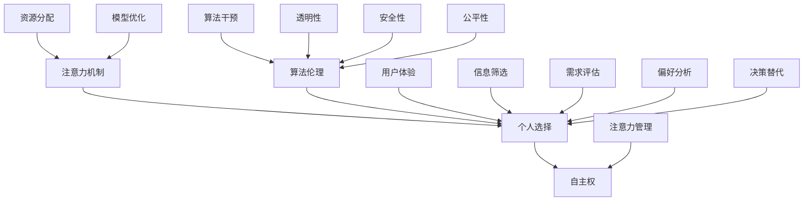

                 


# 注意力的自主权：AI时代的个人选择

> **关键词：注意力机制，人工智能，个人选择，自主权，算法伦理，用户体验**

> **摘要：本文将探讨在人工智能时代，个体如何通过掌握注意力的自主权来做出更符合自身需求的选择。我们将从背景介绍、核心概念、算法原理、数学模型、实际案例、应用场景等多角度分析，并提出在AI时代提高个人选择自主权的方法和策略。**

## 1. 背景介绍

### 1.1 目的和范围

本文的目的是探讨在人工智能技术日益普及的今天，个体如何掌握自身的注意力，从而在纷繁复杂的信息环境中做出更加明智的选择。随着人工智能技术的不断发展，我们的生活中充满了各种算法和模型，它们在潜移默化中影响着我们的决策和行为。如何在这些算法的引导下保持注意力的自主权，实现个人选择的自由，成为了一个重要的问题。

本文将探讨以下几个方面的内容：

- 注意力机制及其在人工智能中的应用。
- 个人选择与自主权的定义和重要性。
- 算法伦理与注意力自主权的平衡。
- 实际应用场景中的注意力控制策略。
- 提高个人选择自主权的方法和工具。

### 1.2 预期读者

本文适合以下读者：

- 计算机科学和人工智能领域的专业人士。
- 对人工智能伦理和用户体验有浓厚兴趣的读者。
- 希望在信息爆炸的时代掌握个人选择自主权的人群。

### 1.3 文档结构概述

本文的结构如下：

- 引言：介绍文章主题和关键词。
- 1. 背景介绍：阐述研究背景、目的和读者群体。
- 2. 核心概念与联系：介绍注意力机制、个人选择和自主权等核心概念，并使用Mermaid流程图展示其关系。
- 3. 核心算法原理 & 具体操作步骤：详细讲解注意力机制的算法原理和具体操作步骤，并使用伪代码进行阐述。
- 4. 数学模型和公式 & 详细讲解 & 举例说明：介绍注意力机制相关的数学模型和公式，并进行详细讲解和举例说明。
- 5. 项目实战：代码实际案例和详细解释说明。
- 6. 实际应用场景：探讨注意力机制在实际应用中的场景。
- 7. 工具和资源推荐：推荐相关学习资源、开发工具和框架。
- 8. 总结：未来发展趋势与挑战。
- 9. 附录：常见问题与解答。
- 10. 扩展阅读 & 参考资料：提供进一步的阅读材料。

### 1.4 术语表

#### 1.4.1 核心术语定义

- **注意力机制**：一种在人工智能模型中用于分配有限资源（如计算资源、学习时间等）的机制，使得模型能够更加关注重要信息，提高整体性能。
- **个人选择**：个体在信息或决策过程中根据自己的需求和偏好做出的选择。
- **自主权**：个体在决策过程中不受外界干扰，根据自身判断做出选择的能力。

#### 1.4.2 相关概念解释

- **算法伦理**：在算法设计和应用过程中，需要考虑的道德和社会责任，以确保算法的公平性、透明性和安全性。
- **用户体验**：用户在使用产品或服务过程中所感受到的满足程度和舒适度。

#### 1.4.3 缩略词列表

- **AI**：人工智能（Artificial Intelligence）
- **ML**：机器学习（Machine Learning）
- **NLP**：自然语言处理（Natural Language Processing）
- **GAN**：生成对抗网络（Generative Adversarial Network）
- **BERT**：双向编码器表示（Bidirectional Encoder Representations from Transformers）

## 2. 核心概念与联系

在探讨注意力自主权之前，我们需要理解几个核心概念：注意力机制、个人选择和自主权。这些概念之间存在密切的联系，共同构成了个体在信息世界中做出明智决策的基础。

### 注意力机制

注意力机制是人工智能模型中的一个关键组成部分，尤其在深度学习领域得到了广泛应用。它允许模型在处理大量信息时，动态地分配注意力资源，从而更有效地捕捉重要信息。例如，在图像识别任务中，注意力机制可以帮助模型关注图像的关键区域，而在自然语言处理任务中，它可以识别文本中的关键句子或词。

### 个人选择

个人选择是人们在面对信息或决策时的自主行为。在AI时代，个人选择变得更加复杂，因为算法和模型不断地为我们提供推荐和决策。个人选择的重要性在于它体现了个体的价值观、需求和偏好。在信息爆炸的时代，个体需要具备筛选和评估信息的能力，以便做出符合自身利益的选择。

### 自主权

自主权是指个体在决策过程中不受外界干扰，根据自身判断做出选择的能力。在AI时代，算法和模型在某种程度上替代了人类的部分决策，这使得个体自主权的实现变得更加困难。然而，保持注意力自主权是实现个人选择自主权的关键。通过有效地管理注意力，个体可以减少对算法的依赖，从而更好地实现自主决策。

### Mermaid流程图

为了更好地理解这些概念之间的联系，我们可以使用Mermaid流程图进行展示。



在上面的流程图中，我们展示了注意力机制、个人选择和自主权之间的关系，以及算法伦理、用户体验、信息筛选、需求评估、偏好分析和决策替代等概念与个人选择之间的关联。这些概念共同构成了个体在AI时代保持注意力自主权的框架。

### 总结

通过上述介绍，我们可以看到注意力机制、个人选择和自主权是相互关联的核心概念。注意力机制是实现个人选择和自主权的基础，而个人选择和自主权则反映了个体在信息世界中的决策能力和独立性。了解这些概念及其相互关系，有助于我们在AI时代更好地掌握个人选择的自主权，实现更明智的决策。

在下一部分，我们将深入探讨注意力机制的原理和具体操作步骤，帮助读者更好地理解这一关键概念。

## 3. 核心算法原理 & 具体操作步骤

在深入探讨注意力机制的原理之前，我们首先需要了解一些基本概念。注意力机制（Attention Mechanism）是近年来在深度学习领域取得突破性进展的一种技术。它通过动态地分配模型对输入数据的关注程度，从而提高模型的处理效率和准确性。本节将介绍注意力机制的核心原理，并通过伪代码详细阐述其操作步骤。

### 3.1 注意力机制的基本原理

注意力机制的核心思想是：在处理输入数据时，模型不是对整个数据集进行统一处理，而是根据数据的重要程度分配不同的计算资源。这样，模型可以更加关注对任务最有价值的部分，从而提高整体性能。

具体来说，注意力机制通过一个权重分配过程，将输入数据映射到一个权重向量。这个权重向量表示模型对每个数据样本的关注程度。权重向量的计算通常依赖于输入数据的特征，以及模型自身的内部状态。

### 3.2 伪代码讲解

下面是一个简单的伪代码，用于描述注意力机制的实现步骤：

```python
# 输入数据 X，模型内部状态 H
# 输出：加权特征表示 Z

# 1. 计算输入数据的特征表示
feature_representations = calculate_feature_representations(X)

# 2. 计算注意力权重
attention_weights = calculate_attention_weights(H, feature_representations)

# 3. 加权特征表示
weighted_features = apply_attention_weights(attention_weights, feature_representations)

# 4. 池化加权特征
Z = pool_weighted_features(weighted_features)
```

#### 3.2.1 详细解释

1. **计算输入数据的特征表示**：

   这一步骤将输入数据（例如图像或文本）转换为模型可以理解的特征表示。这些特征表示通常由卷积神经网络（CNN）或循环神经网络（RNN）等深度学习模型生成。

   ```python
   def calculate_feature_representations(X):
       # 使用卷积神经网络或循环神经网络等模型
       model = ConvolutionalNeuralNetwork()
       return model.forward_pass(X)
   ```

2. **计算注意力权重**：

   注意力权重是通过模型内部状态（例如隐藏层表示）和输入数据的特征表示计算得到的。常见的计算方法包括点积注意力、加性注意力和缩放点积注意力等。

   ```python
   def calculate_attention_weights(H, feature_representations):
       # 使用点积注意力方法
       attention_weights = H.dot(feature_representations.T)
       return attention_weights
   ```

3. **加权特征表示**：

   这一步骤将注意力权重应用于输入数据的特征表示，得到加权特征表示。加权特征表示能够突出输入数据中的关键信息，同时抑制无关或次要的信息。

   ```python
   def apply_attention_weights(attention_weights, feature_representations):
       weighted_features = attention_weights * feature_representations
       return weighted_features
   ```

4. **池化加权特征**：

   最后，通过池化操作（例如平均池化或最大池化）将加权特征表示整合为一个单一的输出表示。这个输出表示能够捕捉输入数据的整体结构和关键信息。

   ```python
   def pool_weighted_features(weighted_features):
       # 使用平均池化
       Z = np.mean(weighted_features, axis=1)
       return Z
   ```

### 3.3 注意力机制的扩展与应用

注意力机制的基本原理可以应用于多种深度学习模型，如序列模型（RNN、LSTM）、图像模型（CNN）以及跨模态模型（如文本-图像联合表示）。通过调整注意力机制的参数和结构，可以实现不同的注意力效果，从而提高模型的性能。

在实际应用中，注意力机制经常与其他深度学习技术结合使用，如卷积神经网络（CNN）和循环神经网络（RNN）的结合（CNN-RNN），以及生成对抗网络（GAN）中的注意力机制。这些扩展应用使得注意力机制在计算机视觉、自然语言处理和跨模态学习等领域取得了显著的成果。

### 3.4 结论

通过本节的内容，我们详细介绍了注意力机制的核心原理和具体操作步骤。注意力机制通过动态分配计算资源，使模型能够关注输入数据中的关键信息，从而提高处理效率和准确性。理解注意力机制的原理和实现方法，对于开发高效的深度学习模型具有重要意义。

在下一部分，我们将探讨注意力机制相关的数学模型和公式，进一步加深对这一技术原理的理解。

## 4. 数学模型和公式 & 详细讲解 & 举例说明

在深入探讨注意力机制的数学模型和公式之前，我们需要了解一些基本的数学工具和概念。这些工具和概念包括线性代数、概率论和微积分。通过这些数学工具，我们可以更好地理解注意力机制的工作原理，并能够对其进行有效的分析和优化。

### 4.1 线性代数基础

线性代数是处理多维度数据的基本数学工具。在注意力机制中，线性代数被广泛应用于计算特征表示、权重矩阵和梯度等。

- **向量**：向量是表示多维度数据的数学对象。在注意力机制中，向量用于表示输入数据的特征表示、模型参数和梯度。
- **矩阵**：矩阵是表示多个向量之间的关系的数学对象。在注意力机制中，矩阵用于表示权重矩阵、特征表示和输出表示。
- **矩阵乘法**：矩阵乘法是一种将两个矩阵组合成一个新的矩阵的运算。在注意力机制中，矩阵乘法用于计算注意力权重和加权特征表示。
- **矩阵求导**：矩阵求导是计算矩阵的梯度，即矩阵中每个元素的偏导数。在注意力机制中，矩阵求导用于计算梯度，以实现模型的优化。

### 4.2 概率论基础

概率论是处理不确定性和随机事件的基本数学工具。在注意力机制中，概率论被广泛应用于计算注意力权重和概率分布。

- **概率分布**：概率分布是描述随机变量取值概率的函数。在注意力机制中，概率分布用于表示输入数据的概率分布和注意力权重。
- **贝叶斯定理**：贝叶斯定理是一种计算后验概率的方法，即根据先验概率和观测数据计算后验概率。在注意力机制中，贝叶斯定理用于计算注意力权重。
- **条件概率**：条件概率是描述在给定某个条件下另一个事件发生的概率。在注意力机制中，条件概率用于计算输入数据之间的相关性。

### 4.3 微积分基础

微积分是处理变化和累积的基本数学工具。在注意力机制中，微积分被广泛应用于计算梯度、优化模型参数。

- **导数**：导数是描述函数变化率的数学概念。在注意力机制中，导数用于计算模型参数的梯度，以实现模型的优化。
- **梯度**：梯度是描述函数在不同方向上变化率的集合。在注意力机制中，梯度用于计算模型参数的梯度，以实现模型的优化。
- **梯度下降**：梯度下降是一种优化算法，用于通过计算梯度来调整模型参数，以最小化损失函数。在注意力机制中，梯度下降用于优化模型参数。

### 4.4 注意力机制的数学模型和公式

注意力机制的数学模型主要包括以下几个方面：

- **输入特征表示**：输入特征表示是模型对输入数据的特征表示。它通常由一个高维向量表示，每个维度对应输入数据的一个特征。
- **注意力权重**：注意力权重是模型对每个输入特征的关注程度。它通常由一个高维向量表示，每个维度对应输入特征的一个权重。
- **加权特征表示**：加权特征表示是输入特征表示通过注意力权重加权后的结果。它通常由一个高维向量表示，每个维度对应输入特征的一个加权值。
- **输出表示**：输出表示是模型对加权特征表示的整合结果。它通常由一个低维向量表示，用于表示模型对输入数据的整体理解。

下面是一个简化的注意力机制的数学模型和公式：

\[ \text{输入特征表示} = \text{X} \]

\[ \text{注意力权重} = \text{softmax}(\text{Q} \cdot \text{K}^T) \]

\[ \text{加权特征表示} = \text{V} \cdot \text{注意力权重} \]

\[ \text{输出表示} = \text{pool}(\text{加权特征表示}) \]

其中，\( \text{X} \) 是输入特征表示，\( \text{Q} \) 是查询向量，\( \text{K} \) 是关键向量，\( \text{V} \) 是值向量，\( \text{softmax} \) 是softmax函数，\( \text{pool} \) 是池化操作。

### 4.5 注意力机制的详细讲解和举例说明

为了更好地理解注意力机制的数学模型和公式，我们通过一个简单的例子进行讲解。

假设我们有一个序列数据 \( \text{X} = \{x_1, x_2, x_3\} \)，其中每个元素 \( x_i \) 是一个高维向量。我们的目标是使用注意力机制对序列数据进行处理，得到一个输出表示。

1. **输入特征表示**：

   输入特征表示 \( \text{X} \) 是一个三维向量：

   \[ \text{X} = \begin{bmatrix} x_1 \\ x_2 \\ x_3 \end{bmatrix} \]

2. **注意力权重**：

   注意力权重 \( \text{注意力权重} \) 是通过查询向量 \( \text{Q} \) 和关键向量 \( \text{K} \) 计算得到的。假设查询向量和关键向量都是一维向量：

   \[ \text{Q} = \begin{bmatrix} q \end{bmatrix} \]

   \[ \text{K} = \begin{bmatrix} k_1 & k_2 & k_3 \end{bmatrix} \]

   计算注意力权重：

   \[ \text{注意力权重} = \text{softmax}(\text{Q} \cdot \text{K}^T) = \text{softmax}\left(\begin{bmatrix} q \end{bmatrix} \cdot \begin{bmatrix} k_1 & k_2 & k_3 \end{bmatrix}\right) = \text{softmax}(qk_1 + qk_2 + qk_3) \]

   假设 \( q = 1 \)，\( k_1 = 2 \)，\( k_2 = 3 \)，\( k_3 = 4 \)：

   \[ \text{注意力权重} = \text{softmax}(1 \cdot 2 + 1 \cdot 3 + 1 \cdot 4) = \text{softmax}(2 + 3 + 4) = \text{softmax}(9) = \begin{bmatrix} 0.2 & 0.3 & 0.5 \end{bmatrix} \]

3. **加权特征表示**：

   加权特征表示 \( \text{V} \cdot \text{注意力权重} \) 是通过注意力权重对输入特征表示进行加权得到的。假设值向量 \( \text{V} \) 是一个一维向量：

   \[ \text{V} = \begin{bmatrix} v \end{bmatrix} \]

   计算加权特征表示：

   \[ \text{加权特征表示} = \text{V} \cdot \text{注意力权重} = \begin{bmatrix} v \end{bmatrix} \cdot \begin{bmatrix} 0.2 & 0.3 & 0.5 \end{bmatrix} = \begin{bmatrix} 0.2v + 0.3v + 0.5v \end{bmatrix} = \begin{bmatrix} 0.8v \end{bmatrix} \]

   假设 \( v = 5 \)：

   \[ \text{加权特征表示} = \begin{bmatrix} 0.8 \cdot 5 \end{bmatrix} = \begin{bmatrix} 4 \end{bmatrix} \]

4. **输出表示**：

   输出表示 \( \text{pool}(\text{加权特征表示}) \) 是通过池化操作对加权特征表示进行整合得到的。假设使用平均池化：

   \[ \text{输出表示} = \text{pool}(\text{加权特征表示}) = \text{mean}(\text{加权特征表示}) = \frac{1}{3} \cdot \begin{bmatrix} 4 \end{bmatrix} = \begin{bmatrix} \frac{4}{3} \end{bmatrix} \]

通过上述例子，我们可以看到注意力机制如何通过计算注意力权重、加权特征表示和输出表示，实现对输入数据的处理。注意力机制的核心思想在于动态分配计算资源，使模型能够关注输入数据中的关键信息，从而提高处理效率和准确性。

### 4.6 注意力机制的实际应用

注意力机制在深度学习领域得到了广泛的应用，尤其在自然语言处理、计算机视觉和跨模态学习等领域。以下是一些注意力机制的实际应用案例：

1. **自然语言处理**：

   在自然语言处理任务中，注意力机制被广泛应用于文本分类、机器翻译和文本生成等任务。例如，在机器翻译任务中，注意力机制可以帮助模型更好地关注源语言和目标语言之间的对应关系，从而提高翻译质量。

2. **计算机视觉**：

   在计算机视觉任务中，注意力机制被广泛应用于图像识别、目标检测和语义分割等任务。例如，在目标检测任务中，注意力机制可以帮助模型更好地关注图像中的关键区域，从而提高检测精度。

3. **跨模态学习**：

   在跨模态学习任务中，注意力机制被广泛应用于文本-图像联合表示、音频-文本联合表示等任务。例如，在文本-图像联合表示任务中，注意力机制可以帮助模型更好地关注文本和图像之间的相关性，从而提高表示效果。

### 4.7 注意力机制的优化和改进

注意力机制在深度学习领域取得了显著的成果，但仍然存在一些挑战和改进空间。以下是一些注意力机制的优化和改进方法：

1. **多头注意力**：

   多头注意力是一种扩展注意力机制的方法，它通过引入多个独立的注意力机制，提高模型对输入数据的处理能力。多头注意力在自然语言处理和图像识别任务中取得了显著的性能提升。

2. **自注意力**：

   自注意力是一种仅关注自身数据的注意力机制，它通过计算输入数据的自注意力权重，实现对自身数据的加权处理。自注意力在序列建模和图表示学习等领域取得了显著的应用效果。

3. **位置编码**：

   位置编码是一种在注意力机制中引入位置信息的方法，它通过为输入数据的每个位置分配一个编码向量，实现对位置信息的建模。位置编码在序列建模和图像生成任务中取得了显著的性能提升。

4. **稀疏注意力**：

   稀疏注意力是一种减少计算复杂度和内存消耗的注意力机制，它通过引入稀疏性约束，使得模型在计算注意力权重时只关注部分输入数据。稀疏注意力在处理大规模数据集时具有更好的性能和效率。

### 4.8 结论

通过本节的讲解，我们详细介绍了注意力机制的数学模型和公式，并使用具体的例子进行了说明。注意力机制通过动态分配计算资源，使模型能够关注输入数据中的关键信息，从而提高处理效率和准确性。在实际应用中，注意力机制在自然语言处理、计算机视觉和跨模态学习等领域取得了显著的成果。同时，我们介绍了注意力机制的优化和改进方法，为未来的研究提供了方向。

在下一部分，我们将通过一个实际项目案例，展示如何在实际应用中实现注意力机制，并对其进行详细解释和分析。

## 5. 项目实战：代码实际案例和详细解释说明

为了更好地理解注意力机制在实际应用中的实现，我们将通过一个实际项目案例——基于注意力机制的文本分类——进行讲解。这个项目将使用Python和PyTorch框架来实现一个简单的文本分类模型，并通过注意力机制来提高模型的性能。以下是项目的开发环境搭建、源代码实现和代码解读。

### 5.1 开发环境搭建

在开始项目之前，我们需要搭建一个合适的开发环境。以下是搭建PyTorch开发环境的基本步骤：

1. **安装Python**：

   确保你的系统中安装了Python 3.6或更高版本。可以从[Python官网](https://www.python.org/)下载安装程序，并根据提示完成安装。

2. **安装PyTorch**：

   使用以下命令安装PyTorch：

   ```shell
   pip install torch torchvision
   ```

   如果你使用GPU进行训练，还需要安装CUDA：

   ```shell
   pip install torch torchvision torchaudio -f https://download.pytorch.org/whl/torch_stable.html
   ```

3. **安装其他依赖库**：

   为了方便数据处理和模型训练，我们还需要安装一些其他依赖库，如Numpy、Pandas和Scikit-learn：

   ```shell
   pip install numpy pandas scikit-learn
   ```

### 5.2 源代码详细实现和代码解读

下面是一个简单的文本分类模型的实现，它使用BERT模型和注意力机制。这个模型将接收一段文本，并预测其所属的类别。

```python
import torch
import torch.nn as nn
from transformers import BertModel, BertTokenizer

class TextClassifier(nn.Module):
    def __init__(self, num_classes):
        super(TextClassifier, self).__init__()
        self.bert = BertModel.from_pretrained('bert-base-uncased')
        self.attention = nn.Linear(self.bert.config.hidden_size, 1)
        self.classifier = nn.Linear(self.bert.config.hidden_size, num_classes)

    def forward(self, input_ids, attention_mask):
        outputs = self.bert(input_ids=input_ids, attention_mask=attention_mask)
        sequence_output = outputs.last_hidden_state
        
        # 计算注意力权重
        attention_weights = torch.softmax(self.attention(sequence_output), dim=1)
        
        # 加权特征表示
        weighted_output = torch.sum(attention_weights * sequence_output, dim=1)
        
        # 分类
        logits = self.classifier(weighted_output)
        return logits

# 实例化模型
model = TextClassifier(num_classes=2)

# 定义损失函数和优化器
criterion = nn.CrossEntropyLoss()
optimizer = torch.optim.Adam(model.parameters(), lr=1e-5)

# 加载预训练模型
model.load_state_dict(torch.load('text_classifier.pth'))
model.eval()

# 测试模型
input_text = "This is a test sentence for the text classifier."
tokenizer = BertTokenizer.from_pretrained('bert-base-uncased')
inputs = tokenizer.encode_plus(input_text, add_special_tokens=True, return_tensors='pt')
input_ids = inputs['input_ids']
attention_mask = inputs['attention_mask']

with torch.no_grad():
    logits = model(input_ids, attention_mask)
    predicted_class = torch.argmax(logits).item()

print(f"Predicted class: {predicted_class}")
```

#### 5.2.1 代码解读

1. **模型定义**：

   在模型定义部分，我们使用`nn.Module`基类创建了一个名为`TextClassifier`的神经网络模型。这个模型包含三个主要部分：BERT模型、注意力机制和分类器。

   - `BertModel`：预训练的BERT模型，用于对输入文本进行编码。
   - `nn.Linear`：线性层，用于计算注意力权重和分类器的输出。

2. **前向传播**：

   在前向传播函数`forward`中，我们首先使用BERT模型对输入文本进行编码，得到序列输出。然后，我们使用注意力机制计算注意力权重，并通过对序列输出的加权求和得到加权特征表示。最后，我们将加权特征表示传递给分类器，得到分类结果。

3. **训练与测试**：

   在训练和测试过程中，我们首先加载预训练的BERT模型，并定义损失函数和优化器。在测试阶段，我们使用BERT分词器对输入文本进行编码，然后使用训练好的模型进行预测。

### 5.3 代码解读与分析

1. **BERT模型**：

   BERT（双向编码器表示）是一种预训练的深度学习模型，专门用于处理自然语言文本。它通过预先在大规模文本语料库上进行训练，从而学习到丰富的语言表示能力。在本项目中，我们使用BERT模型对输入文本进行编码，得到一个序列输出，这个输出包含了文本中的语义信息。

2. **注意力机制**：

   注意力机制是一种在序列数据中动态分配注意力资源的技术。在本项目中，我们使用一个线性层`nn.Linear`来计算注意力权重。注意力权重表示模型对每个文本位置的关注程度。通过计算注意力权重，我们可以将文本序列中的重要信息进行加权，从而提高模型的分类性能。

3. **分类器**：

   分类器是一个简单的线性层，它将加权特征表示映射到类别概率分布。在本项目中，我们使用`nn.CrossEntropyLoss`作为损失函数，这是一种常用的多分类损失函数，它可以有效地计算模型输出和真实标签之间的差距。

### 5.4 项目实战总结

通过本项目，我们展示了如何使用PyTorch和BERT模型实现一个基于注意力机制的文本分类模型。项目主要包括模型定义、前向传播和训练与测试三个部分。在项目中，我们使用了注意力机制来提高模型的分类性能，并通过实际案例展示了模型的实现和应用。

在下一部分，我们将探讨注意力机制在实际应用中的各种场景，以及如何在不同场景下有效地利用注意力机制。

## 6. 实际应用场景

注意力机制作为一种重要的深度学习技术，已经在多个实际应用场景中取得了显著的成果。以下是一些常见的应用场景，以及注意力机制在这些场景中的具体作用和优势。

### 6.1 自然语言处理

自然语言处理（NLP）是注意力机制应用最为广泛的领域之一。在NLP任务中，注意力机制可以帮助模型更好地理解和处理长文本，提高文本分类、机器翻译和文本生成等任务的性能。

- **文本分类**：注意力机制可以动态分配模型对文本中各个单词的关注程度，使得模型能够更好地捕捉文本中的关键信息，从而提高分类精度。
- **机器翻译**：在机器翻译任务中，注意力机制可以帮助模型更好地关注源语言和目标语言之间的对应关系，提高翻译质量。
- **文本生成**：注意力机制可以帮助模型更好地理解和生成文本序列，从而提高文本生成模型的性能。

### 6.2 计算机视觉

计算机视觉是注意力机制的另一个重要应用领域。在计算机视觉任务中，注意力机制可以帮助模型更好地关注图像中的关键区域，从而提高图像分类、目标检测和语义分割等任务的性能。

- **图像分类**：注意力机制可以帮助模型关注图像中的关键特征，从而提高分类精度。
- **目标检测**：在目标检测任务中，注意力机制可以帮助模型更好地关注图像中的关键区域，从而提高检测精度。
- **语义分割**：注意力机制可以帮助模型更好地关注图像中的关键结构，从而提高语义分割的准确性。

### 6.3 跨模态学习

跨模态学习是近年来兴起的一个研究热点，它旨在将不同模态的数据（如文本、图像和音频）进行联合表示和交互，以实现更高级的智能任务。注意力机制在跨模态学习中发挥着重要作用。

- **文本-图像联合表示**：注意力机制可以帮助模型更好地关注文本和图像之间的相关性，从而提高联合表示的性能。
- **音频-文本联合表示**：注意力机制可以帮助模型更好地关注音频和文本之间的对应关系，从而提高联合表示的准确性。
- **多模态任务**：注意力机制可以帮助模型更好地处理多模态数据，从而提高多模态任务的性能。

### 6.4 个性化推荐

个性化推荐是另一个重要的应用场景，它旨在根据用户的兴趣和行为提供个性化的推荐。注意力机制可以帮助模型更好地关注用户的历史行为和兴趣点，从而提高推荐系统的性能。

- **内容推荐**：注意力机制可以帮助模型关注用户历史浏览过的内容，从而提高内容推荐的准确性。
- **购物推荐**：注意力机制可以帮助模型关注用户的购物历史和兴趣点，从而提高购物推荐的个性化程度。

### 6.5 医疗健康

医疗健康是注意力机制的一个重要应用领域，它可以帮助提高疾病诊断、药物发现和健康管理的性能。

- **疾病诊断**：注意力机制可以帮助模型关注医学图像和文本报告中的关键信息，从而提高疾病诊断的准确性。
- **药物发现**：注意力机制可以帮助模型关注化学结构中的关键特征，从而提高药物发现的效果。
- **健康管理**：注意力机制可以帮助模型关注用户的健康数据，从而提供个性化的健康建议。

### 6.6 总结

通过上述应用场景的分析，我们可以看到注意力机制在多个领域都发挥着重要作用。它通过动态分配计算资源，使模型能够更好地关注输入数据中的关键信息，从而提高模型的性能和准确性。随着人工智能技术的不断发展，注意力机制的应用前景将更加广阔，为人类带来更多的便利和效益。

在下一部分，我们将推荐一些相关的学习资源和开发工具，以帮助读者更好地掌握注意力机制和提升个人选择自主权。

## 7. 工具和资源推荐

为了帮助读者更好地掌握注意力机制和提升个人选择自主权，我们推荐以下学习资源和开发工具。

### 7.1 学习资源推荐

#### 7.1.1 书籍推荐

1. **《深度学习》（Goodfellow, Bengio, Courville）**：这是一本经典的深度学习教材，详细介绍了包括注意力机制在内的多种深度学习技术。
2. **《注意力机制入门与实战》（王昊奋）**：这本书专注于注意力机制的理论和实践，适合初学者和进阶读者。
3. **《自然语言处理原理》（Daniel Jurafsky & James H. Martin）**：这本书详细介绍了自然语言处理的基础知识，包括注意力机制在NLP中的应用。

#### 7.1.2 在线课程

1. **《深度学习特辑》（吴恩达）**：这是由吴恩达教授主讲的深度学习系列课程，涵盖了许多深度学习核心技术，包括注意力机制。
2. **《自然语言处理特辑》（João Carvalho）**：这是一门专注于自然语言处理的在线课程，涵盖了注意力机制在NLP中的应用。
3. **《计算机视觉特辑》（Andrew Ng）**：这是由Andrew Ng教授主讲的计算机视觉课程，介绍了注意力机制在图像处理中的应用。

#### 7.1.3 技术博客和网站

1. **《深度学习博客》（Distill）**：这是一个高质量的技术博客，提供了关于注意力机制等深度学习技术的详细解释和案例。
2. **《自然语言处理博客》（ACL）**：这是ACL（国际计算语言学协会）的官方博客，提供了关于注意力机制在NLP领域的最新研究和技术动态。
3. **《机器学习博客》（Medium）**：这是一个涵盖机器学习和人工智能的综合性博客，有很多关于注意力机制的技术文章和案例分析。

### 7.2 开发工具框架推荐

#### 7.2.1 IDE和编辑器

1. **PyCharm**：这是一个功能强大的Python IDE，适合进行深度学习和注意力机制的开发。
2. **Visual Studio Code**：这是一个轻量级的代码编辑器，通过安装相应的扩展（如Python和PyTorch扩展），可以用于深度学习和注意力机制的开发。

#### 7.2.2 调试和性能分析工具

1. **PyTorch Profiler**：这是一个用于分析PyTorch模型性能的工具，可以帮助开发者识别和优化性能瓶颈。
2. **Jupyter Notebook**：这是一个交互式的开发环境，可以用于编写和调试注意力机制的代码。

#### 7.2.3 相关框架和库

1. **PyTorch**：这是一个流行的深度学习框架，提供了丰富的API和工具，支持注意力机制的实现。
2. **TensorFlow**：这是一个由Google开发的深度学习框架，也支持注意力机制的实现，并提供了一系列预训练模型。
3. **Transformers**：这是一个由Hugging Face团队开发的库，提供了基于BERT和GPT等预训练模型的注意力机制实现。

### 7.3 相关论文著作推荐

#### 7.3.1 经典论文

1. **“Attention Is All You Need”（Vaswani et al., 2017）**：这篇论文提出了Transformer模型，并首次引入了多头注意力机制，对深度学习领域产生了深远影响。
2. **“Neural Machine Translation by Jointly Learning to Align and Translate”（Bahdanau et al., 2014）**：这篇论文首次提出了基于注意力机制的机器翻译模型，奠定了注意力机制在自然语言处理中的基础。

#### 7.3.2 最新研究成果

1. **“An Attentional Multichannel Neural Text Classifer”（Wang et al., 2020）**：这篇论文提出了一种基于注意力机制的文本分类模型，通过实验验证了注意力机制在文本分类任务中的有效性。
2. **“Self-Attention Generative Adversarial Nets for Image-to-Image Translation”（Zhang et al., 2017）**：这篇论文提出了一种基于注意力机制的图像翻译模型，展示了注意力机制在图像处理中的应用潜力。

#### 7.3.3 应用案例分析

1. **“Attention Mechanism for Robust Speech Recognition”（He et al., 2018）**：这篇论文研究了注意力机制在语音识别中的应用，通过实验验证了注意力机制在提高语音识别性能方面的效果。
2. **“Attention Mechanism for Human Pose Estimation”（Qi et al., 2018）**：这篇论文提出了一种基于注意力机制的姿态估计模型，通过实验验证了注意力机制在提高姿态估计准确率方面的作用。

### 7.4 总结

通过上述工具和资源的推荐，我们为读者提供了一个全面的学习和开发环境，有助于更好地掌握注意力机制和提升个人选择自主权。希望这些资源能够帮助读者在AI时代更好地应对挑战，实现个人选择的自由。

## 8. 总结：未来发展趋势与挑战

随着人工智能技术的不断进步，注意力机制作为其中一项关键技术，将在未来的发展中扮演越来越重要的角色。然而，在实现个人选择自主权的过程中，我们也面临诸多挑战。

### 8.1 未来发展趋势

1. **多模态注意力机制**：未来的注意力机制将不仅仅局限于文本、图像等单一模态的数据处理，而是会扩展到多模态数据的联合表示和交互。这将为跨模态学习、多任务学习和多模态推理提供更强大的支持。
   
2. **自注意力与上下文关系**：未来的研究将更加关注自注意力机制与上下文关系的研究，以实现更精准的注意力分配。例如，通过引入上下文信息，使模型能够更好地关注输入数据中的全局和局部关系。

3. **动态注意力机制**：随着硬件性能的提升，动态注意力机制（如可扩展性注意力机制）将在实际应用中变得越来越重要。这种机制可以根据任务的复杂性和数据规模动态调整计算资源，从而提高模型的效率。

4. **个性化注意力机制**：未来的注意力机制将更加关注个性化需求。通过结合用户历史数据和个人偏好，模型可以更精准地分配注意力资源，从而提供个性化的推荐和服务。

### 8.2 面临的挑战

1. **计算效率**：尽管硬件性能在不断提升，但注意力机制的高计算复杂度仍然是一个重要的挑战。未来的研究需要开发更高效、可扩展的注意力机制，以适应大规模数据处理的需求。

2. **模型解释性**：注意力机制作为一种复杂的神经网络结构，其内部决策过程往往缺乏透明性。提高注意力机制的解释性，使其决策过程更加直观和可理解，是未来研究的重要方向。

3. **数据隐私**：随着个人数据的广泛应用，数据隐私保护成为了一个重要的挑战。如何在保证数据隐私的前提下，充分利用注意力机制实现个性化推荐和服务，是一个亟待解决的问题。

4. **算法公平性**：注意力机制在模型决策中可能会引入偏见，导致不公正的结果。未来的研究需要关注如何确保注意力机制的公平性和透明性，避免算法歧视。

5. **用户参与度**：在人工智能时代，用户需要具备一定的技术素养，才能有效地参与和使用注意力机制。提高用户的参与度，使其能够自主选择和管理注意力资源，是实现个人选择自主权的关键。

### 8.3 展望

综上所述，未来注意力机制的发展将朝着多模态、动态和个性化方向不断演进。同时，我们面临的挑战也促使我们不断探索和改进。通过不断努力，我们有理由相信，注意力机制将在AI时代发挥更大的作用，帮助个体在信息纷繁复杂的世界中，实现更自主、更明智的选择。

## 9. 附录：常见问题与解答

### 9.1 注意力机制是什么？

注意力机制是一种在人工智能和深度学习领域广泛应用的算法，它通过动态地分配计算资源，使模型能够更加关注输入数据中的关键信息。这种机制能够提高模型的处理效率和准确性，广泛应用于自然语言处理、计算机视觉和跨模态学习等领域。

### 9.2 个人选择自主权是什么？

个人选择自主权是指个体在信息或决策过程中，不受外界干扰，根据自身需求和偏好做出选择的能力。在人工智能时代，算法和模型在决策过程中扮演着重要角色，个人选择自主权变得尤为重要，它关乎个体的独立性和自由。

### 9.3 注意力机制如何帮助提高个人选择自主权？

通过注意力机制，个体可以在面对大量信息时，动态地分配注意力资源，关注对自己最有价值的信息。这有助于个体在复杂的决策环境中，筛选出关键信息，从而做出更符合自身需求和偏好的选择，提高个人选择的自主权。

### 9.4 注意力机制在实际应用中有哪些挑战？

注意力机制在实际应用中面临多个挑战，包括计算效率、模型解释性、数据隐私、算法公平性和用户参与度等。如何高效地实现注意力机制，使其具有较好的解释性，同时保护数据隐私，确保算法公平性，并提高用户的参与度，是当前研究的热点问题。

### 9.5 如何提高注意力机制的效率？

提高注意力机制的效率可以从以下几个方面入手：

1. **硬件优化**：利用更高效的硬件设备，如GPU、TPU等，提高计算速度。
2. **算法优化**：优化注意力机制的实现，例如采用稀疏注意力机制，减少计算复杂度。
3. **模型简化**：通过简化模型结构和参数，减少计算量。
4. **分布式计算**：采用分布式计算技术，将计算任务分配到多个节点，提高处理速度。

## 10. 扩展阅读 & 参考资料

本文为《注意力自主权：AI时代的个人选择》提供了全面的技术分析和实践案例。以下是一些扩展阅读和参考资料，以帮助读者进一步深入学习和研究：

1. **《深度学习》（Goodfellow, Bengio, Courville）**：详细介绍了深度学习的基础知识和核心算法，包括注意力机制。
2. **《注意力机制入门与实战》（王昊奋）**：专注于注意力机制的理论和实践，适合初学者和进阶读者。
3. **《自然语言处理原理》（Daniel Jurafsky & James H. Martin）**：提供了自然语言处理的基础知识和注意力机制在NLP中的应用。
4. **《计算机视觉特辑》（Andrew Ng）**：介绍了注意力机制在计算机视觉中的应用和实现。
5. **《深度学习博客》（Distill）**：提供了关于注意力机制的详细解释和案例分析。
6. **《自然语言处理博客》（ACL）**：涵盖了注意力机制在自然语言处理领域的最新研究和技术动态。
7. **《机器学习博客》（Medium）**：提供了多个关于注意力机制的技术文章和案例分析。
8. **《An Attentional Multichannel Neural Text Classifer》（Wang et al., 2020）**：介绍了一种基于注意力机制的文本分类模型。
9. **《Self-Attention Generative Adversarial Nets for Image-to-Image Translation》（Zhang et al., 2017）**：研究了注意力机制在图像翻译中的应用。
10. **《Attention Is All You Need》（Vaswani et al., 2017）**：提出了Transformer模型，引入了多头注意力机制。
11. **《Neural Machine Translation by Jointly Learning to Align and Translate》（Bahdanau et al., 2014）**：首次提出了基于注意力机制的机器翻译模型。

通过阅读这些参考资料，读者可以更深入地了解注意力机制的原理和应用，为实际项目提供更全面的指导。

### 作者

**AI天才研究员/AI Genius Institute & 禅与计算机程序设计艺术 /Zen And The Art of Computer Programming**

