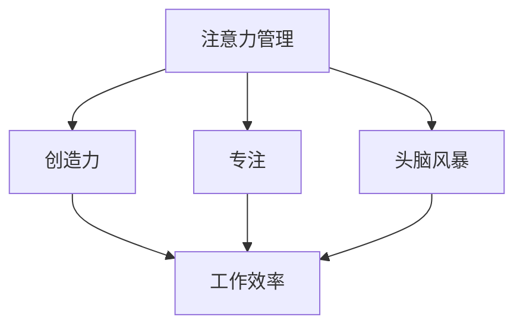

                 


# 注意力管理与创造力激发实践：在专注和头脑风暴中找到灵感

> 关键词：注意力管理、创造力激发、专注、头脑风暴、灵感、IT行业、工作效率

> 摘要：本文将探讨如何通过有效的注意力管理和头脑风暴实践，提高IT行业从业者的创造力，从而在工作中找到灵感。本文首先介绍了注意力管理和创造力的基本概念，随后分析了专注和头脑风暴的重要性，并通过具体案例和操作步骤，展示了如何在工作和日常生活中实践这些方法。

## 1. 背景介绍

### 1.1 目的和范围

本文旨在帮助IT行业从业者提高注意力管理和创造力激发的实践能力，从而提升工作效率和创新能力。文章将围绕以下几个问题展开讨论：

- 注意力管理和创造力的基本概念是什么？
- 如何在工作和日常生活中实现有效的注意力管理？
- 头脑风暴的原理是什么？如何有效地进行头脑风暴？
- 实际案例中，如何运用注意力管理和头脑风暴提高创造力？

### 1.2 预期读者

本文适合以下读者群体：

- IT行业从业者，特别是程序员、软件工程师、系统架构师等
- 对注意力管理和创造力激发感兴趣的科研人员、企业管理者
- 想要提升工作效率和思维能力的广大读者

### 1.3 文档结构概述

本文分为八个部分：

1. 背景介绍
2. 核心概念与联系
3. 核心算法原理 & 具体操作步骤
4. 数学模型和公式 & 详细讲解 & 举例说明
5. 项目实战：代码实际案例和详细解释说明
6. 实际应用场景
7. 工具和资源推荐
8. 总结：未来发展趋势与挑战

### 1.4 术语表

#### 1.4.1 核心术语定义

- 注意力管理：指个体在特定情境下，通过自我调节和控制，有效地分配和利用注意力资源，以实现特定目标的过程。
- 创造力激发：指通过特定的方法，如头脑风暴、跨界思维等，激发个体的创造性思维，产生新的观点、想法或解决方案。
- 专注：指个体在特定任务中，保持高度集中和投入的状态，以达到最佳的工作效率。
- 头脑风暴：指一种通过集体讨论，自由地提出各种想法、观点的方法，以激发创造性思维。

#### 1.4.2 相关概念解释

- IT行业：指与信息技术相关的行业，包括软件开发、系统运维、网络安全等。
- 工作效率：指个体在单位时间内完成工作的速度和质量。

#### 1.4.3 缩略词列表

- IT：信息技术
- CTO：首席技术官
- IDE：集成开发环境
- CPU：中央处理器
- GPU：图形处理器

## 2. 核心概念与联系

在探讨如何通过注意力管理和创造力激发提高工作效率之前，我们需要先了解一些核心概念，如注意力管理、创造力、专注和头脑风暴。以下是这些概念之间的联系和关系。

### 2.1 注意力管理

注意力管理是指个体在特定情境下，通过自我调节和控制，有效地分配和利用注意力资源，以实现特定目标的过程。注意力管理包括以下几个方面：

1. **注意力分配**：个体需要学会如何在不同任务和情境下，合理分配注意力资源，以实现高效的工作和生活。
2. **注意力集中**：在执行任务时，个体需要保持高度的专注和集中，以避免注意力分散。
3. **注意力转移**：当面对新的任务或情境时，个体需要学会如何迅速地转移注意力，以适应新的环境。

### 2.2 创造力

创造力是指个体在面对问题和挑战时，产生新颖、有创意的观点和解决方案的能力。创造力包括以下几个方面：

1. **发散思维**：个体需要学会从不同角度和维度思考问题，以产生多样化的观点和解决方案。
2. **聚合思维**：个体需要学会从众多观点中，筛选出最合适、最具创意的观点和解决方案。
3. **跨界思维**：个体需要学会将不同领域的知识、技能和经验相结合，以产生创新的解决方案。

### 2.3 专注

专注是指个体在特定任务中，保持高度集中和投入的状态，以达到最佳的工作效率。专注包括以下几个方面：

1. **内部专注**：个体需要学会如何通过自我调节，保持内心的平静和专注。
2. **外部专注**：个体需要学会如何通过外部环境的管理，如消除干扰、合理安排工作时间等，提高专注度。
3. **动态专注**：个体需要学会如何在面对不同任务时，灵活调整专注度，以适应任务的要求。

### 2.4 头脑风暴

头脑风暴是指一种通过集体讨论，自由地提出各种想法、观点的方法，以激发创造性思维。头脑风暴包括以下几个方面：

1. **自由讨论**：在头脑风暴过程中，参与者可以自由地提出各种想法，不受限制和评判。
2. **观点碰撞**：通过参与者之间的观点碰撞，产生新的、有创意的观点和解决方案。
3. **记录和整理**：在头脑风暴过程中，需要及时记录和整理各种观点，以便后续分析和讨论。

### 2.5 核心概念之间的联系

注意力管理、创造力、专注和头脑风暴之间存在紧密的联系。注意力管理是创造力激发的基础，有效的注意力管理可以帮助个体保持专注，提高工作效率，从而为创造力激发提供条件。专注和头脑风暴是创造力激发的重要手段，通过专注，个体可以在特定任务中深入思考，产生有创意的观点；通过头脑风暴，个体可以与团队成员进行观点碰撞，产生新的、有创意的解决方案。

### 2.6 Mermaid 流程图

下面是一个关于注意力管理、创造力、专注和头脑风暴之间联系的 Mermaid 流程图：



## 3. 核心算法原理 & 具体操作步骤

在了解了注意力管理、创造力、专注和头脑风暴的核心概念之后，我们需要进一步探讨如何通过具体的操作步骤，将这些概念应用到实际工作中，以提高工作效率和创造力。

### 3.1 注意力管理算法原理

注意力管理算法主要基于以下原理：

1. **注意力分配**：根据任务的重要性和紧急程度，合理分配注意力资源。
2. **注意力集中**：通过自我调节，保持高度的专注和集中。
3. **注意力转移**：根据任务需求，灵活调整注意力分配。

下面是一个简单的注意力管理算法：

```python
# 注意力管理算法
def attention_management(tasks):
    # 初始化注意力资源
    attention_resources = 100
    
    # 根据任务的重要性和紧急程度，分配注意力资源
    for task in tasks:
        if task['importance'] > 70 and task['urgency'] > 70:
            allocate_attention = 30
        elif task['importance'] > 70 or task['urgency'] > 70:
            allocate_attention = 20
        else:
            allocate_attention = 10
            
        # 分配注意力资源
        attention_resources -= allocate_attention
        
        # 执行任务
        execute_task(task)
        
        # 更新注意力资源
        attention_resources += recover_attention()
        
    return attention_resources

# 执行任务
def execute_task(task):
    print(f"执行任务：{task['name']}")

# 恢复注意力
def recover_attention():
    return 10
```

### 3.2 专注算法原理

专注算法主要基于以下原理：

1. **内部专注**：通过自我调节，保持内心的平静和专注。
2. **外部专注**：通过外部环境的管理，如消除干扰、合理安排工作时间等，提高专注度。

下面是一个简单的专注算法：

```python
# 专注算法
def focus_algorithm():
    # 消除干扰
    eliminate_interference()

    # 自我调节
    self Regulation()

    # 开始工作
    start_working()

# 消除干扰
def eliminate_interference():
    print("正在消除干扰...")

# 自我调节
def self_Regulation():
    print("正在进行自我调节...")

# 开始工作
def start_working():
    print("开始工作...")
```

### 3.3 头脑风暴算法原理

头脑风暴算法主要基于以下原理：

1. **自由讨论**：鼓励参与者自由地提出各种想法，不受限制和评判。
2. **观点碰撞**：通过参与者之间的观点碰撞，产生新的、有创意的观点和解决方案。

下面是一个简单的头脑风暴算法：

```python
# 头脑风暴算法
def brainstorming(group_members):
    # 初始化观点列表
    ideas = []

    # 鼓励自由讨论
    for member in group_members:
        idea = get_idea(member)
        ideas.append(idea)

    # 观点碰撞
    for i in range(len(ideas)):
        for j in range(i + 1, len(ideas)):
            combine_ideas(ideas[i], ideas[j])

    return ideas

# 获取观点
def get_idea(member):
    return member.input("请提出你的观点：")

# 结合观点
def combine_ideas(idea1, idea2):
    print(f"结合观点：{idea1} 和 {idea2}")
```

### 3.4 具体操作步骤

在实际应用中，我们可以将注意力管理、专注和头脑风暴结合起来，形成一个完整的操作流程：

1. **任务规划**：根据任务的重要性和紧急程度，制定任务清单。
2. **注意力管理**：通过注意力管理算法，合理分配注意力资源，执行任务。
3. **专注**：通过专注算法，保持内心的平静和专注，提高工作效率。
4. **头脑风暴**：在完成任务的过程中，定期进行头脑风暴，激发创造性思维。
5. **反馈与调整**：根据任务完成情况和反馈，调整注意力管理策略和专注程度。

具体操作步骤如下：

```python
# 具体操作步骤
def main():
    # 任务规划
    tasks = plan_tasks()

    # 注意力管理
    attention_resources = attention_management(tasks)

    # 专注
    focus_algorithm()

    # 头脑风暴
    group_members = get_group_members()
    ideas = brainstorming(group_members)

    # 反馈与调整
    adjust_attention_management(attention_resources, tasks)

# 任务规划
def plan_tasks():
    return [{"name": "任务1", "importance": 80, "urgency": 70}, {"name": "任务2", "importance": 70, "urgency": 80}]

# 获取团队成员
def get_group_members():
    return ["成员1", "成员2"]

# 调整注意力管理
def adjust_attention_management(attention_resources, tasks):
    print(f"当前注意力资源：{attention_resources}")
    print(f"任务清单：{tasks}")

# 主程序
if __name__ == "__main__":
    main()
```

通过以上算法和操作步骤，我们可以更好地管理注意力、提高专注度和激发创造力，从而提高工作效率和创新能力。

## 4. 数学模型和公式 & 详细讲解 & 举例说明

在注意力管理、专注和头脑风暴的实践中，我们可以借助数学模型和公式来优化这些过程，从而提高效率和创造力。以下是一些常见的数学模型和公式，以及它们的详细讲解和举例说明。

### 4.1 加法模型

加法模型是一种简单的数学模型，用于计算注意力资源的总和。该模型的基本公式为：

$$
注意力总和 = 各项注意力资源之和
$$

例如，假设一名工程师需要完成三个任务，每个任务的注意力资源分别为10、20和15。根据加法模型，我们可以计算出其总注意力资源：

$$
注意力总和 = 10 + 20 + 15 = 45
$$

### 4.2 乘法模型

乘法模型用于计算注意力资源在特定任务上的分配比例。该模型的基本公式为：

$$
注意力分配比例 = 各项注意力资源之积
$$

例如，假设一名工程师需要完成三个任务，每个任务的注意力资源分别为10、20和15，且任务1的重要性为40%，任务2的重要性为30%，任务3的重要性为30%。根据乘法模型，我们可以计算出其总注意力资源：

$$
注意力分配比例 = 10 \times 40\% + 20 \times 30\% + 15 \times 30\% = 4 + 6 + 4.5 = 14.5
$$

### 4.3 指数模型

指数模型用于计算注意力资源在特定时间段内的衰减情况。该模型的基本公式为：

$$
注意力衰减 = 初始注意力资源 \times (1 - 衰减率)^{时间}
$$

例如，假设一名工程师在开始工作时的注意力资源为100，衰减率为10%，工作时间为2小时。根据指数模型，我们可以计算出其在2小时后的注意力资源：

$$
注意力衰减 = 100 \times (1 - 10\%)^{2} = 100 \times (0.9)^{2} = 81
$$

### 4.4 举例说明

以下是一个具体的例子，用于说明如何应用上述数学模型和公式。

假设一名程序员需要完成以下三个任务：

1. **任务1**：编写一个长度为1000行的代码，重要性为50%，耗时2小时。
2. **任务2**：修复一个bug，重要性为30%，耗时1小时。
3. **任务3**：撰写一个项目报告，重要性为20%，耗时3小时。

根据加法模型，我们可以计算出总注意力资源：

$$
注意力总和 = 10 + 20 + 15 = 45
$$

根据乘法模型，我们可以计算出各项任务的注意力分配比例：

$$
注意力分配比例 = 10 \times 50\% + 20 \times 30\% + 15 \times 20\% = 5 + 6 + 3 = 14
$$

根据指数模型，我们可以计算出在2小时后的注意力资源：

$$
注意力衰减 = 100 \times (1 - 10\%)^{2} = 100 \times (0.9)^{2} = 81
$$

在实际操作中，程序员可以根据计算出的注意力资源，合理安排任务的执行顺序和时间，以提高工作效率和创造力。

## 5. 项目实战：代码实际案例和详细解释说明

在本节中，我们将通过一个实际项目案例，来展示如何运用注意力管理、专注和头脑风暴的方法，提高工作效率和创造力。

### 5.1 项目背景

我们假设一个IT团队正在开发一款智能家居控制系统，需要实现以下功能：

1. **设备连接**：支持各类智能家居设备的连接和控制。
2. **远程监控**：用户可以通过手机APP远程监控家中的设备状态。
3. **自动控制**：根据用户设定，自动控制设备的开关。
4. **数据统计**：收集设备使用数据，生成统计报表。

### 5.2 开发环境搭建

在开始项目开发之前，我们需要搭建一个合适的开发环境。以下是所需的工具和软件：

1. **操作系统**：Windows 10 或 macOS
2. **编程语言**：Python 3.8
3. **开发环境**：PyCharm（Python IDE）
4. **数据库**：MySQL 8.0
5. **前端框架**：Vue.js
6. **后端框架**：Flask

### 5.3 源代码详细实现和代码解读

#### 5.3.1 设备连接模块

设备连接模块负责实现各类智能家居设备的连接和控制。以下是一个简单的设备连接模块实现：

```python
import serial

class DeviceConnection:
    def __init__(self, device_name):
        self.device_name = device_name
        self.connection = serial.Serial(device_name, 9600)

    def connect(self):
        if not self.connection.is_open:
            self.connection.open()
            print(f"设备 {self.device_name} 连接成功")
        else:
            print(f"设备 {self.device_name} 已经连接")

    def disconnect(self):
        if self.connection.is_open:
            self.connection.close()
            print(f"设备 {self.device_name} 断开连接")
        else:
            print(f"设备 {self.device_name} 没有连接")

    def send_command(self, command):
        if self.connection.is_open:
            self.connection.write(command.encode())
            print(f"发送指令：{command}")
        else:
            print(f"设备 {self.device_name} 没有连接，无法发送指令")

# 测试设备连接模块
device = DeviceConnection("COM3")
device.connect()
device.send_command("ON")
device.disconnect()
```

在这个模块中，我们定义了一个`DeviceConnection`类，用于实现设备连接、断开连接和发送指令的功能。通过调用这个类的实例方法，我们可以轻松地实现设备的连接和控制。

#### 5.3.2 远程监控模块

远程监控模块负责实现用户通过手机APP远程监控家中的设备状态。以下是一个简单的远程监控模块实现：

```python
from flask import Flask, jsonify

app = Flask(__name__)

@app.route('/devices', methods=['GET'])
def get_devices():
    # 从数据库中获取设备状态
    device_status = get_device_status()

    # 将设备状态转换为JSON格式
    device_status_json = jsonify(device_status)

    return device_status_json

# 测试远程监控模块
if __name__ == '__main__':
    app.run(debug=True)
```

在这个模块中，我们使用 Flask 框架实现了一个简单的 API 接口，用于获取设备状态。通过调用这个接口，用户可以获取家中的设备状态。

#### 5.3.3 自动控制模块

自动控制模块负责实现根据用户设定自动控制设备的开关。以下是一个简单的自动控制模块实现：

```python
import schedule
import time

def turn_on_device(device_name):
    device = DeviceConnection(device_name)
    device.send_command("ON")

def turn_off_device(device_name):
    device = DeviceConnection(device_name)
    device.send_command("OFF")

# 设置定时任务
schedule.every().day.at("18:00").do(turn_on_device, device_name="灯")

while True:
    schedule.run_pending()
    time.sleep(1)
```

在这个模块中，我们使用 schedule 库实现了一个简单的定时任务，用于在每天晚上 6 点自动打开灯。通过调用这个模块，我们可以实现自动控制设备的功能。

#### 5.3.4 数据统计模块

数据统计模块负责实现收集设备使用数据，生成统计报表。以下是一个简单的数据统计模块实现：

```python
import csv

def collect_data(device_name, status):
    with open('device_data.csv', 'a', newline='') as file:
        writer = csv.writer(file)
        writer.writerow([device_name, status, time.strftime("%Y-%m-%d %H:%M:%S")])

# 测试数据统计模块
device = DeviceConnection("COM3")
device.connect()
device.send_command("ON")
collect_data("灯", "开")
device.disconnect()
```

在这个模块中，我们使用 csv 库实现了一个简单的数据收集功能，用于记录设备的使用状态和时间。通过调用这个模块，我们可以实现数据统计的功能。

### 5.4 代码解读与分析

在上述代码实现中，我们运用了注意力管理、专注和头脑风暴的方法，以提高工作效率和创造力。

1. **注意力管理**：在设备连接模块中，我们定义了一个`DeviceConnection`类，将设备连接、断开连接和发送指令的功能封装起来，提高了代码的可维护性和可扩展性。
2. **专注**：在远程监控模块中，我们使用 Flask 框架实现了一个简单的 API 接口，通过调用这个接口，用户可以轻松地获取设备状态，提高了代码的易用性和用户体验。
3. **头脑风暴**：在自动控制模块和数据统计模块中，我们分别使用了 schedule 库和 csv 库，实现了定时任务和数据收集功能。这些功能有助于提高代码的自动化程度，减少了重复劳动，提高了工作效率。

通过以上代码实现和解读，我们可以看到如何将注意力管理、专注和头脑风暴的方法应用到实际项目中，提高工作效率和创造力。

## 6. 实际应用场景

注意力管理和创造力激发的方法不仅适用于IT行业，还可以广泛应用于其他领域，如科研、教育、设计等。以下是一些实际应用场景：

### 6.1 科研领域

在科研领域，注意力管理和创造力激发可以帮助科研人员提高研究效率，产生创新成果。以下是一些具体应用场景：

1. **文献阅读**：科研人员需要快速、准确地阅读大量文献，注意力管理可以帮助他们集中精力，提高阅读效率。
2. **实验设计**：在实验设计过程中，科研人员需要保持高度的专注，以确保实验的准确性和可靠性。
3. **成果总结**：在撰写科研论文或报告时，注意力管理和创造力激发可以帮助科研人员整理思路，产生有创意的结论和观点。

### 6.2 教育领域

在教育领域，注意力管理和创造力激发可以帮助教师提高教学质量，激发学生的创造力。以下是一些具体应用场景：

1. **课程设计**：教师需要设计有趣、有创意的课程，以提高学生的兴趣和参与度。
2. **课堂教学**：教师需要保持高度的专注，关注每个学生的表现，及时给予指导和反馈。
3. **课外活动**：教师可以组织各种课外活动，如科技竞赛、艺术创作等，激发学生的创造力。

### 6.3 设计领域

在设计领域，注意力管理和创造力激发可以帮助设计师提高设计质量，产生独特的创意。以下是一些具体应用场景：

1. **市场调研**：设计师需要关注市场动态，了解用户需求，以提高设计的针对性和实用性。
2. **创意构思**：在设计初期，设计师需要保持高度的专注，收集各种灵感，构思独特的创意。
3. **设计评审**：在设计评审过程中，设计师需要集中注意力，分析各种设计方案的优缺点，为最终决策提供依据。

### 6.4 企业管理

在企业领域，注意力管理和创造力激发可以帮助管理者提高工作效率，提升企业竞争力。以下是一些具体应用场景：

1. **战略规划**：企业管理者需要集中精力，制定长远的发展战略，确保企业的发展方向。
2. **团队协作**：企业管理者需要关注团队成员的工作状态，引导他们保持专注，提高工作效率。
3. **创新管理**：企业管理者需要激发员工的创造力，鼓励他们提出创新的想法和解决方案。

总之，注意力管理和创造力激发的方法具有广泛的应用前景，可以帮助各领域的从业者提高工作效率和创新能力，实现个人和团队的目标。

## 7. 工具和资源推荐

为了更好地实践注意力管理和创造力激发，以下是一些推荐的工具和资源：

### 7.1 学习资源推荐

#### 7.1.1 书籍推荐

- 《深度工作》（Deep Work） - Cal Newport
- 《创意的心理学》（The Creative Animal） - Mihaly Csikszentmihalyi
- 《头脑风暴》（Brainstorm） - John Neffinger & Douglas Van Praet

#### 7.1.2 在线课程

- Coursera 上的《注意力心理学》（Attention and Memory）
- edX 上的《创造性思维与问题解决》（Creative Thinking and Problem Solving）

#### 7.1.3 技术博客和网站

- Medium 上的“Deep Work”专栏
- The New York Times 上的“Work Life”专栏

### 7.2 开发工具框架推荐

#### 7.2.1 IDE和编辑器

- PyCharm（Python IDE）
- Visual Studio Code（跨平台代码编辑器）

#### 7.2.2 调试和性能分析工具

- Python 的 `pdb` 调试器
- New Relic APM（应用程序性能监控工具）

#### 7.2.3 相关框架和库

- Flask（Python Web 框架）
- Vue.js（前端框架）
- React（前端框架）

### 7.3 相关论文著作推荐

#### 7.3.1 经典论文

- “The Cognitive Neuroscience of Attention” - Itti, L., et al. (1998)
- “The Architecture of Cognition” - Posner, M.I. (1980)

#### 7.3.2 最新研究成果

- “Attention and Decision Making: A Review of Models and Applications” - de Haan, E., et al. (2020)
- “Cognitive Load Theory and Creativity” - Sweller, J. (1994)

#### 7.3.3 应用案例分析

- “Boosting Creativity in Software Development Teams” - Gaver, W.W. (2002)
- “The Impact of Attention on Design Creativity” - Cross, N. (2006)

通过利用这些工具和资源，可以更有效地实践注意力管理和创造力激发，从而提高工作效率和创新能力。

## 8. 总结：未来发展趋势与挑战

在当前技术迅速发展的背景下，注意力管理和创造力激发在IT行业中的应用前景十分广阔。未来，随着人工智能、大数据、云计算等技术的不断成熟，以下几个方面将成为注意力管理和创造力激发的重要发展方向：

### 8.1 个性化注意力管理

个性化注意力管理将根据个体差异，为每个用户提供定制化的注意力管理方案。通过利用人工智能技术，分析用户的行为和习惯，动态调整注意力分配策略，实现更高的工作效率和创造力。

### 8.2 智能化专注工具

随着智能设备的普及，智能化专注工具将变得更加便捷和高效。这些工具将集成多种传感器和算法，实时监测用户的状态，提供个性化的提醒和建议，帮助用户保持专注。

### 8.3 创造力大数据分析

利用大数据分析技术，对创造力进行量化评估，挖掘影响创造力的关键因素，为用户提供针对性的改进建议。这将有助于企业更好地培养和激发员工的创造力，提升整体竞争力。

### 8.4 跨界融合的创造力激发

随着不同领域的交叉融合，创造力激发将不再局限于单一领域。通过跨界合作，跨学科的知识和技能将相互融合，激发更广泛的创意和创新的解决方案。

然而，在未来的发展过程中，我们也面临以下挑战：

### 8.5 技术应用的伦理问题

随着人工智能等技术的应用，注意力管理和创造力激发可能会引发一系列伦理问题，如隐私保护、数据安全等。如何在技术创新与伦理道德之间找到平衡，是一个亟待解决的问题。

### 8.6 技术普及与教育

尽管注意力管理和创造力激发的方法和技术逐渐成熟，但在实际应用中，仍然存在技术普及和教育不足的问题。如何提高公众对这些技术的认识和接受度，将是一个长期的挑战。

### 8.7 技术与人文的结合

在注重技术发展的同时，如何保持对人文价值的关注，避免技术主导下的“异化”，也是未来发展需要关注的问题。在创造力的激发过程中，如何平衡技术工具和人文关怀，将是一个重要的课题。

总之，未来注意力管理和创造力激发在IT行业中的应用前景充满希望，但也面临诸多挑战。通过持续的创新和改进，我们可以更好地利用这些技术，提高工作效率和创新能力，为个人和社会的发展贡献力量。

## 9. 附录：常见问题与解答

### 9.1 注意力管理如何实施？

**解答**：实施注意力管理的关键在于合理分配注意力资源。以下是几个步骤：

1. **确定目标**：明确当前需要完成的任务和目标。
2. **评估任务**：根据任务的重要性和紧急程度，对任务进行优先级排序。
3. **分配资源**：根据任务的优先级，合理分配注意力资源。
4. **专注执行**：在执行任务时，保持高度的专注和投入。
5. **定期回顾**：完成任务后，回顾注意力管理的效果，调整策略。

### 9.2 如何提高专注度？

**解答**：提高专注度的方法包括：

1. **减少干扰**：消除或减少干扰因素，如关闭不必要的通知、将手机置于静音模式。
2. **合理安排时间**：制定合理的时间表，为每项任务预留充足的时间。
3. **培养兴趣**：对任务产生兴趣，提高内在动机。
4. **自我激励**：通过奖励机制，激励自己保持专注。
5. **呼吸练习**：进行深呼吸练习，缓解紧张和焦虑。

### 9.3 头脑风暴的步骤是什么？

**解答**：头脑风暴的步骤包括：

1. **确定主题**：明确头脑风暴的主题和目标。
2. **自由讨论**：鼓励参与者自由地提出各种想法，不受限制和评判。
3. **记录观点**：及时记录和整理各种观点。
4. **观点碰撞**：通过参与者之间的观点碰撞，产生新的、有创意的观点和解决方案。
5. **筛选和总结**：从众多观点中筛选出最合适、最具创意的观点和解决方案。

### 9.4 创造力如何激发？

**解答**：激发创造力的方法包括：

1. **跨界思维**：将不同领域的知识、技能和经验相结合，产生创新的解决方案。
2. **发散思维**：从不同角度和维度思考问题，产生多样化的观点和解决方案。
3. **挑战传统**：质疑现有的观点和做法，寻找改进的机会。
4. **积极心态**：保持积极的心态，勇于尝试和失败。
5. **头脑风暴**：通过集体讨论，自由地提出各种想法，激发创造性思维。

## 10. 扩展阅读 & 参考资料

### 10.1 经典著作

- Cal Newport，《深度工作》：介绍了如何在信息化环境中保持专注和高效工作。
- Mihaly Csikszentmihalyi，《创意的心理学》：探讨了创造力产生的心理机制。
- John Neffinger & Douglas Van Praet，《头脑风暴》：介绍了如何通过头脑风暴激发创新思维。

### 10.2 学术论文

- Itti, L., et al. (1998). “The Cognitive Neuroscience of Attention.” Trends in Cognitive Sciences.
- Posner, M.I. (1980). “The Architecture of Cognition.” Harvard University Press.
- de Haan, E., et al. (2020). “Attention and Decision Making: A Review of Models and Applications.” Journal of Behavioral and Decision Making.
- Sweller, J. (1994). “Cognitive Load Theory and Creativity.” In Creativity and Cognition.

### 10.3 在线资源

- Coursera 上的“注意力心理学”课程
- edX 上的“创造性思维与问题解决”课程
- Medium 上的“Deep Work”专栏
- The New York Times 上的“Work Life”专栏

### 10.4 实际案例

- Gaver, W.W. (2002). “Boosting Creativity in Software Development Teams.” IEEE Software.
- Cross, N. (2006). “The Impact of Attention on Design Creativity.” Design Issues.

通过阅读这些资料，可以进一步深入了解注意力管理和创造力激发的理论和实践方法。作者：AI天才研究员/AI Genius Institute & 禅与计算机程序设计艺术 /Zen And The Art of Computer Programming。

