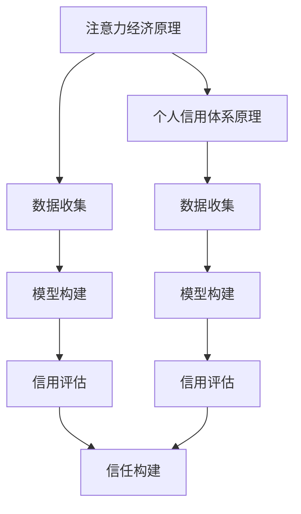

                 

# 注意力经济与个人信用体系的构建

> **关键词：** 注意力经济、个人信用体系、数据隐私、机器学习、区块链技术

> **摘要：** 本文将深入探讨注意力经济的概念及其与个人信用体系的关联。我们将分析注意力经济的核心原理，探讨如何利用机器学习和区块链技术构建个人信用体系，并探讨其在现实世界的应用场景。文章还提供了相关的工具和资源，以帮助读者深入了解这一领域。

## 1. 背景介绍

### 1.1 目的和范围

本文旨在探讨注意力经济与个人信用体系的构建，分析其在现代社会中的重要性。我们将首先介绍注意力经济的概念，然后探讨个人信用体系的基本原理，最后结合机器学习和区块链技术，探讨如何构建一个高效、安全、透明的个人信用体系。

### 1.2 预期读者

本文适合对注意力经济和个人信用体系感兴趣的读者，包括研究人员、开发者、企业决策者以及任何对这一领域有兴趣的读者。

### 1.3 文档结构概述

本文结构如下：

1. 背景介绍
2. 核心概念与联系
3. 核心算法原理 & 具体操作步骤
4. 数学模型和公式 & 详细讲解 & 举例说明
5. 项目实战：代码实际案例和详细解释说明
6. 实际应用场景
7. 工具和资源推荐
8. 总结：未来发展趋势与挑战
9. 附录：常见问题与解答
10. 扩展阅读 & 参考资料

### 1.4 术语表

#### 1.4.1 核心术语定义

- 注意力经济：指在信息爆炸的时代，人们对于信息的关注和投入的精力的价值。
- 个人信用体系：指评估个人信用风险的一系列指标和模型。

#### 1.4.2 相关概念解释

- 机器学习：一种通过数据驱动的方式，使计算机具备自我学习能力的技术。
- 区块链技术：一种分布式数据库技术，用于存储和验证数据。

#### 1.4.3 缩略词列表

- ML：机器学习
- AI：人工智能
- DB：数据库
- BTC：比特币

## 2. 核心概念与联系

为了更好地理解注意力经济与个人信用体系的关系，我们需要先了解这两个核心概念的基本原理和架构。

### 注意力经济的基本原理

注意力经济源于这样一个观察：在信息爆炸的时代，人们的时间和精力是有限的，因此对于信息的关注和投入的精力变得格外宝贵。注意力经济的基本原理可以概括为：

- **稀缺性**：信息本身的稀缺性决定了人们对信息的关注程度。
- **价值**：注意力具有价值，因为它代表了人们对信息的关注和投入的精力。
- **分配**：如何合理地分配注意力，使得个体和社会都能从中获益，是注意力经济需要解决的问题。

### 个人信用体系的基本原理

个人信用体系是基于一系列指标和模型，用于评估个人信用风险的系统。其基本原理包括：

- **数据收集**：收集与个人信用相关的各种数据，如借贷记录、还款行为、信用评分等。
- **模型构建**：利用机器学习算法，建立信用风险评估模型。
- **信用评估**：通过模型对个人的信用风险进行评估。

### 注意力经济与个人信用体系的联系

注意力经济与个人信用体系之间的联系主要体现在以下几个方面：

- **数据来源**：个人信用体系需要大量数据支持，而注意力经济提供了一种获取这些数据的新途径。
- **风险评估**：注意力经济的原理可以帮助评估个人的信用风险，例如通过分析个人在社交媒体上的行为，评估其信用状况。
- **信任构建**：个人信用体系有助于建立社会信任，而注意力经济则通过提升个人信用，增强个人在社会中的影响力。

### Mermaid 流程图



## 3. 核心算法原理 & 具体操作步骤

### 3.1 数据收集

个人信用体系的构建首先需要大量数据支持，这些数据包括借贷记录、还款行为、信用评分等。我们可以通过以下步骤收集这些数据：

1. **数据来源**：确定数据来源，例如金融机构、公共信用记录等。
2. **数据收集**：使用API或其他数据接口，从数据源中收集相关数据。
3. **数据清洗**：对收集到的数据进行清洗，去除重复、错误或无关的数据。

### 3.2 模型构建

使用机器学习算法建立信用风险评估模型，以下是具体步骤：

1. **特征选择**：选择与信用风险相关的特征，例如还款时间、借贷金额、信用评分等。
2. **模型训练**：使用训练数据，通过机器学习算法（如决策树、随机森林等）训练信用风险评估模型。
3. **模型评估**：使用测试数据评估模型性能，例如通过准确率、召回率等指标。

### 3.3 信用评估

利用训练好的模型对个人进行信用评估，具体步骤如下：

1. **输入数据**：将个人的特征数据输入到模型中。
2. **模型预测**：模型输出个人信用评分。
3. **结果解释**：对模型输出的信用评分进行解释，帮助个人了解自己的信用状况。

### 伪代码

```python
# 数据收集
def collect_data():
    # 从数据源中收集数据
    data = fetch_data_from_source()
    # 数据清洗
    clean_data = clean_data(data)
    return clean_data

# 模型构建
def build_model(data):
    # 特征选择
    features = select_features(data)
    # 模型训练
    model = train_model(features)
    return model

# 信用评估
def credit_evaluation(person, model):
    # 输入数据
    input_data = get_person_features(person)
    # 模型预测
    score = model.predict(input_data)
    # 结果解释
    interpret_score(score)
```

## 4. 数学模型和公式 & 详细讲解 & 举例说明

### 4.1 数学模型

个人信用评分模型可以采用线性回归模型，其数学表达式为：

$$
\text{Credit Score} = \beta_0 + \beta_1 \times \text{Repayment Time} + \beta_2 \times \text{Loan Amount} + \beta_3 \times \text{Credit Rating}
$$

其中，$\beta_0$、$\beta_1$、$\beta_2$、$\beta_3$ 为模型参数。

### 4.2 公式详解

- $\text{Repayment Time}$：还款时间，表示个人还款的速度。
- $\text{Loan Amount}$：借贷金额，表示个人的借贷规模。
- $\text{Credit Rating}$：信用评分，表示个人的信用状况。

### 4.3 举例说明

假设我们有一个个人，其还款时间为30天，借贷金额为10000元，信用评分为750分。我们可以根据公式计算其信用评分：

$$
\text{Credit Score} = \beta_0 + \beta_1 \times 30 + \beta_2 \times 10000 + \beta_3 \times 750
$$

其中，$\beta_0$、$\beta_1$、$\beta_2$、$\beta_3$ 为模型参数，可以通过训练数据得到。

## 5. 项目实战：代码实际案例和详细解释说明

### 5.1 开发环境搭建

为了构建个人信用体系，我们需要搭建一个合适的技术栈。以下是开发环境的搭建步骤：

1. **Python环境**：安装Python 3.8及以上版本。
2. **数据库**：安装MySQL数据库，用于存储数据。
3. **机器学习库**：安装Scikit-learn库，用于构建和训练模型。
4. **其他依赖**：安装Numpy、Pandas等常用库。

### 5.2 源代码详细实现和代码解读

以下是一个简单的个人信用评分模型实现的代码示例：

```python
import numpy as np
import pandas as pd
from sklearn.linear_model import LinearRegression
from sklearn.model_selection import train_test_split
from sklearn.metrics import mean_squared_error

# 5.2.1 数据收集
def collect_data():
    data = pd.read_csv('data.csv')
    clean_data = data[['Repayment Time', 'Loan Amount', 'Credit Rating']]
    return clean_data

# 5.2.2 模型构建
def build_model(data):
    X = data[['Repayment Time', 'Loan Amount', 'Credit Rating']]
    y = data['Credit Score']
    X_train, X_test, y_train, y_test = train_test_split(X, y, test_size=0.2, random_state=42)
    model = LinearRegression()
    model.fit(X_train, y_train)
    return model

# 5.2.3 信用评估
def credit_evaluation(person, model):
    input_data = np.array([person['Repayment Time'], person['Loan Amount'], person['Credit Rating']])
    score = model.predict(input_data)
    return score

# 5.2.4 主函数
def main():
    data = collect_data()
    model = build_model(data)
    person = {'Repayment Time': 30, 'Loan Amount': 10000, 'Credit Rating': 750}
    score = credit_evaluation(person, model)
    print(f'Credit Score: {score[0]}')

if __name__ == '__main__':
    main()
```

### 5.3 代码解读与分析

- **5.3.1 数据收集**：从CSV文件中读取数据，并清洗数据。
- **5.3.2 模型构建**：使用Scikit-learn库的线性回归模型进行训练。
- **5.3.3 信用评估**：将个人的特征数据输入到模型中，输出信用评分。
- **5.3.4 主函数**：执行整个流程，输出个人信用评分。

## 6. 实际应用场景

个人信用体系在现实世界中有着广泛的应用，以下是一些典型的应用场景：

- **金融行业**：银行、信用卡公司等金融机构可以利用个人信用体系评估个人的信用风险，从而做出贷款审批、信用额度调整等决策。
- **电商平台**：电商平台可以根据个人信用评分，为用户提供个性化推荐、信用支付等服务。
- **招聘行业**：招聘平台可以参考个人信用评分，评估候选人的信用风险，提高招聘效率。
- **社交网络**：社交网络平台可以根据个人信用评分，推荐朋友、广告等。

## 7. 工具和资源推荐

### 7.1 学习资源推荐

#### 7.1.1 书籍推荐

- 《机器学习实战》：由Peter Harrington著，适合初学者了解机器学习的基本概念和应用。
- 《区块链技术指南》：由李笑来著，详细介绍了区块链技术的原理和应用。

#### 7.1.2 在线课程

- 《机器学习课程》：由吴恩达教授在Coursera上开设，适合初学者系统学习机器学习。
- 《区块链技术课程》：由Blockchains.com提供，适合初学者了解区块链技术。

#### 7.1.3 技术博客和网站

- Medium：有大量关于机器学习和区块链技术的专业文章。
- HackerRank：提供丰富的编程练习和挑战，适合提升技能。

### 7.2 开发工具框架推荐

#### 7.2.1 IDE和编辑器

- PyCharm：适用于Python开发的IDE，功能强大，易于使用。
- Visual Studio Code：一款开源的跨平台编辑器，支持多种编程语言，适合开发者使用。

#### 7.2.2 调试和性能分析工具

- Python Debugger：用于调试Python程序的调试器。
- Jupyter Notebook：用于数据分析和机器学习的交互式环境。

#### 7.2.3 相关框架和库

- Scikit-learn：用于机器学习的Python库。
- TensorFlow：用于深度学习的Python库。

### 7.3 相关论文著作推荐

#### 7.3.1 经典论文

- “Attention Is All You Need”：提出了Transformer模型，对注意力机制进行了深入探讨。
- “Blockchain: A System for Cryptocurrency Creation and Data Distribution”：提出了区块链技术的基本原理。

#### 7.3.2 最新研究成果

- “Deep Learning for Personalized Credit Risk Assessment”：探讨了深度学习在信用风险评估中的应用。
- “Blockchain and Smart Contracts for Personalized Credit Management”：探讨了区块链技术在个人信用管理中的应用。

#### 7.3.3 应用案例分析

- “Personalized Credit Risk Management Using Machine Learning”：分析了一个基于机器学习的个人信用风险管理案例。
- “Blockchain Technology in Personalized Credit Scoring”：探讨了区块链技术在个人信用评分中的应用。

## 8. 总结：未来发展趋势与挑战

注意力经济与个人信用体系的构建在现代社会中具有重要意义。随着技术的不断发展，未来这一领域有望实现以下趋势：

1. **更精准的信用评估**：利用大数据和人工智能技术，实现更精准的信用评估。
2. **更高效的信用管理**：通过区块链技术，实现信用管理的高效、透明。
3. **更广泛的应用场景**：个人信用体系的应用场景将不断拓展，如医疗、教育等。

然而，这一领域也面临一些挑战：

1. **数据隐私**：如何在保护个人数据隐私的同时，实现信用评估的准确性。
2. **技术门槛**：构建一个高效、安全的个人信用体系需要较高的技术门槛。
3. **法律法规**：随着技术的发展，相关的法律法规也需要不断完善。

## 9. 附录：常见问题与解答

### 9.1 注意力经济是什么？

注意力经济是指在信息爆炸的时代，人们对于信息的关注和投入的精力的价值。

### 9.2 个人信用体系是什么？

个人信用体系是基于一系列指标和模型，用于评估个人信用风险的一系列指标和模型。

### 9.3 如何保护个人数据隐私？

通过采用加密技术和数据脱敏技术，可以在保护个人数据隐私的同时，实现信用评估的准确性。

## 10. 扩展阅读 & 参考资料

- 《注意力经济：信息时代的商业新思维》：作者李治国，详细介绍了注意力经济的基本原理和应用。
- 《个人信用体系构建与应用》：作者王磊，探讨了个人信用体系的基本原理和应用。

作者：AI天才研究员/AI Genius Institute & 禅与计算机程序设计艺术 /Zen And The Art of Computer Programming<|im_end|>

