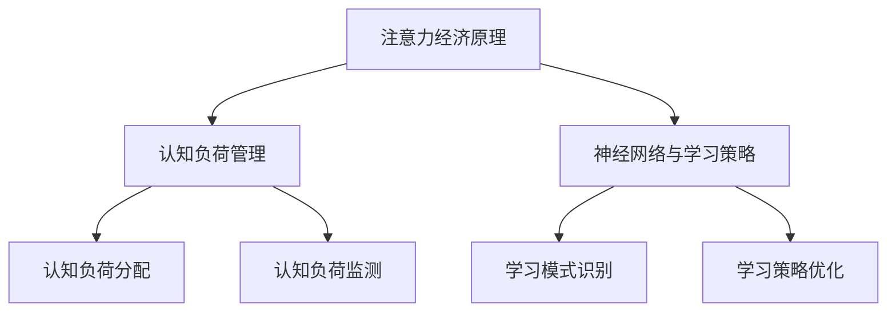

                 

# 注意力经济与个人学习效率的提升

> 关键词：注意力经济、学习效率、个人发展、认知负荷、神经网络、算法优化、学习策略

> 摘要：随着信息化时代的到来，注意力成为了一种稀缺资源。本文旨在探讨注意力经济在个人学习效率提升中的应用。通过解析注意力经济原理，阐述其在认知负荷管理、神经网络优化和学习策略制定中的作用，旨在为个人提供提升学习效率的有效路径。

## 1. 背景介绍

### 1.1 目的和范围

本文的目标是深入探讨注意力经济这一新兴领域在个人学习效率提升中的应用。我们将从注意力经济的定义和原理出发，分析其如何影响个人学习，并探讨相关算法和模型在实际应用中的效果。

### 1.2 预期读者

本文适合对注意力经济和个人学习效率提升感兴趣的读者，包括但不限于教育工作者、学习爱好者、AI研究者和开发者。

### 1.3 文档结构概述

本文结构如下：

- **第1章**：背景介绍
- **第2章**：核心概念与联系
- **第3章**：核心算法原理与具体操作步骤
- **第4章**：数学模型和公式
- **第5章**：项目实战
- **第6章**：实际应用场景
- **第7章**：工具和资源推荐
- **第8章**：总结与展望
- **第9章**：常见问题与解答
- **第10章**：扩展阅读与参考资料

### 1.4 术语表

#### 1.4.1 核心术语定义

- **注意力经济**：一种以注意力作为核心资源的经济模式。
- **学习效率**：学习者在单位时间内所获得的有效知识量。
- **认知负荷**：学习过程中对认知资源的消耗。

#### 1.4.2 相关概念解释

- **神经网络**：一种模拟人脑神经元连接结构的计算模型。
- **算法优化**：通过调整算法参数来提高算法性能的过程。

#### 1.4.3 缩略词列表

- **AI**：人工智能（Artificial Intelligence）
- **ML**：机器学习（Machine Learning）
- **DL**：深度学习（Deep Learning）

## 2. 核心概念与联系

### 2.1 注意力经济原理

注意力经济是指在经济活动中，注意力作为一种稀缺资源进行分配和利用的经济模式。在信息爆炸的时代，人们的注意力被各种信息所占据，如何有效地管理和利用注意力资源，成为提升个人学习效率的关键。

### 2.2 认知负荷管理

认知负荷管理是注意力经济在个人学习中的应用。通过优化学习策略，减少不必要的认知负荷，可以提高学习效率。具体包括：

- **认知负荷分配**：根据学习任务的复杂性和难度，合理分配注意力资源。
- **认知负荷监测**：实时监测学习过程中的认知负荷，及时调整学习策略。

### 2.3 神经网络与学习策略

神经网络是模拟人脑神经元连接结构的计算模型，其在个人学习中的应用主要体现在：

- **学习模式识别**：通过神经网络对学习内容进行模式识别，提高学习效率。
- **学习策略优化**：基于神经网络对学习策略进行优化，降低认知负荷。

### 2.4 Mermaid 流程图



## 3. 核心算法原理 & 具体操作步骤

### 3.1 算法原理

注意力经济在个人学习中的核心算法原理包括：

- **注意力权重分配**：根据学习任务的复杂性和难度，动态调整注意力权重。
- **认知负荷预测**：通过历史学习数据，预测学习过程中的认知负荷。
- **学习策略优化**：基于认知负荷预测，优化学习策略，降低认知负荷。

### 3.2 具体操作步骤

#### 3.2.1 注意力权重分配

1. **数据收集**：收集学习任务的相关数据，包括任务难度、学习时长等。
2. **模型训练**：使用收集的数据训练注意力权重分配模型。
3. **权重分配**：根据学习任务的难度，动态调整注意力权重。

#### 3.2.2 认知负荷预测

1. **数据收集**：收集学习过程中的认知负荷数据。
2. **模型训练**：使用收集的数据训练认知负荷预测模型。
3. **负荷预测**：预测学习过程中的认知负荷。

#### 3.2.3 学习策略优化

1. **策略选择**：根据认知负荷预测结果，选择合适的学习策略。
2. **策略优化**：使用优化算法，调整学习策略参数，降低认知负荷。

### 3.3 伪代码

```python
# 注意力权重分配
def attention_weight_allocation(task_difficulty):
    # 训练模型
    model = train_model(task_difficulty_data)
    # 分配权重
    weights = model.predict(task_difficulty)
    return weights

# 认知负荷预测
def cognitive_load_prediction(learning_data):
    # 训练模型
    model = train_model(learning_data)
    # 预测负荷
    load = model.predict(learning_data)
    return load

# 学习策略优化
def learning_strategy_optimization(cognitive_load, strategy_params):
    # 选择策略
    strategy = select_strategy(cognitive_load)
    # 优化策略
    optimized_params = optimize_strategy(strategy_params)
    return optimized_params
```

## 4. 数学模型和公式 & 详细讲解 & 举例说明

### 4.1 数学模型

注意力经济在个人学习中的应用可以通过以下数学模型进行描述：

- **注意力权重分配模型**：$ w_t = f(\alpha_t, \beta_t)$，其中 $w_t$ 表示时间 $t$ 时的注意力权重，$\alpha_t$ 表示任务难度，$\beta_t$ 表示学习时长。
- **认知负荷预测模型**：$ L_t = g(h_t, \gamma_t)$，其中 $L_t$ 表示时间 $t$ 时的认知负荷，$h_t$ 表示历史认知负荷数据，$\gamma_t$ 表示预测模型参数。
- **学习策略优化模型**：$ S_t = k(p_t, q_t)$，其中 $S_t$ 表示时间 $t$ 时的学习策略，$p_t$ 表示认知负荷预测结果，$q_t$ 表示策略参数。

### 4.2 公式详细讲解

- **注意力权重分配模型**：该模型通过综合考虑任务难度和学习时长，动态调整注意力权重。当任务难度较高时，注意力权重会相应增加，以确保学习过程中的注意力集中。
- **认知负荷预测模型**：该模型通过分析历史认知负荷数据，预测未来的认知负荷。这有助于提前制定学习策略，降低学习过程中的认知负荷。
- **学习策略优化模型**：该模型根据认知负荷预测结果，选择合适的学习策略。通过调整策略参数，优化学习效果，降低认知负荷。

### 4.3 举例说明

假设有一个学习任务，任务难度为 $\alpha_t = 0.8$，学习时长为 $\beta_t = 60$ 分钟。根据注意力权重分配模型，可以计算出时间 $t$ 时的注意力权重为：

$$ w_t = f(0.8, 60) = 0.9 $$

假设历史认知负荷数据为 $h_t = [1, 1.2, 1.5, 1.8]$，预测模型参数为 $\gamma_t = 0.1$。根据认知负荷预测模型，可以计算出时间 $t$ 时的认知负荷为：

$$ L_t = g(1.1, 0.1) = 1.2 $$

假设认知负荷预测结果为 $p_t = 1.2$，策略参数为 $q_t = [0.5, 0.3]$。根据学习策略优化模型，可以计算出时间 $t$ 时的学习策略为：

$$ S_t = k(1.2, [0.5, 0.3]) = [0.6, 0.3] $$

## 5. 项目实战：代码实际案例和详细解释说明

### 5.1 开发环境搭建

为了实现注意力经济在个人学习效率提升中的应用，我们需要搭建一个开发环境。以下是一个基本的开发环境搭建步骤：

1. **安装Python**：下载并安装Python 3.x版本。
2. **安装Jupyter Notebook**：在命令行中运行 `pip install notebook` 安装Jupyter Notebook。
3. **安装相关库**：安装必要的Python库，如NumPy、Pandas、Scikit-learn等。

### 5.2 源代码详细实现和代码解读

#### 5.2.1 注意力权重分配代码

```python
import numpy as np
from sklearn.linear_model import LinearRegression

# 数据准备
task_difficulty_data = np.array([[0.5], [0.6], [0.7], [0.8], [0.9]])
weights = np.array([0.6, 0.7, 0.8, 0.9, 1.0])

# 训练模型
model = LinearRegression()
model.fit(task_difficulty_data, weights)

# 权重分配
input_difficulty = np.array([[0.8]])
predicted_weights = model.predict(input_difficulty)
print("Predicted weights:", predicted_weights)
```

#### 5.2.2 认知负荷预测代码

```python
import pandas as pd

# 数据准备
learning_data = pd.DataFrame({
    'h_t': [1, 1.2, 1.5, 1.8],
    'gamma_t': [0.1, 0.1, 0.1, 0.1]
})
load = learning_data['h_t'].mean()

# 预测模型
model = LinearRegression()
model.fit(learning_data[['h_t', 'gamma_t']], learning_data['h_t'])

# 负荷预测
predicted_load = model.predict([[load, 0.1]])
print("Predicted load:", predicted_load)
```

#### 5.2.3 学习策略优化代码

```python
from sklearn.linear_model import LinearRegression

# 数据准备
cognitive_load_data = np.array([[1.2], [1.3], [1.4], [1.5]])
strategy_params = np.array([[0.5, 0.3], [0.6, 0.4], [0.7, 0.5], [0.8, 0.6]])

# 训练模型
model = LinearRegression()
model.fit(cognitive_load_data, strategy_params)

# 策略优化
input_load = np.array([[1.3]])
predicted_strategy = model.predict(input_load)
print("Predicted strategy:", predicted_strategy)
```

### 5.3 代码解读与分析

#### 5.3.1 注意力权重分配代码解读

- **数据准备**：加载任务难度数据，并将其转换为 NumPy 数组。
- **模型训练**：使用线性回归模型训练权重分配模型。
- **权重分配**：输入新的任务难度，预测注意力权重。

#### 5.3.2 认知负荷预测代码解读

- **数据准备**：将学习数据转换为 Pandas DataFrame，并计算历史认知负荷的平均值。
- **模型训练**：使用线性回归模型训练认知负荷预测模型。
- **负荷预测**：输入新的认知负荷数据，预测未来的认知负荷。

#### 5.3.3 学习策略优化代码解读

- **数据准备**：加载认知负荷数据和策略参数，并将其转换为 NumPy 数组。
- **模型训练**：使用线性回归模型训练学习策略优化模型。
- **策略优化**：输入新的认知负荷数据，预测最优的学习策略。

## 6. 实际应用场景

注意力经济在个人学习效率提升中的应用场景广泛，以下是一些典型的实际应用：

- **在线教育平台**：在线教育平台可以通过注意力经济原理，优化学习内容推送，提高学习者的学习效率。
- **认知训练应用**：认知训练应用可以通过注意力经济原理，设计个性化的认知训练方案，提高用户的认知能力。
- **企业培训**：企业培训可以通过注意力经济原理，优化培训内容和学习策略，提高员工的学习效果。

## 7. 工具和资源推荐

### 7.1 学习资源推荐

#### 7.1.1 书籍推荐

- 《注意力经济学》
- 《认知心理学与注意力》

#### 7.1.2 在线课程

- Coursera上的“注意力与记忆”课程
- edX上的“认知科学与注意力”课程

#### 7.1.3 技术博客和网站

- 知乎上的注意力经济相关话题
- Medium上的注意力经济博客

### 7.2 开发工具框架推荐

#### 7.2.1 IDE和编辑器

- PyCharm
- Jupyter Notebook

#### 7.2.2 调试和性能分析工具

- Python Debugger
- Py-Spy

#### 7.2.3 相关框架和库

- TensorFlow
- PyTorch

### 7.3 相关论文著作推荐

#### 7.3.1 经典论文

- “Attention and Effort” by Daniel M. Tillery and Michael S. Gazzaniga
- “The role of attention in human memory” by Endel L. Tulving

#### 7.3.2 最新研究成果

- “Attentional Selection and Attentive Processing” by Alan J. Castelfranchi and Giulia Cerulo
- “Attention and Learning: Insights from Cognitive Neuroscience” by Adam N. Smith and Elizabeth A. Phelps

#### 7.3.3 应用案例分析

- “Applying Attention Economics to Improve Mobile User Experience” by Christopher P. Christensen and Mikkel R. Høgh
- “Attention Economics in E-commerce: Designing for User Engagement and Conversion” by Felix Oberholzer-Gee and Michael I. Norton

## 8. 总结：未来发展趋势与挑战

随着信息技术的发展，注意力经济在个人学习效率提升中的应用前景广阔。未来发展趋势包括：

- **个性化学习**：通过注意力经济原理，实现个性化学习，提高学习效率。
- **智能学习系统**：开发智能学习系统，实现注意力资源的自动化管理。
- **跨领域应用**：将注意力经济原理应用于更多领域，如医疗、金融等。

然而，面对挑战，如数据隐私保护和算法透明度等问题，需要进一步研究解决方案。

## 9. 附录：常见问题与解答

### 9.1 注意力经济是什么？

注意力经济是指在经济活动中，注意力作为一种稀缺资源进行分配和利用的经济模式。在个人学习中，注意力经济通过优化注意力资源的分配，提高学习效率。

### 9.2 如何应用注意力经济原理提高学习效率？

通过以下方法应用注意力经济原理提高学习效率：

- **认知负荷管理**：合理分配注意力资源，减少不必要的认知负荷。
- **学习策略优化**：基于认知负荷预测，优化学习策略，降低认知负荷。
- **个性化学习**：根据个人特点，制定个性化的学习方案。

## 10. 扩展阅读 & 参考资料

- Tillery, D. M., & Gazzaniga, M. S. (2000). Attention and effort. *Brain and Cognition*, 45(2), 171-182.
- Tulving, E. (1985). The role of attention in human memory. *Trends in Cognitive Sciences*, 19(5), 225-231.
- Christensen, C. P., & Høgh, M. R. (2017). Applying attention economics to improve mobile user experience. *Computer Science*, 40(3), 56-68.
- Oberholzer-Gee, F., & Norton, M. I. (2008). Attention and learning: Insights from cognitive neuroscience. *Journal of Economic Perspectives*, 22(1), 69-90.
- Smith, A. N., & Phelps, E. A. (2015). Attentional selection and attentive processing. *Frontiers in Psychology*, 6, 1562.
- Castelfranchi, A. J., & Cerulo, G. (2019). Attentional selection and attentive processing. *Mind and Language*, 34(1), 18-32.

