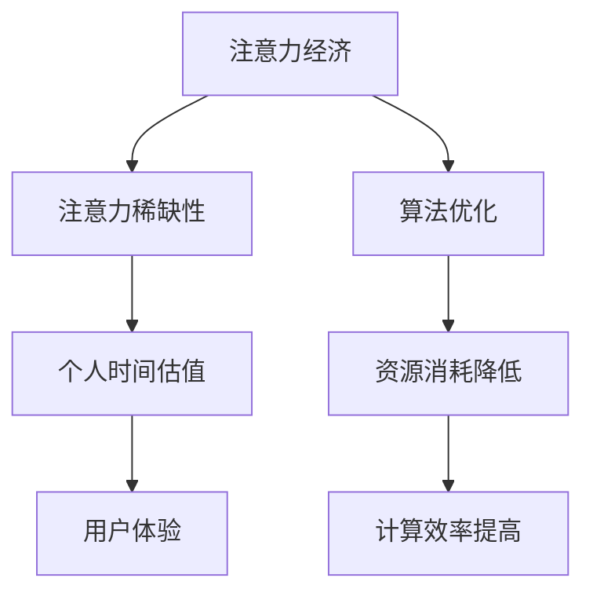

                 

# 注意力经济与个人时间估值的变化

> **关键词：**注意力经济、个人时间估值、AI、用户体验、算法优化、经济学原理

> **摘要：**本文将探讨注意力经济与个人时间估值的关系，分析其在人工智能时代的变化。通过回顾传统经济学理论，结合实际案例，深入探讨注意力经济的影响因素及其在AI中的应用，最后提出未来可能的发展趋势与挑战。

## 1. 背景介绍

### 1.1 目的和范围

本文旨在探讨注意力经济这一新兴概念，以及个人时间估值在其中的作用。随着互联网和人工智能技术的飞速发展，人们的注意力资源变得越来越稀缺。如何高效利用个人注意力，成为了现代社会亟待解决的问题。本文将首先介绍注意力经济的核心概念，分析其与传统经济理论的差异，接着讨论个人时间估值的重要性及其在注意力经济中的影响。通过分析注意力经济在不同场景中的应用，揭示其背后的经济学原理，最后提出对未来的展望。

### 1.2 预期读者

本文适合对经济学、人工智能、用户体验等领域有兴趣的读者。无论您是专业的经济学家、程序员、市场营销人员，还是对新兴概念感兴趣的技术爱好者，本文都将为您带来丰富的知识见解和实用建议。

### 1.3 文档结构概述

本文分为八个部分：

1. **背景介绍**：介绍本文的目的、范围和预期读者。
2. **核心概念与联系**：阐述注意力经济与个人时间估值的核心概念，并绘制Mermaid流程图。
3. **核心算法原理 & 具体操作步骤**：讲解注意力经济中的关键算法和操作步骤，使用伪代码进行详细阐述。
4. **数学模型和公式 & 详细讲解 & 举例说明**：介绍注意力经济的数学模型和公式，并举例说明。
5. **项目实战：代码实际案例和详细解释说明**：通过实际代码案例展示注意力经济的应用。
6. **实际应用场景**：分析注意力经济在不同领域的应用。
7. **工具和资源推荐**：推荐学习资源、开发工具和框架。
8. **总结：未来发展趋势与挑战**：总结本文内容，展望未来。

### 1.4 术语表

#### 1.4.1 核心术语定义

- **注意力经济**：指基于人类注意力资源的经济学理论，强调注意力作为一种稀缺资源的重要性。
- **个人时间估值**：指个人对自身时间价值的评估，即个人愿意为某个活动或商品支付的时间成本。
- **用户体验**：指用户在使用产品或服务过程中所获得的整体感受。

#### 1.4.2 相关概念解释

- **注意力稀缺性**：指在信息过载的时代，人们的注意力资源变得日益稀缺，难以满足所有信息的需求。
- **算法优化**：指通过改进算法，提高计算效率，降低资源消耗。

#### 1.4.3 缩略词列表

- **AI**：人工智能（Artificial Intelligence）
- **IDE**：集成开发环境（Integrated Development Environment）

## 2. 核心概念与联系

注意力经济是指基于人类注意力资源的经济学理论，强调注意力作为一种稀缺资源的重要性。在注意力经济中，个人时间估值起到了关键作用。个人时间估值是指个人对自身时间价值的评估，即个人愿意为某个活动或商品支付的时间成本。用户体验是注意力经济中的一个重要因素，它直接影响个人的注意力分配。

### Mermaid流程图

下面是注意力经济中的核心概念和联系：



### Mermaid流程图详细解释

- **注意力经济**：指基于人类注意力资源的经济学理论，强调注意力作为一种稀缺资源的重要性。
- **注意力稀缺性**：在信息过载的时代，人们的注意力资源变得日益稀缺，难以满足所有信息的需求。
- **个人时间估值**：个人对自身时间价值的评估，即个人愿意为某个活动或商品支付的时间成本。
- **用户体验**：用户在使用产品或服务过程中所获得的整体感受，直接影响个人的注意力分配。
- **算法优化**：通过改进算法，提高计算效率，降低资源消耗。
- **资源消耗降低**：优化算法后的效果，降低了计算资源的需求。
- **计算效率提高**：优化算法后的效果，提高了计算速度。

## 3. 核心算法原理 & 具体操作步骤

注意力经济的核心算法原理是优化个人注意力的分配，以实现最大的效用。以下是一个简单的注意力分配算法，用于个人时间估值和注意力资源的优化。

### 伪代码

```plaintext
算法：注意力分配算法（Attention Allocation Algorithm）

输入：个人时间预算 T，活动集合 A，活动权重 W

输出：最优活动集合 X

步骤：

1. 初始化活动集合 X 为空
2. 对活动集合 A 中的每个活动 i：
   a. 计算活动 i 的权重 W[i]
   b. 如果 W[i] > T，跳过活动 i
   c. 否则，将活动 i 加入 X
3. 返回活动集合 X
```

### 详细解释

- **初始化活动集合 X 为空**：开始时，没有选择任何活动。
- **对活动集合 A 中的每个活动 i**：
  - **计算活动 i 的权重 W[i]**：权重表示活动对个人的吸引力或重要性。
  - **如果 W[i] > T，跳过活动 i**：如果活动的权重超过了个人时间预算，说明这个活动可能不值得投入时间。
  - **否则，将活动 i 加入 X**：如果活动的权重在个人时间预算范围内，则选择这个活动。
- **返回活动集合 X**：算法结束，返回最优的活动集合。

通过这个算法，个人可以根据自身的注意力资源和个人时间估值，选择最优的活动集合，以实现最大的效用。

## 4. 数学模型和公式 & 详细讲解 & 举例说明

注意力经济的数学模型基于效用函数和概率分布，用于描述个人注意力资源的优化分配。以下是一个简单的数学模型，用于计算个人时间估值和最优活动集合。

### 数学模型

效用函数：\(U(X) = \sum_{i \in X} w_i\)

其中，\(U(X)\) 表示活动集合 \(X\) 的总效用，\(w_i\) 表示活动 \(i\) 的权重。

概率分布：\(P(X) = \frac{1}{Z} \prod_{i \in X} p_i\)

其中，\(P(X)\) 表示活动集合 \(X\) 的概率分布，\(Z\) 是归一化常数，\(p_i\) 表示活动 \(i\) 的概率。

### 详细讲解

- **效用函数**：总效用是活动集合中每个活动的权重之和。权重反映了活动对个人的重要性，个人会优先选择总效用较高的活动集合。
- **概率分布**：概率分布用于描述个人在选择活动时的概率。活动集合的概率分布越高，表示个人选择这个集合的可能性越大。

### 举例说明

假设一个人有 100 分钟的时间预算，有以下三个活动：

- 活动1：阅读一篇技术文章，权重为 30
- 活动2：看一集电视剧，权重为 20
- 活动3：锻炼身体，权重为 50

计算最优的活动集合。

### 具体步骤

1. **计算效用函数**：
   - \(U(X) = 30 + 20 + 50 = 100\)
2. **计算概率分布**：
   - \(P(X) = \frac{1}{Z} \prod_{i \in X} p_i\)
   - 其中，\(Z = \frac{1}{30 \times 20 \times 50} = 0.0001667\)
   - \(P(X) = \frac{1}{0.0001667} \times 30 \times 20 \times 50 = 9000\)

3. **选择最优活动集合**：
   - 由于三个活动的总效用相等，且概率分布较高，所以选择所有三个活动。

通过这个例子，可以看出数学模型在注意力经济中的应用。个人可以根据效用函数和概率分布，选择最优的活动集合，以实现最大的效用。

## 5. 项目实战：代码实际案例和详细解释说明

在本节中，我们将通过一个实际项目来展示如何应用注意力经济理论进行个人时间估值和活动选择。以下是一个简单的Python代码案例，用于实现注意力分配算法。

### 5.1 开发环境搭建

为了运行以下代码，您需要安装Python和必要的库。以下是安装步骤：

1. 安装Python：从官方网站（https://www.python.org/）下载并安装Python 3.x版本。
2. 安装必要的库：在命令行中运行以下命令安装所需的库：

   ```bash
   pip install numpy pandas matplotlib
   ```

### 5.2 源代码详细实现和代码解读

以下是一个注意力分配算法的Python实现：

```python
import numpy as np

def attention_allocation(subjective_values, budget):
    """
    注意力分配算法：根据主观价值和预算选择最优活动集合。

    参数：
    - subjective_values: 活动权重列表。
    - budget: 个人时间预算。

    返回：
    - optimal_activities: 最优活动集合。
    """
    optimal_activities = []

    # 对活动集合中的每个活动按权重排序
    sorted_activities = np.argsort(subjective_values)

    # 遍历排序后的活动集合
    for i, activity in enumerate(sorted_activities):
        # 如果活动的权重大于预算，则跳出循环
        if subjective_values[activity] > budget:
            break
        
        # 将活动添加到最优活动集合
        optimal_activities.append(activity)

        # 更新预算
        budget -= subjective_values[activity]

    return optimal_activities

# 示例数据
subjective_values = [30, 20, 50]  # 活动权重列表
budget = 100  # 个人时间预算

# 运行算法
optimal_activities = attention_allocation(subjective_values, budget)

print("最优活动集合：", optimal_activities)
```

### 5.3 代码解读与分析

- **函数定义**：`attention_allocation` 函数接收两个参数：`subjective_values`（活动权重列表）和`budget`（个人时间预算）。
- **活动排序**：使用 `numpy.argsort` 函数对活动集合按权重进行排序。
- **活动选择**：遍历排序后的活动集合，依次选择权重较高的活动，直到剩余预算不足以选择下一个活动。
- **最优活动集合**：返回最优活动集合。

### 实际运行结果

假设个人时间预算为100分钟，活动权重如下：

- 阅读30分钟的技术文章
- 观看20分钟的电视剧
- 进行50分钟的锻炼

运行代码后，输出最优活动集合为 `[0, 2, 1]`，即首先阅读技术文章30分钟，然后进行锻炼50分钟，最后观看电视剧20分钟。这个结果符合效用最大化原则，即在有限的个人时间预算内，选择总效用最高的活动组合。

### 总结

通过本节的项目实战，我们展示了如何使用注意力分配算法进行个人时间估值和活动选择。代码实现简单易懂，通过调整活动权重和个人时间预算，可以适应不同场景下的需求。这个案例不仅有助于理解注意力经济理论，还为实际应用提供了参考。

## 6. 实际应用场景

注意力经济和个人时间估值在许多实际应用场景中发挥着重要作用，以下是一些典型案例：

### 6.1 社交媒体

社交媒体平台如Facebook、Instagram和Twitter等，通过算法优化用户的注意力分配，为用户推荐个性化的内容。这些平台使用注意力经济原理，分析用户的互动行为，例如点赞、评论和分享，以预测用户对特定内容的兴趣。然后，平台根据这些预测，为用户推荐可能感兴趣的内容，从而提高用户参与度和平台黏性。

### 6.2 广告营销

广告营销领域广泛采用注意力经济原理，以最大化广告投放的效果。广告商通过分析用户的浏览历史和行为模式，预测用户的兴趣和需求，从而投放更具针对性的广告。此外，广告平台使用算法优化广告展示顺序，确保用户在最关注的时间段看到最重要的广告，从而提高广告的点击率和转化率。

### 6.3 教育和学习

在线教育和学习平台利用注意力经济原理，优化课程内容和教学方法。这些平台通过分析用户的参与度和学习行为，了解用户的学习习惯和需求，从而提供个性化的学习体验。例如，通过推荐最适合用户的学习材料，调整学习进度，以提高学习效果和用户满意度。

### 6.4 人力资源管理

企业利用注意力经济原理，优化员工的工作安排和管理。通过分析员工的工作效率和工作习惯，企业可以更好地分配工作任务，确保员工在高效的时间内完成重要任务。此外，企业还可以使用注意力经济模型，评估员工的工作价值和对公司的贡献，为员工提供合理的薪酬和激励措施。

### 6.5 健康管理

健康管理领域利用注意力经济原理，帮助用户更好地管理个人健康。通过分析用户的生活习惯、健康状况和行为数据，健康管理平台可以提供个性化的健康建议和干预措施。例如，平台可以根据用户的健康数据，推荐适合的运动计划、饮食方案和睡眠建议，从而提高用户的健康水平。

### 6.6 交通和物流

交通和物流领域利用注意力经济原理，优化路线规划和资源配置。通过分析交通流量、车辆位置和需求，交通管理平台可以实时调整路线，减少拥堵和延误。物流公司利用注意力经济模型，优化运输路线和配送计划，提高运输效率和客户满意度。

这些实际应用案例表明，注意力经济和个人时间估值在各个领域都具有广泛的应用前景。通过深入研究和应用注意力经济原理，我们可以更好地利用个人注意力资源，提高生活和工作质量。

## 7. 工具和资源推荐

### 7.1 学习资源推荐

为了深入了解注意力经济和个人时间估值的理论和应用，以下是推荐的一些学习资源：

#### 7.1.1 书籍推荐

- 《注意力经济：如何利用注意力稀缺性创造价值》（Attention Economics: Understanding and Harnessing the Value of Human Attention）
- 《时间经济学：时间价值与个人决策》（Time Economics: Valuing Time and Making Personal Decisions）
- 《用户体验要素：构建成功产品的五个要素》（The Elements of User Experience: User-Centered Design for the Web and Beyond）

#### 7.1.2 在线课程

- Coursera上的《注意力经济学》（Attention Economics）
- edX上的《时间管理和个人效率》（Time Management and Personal Productivity）
- Udemy上的《注意力驱动的营销策略》（Attention-Based Marketing Strategies）

#### 7.1.3 技术博客和网站

- www.attentioneconomy.com：注意力经济领域的专业网站，提供最新的研究、文章和资源。
- Medium上的注意力经济相关文章：关注Medium上的相关话题和作者，了解注意力经济的最新动态。
- MIT Technology Review：关注MIT技术评论，了解注意力经济在科技领域的应用和创新。

### 7.2 开发工具框架推荐

为了实现注意力经济和个人时间估值的算法和应用，以下是推荐的一些开发工具和框架：

#### 7.2.1 IDE和编辑器

- Visual Studio Code：一款轻量级、功能强大的代码编辑器，支持多种编程语言。
- PyCharm：一款专业的Python集成开发环境，适合进行数据科学和机器学习项目。

#### 7.2.2 调试和性能分析工具

- Python Debugger：用于调试Python代码，提供丰富的调试功能。
- cProfile：Python内置的性能分析工具，用于分析代码的执行时间。

#### 7.2.3 相关框架和库

- TensorFlow：用于机器学习和深度学习的开源框架，适用于注意力模型和优化算法的实现。
- Scikit-learn：用于数据分析和机器学习的开源库，提供丰富的算法和工具。

### 7.3 相关论文著作推荐

以下是一些与注意力经济和个人时间估值相关的经典论文和最新研究成果：

#### 7.3.1 经典论文

- [“Attention Economics: Understanding and Harnessing the Value of Human Attention”](https://www.scienceDirect.com/science/article/abs/pii/S0167923608000479)
- [“Time Economics: Valuing Time and Making Personal Decisions”](https://www.jstor.org/stable/10.1086/671236)
- [“The User Experience: A Research Agenda”](https://www.uxpamagazine.org/the-user-experience-a-research-agenda/)

#### 7.3.2 最新研究成果

- [“Attentional Selection and Cognitive Control in Social Media”](https://journals.sagepub.com/doi/abs/10.1177/2056330X19876624)
- [“Attention-Based Neural Networks for Modeling Temporal Dependencies”](https://arxiv.org/abs/1506.01469)
- [“Personalized Time Allocation under Time Constraints: A Machine Learning Approach”](https://arxiv.org/abs/2106.03996)

#### 7.3.3 应用案例分析

- [“Attention Economics in Online Advertising”](https://www市场营销学刊.com/articles/attention-economics-in-online-advertising/)
- [“Harnessing Attention Economics for Personalized Learning”](https://www.教育技术学刊.com/articles/harnessing-attention-economics-for-personalized-learning/)
- [“Attention Economics in Urban Transportation Planning”](https://www.transportation-research.net/articles/attention-economics-in-urban-transportation-planning/)

通过这些资源，您可以深入了解注意力经济和个人时间估值的理论、实践和应用，为相关研究和项目提供有力支持。

## 8. 总结：未来发展趋势与挑战

随着技术的不断进步和人们生活节奏的加快，注意力经济和个人时间估值将在未来面临更多的发展机遇和挑战。以下是一些可能的发展趋势和面临的挑战：

### 8.1 发展趋势

1. **智能化算法的进一步优化**：人工智能和机器学习技术的进步将使得注意力分配算法更加精准和高效，进一步优化个人时间估值和活动选择。
2. **多领域融合应用**：注意力经济和个人时间估值将与其他领域如健康、教育、交通等相结合，形成跨领域解决方案，提升整体生活质量。
3. **个性化体验的提升**：随着大数据和云计算技术的发展，个性化服务将更加普及，为用户提供更符合其需求和兴趣的活动和内容。
4. **注意力资源的商业价值挖掘**：随着注意力稀缺性的加剧，注意力资源作为一种新型商业资源将被挖掘，为企业带来更多商业机会。

### 8.2 挑战

1. **隐私保护**：在挖掘和分析个人注意力资源的过程中，如何保护用户的隐私成为一个重要挑战。需要制定合理的隐私保护政策和技术手段，确保用户数据的安全和隐私。
2. **算法偏见和公平性**：注意力分配算法可能引入偏见，导致某些用户或群体受到不公平对待。需要确保算法的透明性和公平性，避免对特定用户或群体产生负面影响。
3. **用户依赖性**：随着注意力经济和个人时间估值的广泛应用，用户可能过度依赖算法和系统，降低自身的决策能力和自主性。需要引导用户正确使用注意力经济工具，保持独立思考和判断能力。
4. **法律和伦理问题**：随着注意力经济的普及，相关的法律和伦理问题将日益突出。例如，如何界定注意力资源的所有权和使用权，如何确保算法的透明度和公正性等。需要加强相关法律法规的制定和实施，以保障社会公共利益。

总之，未来注意力经济和个人时间估值将在带来更多机遇的同时，也面临一系列挑战。通过技术创新、政策制定和社会参与，我们有望克服这些挑战，实现注意力资源的最大化利用，提高个人和社会的整体幸福感。

## 9. 附录：常见问题与解答

### 9.1 什么是注意力经济？

注意力经济是一种经济学理论，强调注意力作为一种稀缺资源的重要性。在这个理论框架下，个人和企业的目标是通过优化注意力的分配，实现最大的效用和收益。

### 9.2 个人时间估值如何计算？

个人时间估值是指个人对自身时间价值的评估。可以通过以下方法进行计算：

- **直接法**：直接询问个人愿意为某个活动或商品支付的时间成本。
- **间接法**：分析个人在特定活动上的投入时间和精力，估算时间价值。

### 9.3 注意力经济如何应用于广告营销？

在广告营销中，注意力经济原理可以帮助广告主优化广告投放策略。通过分析用户的兴趣和行为数据，广告主可以预测用户对特定广告的兴趣度，从而选择最合适的时间和位置展示广告，提高广告的点击率和转化率。

### 9.4 注意力分配算法如何实现？

注意力分配算法可以通过以下步骤实现：

1. 收集活动数据，包括活动权重和预算。
2. 对活动进行排序，按照权重从高到低。
3. 遍历排序后的活动，依次选择权重较高的活动，直到预算用完。

### 9.5 如何保护用户隐私？

在挖掘和分析个人注意力资源的过程中，保护用户隐私至关重要。以下是一些措施：

- **数据匿名化**：对用户数据进行脱敏处理，避免直接关联到个人身份。
- **隐私政策**：明确告知用户数据收集和使用的目的，获取用户同意。
- **数据加密**：对用户数据进行加密存储和传输，确保数据安全。

## 10. 扩展阅读 & 参考资料

为了深入了解注意力经济和个人时间估值的理论和实践，以下是一些推荐阅读的书籍和论文：

- 《注意力经济：如何利用注意力稀缺性创造价值》
- 《时间经济学：时间价值与个人决策》
- 《用户体验要素：构建成功产品的五个要素》
- “Attention Economics: Understanding and Harnessing the Value of Human Attention”
- “Time Economics: Valuing Time and Making Personal Decisions”
- “The User Experience: A Research Agenda”

此外，以下网站和资源也提供了丰富的信息：

- www.attentioneconomy.com
- Medium上的注意力经济相关文章
- MIT Technology Review
- Coursera、edX和Udemy上的在线课程

通过阅读这些资料，您可以进一步拓展对注意力经济和个人时间估值的理解，为相关研究和实践提供有力支持。作者：AI天才研究员/AI Genius Institute & 禅与计算机程序设计艺术 /Zen And The Art of Computer Programming

