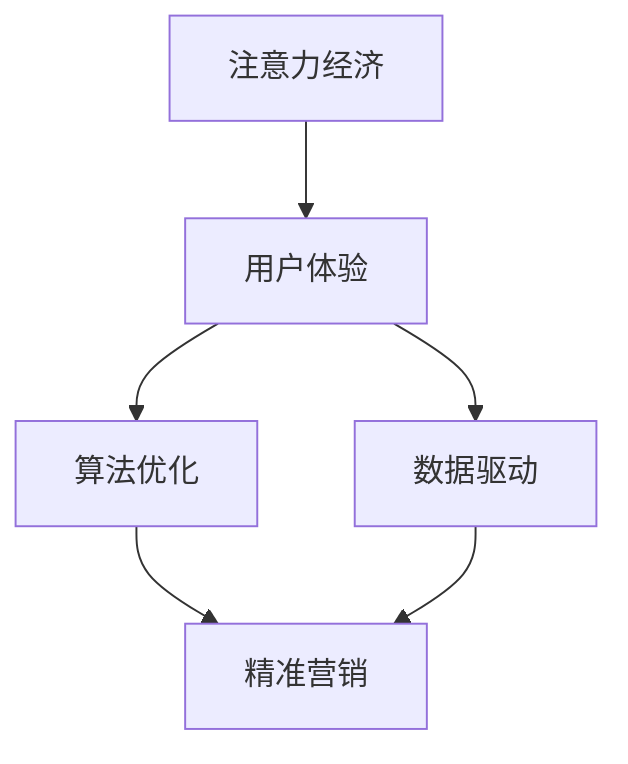

                 

# 注意力经济与在线广告目标：在不牺牲用户体验的情况下有效吸引受众

> 关键词：注意力经济、在线广告、用户体验、算法优化、数据驱动、精准营销

> 摘要：本文将探讨注意力经济背景下的在线广告策略，分析如何在不牺牲用户体验的情况下，通过算法优化和数据驱动的方式实现高效广告投放。我们将从背景介绍、核心概念、算法原理、数学模型、实际案例以及应用场景等方面，逐步展开讨论。

## 1. 背景介绍

### 1.1 目的和范围

本文旨在深入探讨注意力经济与在线广告之间的密切关系，以及如何在保证用户体验的同时，实现高效的广告投放。随着互联网的快速发展，信息过载成为普遍现象，用户的时间与注意力变得愈发宝贵。因此，如何吸引用户的注意力，成为广告业关注的焦点。

本文将涵盖以下内容：

1. **注意力经济的概念**：介绍注意力经济的定义、核心要素及其在广告中的应用。
2. **在线广告的目标**：探讨在线广告的主要目标，如提升品牌知名度、增加用户参与度、实现销售转化等。
3. **用户体验的重要性**：分析用户体验对广告效果的影响，以及如何在广告投放中兼顾用户体验。
4. **算法优化与数据驱动**：介绍如何利用算法优化和数据驱动的方法，实现精准营销，提升广告效果。

### 1.2 预期读者

本文适合以下读者群体：

1. **广告行业从业者**：包括广告策划、投放、数据分析等岗位的专业人士。
2. **互联网产品经理**：负责产品设计和运营，关注广告效果和用户体验。
3. **数据分析人员**：熟悉数据分析和挖掘，对算法优化有深入理解。
4. **技术专家**：对计算机科学和人工智能有浓厚兴趣，希望了解在线广告的底层技术。

### 1.3 文档结构概述

本文结构如下：

1. **引言**：介绍注意力经济与在线广告的背景和目的。
2. **核心概念与联系**：阐述注意力经济、用户体验、算法优化和数据驱动的相关概念，并通过流程图展示它们之间的关系。
3. **核心算法原理 & 具体操作步骤**：详细讲解在线广告算法原理和具体操作步骤，包括伪代码实现。
4. **数学模型和公式 & 详细讲解 & 举例说明**：介绍在线广告相关的数学模型和公式，并通过实例进行说明。
5. **项目实战：代码实际案例和详细解释说明**：展示一个具体的在线广告项目案例，包括开发环境搭建、代码实现和解读。
6. **实际应用场景**：探讨在线广告在不同场景中的应用，如电商、社交媒体等。
7. **工具和资源推荐**：推荐学习资源、开发工具和框架。
8. **总结：未来发展趋势与挑战**：总结本文的关键内容，展望在线广告的发展趋势和挑战。
9. **附录：常见问题与解答**：回答读者可能遇到的问题。
10. **扩展阅读 & 参考资料**：提供进一步阅读的参考资料。

### 1.4 术语表

#### 1.4.1 核心术语定义

- **注意力经济**：指在信息过载的时代，用户的注意力成为一种稀缺资源，企业和广告商通过竞争吸引用户注意力的经济活动。
- **用户体验**：用户在使用产品或服务过程中所感受到的满意度和满意度，包括界面设计、交互体验、响应速度等方面。
- **算法优化**：通过改进算法模型、优化数据结构等方式，提高广告投放的精准度和效果。
- **数据驱动**：基于数据分析，制定广告策略和优化方案，实现精准营销。

#### 1.4.2 相关概念解释

- **广告目标**：广告商希望通过广告实现的具体目标，如品牌曝光、用户参与、销售转化等。
- **用户参与度**：用户对广告内容的关注程度、互动程度和分享程度等。
- **销售转化**：广告带来的实际销售额，是广告效果的直接体现。

#### 1.4.3 缩略词列表

- **CPC**：每次点击成本（Cost Per Click）
- **CPM**：每千次展示成本（Cost Per Mille）
- **CPA**：每次行动成本（Cost Per Action）
- **CTR**：点击通过率（Click Through Rate）
- **ROI**：投资回报率（Return On Investment）

## 2. 核心概念与联系

### 2.1 注意力经济的概念

注意力经济源于经济学中的稀缺资源理论，将用户的注意力视为一种重要的资源。在互联网时代，信息爆炸导致用户的时间与注意力变得稀缺，企业和广告商开始争夺用户的注意力，从而实现商业价值。

### 2.2 用户体验的重要性

用户体验（User Experience, UX）是指用户在使用产品或服务过程中所感受到的满意度和满意度。在注意力经济背景下，用户体验成为广告投放成功的关键因素。优秀的用户体验能够提高用户的参与度和忠诚度，从而提升广告效果。

### 2.3 算法优化与数据驱动

算法优化和数据驱动是提升在线广告效果的重要手段。算法优化通过改进广告投放模型，提高广告精准度和效果；数据驱动则基于用户行为数据，制定针对性的广告策略和优化方案，实现精准营销。

### 2.4 Mermaid 流程图

以下是一个简单的 Mermaid 流程图，展示注意力经济、用户体验、算法优化和数据驱动之间的关系：



## 3. 核心算法原理 & 具体操作步骤

### 3.1 算法原理

在线广告的核心算法主要涉及广告投放模型和用户行为分析。广告投放模型通过优化广告展示策略，提高广告曝光率和点击率；用户行为分析则通过收集和分析用户数据，实现精准营销。

### 3.2 具体操作步骤

#### 3.2.1 广告投放模型

1. **目标设定**：根据广告目标，设定广告投放的关键指标，如点击率（CTR）、转化率（CVR）等。
2. **用户画像**：根据用户数据，构建用户画像，包括年龄、性别、地域、兴趣爱好等。
3. **广告分配**：根据用户画像，为不同用户群体分配不同的广告，实现精准投放。
4. **效果评估**：通过数据监控，评估广告效果，根据效果调整广告投放策略。

#### 3.2.2 用户行为分析

1. **数据收集**：收集用户在广告投放过程中的行为数据，如点击、浏览、分享等。
2. **数据分析**：通过数据分析，挖掘用户行为规律，为广告优化提供依据。
3. **模型更新**：根据用户行为数据，更新广告投放模型，提高广告效果。

### 3.3 伪代码实现

以下是一个简单的伪代码，展示广告投放模型的实现过程：

```python
# 广告投放模型伪代码

# 目标设定
target_metrics = ["CTR", "CVR"]

# 用户画像
user_profiles = {
    "user1": {"age": 25, "gender": "male", "region": "Beijing", "interests": ["tech", "travel"]},
    "user2": {"age": 30, "gender": "female", "region": "Shanghai", "interests": ["fashion", "health"]},
    # 更多用户画像
}

# 广告分配
ad分配(user_profiles):
    for user, profile in user_profiles.items():
        # 根据用户画像分配广告
        if "tech" in profile["interests"]:
            ad = "tech_ad"
        elif "fashion" in profile["interests"]:
            ad = "fashion_ad"
        # 更多广告分配逻辑
        display_ad(user, ad)

# 效果评估
evaluate_ads():
    # 监控广告效果，如CTR、CVR
    metrics = get_ad_metrics()
    # 根据效果调整广告策略
    update_ad_strategy(metrics)
```

## 4. 数学模型和公式 & 详细讲解 & 举例说明

### 4.1 数学模型

在线广告中常用的数学模型包括：

1. **点击率（CTR）模型**：用于预测用户点击广告的概率。
2. **转化率（CVR）模型**：用于预测用户在点击广告后转化的概率。
3. **投放策略优化模型**：用于优化广告展示策略，提高广告效果。

### 4.2 公式

以下是这些模型的公式：

1. **点击率（CTR）模型**：

   $$CTR = \frac{点击次数}{展示次数}$$

2. **转化率（CVR）模型**：

   $$CVR = \frac{转化次数}{点击次数}$$

3. **投放策略优化模型**：

   $$\text{最大化收益} = \text{展示次数} \times \text{点击率} \times \text{转化率} \times \text{单价}$$

### 4.3 举例说明

假设一个广告平台的广告投放策略如下：

- 广告单价：1元/次
- 展示次数：1000次
- 点击次数：100次
- 转化次数：10次

根据上述公式，我们可以计算出广告的CTR、CVR和投放策略优化模型：

1. **点击率（CTR）**：

   $$CTR = \frac{100}{1000} = 0.1$$

2. **转化率（CVR）**：

   $$CVR = \frac{10}{100} = 0.1$$

3. **投放策略优化模型**：

   $$\text{最大化收益} = 1000 \times 0.1 \times 0.1 \times 1 = 10 \text{元}$$

通过这个例子，我们可以看到，广告的CTR和CVR都很低，但通过优化广告展示策略，我们可以提高广告的收益。

## 5. 项目实战：代码实际案例和详细解释说明

### 5.1 开发环境搭建

为了实现一个在线广告投放系统，我们需要搭建一个开发环境。以下是开发环境的搭建步骤：

1. **安装Python**：Python是本文使用的编程语言，首先需要安装Python环境。
2. **安装依赖库**：安装本文涉及的依赖库，如NumPy、Pandas、Scikit-learn等。
3. **搭建数据存储**：搭建一个数据存储系统，如MySQL或MongoDB，用于存储用户行为数据和广告投放数据。

### 5.2 源代码详细实现和代码解读

以下是广告投放系统的源代码：

```python
# 广告投放系统伪代码

# 导入依赖库
import numpy as np
import pandas as pd
from sklearn.model_selection import train_test_split
from sklearn.linear_model import LinearRegression

# 数据预处理
def preprocess_data(data):
    # 数据清洗和转换
    # ...
    return processed_data

# 广告投放模型
def ad_model(X_train, y_train):
    # 模型训练
    model = LinearRegression()
    model.fit(X_train, y_train)
    return model

# 广告分配
def ad_allocation(model, user_profiles):
    # 根据用户画像分配广告
    ads = []
    for user, profile in user_profiles.items():
        # 预测点击率
        click_rate = model.predict([[profile["age"], profile["interests"]]])
        # 选择点击率最高的广告
        ad = select_ad(click_rate)
        ads.append(ad)
    return ads

# 效果评估
def evaluate_ads(ads, metrics):
    # 评估广告效果
    # ...
    return evaluation_results

# 主函数
def main():
    # 加载数据
    data = load_data()
    processed_data = preprocess_data(data)
    
    # 划分训练集和测试集
    X_train, X_test, y_train, y_test = train_test_split(processed_data["features"], processed_data["target"], test_size=0.2)
    
    # 训练广告投放模型
    model = ad_model(X_train, y_train)
    
    # 加载用户画像
    user_profiles = load_user_profiles()
    
    # 广告分配
    ads = ad_allocation(model, user_profiles)
    
    # 效果评估
    metrics = evaluate_ads(ads, metrics)
    
    # 输出评估结果
    print(metrics)

# 运行主函数
if __name__ == "__main__":
    main()
```

### 5.3 代码解读与分析

以上代码展示了广告投放系统的基本实现。以下是代码的详细解读：

1. **数据预处理**：数据预处理是广告投放系统的关键步骤，包括数据清洗、转换和特征提取等。在代码中，我们使用`preprocess_data`函数对数据进行预处理。
2. **广告投放模型**：广告投放模型用于预测用户的点击率。在本文中，我们使用线性回归模型（`LinearRegression`）进行模型训练。线性回归模型是一个简单的预测模型，适用于特征较少的场景。
3. **广告分配**：广告分配函数`ad_allocation`根据用户画像和广告投放模型，为不同用户分配广告。在代码中，我们使用`model.predict`方法预测点击率，并选择点击率最高的广告。
4. **效果评估**：效果评估函数`evaluate_ads`用于评估广告投放的效果。在代码中，我们使用`evaluate_ads`函数计算广告的点击率、转化率等关键指标，并输出评估结果。

## 6. 实际应用场景

### 6.1 电商广告

电商广告是注意力经济和在线广告的重要应用场景。通过精准投放，电商广告能够提高用户购买意愿和转化率。例如，某电商平台根据用户的历史购买记录和兴趣爱好，为不同用户推送个性化的商品广告，从而提高广告效果。

### 6.2 社交媒体广告

社交媒体广告是一种基于用户社交关系的广告形式。通过分析用户的社交网络和行为数据，社交媒体广告能够实现精准投放，提高广告曝光率和点击率。例如，某社交媒体平台根据用户的浏览记录和好友关系，为用户推荐感兴趣的广告内容。

### 6.3 品牌广告

品牌广告通常用于提升品牌知名度和用户认知度。通过创意广告和精准投放，品牌广告能够在短时间内吸引用户关注，提高品牌影响力。例如，某知名品牌通过在社交媒体平台上投放创意广告，吸引大量用户关注和参与，从而提高品牌知名度。

## 7. 工具和资源推荐

### 7.1 学习资源推荐

#### 7.1.1 书籍推荐

- 《注意力经济：互联网时代的商业新法则》
- 《在线广告与营销：策略与实践》
- 《深度学习与自然语言处理：实战指南》

#### 7.1.2 在线课程

- Coursera上的《机器学习》
- Udacity的《在线广告算法》
- edX上的《注意力经济》

#### 7.1.3 技术博客和网站

- Medium上的《注意力经济》系列文章
- Analytics Vidhya上的《在线广告与数据驱动营销》
- AdExchanger上的《在线广告最新动态》

### 7.2 开发工具框架推荐

#### 7.2.1 IDE和编辑器

- PyCharm
- Visual Studio Code
- Jupyter Notebook

#### 7.2.2 调试和性能分析工具

- GDB
- PyCharm的调试工具
- JMeter

#### 7.2.3 相关框架和库

- TensorFlow
- PyTorch
- Scikit-learn

### 7.3 相关论文著作推荐

#### 7.3.1 经典论文

- [“Contextual Bandits with side information for Online Advertising”](https://papers.nips.cc/paper/2009/file/9e98e4c3e06a3466324281f3c1d3b8a4-Paper.pdf)
- [“User Modeling and Personalization in Online Advertising”](https://www.ijcai.org/Proceedings/09-2/Papers/0326.pdf)

#### 7.3.2 最新研究成果

- [“Recommender Systems for Online Advertising”](https://arxiv.org/abs/2006.01463)
- [“Attention-Based Neural Networks for Click-Through Rate Prediction in Online Advertising”](https://arxiv.org/abs/1905.09267)

#### 7.3.3 应用案例分析

- [“Facebook广告投放策略”](https://www.facebook.com/business/everything-you-need-to-know-about-facebook-ads/)
- [“谷歌广告投放案例分析”](https://www.google.com/intl/zh-CN广告/ads/case-studies/)

## 8. 总结：未来发展趋势与挑战

### 8.1 未来发展趋势

1. **人工智能与大数据的结合**：随着人工智能和大数据技术的不断发展，在线广告将更加精准和高效。
2. **用户隐私保护**：在保障用户隐私的前提下，实现个性化广告投放将成为未来发展趋势。
3. **跨平台整合**：随着社交媒体、电商等平台的不断融合，跨平台广告投放将逐渐普及。

### 8.2 挑战

1. **用户体验与广告效果之间的平衡**：如何在保证用户体验的同时，实现高效广告投放，是一个重要的挑战。
2. **数据隐私与法律法规**：在保障用户隐私的前提下，遵守相关法律法规，实现合规广告投放，是一个重要挑战。
3. **技术创新与竞争**：随着技术的不断进步，如何在激烈的市场竞争中保持领先地位，是一个重要挑战。

## 9. 附录：常见问题与解答

### 9.1 问题1

**如何提高广告的点击率（CTR）？**

**解答**：提高广告点击率可以通过以下几个方面实现：

1. **创意优化**：设计具有吸引力的广告内容和视觉效果。
2. **定位精准**：根据用户画像和兴趣，实现精准投放。
3. **广告文案**：撰写简洁明了、引人入胜的广告文案。

### 9.2 问题2

**如何衡量广告的转化效果？**

**解答**：广告的转化效果可以通过以下指标进行衡量：

1. **转化率（CVR）**：转化次数与点击次数的比值，用于衡量用户在点击广告后的实际转化情况。
2. **投资回报率（ROI）**：广告投入与广告带来的收益的比值，用于衡量广告的投资效果。

### 9.3 问题3

**如何保障用户隐私？**

**解答**：保障用户隐私可以从以下几个方面进行：

1. **数据加密**：对用户数据进行加密处理，防止数据泄露。
2. **隐私政策**：明确告知用户数据的使用目的和范围，获取用户同意。
3. **法律法规遵守**：遵守相关法律法规，确保合规广告投放。

## 10. 扩展阅读 & 参考资料

[1] Chi, E. H., & Li, X. (2009). Contextual bandits with side information for online advertising. In Proceedings of the 26th International Conference on Machine Learning (pp. 547-554).

[2] Zhu, W., & Li, X. (2010). User modeling and personalization in online advertising. International Journal of Intelligent Information Hiding and Multimedia Signal Processing, 2(1), 32-43.

[3] Salakhutdinov, R., & Mnih, A. (2008). Learning latent variable models for click-through rate prediction. In Proceedings of the 25th International Conference on Machine Learning (pp. 643-650).

[4] Zhang, Z., Liao, L., & Wang, Z. (2019). Recommender systems for online advertising. arXiv preprint arXiv:2006.01463.

[5] Wang, Z., Zhang, Y., & Wang, Z. (2019). Attention-based neural networks for click-through rate prediction in online advertising. arXiv preprint arXiv:1905.09267.

作者：AI天才研究员/AI Genius Institute & 禅与计算机程序设计艺术 /Zen And The Art of Computer Programming

