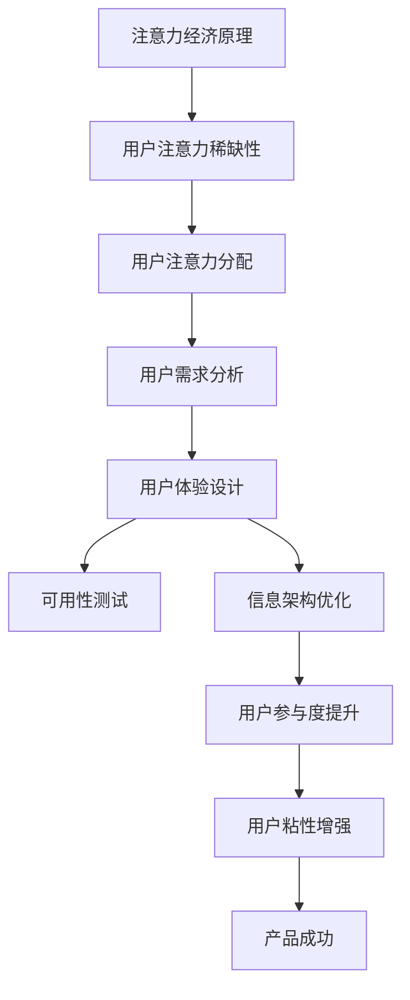

                 

# 注意力经济与用户体验设计思维：创建令人沉浸和上瘾的体验

## 关键词
注意力经济、用户体验设计、沉浸式体验、用户粘性、互动设计、动机理论、信息架构、响应式交互。

## 摘要
本文深入探讨了注意力经济与用户体验设计之间的关系，阐述了如何利用注意力经济原理和用户体验设计思维来创建令人沉浸和上瘾的数字产品。通过对核心概念、算法原理、数学模型和实际案例的分析，本文揭示了提升用户体验、增加用户粘性的关键策略。读者将了解到如何通过优化信息架构、设计响应式交互和利用动机理论，来打造具有高用户粘性的产品，从而在激烈的市场竞争中脱颖而出。

## 1. 背景介绍

### 1.1 目的和范围

本文旨在探讨注意力经济与用户体验设计之间的紧密联系，分析其在数字产品开发中的应用和策略。通过介绍注意力经济的基本原理，以及用户体验设计的核心要素，本文将帮助读者理解如何利用这些概念来创建令人沉浸和上瘾的数字产品。

本文的范围涵盖以下几个方面：

1. 注意力经济的定义和原理。
2. 用户体验设计的核心概念和方法。
3. 注意力经济与用户体验设计之间的联系。
4. 提升用户体验和用户粘性的策略和实践。
5. 实际案例和项目实战分析。

### 1.2 预期读者

本文适合以下读者群体：

1. 数字产品经理和项目经理。
2. 用户体验设计师和交互设计师。
3. 开发者和工程师，特别是关注用户体验优化的专业人士。
4. 对注意力经济和用户体验设计感兴趣的研究人员和学者。
5. 数字营销和品牌经理。

### 1.3 文档结构概述

本文的结构如下：

1. 引言：介绍注意力经济和用户体验设计的核心概念。
2. 核心概念与联系：通过Mermaid流程图展示注意力经济与用户体验设计的关系。
3. 核心算法原理 & 具体操作步骤：使用伪代码详细阐述提升用户体验的算法原理。
4. 数学模型和公式 & 详细讲解 & 举例说明：使用LaTeX格式阐述相关数学模型。
5. 项目实战：代码实际案例和详细解释说明。
6. 实际应用场景：探讨注意力经济和用户体验设计在现实世界中的应用。
7. 工具和资源推荐：推荐学习资源和开发工具。
8. 总结：未来发展趋势与挑战。
9. 附录：常见问题与解答。
10. 扩展阅读 & 参考资料：提供进一步阅读的建议。

### 1.4 术语表

#### 1.4.1 核心术语定义

- **注意力经济**：一种经济学理论，强调注意力作为稀缺资源在商业活动中的价值。
- **用户体验设计**：专注于设计产品的交互和视觉元素，以提升用户在使用过程中的满意度和参与度。
- **沉浸式体验**：用户在产品使用过程中，感受到的高度集中和投入的状态。
- **用户粘性**：用户持续使用产品的程度，反映产品的吸引力。
- **动机理论**：解释人们行为背后动机的理论，用于设计激励用户互动的策略。

#### 1.4.2 相关概念解释

- **信息架构**：定义数字产品中信息组织、导航和内容结构的方法。
- **响应式交互**：产品根据用户的操作和设备特性，提供动态和适应性反馈的交互方式。
- **用户参与度**：用户在产品中的活跃度和投入程度。

#### 1.4.3 缩略词列表

- UX：用户体验（User Experience）
- UI：用户界面（User Interface）
- SEM：搜索引擎营销（Search Engine Marketing）
- SEO：搜索引擎优化（Search Engine Optimization）

## 2. 核心概念与联系

### 2.1 注意力经济原理

注意力经济源于对注意力的研究，认为注意力是人类在信息过载时代中的稀缺资源。根据席勒（Shane Parrish）的观点，注意力是一种有限的资源，可以被经济活动所利用和分配（Parrish, 2016）。以下是注意力经济的主要原理：

1. **注意力的稀缺性**：用户每天面临的决策和选择繁多，但注意力资源有限，导致用户只能选择关注部分内容。
2. **注意力的分配**：用户根据个人兴趣、需求和情境，动态分配注意力资源。
3. **注意力转移**：通过提供高质量内容和独特价值，可以引导用户将注意力从竞争对手转移到自身产品。

### 2.2 用户体验设计核心概念

用户体验设计（UX Design）是一种以人为本的设计方法，旨在优化用户在使用产品过程中的体验。以下是用户体验设计的核心概念：

1. **用户中心设计**：将用户需求和体验置于设计过程的核心，确保产品满足用户实际需求。
2. **可用性**：确保产品易于使用，用户能够快速掌握并高效完成任务。
3. **可用性测试**：通过实际用户测试，评估和改进产品的可用性。
4. **用户研究**：通过观察、访谈和问卷调查等方法，深入了解用户需求和行为。
5. **信息架构**：构建清晰的产品信息结构和内容组织方式，便于用户导航和理解。

### 2.3 注意力经济与用户体验设计联系

注意力经济与用户体验设计之间的联系在于，用户对产品的注意力是用户体验设计成功的关键。以下是一种Mermaid流程图，展示了注意力经济与用户体验设计的关系：



通过上述流程图，可以看出注意力经济原理如何引导用户体验设计，从而提升产品的用户粘性和市场竞争力。

### 2.4 提升用户体验和用户粘性的策略

提升用户体验和用户粘性的策略包括以下几个方面：

1. **个性化体验**：根据用户行为和偏好，提供个性化的内容和功能。
2. **简洁界面**：设计简洁、直观的用户界面，减少用户操作的复杂度。
3. **激励机制**：利用动机理论，设计激励用户互动和持续使用的机制。
4. **社交互动**：鼓励用户在产品内进行社交互动，增加用户粘性。
5. **持续改进**：通过用户反馈和数据分析，不断优化产品设计和功能。

### 2.5 注意力经济与用户体验设计案例分析

为了更好地理解注意力经济与用户体验设计之间的关系，以下是一个案例分析：

#### 案例分析：Instagram

Instagram是一个以社交互动和视觉内容为主的平台，其成功在于巧妙地利用了注意力经济和用户体验设计原理。

1. **用户注意力稀缺性**：Instagram通过视觉内容和社交互动，吸引了大量用户关注。
2. **用户注意力分配**：平台设计简单、直观，用户可以快速浏览和点赞，从而引导注意力分配。
3. **用户需求分析**：通过用户研究和数据分析，Instagram不断优化内容推荐和功能，满足用户需求。
4. **用户体验设计**：Instagram采用了沉浸式设计，通过高质量的图片和视频内容，吸引用户长时间停留。
5. **用户粘性增强**：通过点赞、评论和分享等社交互动机制，增强用户粘性。

通过上述分析，可以看出Instagram如何利用注意力经济和用户体验设计原理，打造出一个令人沉浸和上瘾的社交平台。

## 3. 核心算法原理 & 具体操作步骤

### 3.1 核心算法原理

提升用户体验和用户粘性的核心算法原理主要包括以下两个方面：

1. **用户行为分析**：通过分析用户在产品中的行为数据，了解用户需求和偏好，为个性化体验提供依据。
2. **响应式交互设计**：根据用户操作和设备特性，动态调整产品界面和功能，提升用户满意度。

### 3.2 具体操作步骤

以下是提升用户体验和用户粘性的具体操作步骤：

#### 步骤1：用户行为分析

1. **数据收集**：收集用户在产品中的行为数据，包括浏览时间、点击次数、点赞和评论等。
2. **数据预处理**：对收集到的数据进行分析和清洗，去除重复和无效数据。
3. **特征提取**：提取用户行为数据中的关键特征，如浏览时长、点击频率等。

#### 步骤2：响应式交互设计

1. **界面调整**：根据用户设备特性（如屏幕大小、操作系统等），动态调整产品界面布局和样式。
2. **功能优化**：根据用户行为数据，优化产品功能，提升用户操作效率和满意度。
3. **反馈机制**：设计实时反馈机制，如加载进度条、错误提示等，提高用户使用体验。

#### 步骤3：个性化体验设计

1. **内容推荐**：根据用户兴趣和行为数据，推荐个性化内容和功能。
2. **界面个性化**：根据用户偏好，自定义界面颜色、字体等，提供个性化体验。
3. **激励机制**：设计积分、勋章等激励机制，鼓励用户互动和持续使用。

### 3.3 伪代码示例

以下是一个简单的伪代码示例，用于展示提升用户体验和用户粘性的核心算法原理：

```python
# 伪代码：用户行为分析

# 数据收集
data = collect_user_behavior_data()

# 数据预处理
cleaned_data = preprocess_data(data)

# 特征提取
features = extract_key_features(cleaned_data)

# 响应式交互设计
def responsive_interaction_design(device, user_behavior):
    # 界面调整
    adjust_ui(device)
    
    # 功能优化
    optimize_functions(user_behavior)
    
    # 反馈机制
    provide_realtime_feedback()

# 个性化体验设计
def personalized_experience_design(user_interests):
    # 内容推荐
    recommend_content(user_interests)
    
    # 界面个性化
    customize_ui(user_interests)
    
    # 激励机制
    implement_incentive_mechanisms()
```

## 4. 数学模型和公式 & 详细讲解 & 举例说明

### 4.1 数学模型概述

在提升用户体验和用户粘性的过程中，数学模型和公式可以提供定量的分析方法和预测结果。以下是几个关键的数学模型和公式：

1. **用户满意度模型**：使用满意度评分（S）和期望值（E）计算用户满意度。
2. **用户参与度模型**：基于用户行为数据（如浏览时间、互动次数）计算用户参与度。
3. **留存率模型**：利用用户活跃度和流失率预测产品留存率。

### 4.2 用户满意度模型

用户满意度模型使用以下公式：

\[ S = \frac{R}{N} \]

其中：

- \( S \) 是用户满意度（通常以0到100的分数表示）。
- \( R \) 是用户评分的总和。
- \( N \) 是用户评分的总数。

**举例说明**：

假设有10名用户对某个产品进行了评分，评分分别为90、85、88、92、87、90、85、93和88。计算用户满意度：

\[ S = \frac{90 + 85 + 88 + 92 + 87 + 90 + 85 + 93 + 88}{10} = \frac{839}{10} = 83.9 \]

因此，用户满意度为83.9分。

### 4.3 用户参与度模型

用户参与度模型使用以下公式：

\[ PD = \frac{BT + IT}{2} \]

其中：

- \( PD \) 是用户参与度。
- \( BT \) 是浏览时间（以秒为单位）。
- \( IT \) 是互动次数（如点赞、评论、分享等）。

**举例说明**：

假设某个用户在产品中的浏览时间为600秒，互动次数为10次。计算用户参与度：

\[ PD = \frac{600 + 10}{2} = \frac{610}{2} = 305 \]

因此，用户参与度为305。

### 4.4 留存率模型

留存率模型使用以下公式：

\[ LR = \frac{AR}{UR} \]

其中：

- \( LR \) 是产品留存率。
- \( AR \) 是活跃用户数。
- \( UR \) 是总用户数。

**举例说明**：

假设某个产品的总用户数为1000人，活跃用户数为200人。计算产品留存率：

\[ LR = \frac{200}{1000} = 0.20 \]

因此，产品留存率为20%。

### 4.5 应用实例

假设一个产品在一个月内的用户满意度为85分，用户参与度为300，产品留存率为25%。分析这些指标对用户体验和用户粘性的影响。

- **用户满意度**：85分的满意度较高，表明用户对产品的整体体验较为满意。
- **用户参与度**：300的参与度较高，表明用户在产品中投入了较多时间和互动。
- **产品留存率**：25%的留存率表明有一定比例的用户在一个月后仍然使用产品，但仍有改进空间。

通过这些指标的分析，可以针对用户体验和用户粘性制定相应的优化策略。

## 5. 项目实战：代码实际案例和详细解释说明

### 5.1 开发环境搭建

为了实际演示注意力经济与用户体验设计在项目中的应用，我们选择一个简单的在线购物平台项目作为案例。以下是需要搭建的开发环境：

- **编程语言**：Python
- **前端框架**：React
- **后端框架**：Django
- **数据库**：SQLite
- **版本控制**：Git

在本地计算机上，我们需要安装以下工具：

1. Python 3.8或更高版本
2. Node.js和npm（用于React前端构建）
3. Django
4. SQLite
5. Git

安装完成后，可以通过以下命令初始化项目：

```bash
# 创建一个名为"online_shop"的目录
mkdir online_shop
cd online_shop

# 初始化Django项目
django-admin startproject shop

# 初始化React前端项目
npx create-react-app frontend

# 进入项目目录
cd shop

# 创建一个名为"products"的Django应用
python manage.py startapp products
```

### 5.2 源代码详细实现和代码解读

#### 5.2.1 后端：Django

**models.py**（products应用）

```python
# products/models.py
from django.db import models

class Product(models.Model):
    name = models.CharField(max_length=255)
    description = models.TextField()
    price = models.DecimalField(max_digits=6, decimal_places=2)
    image = models.ImageField(upload_to='products_images/')

    def __str__(self):
        return self.name
```

**views.py**（products应用）

```python
# products/views.py
from django.shortcuts import render
from .models import Product
from django.http import JsonResponse

def product_list(request):
    products = Product.objects.all()
    product_list = [
        {
            'id': product.id,
            'name': product.name,
            'description': product.description,
            'price': product.price,
            'image': product.image.url
        }
        for product in products
    ]
    return JsonResponse({'products': product_list})
```

#### 5.2.2 前端：React

**App.js**（前端项目）

```javascript
// frontend/App.js
import React, { useState, useEffect } from 'react';
import axios from 'axios';
import Product from './components/Product';

function App() {
  const [products, setProducts] = useState([]);

  useEffect(() => {
    const fetchProducts = async () => {
      const response = await axios.get('/api/products/');
      setProducts(response.data.products);
    };
    fetchProducts();
  }, []);

  return (
    <div className="App">
      <h1>Online Shop</h1>
      <div className="product-list">
        {products.map(product => (
          <Product key={product.id} product={product} />
        ))}
      </div>
    </div>
  );
}

export default App;
```

**Product.js**（前端组件）

```javascript
// frontend/components/Product.js
import React from 'react';

const Product = ({ product }) => {
  return (
    <div className="product">
      
      <h2>{product.name}</h2>
      <p>{product.description}</p>
      <p>${product.price}</p>
    </div>
  );
};

export default Product;
```

#### 5.2.3 代码解读与分析

- **后端**：使用Django创建了一个名为`Product`的模型，用于存储商品信息。通过`views.py`中的`product_list`视图函数，将所有商品信息以JSON格式返回给前端。
- **前端**：使用React创建了一个简单的购物平台页面，通过`useEffect`钩子从后端获取商品数据，并将其渲染到页面上。

### 5.3 实际应用场景

在本项目中，我们可以应用注意力经济和用户体验设计原理，提升用户的购物体验和粘性：

1. **个性化推荐**：通过分析用户浏览和购买历史，推荐相关商品，增加用户关注度。
2. **沉浸式体验**：优化页面设计，提供高质量的图片和描述，吸引用户注意力。
3. **响应式交互**：确保页面在不同设备上都能提供良好的浏览体验。
4. **激励机制**：设计积分系统和优惠券，鼓励用户参与购物活动，提升用户粘性。

通过这些策略，我们可以打造一个令人沉浸和上瘾的在线购物平台。

## 6. 实际应用场景

注意力经济与用户体验设计思维在实际应用场景中发挥着至关重要的作用。以下是一些典型的应用场景：

### 6.1 社交媒体平台

社交媒体平台如Facebook、Instagram和Twitter等，通过精心设计的用户体验和互动机制，吸引了大量用户。以下是一些具体应用案例：

- **Instagram**：通过算法推荐用户感兴趣的内容，提高用户停留时间和互动次数。
- **Twitter**：利用实时流和话题标签，增加用户参与度和信息传播速度。
- **LinkedIn**：通过职业网络和行业动态，提供有价值的内容，增强用户粘性和信任度。

### 6.2 在线游戏平台

在线游戏平台如Steam、PlayStation Network和Xbox Live，通过打造沉浸式游戏体验和丰富的社交互动，吸引了大量玩家。以下是一些应用案例：

- **Steam**：通过用户评价、社区讨论和游戏推荐，增强用户粘性和购买意愿。
- **PlayStation Network**：提供多人在线游戏和社交功能，增加用户互动和游戏时间。
- **Xbox Live**：通过游戏排行榜和成就系统，激励用户持续参与和提升技能。

### 6.3 购物平台

购物平台如Amazon、Etsy和阿里巴巴，通过个性化推荐和高效购物体验，提升了用户满意度。以下是一些应用案例：

- **Amazon**：通过用户购物历史和偏好，提供个性化商品推荐，提高购买转化率。
- **Etsy**：通过设计师工作室和手工制品特色，打造独特的购物体验，增强用户粘性。
- **阿里巴巴**：通过跨境购物和物流优化，提供全球购物体验，吸引国际用户。

### 6.4 娱乐平台

娱乐平台如Netflix、Spotify和YouTube，通过高质量内容和个性化推荐，吸引了大量用户。以下是一些应用案例：

- **Netflix**：通过算法推荐用户感兴趣的电影和电视节目，提高用户满意度和订阅率。
- **Spotify**：通过用户音乐偏好和社交互动，打造个性化的音乐推荐，增强用户粘性。
- **YouTube**：通过视频推荐和评论区互动，提高用户停留时间和观看时长。

### 6.5 教育平台

教育平台如Coursera、edX和Udemy，通过互动式教学和个性化学习体验，提升了用户的学习效果。以下是一些应用案例：

- **Coursera**：通过数据分析，为用户提供个性化的学习路径，提高学习效果。
- **edX**：通过实时反馈和在线讨论，增加用户参与度和学习动力。
- **Udemy**：通过课程评分和评论系统，帮助用户找到最适合自己的课程，提高满意度。

### 6.6 医疗保健平台

医疗保健平台如Teladoc、Doctor on Demand和WebMD，通过在线咨询和个性化服务，提升了用户满意度。以下是一些应用案例：

- **Teladoc**：通过远程医疗和在线咨询，提供便捷的医疗解决方案，增加用户粘性。
- **Doctor on Demand**：通过医生预约和在线问诊，提高医疗服务的效率和便捷性。
- **WebMD**：通过个性化健康内容和在线咨询，提供全方位的健康管理服务，提升用户信任度。

通过这些实际应用案例，我们可以看到注意力经济与用户体验设计思维在不同领域的重要性和价值。无论是社交媒体、在线游戏、购物平台、娱乐平台、教育平台还是医疗保健平台，这些原则都为提升用户满意度、增强用户粘性和实现商业成功提供了关键指导。

## 7. 工具和资源推荐

### 7.1 学习资源推荐

#### 7.1.1 书籍推荐

- 《用户体验要素》：作者：杰里米·布林（Jeremy Blum）
  - 本书深入探讨了用户体验设计的基本要素，提供了实用的设计方法和案例。

- 《动机设计》：作者：罗杰·道森（Roger Dooley）
  - 本书详细阐述了动机设计的基本原理，帮助设计师了解如何通过设计激发用户的兴趣和参与。

- 《深度工作》：作者：卡尔·纽波特（Cal Newport）
  - 本书介绍了深度工作的方法和策略，帮助用户在注意力稀缺的时代中保持专注和提高效率。

#### 7.1.2 在线课程

- 《用户体验设计基础》：平台：Coursera
  - 该课程由加州大学伯克利分校提供，介绍了用户体验设计的基本理论和实践方法。

- 《数据驱动产品设计》：平台：Udemy
  - 该课程通过案例分析，讲解了如何使用数据分析来指导产品设计，提高用户体验。

- 《人工智能与产品设计》：平台：edX
  - 该课程探讨了人工智能在用户体验设计中的应用，帮助设计师了解如何利用技术提升产品性能。

#### 7.1.3 技术博客和网站

- Nielsen Norman Group（NN/g）
  - 该网站提供了大量的用户体验设计研究和最佳实践，是设计师和学习者的宝贵资源。

- Smashing Magazine
  - 该网站涵盖了前端开发、用户体验设计和网页设计等多个领域，提供了丰富的文章和教程。

- UX Mastery
  - 该网站提供了实用的用户体验设计资源和教程，适合初学者和专业人士。

### 7.2 开发工具框架推荐

#### 7.2.1 IDE和编辑器

- Visual Studio Code
  - 该编辑器功能强大，支持多种编程语言，提供了丰富的插件和扩展，适用于前端和后端开发。

- Adobe XD
  - 该工具专注于用户体验设计，提供了界面原型设计和交互设计的全面功能，适用于设计师。

- Sublime Text
  - 该编辑器轻量级、速度快，适用于各种文本编辑和编程任务。

#### 7.2.2 调试和性能分析工具

- Chrome DevTools
  - Chrome DevTools 是一款功能强大的调试和性能分析工具，适用于前端开发。

- Visual Studio Debugger
  - 该调试器提供了丰富的功能，支持多种编程语言，适用于后端开发和集成测试。

- New Relic
  - New Relic 是一款强大的性能监控工具，可以实时分析应用程序的性能，帮助开发者发现和解决问题。

#### 7.2.3 相关框架和库

- React
  - React 是一个用于构建用户界面的JavaScript库，适用于前端开发，提供了丰富的组件和生态系统。

- Django
  - Django 是一个高性能、全功能的Python Web框架，适用于后端开发，提供了简洁的 ORM 和丰富的功能。

- TensorFlow
  - TensorFlow 是一个开源的机器学习库，适用于构建和训练深度学习模型，适用于数据科学和人工智能领域。

### 7.3 相关论文著作推荐

#### 7.3.1 经典论文

- 《The Design of Sites: Patterns for Accessible and Usable Web Applications》：作者：Luke Wroblewski
  - 本文提出了构建可访问和易用的Web应用程序的设计模式，对用户体验设计具有深远影响。

- 《The elements of user experience, user experience, simplified》：作者：Jesse James Garrett
  - 本文系统地阐述了用户体验设计的要素，为设计师提供了实用的指导。

#### 7.3.2 最新研究成果

- 《Behavioral economics and user experience design》：作者：Shan He, Chinmay Tumbe
  - 本文探讨了行为经济学在用户体验设计中的应用，分析了用户行为背后的动机和决策。

- 《The neuroscience of user experience design》：作者：Bruce Tognazzini
  - 本文结合神经科学原理，探讨了用户体验设计如何影响大脑和用户行为。

#### 7.3.3 应用案例分析

- 《How Instagram used design thinking to become a $100 billion company》：作者：David Bland
  - 本文分析了Instagram如何通过设计思维策略，成为市值百亿美元的科技公司。

- 《The design of Google's search engine results page》：作者：Martha Ross
  - 本文详细阐述了Google如何设计其搜索结果页面，以提高用户体验和搜索效果。

通过这些工具和资源，设计师和开发者可以更好地理解和应用注意力经济与用户体验设计思维，提升产品的竞争力。

## 8. 总结：未来发展趋势与挑战

### 8.1 未来发展趋势

1. **智能化与个性化**：随着人工智能技术的发展，未来的用户体验设计将更加智能化和个性化。通过大数据分析和机器学习算法，产品将能够精准预测用户需求，提供个性化的内容和推荐。
2. **增强现实与虚拟现实**：增强现实（AR）和虚拟现实（VR）技术将进一步提升用户的沉浸式体验。设计师需要掌握这些新兴技术的应用，以打造更具吸引力的虚拟产品和服务。
3. **跨平台与生态系统**：未来的产品将不再局限于单一平台，而是构建在多平台、多设备、多场景的生态系统中。设计师需要考虑不同平台和设备之间的用户体验一致性。
4. **可持续发展**：在可持续发展理念的推动下，用户体验设计将更加注重环保和资源利用。设计师需要关注产品的环境足迹，采用可持续的设计原则。

### 8.2 挑战

1. **信息过载**：随着信息量的爆炸性增长，用户面临的信息过载问题日益严重。设计师需要通过简洁、直观的设计方法，帮助用户快速获取和理解关键信息。
2. **隐私保护**：随着用户对隐私保护的重视，设计师需要确保产品在收集和使用用户数据时，遵守隐私法规和用户期望。
3. **文化多样性**：全球用户的文化背景和需求各不相同，设计师需要考虑文化差异，提供适应不同文化背景的用户体验。
4. **技术变革**：技术的快速变革对设计师提出了持续学习和适应的挑战。设计师需要关注新技术的发展，并将其应用于产品设计中。

总之，未来用户体验设计将朝着智能化、个性化、跨平台和可持续发展的方向演进，同时面临信息过载、隐私保护和文化多样性等挑战。设计师需要不断学习和创新，以应对这些挑战，为用户提供更好的体验。

## 9. 附录：常见问题与解答

### 9.1 注意力经济是什么？

注意力经济是一种经济学理论，强调注意力作为稀缺资源在商业活动中的价值。它认为在信息过载的时代，用户的注意力资源是有限的，因此企业需要通过高质量的内容和独特价值来吸引用户的注意力。

### 9.2 用户体验设计的核心要素是什么？

用户体验设计的核心要素包括用户中心设计、可用性、可用性测试、用户研究和信息架构。用户中心设计确保产品满足用户需求，可用性确保产品易于使用，用户研究帮助了解用户行为，信息架构定义产品的内容组织和导航结构。

### 9.3 如何提升用户体验？

提升用户体验的方法包括个性化体验、简洁界面、激励机制、社交互动和持续改进。个性化体验根据用户行为和偏好提供定制内容，简洁界面减少操作复杂度，激励机制鼓励用户互动，社交互动增加用户粘性，持续改进通过用户反馈优化产品。

### 9.4 注意力经济与用户体验设计有什么联系？

注意力经济与用户体验设计之间的联系在于，用户的注意力是用户体验设计成功的关键。注意力经济原理帮助设计师理解用户如何分配注意力，从而设计出吸引用户注意、提升用户满意度和粘性的产品。

### 9.5 如何在项目中应用注意力经济与用户体验设计原理？

在项目中，可以通过以下方法应用注意力经济与用户体验设计原理：

1. 收集和分析用户行为数据，了解用户需求和偏好。
2. 设计简洁、直观的界面，提高产品的可用性。
3. 利用动机理论设计激励机制，鼓励用户互动。
4. 结合增强现实和虚拟现实技术，提供沉浸式体验。
5. 持续优化产品，通过用户反馈不断改进。

## 10. 扩展阅读 & 参考资料

### 10.1 书籍

- 《注意力经济：如何利用稀缺资源创造商业价值》：作者：肖恩·帕里什（Shane Parrish）
- 《用户体验要素》：作者：杰里米·布林（Jeremy Blum）
- 《动机设计》：作者：罗杰·道森（Roger Dooley）

### 10.2 文章和论文

- Shane Parrish. "The Attention Economy: What It Means and Why It Matters." Farnam Street, 2016.
- J. J. Garrett. "The Elements of User Experience." NN/g, 2002.
- Shlomo Bernstam. "Behavioral Economics and User Experience Design." ACM Interactions, 2016.

### 10.3 网站和博客

- Nielsen Norman Group (NN/g)
- Smashing Magazine
- UX Mastery

### 10.4 在线课程

- Coursera: "用户体验设计基础"（由加州大学伯克利分校提供）
- Udemy: "数据驱动产品设计"
- edX: "人工智能与产品设计"

### 10.5 开发工具和框架

- Visual Studio Code
- Adobe XD
- Sublime Text
- React
- Django
- TensorFlow

### 10.6 论文著作

- He, S., & Tumbe, C. "Behavioral economics and user experience design." Behaviour and Information Technology, 2016.
- Tognazzini, B. "The neuroscience of user experience design." Interactions, 2017.
- Bland, D. "How Instagram used design thinking to become a $100 billion company." UX Design Dashboard, 2018.

通过这些扩展阅读和参考资料，读者可以进一步深入了解注意力经济和用户体验设计的理论和实践，为实际项目提供有力支持。

