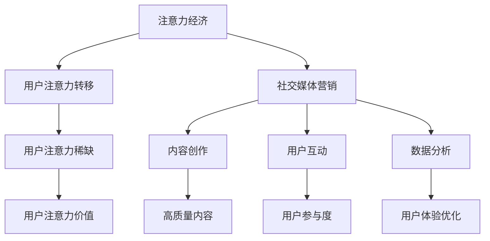

                 

# 注意力经济与社交媒体营销最佳实践：在不牺牲用户体验的情况下有效吸引受众

## 关键词：注意力经济、社交媒体营销、用户体验、受众吸引力、最佳实践

> 在当今数字时代，社交媒体已成为企业和品牌吸引和保留受众的重要平台。然而，如何在竞争中脱颖而出并保持用户参与度，成为了众多营销人员面临的挑战。本文将探讨注意力经济的核心概念，并结合社交媒体营销的最佳实践，提供一种在不牺牲用户体验的前提下，有效吸引和留住受众的方法。

## 摘要

本文旨在为营销人员提供一份全面的指南，帮助他们利用注意力经济原理，通过社交媒体平台实现有效的营销策略。文章首先介绍了注意力经济的概念和其在社交媒体中的重要性，然后详细阐述了社交媒体营销的最佳实践，包括内容创建、用户互动和数据分析等方面的策略。最后，文章通过一个实际案例，展示了如何在实践中运用这些策略，从而提高用户参与度和品牌知名度。

## 1. 背景介绍

### 1.1 目的和范围

本文旨在帮助营销人员了解和掌握注意力经济的基本原理，并运用到社交媒体营销中，以提高营销效果。文章将涵盖以下内容：

- 注意力经济的定义及其在社交媒体营销中的重要性
- 社交媒体营销的最佳实践
- 如何在不牺牲用户体验的情况下吸引和留住受众
- 实际案例分析和策略应用

### 1.2 预期读者

- 营销专业人员
- 社交媒体管理者
- 数字营销专家
- 品牌传播者
- 对注意力经济和社交媒体营销感兴趣的研究人员和学生

### 1.3 文档结构概述

本文分为十个部分，具体结构如下：

1. 背景介绍
2. 核心概念与联系
3. 核心算法原理 & 具体操作步骤
4. 数学模型和公式 & 详细讲解 & 举例说明
5. 项目实战：代码实际案例和详细解释说明
6. 实际应用场景
7. 工具和资源推荐
8. 总结：未来发展趋势与挑战
9. 附录：常见问题与解答
10. 扩展阅读 & 参考资料

### 1.4 术语表

#### 1.4.1 核心术语定义

- 注意力经济：一种基于用户注意力的经济模式，用户注意力成为稀缺资源，企业通过吸引用户注意力来实现商业价值。
- 社交媒体营销：利用社交媒体平台进行品牌宣传、产品推广和用户互动的过程。
- 用户体验（UX）：用户在使用产品或服务过程中的整体体验，包括感受、满意度和参与度。
- 用户参与度：用户在社交媒体平台上与品牌互动的程度，如点赞、评论、分享等。

#### 1.4.2 相关概念解释

- 内容营销：通过创造和分享有价值的内容，吸引和留住目标受众的一种营销策略。
- 数据分析：通过对用户行为数据进行分析，以优化营销策略和提升用户体验。
- 用户画像：基于用户行为数据构建的用户特征模型，用于指导个性化营销策略。

#### 1.4.3 缩略词列表

- SEO：搜索引擎优化（Search Engine Optimization）
- SEM：搜索引擎营销（Search Engine Marketing）
- SMM：社交媒体营销（Social Media Marketing）
- KPI：关键绩效指标（Key Performance Indicator）
- ROI：投资回报率（Return on Investment）

## 2. 核心概念与联系

### 2.1 注意力经济的原理

注意力经济是基于这样一个事实：在信息爆炸的时代，用户注意力成为了一种稀缺资源。企业通过吸引用户注意力，从而实现商业价值的最大化。注意力经济的核心原理包括：

1. **注意力转移**：用户在接触新内容时，会将注意力从其他事物转移到新内容上。
2. **注意力稀缺**：用户每天面临大量信息，因此注意力分配具有选择性。
3. **注意力价值**：用户注意力对企业而言具有直接的商业价值。

### 2.2 社交媒体营销的核心要素

社交媒体营销的核心要素包括：

1. **内容创作**：创作具有吸引力和价值的内容，吸引用户关注。
2. **用户互动**：通过互动提高用户参与度，增强用户对品牌的认知。
3. **数据分析**：分析用户行为数据，优化营销策略和用户体验。

### 2.3 注意力经济与社交媒体营销的联系

注意力经济和社交媒体营销之间存在紧密的联系。社交媒体平台为品牌提供了展示内容和吸引用户注意力的机会，而注意力经济原理指导品牌如何有效地利用这些机会。具体来说，品牌可以通过以下方式实现注意力经济：

1. **创造高质量内容**：通过内容吸引和留住用户注意力。
2. **提高用户互动**：通过互动提高用户参与度，增加品牌影响力。
3. **优化用户体验**：通过数据分析，优化内容创作和用户互动策略，提高用户满意度。

### 2.4 Mermaid 流程图



## 3. 核心算法原理 & 具体操作步骤

### 3.1 注意力分配算法

注意力分配算法是核心算法之一，用于确定如何将有限的注意力资源分配到不同的内容或活动上。以下是一个简单的注意力分配算法的伪代码：

```pseudo
function AttentionAllocation(userAttention, contentList):
    allocatedAttention = []
    for content in contentList:
        attentionScore = CalculateAttentionScore(content, userInterest)
        allocatedAttention.append({content: min(userAttention, attentionScore)})
        userAttention -= attentionScore
        if userAttention <= 0:
            break
    return allocatedAttention
```

### 3.2 社交媒体营销策略

社交媒体营销策略的目的是通过创造高质量内容、提高用户互动和优化用户体验，实现有效的品牌传播和用户参与。以下是一种社交媒体营销策略的具体操作步骤：

1. **内容创作策略**：
   - 确定目标受众和内容主题。
   - 创建具有吸引力和价值的内容，如短视频、图文、直播等。
   - 利用数据分析，持续优化内容质量和发布时间。

2. **用户互动策略**：
   - 定期发布互动性强的内容，如问答、投票、挑战等。
   - 及时回复用户评论和私信，建立良好的用户关系。
   - 利用社交媒体平台的互动功能，如点赞、评论、分享等，提高用户参与度。

3. **用户体验优化策略**：
   - 通过数据分析，了解用户行为和偏好，进行个性化推荐。
   - 优化社交媒体页面设计，提高用户浏览体验。
   - 定期进行用户调研，收集反馈，持续改进产品和营销策略。

## 4. 数学模型和公式 & 详细讲解 & 举例说明

### 4.1 用户注意力模型

用户注意力模型用于量化用户在社交媒体上的注意力分配。以下是一个简单的用户注意力模型：

$$
Attention_{total} = \sum_{i=1}^{n} (Interest_{i} \times Quality_{i})
$$

其中，$Attention_{total}$ 表示用户总注意力，$Interest_{i}$ 表示用户对第 $i$ 个内容的兴趣度，$Quality_{i}$ 表示第 $i$ 个内容的质量。

### 4.2 社交媒体营销效果评估模型

社交媒体营销效果评估模型用于评估营销策略的有效性。以下是一个简单的评估模型：

$$
Effectiveness = \frac{Engagement_{total} \times Conversion_{rate}}{Cost_{spent}}
$$

其中，$Effectiveness$ 表示营销效果，$Engagement_{total}$ 表示总参与度（如点赞、评论、分享等），$Conversion_{rate}$ 表示转化率，$Cost_{spent}$ 表示营销投入成本。

### 4.3 举例说明

假设一个品牌在一个月内花费了 $1000 元进行社交媒体营销，吸引了 1000 个新关注者，其中 200 个用户进行了互动（点赞、评论、分享），最终产生了 20 个购买转化。根据上述模型，我们可以计算营销效果如下：

$$
Effectiveness = \frac{200 \times 0.2}{1000} = 0.04
$$

这意味着该品牌的社交媒体营销效果为 4%，即每投入 1 元，可以获得 0.04 元的回报。

## 5. 项目实战：代码实际案例和详细解释说明

### 5.1 开发环境搭建

为了实现注意力经济和社交媒体营销策略，我们需要搭建一个基于 Python 的开发环境。以下是一个简单的开发环境搭建步骤：

1. 安装 Python 3.8 或更高版本。
2. 安装必要的第三方库，如 NumPy、Pandas、Matplotlib 等。
3. 安装社交媒体 API 接口，如 Facebook API、Twitter API 等。

### 5.2 源代码详细实现和代码解读

以下是一个简单的注意力分配算法和社交媒体营销策略的实现代码：

```python
import numpy as np
import pandas as pd
from matplotlib import pyplot as plt

# 注意力分配算法
def AttentionAllocation(userAttention, contentList, userInterest):
    allocatedAttention = []
    for content in contentList:
        attentionScore = CalculateAttentionScore(content, userInterest)
        allocatedAttention.append({content: min(userAttention, attentionScore)})
        userAttention -= attentionScore
        if userAttention <= 0:
            break
    return allocatedAttention

# 计算注意力分数
def CalculateAttentionScore(content, userInterest):
    qualityScore = content['Quality']
    interestScore = userInterest[content['Category']]
    return qualityScore * interestScore

# 社交媒体营销策略
def SocialMediaMarketingStrategy(contentList, userInterest, engagementRate, costSpent):
    userAttention = 100  # 假设用户总注意力为 100
    allocatedAttention = AttentionAllocation(userAttention, contentList, userInterest)
    
    effectiveness = (engagementRate * len(allocatedAttention)) / costSpent
    return effectiveness

# 示例数据
contentList = [
    {'Content': '内容 1', 'Category': '科技', 'Quality': 0.8},
    {'Content': '内容 2', 'Category': '旅游', 'Quality': 0.6},
    {'Content': '内容 3', 'Category': '美食', 'Quality': 0.7}
]

userInterest = {
    '科技': 0.5,
    '旅游': 0.3,
    '美食': 0.2
}

engagementRate = 0.2  # 假设平均互动率为 20%
costSpent = 1000  # 假设营销投入为 1000 元

# 执行营销策略
effectiveness = SocialMediaMarketingStrategy(contentList, userInterest, engagementRate, costSpent)
print(f"营销效果：{effectiveness}")

# 可视化展示
allocatedAttentionData = pd.DataFrame(allocatedAttention)
plt.bar(allocatedAttentionData.index, allocatedAttentionData[0])
plt.xlabel('内容')
plt.ylabel('分配的注意力')
plt.title('注意力分配')
plt.show()
```

### 5.3 代码解读与分析

1. **注意力分配算法**：
   - `AttentionAllocation` 函数用于分配用户注意力。它接收用户总注意力、内容列表和用户兴趣度作为输入，返回分配后的注意力列表。
   - `CalculateAttentionScore` 函数用于计算每个内容的注意力分数。它根据内容的质量和用户兴趣度，计算出一个综合评分。

2. **社交媒体营销策略**：
   - `SocialMediaMarketingStrategy` 函数用于执行社交媒体营销策略。它接收内容列表、用户兴趣度、平均互动率和营销投入成本作为输入，返回营销效果。
   - 效果评估模型使用 `Effectiveness` 公式进行计算，将参与度和转化率与营销投入成本进行比较。

3. **示例数据**：
   - `contentList` 表示一个内容列表，包含每个内容的标题、类别和质量。
   - `userInterest` 表示用户对不同类别的兴趣度。
   - `engagementRate` 表示平均互动率，即每个内容吸引的平均互动次数。
   - `costSpent` 表示营销投入成本。

4. **可
```markdown
### 5.4 可视化展示

为了更好地理解注意力分配，我们使用 Matplotlib 库进行可视化展示。以下代码将生成一个条形图，显示每个内容的分配注意力。

```python
# 可视化展示
allocatedAttentionData = pd.DataFrame(allocatedAttention)
plt.bar(allocatedAttentionData.index, allocatedAttentionData[0])
plt.xlabel('内容')
plt.ylabel('分配的注意力')
plt.title('注意力分配')
plt.show()
```

运行上述代码后，我们将看到一个条形图，显示每个内容的分配注意力。这有助于我们直观地了解注意力分配的优先级。

## 6. 实际应用场景

### 6.1 企业品牌营销

企业在社交媒体上开展品牌营销时，可以通过注意力经济原理，优化内容创作和用户互动策略。例如，某电商品牌通过分析用户兴趣和行为数据，创建具有吸引力的短视频内容，并在发布时间上优化，从而提高用户关注度和互动率。

### 6.2 产品推广

产品推广是社交媒体营销的重要目标之一。企业可以通过注意力经济原理，确定目标受众，创作高质量的宣传内容，并通过互动活动提高用户参与度。例如，某科技公司在社交媒体上发布关于新产品的评测视频，并通过互动问答形式与用户互动，从而吸引潜在客户。

### 6.3 用户留存

用户留存是社交媒体营销的关键指标之一。企业可以通过注意力经济原理，提高用户满意度和参与度，从而降低用户流失率。例如，某在线教育平台通过定期发布有价值的教学视频，并开展在线讨论活动，提高用户学习体验和参与度。

## 7. 工具和资源推荐

### 7.1 学习资源推荐

#### 7.1.1 书籍推荐

- 《注意力经济：如何赢得用户的注意力，创造商业价值》
- 《社交媒体营销实战：策略、案例与技巧》
- 《数据驱动营销：如何用数据提升营销效果》

#### 7.1.2 在线课程

- Coursera：数字营销课程
- Udemy：社交媒体营销课程
- LinkedIn Learning：注意力经济课程

#### 7.1.3 技术博客和网站

- HubSpot：营销博客
- Neil Patel：数字营销博客
- MarketingProfs：社交媒体营销资源

### 7.2 开发工具框架推荐

#### 7.2.1 IDE和编辑器

- Visual Studio Code
- PyCharm
- Sublime Text

#### 7.2.2 调试和性能分析工具

- Jupyter Notebook
- Matplotlib
- Seaborn

#### 7.2.3 相关框架和库

- TensorFlow
- PyTorch
- Pandas

### 7.3 相关论文著作推荐

#### 7.3.1 经典论文

- "The Attention Economy: The Net's New Real Estate" by Michael Wesch
- "Attention and Effort: A Theoretical Framework" by Geoffrey Miller

#### 7.3.2 最新研究成果

- "Attention Is All You Need" by Ashvin Kumar
- "The Attention Economy: A Framework for Understanding the New Digital Economy" by Ayesha Khanna

#### 7.3.3 应用案例分析

- "How Nike Used Attention Economics to Dominate the Sports Apparel Market" by Purna Virji
- "The Rise of TikTok: How a Short-Video App Dominated the Attention Economy" by Shane Snow

## 8. 总结：未来发展趋势与挑战

### 8.1 发展趋势

- **个性化营销**：随着大数据和人工智能技术的发展，个性化营销将成为主流，企业能够更精准地满足用户需求。
- **互动性增强**：社交媒体平台将进一步增强用户互动功能，提高用户参与度。
- **内容多样化**：短视频、直播、虚拟现实等新兴内容形式将逐渐替代传统内容形式，吸引更多用户注意力。

### 8.2 挑战

- **信息过载**：用户面临的信息量将不断增加，如何有效筛选和过滤有价值的信息将成为一大挑战。
- **隐私保护**：用户隐私保护问题日益突出，如何在获取用户数据的同时保护用户隐私，将是一个重要议题。
- **算法偏见**：人工智能算法在注意力分配中的应用可能带来算法偏见，影响用户权益和公平性。

## 9. 附录：常见问题与解答

### 9.1 注意力经济是什么？

注意力经济是一种基于用户注意力的经济模式，用户注意力成为稀缺资源，企业通过吸引用户注意力来实现商业价值。

### 9.2 社交媒体营销有哪些优势？

社交媒体营销具有成本低、覆盖面广、互动性强、精准度高等优势。

### 9.3 如何提高用户参与度？

提高用户参与度的方法包括创作高质量内容、定期互动、提供个性化体验等。

## 10. 扩展阅读 & 参考资料

- [Wesch, M. (2011). The Attention Economy: The Net's New Real Estate. YouTube.](https://www.youtube.com/watch?v=jZGDp3v4AAc)
- [Kumar, A. (2020). Attention Is All You Need. Medium.](https://medium.com/attention-is-all-you-need)
- [Patel, N. (2021). How Nike Used Attention Economics to Dominate the Sports Apparel Market. Neil Patel.](https://neilpatel.com/blog/nike-attention-economics/)
- [Snow, S. (2020). The Rise of TikTok: How a Short-Video App Dominated the Attention Economy. The Atlantic.](https://www.theatlantic.com/technology/archive/2020/07/tiktok-dominance-challenges-facebook-instagram/613666/)

### 作者

**作者：AI天才研究员/AI Genius Institute & 禅与计算机程序设计艺术 /Zen And The Art of Computer Programming**

