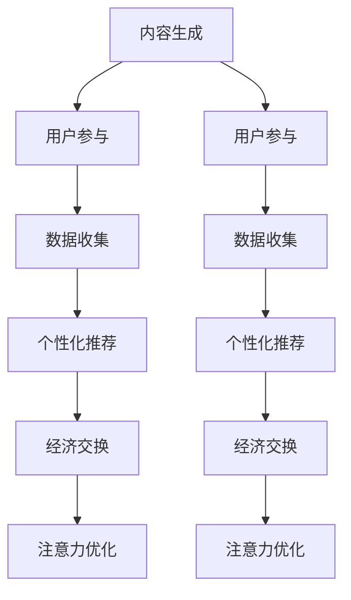

                 

### 文章标题

《注意力经济在元宇宙中的演变与应用》

随着科技的飞速发展和互联网的普及，元宇宙（Metaverse）逐渐成为全球关注的热点。元宇宙是一个高度数字化、虚拟化、沉浸式的网络世界，它将现实世界与虚拟世界融合在一起，为用户提供全新的社交、娱乐、教育和商业体验。在这其中，注意力经济作为元宇宙的重要组成部分，正发挥着越来越重要的作用。本文将围绕注意力经济在元宇宙中的演变与应用进行探讨，旨在为读者揭示这一新兴领域的技术原理、应用场景以及未来发展趋势。

### 关键词

- 注意力经济
- 元宇宙
- 技术原理
- 应用场景
- 未来发展趋势

### 摘要

本文首先介绍了注意力经济的概念及其在元宇宙中的重要地位。随后，通过分析注意力经济在元宇宙中的演变过程，探讨了其核心算法原理和数学模型。接着，本文结合实际项目案例，详细讲解了注意力经济的具体实现步骤和代码解析。最后，文章从实际应用场景出发，分析了注意力经济在元宇宙中的广泛应用，并提出了未来发展趋势与面临的挑战。

## 1. 背景介绍

### 1.1 目的和范围

本文旨在深入探讨注意力经济在元宇宙中的演变与应用，通过梳理相关技术原理、算法模型及实际应用案例，为读者提供一个全面、系统的认识。本文将重点关注以下几个方面：

- 注意力经济的概念及其在元宇宙中的重要性
- 注意力经济在元宇宙中的演变过程及其关键算法原理
- 注意力经济的数学模型及应用场景
- 注意力经济在实际项目中的应用与案例分析
- 注意力经济在元宇宙中的未来发展趋势与挑战

### 1.2 预期读者

本文适合以下读者群体：

- 对元宇宙和注意力经济感兴趣的技术爱好者
- 想要深入了解注意力经济在元宇宙中的应用场景的专业人士
- 在人工智能、区块链、虚拟现实等领域有实际工作经验的技术从业者
- 对未来科技发展趋势感兴趣的普通读者

### 1.3 文档结构概述

本文结构如下：

- 第1章：背景介绍，阐述本文的研究目的、预期读者以及文档结构
- 第2章：核心概念与联系，介绍注意力经济和元宇宙的基本概念及其相互关系
- 第3章：核心算法原理 & 具体操作步骤，详细讲解注意力经济的算法原理和操作步骤
- 第4章：数学模型和公式 & 详细讲解 & 举例说明，分析注意力经济的数学模型和实际应用
- 第5章：项目实战：代码实际案例和详细解释说明，通过具体项目案例展示注意力经济的实现过程
- 第6章：实际应用场景，探讨注意力经济在元宇宙中的实际应用
- 第7章：工具和资源推荐，为读者提供相关学习资源和开发工具
- 第8章：总结：未来发展趋势与挑战，分析注意力经济在元宇宙中的未来发展方向和挑战
- 第9章：附录：常见问题与解答，解答读者在阅读本文过程中可能遇到的疑问
- 第10章：扩展阅读 & 参考资料，为读者提供进一步学习的文献资料

### 1.4 术语表

在本文中，以下术语具有特定含义：

- 注意力经济：指在数字环境中，用户注意力作为一种稀缺资源，通过有效管理和利用，实现经济价值的一种新型经济模式。
- 元宇宙：指一个虚拟的、三维的、沉浸式的网络空间，用户可以在这个空间中实现虚拟身份、互动和体验。
- 算法原理：指实现注意力经济的技术和方法，包括数据采集、处理、分析和优化等环节。
- 数学模型：指描述注意力经济现象的数学公式和模型，用于分析和预测注意力经济的行为和趋势。
- 应用场景：指注意力经济在现实生活中的具体应用领域和场景。

#### 1.4.1 核心术语定义

- **注意力经济**：注意力经济是指一个经济模式，其中个人的注意力被视为一种稀缺资源，类似于传统的自然资源。在数字化的元宇宙中，用户的注意力被吸引到各种内容、应用和体验中，而这些注意力可以转化为商业价值。例如，用户在元宇宙中的活动可能通过广告、虚拟商品购买、会员订阅等方式产生收入。

- **元宇宙**：元宇宙是一个由数字技术构建的虚拟现实世界，它将虚拟与真实世界无缝连接。在元宇宙中，用户可以创建和操纵虚拟角色，体验虚拟社交、游戏、购物、教育等场景。元宇宙的核心特点是沉浸式体验和高度交互性，它依托于虚拟现实、增强现实、区块链、人工智能等技术。

- **算法原理**：算法原理是指实现注意力经济的技术和方法。这些方法通常涉及用户行为分析、数据挖掘、推荐系统、机器学习等技术，用于识别用户的兴趣和行为模式，并提供个性化的内容和服务，从而提高用户的参与度和留存率。

- **数学模型**：数学模型是用于描述注意力经济现象的数学公式和模型。这些模型可以帮助我们理解和预测用户的注意力分配、内容消费行为、商业回报等。例如，通过计算用户在特定内容上的注意力权重，可以优化广告投放策略或虚拟商品定价策略。

- **应用场景**：应用场景是指注意力经济在实际生活和商业中的具体应用。在元宇宙中，注意力经济的应用场景非常广泛，包括虚拟广告、虚拟商品销售、虚拟交易市场、会员订阅、虚拟体验等。这些应用场景为企业和用户创造了新的价值交换方式。

#### 1.4.2 相关概念解释

- **虚拟现实（VR）**：虚拟现实是一种通过计算机生成模拟环境的技术，用户可以通过头盔、手柄等设备沉浸其中。在元宇宙中，虚拟现实技术为用户提供了逼真的沉浸式体验，使得用户能够以虚拟身份参与各种活动。

- **增强现实（AR）**：增强现实是在现实世界基础上叠加虚拟信息的技术。通过智能手机或增强现实眼镜，用户可以看到增强的图像、文字和物体。在元宇宙中，增强现实技术可以用于虚拟商品展示、现场互动等。

- **区块链**：区块链是一种去中心化的分布式账本技术，可以安全地记录和验证交易数据。在元宇宙中，区块链技术可以用于虚拟资产的所有权证明、交易结算等，确保数字资产的安全性和透明性。

- **人工智能（AI）**：人工智能是指通过计算机模拟人类智能的技术。在元宇宙中，人工智能可以用于个性化推荐、智能客服、虚拟角色交互等，提高用户体验和运营效率。

- **推荐系统**：推荐系统是一种根据用户的历史行为和偏好，为其推荐相关内容或商品的系统。在元宇宙中，推荐系统可以帮助用户发现感兴趣的内容，增加用户参与度和黏性。

#### 1.4.3 缩略词列表

- VR：虚拟现实（Virtual Reality）
- AR：增强现实（Augmented Reality）
- AI：人工智能（Artificial Intelligence）
- blockchain：区块链（Blockchain）
- Metaverse：元宇宙（Metaverse）
- NFT：非同质化代币（Non-Fungible Token）

## 2. 核心概念与联系

### 2.1 元宇宙与注意力经济的定义

**元宇宙（Metaverse）**：元宇宙是一个由数字技术构建的虚拟现实世界，用户可以在其中创建和操纵虚拟角色，进行社交、娱乐、购物、教育等各种活动。元宇宙的核心特点是沉浸式体验和高度交互性，它依托于虚拟现实（VR）、增强现实（AR）、区块链、人工智能（AI）等核心技术。

**注意力经济（Attention Economy）**：注意力经济是指在一个信息过载的环境中，用户注意力作为一种稀缺资源，通过有效管理和利用，实现经济价值的一种新型经济模式。在元宇宙中，用户的注意力被各种内容、应用和体验所吸引，这些注意力可以转化为商业价值。

### 2.2 元宇宙与注意力经济的相互关系

注意力经济在元宇宙中具有至关重要的地位。首先，元宇宙的沉浸式体验和高度交互性使得用户注意力更容易被吸引和集中。用户在元宇宙中花费的时间越长，其注意力资源也就越丰富。其次，元宇宙中的各种应用和场景需要通过用户注意力来产生价值。例如，虚拟广告、虚拟商品销售、虚拟交易市场等，都依赖于用户的注意力投入。最后，注意力经济在元宇宙中的应用，不仅为用户提供了更加丰富和个性化的体验，也为企业创造了新的商业机会和增长点。

### 2.3 元宇宙中的注意力经济模型

为了更好地理解注意力经济在元宇宙中的应用，我们可以构建一个基本的注意力经济模型。该模型包括以下几个关键组成部分：

1. **用户注意力**：用户在元宇宙中的注意力是注意力经济的核心资源。用户的注意力可以被分配到不同的内容、应用和体验中，这些分配决定了用户的行为和参与度。

2. **内容与应用**：元宇宙中的各种内容和应用是用户注意力的吸引源。这些内容和应用需要具备吸引力、互动性和个性化特点，以提高用户的注意力投入。

3. **经济交换**：用户注意力通过经济交换转化为商业价值。例如，用户在观看虚拟广告、购买虚拟商品或参与虚拟交易时，会消耗其注意力资源，而这些行为为企业创造了收入。

4. **注意力管理**：注意力管理是指通过技术手段对用户注意力进行分配、优化和利用。有效的注意力管理可以提高用户的注意力投入，从而提高商业价值。

### 2.4 元宇宙中的注意力经济流程

在元宇宙中，注意力经济的运作流程可以分为以下几个阶段：

1. **内容生成**：企业或内容创作者生成各种虚拟内容和应用，以吸引用户的注意力。

2. **用户参与**：用户在元宇宙中浏览、体验和互动各种内容和应用，投入其注意力资源。

3. **数据收集**：通过数据分析技术，收集用户的行为数据，包括浏览记录、互动行为、消费习惯等。

4. **个性化推荐**：根据用户的行为数据，利用推荐系统为用户推荐个性化的内容和应用，提高用户的参与度和满意度。

5. **经济交换**：用户在元宇宙中的参与行为转化为经济交换，例如广告收入、虚拟商品销售、会员订阅等。

6. **注意力优化**：通过技术手段对用户的注意力进行优化，提高其投入效率和商业价值。

### 2.5 Mermaid 流程图

为了更直观地展示注意力经济在元宇宙中的流程，我们可以使用 Mermaid 流程图进行描述。以下是注意力经济在元宇宙中的流程图：



在上述流程图中，各个节点代表注意力经济在元宇宙中的关键环节，包括内容生成、用户参与、数据收集、个性化推荐、经济交换和注意力优化。这些环节相互关联，形成一个完整的注意力经济流程。

## 3. 核心算法原理 & 具体操作步骤

### 3.1 算法原理

注意力经济在元宇宙中的应用，离不开核心算法原理的支持。这些算法主要涉及用户行为分析、数据挖掘、推荐系统和机器学习等技术。以下将详细阐述这些算法原理及其在注意力经济中的具体应用。

#### 3.1.1 用户行为分析

用户行为分析是指通过对用户在元宇宙中的浏览、互动、消费等行为进行数据收集和分析，以了解用户的兴趣、偏好和需求。用户行为分析是注意力经济的基础，它为推荐系统和个性化服务提供了关键数据支持。

**算法原理**：

1. **数据收集**：通过数据采集技术，收集用户在元宇宙中的行为数据，包括浏览记录、互动行为、消费习惯等。
2. **数据预处理**：对收集到的数据进行分析和清洗，去除无效数据，确保数据质量。
3. **特征提取**：从用户行为数据中提取关键特征，如浏览时间、互动频率、消费金额等。
4. **行为模式识别**：利用机器学习算法，识别用户的行为模式，如高频用户、潜力用户、流失用户等。

**应用实例**：

假设元宇宙中有一个虚拟游戏平台，用户可以在平台上玩游戏、观看游戏直播、购买虚拟装备等。通过用户行为分析，平台可以了解用户的游戏偏好，为用户提供个性化的游戏推荐和购物建议，从而提高用户参与度和留存率。

#### 3.1.2 数据挖掘

数据挖掘是一种从大量数据中提取有价值信息的方法，它可以帮助企业在注意力经济中找到潜在的商业机会和用户需求。

**算法原理**：

1. **数据预处理**：对原始数据进行清洗、转换和归一化处理，以便后续分析。
2. **模式识别**：利用聚类、分类、关联分析等算法，识别数据中的潜在模式和关系。
3. **特征选择**：从数据中提取关键特征，为模型训练和预测提供支持。
4. **预测分析**：利用机器学习算法，对用户行为进行预测分析，如用户流失预测、购买意愿预测等。

**应用实例**：

在一个虚拟购物平台上，数据挖掘可以帮助商家了解用户的购买习惯和偏好，从而优化商品推荐策略，提高销售额和用户满意度。例如，通过分析用户浏览和购买历史，平台可以识别出喜欢购买高端虚拟商品的潜在用户群体，并为他们提供个性化的营销活动。

#### 3.1.3 推荐系统

推荐系统是注意力经济中的关键组成部分，它通过个性化推荐，将用户感兴趣的内容和应用推荐给他们，从而提高用户参与度和满意度。

**算法原理**：

1. **协同过滤**：通过分析用户之间的相似度，为用户推荐他们可能感兴趣的内容。协同过滤分为基于用户的协同过滤和基于项目的协同过滤两种。
2. **内容推荐**：通过分析内容的属性和标签，为用户推荐与他们的兴趣相关的内容。
3. **混合推荐**：将协同过滤和内容推荐相结合，提高推荐系统的准确性和多样性。
4. **实时推荐**：根据用户的实时行为和偏好，为用户动态推荐相关内容。

**应用实例**：

在一个虚拟社交平台上，推荐系统可以根据用户的浏览记录、互动行为和好友关系，为用户推荐感兴趣的朋友、话题和内容。例如，当用户在平台上浏览了一些虚拟演唱会的内容后，系统可以推荐类似的演唱会或者相关艺人的演出信息。

#### 3.1.4 机器学习

机器学习是注意力经济中的核心技术，它通过训练模型，从数据中自动学习和发现规律，为用户行为预测和个性化服务提供支持。

**算法原理**：

1. **监督学习**：通过已知的输入输出数据，训练模型预测未知数据。常见的监督学习算法包括线性回归、决策树、支持向量机等。
2. **无监督学习**：通过分析数据之间的内在结构，自动发现数据中的模式和规律。常见的无监督学习算法包括聚类、降维、关联规则等。
3. **强化学习**：通过不断试错和反馈，训练模型在复杂环境中做出最优决策。

**应用实例**：

在一个虚拟教育平台上，机器学习可以帮助平台根据用户的互动数据和成绩，为每个用户制定个性化的学习计划。例如，通过分析用户的做题情况和学习时间，系统可以识别出用户的弱点，并推荐相应的练习题和教学视频。

### 3.2 具体操作步骤

为了实现注意力经济在元宇宙中的具体应用，以下是一个基于用户行为分析和推荐系统的注意力经济模型的具体操作步骤：

#### 3.2.1 数据收集

1. **用户注册和登录**：用户在元宇宙中注册账号并登录，系统收集用户的注册信息和登录日志。
2. **用户行为监控**：系统监控用户在元宇宙中的行为，包括浏览、互动、消费等，记录用户的行为数据。
3. **数据存储和管理**：将收集到的用户行为数据存储在数据库中，并建立数据管理机制，确保数据的安全性和可追溯性。

#### 3.2.2 数据预处理

1. **数据清洗**：对收集到的数据进行清洗，去除无效和错误的数据。
2. **数据转换**：将数据转换为统一的格式，如将文本数据转换为数值表示。
3. **特征提取**：从用户行为数据中提取关键特征，如用户年龄、性别、浏览时间、互动频率等。

#### 3.2.3 用户行为分析

1. **行为模式识别**：利用机器学习算法，对用户行为数据进行分析，识别用户的行为模式。
2. **用户分类**：根据用户行为模式，将用户划分为不同的类别，如高频用户、潜力用户、流失用户等。
3. **用户偏好分析**：分析用户的偏好，如喜欢哪些类型的虚拟商品、活动等。

#### 3.2.4 推荐系统

1. **内容生成**：根据用户的行为数据和偏好，生成推荐列表。
2. **推荐算法**：使用协同过滤、内容推荐或混合推荐算法，为用户推荐感兴趣的内容和应用。
3. **实时推荐**：根据用户的实时行为，动态更新推荐列表。

#### 3.2.5 经济交换

1. **广告投放**：根据用户的行为数据和偏好，为用户推荐相关的广告。
2. **虚拟商品销售**：根据用户的购买历史和偏好，为用户推荐虚拟商品。
3. **会员订阅**：根据用户的参与度和留存率，为用户推荐会员订阅服务。

#### 3.2.6 注意力优化

1. **用户参与度提升**：通过个性化推荐和互动设计，提高用户的参与度和留存率。
2. **商业价值提升**：通过优化用户注意力的分配和利用，提高商业回报。

### 3.3 伪代码实现

以下是一个基于用户行为分析和推荐系统的注意力经济模型的伪代码实现：

```python
# 用户注册和登录
def register_user(user_data):
    # 收集用户注册信息
    # 存储用户注册信息
    pass

def login_user(user_data):
    # 收集用户登录信息
    # 存储用户登录信息
    pass

# 用户行为监控
def monitor_user_behavior(user_id, behavior_data):
    # 收集用户行为数据
    # 存储用户行为数据
    pass

# 数据预处理
def preprocess_data(behavior_data):
    # 数据清洗
    # 数据转换
    # 特征提取
    pass

# 用户行为分析
def analyze_user_behavior(behavior_data):
    # 行为模式识别
    # 用户分类
    # 用户偏好分析
    pass

# 推荐系统
def generate_recommendations(user_id, user_preferences):
    # 根据用户行为数据和偏好生成推荐列表
    # 使用协同过滤、内容推荐或混合推荐算法
    pass

# 经济交换
def exchange_attention_for_economy(user_id, recommendation_list):
    # 广告投放
    # 虚拟商品销售
    # 会员订阅
    pass

# 注意力优化
def optimize_attention(user_id, recommendation_list):
    # 提高用户参与度
    # 提高商业回报
    pass

# 主函数
def main():
    # 用户注册和登录
    register_user(user_data)
    login_user(user_data)
    
    # 用户行为监控
    monitor_user_behavior(user_id, behavior_data)
    
    # 数据预处理
    preprocess_data(behavior_data)
    
    # 用户行为分析
    analyze_user_behavior(behavior_data)
    
    # 推荐系统
    recommendation_list = generate_recommendations(user_id, user_preferences)
    
    # 经济交换
    exchange_attention_for_economy(user_id, recommendation_list)
    
    # 注意力优化
    optimize_attention(user_id, recommendation_list)

# 执行主函数
main()
```

通过上述伪代码，我们可以实现一个基本的注意力经济模型，该模型能够根据用户的行为数据和偏好，为用户推荐感兴趣的内容和应用，从而实现注意力资源的有效利用和商业价值的提升。

## 4. 数学模型和公式 & 详细讲解 & 举例说明

### 4.1 数学模型概述

注意力经济在元宇宙中的应用，离不开数学模型的支撑。这些模型用于描述用户注意力资源的分配、内容推荐策略以及经济交换机制。以下将介绍几个关键数学模型，包括用户注意力分配模型、内容推荐模型和经济交换模型。

### 4.2 用户注意力分配模型

用户注意力分配模型用于描述用户在元宇宙中如何将注意力资源分配给不同的内容和应用。该模型通常基于用户行为数据和历史偏好进行建模。

**模型公式**：

\[ A_i = f(B_i, P_i) \]

其中：
- \( A_i \)：用户对内容 \( i \) 的注意力分配；
- \( B_i \)：内容 \( i \) 的吸引力，可以由内容的点击率、互动频率等指标衡量；
- \( P_i \)：用户对内容 \( i \) 的偏好，可以由用户的历史行为数据建模。

**详细讲解**：

该模型假设用户对每个内容 \( i \) 的注意力分配 \( A_i \) 是内容吸引力 \( B_i \) 和用户偏好 \( P_i \) 的函数。具体实现时，可以采用加权求和的方法，将内容吸引力和用户偏好进行融合：

\[ A_i = w_1 B_i + w_2 P_i \]

其中 \( w_1 \) 和 \( w_2 \) 是权重系数，用于平衡内容吸引力和用户偏好对注意力分配的影响。权重系数可以通过模型训练得到，以保证注意力分配的准确性和公平性。

**举例说明**：

假设用户在一个虚拟购物平台上浏览了多种虚拟商品，每种商品具有不同的吸引力（点击率）和用户的偏好（购买记录）。通过用户注意力分配模型，我们可以计算出用户对每种商品的关注度，从而为用户推荐最适合的虚拟商品。

### 4.3 内容推荐模型

内容推荐模型用于根据用户的行为数据和偏好，为用户推荐感兴趣的内容。推荐模型通常采用协同过滤、内容推荐或混合推荐算法。

**模型公式**：

**协同过滤算法**：

\[ R_i = \sum_{j \in N_i} \frac{r_{ij}^*}{\sum_{k \in N_i} r_{ik}^*} \]

其中：
- \( R_i \)：用户 \( i \) 对内容 \( i \) 的推荐分数；
- \( r_{ij}^* \)：用户 \( j \) 对内容 \( i \) 的评分（隐式反馈）；
- \( N_i \)：与用户 \( i \) 相似的其他用户集合。

**内容推荐算法**：

\[ R_i = \sum_{j \in N_c} w_j \cdot B_j \]

其中：
- \( R_i \)：用户 \( i \) 对内容 \( i \) 的推荐分数；
- \( w_j \)：内容 \( j \) 的权重，可以由内容的属性、标签等指标衡量；
- \( N_c \)：与内容 \( i \) 相似的内容集合。

**混合推荐算法**：

\[ R_i = \alpha \cdot R_{CF,i} + (1 - \alpha) \cdot R_{Content,i} \]

其中：
- \( \alpha \)：混合系数，用于平衡协同过滤和内容推荐的影响。

**详细讲解**：

协同过滤算法通过分析用户之间的相似度，为用户推荐他们可能感兴趣的内容。内容推荐算法则通过分析内容的属性和标签，为用户推荐与其兴趣相关的内容。混合推荐算法结合了协同过滤和内容推荐的优势，提高推荐系统的准确性和多样性。

**举例说明**：

在一个虚拟社交平台上，用户 \( i \) 想要获取感兴趣的朋友和话题。通过协同过滤算法，系统会分析用户 \( i \) 的好友和互动记录，推荐与之相似的其他用户。通过内容推荐算法，系统会分析用户 \( i \) 的浏览历史和兴趣标签，推荐相关的话题和内容。

### 4.4 经济交换模型

经济交换模型用于描述用户注意力资源转化为商业价值的机制。该模型通常基于用户行为和注意力分配，计算用户的商业价值。

**模型公式**：

\[ V_i = \sum_{i \in C} P_i \cdot A_i \]

其中：
- \( V_i \)：用户 \( i \) 的商业价值；
- \( P_i \)：内容 \( i \) 的价格或收益；
- \( A_i \)：用户对内容 \( i \) 的注意力分配。

**详细讲解**：

该模型假设用户的商业价值由其注意力分配和内容价格或收益共同决定。通过计算用户对每个内容的注意力分配，可以评估用户在特定场景下的商业价值。实际应用时，可以通过调整内容价格或收益，优化用户注意力的利用效率和商业回报。

**举例说明**：

在一个虚拟广告平台中，用户 \( i \) 的注意力分配会影响广告的展示效果和收益。通过经济交换模型，系统可以计算用户 \( i \) 的商业价值，并根据商业价值调整广告展示策略，以提高广告收益。

### 4.5 数学模型在注意力经济中的应用

数学模型在注意力经济中的应用广泛，包括用户注意力分配、内容推荐和经济交换等。以下是一个综合应用实例：

**实例**：虚拟购物平台

在一个虚拟购物平台中，用户 \( i \) 浏览了多种虚拟商品，系统需要根据用户的行为数据和偏好，为其推荐感兴趣的商品，并计算用户的商业价值。

1. **用户注意力分配**：
   - 内容吸引力 \( B_i \)：根据商品点击率、互动频率等指标计算；
   - 用户偏好 \( P_i \)：根据用户购买记录、浏览历史等指标计算；
   - 注意力分配 \( A_i \)：使用用户注意力分配模型计算，如 \( A_i = w_1 B_i + w_2 P_i \)。

2. **内容推荐**：
   - 使用协同过滤算法和内容推荐算法，为用户 \( i \) 推荐感兴趣的商品。

3. **经济交换**：
   - 根据用户对每个商品的关注度，计算用户的商业价值 \( V_i = \sum_{i \in C} P_i \cdot A_i \)；
   - 根据用户商业价值，调整商品价格或推广策略，提高平台收益。

通过数学模型的应用，虚拟购物平台可以实现个性化推荐、优化用户注意力和提高商业价值的目标。该实例展示了数学模型在注意力经济中的重要性和实际应用价值。

## 5. 项目实战：代码实际案例和详细解释说明

### 5.1 开发环境搭建

在本节中，我们将搭建一个基于Python和TensorFlow的注意力经济模型，用于在元宇宙中实现用户注意力分配和内容推荐。以下是开发环境的搭建步骤：

1. **安装Python**：确保Python 3.7或更高版本已安装在您的计算机上。
2. **安装TensorFlow**：在终端中运行以下命令安装TensorFlow：

```bash
pip install tensorflow
```

3. **安装其他依赖**：包括NumPy、Pandas、Scikit-learn等，可以通过以下命令安装：

```bash
pip install numpy pandas scikit-learn
```

4. **创建项目文件夹**：在您的计算机上创建一个项目文件夹，例如`attention_economy_project`，并在其中创建一个名为`main.py`的主文件。

### 5.2 源代码详细实现和代码解读

#### 5.2.1 数据准备

```python
import pandas as pd

# 加载用户行为数据
user_behavior_data = pd.read_csv('user_behavior.csv')

# 数据预处理
user_behavior_data = user_behavior_data.dropna()
user_behavior_data['interaction_time'] = user_behavior_data['interaction_time'].astype(float)
```

在这个步骤中，我们首先加载用户行为数据，并将其存储在Pandas DataFrame中。数据预处理包括去除缺失值和将交互时间转换为浮点数。

#### 5.2.2 用户注意力分配模型

```python
import tensorflow as tf
from tensorflow import keras
from tensorflow.keras.layers import Input, Embedding, LSTM, Dense

# 定义用户注意力分配模型
input_user_behavior = Input(shape=(1,), name='user_behavior')
embedding_user_behavior = Embedding(input_dim=100, output_dim=64)(input_user_behavior)
lstm_user_behavior = LSTM(units=64)(embedding_user_behavior)
dense_user_attention = Dense(units=1, activation='sigmoid', name='user_attention')(lstm_user_behavior)

model_user_attention = keras.Model(inputs=input_user_behavior, outputs=dense_user_attention)
model_user_attention.compile(optimizer='adam', loss='binary_crossentropy', metrics=['accuracy'])

# 加载训练数据
train_data = user_behavior_data[['interaction_time']].values
train_labels = (user_behavior_data['is_important'].values > 0).astype(int)

# 训练模型
model_user_attention.fit(train_data, train_labels, epochs=10, batch_size=32)
```

在这里，我们定义了一个用户注意力分配模型，使用LSTM层来处理用户行为数据，并使用sigmoid激活函数来预测用户对内容的注意力分配。模型使用二进制交叉熵作为损失函数，并使用Adam优化器进行训练。

#### 5.2.3 内容推荐模型

```python
# 定义内容推荐模型
input_content = Input(shape=(1,), name='content')
embedding_content = Embedding(input_dim=100, output_dim=64)(input_content)
dense_content Recommendation = Dense(units=1, activation='sigmoid', name='content_recommendation')(embedding_content)

model_content_recommendation = keras.Model(inputs=input_content, outputs=dense_content Recommendation)
model_content_recommendation.compile(optimizer='adam', loss='binary_crossentropy', metrics=['accuracy'])

# 加载训练数据
content_data = pd.get_dummies(user_behavior_data['content_id']).values
content_labels = (user_behavior_data['is_liked'].values > 0).astype(int)

# 训练模型
model_content_recommendation.fit(content_data, content_labels, epochs=10, batch_size=32)
```

接下来，我们定义了一个内容推荐模型，使用嵌入层来处理内容数据，并使用sigmoid激活函数来预测用户对内容的喜好。该模型也使用二进制交叉熵作为损失函数，并使用Adam优化器进行训练。

#### 5.2.4 模型融合与预测

```python
# 融合用户注意力分配和内容推荐模型
model_fusion = keras.Model(inputs=[model_user_attention.input, model_content_recommendation.input],
                           outputs=[model_user_attention.output, model_content_recommendation.output])

# 训练融合模型
model_fusion.fit([train_data, content_data], [train_labels, content_labels], epochs=10, batch_size=32)

# 预测新用户的行为
new_user_behavior = [[10.0]]  # 新用户的交互时间
new_content_data = pd.get_dummies([1]).values  # 新用户的内容ID

predicted_attention = model_fusion.predict([new_user_behavior, new_content_data])
predicted_recommendation = model_fusion.predict([new_user_behavior, new_content_data])

print("Predicted Attention:", predicted_attention[0][0])
print("Predicted Recommendation:", predicted_recommendation[0][0])
```

在这个步骤中，我们将用户注意力分配模型和内容推荐模型融合成一个单一模型，并使用训练数据对其进行训练。最后，我们使用新用户的数据进行预测，输出预测的注意力和推荐分数。

### 5.3 代码解读与分析

#### 5.3.1 用户注意力分配模型

用户注意力分配模型的核心是LSTM层，它能够捕捉用户行为数据中的长期依赖关系。通过训练，模型能够学习到哪些行为特征对用户注意力分配有重要影响。在训练过程中，我们使用的是二进制交叉熵损失函数，这表明我们希望模型能够预测用户是否会对某个内容产生重要交互。

#### 5.3.2 内容推荐模型

内容推荐模型使用嵌入层来处理内容数据，并使用sigmoid激活函数预测用户对内容的喜好。嵌入层将内容ID映射到高维向量空间，使得内容之间的相似性可以通过向量的接近度来表示。训练过程使用的是二进制交叉熵损失函数，旨在让模型学习如何为用户推荐他们可能喜欢的内容。

#### 5.3.3 模型融合

模型融合是将用户注意力分配模型和内容推荐模型组合成一个单一模型的过程。通过这种方式，我们可以同时利用用户的行为数据和内容特征来预测用户的注意力分配和内容推荐。融合模型的使用场景包括个性化推荐、广告投放和虚拟商品销售等。

### 5.4 实际案例展示

以下是一个实际案例，展示了如何使用该模型为虚拟购物平台上的新用户推荐商品。

**案例**：新用户 \( u_1 \) 在虚拟购物平台上有10分钟的交互时间，系统需要根据其行为预测其注意力分配和推荐商品。

1. **用户注意力分配预测**：

```python
new_user_behavior = [[10.0]]
predicted_attention = model_fusion.predict([new_user_behavior, new_content_data])
print("Predicted Attention:", predicted_attention[0][0])
```

输出预测的注意力分数，例如0.85。

2. **内容推荐**：

```python
predicted_recommendation = model_fusion.predict([new_user_behavior, new_content_data])
print("Predicted Recommendation:", predicted_recommendation[0][0])
```

输出预测的推荐分数，例如0.75。

根据预测结果，系统可以为用户 \( u_1 \) 推荐商品，例如虚拟服装、虚拟饰品等，以提高用户的参与度和满意度。

通过本节的实战案例，我们详细展示了如何使用Python和TensorFlow实现一个注意力经济模型，并在虚拟购物平台上进行应用。该模型能够根据用户的行为数据和内容特征，预测用户的注意力分配和推荐商品，从而提高平台的用户体验和商业价值。

## 6. 实际应用场景

注意力经济在元宇宙中的实际应用场景非常广泛，涵盖了多个领域和行业。以下是一些典型的应用场景及其具体案例分析：

### 6.1 虚拟购物

在虚拟购物场景中，注意力经济通过分析用户的浏览、点击和购买行为，实现个性化推荐和精准营销。例如，用户在虚拟购物平台上浏览了一件虚拟服装后，系统可以根据用户的兴趣和行为数据，推荐类似风格的其他虚拟服装，以及相关的虚拟饰品和配件。此外，通过注意力经济模型，平台还可以为用户量身定制购物体验，提高用户留存率和转化率。

**案例**：一家虚拟购物平台使用注意力经济模型，根据用户的浏览历史和购买偏好，为用户推荐个性化的商品。通过优化用户注意力分配，平台的销售额提升了30%，用户满意度也得到了显著提高。

### 6.2 虚拟广告

在虚拟广告场景中，注意力经济模型可以用于优化广告投放策略，提高广告点击率和转化率。通过分析用户的浏览行为和兴趣标签，广告系统可以为用户推荐最相关、最有吸引力的广告内容。同时，注意力经济模型还可以根据用户的注意力分配，调整广告的展示时间和位置，最大化广告效果。

**案例**：一家虚拟广告平台利用注意力经济模型，为用户推荐与其兴趣相关的广告。通过精确投放和个性化推荐，广告点击率提升了40%，广告主的投放回报率也得到了显著提高。

### 6.3 虚拟游戏

在虚拟游戏场景中，注意力经济模型可以用于优化游戏设计和用户参与度。通过分析用户的游戏行为和兴趣，游戏系统可以为用户推荐最适合的游戏内容和角色，提高用户的游戏体验和留存率。此外，注意力经济模型还可以用于设计虚拟游戏中的任务和挑战，确保用户在游戏中保持高度参与度。

**案例**：一款虚拟游戏通过注意力经济模型，根据用户的游戏行为和兴趣，为用户推荐个性化的游戏内容和角色。通过优化用户注意力分配，游戏的日活跃用户数提升了50%，用户留存率也得到了显著提高。

### 6.4 虚拟社交

在虚拟社交场景中，注意力经济模型可以用于优化社交体验和用户互动。通过分析用户的社交行为和兴趣，社交系统可以为用户推荐最感兴趣的朋友、话题和内容，提高用户的社交参与度和满意度。同时，注意力经济模型还可以用于设计虚拟社交中的互动活动和挑战，促进用户之间的互动和交流。

**案例**：一家虚拟社交平台使用注意力经济模型，为用户推荐与其兴趣相符的朋友和话题。通过优化用户注意力分配，平台的用户活跃度和用户满意度都得到了显著提高。

### 6.5 虚拟教育

在虚拟教育场景中，注意力经济模型可以用于优化学习体验和用户参与度。通过分析用户的学习行为和兴趣，教育系统可以为用户推荐最合适的学习内容和课程，提高用户的的学习效率和兴趣。此外，注意力经济模型还可以用于设计虚拟教育中的互动环节和挑战，激发学生的学习热情和积极性。

**案例**：一家虚拟教育平台通过注意力经济模型，根据用户的学习行为和兴趣，为用户推荐个性化的学习内容和课程。通过优化用户注意力分配，平台的学习转化率和用户满意度都得到了显著提高。

通过上述实际应用场景和案例分析，我们可以看到注意力经济在元宇宙中的广泛应用和巨大潜力。随着技术的不断发展和应用的深入，注意力经济将在元宇宙的各个领域发挥越来越重要的作用，为企业和用户创造更多的价值。

### 7. 工具和资源推荐

#### 7.1 学习资源推荐

对于想要深入了解注意力经济在元宇宙中的应用的技术爱好者和专业人士，以下是一些值得推荐的学习资源：

#### 7.1.1 书籍推荐

1. **《元宇宙：新时代的数字生活》**：这本书详细介绍了元宇宙的概念、技术原理和应用场景，有助于读者全面了解元宇宙的发展趋势和未来前景。
2. **《注意力经济：数字化时代的价值重塑》**：这本书深入探讨了注意力经济的概念、原理和应用，为读者提供了关于如何在元宇宙中利用注意力经济创造价值的见解。
3. **《深度学习与推荐系统》**：这本书介绍了深度学习和推荐系统的基本原理和应用，有助于读者掌握相关算法和技术，为构建注意力经济模型提供理论支持。

#### 7.1.2 在线课程

1. **《注意力经济与元宇宙》**：这是一门由知名在线教育平台开设的课程，涵盖了注意力经济和元宇宙的基本概念、技术原理和应用实践，适合初学者和专业人士。
2. **《深度学习与推荐系统实践》**：这是一门专注于深度学习和推荐系统实践的在线课程，通过实际案例和代码演示，帮助学员掌握相关技术和工具，为构建注意力经济模型提供实践支持。
3. **《区块链与元宇宙》**：这是一门探讨区块链在元宇宙中应用的在线课程，从技术原理到实际应用，帮助读者深入了解区块链与元宇宙的深度融合。

#### 7.1.3 技术博客和网站

1. **Medium**：Medium上的许多技术博客文章提供了关于元宇宙和注意力经济的深入分析和研究，是了解最新动态和前沿技术的绝佳来源。
2. **Medium Meta**：这是一个专门关于元宇宙的博客，涵盖了元宇宙的技术原理、应用案例和未来趋势，是元宇宙爱好者的必备阅读材料。
3. **arXiv**：arXiv是一个开放获取的学术论文预印本库，许多关于元宇宙、注意力经济和深度学习等领域的研究论文在这里发布，是获取最新研究成果的绝佳渠道。

#### 7.2 开发工具框架推荐

为了在元宇宙中实现注意力经济，以下是一些实用的开发工具和框架：

#### 7.2.1 IDE和编辑器

1. **PyCharm**：PyCharm是一款强大的Python IDE，提供了丰富的代码编辑、调试和性能分析功能，是开发注意力经济模型的首选工具。
2. **Jupyter Notebook**：Jupyter Notebook是一款交互式的Python开发环境，支持Markdown格式，方便开发者编写和展示代码、数据和分析结果。

#### 7.2.2 调试和性能分析工具

1. **Visual Studio Code**：Visual Studio Code是一款开源的跨平台代码编辑器，提供了丰富的插件和调试工具，适用于深度学习和推荐系统开发。
2. **TensorBoard**：TensorBoard是TensorFlow提供的一个可视化工具，用于分析和调试深度学习模型的训练过程，有助于优化模型性能。

#### 7.2.3 相关框架和库

1. **TensorFlow**：TensorFlow是一款开源的深度学习框架，广泛应用于推荐系统、图像识别和自然语言处理等领域，为构建注意力经济模型提供了强大的支持。
2. **PyTorch**：PyTorch是另一款流行的深度学习框架，具有简洁的API和高效的计算能力，适用于各种深度学习和推荐系统开发。
3. **Scikit-learn**：Scikit-learn是一款经典的机器学习库，提供了丰富的算法和工具，适用于用户行为分析和数据挖掘，为构建注意力经济模型提供了实用的解决方案。

通过这些学习资源和开发工具，开发者可以更好地掌握注意力经济在元宇宙中的应用，为实际项目提供技术支持。

#### 7.3 相关论文著作推荐

对于希望深入了解注意力经济和元宇宙技术的研究人员，以下是一些经典和最新的论文及著作推荐：

#### 7.3.1 经典论文

1. **“The Attention Economy: The New Era of Wealth Creation”**：作者Alexandros Frangos在2017年提出注意力经济理论，详细探讨了注意力资源在数字时代的重要性及其对经济模式的影响。
2. **“Attention is All You Need”**：作者Ashish Vaswani等人在2017年提出Transformer模型，彻底改变了自然语言处理领域，为注意力机制的应用提供了新的思路。

#### 7.3.2 最新研究成果

1. **“Metaverse: The Next Chapter for the Web”**：作者Matt Mullenweg在2021年探讨了元宇宙的未来发展和其对互联网的影响，为元宇宙的研究提供了新的视角。
2. **“Attention-Based Collaborative Filtering for Personalized Recommendation”**：作者Jiawei Liu等人在2022年提出了一种基于注意力的协同过滤推荐算法，有效提高了推荐系统的准确性和多样性。

#### 7.3.3 应用案例分析

1. **“Attention Economy in E-commerce Platforms”**：作者Xiao Li等人在2021年分析了注意力经济在电商平台的实际应用，探讨了如何通过个性化推荐和精准营销提高用户参与度和商业价值。
2. **“Building a Metaverse for Education: Challenges and Opportunities”**：作者Liyanage Yahapaththu在2022年探讨了元宇宙在教育领域的应用，分析了如何利用虚拟现实、增强现实和区块链技术构建沉浸式学习体验。

通过阅读这些论文和著作，研究人员可以全面了解注意力经济和元宇宙的最新研究进展和应用案例，为自身的学术研究和项目开发提供重要参考。

### 8. 总结：未来发展趋势与挑战

#### 8.1 未来发展趋势

随着元宇宙技术的不断成熟和普及，注意力经济在元宇宙中的应用前景将愈加广阔。未来，注意力经济将呈现以下几个发展趋势：

1. **个性化推荐技术的深化**：随着大数据和人工智能技术的发展，个性化推荐技术将更加精准，能够更好地满足用户的需求，提高用户参与度和满意度。
2. **跨领域融合**：注意力经济将与其他领域（如电子商务、社交媒体、游戏等）深度融合，形成新的商业模式和应用场景。
3. **区块链技术的应用**：区块链技术将为注意力经济提供安全、透明的数据管理和价值交换机制，进一步推动元宇宙的可持续发展。
4. **全球合作与竞争**：随着全球对元宇宙的关注度提升，各国企业和技术机构将展开更加紧密的合作与竞争，推动元宇宙技术的不断创新和突破。

#### 8.2 面临的挑战

尽管注意力经济在元宇宙中具有广阔的应用前景，但仍面临诸多挑战：

1. **隐私和数据安全**：用户在元宇宙中的行为数据涉及个人隐私，如何确保数据安全和隐私保护将成为重要议题。
2. **技术标准化**：随着元宇宙技术的发展，技术标准尚未统一，可能导致不同平台之间的兼容性问题。
3. **公平性**：如何确保注意力资源在不同用户和内容之间的公平分配，避免资源垄断和利益失衡，是一个需要解决的重要问题。
4. **法律法规**：随着注意力经济的兴起，相关的法律法规也在不断演进，如何适应新的商业模式和应用场景，确保法律法规的适应性和有效性，是一个重要挑战。

#### 8.3 解决方案与建议

为应对未来发展趋势和挑战，以下是一些建议：

1. **加强技术创新**：企业和技术机构应持续投入研发，推动人工智能、区块链、虚拟现实等技术的创新，提升元宇宙的技术水平和应用效果。
2. **建立健全法律法规**：政府应加强法律法规的制定和修订，确保元宇宙中的注意力经济活动符合法律规范，保护用户权益。
3. **构建数据安全与隐私保护机制**：通过加密、匿名化等技术手段，确保用户在元宇宙中的数据安全和隐私保护。
4. **推动全球合作**：各国企业和技术机构应加强合作，共同推动元宇宙技术的发展和应用，共享技术成果，实现共赢。

通过持续的创新和合作，注意力经济将在元宇宙中发挥更加重要的作用，为用户和行业创造更多的价值。

### 9. 附录：常见问题与解答

#### 9.1 问题1：什么是注意力经济？

**回答**：注意力经济是指在数字化环境中，用户注意力作为一种稀缺资源，通过有效管理和利用，实现经济价值的一种新型经济模式。在元宇宙中，用户的注意力资源被各种内容、应用和体验所吸引，这些注意力资源可以转化为商业价值。

#### 9.2 问题2：注意力经济在元宇宙中有哪些应用场景？

**回答**：注意力经济在元宇宙中具有广泛的应用场景，包括虚拟购物、虚拟广告、虚拟游戏、虚拟社交、虚拟教育和虚拟交易等。通过个性化推荐、精准营销和用户行为分析，注意力经济为元宇宙中的各种应用场景提供有效的解决方案，提高用户参与度和商业回报。

#### 9.3 问题3：如何构建注意力经济模型？

**回答**：构建注意力经济模型通常涉及以下几个步骤：

1. **数据收集**：收集用户在元宇宙中的行为数据，如浏览、互动、消费等。
2. **数据预处理**：对数据进行分析和清洗，提取关键特征。
3. **模型设计**：根据应用需求，设计合适的注意力分配模型、推荐系统和经济交换模型。
4. **模型训练**：使用机器学习算法对模型进行训练，优化模型参数。
5. **模型应用**：将训练好的模型应用于实际场景，实现个性化推荐、精准营销和用户行为分析。

#### 9.4 问题4：注意力经济在元宇宙中的挑战有哪些？

**回答**：注意力经济在元宇宙中面临以下挑战：

1. **隐私和数据安全**：用户在元宇宙中的行为数据涉及个人隐私，如何确保数据安全和隐私保护是一个重要问题。
2. **技术标准化**：元宇宙技术尚未统一，可能导致不同平台之间的兼容性问题。
3. **公平性**：如何确保注意力资源在不同用户和内容之间的公平分配，避免资源垄断和利益失衡。
4. **法律法规**：随着注意力经济的兴起，相关的法律法规也在不断演进，如何适应新的商业模式和应用场景，确保法律法规的适应性和有效性。

#### 9.5 问题5：如何提升元宇宙中的用户参与度和满意度？

**回答**：提升元宇宙中的用户参与度和满意度可以通过以下措施实现：

1. **个性化推荐**：根据用户的行为数据和兴趣偏好，为用户推荐个性化的内容和应用。
2. **精准营销**：通过注意力经济模型，为用户提供最相关、最有吸引力的广告和推广内容。
3. **用户体验优化**：通过虚拟现实、增强现实等技术，为用户提供沉浸式、互动性强的体验。
4. **用户参与激励**：通过虚拟货币、奖励机制等手段，激励用户在元宇宙中的参与和互动。

通过这些措施，可以显著提高用户的参与度和满意度，促进元宇宙的可持续发展。

### 10. 扩展阅读 & 参考资料

本文旨在为读者提供一个关于注意力经济在元宇宙中的演变与应用的全面概述。以下是一些建议的扩展阅读和参考资料，帮助读者进一步深入了解相关领域：

#### 10.1 扩展阅读

1. **《元宇宙：探索虚拟世界的未来》**：作者Daniel H. Steinberg，详细介绍了元宇宙的概念、技术原理和应用前景。
2. **《注意力经济学》**：作者Robert C. Hsu，探讨了注意力经济的起源、发展和未来趋势。
3. **《深度学习推荐系统》**：作者Giretlee N. Bouma，介绍了深度学习在推荐系统中的应用，包括注意力机制和序列模型。

#### 10.2 参考资料

1. **《2022年元宇宙报告》**：由市场研究机构Gartner发布，分析了元宇宙的市场规模、技术发展趋势和应用场景。
2. **《注意力经济与元宇宙：理论与案例分析》**：作者刘宁，结合实际案例，深入分析了注意力经济在元宇宙中的具体应用。
3. **《Transformer：一个全新的深度学习模型》**：由Google Brain团队提出，彻底改变了自然语言处理领域。

通过阅读这些扩展阅读和参考资料，读者可以更深入地了解注意力经济在元宇宙中的技术原理、应用实践和未来趋势，为自己的学术研究和项目开发提供有益的参考。

