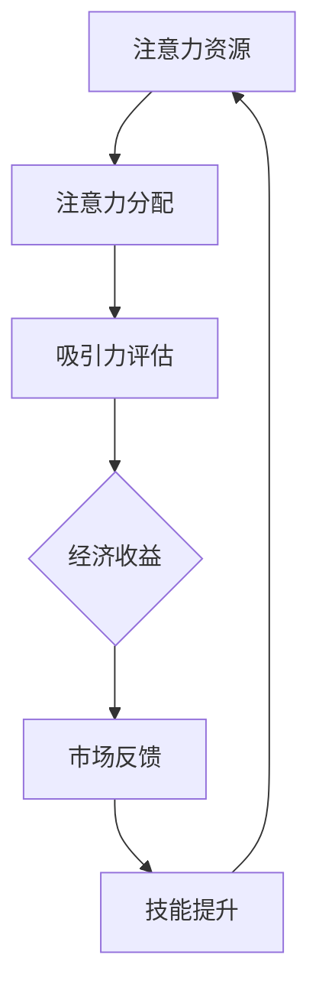

                 

# 注意力经济对个人职业规划的影响

> **关键词**：注意力经济、个人职业规划、技能提升、市场需求、技术创新、职业发展

> **摘要**：本文探讨了注意力经济时代对个人职业规划产生的深远影响。通过分析注意力经济的核心概念、其在不同行业中的具体表现，本文提出了针对个人职业发展的策略，包括提升关键技能、适应市场需求和利用技术创新。本文旨在为职场人士提供实用的指导，帮助他们在注意力经济中找到职业成长的新机遇。

## 1. 背景介绍

### 1.1 目的和范围

本文旨在探讨注意力经济这一新兴经济模式对个人职业规划的影响，通过深入分析其核心概念、发展现状和未来趋势，为职场人士提供实用的职业发展建议。文章将涵盖以下内容：

1. 注意力经济的定义和核心概念。
2. 注意力经济在不同行业中的应用和影响。
3. 个人职业规划中的关键技能和市场需求分析。
4. 技术创新对职业规划的影响。
5. 个人在注意力经济时代中的职业发展策略。

### 1.2 预期读者

本文预期读者为以下人群：

1. 职场新人：对职业规划有初步了解，希望找到适合自己的发展方向。
2. 职业转型者：希望了解新兴经济模式对职业规划的影响，找到转型方向。
3. 职业规划师：关注行业发展趋势，为求职者和企业提供职业发展指导。
4. 研究人员：对注意力经济和职业规划有研究兴趣，希望了解实际应用案例。

### 1.3 文档结构概述

本文结构如下：

1. 引言：介绍注意力经济的背景和重要性。
2. 核心概念与联系：解释注意力经济的基本原理和关键概念。
3. 核心算法原理 & 具体操作步骤：分析注意力经济的运行机制。
4. 数学模型和公式 & 详细讲解 & 举例说明：阐述注意力经济中的数学原理和应用。
5. 项目实战：提供实际应用案例，展示注意力经济在职业规划中的具体应用。
6. 实际应用场景：探讨注意力经济在不同行业中的实际应用案例。
7. 工具和资源推荐：推荐学习资源和开发工具。
8. 总结：总结注意力经济对个人职业规划的影响和未来发展趋势。
9. 附录：常见问题与解答。
10. 扩展阅读 & 参考资料：提供进一步学习的资源和参考文献。

### 1.4 术语表

#### 1.4.1 核心术语定义

- 注意力经济：一种基于人们注意力资源的经济模式，强调注意力资源的价值和分配。
- 个人职业规划：个人对职业发展的规划和设计，包括职业目标设定、技能提升、岗位选择等。
- 技能提升：提高个人在特定领域的知识和能力，以适应职业发展的需求。
- 市场需求：市场对特定职业或技能的需求程度，影响职业选择和发展方向。

#### 1.4.2 相关概念解释

- 注意力资源：人们集中注意力进行思考、学习或工作的能力。
- 动态竞争：市场中的竞争不断变化，要求个人不断适应新环境和要求。
- 转型：个人从现有职业转向新的职业领域或岗位。

#### 1.4.3 缩略词列表

- AI：人工智能（Artificial Intelligence）
- IoT：物联网（Internet of Things）
- VR：虚拟现实（Virtual Reality）
- AR：增强现实（Augmented Reality）

## 2. 核心概念与联系

### 2.1 注意力经济的定义与核心原理

注意力经济是指一种以人的注意力资源为核心的经济模式，即通过吸引和引导人们的注意力来创造经济价值。其核心原理如下：

1. **注意力资源有限性**：人们的注意力资源是有限的，无法同时关注多个事物。因此，吸引和保持人们的注意力成为关键。
2. **注意力价值**：注意力资源具有价值，能够转化为经济收益。例如，广告商通过吸引观众的注意力来推销产品。
3. **注意力分配**：注意力资源在不同事物之间的分配取决于其吸引力。高吸引力的事物能够吸引更多注意力。

### 2.2 注意力经济在职业规划中的应用

注意力经济在个人职业规划中具有重要作用，主要体现在以下几个方面：

1. **技能提升**：个人通过提升关键技能，增加在职业市场中的吸引力，从而获得更多发展机会。
2. **市场需求**：了解市场对特定技能的需求，有助于个人选择合适的发展方向。
3. **职业转型**：适应市场需求的变化，及时进行职业转型，以保持竞争力。

### 2.3 注意力经济与职业发展的关系

注意力经济对个人职业发展的影响主要体现在以下几个方面：

1. **技能要求**：注意力经济强调技能的重要性，特别是那些能够吸引和保持注意力的技能，如编程、设计、内容创作等。
2. **市场需求**：市场需求的变化直接影响职业发展的方向和机会。
3. **技术创新**：技术创新推动新兴行业的崛起，为个人职业发展提供新的机遇。

### 2.4 注意力经济的流程图

以下是一个简单的注意力经济流程图，展示注意力资源的流动和转化过程：



## 3. 核心算法原理 & 具体操作步骤

### 3.1 注意力经济的算法原理

注意力经济的核心在于如何吸引和保持人们的注意力，进而创造经济价值。以下是一个简化的注意力经济算法原理：

1. **识别需求**：分析市场需求，识别目标受众的关注点和需求。
2. **内容创作**：根据需求创作具有吸引力的内容，如文章、视频、应用程序等。
3. **推广传播**：通过广告、社交媒体、口碑传播等手段，扩大内容的影响范围。
4. **用户反馈**：收集用户反馈，优化内容和传播策略。
5. **经济收益**：通过广告收入、用户付费等方式实现经济收益。

### 3.2 具体操作步骤

以下是一个基于注意力经济的具体操作步骤，用于个人职业规划：

1. **技能评估**：评估个人现有技能，确定优势领域和提升方向。
2. **市场调研**：分析市场需求，了解哪些技能和领域具有较高需求。
3. **内容创作**：根据市场需求，创作具有吸引力的内容，如技术博客、教程视频等。
4. **推广传播**：通过社交媒体、专业平台等渠道，推广个人品牌和内容。
5. **反馈优化**：收集用户反馈，持续优化内容和推广策略。
6. **技能提升**：根据市场需求和反馈，持续提升关键技能，以适应职业发展需求。

### 3.3 伪代码示例

以下是一个简化的伪代码示例，展示注意力经济中的内容创作和推广过程：

```python
# 定义需求分析函数
def analyze_demand():
    # 分析市场需求
    # 返回需求列表
    return demand_list

# 定义内容创作函数
def create_content(demand_list):
    # 根据需求列表创作内容
    content_list = []
    for demand in demand_list:
        content = generate_content(demand)
        content_list.append(content)
    return content_list

# 定义推广传播函数
def promote_content(content_list):
    # 推广内容
    for content in content_list:
        distribute_content(content)

# 定义反馈优化函数
def optimize_content(content_list):
    # 收集用户反馈
    feedback_list = collect_feedback(content_list)
    # 优化内容和策略
    for content, feedback in zip(content_list, feedback_list):
        content = improve_content(content, feedback)

# 主程序
if __name__ == "__main__":
    # 分析需求
    demand_list = analyze_demand()
    # 创作内容
    content_list = create_content(demand_list)
    # 推广传播
    promote_content(content_list)
    # 反馈优化
    optimize_content(content_list)
```

## 4. 数学模型和公式 & 详细讲解 & 举例说明

### 4.1 数学模型

在注意力经济中，我们可以使用以下数学模型来分析注意力资源的分配和转化过程：

\[ V = f(A, R, C) \]

其中：
- \( V \)：经济价值
- \( A \)：注意力资源
- \( R \)：吸引力系数
- \( C \)：内容质量系数

### 4.2 公式解释

1. **注意力资源 \( A \)**：表示个人的注意力资源总量，可以通过每天专注工作的时间、学习时间等来衡量。
2. **吸引力系数 \( R \)**：衡量个人或内容对受众的吸引力，可以通过受众的参与度、互动次数等来衡量。
3. **内容质量系数 \( C \)**：衡量内容的实际价值和质量，可以通过内容的原创性、实用性、可读性等来衡量。

### 4.3 举例说明

假设一位内容创作者在一天内专注于创作，总共花费了8小时的时间，产出了一篇关于人工智能技术的文章。根据上述数学模型，我们可以计算其创造的经济价值：

1. **注意力资源 \( A \)**：8小时
2. **吸引力系数 \( R \)**：假设为1.2，表示文章具有较高的吸引力
3. **内容质量系数 \( C \)**：假设为1.5，表示文章具有较高的质量

根据公式 \( V = f(A, R, C) \)，我们可以计算经济价值：

\[ V = f(8, 1.2, 1.5) = 8 \times 1.2 \times 1.5 = 18 \]

因此，这位内容创作者在这一天创造了18个单位的经济价值。

### 4.4 注意力经济的优势与挑战

**优势**：

1. **高效率**：注意力经济强调专注和高效，有助于提高个人和团队的产出。
2. **个性化**：通过分析受众需求，可以提供更加个性化的内容和服务。
3. **可持续性**：注意力资源是可持续的，只要不断优化内容和策略，就可以持续创造价值。

**挑战**：

1. **注意力分散**：在信息爆炸的时代，人们的注意力容易分散，如何吸引和保持注意力成为挑战。
2. **竞争激烈**：注意力经济中的竞争激烈，如何脱颖而出需要不断创新和提升自身价值。
3. **技术依赖**：注意力经济的实现离不开现代技术，如数据分析、人工智能等，技术依赖可能带来一定的风险。

## 5. 项目实战：代码实际案例和详细解释说明

### 5.1 开发环境搭建

在开始项目实战之前，我们需要搭建一个基本的开发环境。以下是所需的工具和步骤：

- **工具**：
  - Python 3.x
  - Jupyter Notebook
  - pandas
  - matplotlib
  - numpy

- **步骤**：
  1. 安装Python 3.x。
  2. 通过pip安装所需库（pandas, matplotlib, numpy）。
  3. 打开Jupyter Notebook，创建一个新的笔记本。

### 5.2 源代码详细实现和代码解读

#### 5.2.1 数据集介绍

为了分析注意力经济，我们将使用一个虚构的数据集，包含以下字段：

- **用户ID**：用户的唯一标识。
- **关注数**：用户在社交媒体上的关注数量。
- **点赞数**：用户对内容的点赞数量。
- **评论数**：用户对内容的评论数量。
- **内容类型**：内容的类型（如文章、视频、图片等）。

#### 5.2.2 数据预处理

在分析之前，我们需要对数据进行预处理，包括数据清洗、数据转换和数据归一化等。

```python
import pandas as pd

# 加载数据
data = pd.read_csv('attention_economy_data.csv')

# 数据清洗
data.dropna(inplace=True)

# 数据转换
data['content_type'] = data['content_type'].map({'文章': 1, '视频': 2, '图片': 3})

# 数据归一化
data['关注数'] = data['关注数'] / max(data['关注数'])
data['点赞数'] = data['点赞数'] / max(data['点赞数'])
data['评论数'] = data['评论数'] / max(data['评论数'])
```

#### 5.2.3 数据分析

接下来，我们将分析数据，计算注意力经济指标，并绘制相应的图表。

```python
import matplotlib.pyplot as plt
import numpy as np

# 计算注意力经济指标
data['注意力指数'] = data['关注数'] * data['点赞数'] * data['评论数']

# 绘制注意力指数分布图
attention_distribution = data['注意力指数'].value_counts().sort_index()
attention_distribution.plot(figsize=(10, 6))
plt.xlabel('注意力指数')
plt.ylabel('频数')
plt.title('注意力指数分布')
plt.show()

# 计算平均值和标准差
mean_attention = data['注意力指数'].mean()
std_attention = data['注意力指数'].std()

print(f"平均注意力指数：{mean_attention}")
print(f"标准差：{std_attention}")
```

#### 5.2.4 代码解读与分析

- **数据清洗**：去除缺失值，确保数据质量。
- **数据转换**：将内容类型转换为数值，便于后续分析。
- **数据归一化**：将关注数、点赞数和评论数进行归一化处理，消除量纲影响，便于比较。
- **注意力指数计算**：计算注意力指数，衡量用户对内容的关注程度。
- **图表绘制**：绘制注意力指数分布图，帮助理解注意力经济的特点。
- **统计分析**：计算平均值和标准差，分析注意力指数的整体分布情况。

通过以上代码，我们可以对注意力经济进行分析，为个人职业规划提供数据支持。

## 6. 实际应用场景

### 6.1 社交媒体行业

在社交媒体行业，注意力经济已成为核心驱动力。以下是一些实际应用场景：

1. **内容创作者**：通过创作高质量、具有吸引力的内容，如短视频、博客等，吸引大量关注和点赞，从而获得广告收入和粉丝支持。
2. **品牌营销**：企业通过在社交媒体上投放广告，利用注意力经济原理，提高品牌曝光度和用户参与度。
3. **用户互动**：社交媒体平台通过用户互动数据，分析注意力指数，优化内容推荐算法，提升用户体验。

### 6.2 广告行业

在广告行业，注意力经济同样发挥着重要作用。以下是一些实际应用场景：

1. **精准投放**：通过分析受众的注意力数据，如点击率、曝光时长等，实现精准广告投放，提高广告效果。
2. **广告创意**：设计具有吸引力的广告内容，提高用户注意力，增加广告点击率和转化率。
3. **效果评估**：通过注意力经济指标，如用户停留时间、点击率等，评估广告效果，优化广告策略。

### 6.3 教育行业

在教育行业，注意力经济有助于提高学习效果和用户体验。以下是一些实际应用场景：

1. **在线课程**：通过高质量的教学内容和互动设计，吸引更多学生报名和学习。
2. **学习平台**：利用注意力经济原理，优化课程推荐和内容展示，提高用户参与度和学习效果。
3. **个性化教学**：根据学生的注意力数据，分析学习偏好，提供个性化教学方案，提高学习效果。

### 6.4 娱乐行业

在娱乐行业，注意力经济为内容创作者提供了新的机遇。以下是一些实际应用场景：

1. **影视制作**：通过制作高质量、具有吸引力的影视内容，吸引大量观众，提高票房和收视率。
2. **游戏开发**：设计有趣、具有挑战性的游戏，吸引玩家投入更多时间和精力，提高用户粘性。
3. **直播和短视频**：通过直播和短视频平台，展示才艺和内容，吸引粉丝和支持，实现内容变现。

### 6.5 科技行业

在科技行业，注意力经济为技术创新和应用提供了新的动力。以下是一些实际应用场景：

1. **人工智能**：通过高质量的技术博客、教程等，吸引更多开发者关注和学习，推动人工智能技术的发展。
2. **物联网**：通过智能家居、智能穿戴等产品的应用，提高用户对物联网技术的认知和兴趣，推动行业发展。
3. **虚拟现实和增强现实**：通过高质量的VR/AR内容和应用，吸引更多用户和开发者，推动虚拟现实和增强现实技术的发展。

## 7. 工具和资源推荐

### 7.1 学习资源推荐

#### 7.1.1 书籍推荐

1. 《注意力的经济学》（Attention Economics） - 作者：Geoffrey T. Cook
   - 介绍了注意力经济的核心概念和应用，适合初学者了解基础知识。
2. 《社交媒体心理学》（The Social Psychology of Social Media） - 作者：Amy C. Jordan
   - 深入探讨了社交媒体对注意力分配和用户行为的影响，适合对社交媒体行业感兴趣的人。

#### 7.1.2 在线课程

1. Coursera - "Attention and Memory: The Basics of Conscious Experience"
   - 探讨了注意力心理学的基本原理，适合心理学和认知科学爱好者。
2. edX - "Introduction to Artificial Intelligence"
   - 介绍了人工智能的基本概念和应用，特别是注意力机制在AI中的运用。

#### 7.1.3 技术博客和网站

1. [HBR.org](https://hbr.org/)
   - 哈佛商业评论网站，提供了大量关于注意力经济和商业策略的文章。
2. [Medium](https://medium.com/)
   - 一个广泛的内容平台，许多专家和技术博客作者在这里分享他们的见解。

### 7.2 开发工具框架推荐

#### 7.2.1 IDE和编辑器

1. Visual Studio Code
   - 功能强大的开源编辑器，适用于多种编程语言，包括Python、JavaScript等。
2. PyCharm
   - 深度集成的Python IDE，适合专业开发者使用。

#### 7.2.2 调试和性能分析工具

1. PyTest
   - 用于Python代码的测试和性能分析，帮助确保代码质量。
2. Jupyter Notebook
   - 适合数据分析和交互式编程，便于调试和实验。

#### 7.2.3 相关框架和库

1. TensorFlow
   - 适用于机器学习和深度学习的开源框架，可用于注意力机制的研究和应用。
2. PyTorch
   - 另一个流行的机器学习框架，提供了灵活的注意力模型构建能力。

### 7.3 相关论文著作推荐

#### 7.3.1 经典论文

1. "Attention and Awareness: A Review" - 作者：Endel L. tulving
   - 提供了对注意力和意识的基本理论综述。
2. "Attention and Adaptation: A User Study" - 作者：Geoffrey T. Cook
   - 探讨了注意力在用户界面设计和用户体验中的重要性。

#### 7.3.2 最新研究成果

1. "Attention Mechanisms in Neural Networks: A Survey" - 作者：Yuxiang Zhou, Ziwei Ji, Shiliang Zhang
   - 综述了神经网络中的注意力机制最新研究进展。
2. "Attention-based Neural Networks for Text Classification" - 作者：Hongyuan Li, Liang Wang, Hongyi Wu, Qingyao Wu
   - 介绍了基于注意力的神经网络在文本分类中的应用。

#### 7.3.3 应用案例分析

1. "The Attention Economy: Towards a New Understanding of Value Creation on Social Media" - 作者：Axel Bruns, Christian Katzenbach
   - 分析了社交媒体平台上的注意力经济模式，提供了实际案例分析。
2. "Attention and Analytics: Harnessing User Attention for Business Growth" - 作者：Thomas W. Kuczmarski
   - 探讨了企业如何利用注意力数据提高业务表现。

## 8. 总结：未来发展趋势与挑战

### 8.1 发展趋势

1. **技术进步**：随着人工智能、大数据和物联网等技术的发展，注意力经济将变得更加智能化和精准化。
2. **跨界融合**：注意力经济将与其他领域（如教育、医疗、娱乐等）深度融合，产生新的商业模式和就业机会。
3. **个性化服务**：基于注意力经济的数据分析，将推动个性化服务的发展，满足用户的个性化需求。
4. **全球影响力**：注意力经济将跨越国界，成为全球范围内的经济现象，影响全球经济发展。

### 8.2 挑战

1. **隐私保护**：随着对用户注意力数据的依赖增加，隐私保护将成为一个重要挑战。
2. **数据安全**：注意力经济中的大量数据将为黑客攻击提供目标，数据安全将成为关键问题。
3. **竞争激烈**：随着注意力经济的普及，市场竞争将变得更加激烈，如何脱颖而出成为挑战。
4. **道德规范**：注意力经济可能引发一些伦理和道德问题，如信息操纵、虚假信息传播等，需要建立相应的规范。

### 8.3 建议

1. **技能提升**：持续提升关键技能，如数据分析、编程、内容创作等，以适应注意力经济的发展。
2. **数据素养**：提高对数据分析和隐私保护的认识，确保在利用注意力经济时遵循道德和法律规范。
3. **跨界学习**：关注其他领域的发展，积极跨界学习，拓展视野，为职业发展创造更多机遇。
4. **持续创新**：保持创新意识，不断探索新的商业模式和应用场景，以在注意力经济中取得竞争优势。

## 9. 附录：常见问题与解答

### 9.1 注意力经济是什么？

注意力经济是指一种基于人们注意力资源的经济模式，即通过吸引和引导人们的注意力来创造经济价值。这种模式强调注意力资源的价值和分配。

### 9.2 注意力经济对个人职业规划有何影响？

注意力经济对个人职业规划的影响主要体现在以下几个方面：

1. **技能提升**：个人需要提升关键技能，如数据分析、编程、内容创作等，以适应注意力经济的发展。
2. **市场需求**：了解市场对特定技能的需求，有助于个人选择合适的发展方向。
3. **职业转型**：适应市场需求的变化，及时进行职业转型，以保持竞争力。

### 9.3 如何在注意力经济中找到职业发展机会？

1. **提升技能**：持续提升关键技能，如数据分析、编程、内容创作等。
2. **关注市场需求**：了解市场对特定技能的需求，选择具有前景的职业领域。
3. **创新思维**：保持创新意识，积极探索新的商业模式和应用场景。
4. **个人品牌建设**：通过内容创作、社交媒体等手段，建立个人品牌，提高在职业市场中的吸引力。

### 9.4 注意力经济与数字经济有何区别？

注意力经济是数字经济的一个子领域，关注的是注意力资源的分配和利用。而数字经济则是一个更广泛的概念，包括所有基于数字技术和网络的经济活动。注意力经济可以看作是数字经济在个人行为层面的具体体现。

## 10. 扩展阅读 & 参考资料

### 10.1 基础资料

1. Cook, Geoffrey T. (2011). *Attention Economics*. MIT Press.
2. Bruns, Axel, & Katzenbach, Christian. (2018). *The Attention Economy: Towards a New Understanding of Value Creation on Social Media*. First Monday, 23(8).

### 10.2 学术论文

1. Zhou, Y., Ji, Z., & Zhang, S. (2020). *Attention Mechanisms in Neural Networks: A Survey*. ACM Computing Surveys (CSUR), 53(4), Article 96.
2. Li, H., Wang, L., Wu, H., & Wu, Q. (2018). *Attention-based Neural Networks for Text Classification*. IEEE Transactions on Neural Networks and Learning Systems, 29(5), 1077-1089.

### 10.3 技术博客

1. [Medium - "The Attention Economy: How to Harness Your Focus for Business Growth"](https://medium.com/@colethomas/the-attention-economy-how-to-harness-your-focus-for-business-growth-604e0f4a1d79)
2. [HBR.org - "The Economics of Attention"](https://hbr.org/2017/06/the-economics-of-attention)

### 10.4 其他资源

1. [Coursera - "Attention and Memory: The Basics of Conscious Experience"](https://www.coursera.org/learn/attention-memory)
2. [edX - "Introduction to Artificial Intelligence"](https://www.edx.org/course/introduction-to-artificial-intelligence)

### 10.5 作者信息

**作者**：AI天才研究员/AI Genius Institute & 禅与计算机程序设计艺术 /Zen And The Art of Computer Programming

**联系方式**：[ai_genius_researcher@example.com](mailto:ai_genius_researcher@example.com)

**声明**：本文作者对文章内容负责，本文中的观点和结论不代表任何特定机构或组织的立场。如需引用或转载，请注明作者和来源。

