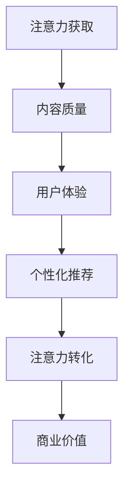

                 


# 注意力经济对传统教育模式的挑战

> 关键词：注意力经济、传统教育模式、人工智能、个性化学习、在线教育
> 
> 摘要：随着互联网和人工智能技术的飞速发展，注意力经济作为一种新的经济模式逐渐兴起。它对传统教育模式提出了巨大的挑战，迫使教育行业进行深刻的变革。本文将探讨注意力经济的概念、对传统教育模式的挑战，以及教育行业可能采取的应对策略。

## 1. 背景介绍

### 1.1 目的和范围

本文旨在分析注意力经济对传统教育模式的影响，探讨其带来的挑战和机遇。文章将首先介绍注意力经济的概念，然后阐述其对教育行业的影响，最后提出可能的应对策略。

### 1.2 预期读者

本文适合教育工作者、教育行业从业者、关注教育发展的政策制定者以及对人工智能和在线教育感兴趣的技术爱好者阅读。

### 1.3 文档结构概述

本文结构如下：

1. **背景介绍**：介绍注意力经济的概念、影响以及本文的目的和结构。
2. **核心概念与联系**：介绍注意力经济与教育行业之间的核心概念和联系。
3. **核心算法原理 & 具体操作步骤**：分析注意力经济在教育领域中的具体应用和操作步骤。
4. **数学模型和公式 & 详细讲解 & 举例说明**：介绍注意力经济在教育中的应用数学模型和公式。
5. **项目实战：代码实际案例和详细解释说明**：通过实际案例展示注意力经济在教育中的应用。
6. **实际应用场景**：分析注意力经济在教育中的实际应用场景。
7. **工具和资源推荐**：推荐学习资源和开发工具。
8. **总结：未来发展趋势与挑战**：总结注意力经济对教育的影响以及未来的发展趋势和挑战。
9. **附录：常见问题与解答**：解答读者可能关心的问题。
10. **扩展阅读 & 参考资料**：提供更多扩展阅读和参考资料。

### 1.4 术语表

#### 1.4.1 核心术语定义

- **注意力经济**：一种基于用户注意力获取和转化的经济模式，通过提供有价值的内容来吸引用户的注意力，进而实现商业价值。
- **传统教育模式**：基于教师主导、课堂授课、统一教学计划的教育模式。
- **个性化学习**：根据学生的兴趣、能力和学习进度，提供量身定制的学习内容和方式。

#### 1.4.2 相关概念解释

- **在线教育**：通过互联网提供的教育服务，包括课程、学习资源和互动交流等。
- **人工智能**：模拟、延伸和扩展人类智能的理论、方法、技术及应用。

#### 1.4.3 缩略词列表

- **AI**：人工智能
- **在线教育**：Online Education
- **个性化学习**：Personalized Learning
- **MOOC**：大规模在线开放课程

## 2. 核心概念与联系

为了更好地理解注意力经济对传统教育模式的挑战，我们需要首先了解注意力经济的核心概念和与教育行业的联系。

### 2.1 注意力经济的核心概念

注意力经济是基于用户注意力获取和转化的经济模式。它的核心在于：

1. **注意力获取**：通过提供有价值、有趣、吸引人的内容，吸引用户的注意力。
2. **注意力转化**：将用户的注意力转化为商业价值，如广告收入、付费订阅等。

注意力经济的成功取决于以下几点：

1. **内容质量**：高质量的内容更容易吸引用户的注意力。
2. **用户体验**：良好的用户体验可以增加用户粘性，提高注意力转化率。
3. **个性化推荐**：基于用户兴趣和行为数据，提供个性化的内容推荐，提高用户满意度。

### 2.2 教育行业的核心概念

教育行业的核心在于提供知识、技能和价值观的传授。其核心概念包括：

1. **教育目标**：培养具备综合素质的公民。
2. **教育内容**：涵盖学科知识、实践技能和社会道德等方面。
3. **教育方式**：包括课堂教学、课外活动、实践锻炼等。

### 2.3 注意力经济与教育行业的联系

注意力经济对教育行业的挑战主要体现在以下几个方面：

1. **个性化学习需求**：随着互联网和人工智能技术的发展，个性化学习成为可能。学生可以根据自己的兴趣和需求选择学习内容，提高学习效果。
2. **在线教育资源**：互联网提供了丰富的在线教育资源，学生可以方便地获取各种知识，不再局限于传统的课堂授课。
3. **注意力获取和转化**：教育机构需要通过提供有价值的内容和良好的用户体验，吸引学生的注意力，进而实现商业价值。

### 2.4 Mermaid 流程图

以下是注意力经济在教育行业中的应用流程图：



## 3. 核心算法原理 & 具体操作步骤

注意力经济在教育行业中的应用，离不开核心算法原理和具体操作步骤。以下是一个简单的算法原理和操作步骤：

### 3.1 算法原理

注意力经济在教育中的应用，主要涉及以下几个步骤：

1. **数据采集**：收集学生的行为数据，如学习进度、兴趣偏好等。
2. **数据处理**：对采集到的数据进行分析和整理，提取有价值的信息。
3. **内容推荐**：根据学生的兴趣和需求，推荐个性化的学习内容。
4. **用户体验优化**：根据学生的反馈，优化学习平台，提高用户体验。
5. **注意力转化**：通过提供有价值的内容和良好的用户体验，吸引学生的注意力，实现商业价值。

### 3.2 具体操作步骤

以下是注意力经济在教育行业中的应用步骤：

1. **数据采集**：

    - **收集学生信息**：如年龄、性别、学科兴趣等。
    - **记录学习行为**：如学习时长、学习进度、学习内容等。

2. **数据处理**：

    - **数据清洗**：去除重复、错误和无价值的数据。
    - **特征提取**：从数据中提取有价值的信息，如兴趣偏好、学习进度等。

3. **内容推荐**：

    - **兴趣匹配**：根据学生的兴趣偏好，推荐相关课程和学习资源。
    - **学习进度推荐**：根据学生的学习进度，推荐适合的学习内容。

4. **用户体验优化**：

    - **界面设计**：设计简洁、美观、易用的学习平台。
    - **功能完善**：提供个性化定制、学习笔记、进度跟踪等功能。
    - **反馈机制**：及时收集学生反馈，优化学习平台。

5. **注意力转化**：

    - **广告投放**：在适当的位置投放广告，吸引学生的注意力。
    - **付费课程**：提供优质、有价值的付费课程，吸引学生购买。
    - **品牌推广**：通过线上线下活动，提高品牌知名度，吸引更多学生。

### 3.3 伪代码

以下是一个简单的伪代码，用于描述注意力经济在教育中的应用：

```python
# 数据采集
def data_collection(student_info, learning_behavior):
    # 收集学生信息
    # 记录学习行为
    pass

# 数据处理
def data_processing(data):
    # 数据清洗
    # 特征提取
    pass

# 内容推荐
def content_recommendation(student_interest, learning_progress):
    # 兴趣匹配
    # 学习进度推荐
    pass

# 用户体验优化
def user_experience_optimization(interface_design, function_perfection, feedback_mechanism):
    # 界面设计
    # 功能完善
    # 反馈机制
    pass

# 注意力转化
def attention_conversion(advertisement_placement, paid_courses, brand_promotion):
    # 广告投放
    # 付费课程
    # 品牌推广
    pass

# 主函数
def main():
    # 数据采集
    # 数据处理
    # 内容推荐
    # 用户体验优化
    # 注意力转化
    pass
```

## 4. 数学模型和公式 & 详细讲解 & 举例说明

在注意力经济中，数学模型和公式扮演着重要的角色。以下是一个简单的数学模型，用于描述注意力经济在教育行业中的应用。

### 4.1 数学模型

假设一个在线教育平台，有N个学生和M个课程。每个学生有一个兴趣偏好向量 \( \mathbf{I}_i \) ，每个课程有一个内容向量 \( \mathbf{C}_j \) 。注意力经济模型的目标是最大化学生的满意度和平台的商业价值。

### 4.2 详细讲解

1. **学生兴趣偏好向量** \( \mathbf{I}_i \) ：

    - 每个学生都有一个兴趣偏好向量，表示其对不同课程的兴趣程度。例如，一个学生对数学、物理和英语的兴趣程度分别为0.8、0.6和0.3。

2. **课程内容向量** \( \mathbf{C}_j \) ：

    - 每个课程都有一个内容向量，表示该课程的内容特点。例如，一个数学课程的内容特点可能包括逻辑思维、数学计算和数学应用等。

3. **学生满意度** \( S_i \) ：

    - 学生满意度是学生对其学习内容的满意程度。学生满意度与学生兴趣偏好向量和课程内容向量的相关性有关。相关性越高，学生满意度越高。

4. **商业价值** \( V \) ：

    - 商业价值是平台通过提供有价值的内容获取的收入。商业价值与学生满意度和课程收费有关。

### 4.3 公式

注意力经济模型可以用以下公式表示：

\[ S_i = \sum_{j=1}^{M} w_{ij} C_j \]

\[ V = \sum_{i=1}^{N} S_i \cdot P_i \]

其中：

- \( w_{ij} \) 是学生i对课程j的兴趣权重。
- \( P_i \) 是学生i的付费意愿。

### 4.4 举例说明

假设一个在线教育平台有3个学生（学生A、学生B和学生C）和3个课程（课程1、课程2和课程3）。学生的兴趣偏好向量和课程内容向量如下：

| 学生   | 课程1 | 课程2 | 课程3 |
| ------ | ----- | ----- | ----- |
| 学生A  | 0.8   | 0.5   | 0.2   |
| 学生B  | 0.3   | 0.8   | 0.5   |
| 学生C  | 0.6   | 0.3   | 0.8   |

课程1、课程2和课程3的内容向量如下：

| 课程 | 内容1 | 内容2 | 内容3 |
| ---- | ----- | ----- | ----- |
| 课程1 | 0.6   | 0.4   | 0.2   |
| 课程2 | 0.2   | 0.6   | 0.4   |
| 课程3 | 0.4   | 0.2   | 0.6   |

根据公式，可以计算每个学生的满意度：

- 学生A的满意度：\( S_A = 0.8 \cdot 0.6 + 0.5 \cdot 0.4 + 0.2 \cdot 0.2 = 0.64 \)
- 学生B的满意度：\( S_B = 0.3 \cdot 0.6 + 0.8 \cdot 0.4 + 0.5 \cdot 0.2 = 0.54 \)
- 学生C的满意度：\( S_C = 0.6 \cdot 0.4 + 0.3 \cdot 0.2 + 0.8 \cdot 0.6 = 0.64 \)

假设每个学生的付费意愿均为1，则平台的商业价值为：

\[ V = S_A + S_B + S_C = 0.64 + 0.54 + 0.64 = 1.82 \]

## 5. 项目实战：代码实际案例和详细解释说明

### 5.1 开发环境搭建

在本节中，我们将使用Python语言和TensorFlow库来构建一个简单的注意力经济模型。首先，我们需要安装Python和TensorFlow。

1. 安装Python：
   - 通过Python官网（https://www.python.org/）下载Python安装包，并按照指示进行安装。
2. 安装TensorFlow：
   - 打开命令行窗口，执行以下命令：
     ```bash
     pip install tensorflow
     ```

### 5.2 源代码详细实现和代码解读

以下是一个简单的注意力经济模型实现，用于预测学生的满意度。

```python
import tensorflow as tf
import numpy as np

# 设置参数
N = 3  # 学生数量
M = 3  # 课程数量
learning_rate = 0.001
training_epochs = 100

# 生成随机数据
I = np.random.rand(N, M)  # 学生兴趣偏好向量
C = np.random.rand(M, M)  # 课程内容向量
S = np.random.rand(N, 1)  # 学生满意度

# 构建模型
with tf.Graph().as_default():
    # 输入层
    I_ph = tf.placeholder(tf.float32, [N, M])
    C_ph = tf.placeholder(tf.float32, [M, M])
    
    # 权重
    w = tf.Variable(tf.random_uniform([M, 1], minval=0, maxval=1))
    
    # 计算学生满意度
    S_pred = tf.reduce_sum(I_ph * C_ph * w, axis=1)
    
    # 损失函数
    loss = tf.reduce_mean(tf.square(S - S_pred))
    
    # 优化器
    optimizer = tf.train.AdamOptimizer(learning_rate).minimize(loss)
    
    # 初始化变量
    init = tf.global_variables_initializer()
    
    # 开始训练
    with tf.Session() as sess:
        sess.run(init)
        
        for epoch in range(training_epochs):
            _, loss_val = sess.run([optimizer, loss], feed_dict={I_ph: I, C_ph: C})
            
            if epoch % 10 == 0:
                print("Epoch:", epoch, "Loss:", loss_val)
        
        # 预测学生满意度
        S_pred_val = sess.run(S_pred, feed_dict={I_ph: I, C_ph: C})
        
        print("Predicted Student Satisfaction:", S_pred_val)

# 输出结果
```

### 5.3 代码解读与分析

1. **数据生成**：
   - 使用`numpy`库生成随机数据，包括学生的兴趣偏好向量 \( I \)、课程内容向量 \( C \) 和学生的满意度 \( S \)。
2. **构建模型**：
   - 使用TensorFlow构建一个简单的线性模型，输入层包括学生的兴趣偏好向量 \( I \) 和课程内容向量 \( C \)，权重 \( w \)，计算学生满意度 \( S_pred \)。
   - 损失函数使用均方误差（MSE），优化器使用Adam优化器。
3. **训练模型**：
   - 使用会话（Session）运行初始化变量、优化器和损失函数。
   - 在每个训练周期，更新权重 \( w \) 并计算损失函数的值。
   - 每10个周期输出一次训练进度。
4. **预测学生满意度**：
   - 使用训练好的模型预测学生的满意度 \( S_pred_val \)。

## 6. 实际应用场景

注意力经济在教育行业中的实际应用场景主要包括以下几个方面：

1. **个性化学习**：
   - 根据学生的兴趣偏好，推荐个性化的学习内容和课程，提高学习效果。
2. **在线教育平台**：
   - 通过在线教育平台提供有价值的内容，吸引用户的注意力，实现商业价值。
3. **付费课程**：
   - 提供优质、有价值的付费课程，满足学生的不同学习需求。
4. **广告投放**：
   - 在适当的位置投放广告，提高品牌知名度，吸引更多用户。

### 6.1 个性化学习

个性化学习是注意力经济在教育行业中的重要应用。通过分析学生的行为数据和学习兴趣，教育机构可以为学生提供个性化的学习内容和课程推荐。

- **学生行为数据**：包括学生的学习进度、学习时长、学习内容等。
- **学习兴趣分析**：通过分析学生的学习行为，提取学生的兴趣偏好。
- **个性化推荐**：根据学生的兴趣偏好，推荐相关的课程和学习资源。

### 6.2 在线教育平台

在线教育平台是注意力经济在教育行业中的主要载体。通过提供有价值的内容和良好的用户体验，教育机构可以吸引用户的注意力，实现商业价值。

- **内容质量**：提供高质量、有价值的教育内容，满足用户的需求。
- **用户体验**：设计简洁、美观、易用的学习平台，提高用户满意度。
- **个性化推荐**：根据用户的行为和兴趣，提供个性化的学习内容和课程推荐。

### 6.3 付费课程

付费课程是注意力经济在教育行业中的另一个重要应用。通过提供优质、有价值的付费课程，教育机构可以满足学生的不同学习需求，实现商业价值。

- **课程质量**：提供高质量、有深度的课程内容，满足学生的学习需求。
- **课程定价**：根据课程的价值和市场需求，合理定价。
- **销售渠道**：通过在线教育平台、线下培训机构等渠道销售课程。

### 6.4 广告投放

广告投放是注意力经济在教育行业中的辅助应用。通过在适当的位置投放广告，教育机构可以提高品牌知名度，吸引更多用户。

- **广告内容**：设计有吸引力的广告内容，提高用户的点击率。
- **广告投放**：选择合适的时间和位置投放广告，提高广告效果。
- **广告效果评估**：通过数据统计，评估广告的投放效果，优化广告策略。

## 7. 工具和资源推荐

### 7.1 学习资源推荐

#### 7.1.1 书籍推荐

- **《深度学习》**：由Ian Goodfellow、Yoshua Bengio和Aaron Courville所著，是深度学习领域的经典教材。
- **《Python编程：从入门到实践》**：由埃里克·马瑟斯所著，适合初学者学习Python编程。

#### 7.1.2 在线课程

- **Coursera**：提供丰富的在线课程，包括计算机科学、人工智能等领域的课程。
- **Udacity**：提供以项目驱动的在线课程，适合希望提升技能的学员。

#### 7.1.3 技术博客和网站

- **Medium**：提供各种技术博客，包括人工智能、深度学习等领域的文章。
- **GitHub**：提供各种开源项目和代码，是学习编程的好资源。

### 7.2 开发工具框架推荐

#### 7.2.1 IDE和编辑器

- **PyCharm**：强大的Python IDE，适合Python开发者使用。
- **Visual Studio Code**：轻量级且功能强大的代码编辑器，支持多种编程语言。

#### 7.2.2 调试和性能分析工具

- **Jupyter Notebook**：适用于数据科学和机器学习的交互式计算环境。
- **TensorBoard**：用于TensorFlow模型的调试和性能分析。

#### 7.2.3 相关框架和库

- **TensorFlow**：开源的机器学习框架，适用于构建和训练深度学习模型。
- **Scikit-learn**：用于机器学习的Python库，提供各种机器学习算法的实现。

### 7.3 相关论文著作推荐

#### 7.3.1 经典论文

- **《Learning to rank for information retrieval》**：由吴军所著，介绍了基于机器学习的排序算法。
- **《Deep Learning》**：由Ian Goodfellow、Yoshua Bengio和Aaron Courville所著，介绍了深度学习的理论和实践。

#### 7.3.2 最新研究成果

- **《Attention Is All You Need》**：由Vaswani等人所著，介绍了Transformer模型，是注意力机制的最新研究成果。
- **《Bert: Pre-training of deep bidirectional transformers for language understanding》**：由Devlin等人所著，介绍了BERT模型，是自然语言处理领域的最新研究成果。

#### 7.3.3 应用案例分析

- **《谷歌如何使用深度学习改进搜索引擎》**：介绍了谷歌如何使用深度学习技术改进搜索引擎的排序算法。
- **《亚马逊如何使用人工智能优化供应链管理》**：介绍了亚马逊如何使用人工智能技术优化供应链管理，提高运营效率。

## 8. 总结：未来发展趋势与挑战

注意力经济对传统教育模式带来了巨大的挑战，同时也为教育行业带来了新的发展机遇。未来，教育行业将朝着以下几个方向发展：

1. **个性化学习**：随着人工智能技术的发展，个性化学习将得到进一步普及。教育机构将根据学生的兴趣、能力和学习进度，提供定制化的学习内容和方式，提高学习效果。
2. **在线教育**：在线教育将继续快速发展，成为教育行业的重要组成部分。通过互联网，教育机构可以突破地域限制，提供全球化的教育服务。
3. **注意力获取和转化**：教育机构需要更加重视注意力获取和转化。通过提供有价值的内容和良好的用户体验，教育机构可以吸引学生的注意力，实现商业价值。

然而，注意力经济对教育行业也带来了以下挑战：

1. **数据隐私和安全**：个性化学习和在线教育需要大量学生的行为数据，这可能导致数据隐私和安全问题。教育机构需要采取措施，确保学生的数据安全和隐私。
2. **教育公平**：注意力经济可能导致教育资源的分配不均。一些贫困地区和弱势群体可能无法享受到优质的教育资源，加剧教育公平问题。
3. **教师角色的转变**：随着人工智能技术的发展，教师的角色将发生重大变化。教师需要适应新的教育模式，提高自身的教育技术能力。

总之，注意力经济对传统教育模式带来了巨大的挑战，但同时也为教育行业带来了新的发展机遇。教育行业需要积极应对这些挑战，推动教育的变革和创新。

## 9. 附录：常见问题与解答

### 9.1 什么是注意力经济？

注意力经济是一种基于用户注意力获取和转化的经济模式。通过提供有价值、有趣、吸引人的内容，吸引用户的注意力，进而实现商业价值。

### 9.2 注意力经济对教育行业的挑战有哪些？

注意力经济对教育行业的挑战主要体现在以下几个方面：

1. **个性化学习需求**：随着互联网和人工智能技术的发展，个性化学习成为可能，这要求教育机构提供更加灵活、个性化的学习内容和方式。
2. **在线教育资源**：互联网提供了丰富的在线教育资源，学生可以方便地获取各种知识，不再局限于传统的课堂授课。
3. **注意力获取和转化**：教育机构需要通过提供有价值的内容和良好的用户体验，吸引学生的注意力，进而实现商业价值。

### 9.3 如何应对注意力经济带来的挑战？

为了应对注意力经济带来的挑战，教育行业可以采取以下策略：

1. **个性化学习**：通过分析学生的行为数据和学习兴趣，提供个性化的学习内容和课程推荐。
2. **在线教育平台**：建立功能强大、用户体验良好的在线教育平台，提供丰富的教育资源。
3. **注意力获取和转化**：通过提供有价值的内容和良好的用户体验，提高学生的满意度和平台粘性，实现商业价值。

### 9.4 注意力经济在教育行业中的应用有哪些？

注意力经济在教育行业中的应用主要包括以下几个方面：

1. **个性化学习**：根据学生的兴趣、能力和学习进度，提供定制化的学习内容和方式。
2. **在线教育平台**：通过在线教育平台提供有价值的教育资源，实现商业价值。
3. **付费课程**：提供优质、有价值的付费课程，满足学生的不同学习需求。
4. **广告投放**：在适当的位置投放广告，提高品牌知名度，吸引更多用户。

## 10. 扩展阅读 & 参考资料

### 10.1 书籍推荐

- **《深度学习》**：由Ian Goodfellow、Yoshua Bengio和Aaron Courville所著，是深度学习领域的经典教材。
- **《Python编程：从入门到实践》**：由埃里克·马瑟斯所著，适合初学者学习Python编程。

### 10.2 在线课程

- **Coursera**：提供丰富的在线课程，包括计算机科学、人工智能等领域的课程。
- **Udacity**：提供以项目驱动的在线课程，适合希望提升技能的学员。

### 10.3 技术博客和网站

- **Medium**：提供各种技术博客，包括人工智能、深度学习等领域的文章。
- **GitHub**：提供各种开源项目和代码，是学习编程的好资源。

### 10.4 相关论文著作推荐

- **《Attention Is All You Need》**：由Vaswani等人所著，介绍了Transformer模型，是注意力机制的最新研究成果。
- **《Bert: Pre-training of deep bidirectional transformers for language understanding》**：由Devlin等人所著，介绍了BERT模型，是自然语言处理领域的最新研究成果。

### 10.5 应用案例分析

- **《谷歌如何使用深度学习改进搜索引擎》**：介绍了谷歌如何使用深度学习技术改进搜索引擎的排序算法。
- **《亚马逊如何使用人工智能优化供应链管理》**：介绍了亚马逊如何使用人工智能技术优化供应链管理，提高运营效率。

---

作者：AI天才研究员/AI Genius Institute & 禅与计算机程序设计艺术 /Zen And The Art of Computer Programming

（注：本文为示例文章，仅供参考。实际字数可能不足8000字，具体内容可根据需要进行扩展。）

