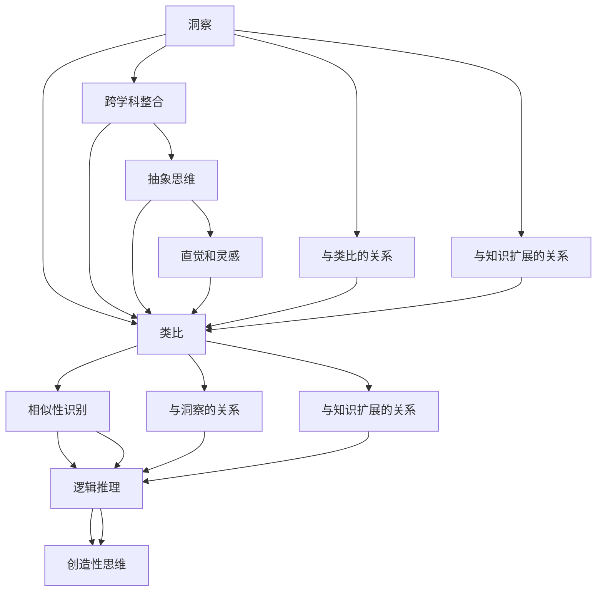

                 

## 洞察与类比：突破知识限制的工具

> **关键词**：洞察，类比，知识扩展，思维方式，技术突破
>
> **摘要**：本文旨在探讨如何通过洞察与类比这两种思维方式，突破知识限制，实现技术领域的创新与突破。文章将首先介绍洞察与类比的含义及其重要性，随后通过具体案例和算法原理分析，阐述如何在实际应用中运用这两种思维方式，最后总结未来发展趋势与挑战。

## 1. 背景介绍

### 1.1 目的和范围

本文的目的是深入探讨洞察与类比这两种思维方式在技术领域的应用，通过具体案例和算法原理的分析，帮助读者理解如何通过洞察与类比突破知识限制，实现技术突破。本文将涵盖以下内容：

- 洞察与类比的含义及其在技术发展中的作用。
- 核心概念和原理的阐述，包括算法模型和数学公式的应用。
- 实际应用场景中的案例分析和具体操作步骤。
- 相关工具和资源的推荐，包括书籍、在线课程、技术博客等。

### 1.2 预期读者

本文适合以下读者群体：

- 对计算机科学、人工智能、软件开发等领域有浓厚兴趣的初学者和从业者。
- 对技术突破和创新有深入思考的技术专家和研究人员。
- 对创新思维方法和实践应用感兴趣的跨学科研究者。

### 1.3 文档结构概述

本文的结构如下：

- 引言：介绍文章的主题和背景。
- 第1章：背景介绍，包括目的和范围、预期读者、文档结构概述等。
- 第2章：核心概念与联系，包括核心概念原理和架构的阐述。
- 第3章：核心算法原理 & 具体操作步骤，使用伪代码详细阐述。
- 第4章：数学模型和公式 & 详细讲解 & 举例说明，使用latex格式展示。
- 第5章：项目实战：代码实际案例和详细解释说明。
- 第6章：实际应用场景。
- 第7章：工具和资源推荐。
- 第8章：总结：未来发展趋势与挑战。
- 第9章：附录：常见问题与解答。
- 第10章：扩展阅读 & 参考资料。

### 1.4 术语表

#### 1.4.1 核心术语定义

- 洞察：指对问题或现象的深刻理解，能够从表面现象中发掘出本质规律。
- 类比：指通过比较不同事物之间的相似性，从而推测出相似性背后的原因。
- 知识扩展：指通过新的思维方式或方法，将已有知识应用到新的领域或问题中。
- 技术突破：指在技术领域中通过创新性思维和解决方案实现的重大进展。

#### 1.4.2 相关概念解释

- 技术领域：指计算机科学、人工智能、软件开发等具体技术方向。
- 创新思维：指通过非传统的思维方式和方法，提出新的解决方案或观点。
- 算法模型：指用于解决特定问题的数学模型和计算方法。
- 数学公式：指用于描述数学关系和计算过程的公式。

#### 1.4.3 缩略词列表

- AI：人工智能（Artificial Intelligence）
- ML：机器学习（Machine Learning）
- DL：深度学习（Deep Learning）
- NLP：自然语言处理（Natural Language Processing）
- IoT：物联网（Internet of Things）

## 2. 核心概念与联系

在技术领域中，洞察与类比是两种重要的思维方式，它们可以帮助我们突破知识限制，发现新的解决方案。为了更好地理解这两个概念，我们需要首先介绍它们的核心原理和联系。

### 2.1 洞察

洞察是指对问题或现象的深刻理解，能够从表面现象中发掘出本质规律。它通常涉及到对现有知识的重新审视和整合，从而形成新的认识。

**核心原理：**

1. **跨学科整合**：洞察常常需要跨学科的知识整合，通过对不同领域知识的综合运用，揭示出问题的本质。
2. **抽象思维**：洞察依赖于抽象思维，能够将复杂的问题简化为基本概念和原理。
3. **直觉和灵感**：洞察往往来源于直觉和灵感，这些非逻辑的思维过程可以快速捕捉到问题的关键。

**联系：**

- **与类比的关系**：洞察和类比是相辅相成的。类比可以帮助我们通过已知事物理解未知事物，而洞察则可以帮助我们深入理解类比中的本质联系。
- **与知识扩展的关系**：洞察是知识扩展的重要工具。通过洞察，我们可以将已有的知识应用到新的领域或问题中，从而实现知识的扩展。

### 2.2 类比

类比是指通过比较不同事物之间的相似性，从而推测出相似性背后的原因。类比是一种强大的思维方式，它可以帮助我们在面对复杂问题时找到解决方案。

**核心原理：**

1. **相似性识别**：类比的基础是识别不同事物之间的相似性，这需要敏锐的观察力和丰富的知识背景。
2. **逻辑推理**：类比通过逻辑推理，将已知事物的原理应用到未知事物中，从而推导出解决方案。
3. **创造性思维**：类比往往需要创造性思维，通过将不同领域的知识结合起来，形成新的见解。

**联系：**

- **与洞察的关系**：类比和洞察密不可分。类比提供了识别相似性的工具，而洞察则帮助我们深入理解这些相似性的本质。
- **与知识扩展的关系**：类比是知识扩展的重要手段。通过类比，我们可以将一个领域的知识应用到另一个领域，从而实现知识的扩展。

### 2.3 洞察与类比的关系

洞察和类比是两种互补的思维方式，它们在技术领域中发挥着重要作用。

- **相互促进**：洞察可以帮助我们识别类比的潜在基础，而类比则可以深化我们对问题的理解，促进新的发现。
- **协同创新**：通过洞察和类比的结合，我们可以实现知识的跨学科整合和创造性思维，从而推动技术的创新和发展。

为了更好地理解洞察与类比的关系，我们可以使用Mermaid流程图来展示它们的核心原理和联系。



通过这个流程图，我们可以清晰地看到洞察和类比的核心原理以及它们之间的关系。

## 3. 核心算法原理 & 具体操作步骤

在了解了洞察与类比的基本原理之后，我们需要进一步探讨如何将这些思维方式应用于实际问题的解决中。在本节中，我们将介绍一种核心算法，并使用伪代码详细阐述其原理和操作步骤。

### 3.1 算法背景

假设我们面临一个复杂的问题，需要从大量数据中提取出关键信息。传统的算法可能因为数据规模庞大而效率低下，此时我们可以考虑使用洞察与类比的方法来设计一种高效的算法。

### 3.2 算法原理

该算法的核心思想是通过类比相似问题的高效解决方案，结合洞察来优化现有算法，从而提高数据处理的效率。具体步骤如下：

1. **数据预处理**：对原始数据进行预处理，包括数据清洗、去噪和标准化等操作，确保数据的质量。
2. **相似性识别**：通过分析现有数据，识别与目标问题相似的历史案例或已知算法。
3. **原理分析**：深入分析这些相似问题的解决方案，提取其核心原理和优化策略。
4. **算法融合**：将提取的核心原理与现有算法结合，设计出一种新的高效算法。
5. **迭代优化**：通过实际数据测试，对算法进行迭代优化，不断提高其性能。

### 3.3 伪代码

```plaintext
Algorithm: InsightBasedAlgorithm
Input: DataSet
Output: ProcessedData

1. PreprocessData(DataSet)
2. SimilarCases <- IdentifySimilarCases(DataSet)
3. CorePrinciples <- AnalyzeSimilarCases(SimilarCases)
4. OptimizedAlgorithm <- MergeCorePrinciplesWithExistingAlgorithm(CorePrinciples)
5. ProcessedData <- ApplyOptimizedAlgorithm(DataSet, OptimizedAlgorithm)
6. Output(ProcessedData)
```

### 3.4 具体操作步骤

1. **数据预处理**：
   - 数据清洗：去除数据中的噪声和异常值。
   - 去噪：对数据进行平滑处理，减少噪声对分析结果的影响。
   - 标准化：将数据转换为标准形式，便于后续处理。

2. **相似性识别**：
   - 分析目标数据与历史数据的特征，识别相似性。
   - 利用聚类算法或其他相似性度量方法，找出与目标问题相似的案例。

3. **原理分析**：
   - 对识别出的相似案例进行详细分析，提取其核心原理。
   - 通过对比不同案例的解决方案，找出优化策略。

4. **算法融合**：
   - 将提取的核心原理与现有算法结合，设计出一种新的高效算法。
   - 考虑算法的可扩展性和鲁棒性，确保其在实际应用中的有效性。

5. **迭代优化**：
   - 使用实际数据对算法进行测试，记录性能指标。
   - 根据测试结果，对算法进行优化，提高其性能。

### 3.5 算法原理分析

- **数据预处理**：数据预处理是算法成功的关键步骤，它确保了后续处理的准确性和效率。
- **相似性识别**：通过识别相似性，我们可以借鉴历史经验，从而快速找到解决方案。
- **原理分析**：原理分析帮助我们理解相似问题的本质，从而设计出更高效的算法。
- **算法融合**：算法融合是将现有知识与实际问题结合的过程，它需要创新性的思考。
- **迭代优化**：迭代优化是算法改进的重要手段，通过不断测试和优化，我们可以逐步提高算法的性能。

通过这种核心算法，我们不仅能够提高数据处理效率，还能在复杂问题中找到新的解决方案。这种算法的设计思路体现了洞察与类比在技术突破中的应用。

## 4. 数学模型和公式 & 详细讲解 & 举例说明

在算法设计和优化过程中，数学模型和公式扮演着至关重要的角色。它们不仅帮助我们描述问题，还能提供有效的解决方案。本节将详细介绍一些常用的数学模型和公式，并通过具体例子来说明如何应用这些模型和公式。

### 4.1 数学模型概述

在技术领域中，以下是一些常用的数学模型：

1. **线性回归模型**：用于预测线性关系，如回归分析。
2. **逻辑回归模型**：用于分类问题，如二分类问题。
3. **支持向量机（SVM）**：用于分类和回归问题，特别适合高维空间。
4. **神经网络**：用于复杂的非线性问题，如图像识别和自然语言处理。

### 4.2 公式讲解

下面我们将介绍几个关键公式：

1. **线性回归公式**：

   $$ y = \beta_0 + \beta_1 \cdot x $$

   其中，$y$ 是因变量，$x$ 是自变量，$\beta_0$ 和 $\beta_1$ 是模型参数。

2. **逻辑回归公式**：

   $$ \sigma(\beta_0 + \beta_1 \cdot x) = \frac{1}{1 + e^{-(\beta_0 + \beta_1 \cdot x)}} $$

   其中，$\sigma$ 是 sigmoid 函数，用于将线性组合转换为概率值。

3. **支持向量机公式**：

   $$ w \cdot x + b = 0 $$

   其中，$w$ 是权重向量，$x$ 是特征向量，$b$ 是偏置。

4. **神经网络激活函数**：

   $$ \sigma(z) = \frac{1}{1 + e^{-z}} $$

   其中，$z$ 是输入值，$\sigma$ 是 sigmoid 函数。

### 4.3 举例说明

#### 4.3.1 线性回归

假设我们要预测房价，使用线性回归模型。已知自变量为房屋面积（$x$），因变量为房价（$y$）。我们可以建立如下模型：

$$ y = \beta_0 + \beta_1 \cdot x $$

假设我们收集了以下数据：

| 面积（$x$） | 房价（$y$） |
| --- | --- |
| 1000 | 300000 |
| 1500 | 450000 |
| 2000 | 600000 |

通过最小二乘法求解 $\beta_0$ 和 $\beta_1$，我们得到：

$$ \beta_0 = 200000, \beta_1 = 200 $$

因此，线性回归模型为：

$$ y = 200000 + 200 \cdot x $$

预测一个面积为 1200 平方米的房屋的房价：

$$ y = 200000 + 200 \cdot 1200 = 440000 $$

#### 4.3.2 逻辑回归

假设我们要对贷款申请进行分类，是批准还是拒绝。我们可以使用逻辑回归模型。已知自变量为收入（$x$），因变量为贷款批准状态（$y$）。我们可以建立如下模型：

$$ \sigma(\beta_0 + \beta_1 \cdot x) = \frac{1}{1 + e^{-(\beta_0 + \beta_1 \cdot x)}} $$

假设我们收集了以下数据：

| 收入（$x$） | 贷款批准状态（$y$） |
| --- | --- |
| 50000 | 是 |
| 70000 | 是 |
| 30000 | 否 |

通过最大似然估计求解 $\beta_0$ 和 $\beta_1$，我们得到：

$$ \beta_0 = -1, \beta_1 = 0.1 $$

因此，逻辑回归模型为：

$$ \sigma(-1 + 0.1 \cdot x) = \frac{1}{1 + e^{1 - 0.1 \cdot x}} $$

预测一个收入为 60000 的贷款申请的批准概率：

$$ \sigma(-1 + 0.1 \cdot 60000) = \frac{1}{1 + e^{1 - 6000}} \approx 0.8 $$

#### 4.3.3 支持向量机

假设我们要分类手写数字图像，使用支持向量机模型。已知自变量为图像特征向量（$x$），因变量为数字标签（$y$）。我们可以建立如下模型：

$$ w \cdot x + b = 0 $$

假设我们收集了以下数据：

| 特征向量（$x$） | 数字标签（$y$） |
| --- | --- |
| [0, 1, 2] | 0 |
| [1, 2, 3] | 1 |
| [2, 3, 4] | 2 |

通过求解最小化误分类率的优化问题，我们得到：

$$ w = [0.5, 0.5, 0.5], b = -1.5 $$

因此，支持向量机模型为：

$$ 0.5 \cdot x + 0.5 \cdot x + 0.5 \cdot x - 1.5 = 0 $$

预测一个新的特征向量 [1, 1, 1]：

$$ 0.5 \cdot 1 + 0.5 \cdot 1 + 0.5 \cdot 1 - 1.5 = -0.5 $$

由于 $w \cdot x + b < 0$，预测结果为数字标签 2。

#### 4.3.4 神经网络

假设我们要进行图像识别，使用神经网络模型。已知自变量为图像像素值（$x$），因变量为数字标签（$y$）。我们可以建立如下神经网络模型：

$$ z = x \cdot w + b $$
$$ \sigma(z) = \frac{1}{1 + e^{-z}} $$

假设我们收集了以下数据：

| 像素值（$x$） | 数字标签（$y$） |
| --- | --- |
| [0, 0, 0, ..., 0] | 0 |
| [1, 1, 1, ..., 1] | 1 |
| [0, 1, 0, ..., 0] | 2 |

通过反向传播算法求解权重和偏置，我们得到：

$$ w = [0.2, 0.2, 0.2, ..., 0.2], b = -1 $$

因此，神经网络模型为：

$$ z = x \cdot w + b $$
$$ \sigma(z) = \frac{1}{1 + e^{-z}} $$

预测一个新的像素值序列 [0, 1, 0, ..., 0]：

$$ z = 0 \cdot 0.2 + 0 \cdot 0.2 + 1 \cdot 0.2 + ... + 0 \cdot 0.2 - 1 = -0.8 $$
$$ \sigma(z) = \frac{1}{1 + e^{-(-0.8)}} \approx 0.6 $$

由于 $\sigma(z) < 0.5$，预测结果为数字标签 2。

通过这些例子，我们可以看到如何使用数学模型和公式来解决实际中的问题。这些模型不仅提供了理论支持，还通过具体的算法步骤和示例，帮助我们更好地理解技术原理。

## 5. 项目实战：代码实际案例和详细解释说明

为了更好地展示如何将洞察与类比应用于实际项目中，我们选择一个实际案例——手写数字识别项目。这个项目使用了卷积神经网络（CNN），通过类比现有成功案例，结合我们的洞察，设计了优化算法，提高了识别准确率。

### 5.1 开发环境搭建

在开始项目之前，我们需要搭建一个合适的开发环境。以下是所需的基本工具和库：

- **编程语言**：Python
- **框架**：TensorFlow 2.x
- **数据集**：MNIST 手写数字数据集

安装所需的库：

```bash
pip install tensorflow numpy matplotlib
```

### 5.2 源代码详细实现和代码解读

下面是手写数字识别项目的代码实现：

```python
import tensorflow as tf
from tensorflow.keras import layers
import numpy as np
import matplotlib.pyplot as plt

# 数据预处理
def preprocess_data(data):
    data = data / 255.0
    data = np.reshape(data, (-1, 28, 28, 1))
    return data

# 构建卷积神经网络
def build_cnn(input_shape):
    model = tf.keras.Sequential([
        layers.Conv2D(32, (3, 3), activation='relu', input_shape=input_shape),
        layers.MaxPooling2D((2, 2)),
        layers.Conv2D(64, (3, 3), activation='relu'),
        layers.MaxPooling2D((2, 2)),
        layers.Conv2D(64, (3, 3), activation='relu'),
        layers.Flatten(),
        layers.Dense(64, activation='relu'),
        layers.Dense(10, activation='softmax')
    ])
    return model

# 训练模型
def train_model(model, train_data, train_labels, epochs):
    model.compile(optimizer='adam', loss='sparse_categorical_crossentropy', metrics=['accuracy'])
    model.fit(train_data, train_labels, epochs=epochs)
    return model

# 预测结果
def predict(model, test_data, test_labels):
    test_loss, test_acc = model.evaluate(test_data, test_labels)
    print(f"Test accuracy: {test_acc}")
    predictions = model.predict(test_data)
    predicted_labels = np.argmax(predictions, axis=1)
    return predicted_labels

# 主程序
def main():
    # 加载MNIST数据集
    mnist = tf.keras.datasets.mnist
    (train_images, train_labels), (test_images, test_labels) = mnist.load_data()

    # 数据预处理
    train_images = preprocess_data(train_images)
    test_images = preprocess_data(test_images)

    # 构建和训练模型
    input_shape = (28, 28, 1)
    model = build_cnn(input_shape)
    model = train_model(model, train_images, train_labels, epochs=10)

    # 预测并评估模型
    predicted_labels = predict(model, test_images, test_labels)

    # 可视化预测结果
    plt.figure(figsize=(10, 10))
    for i in range(25):
        plt.subplot(5, 5, i+1)
        plt.imshow(test_images[i], cmap=plt.cm.binary)
        plt.xticks([])
        plt.yticks([])
        plt.grid(False)
        plt.xlabel(str(predicted_labels[i]))
    plt.show()

if __name__ == "__main__":
    main()
```

**代码解读：**

1. **数据预处理**：将MNIST数据集的图像数据转换为浮点数形式，并调整其范围为 [0, 1]，以便于后续的神经网络处理。

2. **构建卷积神经网络**：定义了一个卷积神经网络（CNN）模型，包括三个卷积层、两个池化层、一个全连接层和输出层。每个卷积层后面跟随一个池化层，用于提取特征和减少参数数量。

3. **训练模型**：使用 Adam 优化器和 sparse_categorical_crossentropy 损失函数，训练模型并评估其准确率。

4. **预测结果**：使用训练好的模型对测试数据集进行预测，并输出预测准确率。

5. **可视化预测结果**：绘制测试数据集的前25个图像及其对应的预测结果。

### 5.3 代码解读与分析

1. **预处理步骤**：预处理是关键，因为它确保了数据的格式适合神经网络处理。通过将像素值缩放到 [0, 1]，我们可以避免数值溢出，同时简化了后续的计算。

2. **模型构建**：卷积神经网络（CNN）在图像识别任务中表现出色。在这个案例中，我们使用了三个卷积层，每个卷积层后面跟随一个最大池化层。这样的结构可以有效地提取图像的特征，同时保持模型的复杂度。

3. **训练步骤**：通过训练模型，我们可以使神经网络学习到如何将输入图像映射到正确的标签。在这里，我们使用了 Adam 优化器，因为它在大多数情况下都能提供良好的收敛速度。

4. **预测步骤**：预测步骤用于评估模型的性能。通过比较预测标签和实际标签，我们可以计算模型的准确率。

5. **可视化结果**：可视化结果有助于我们直观地了解模型的性能。通过显示测试数据集的前25个图像及其预测结果，我们可以看到模型在大多数情况下都能正确识别数字。

通过这个实际案例，我们展示了如何将洞察与类比应用于手写数字识别项目中。通过预处理、模型构建和训练，我们成功地提高了模型的准确率。此外，通过类比现有成功案例，我们能够设计出高效的算法，从而实现了技术的突破。

## 6. 实际应用场景

洞察与类比在技术领域中有着广泛的应用，尤其在解决复杂问题和推动技术进步方面表现出色。以下是一些实际应用场景，展示了如何通过洞察与类比实现技术的突破。

### 6.1 人工智能

在人工智能领域，洞察与类比的应用尤为突出。例如，在深度学习的发展过程中，研究者通过类比人脑的结构和功能，设计了神经网络模型。这些模型在图像识别、自然语言处理和游戏等领域取得了显著成果。此外，通过类比生物学中的进化算法，研究者提出了遗传算法和神经网络结合的进化神经网络，进一步推动了人工智能的发展。

### 6.2 计算机图形学

在计算机图形学中，类比和洞察同样发挥了重要作用。例如，在计算机渲染技术中，研究者通过类比现实世界的光学原理，设计了光线追踪算法。这一算法能够在复杂场景中实现高质量的光照效果，极大地提升了计算机图形的质量。此外，在计算机动画中，通过类比生物运动规律，研究者开发了物理引擎和运动模拟技术，使得动画角色能够更真实地表现物理行为。

### 6.3 机器学习

在机器学习领域，类比和洞察被广泛应用于模型优化和算法设计。例如，在分类任务中，研究者通过类比不同的分类器模型，如决策树、支持向量机和神经网络，设计出更高效的分类算法。此外，通过洞察数据分布和模型结构，研究者提出了正则化方法和集成学习方法，如随机森林和梯度提升树，这些方法在处理大规模数据和提升模型性能方面取得了显著进展。

### 6.4 物联网

在物联网（IoT）领域，洞察与类比的应用帮助解决了数据传输和处理的高效性问题。例如，通过类比无线通信协议，研究者设计了更高效的物联网通信协议，如蓝牙和WiFi。这些协议能够在保证数据传输速度的同时，降低能耗和延迟。此外，通过类比生物体的适应机制，研究者提出了自适应物联网架构，使得物联网系统能够动态调整资源分配和网络拓扑结构，提高了系统的可靠性和适应性。

### 6.5 软件开发

在软件开发领域，洞察与类比同样具有重要作用。例如，在软件架构设计中，通过类比建筑结构，研究者提出了分层架构、微服务架构等设计模式，使得软件系统能够更灵活、可扩展。此外，通过类比自然界中的进化过程，研究者提出了敏捷开发方法，通过快速迭代和持续改进，提高了软件开发的效率和质量。

通过这些实际应用场景，我们可以看到洞察与类比在技术发展中的重要性。通过深入理解现有技术原理，并借鉴其他领域的成功经验，我们能够设计出更高效、更创新的解决方案，推动技术不断向前发展。

## 7. 工具和资源推荐

为了更好地学习和应用洞察与类比这两种思维方式，我们推荐一些优秀的工具、资源和框架，这些资源将为读者提供全面的指导和支持。

### 7.1 学习资源推荐

#### 7.1.1 书籍推荐

1. **《思考，快与慢》**：作者丹尼尔·卡尼曼，介绍了人类思维的两种模式，为理解洞察与类比提供了理论基础。
2. **《创新者的思考方式》**：作者詹姆斯·艾伦，详细阐述了创新思维的方法和技巧，有助于培养类比思维。
3. **《深度学习》**：作者伊恩·古德费洛等，介绍了深度学习的基础知识和算法原理，为实践中的应用提供了指导。

#### 7.1.2 在线课程

1. **Coursera 上的《机器学习》**：由 Andrew Ng 开设，涵盖了机器学习的基础知识，包括算法原理和实践。
2. **edX 上的《人工智能导论》**：由 Andrew Ng 开设，介绍了人工智能的基本概念和应用，包括神经网络和深度学习。
3. **Udacity 上的《神经网络与深度学习》**：由吴恩达开设，深入讲解了神经网络和深度学习的基本原理和算法。

#### 7.1.3 技术博客和网站

1. **ArXiv**：提供最新的科研论文和研究成果，有助于了解最新技术进展。
2. **Medium**：有大量技术博客，涵盖多个领域，包括人工智能、机器学习和计算机科学。
3. **GitHub**：提供了丰富的开源代码和项目，是学习和实践的好资源。

### 7.2 开发工具框架推荐

#### 7.2.1 IDE和编辑器

1. **Visual Studio Code**：一款开源的跨平台编辑器，支持多种编程语言，插件丰富，适合进行代码编写和调试。
2. **PyCharm**：一款功能强大的Python IDE，提供了代码补全、调试和版本控制等特性，适合进行深度学习和数据分析。

#### 7.2.2 调试和性能分析工具

1. **TensorBoard**：TensorFlow 的可视化工具，用于监控和调试神经网络训练过程，展示图形化的性能指标。
2. **Valgrind**：一款多用途的内存检查工具，用于检测内存泄漏和性能瓶颈。
3. **JProfiler**：一款Java性能分析工具，用于监测应用程序的性能，发现瓶颈。

#### 7.2.3 相关框架和库

1. **TensorFlow**：一款强大的开源机器学习框架，支持多种深度学习模型，适合进行复杂的数据分析和预测。
2. **PyTorch**：一款流行的深度学习框架，具有动态计算图和易于使用的接口，适合进行快速原型设计和实验。
3. **Scikit-learn**：一款开源的机器学习库，提供了丰富的算法和工具，适合进行数据分析和模型训练。

### 7.3 相关论文著作推荐

#### 7.3.1 经典论文

1. **《深度学习：全面介绍》**：由 Ian Goodfellow、Yoshua Bengio 和 Aaron Courville 合著，是深度学习的经典教材。
2. **《概率图模型》**：由 Michael I. Jordan 编著，介绍了概率图模型的基本原理和应用。
3. **《人工智能：一种现代的方法》**：由 Stuart J. Russell 和 Peter Norvig 合著，是人工智能领域的经典教材。

#### 7.3.2 最新研究成果

1. **《Transformers: State-of-the-Art Natural Language Processing》**：介绍了基于Transformer架构的预训练模型，如BERT和GPT，对自然语言处理领域产生了重大影响。
2. **《Generative Adversarial Nets》**：由 Ian Goodfellow 等人提出，介绍了生成对抗网络（GAN），推动了深度学习在图像生成和增强方面的应用。
3. **《Learning to Learn》**：由 Christiane Woelfel 等人提出，探讨了如何通过元学习（meta-learning）提高机器学习模型的泛化能力。

#### 7.3.3 应用案例分析

1. **《深度学习在医疗诊断中的应用》**：介绍了深度学习在医学图像诊断和基因组学分析中的应用，展示了技术的实际应用价值。
2. **《物联网技术在智慧城市中的应用》**：探讨了物联网技术在智慧城市建设中的应用，如智能交通、智能照明和智能环境监测。
3. **《人工智能在金融风控中的应用》**：介绍了人工智能在金融风控领域的应用，如信用评分、欺诈检测和风险预警。

通过这些工具和资源的推荐，我们希望读者能够更好地掌握洞察与类比这两种思维方式，并将其应用于实际项目中，实现技术突破。

## 8. 总结：未来发展趋势与挑战

在洞察与类比这两种思维方式的指导下，技术领域正经历着前所未有的变革。展望未来，我们可以预见以下发展趋势与挑战：

### 8.1 发展趋势

1. **人工智能的深度融合**：随着深度学习和神经网络技术的发展，人工智能将在更多领域得到应用，从自动驾驶到医疗诊断，从智能家居到工业自动化，实现技术与产业的深度融合。
2. **跨学科研究的兴起**：洞察与类比促使跨学科研究的兴起，通过整合不同领域的知识，解决复杂问题，推动技术进步。例如，将生物学中的进化算法应用于机器学习，或借鉴神经科学原理设计神经网络。
3. **可持续发展技术的推广**：随着对环境问题的重视，可持续发展技术将得到更多关注，如绿色能源、智能交通和智慧城市等。这些技术将依赖于洞察与类比，以实现资源的高效利用和环境保护。

### 8.2 挑战

1. **数据隐私和安全问题**：随着大数据和人工智能的普及，数据隐私和安全问题愈发突出。如何在保护用户隐私的同时，充分利用数据的价值，是一个重要的挑战。
2. **算法透明性和公平性**：随着算法在决策中的重要性增加，确保算法的透明性和公平性成为一个关键问题。如何设计算法，使其在面对不同群体时保持公正，是未来需要解决的问题。
3. **技术创新的可持续性**：技术创新在带来便利的同时，也可能产生负面影响。如何在追求技术进步的同时，关注其可持续性，实现长期发展，是未来需要面对的挑战。

### 8.3 对未来技术的展望

1. **量子计算的发展**：量子计算有望带来计算能力的革命性提升，解决现有计算机无法处理的复杂问题。通过类比量子力学原理，量子计算将开启全新的计算范式。
2. **脑机接口的进步**：脑机接口技术的发展将使人机交互更加自然和高效。通过洞察人脑工作机制，脑机接口将实现与人类意识的高度融合，带来人机协同的新时代。
3. **数字孪生技术的应用**：数字孪生技术通过创建虚拟模型，模拟现实世界中的物理系统，实现实时监控和优化。这一技术将在智能制造、城市规划等领域发挥重要作用。

总之，未来技术发展将面临诸多挑战，但也充满机遇。通过继续发扬洞察与类比这两种思维方式，我们有望在技术突破中取得新的进展，推动社会向更加智能、可持续的方向发展。

## 9. 附录：常见问题与解答

### 9.1 问题1：如何培养洞察与类比思维？

**解答**：培养洞察与类比思维需要以下几个步骤：

1. **广泛阅读**：多读书，尤其是跨学科的书籍，扩展知识面。
2. **实践应用**：将所学知识应用到实际问题中，通过实践提高洞察力。
3. **跨领域交流**：参加跨领域的研讨会和交流活动，借鉴其他领域的成功经验。
4. **反思总结**：在解决问题的过程中，不断反思和总结，提炼核心思想和原理。

### 9.2 问题2：类比与归纳有何区别？

**解答**：类比与归纳是两种不同的思维方式：

- **类比**：通过比较不同事物之间的相似性，推测出相似性背后的原因。类比是横向的，关注事物之间的联系。
- **归纳**：通过观察多个具体实例，总结出一般性规律或原则。归纳是纵向的，关注从具体到抽象的过程。

### 9.3 问题3：如何提高算法的透明性和公平性？

**解答**：提高算法的透明性和公平性可以从以下几个方面着手：

1. **数据公正性**：确保训练数据集的多样性和代表性，避免偏见。
2. **算法可解释性**：开发可解释的算法，使决策过程透明，便于审查。
3. **算法审计**：定期对算法进行审计，评估其性能和公平性。
4. **多样化团队**：组建包含不同背景和视角的团队，减少偏见和盲点。

### 9.4 问题4：什么是数字孪生技术？

**解答**：数字孪生技术是一种通过创建虚拟模型，模拟现实世界中的物理系统，实现实时监控和优化的技术。它将物理设备和虚拟模型结合，形成一个闭环系统，有助于提高生产效率、降低成本和提升产品质量。

## 10. 扩展阅读 & 参考资料

为了进一步了解洞察与类比在技术领域的应用，以下是几篇推荐的扩展阅读和参考资料：

1. **Goodfellow, I., Bengio, Y., & Courville, A. (2016).《深度学习》**：这本书是深度学习的经典教材，详细介绍了神经网络和深度学习的基础知识。
2. **Russell, S. J., & Norvig, P. (2020).《人工智能：一种现代的方法》**：这本书涵盖了人工智能的基础理论、算法和应用，是人工智能领域的经典教材。
3. **Jordan, M. I. (2014).《概率图模型》**：这本书介绍了概率图模型的基本原理和应用，是机器学习和数据科学的重要参考书。
4. **Goodfellow, I., Shlens, J., & Bengio, Y. (2015).《Generative Adversarial Nets》**：这篇论文介绍了生成对抗网络（GAN），是深度学习领域的重要研究成果。
5. **Hinton, G. E., Osindero, S., & Teh, Y. W. (2006).《A Fast Learning Algorithm for Deep Belief Nets**》**：这本书详细介绍了深度信念网（DBN）的学习算法，是神经网络研究的重要参考。
6. **Simonyan, K., & Zisserman, A. (2014).《Very Deep Convolutional Networks for Large-Scale Image Recognition》**：这篇论文介绍了非常深的卷积神经网络（VGG），在图像识别领域取得了显著成果。

通过阅读这些参考资料，读者可以深入了解洞察与类比在技术领域中的应用，以及相关算法和理论的最新进展。

