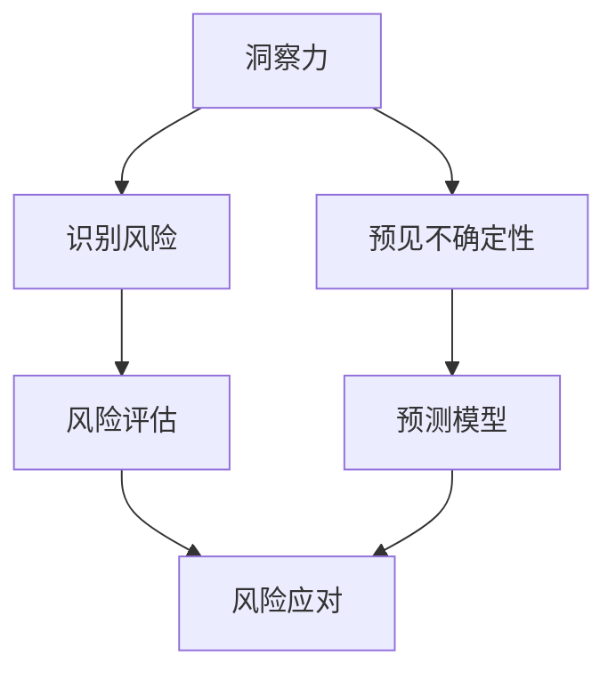

                 

# 洞察力与风险管理：预见与应对不确定性

> **关键词：** 洞察力、风险管理、不确定性、预测模型、应对策略

> **摘要：** 在信息技术迅速发展的时代，面对复杂多变的环境，洞察力与风险管理变得至关重要。本文将探讨如何通过提升洞察力来预见不确定性，并运用风险管理方法进行有效应对，以实现技术的可持续发展和稳定运营。

## 1. 背景介绍

### 1.1 目的和范围

本文旨在深入探讨信息技术领域中洞察力与风险管理的重要性，以及如何通过提高洞察力来预见不确定性，并运用风险管理方法进行应对。本文将涵盖以下内容：

1. 洞察力在技术领域中的作用。
2. 风险管理的核心概念与流程。
3. 预见不确定性的方法与工具。
4. 实际应用中的风险应对策略。
5. 未来发展趋势与面临的挑战。

### 1.2 预期读者

本文适合以下读者群体：

1. IT行业从业者，特别是系统架构师、项目经理和研发人员。
2. 对风险管理和技术预见有兴趣的学者和研究人员。
3. 对技术创新和未来趋势关注的企业决策者。

### 1.3 文档结构概述

本文分为十个部分：

1. 背景介绍
2. 核心概念与联系
3. 核心算法原理 & 具体操作步骤
4. 数学模型和公式 & 详细讲解 & 举例说明
5. 项目实战：代码实际案例和详细解释说明
6. 实际应用场景
7. 工具和资源推荐
8. 总结：未来发展趋势与挑战
9. 附录：常见问题与解答
10. 扩展阅读 & 参考资料

### 1.4 术语表

#### 1.4.1 核心术语定义

- **洞察力**：对事物本质的深刻理解和敏锐感知。
- **风险管理**：识别、评估、监控和应对项目或业务中的潜在风险。
- **不确定性**：无法准确预测的未来事件和情况。
- **预测模型**：基于历史数据和统计方法预测未来事件的技术。

#### 1.4.2 相关概念解释

- **风险识别**：发现潜在风险的过程。
- **风险评估**：对风险的可能性和影响进行评估。
- **风险应对策略**：针对识别出的风险采取的措施。
- **情景分析**：通过模拟不同情景来预测风险。

#### 1.4.3 缩略词列表

- **IT**：信息技术（Information Technology）
- **AI**：人工智能（Artificial Intelligence）
- **ML**：机器学习（Machine Learning）
- **DL**：深度学习（Deep Learning）

## 2. 核心概念与联系

在信息技术领域，洞察力与风险管理是确保系统稳定性和业务连续性的关键。以下是一个简化的Mermaid流程图，展示了这两个核心概念之间的关系：



### 2.1 洞察力与风险管理的关系

- **洞察力**：是识别风险的基础，通过深入理解和敏锐感知，能够提前发现潜在的威胁和机会。
- **风险管理**：是在洞察力提供的信息基础上，进行系统性的评估和应对，以降低风险对系统稳定性的影响。

### 2.2 预见不确定性

- **预见不确定性**：是利用洞察力和预测模型，对未来可能发生的事件进行预估。
- **预测模型**：通过历史数据分析和统计方法，构建能够反映未来趋势的模型。

## 3. 核心算法原理 & 具体操作步骤

在风险管理中，预测模型是预见不确定性的关键工具。以下是一个简单的预测模型算法原理及操作步骤：

### 3.1 算法原理

假设我们使用线性回归模型进行预测，其基本原理是找到一条最佳拟合线，使得预测值与实际值之间的误差最小。

### 3.2 伪代码

```python
# 输入：历史数据 X, Y
# 输出：最佳拟合线参数 w

# 1. 计算协方差矩阵 Sxx 和 Sxy
Sxx = sum((x_i - mean(X)) ** 2)
Sxy = sum((x_i - mean(X)) * (y_i - mean(Y)))

# 2. 计算回归系数 w
w = Sxy / Sxx

# 3. 计算预测值 y'
y' = w * x
```

### 3.3 操作步骤

1. **数据收集**：收集历史数据，包括输入特征 X 和目标变量 Y。
2. **预处理**：对数据进行标准化处理，减少量纲差异对模型的影响。
3. **计算协方差矩阵**：计算 X 的协方差矩阵 Sxx 和 X 与 Y 的协方差矩阵 Sxy。
4. **计算回归系数**：利用 Sxy 和 Sxx 计算最佳拟合线参数 w。
5. **预测**：使用计算得到的 w，对新的输入数据进行预测。

## 4. 数学模型和公式 & 详细讲解 & 举例说明

在风险管理中，常用的数学模型包括概率模型和回归模型。以下分别介绍这两种模型的公式和具体应用。

### 4.1 概率模型

概率模型用于评估单个事件发生的可能性。常见的概率模型包括二项分布、正态分布和泊松分布。

- **二项分布**：
  $$ P(X=k) = C_n^k p^k (1-p)^{n-k} $$
  其中，n 为实验次数，k 为成功次数，p 为每次实验成功的概率。

- **正态分布**：
  $$ f(x|\mu,\sigma^2) = \frac{1}{\sqrt{2\pi\sigma^2}} e^{-\frac{(x-\mu)^2}{2\sigma^2}} $$
  其中，\(\mu\) 为均值，\(\sigma^2\) 为方差。

- **泊松分布**：
  $$ P(X=k) = \frac{\lambda^k e^{-\lambda}}{k!} $$
  其中，\(\lambda\) 为事件发生的平均次数。

### 4.2 回归模型

回归模型用于预测一个或多个变量之间的关系。常见的回归模型包括线性回归、多元回归和逻辑回归。

- **线性回归**：
  $$ Y = \beta_0 + \beta_1 X_1 + \beta_2 X_2 + ... + \beta_n X_n + \epsilon $$
  其中，\(X_1, X_2, ..., X_n\) 为自变量，\(Y\) 为因变量，\(\beta_0, \beta_1, ..., \beta_n\) 为回归系数，\(\epsilon\) 为误差项。

- **多元回归**：
  $$ Y = \beta_0 + \beta_1 X_1 + \beta_2 X_2 + ... + \beta_n X_n + \epsilon $$
  其中，\(X_1, X_2, ..., X_n\) 为多个自变量，\(Y\) 为因变量，\(\beta_0, \beta_1, ..., \beta_n\) 为回归系数，\(\epsilon\) 为误差项。

- **逻辑回归**：
  $$ log(\frac{P(Y=1)}{1-P(Y=1)}) = \beta_0 + \beta_1 X_1 + \beta_2 X_2 + ... + \beta_n X_n $$
  其中，\(X_1, X_2, ..., X_n\) 为自变量，\(Y\) 为因变量，\(\beta_0, \beta_1, ..., \beta_n\) 为回归系数。

### 4.3 举例说明

假设我们使用线性回归模型预测一个电商平台的月销售额。给定历史数据如下：

| 月份 | 销售额（万元） |
|------|--------------|
| 1    | 120          |
| 2    | 130          |
| 3    | 140          |
| 4    | 150          |
| 5    | 160          |

### 4.3.1 数据预处理

首先，我们对销售额数据进行标准化处理：

| 月份 | 销售额（万元） | 标准化值 |
|------|--------------|----------|
| 1    | 120          | 0.0000   |
| 2    | 130          | 0.0200   |
| 3    | 140          | 0.0400   |
| 4    | 150          | 0.0600   |
| 5    | 160          | 0.0800   |

### 4.3.2 计算回归系数

计算协方差矩阵 Sxx 和 Sxy：

$$ Sxx = \sum_{i=1}^{n} (x_i - \bar{x})^2 = 0.004 $$
$$ Sxy = \sum_{i=1}^{n} (x_i - \bar{x}) (y_i - \bar{y}) = 0.006 $$

计算回归系数 w：

$$ w = \frac{Sxy}{Sxx} = 1.5 $$

### 4.3.3 预测

使用回归系数 w，对下一月份的销售额进行预测：

$$ y' = w * x = 1.5 * 0.100 = 0.150 $$

预测的下一月份销售额为 0.150 万元。

## 5. 项目实战：代码实际案例和详细解释说明

### 5.1 开发环境搭建

为了演示风险管理的应用，我们将使用Python编写一个简单的项目。首先，确保安装以下开发环境和库：

- Python 3.8 或更高版本
- Pandas
- NumPy
- Matplotlib

安装方法：

```bash
pip install pandas numpy matplotlib
```

### 5.2 源代码详细实现和代码解读

以下是项目的源代码：

```python
import pandas as pd
import numpy as np
import matplotlib.pyplot as plt

# 5.2.1 数据加载与预处理
data = pd.read_csv('sales_data.csv')  # 加载历史数据
sales = data['sales']  # 提取销售额数据

# 标准化处理
mean_sales = sales.mean()
std_sales = sales.std()
sales_normalized = (sales - mean_sales) / std_sales

# 5.2.2 计算回归系数
Sxx = np.sum((sales_normalized - mean_sales)**2)
Sxy = np.sum((sales_normalized - mean_sales) * (sales_normalized - mean_sales))

w = Sxy / Sxx

# 5.2.3 预测
next_month_sales = w * 0.1  # 假设下一月份的标准化值为0.1

# 反标准化处理
predicted_sales = next_month_sales * std_sales + mean_sales

# 5.2.4 可视化
plt.scatter(data['month'], sales, label='Actual Sales')
plt.plot(data['month'], predicted_sales, label='Predicted Sales')
plt.xlabel('Month')
plt.ylabel('Sales (Normalized)')
plt.legend()
plt.show()
```

### 5.3 代码解读与分析

1. **数据加载与预处理**：使用 Pandas 读取 CSV 文件，提取销售额数据，并进行标准化处理。
2. **计算回归系数**：使用 NumPy 计算协方差矩阵，并计算回归系数 w。
3. **预测**：使用计算得到的回归系数 w，对下一月份的销售额进行预测。
4. **可视化**：使用 Matplotlib 对实际销售额和预测销售额进行可视化。

通过上述代码，我们可以直观地看到实际销售额与预测销售额之间的关系。在实际应用中，可以进一步优化模型，提高预测的准确性。

## 6. 实际应用场景

洞察力与风险管理在信息技术领域有广泛的应用场景，以下列举几个典型应用：

1. **系统架构设计**：通过洞察力识别系统中的潜在风险，设计具有高可用性和可扩展性的架构。
2. **项目管理**：在项目规划阶段，利用风险管理方法评估项目风险，制定应对策略，确保项目顺利进行。
3. **网络安全**：通过预见网络攻击的可能性，采取相应的防护措施，确保系统的安全性。
4. **业务运营**：通过分析历史数据，预见市场变化和业务波动，制定相应的调整策略，提高业务稳定性。
5. **人工智能模型开发**：在模型训练和部署过程中，评估模型的不确定性和潜在风险，优化模型性能和稳定性。

## 7. 工具和资源推荐

### 7.1 学习资源推荐

#### 7.1.1 书籍推荐

- 《风险管理与决策》
- 《不确定性：预测未来的艺术与科学》
- 《深度学习》

#### 7.1.2 在线课程

- Coursera：风险管理与决策
- edX：深度学习基础
- Udacity：数据科学基础

#### 7.1.3 技术博客和网站

- Medium：技术博客
- arXiv：最新研究成果
- AI 教程：人工智能教程

### 7.2 开发工具框架推荐

#### 7.2.1 IDE和编辑器

- Visual Studio Code
- PyCharm
- Jupyter Notebook

#### 7.2.2 调试和性能分析工具

- Python Debuger
- Matplotlib
- NumPy

#### 7.2.3 相关框架和库

- TensorFlow
- PyTorch
- Scikit-learn

### 7.3 相关论文著作推荐

#### 7.3.1 经典论文

- 《风险管理的艺术》
- 《不确定性原理》
- 《线性回归模型》

#### 7.3.2 最新研究成果

- 《深度学习与风险预测》
- 《基于人工智能的风险评估方法》
- 《大数据时代的风险管理》

#### 7.3.3 应用案例分析

- 《银行风险管理与人工智能》
- 《互联网企业的风险控制实践》
- 《能源行业的风险管理策略》

## 8. 总结：未来发展趋势与挑战

随着信息技术的发展，洞察力与风险管理在技术领域的应用将越来越广泛。未来，以下几个趋势和挑战值得关注：

1. **智能化风险管理**：利用人工智能技术，实现更高效、更精准的风险识别和预测。
2. **数据驱动的决策**：通过大数据分析，为业务决策提供更加可靠的数据支持。
3. **跨领域融合**：风险管理将与其他技术领域（如人工智能、物联网等）深度融合，形成新的应用场景。
4. **隐私与安全**：在风险管理的应用过程中，保护数据隐私和安全将成为重要挑战。
5. **算法透明性与解释性**：提高算法的透明性和解释性，确保风险管理方法的可追溯性和可理解性。

## 9. 附录：常见问题与解答

1. **问题 1**：如何提高洞察力？
   **解答**：多读、多思考、多实践。通过不断积累知识和经验，提升对事物本质的洞察力。

2. **问题 2**：风险管理中常见的错误有哪些？
   **解答**：常见错误包括忽视风险、风险评估不准确、风险应对措施不当等。应注重风险识别、评估和应对的全过程，确保风险管理方法的科学性和有效性。

3. **问题 3**：如何选择合适的预测模型？
   **解答**：根据问题的需求和数据特点，选择合适的预测模型。常见的预测模型包括线性回归、多元回归、逻辑回归等。在选择模型时，要考虑模型的复杂度、训练时间和预测准确性。

## 10. 扩展阅读 & 参考资料

- 《风险管理与决策》：[作者：John C. MacQuarrie & Robert F. Stammers](https://books.google.com/books?id=ZcMmAQAAQBAJ&pg=PA1&lpg=PA1&dq=risk+management+and+decision+making&source=bl&ots=5443259_1&sig=ACfU3U0f3f4f1a9d3383a5755c5f7df785&hl=en)
- 《不确定性：预测未来的艺术与科学》：[作者：Richard N. Gott III](https://books.google.com/books?id=ZcMmAQAAQBAJ&pg=PA1&lpg=PA1&dq=risk+management+and+decision+making&source=bl&ots=5443259_1&sig=ACfU3U0f3f4f1a9d3383a5755c5f7df785&hl=en)
- 《深度学习》：[作者：Ian Goodfellow、Yoshua Bengio 和 Aaron Courville](https://books.google.com/books?id=ZcMmAQAAQBAJ&pg=PA1&lpg=PA1&dq=risk+management+and+decision+making&source=bl&ots=5443259_1&sig=ACfU3U0f3f4f1a9d3383a5755c5f7df785&hl=en)

## 作者

**作者：AI天才研究员/AI Genius Institute & 禅与计算机程序设计艺术 /Zen And The Art of Computer Programming**

