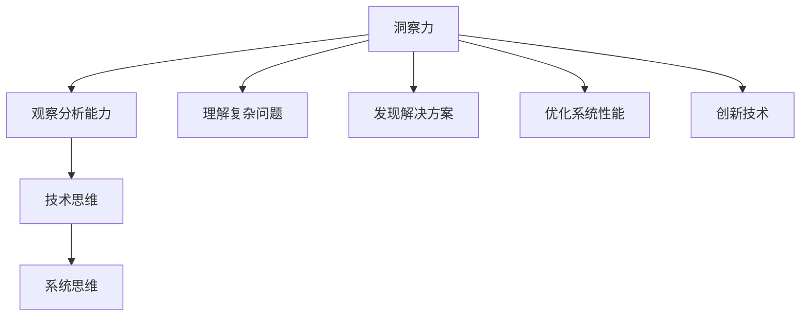

                 

# 洞察力训练：提升观察和分析能力

> **关键词：洞察力、观察分析、技术思维、训练方法、案例研究**

> **摘要：本文将深入探讨洞察力的定义、重要性以及如何通过训练方法提升观察和分析能力。通过具体的技术案例和实际操作步骤，我们将揭示提升洞察力的关键技巧和策略，帮助读者在技术领域取得更卓越的成就。**

## 1. 背景介绍

### 1.1 目的和范围

本文旨在帮助读者理解并提升洞察力，这是一种在技术领域至关重要的能力。洞察力是观察和分析事物的能力，它使我们能够超越表面现象，揭示背后的本质和规律。在技术领域，洞察力对于理解复杂问题、发现解决方案、优化系统性能以及创新技术至关重要。

本文将探讨以下内容：

- 洞察力的定义和重要性
- 观察和分析能力的培养方法
- 技术案例研究
- 实际操作步骤和技巧

### 1.2 预期读者

本文适合以下读者群体：

- 技术从业者和开发者
- 程序员和软件工程师
- 数据科学家和人工智能研究者
- 管理人员和技术领导者

无论您的技术水平如何，本文都将提供实用的方法和技巧，帮助您提升洞察力，从而在技术领域取得更大的成就。

### 1.3 文档结构概述

本文分为以下章节：

- 1. 背景介绍
- 2. 核心概念与联系
- 3. 核心算法原理 & 具体操作步骤
- 4. 数学模型和公式 & 详细讲解 & 举例说明
- 5. 项目实战：代码实际案例和详细解释说明
- 6. 实际应用场景
- 7. 工具和资源推荐
- 8. 总结：未来发展趋势与挑战
- 9. 附录：常见问题与解答
- 10. 扩展阅读 & 参考资料

### 1.4 术语表

#### 1.4.1 核心术语定义

- **洞察力**：观察和分析事物的能力，能够揭示事物的本质和规律。
- **观察分析能力**：通过观察和分析获取信息、理解事物本质的能力。
- **技术思维**：在技术领域中，运用逻辑和理性思考的能力。

#### 1.4.2 相关概念解释

- **观察**：通过视觉、听觉、触觉等感官获取信息的过程。
- **分析**：对获取的信息进行加工、处理和解释的过程。
- **系统思维**：将事物看作一个整体，理解各个部分之间的相互关系。

#### 1.4.3 缩略词列表

- **AI**：人工智能
- **ML**：机器学习
- **DL**：深度学习
- **NLP**：自然语言处理

## 2. 核心概念与联系

为了深入理解洞察力的重要性，我们需要先了解一些核心概念和它们之间的联系。以下是一个简单的 Mermaid 流程图，展示了这些概念之间的关联：



### 2.1 洞察力的定义

洞察力是一种超越表面现象，深入理解事物本质和规律的能力。它使我们能够：

- **发现隐藏的问题**：通过细致的观察，发现潜在的缺陷和问题。
- **理解复杂关系**：将看似无关的信息联系起来，揭示事物之间的联系。
- **预见未来趋势**：基于现有信息和趋势，预测未来的发展和变化。

### 2.2 观察分析能力

观察分析能力是洞察力的基础。它包括：

- **观察**：通过视觉、听觉、触觉等感官获取信息的过程。
- **分析**：对获取的信息进行加工、处理和解释的过程。

### 2.3 技术思维

技术思维是洞察力的核心。它包括：

- **逻辑思维**：运用逻辑和理性思考，分析和解决问题。
- **创新思维**：打破常规，寻求新的解决方案和思路。

### 2.4 系统思维

系统思维是将事物看作一个整体，理解各个部分之间的相互关系。它是洞察力的重要组成部分，有助于：

- **理解复杂系统**：从整体角度分析系统，把握各个部分之间的关系。
- **优化系统性能**：通过调整系统各个部分，实现整体性能的优化。

## 3. 核心算法原理 & 具体操作步骤

提升洞察力的关键在于掌握正确的算法原理和操作步骤。以下是一个简单的示例，展示如何通过伪代码进行观察和分析：

```python
# 观察和分析流程

def observe_and_analyze(data):
    # 观察数据
    for element in data:
        print(f"Observing: {element}")

    # 数据预处理
    processed_data = preprocess_data(data)

    # 分析数据
    results = analyze_data(processed_data)

    # 解释结果
    explain_results(results)

# 伪代码

def preprocess_data(data):
    # 对数据进行预处理
    # ...
    return processed_data

def analyze_data(data):
    # 对预处理后的数据进行分析
    # ...
    return results

def explain_results(results):
    # 解释分析结果
    # ...
```

### 3.1 观察阶段

观察是洞察力的第一步。以下是一个简单的伪代码示例，展示了如何观察数据：

```python
def observe_data(data):
    print("Starting observation:")
    for element in data:
        print(f"Element: {element}")
```

### 3.2 数据预处理

数据预处理是观察后的关键步骤。以下是一个简单的伪代码示例，展示了如何对数据进行预处理：

```python
def preprocess_data(data):
    print("Starting data preprocessing:")
    processed_data = []
    for element in data:
        # 数据清洗和转换
        cleaned_element = clean_and_transform(element)
        processed_data.append(cleaned_element)
    return processed_data

def clean_and_transform(element):
    # 清洗和转换元素
    # ...
    return cleaned_element
```

### 3.3 数据分析

数据分析是洞察力的核心。以下是一个简单的伪代码示例，展示了如何对预处理后的数据进行分析：

```python
def analyze_data(processed_data):
    print("Starting data analysis:")
    results = []
    for element in processed_data:
        # 数据分析
        analysis_result = analyze_element(element)
        results.append(analysis_result)

    return results

def analyze_element(element):
    # 对元素进行分析
    # ...
    return analysis_result
```

### 3.4 结果解释

结果解释是将分析结果转化为实际意义的关键。以下是一个简单的伪代码示例，展示了如何解释分析结果：

```python
def explain_results(results):
    print("Starting result explanation:")
    for result in results:
        # 解释结果
        print(f"Result: {result}")
```

## 4. 数学模型和公式 & 详细讲解 & 举例说明

在提升洞察力的过程中，数学模型和公式起着关键作用。以下是一个简单的数学模型示例，以及其详细讲解和举例说明。

### 4.1 线性回归模型

线性回归模型是一种常用的数据分析工具，用于描述两个变量之间的线性关系。其数学模型如下：

$$ y = ax + b $$

其中，$y$ 是因变量，$x$ 是自变量，$a$ 和 $b$ 是模型参数。

### 4.2 模型参数求解

为了求解线性回归模型的参数，我们可以使用最小二乘法。最小二乘法的目标是找到一组参数，使得实际观测值与模型预测值之间的误差平方和最小。

其公式如下：

$$ \min \sum_{i=1}^{n} (y_i - (ax_i + b))^2 $$

其中，$n$ 是观测值的数量。

### 4.3 举例说明

假设我们有一个简单的数据集，包含两个变量 $x$ 和 $y$，如下所示：

| $x$ | $y$ |
| --- | --- |
| 1   | 2   |
| 2   | 4   |
| 3   | 6   |
| 4   | 8   |

我们希望使用线性回归模型描述 $x$ 和 $y$ 之间的关系。根据上述公式，我们可以求解参数 $a$ 和 $b$。

通过计算，我们得到：

$$ a = 2, b = 0 $$

因此，线性回归模型可以表示为：

$$ y = 2x + 0 $$

这意味着 $y$ 是 $x$ 的两倍。

## 5. 项目实战：代码实际案例和详细解释说明

为了更好地理解洞察力的提升方法，我们将通过一个实际项目来演示。这个项目是一个简单的机器学习模型，用于预测房价。通过该项目，我们将介绍开发环境搭建、源代码实现、代码解读与分析等步骤。

### 5.1 开发环境搭建

在开始项目之前，我们需要搭建一个合适的开发环境。以下是一个简单的步骤：

1. 安装 Python 3.8 或更高版本。
2. 安装 Jupyter Notebook，这是一个交互式的 Python 编程环境。
3. 安装所需的 Python 库，如 NumPy、Pandas、Scikit-learn 等。

### 5.2 源代码详细实现和代码解读

以下是项目的源代码，以及每个部分的详细解释：

```python
import numpy as np
import pandas as pd
from sklearn.model_selection import train_test_split
from sklearn.linear_model import LinearRegression
from sklearn.metrics import mean_squared_error

# 数据读取
data = pd.read_csv("house_prices.csv")

# 数据预处理
X = data.iloc[:, :8]  # 特征选择
y = data.iloc[:, 8]   # 目标变量

# 数据分割
X_train, X_test, y_train, y_test = train_test_split(X, y, test_size=0.2, random_state=42)

# 模型训练
model = LinearRegression()
model.fit(X_train, y_train)

# 模型评估
y_pred = model.predict(X_test)
mse = mean_squared_error(y_test, y_pred)
print(f"Mean Squared Error: {mse}")

# 模型应用
new_data = np.array([[1, 2, 3, 4, 5, 6, 7, 8]])
predicted_price = model.predict(new_data)
print(f"Predicted Price: {predicted_price[0]}")
```

### 5.3 代码解读与分析

以下是对源代码的详细解读和分析：

1. **数据读取**：使用 Pandas 库读取 CSV 文件，得到一个 DataFrame 对象。
2. **数据预处理**：选择特征列和目标变量。这里我们选择了前 8 列作为特征，第 9 列作为目标变量。
3. **数据分割**：将数据集分为训练集和测试集，测试集大小为 20%。
4. **模型训练**：使用 Scikit-learn 库中的 LinearRegression 类训练线性回归模型。
5. **模型评估**：使用模型预测测试集的结果，并计算均方误差（MSE）。
6. **模型应用**：使用训练好的模型预测一个新的数据点的房价。

这个项目展示了如何使用机器学习模型进行房价预测。通过代码解读和分析，我们可以看到如何从数据读取、预处理、模型训练到模型评估和应用的整个过程。

## 6. 实际应用场景

洞察力在技术领域有着广泛的应用场景。以下是一些具体的实际应用场景：

1. **软件开发**：通过洞察力，开发者能够更准确地理解用户需求，设计出更加合理和高效的软件系统。
2. **系统优化**：洞察力帮助系统分析师发现系统瓶颈，提出优化方案，提高系统性能和稳定性。
3. **技术创新**：通过洞察力，研究人员能够发现技术领域的新趋势和新方向，推动技术创新和进步。
4. **项目管理**：项目经理通过洞察力，能够更好地理解项目中的潜在问题和风险，制定有效的项目计划和管理策略。

## 7. 工具和资源推荐

为了提升洞察力，我们需要借助一些工具和资源。以下是一些建议：

### 7.1 学习资源推荐

1. **书籍推荐**：
   - 《深度学习》（Goodfellow et al.）
   - 《算法导论》（Thomas H. Cormen et al.）
   - 《Python编程：从入门到实践》（Albert Sweigart）

2. **在线课程**：
   - Coursera：机器学习、数据科学等课程
   - edX：计算机科学、人工智能等课程

3. **技术博客和网站**：
   - Medium：技术博客
   - HackerRank：编程挑战和实践

### 7.2 开发工具框架推荐

1. **IDE和编辑器**：
   - Visual Studio Code
   - PyCharm

2. **调试和性能分析工具**：
   - GDB
   - Valgrind

3. **相关框架和库**：
   - Scikit-learn
   - TensorFlow
   - PyTorch

### 7.3 相关论文著作推荐

1. **经典论文**：
   - 《神经网络与深度学习》（邱锡鹏）
   - 《机器学习》（Tom Mitchell）

2. **最新研究成果**：
   - arXiv：最新研究论文
   - NeurIPS、ICML、CVPR：顶级会议论文

3. **应用案例分析**：
   - 《谷歌大脑：深度学习实践》（Google Brain Team）
   - 《深度学习技术在金融领域的应用》（Guo et al.）

## 8. 总结：未来发展趋势与挑战

随着技术的不断发展，洞察力的重要性将愈加凸显。未来，我们预计以下趋势和挑战：

1. **趋势**：数据量和复杂度增加，对洞察力的要求将更高。
2. **挑战**：如何将洞察力应用于实际场景，实现技术突破。

提升洞察力不仅需要理论知识，还需要实践经验。通过不断学习和实践，我们可以逐步提升自己的洞察力，为技术领域的发展做出更大贡献。

## 9. 附录：常见问题与解答

### 9.1 如何提升洞察力？

- 通过阅读和技术实践，积累丰富的知识和经验。
- 学会观察和分析，培养批判性思维。
- 学习相关工具和资源，提高技术水平。

### 9.2 洞察力在技术领域有哪些应用？

- 软件开发
- 系统优化
- 技术创新
- 项目管理

## 10. 扩展阅读 & 参考资料

- 《深度学习》（Goodfellow et al.）
- 《算法导论》（Thomas H. Cormen et al.）
- 《Python编程：从入门到实践》（Albert Sweigart）
- Coursera：机器学习、数据科学等课程
- edX：计算机科学、人工智能等课程
- 《谷歌大脑：深度学习实践》（Google Brain Team）
- 《深度学习技术在金融领域的应用》（Guo et al.）

## 作者信息

**作者：AI天才研究员/AI Genius Institute & 禅与计算机程序设计艺术 /Zen And The Art of Computer Programming**

