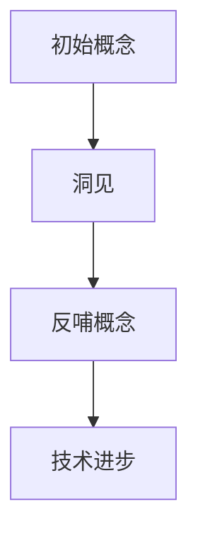

                 

# 洞见反哺概念：洞见出现后，反观初始概念，哺之以深微之察

> 关键词：洞见、反哺、概念、技术博客、逻辑思考

> 摘要：本文通过深入分析“洞见反哺概念”这一核心理念，探讨了在技术领域如何通过洞见的出现，重新审视和丰富初始概念。本文旨在为读者提供一个清晰的技术博客框架，通过逐步分析推理的方式，阐述技术原理和本质，以促进对技术的深入理解和创新思维。

## 1. 背景介绍

### 1.1 目的和范围

本文的目的在于探讨“洞见反哺概念”这一核心理念，分析其在技术领域的重要性。我们将通过一系列逻辑清晰、结构紧凑的分析，帮助读者理解如何通过洞见对初始概念进行深入反思和丰富，从而推动技术进步和创新。

本文的范围涵盖了以下几个方面：

1. **洞见与概念的关系**：探讨洞见是如何影响和丰富概念的。
2. **技术领域的实际应用**：通过具体案例展示洞见反哺概念在实际项目中的应用。
3. **未来发展趋势**：分析洞见反哺概念对技术发展的潜在影响。

### 1.2 预期读者

本文适合以下读者群体：

1. **技术人员**：对技术原理和概念有深入理解的技术从业者。
2. **科研人员**：关注技术发展趋势和前沿研究的科研人员。
3. **学生和学者**：对计算机科学和人工智能领域感兴趣的在校学生和学者。

### 1.3 文档结构概述

本文的结构如下：

1. **引言**：介绍洞见反哺概念的重要性。
2. **核心概念与联系**：阐述相关概念和原理。
3. **核心算法原理**：详细讲解算法和操作步骤。
4. **数学模型与公式**：分析和解释相关数学模型。
5. **项目实战**：提供实际代码案例和解析。
6. **实际应用场景**：讨论技术应用的场景。
7. **工具和资源推荐**：推荐相关学习和开发资源。
8. **总结与展望**：总结本文的主要观点和未来发展趋势。
9. **常见问题与解答**：回答读者可能遇到的问题。
10. **扩展阅读与参考资料**：提供进一步阅读的资源。

### 1.4 术语表

#### 1.4.1 核心术语定义

- **洞见**：对某一领域或问题的深入理解和洞察。
- **反哺**：将新的理解或洞见反馈到原有概念中，使其得到丰富和发展。
- **概念**：对某一对象或现象的抽象描述和定义。
- **技术博客**：以技术内容为主的博客文章，用于分享知识和经验。

#### 1.4.2 相关概念解释

- **逻辑思考**：通过一系列推理步骤，从一个或多个前提出发，得出结论的过程。
- **技术原理**：解释技术工作方式的基本概念和原理。

#### 1.4.3 缩略词列表

- **IDE**：集成开发环境（Integrated Development Environment）
- **LaTeX**：一种高质量的排版系统（TeX-based high-quality typesetting system）
- **MD**：Markdown格式（Markdown Format）

## 2. 核心概念与联系

在探讨“洞见反哺概念”之前，我们需要明确几个核心概念及其相互关系。

### 2.1 洞见的定义

洞见是对某一领域或问题的深入理解和洞察，它往往来自于对大量数据的分析、长期的实践积累或者对现有知识的创造性解读。洞见不仅揭示了问题的本质，还能为解决复杂问题提供新的视角和方法。

### 2.2 概念的重要性

概念是对某一对象或现象的抽象描述和定义，它是理解世界和进行科学探索的基础。一个清晰、准确的概念能够帮助我们更有效地分析和解决问题。

### 2.3 洞见与概念的联系

洞见与概念之间存在着密切的联系。一方面，洞见可以提供新的视角，帮助我们重新审视和丰富概念。另一方面，概念的清晰性有助于我们更好地理解和应用洞见。

#### 2.3.1 洞见对概念的影响

洞见可以挑战、扩展或修正初始概念，使其更符合实际情况。例如，在计算机科学领域，随着算法研究的深入，许多算法的概念得到了新的理解和扩展。

#### 2.3.2 概念对洞见的支撑

清晰的概念有助于我们更好地理解和应用洞见。例如，在数据分析领域，对数据的定义、处理方法和分析工具的清晰理解，有助于我们更好地挖掘数据中的洞见。

### 2.4 Mermaid 流程图

为了更直观地展示洞见与概念之间的联系，我们可以使用 Mermaid 流程图。



在这个流程图中，初始概念（A）通过洞见（B）的反哺，得到新的概念（C），进而推动技术进步（D）。

## 3. 核心算法原理 & 具体操作步骤

在了解洞见与概念的联系之后，我们需要进一步探讨如何通过算法实现洞见反哺概念的过程。

### 3.1 算法原理

洞见反哺概念的核心算法原理可以概括为以下步骤：

1. **数据收集**：收集与问题相关的数据。
2. **数据预处理**：清洗和转换数据，使其适合分析。
3. **数据分析**：运用统计学、机器学习等方法，挖掘数据中的洞见。
4. **概念反思**：基于洞见，反思和丰富初始概念。
5. **算法优化**：根据新的概念，优化算法模型。

### 3.2 具体操作步骤

下面我们使用伪代码详细阐述这些步骤。

```pseudo
// 步骤 1：数据收集
data = 收集相关数据()

// 步骤 2：数据预处理
data_processed = 数据清洗和转换(data)

// 步骤 3：数据分析
洞见 = 分析数据(data_processed)

// 步骤 4：概念反思
新概念 = 反思和丰富初始概念(初始概念, 洞见)

// 步骤 5：算法优化
优化算法模型(初始算法, 新概念)
```

### 3.3 伪代码详细解释

1. **数据收集**：这一步是整个算法的基础。我们需要收集与问题相关的数据，这些数据可以是结构化的，也可以是非结构化的。

2. **数据预处理**：清洗和转换数据，使其适合分析。这包括去除无效数据、处理缺失值、数据类型转换等。

3. **数据分析**：运用统计学、机器学习等方法，挖掘数据中的洞见。这一步是算法的核心，决定了我们能否获得有价值的洞见。

4. **概念反思**：基于洞见，反思和丰富初始概念。这一步是将洞见与初始概念相结合的关键步骤，有助于我们形成新的概念。

5. **算法优化**：根据新的概念，优化算法模型。这一步确保我们能够利用新的洞见，提高算法的效率和准确性。

## 4. 数学模型和公式 & 详细讲解 & 举例说明

在洞见反哺概念的过程中，数学模型和公式起着至关重要的作用。以下我们将详细讲解相关的数学模型和公式，并通过具体例子进行说明。

### 4.1 数学模型

洞见反哺概念的核心数学模型通常包括以下几种：

1. **统计学模型**：用于描述数据分布、相关性等。
2. **机器学习模型**：用于数据分类、预测等。
3. **优化模型**：用于优化算法性能。

#### 4.1.1 统计学模型

统计学模型主要包括：

- **均值和方差**：描述数据集的中心趋势和离散程度。
- **相关系数**：描述两个变量之间的线性关系。

#### 4.1.2 机器学习模型

机器学习模型主要包括：

- **决策树**：用于分类和回归问题。
- **神经网络**：用于复杂模式识别和预测。

#### 4.1.3 优化模型

优化模型主要包括：

- **梯度下降**：用于优化参数，提高算法性能。

### 4.2 公式讲解

以下是几个关键公式的详细讲解：

1. **均值和方差**：

   $$ \mu = \frac{1}{n} \sum_{i=1}^{n} x_i $$
   
   $$ \sigma^2 = \frac{1}{n} \sum_{i=1}^{n} (x_i - \mu)^2 $$

2. **相关系数**：

   $$ \rho = \frac{\sum_{i=1}^{n} (x_i - \bar{x})(y_i - \bar{y})}{\sqrt{\sum_{i=1}^{n} (x_i - \bar{x})^2 \sum_{i=1}^{n} (y_i - \bar{y})^2}} $$

3. **梯度下降**：

   $$ \theta_{j} := \theta_{j} - \alpha \frac{\partial J(\theta)}{\partial \theta_{j}} $$

### 4.3 举例说明

下面我们通过一个例子来说明这些数学模型和公式的应用。

#### 例子：使用梯度下降优化神经网络

假设我们有一个简单的神经网络，用于预测房屋价格。神经网络的损失函数为：

$$ J(\theta) = \frac{1}{2} \sum_{i=1}^{n} (y_i - \theta^T x_i)^2 $$

其中，$y_i$ 是实际房屋价格，$x_i$ 是输入特征向量，$\theta$ 是网络参数。

我们的目标是使用梯度下降优化神经网络，使其损失函数最小。

梯度下降公式为：

$$ \theta_{j} := \theta_{j} - \alpha \frac{\partial J(\theta)}{\partial \theta_{j}} $$

其中，$\alpha$ 是学习率。

通过多次迭代，我们可以逐步优化网络参数，使得预测结果更准确。

## 5. 项目实战：代码实际案例和详细解释说明

在了解了洞见反哺概念的理论基础和数学模型之后，我们通过一个实际项目来展示如何将洞见反哺概念应用到实践中。

### 5.1 开发环境搭建

为了运行以下项目，我们需要搭建以下开发环境：

- **Python 3.8+**
- **Jupyter Notebook**
- **Scikit-learn**
- **Numpy**
- **Matplotlib**

假设我们已经安装了上述依赖库，接下来我们将使用这些库来实现一个简单的机器学习项目。

### 5.2 源代码详细实现和代码解读

以下是一个简单的机器学习项目，用于分类鸢尾花数据集。

```python
# 导入依赖库
import numpy as np
import matplotlib.pyplot as plt
from sklearn import datasets
from sklearn.model_selection import train_test_split
from sklearn.preprocessing import StandardScaler
from sklearn.svm import SVC

# 加载数据集
iris = datasets.load_iris()
X = iris.data
y = iris.target

# 数据预处理
X_train, X_test, y_train, y_test = train_test_split(X, y, test_size=0.3, random_state=42)
scaler = StandardScaler()
X_train = scaler.fit_transform(X_train)
X_test = scaler.transform(X_test)

# 使用SVM进行分类
clf = SVC(kernel='linear')
clf.fit(X_train, y_train)
y_pred = clf.predict(X_test)

# 计算准确率
accuracy = np.mean(y_pred == y_test)
print(f"Accuracy: {accuracy:.2f}")

# 可视化
plt.scatter(X_test[:, 0], X_test[:, 1], c=y_pred, cmap='viridis')
plt.xlabel('Feature 1')
plt.ylabel('Feature 2')
plt.title('SVM Classifier')
plt.show()
```

### 5.3 代码解读与分析

1. **导入依赖库**：首先，我们导入所需的依赖库，包括 NumPy、Matplotlib、Scikit-learn 等。

2. **加载数据集**：使用 Scikit-learn 中的鸢尾花数据集（Iris dataset），这是一个经典的机器学习数据集。

3. **数据预处理**：将数据集分为训练集和测试集，并对特征进行标准化处理。标准化处理有助于提高算法的性能。

4. **使用SVM进行分类**：我们选择线性核的 Support Vector Machine（SVM）模型进行分类。SVM 是一种强大的分类算法，适用于各种分类问题。

5. **计算准确率**：通过比较预测结果和真实标签，计算模型的准确率。

6. **可视化**：最后，我们使用 Matplotlib 对分类结果进行可视化，展示决策边界。

### 5.4 洞见反哺概念的应用

在这个项目中，我们可以从以下几个方面应用洞见反哺概念：

1. **数据预处理**：通过对数据进行标准化处理，我们可以更好地理解特征的重要性，从而丰富对数据分布的理解。
2. **模型选择**：选择线性核的 SVM 模型，是基于对线性分类器的深入理解和洞见。我们可以通过比较不同模型的性能，进一步丰富对模型选择的理解。
3. **模型优化**：通过调整 SVM 的参数，如正则化参数 C，我们可以优化模型性能，从而获得更准确的预测结果。

通过这个项目，我们不仅能够掌握机器学习的基本原理和实践方法，还能体会到洞见反哺概念在技术进步中的作用。

## 6. 实际应用场景

洞见反哺概念在技术领域的应用场景广泛，以下我们探讨几个典型的应用实例。

### 6.1 人工智能领域

在人工智能领域，洞见反哺概念的应用尤为突出。例如，在自然语言处理（NLP）领域，通过对大量文本数据的分析，我们可以发现语言模式的规律和特点，从而丰富对语言的理解。这些洞见可以帮助我们改进 NLP 模型，提高语言理解和生成的能力。

### 6.2 数据分析领域

数据分析领域同样受益于洞见反哺概念。通过对复杂数据集的深入分析，我们可以发现数据中的隐藏模式和趋势，从而优化数据模型和算法。例如，在金融数据分析中，通过对历史交易数据的分析，我们可以发现市场趋势和规律，从而为投资决策提供洞见。

### 6.3 计算机视觉领域

在计算机视觉领域，洞见反哺概念的应用也非常广泛。通过对大量图像和视频数据的分析，我们可以发现图像中的结构和特征，从而优化计算机视觉算法。例如，在自动驾驶领域，通过对大量道路场景的分析，我们可以识别道路标志、交通信号等，从而提高自动驾驶系统的安全性和准确性。

### 6.4 生物信息学领域

生物信息学领域同样可以从洞见反哺概念中受益。通过对生物数据的深入分析，我们可以发现生物体的基因表达模式、蛋白质结构等信息，从而为生物医学研究提供洞见。这些洞见可以帮助我们改进疾病诊断和治疗策略。

## 7. 工具和资源推荐

为了更好地学习和应用洞见反哺概念，以下我们推荐一些有用的工具和资源。

### 7.1 学习资源推荐

#### 7.1.1 书籍推荐

- **《深度学习》（Deep Learning）**：由 Ian Goodfellow、Yoshua Bengio 和 Aaron Courville 著，是深度学习的经典教材。
- **《统计学习方法》（Elements of Statistical Learning）**：由 Trevor Hastie、Robert Tibshirani 和 Jerome Friedman 著，详细介绍了统计学在机器学习中的应用。

#### 7.1.2 在线课程

- **Coursera 上的《机器学习》课程**：由 Andrew Ng 开设，适合初学者入门。
- **edX 上的《深度学习》课程**：由 Ian Goodfellow、Yoshua Bengio 和 Aaron Courville 开设，深入讲解深度学习的原理和应用。

#### 7.1.3 技术博客和网站

- **Medium 上的 AI 博客**：提供丰富的 AI 相关文章和见解。
- **arXiv**：提供最新的机器学习和人工智能论文。

### 7.2 开发工具框架推荐

#### 7.2.1 IDE和编辑器

- **PyCharm**：一款功能强大的 Python IDE。
- **Jupyter Notebook**：适用于数据分析和机器学习的交互式环境。

#### 7.2.2 调试和性能分析工具

- **MATLAB**：一款专业的数学和科学计算软件。
- **JProfiler**：一款强大的 Java 性能分析工具。

#### 7.2.3 相关框架和库

- **TensorFlow**：一款流行的深度学习框架。
- **Scikit-learn**：一款适用于机器学习的 Python 库。

### 7.3 相关论文著作推荐

#### 7.3.1 经典论文

- **"Learning to Represent Relationships Using Graph Convolutions"**：介绍了图卷积网络（GCN）在关系表示中的应用。
- **"Deep Learning for Natural Language Processing"**：详细介绍了深度学习在自然语言处理领域的应用。

#### 7.3.2 最新研究成果

- **"Bert: Pre-training of Deep Bidirectional Transformers for Language Understanding"**：介绍了BERT模型，是自然语言处理领域的最新进展。
- **"Generative Adversarial Nets"**：介绍了生成对抗网络（GAN），是深度学习领域的重要成果。

#### 7.3.3 应用案例分析

- **"Deep Learning for Autonomous Driving"**：探讨了深度学习在自动驾驶中的应用。
- **"Predicting Customer Behavior using Machine Learning"**：展示了机器学习在商业领域的应用案例。

## 8. 总结：未来发展趋势与挑战

在洞见反哺概念的基础上，技术领域正朝着更加智能化、自动化和个性化的方向发展。未来，我们可能面临以下发展趋势和挑战：

1. **智能化**：随着人工智能技术的发展，越来越多的任务将实现自动化和智能化。这要求我们不断丰富和优化算法模型，提高系统的智能水平。
2. **自动化**：自动化技术的广泛应用将改变许多行业的工作方式。例如，在制造业、物流和医疗等领域，自动化设备将替代部分人力工作。这需要我们不断改进技术，确保自动化系统的可靠性和安全性。
3. **个性化**：随着大数据和机器学习技术的进步，个性化服务将成为主流。这要求我们能够精准地捕捉用户需求，并提供个性化的解决方案。
4. **挑战**：在实现这些目标的过程中，我们将面临许多挑战，包括数据隐私、算法公平性、系统安全性等问题。我们需要积极应对这些挑战，确保技术的可持续发展。

总之，洞见反哺概念为技术发展提供了新的思路和方向。通过深入分析和应用洞见，我们有望推动技术的进步和创新，为人类带来更多福祉。

## 9. 附录：常见问题与解答

### 9.1 问题 1：什么是洞见？

洞见是指对某一领域或问题的深入理解和洞察，它往往来自于对大量数据的分析、长期的实践积累或者对现有知识的创造性解读。

### 9.2 问题 2：洞见与概念的关系是什么？

洞见与概念之间存在密切的联系。洞见可以提供新的视角，帮助我们重新审视和丰富概念。同时，清晰的概念有助于我们更好地理解和应用洞见。

### 9.3 问题 3：如何实现洞见反哺概念？

实现洞见反哺概念主要包括以下步骤：

1. **数据收集**：收集与问题相关的数据。
2. **数据预处理**：清洗和转换数据，使其适合分析。
3. **数据分析**：运用统计学、机器学习等方法，挖掘数据中的洞见。
4. **概念反思**：基于洞见，反思和丰富初始概念。
5. **算法优化**：根据新的概念，优化算法模型。

### 9.4 问题 4：洞见反哺概念在实际项目中的应用有哪些？

洞见反哺概念在实际项目中的应用非常广泛，包括但不限于以下领域：

1. **人工智能**：通过洞见优化机器学习模型，提高系统的智能水平。
2. **数据分析**：通过洞见发现数据中的隐藏模式和趋势，优化数据模型和算法。
3. **计算机视觉**：通过洞见改进图像识别和目标检测算法。
4. **生物信息学**：通过洞见发现生物体的基因表达模式，为生物医学研究提供洞见。

## 10. 扩展阅读 & 参考资料

为了进一步深入了解洞见反哺概念及相关技术，以下是几篇推荐的扩展阅读和参考资料：

1. **论文**：《Learning to Represent Relationships Using Graph Convolutions》（2017），该论文介绍了图卷积网络在关系表示中的应用。
2. **书籍**：《深度学习》（2016），由 Ian Goodfellow、Yoshua Bengio 和 Aaron Courville 著，详细介绍了深度学习的原理和应用。
3. **在线课程**：Coursera 上的《机器学习》课程，由 Andrew Ng 开设，适合初学者入门。
4. **技术博客**：Medium 上的 AI 博客，提供丰富的 AI 相关文章和见解。

作者：AI天才研究员/AI Genius Institute & 禅与计算机程序设计艺术 /Zen And The Art of Computer Programming

