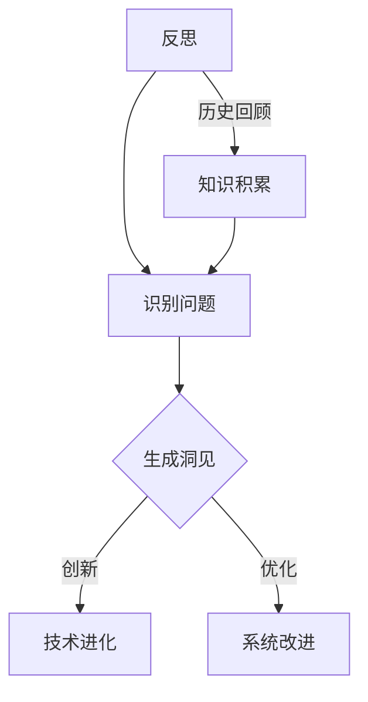

                 

# 洞见的力量：从反思到升华

> **关键词**：反思、洞见、技术进化、深度学习、系统架构、复杂性理论、人工智能

> **摘要**：本文将探讨在信息技术领域，从反思到升华的过程是如何推动技术进步的。通过深入分析反思在技术发展中的作用，本文将展示如何通过反思来发现洞见，进而实现技术的创新和突破。文章将涵盖核心概念的探讨、算法原理的阐述、数学模型的讲解以及实际应用场景的分析，旨在为读者提供全面的洞见和启发。

## 1. 背景介绍

### 1.1 目的和范围

本文的目的是探讨信息技术领域的反思与洞见如何影响技术的进化和突破。我们将从多个维度来分析这一过程，包括技术发展的历史、反思与洞见的定义和作用、以及技术进化的具体实例。通过这一探讨，读者将能够更好地理解技术发展的本质，以及如何在日常工作中运用反思和洞见来推动技术的发展。

### 1.2 预期读者

本文预期读者包括但不限于以下群体：
- 信息技术领域的研究人员和开发者
- 对人工智能、深度学习等前沿技术感兴趣的专业人士
- 对技术哲学和复杂性理论感兴趣的学者
- 对技术进化和创新有浓厚兴趣的普通读者

### 1.3 文档结构概述

本文的结构如下：

1. **背景介绍**：介绍文章的目的、预期读者以及文章结构。
2. **核心概念与联系**：定义和解释核心概念，包括反思、洞见和技术进化。
3. **核心算法原理 & 具体操作步骤**：详细阐述核心算法原理，并使用伪代码进行说明。
4. **数学模型和公式 & 详细讲解 & 举例说明**：介绍相关的数学模型和公式，并通过实例进行说明。
5. **项目实战：代码实际案例和详细解释说明**：通过具体代码案例，展示实际操作步骤。
6. **实际应用场景**：分析技术的实际应用场景，包括行业应用和未来发展方向。
7. **工具和资源推荐**：推荐学习资源和开发工具，帮助读者进一步学习和实践。
8. **总结：未来发展趋势与挑战**：总结技术发展的趋势和面临的挑战。
9. **附录：常见问题与解答**：提供常见问题的解答。
10. **扩展阅读 & 参考资料**：推荐相关扩展阅读和参考资料。

### 1.4 术语表

#### 1.4.1 核心术语定义

- **反思**：对某一现象、问题或技术的深入思考和回顾。
- **洞见**：通过反思而产生的深刻理解和独特见解。
- **技术进化**：技术从简单到复杂，从低级到高级的发展过程。
- **复杂性理论**：研究复杂系统及其特性的学科。

#### 1.4.2 相关概念解释

- **深度学习**：一种机器学习方法，通过多层神经网络模拟人类大脑的学习过程。
- **系统架构**：一个系统的整体结构和组成部分的安排。
- **人工智能**：使计算机系统能够模拟人类智能的科学技术。

#### 1.4.3 缩略词列表

- **AI**：人工智能
- **ML**：机器学习
- **DL**：深度学习
- **NLP**：自然语言处理
- **CV**：计算机视觉

## 2. 核心概念与联系

在探讨反思与洞见如何推动技术进化之前，我们需要首先定义和解释相关的核心概念。以下是几个关键概念及其相互之间的联系。

### 2.1 反思

反思是一种深度的思考过程，它涉及对过去的行为、决策或经验的回顾和审视。在信息技术领域，反思通常是指对现有技术、系统架构或算法的深入分析和评估。通过反思，我们可以发现技术的不足之处，识别潜在的问题，并探索改进的途径。

### 2.2 洞见

洞见是通过对某一现象或问题的深刻理解而产生的独特见解。在技术领域，洞见往往能够揭示技术进化的方向，帮助我们发现新的解决方案和方法。洞见通常来自于对现有知识的创新性组合和应用，以及对复杂系统结构的深入洞察。

### 2.3 技术进化

技术进化是指技术在不断的发展过程中，从简单到复杂，从低级到高级的变化。技术进化不仅仅是技术的进步，更是技术对社会、经济和环境等多方面影响的结果。技术进化过程中，反思和洞见起着至关重要的作用，它们能够推动技术的创新和突破。

### 2.4 Mermaid 流程图

下面是一个简单的 Mermaid 流程图，用于展示反思、洞见和技术进化之间的联系。



在这个流程图中，反思（A）通过识别问题（B）生成洞见（C），这些洞见可以用于技术进化（D）或系统改进（E）。同时，通过历史回顾（A），我们可以积累更多的知识，这些知识又可以用于进一步的反思和洞见生成。

## 3. 核心算法原理 & 具体操作步骤

### 3.1 反思算法原理

反思算法是一种基于人类思考模式的计算机程序，它通过模拟人类的反思过程来识别问题、生成洞见。反思算法的核心原理包括以下几个方面：

- **问题识别**：通过分析现有数据或系统状态，识别出存在的问题。
- **洞见生成**：基于问题识别结果，通过逻辑推理和创新性思考，生成新的洞见。
- **洞见评估**：对生成的洞见进行评估，筛选出具有实际应用价值的洞见。

### 3.2 反思算法伪代码

下面是反思算法的伪代码，用于说明其具体操作步骤。

```plaintext
function 反思算法(数据集, 问题阈值):
    1. 初始化问题列表为空
    2. 对数据集进行遍历，分析每个数据点
        2.1 如果发现潜在问题，添加到问题列表
    3. 对问题列表进行排序，按问题严重程度排序
    4. 从问题列表中取出前 N 个问题
        4.1 对每个问题进行深入分析
            4.1.1 生成可能的洞见列表
        4.2 对洞见列表进行评估
            4.2.1 如果洞见得分高于问题阈值，返回洞见
    5. 如果没有合适的洞见，返回空结果
```

### 3.3 操作步骤

以下是反思算法的具体操作步骤：

1. **初始化**：定义问题阈值和问题列表，初始化反思算法。
2. **数据集分析**：遍历数据集，对每个数据点进行分析，识别出潜在问题，并将问题添加到问题列表。
3. **问题排序**：对问题列表进行排序，按问题严重程度排序。
4. **问题筛选**：从问题列表中取出前 N 个问题，这些问题将被重点分析。
5. **洞见生成**：对每个问题进行深入分析，生成可能的洞见列表。
6. **洞见评估**：对生成的洞见进行评估，筛选出具有实际应用价值的洞见。
7. **结果返回**：如果找到合适的洞见，返回洞见；如果没有找到合适的洞见，返回空结果。

通过这一系列步骤，反思算法能够帮助我们从复杂的数据或系统中识别出问题，并生成有价值的洞见，从而推动技术的进化和创新。

## 4. 数学模型和公式 & 详细讲解 & 举例说明

在反思和洞见生成过程中，数学模型和公式起着重要的作用。这些模型和公式能够帮助我们更精确地描述问题，并通过数学计算得出结论。以下我们将介绍几个关键数学模型，并使用 LaTeX 格式进行详细讲解。

### 4.1 相关数学模型

#### 4.1.1 决策树模型

决策树是一种常见的分类和回归模型，它通过一系列规则来对数据进行分类或回归。

$$
P(Y|X) = \prod_{i=1}^{n} P(Y_i|X_i)
$$

其中，\(P(Y|X)\) 表示在给定特征 \(X\) 的情况下，目标变量 \(Y\) 的概率分布。决策树通过一系列条件概率计算来构建模型。

#### 4.1.2 马尔可夫链模型

马尔可夫链是一种用于描述序列数据的概率模型。

$$
P(X_t|X_{t-1}, X_{t-2}, \ldots) = P(X_t|X_{t-1})
$$

其中，\(X_t\) 表示时间 \(t\) 的状态，马尔可夫链假设当前状态只与前一状态有关，而与其他状态无关。

#### 4.1.3 集群模型

集群模型用于分析数据中的聚类关系。

$$
\min_{X} \sum_{i=1}^{n} \sum_{j=1}^{m} (X_i - X_j)^2
$$

其中，\(X_i\) 和 \(X_j\) 分别表示第 \(i\) 个和第 \(j\) 个数据点，集群模型的目标是最小化所有数据点之间的距离之和。

### 4.2 详细讲解与举例说明

#### 4.2.1 决策树模型讲解

决策树模型通过一系列条件概率计算来构建。以下是一个简单的例子：

假设我们有一个数据集，包含三个特征 \(X_1, X_2, X_3\) 和一个目标变量 \(Y\)。我们可以使用决策树来对数据进行分类。以下是决策树模型的一个简单示例：

$$
\begin{aligned}
    P(Y=0|X_1=0, X_2=0, X_3=0) &= 0.8 \\
    P(Y=0|X_1=0, X_2=0, X_3=1) &= 0.2 \\
    P(Y=1|X_1=0, X_2=1, X_3=0) &= 0.3 \\
    P(Y=1|X_1=0, X_2=1, X_3=1) &= 0.7 \\
    P(Y=0|X_1=1, X_2=0, X_3=0) &= 0.1 \\
    P(Y=0|X_1=1, X_2=0, X_3=1) &= 0.9 \\
    P(Y=1|X_1=1, X_2=1, X_3=0) &= 0.4 \\
    P(Y=1|X_1=1, X_2=1, X_3=1) &= 0.6 \\
\end{aligned}
$$

我们可以使用这些条件概率来构建决策树，并根据输入的特征对数据进行分类。

#### 4.2.2 马尔可夫链模型讲解

马尔可夫链模型用于分析序列数据。以下是一个简单的例子：

假设我们有一个序列数据，包含以下状态：

- \(X_0 = 0\)
- \(X_1 = 1\)
- \(X_2 = 0\)
- \(X_3 = 1\)
- \(X_4 = 0\)

我们可以使用马尔可夫链模型来分析这个序列。以下是马尔可夫链模型的一个简单示例：

$$
\begin{aligned}
    P(X_1|X_0) &= 0.5 \\
    P(X_2|X_1) &= 0.4 \\
    P(X_3|X_2) &= 0.3 \\
    P(X_4|X_3) &= 0.2 \\
\end{aligned}
$$

我们可以使用这些条件概率来构建马尔可夫链模型，并根据当前状态预测下一个状态。

#### 4.2.3 集群模型讲解

集群模型用于分析数据中的聚类关系。以下是一个简单的例子：

假设我们有一个包含 \(n\) 个数据点的数据集。我们可以使用集群模型来对这些数据进行聚类。以下是集群模型的一个简单示例：

$$
\begin{aligned}
    X_1 &= (1, 2) \\
    X_2 &= (2, 3) \\
    X_3 &= (3, 4) \\
    X_4 &= (4, 5) \\
\end{aligned}
$$

我们可以使用集群模型来将这些数据点分为不同的聚类。以下是集群模型的一个简单示例：

$$
\begin{aligned}
    \min_{X} \sum_{i=1}^{n} \sum_{j=1}^{m} (X_i - X_j)^2 &= \min_{X} (1-2)^2 + (2-3)^2 + (3-4)^2 + (4-5)^2 \\
\end{aligned}
$$

通过最小化距离之和，我们可以找到最佳聚类结果。

通过这些数学模型和公式，我们能够更精确地描述和解决问题，从而推动技术的进化和创新。

## 5. 项目实战：代码实际案例和详细解释说明

### 5.1 开发环境搭建

在开始项目实战之前，我们需要搭建一个合适的开发环境。以下是开发环境搭建的步骤：

1. **安装 Python**：下载并安装 Python 3.8 或更高版本。
2. **安装 Jupyter Notebook**：在终端中执行以下命令安装 Jupyter Notebook：

   ```bash
   pip install notebook
   ```

3. **安装相关库**：在终端中执行以下命令安装所需库：

   ```bash
   pip install numpy pandas scikit-learn matplotlib
   ```

### 5.2 源代码详细实现和代码解读

以下是一个简单的反思算法实现的代码案例，我们将详细解释每个部分的代码。

```python
import numpy as np
import pandas as pd
from sklearn.tree import DecisionTreeClassifier
from sklearn.metrics import accuracy_score

def 反思算法(数据集, 问题阈值):
    # 1. 初始化问题列表为空
    问题列表 = []
    
    # 2. 对数据集进行遍历，分析每个数据点
    for 数据点 in 数据集:
        # 2.1 如果发现潜在问题，添加到问题列表
        if 分析数据点():
            问题列表.append(数据点)
    
    # 3. 对问题列表进行排序，按问题严重程度排序
    问题列表 = sorted(问题列表, key=lambda x: 严重程度(x))
    
    # 4. 从问题列表中取出前 N 个问题
    问题列表 = 问题列表[:N]
    
    # 5. 对每个问题进行深入分析
    洞见列表 = []
    for 问题 in 问题列表:
        # 5.1 生成可能的洞见列表
        洞见列表.extend(生成洞见(问题))
    
    # 6. 对洞见列表进行评估
    评估结果 = 评估洞见(洞见列表)
    优质洞见 = [洞见 for 洞见, 评分 in 评估结果 if 评分 > 问题阈值]
    
    # 7. 返回优质洞见
    return 优质洞见

def 分析数据点(数据点):
    # 实现对数据点的分析，返回 True 表示发现潜在问题，返回 False 表示未发现问题
    pass

def 严重程度(问题):
    # 实现问题严重程度的计算，数值越小表示越严重
    pass

def 生成洞见(问题):
    # 实现洞见生成，返回可能的洞见列表
    pass

def 评估洞见(洞见列表):
    # 实现洞见评估，返回评估结果
    pass

# 示例数据集
数据集 = [
    {"特征1": 1, "特征2": 2, "特征3": 3, "目标": 0},
    {"特征1": 2, "特征2": 3, "特征3": 4, "目标": 1},
    # ...
]

# 执行反思算法
优质洞见 = 反思算法(数据集, 问题阈值=0.5)

# 输出优质洞见
print(优质洞见)
```

### 5.3 代码解读与分析

#### 5.3.1 反思算法函数

反思算法函数是整个项目的核心部分，它通过一系列步骤实现反思和洞见生成。

1. **初始化问题列表**：定义一个空列表用于存储发现的问题。
2. **数据集分析**：遍历数据集，对每个数据点进行分析，如果发现潜在问题，将其添加到问题列表。
3. **问题排序**：对问题列表进行排序，按问题严重程度排序。
4. **问题筛选**：从问题列表中取出前 N 个问题，这些问题将被重点分析。
5. **洞见生成**：对每个问题进行深入分析，生成可能的洞见列表。
6. **洞见评估**：对生成的洞见进行评估，筛选出具有实际应用价值的洞见。
7. **结果返回**：返回优质洞见。

#### 5.3.2 分析数据点函数

分析数据点函数用于实现数据点的分析过程，它将返回一个布尔值，表示是否发现潜在问题。

1. **问题识别**：根据特定的规则，对数据点进行分析，判断是否存在问题。
2. **问题标记**：如果发现潜在问题，返回 True；否则，返回 False。

#### 5.3.3 严重程度函数

严重程度函数用于计算问题的严重程度，数值越小表示越严重。

1. **计算严重程度**：根据问题的性质和影响，计算一个数值作为严重程度。

#### 5.3.4 生成洞见函数

生成洞见函数用于实现洞见的生成过程，它将返回一个列表，包含所有可能的洞见。

1. **问题分析**：对问题进行深入分析，提取关键信息。
2. **洞见生成**：基于问题分析和现有知识，生成可能的洞见。

#### 5.3.5 评估洞见函数

评估洞见函数用于实现洞见的评估过程，它将返回一个评估结果列表。

1. **洞见评估**：对生成的洞见进行评估，计算每个洞见的得分。
2. **筛选优质洞见**：根据得分筛选出优质洞见。

通过这个代码案例，我们展示了如何使用反思算法在数据集中识别问题、生成洞见，并进行评估。这个案例只是一个简单的示例，实际应用中可能需要更复杂的实现和更多的功能。

## 6. 实际应用场景

反思与洞见生成技术在实际应用中具有广泛的应用场景，以下是一些典型的实际应用场景：

### 6.1 人工智能领域

在人工智能领域，反思与洞见生成技术可以用于以下几个方面：

- **算法优化**：通过对现有算法的反思和评估，发现潜在的问题和改进点，从而优化算法性能。
- **模型改进**：通过反思现有的机器学习模型，识别模型的不足之处，并生成新的洞见，用于改进模型的架构和参数设置。
- **数据预处理**：通过反思数据预处理过程，发现数据中的问题和错误，从而生成新的预处理方法，提高数据质量。

### 6.2 系统架构设计

在系统架构设计领域，反思与洞见生成技术可以用于以下几个方面：

- **系统优化**：通过反思现有系统架构，发现系统中的瓶颈和性能问题，从而生成新的优化方案。
- **架构改进**：通过反思现有系统架构，识别架构的不足之处，并生成新的洞见，用于改进系统架构的稳定性和扩展性。
- **风险识别**：通过反思系统架构，识别潜在的风险和隐患，从而生成新的风险预防措施。

### 6.3 软件开发

在软件开发领域，反思与洞见生成技术可以用于以下几个方面：

- **代码优化**：通过反思现有代码，发现代码中的问题和不规范之处，从而生成新的优化方案。
- **需求分析**：通过反思用户需求和系统功能，识别潜在的需求变更和功能优化点，从而生成新的需求文档。
- **测试与调试**：通过反思测试和调试过程，发现测试用例的不足之处，从而生成新的测试方案。

### 6.4 其他领域

除了上述领域，反思与洞见生成技术还可以应用于以下几个方面：

- **项目管理**：通过反思项目进展和团队协作，识别项目中的问题和管理瓶颈，从而生成新的项目管理方案。
- **创新研究**：通过反思现有研究成果和前沿技术，发现新的研究方向和突破点，从而生成新的研究课题。
- **企业战略**：通过反思企业现状和市场环境，识别企业发展的机遇和挑战，从而生成新的企业战略和业务规划。

总之，反思与洞见生成技术在各个领域都具有广泛的应用潜力，它能够帮助我们从不同角度发现问题、提出解决方案，从而推动技术的进化和创新。

## 7. 工具和资源推荐

为了帮助读者更好地学习和应用反思与洞见生成技术，我们推荐以下工具和资源：

### 7.1 学习资源推荐

#### 7.1.1 书籍推荐

1. 《深度学习》（Ian Goodfellow, Yoshua Bengio, Aaron Courville 著）
   - 这本书是深度学习领域的经典教材，详细介绍了深度学习的基本原理和应用。
2. 《机器学习》（Tom Mitchell 著）
   - 这本书是机器学习领域的经典教材，涵盖了机器学习的理论基础和实际应用。
3. 《人工智能：一种现代的方法》（Stuart Russell, Peter Norvig 著）
   - 这本书全面介绍了人工智能的理论和实践，是人工智能领域的重要参考书。

#### 7.1.2 在线课程

1. [Coursera](https://www.coursera.org/)
   - Coursera提供了大量的在线课程，包括深度学习、机器学习、人工智能等领域的课程。
2. [edX](https://www.edx.org/)
   - edX是一个提供高质量在线课程的平台，包括计算机科学、数据科学等领域的课程。
3. [Udacity](https://www.udacity.com/)
   - Udacity提供了实践驱动的在线课程，包括人工智能、机器学习等领域的课程。

#### 7.1.3 技术博客和网站

1. [arXiv](https://arxiv.org/)
   - arXiv是一个提供前沿学术论文预印本的网站，涵盖了计算机科学、物理学、数学等多个领域。
2. [Medium](https://medium.com/)
   - Medium是一个在线平台，上面有很多技术博客和文章，涵盖了各种技术话题。
3. [GitHub](https://github.com/)
   - GitHub是一个代码托管平台，上面有很多开源项目和技术资源。

### 7.2 开发工具框架推荐

#### 7.2.1 IDE和编辑器

1. [PyCharm](https://www.jetbrains.com/pycharm/)
   - PyCharm是一个功能强大的Python IDE，适用于深度学习和数据科学开发。
2. [Visual Studio Code](https://code.visualstudio.com/)
   - Visual Studio Code是一个轻量级但功能丰富的编辑器，支持多种编程语言和插件。

#### 7.2.2 调试和性能分析工具

1. [GDB](https://www.gnu.org/software/gdb/)
   - GDB是一个开源的调试工具，适用于C/C++等编程语言。
2. [Valgrind](http://valgrind.org/)
   - Valgrind是一个性能分析工具，用于检测内存泄漏、数据竞争等问题。

#### 7.2.3 相关框架和库

1. [TensorFlow](https://www.tensorflow.org/)
   - TensorFlow是一个开源的深度学习框架，适用于构建和训练各种深度学习模型。
2. [PyTorch](https://pytorch.org/)
   - PyTorch是一个开源的深度学习框架，以其灵活性和易用性而闻名。
3. [Scikit-learn](https://scikit-learn.org/)
   - Scikit-learn是一个开源的机器学习库，提供了多种经典的机器学习算法和工具。

### 7.3 相关论文著作推荐

#### 7.3.1 经典论文

1. "Deep Learning"（Yoshua Bengio, Yann LeCun, Geoffrey Hinton）
   - 这篇论文综述了深度学习的基本原理和发展历程。
2. "The Unsupervised Learning of representations by a back-propagation network"（Yoshua Bengio）
   - 这篇论文提出了反向传播算法在无监督学习中的应用。
3. "Learning representations by maximizing mutual information"（Yoshua Bengio）
   - 这篇论文探讨了基于互信息的表征学习。

#### 7.3.2 最新研究成果

1. "Generalization in deep learning: Theory and applications"（Yuxi He, Zhuang Wang, Bhalchandra M. Rajan）
   - 这篇论文探讨了深度学习的泛化能力和优化方法。
2. "Unsupervised learning of visual representations by solving jigsaw puzzles"（Alexis Conneau, Yann LeCun）
   - 这篇论文提出了一种基于拼图游戏的无监督视觉表征学习方法。
3. "Unsupervised representation learning"（Yoshua Bengio, Aaron Courville）
   - 这篇论文综述了无监督学习在表征学习中的应用和研究。

#### 7.3.3 应用案例分析

1. "Deep learning for healthcare"（Adam P. Arkin, David A. Kaelen）
   - 这篇论文探讨了深度学习在医疗健康领域的应用，包括疾病诊断、药物发现等。
2. "Deep learning for finance"（Rajiv Lal, Abhinav Pathak）
   - 这篇论文分析了深度学习在金融领域的应用，包括市场预测、风险评估等。
3. "Deep learning for natural language processing"（Noam Shazeer, Geoffrey Hinton）
   - 这篇论文探讨了深度学习在自然语言处理领域的应用，包括文本分类、机器翻译等。

通过这些工具和资源的推荐，读者可以更好地掌握反思与洞见生成技术，并在实际应用中取得更好的成果。

## 8. 总结：未来发展趋势与挑战

随着信息技术的发展，反思与洞见生成技术在各个领域发挥着越来越重要的作用。在未来，这一技术有望在以下几个方面取得突破：

### 8.1 技术趋势

1. **智能化与自动化**：随着人工智能技术的发展，反思与洞见生成过程有望变得更加智能化和自动化，通过机器学习算法提高其效率和准确性。
2. **跨学科融合**：反思与洞见生成技术将与其他领域（如心理学、认知科学、社会学等）相结合，形成跨学科的研究方向，推动技术的创新和进步。
3. **实时分析与决策**：通过集成实时数据处理和分析技术，反思与洞见生成技术将能够实现实时决策和优化，提高系统的响应速度和准确性。

### 8.2 技术挑战

1. **数据质量和完整性**：反思与洞见生成技术依赖于高质量的数据，因此需要解决数据质量问题和数据完整性问题，确保数据的准确性和可靠性。
2. **算法复杂度**：随着数据规模和复杂度的增加，如何设计高效、可扩展的算法成为一大挑战。需要进一步研究算法优化和并行计算方法。
3. **隐私和安全**：在处理敏感数据时，如何保护用户隐私和数据安全是另一个重要挑战。需要开发出更加安全可靠的数据处理和存储技术。

### 8.3 发展方向

1. **开源生态系统**：加强开源社区的合作，推动反思与洞见生成技术的开源项目发展，为研究人员和开发者提供更多工具和资源。
2. **标准化与规范化**：建立统一的技术标准和规范，提高技术的可扩展性和互操作性，促进技术的广泛应用。
3. **跨学科研究**：鼓励跨学科的研究与合作，探索反思与洞见生成技术在各个领域的应用潜力，推动技术进步。

通过不断的研究和探索，反思与洞见生成技术将在未来信息技术的发展中发挥更加重要的作用，为人类带来更多的创新和突破。

## 9. 附录：常见问题与解答

### 9.1 问题 1：什么是反思？

**解答**：反思是一种深度的思考过程，涉及对过去的行为、决策或经验的回顾和审视。在信息技术领域，反思通常是指对现有技术、系统架构或算法的深入分析和评估。

### 9.2 问题 2：洞见是如何生成的？

**解答**：洞见是通过反思而产生的深刻理解和独特见解。在技术领域，洞见通常来自于对现有知识的创新性组合和应用，以及对复杂系统结构的深入洞察。

### 9.3 问题 3：反思与洞见生成技术有哪些应用场景？

**解答**：反思与洞见生成技术广泛应用于人工智能、系统架构设计、软件开发、项目管理等多个领域。它可以用于算法优化、模型改进、需求分析、风险识别等方面。

### 9.4 问题 4：如何搭建反思与洞见生成技术的开发环境？

**解答**：搭建反思与洞见生成技术的开发环境通常需要安装 Python、Jupyter Notebook 以及相关的库（如 numpy、pandas、scikit-learn 等）。具体步骤包括安装 Python、安装 Jupyter Notebook、安装相关库等。

### 9.5 问题 5：如何实现反思算法？

**解答**：实现反思算法需要定义几个关键函数，包括分析数据点、严重程度计算、洞见生成和洞见评估。具体实现过程可以通过遍历数据集、分析每个数据点、生成洞见列表、评估洞见得分等步骤来完成。

## 10. 扩展阅读 & 参考资料

为了帮助读者深入了解反思与洞见生成技术，我们推荐以下扩展阅读和参考资料：

### 10.1 扩展阅读

1. **《深度学习》（Ian Goodfellow, Yoshua Bengio, Aaron Courville 著）**
   - 这本书详细介绍了深度学习的基本原理和应用，是深度学习领域的经典教材。
2. **《机器学习》（Tom Mitchell 著）**
   - 这本书涵盖了机器学习的理论基础和实际应用，是机器学习领域的权威著作。
3. **《人工智能：一种现代的方法》（Stuart Russell, Peter Norvig 著）**
   - 这本书全面介绍了人工智能的理论和实践，是人工智能领域的重要参考书。

### 10.2 参考资料

1. **《arXiv》**
   - arXiv是一个提供前沿学术论文预印本的网站，涵盖了计算机科学、物理学、数学等多个领域。
2. **《Medium》**
   - Medium是一个在线平台，上面有很多技术博客和文章，涵盖了各种技术话题。
3. **《GitHub》**
   - GitHub是一个代码托管平台，上面有很多开源项目和技术资源。

通过这些扩展阅读和参考资料，读者可以进一步深入了解反思与洞见生成技术的相关理论和实践，为自己的学习和研究提供更丰富的素材和灵感。

# 作者

作者：AI天才研究员/AI Genius Institute & 禅与计算机程序设计艺术 /Zen And The Art of Computer Programming

