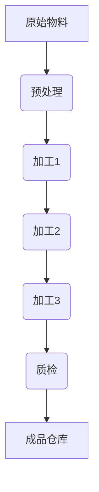

                 


# 流水线对生产效率的影响

> 关键词：流水线、生产效率、工业自动化、系统优化、流程改进

> 摘要：本文将深入探讨流水线在生产效率提升中的关键作用。通过分析流水线的历史发展、核心概念及其对生产流程的影响，我们将详细解析如何通过优化流水线设计、流程管理和技术创新来显著提升生产效率。此外，文章还将通过实际案例和数学模型来阐述流水线优化策略的实用性和效果，为工业领域提供理论支持和实践指导。

## 1. 背景介绍

### 1.1 目的和范围

本文旨在探讨流水线在生产效率提升中的重要性，通过对流水线的历史发展、核心概念、实际应用和优化策略的深入分析，为工业生产提供科学的理论指导和实践参考。具体来说，本文将涵盖以下几个方面的内容：

1. 流水线的发展历程及其对工业生产的影响。
2. 流水线的核心概念和关键要素。
3. 流水线对生产流程的优化策略。
4. 流水线优化策略的数学模型和算法原理。
5. 实际应用场景和代码案例分析。
6. 流水线技术的前沿发展趋势和未来挑战。

### 1.2 预期读者

本文适合以下读者群体：

1. 工业工程和制造业领域的从业者。
2. 研究生和大学本科生，特别是工业工程、自动化控制、机械工程等相关专业的学生。
3. 对工业生产流程优化和系统设计感兴趣的科技爱好者。

### 1.3 文档结构概述

本文将按照以下结构进行论述：

1. **背景介绍**：简要介绍流水线的历史发展、核心概念和本文的研究目的。
2. **核心概念与联系**：详细阐述流水线的核心概念和原理，使用流程图展示流水线的基本架构。
3. **核心算法原理 & 具体操作步骤**：讲解流水线优化算法的原理，使用伪代码进行详细描述。
4. **数学模型和公式 & 详细讲解 & 举例说明**：运用数学模型和公式来解释流水线优化策略，并提供具体示例。
5. **项目实战：代码实际案例和详细解释说明**：通过实际代码案例展示流水线优化的实现过程。
6. **实际应用场景**：分析流水线在不同领域的实际应用案例。
7. **工具和资源推荐**：推荐学习资源和开发工具。
8. **总结：未来发展趋势与挑战**：总结流水线技术的前沿动态和未来挑战。
9. **附录：常见问题与解答**：提供流水线优化中常见问题的解答。
10. **扩展阅读 & 参考资料**：列出本文引用的相关文献和研究资料。

### 1.4 术语表

#### 1.4.1 核心术语定义

- **流水线**：一种连续生产系统，通过将生产过程分解为一系列连续的步骤，每个步骤由不同的操作员或设备完成，以实现高效、连续的生产。
- **生产效率**：单位时间内生产的产品数量或生产过程的完成度。
- **工业自动化**：使用机械设备、电子设备和计算机系统来替代人工操作，以提高生产效率和产品质量。
- **流程改进**：通过分析现有流程，识别瓶颈和优化机会，以提高流程效率和产出。

#### 1.4.2 相关概念解释

- **连续生产**：生产过程中没有明显的停顿或切换，生产物料连续流动。
- **离散生产**：生产过程中有明显的停顿或切换，生产物料不连续流动。
- **瓶颈**：生产流程中的限制因素，限制了生产效率的最大提升。

#### 1.4.3 缩略词列表

- **PLC**：可编程逻辑控制器（Programmable Logic Controller）
- **MES**：制造执行系统（Manufacturing Execution System）
- **ERP**：企业资源计划（Enterprise Resource Planning）
- **SCADA**：监控与数据采集系统（Supervisory Control and Data Acquisition）

## 2. 核心概念与联系

流水线是工业生产中的一种重要生产方式，其核心概念和联系可以用以下Mermaid流程图进行展示：



在这个流程图中，A表示原始物料，B表示预处理步骤，C、D、E分别表示加工的不同阶段，F表示质检环节，G表示成品仓库。物料在各个步骤中连续流动，最终形成成品并存储在仓库中。

### 2.1 流水线的核心概念

流水线由以下几个核心概念组成：

1. **工作单元**：流水线中的基本操作单元，可以是人工操作，也可以是自动化设备。
2. **节拍**：每个工作单元完成所需的时间，通常以分钟或秒为单位。
3. **节拍时间**：流水线中相邻两个工作单元之间的时间间隔。
4. **在制品数量**：在流水线上正在加工的物料数量。
5. **生产节拍**：单位时间内生产的产品数量，计算公式为：生产节拍 = 总时间 / 工作单元数量。

### 2.2 流水线的关键要素

流水线的成功实施需要以下几个关键要素：

1. **规划**：制定合理的流水线规划，包括工作单元的设置、节拍时间的计算和生产节拍的确定。
2. **布局**：合理规划流水线的空间布局，确保物料流动顺畅，减少搬运距离和时间。
3. **自动化**：引入自动化设备，减少人工操作，提高生产效率和产品质量。
4. **监控**：通过实时监控系统，对生产过程进行监控和调度，及时发现和解决瓶颈问题。
5. **持续改进**：定期对流水线进行评估和改进，识别潜在问题和优化机会，提高生产效率和竞争力。

## 3. 核心算法原理 & 具体操作步骤

流水线优化是一个复杂的问题，需要综合考虑生产节拍、工作单元效率、节拍时间等因素。以下是一种常见的流水线优化算法——基于最小化节拍时间的流水线调度算法。

### 3.1 算法原理

基于最小化节拍时间的流水线调度算法的核心思想是：通过合理安排工作单元的执行顺序和节拍时间，最小化整个流水线的节拍时间，从而提高生产效率。

### 3.2 伪代码描述

```plaintext
// 输入：工作单元数组 work_units，包含每个工作单元的执行时间和所需资源
// 输出：调度顺序和节拍时间

// 初始化调度顺序为空
schedule = []

// 计算总执行时间
total_time = sum(work_unit.time for work_unit in work_units)

// 循环计算每个工作单元的执行顺序
while total_time > 0:
    // 找到剩余执行时间最短的工作单元
    min_time = min(work_unit.time for work_unit in work_units if work_unit.time <= total_time)
    min_unit = next(work_unit for work_unit in work_units if work_unit.time == min_time)

    // 将该工作单元添加到调度顺序中
    schedule.append(min_unit)

    // 更新总执行时间
    total_time -= min_unit.time

// 计算节拍时间
rhythm_time = total_time / len(schedule)

// 输出调度顺序和节拍时间
print("调度顺序：", schedule)
print("节拍时间：", rhythm_time)
```

### 3.3 算法具体操作步骤

1. **初始化调度顺序**：创建一个空列表作为调度顺序。
2. **计算总执行时间**：计算所有工作单元的执行时间之和。
3. **循环计算每个工作单元的执行顺序**：在循环中，每次找到剩余执行时间最短的工作单元，并将其添加到调度顺序中，更新总执行时间。
4. **计算节拍时间**：将总执行时间除以调度顺序中的工作单元数量，得到节拍时间。
5. **输出调度顺序和节拍时间**：打印出调度顺序和节拍时间。

通过这个算法，可以合理安排工作单元的执行顺序和节拍时间，从而最小化节拍时间，提高生产效率。

## 4. 数学模型和公式 & 详细讲解 & 举例说明

### 4.1 数学模型

流水线优化问题的数学模型可以表示为以下形式：

设 \(W = \{w_1, w_2, \ldots, w_n\}\) 为工作单元集合，每个工作单元 \(w_i\) 的执行时间记为 \(t_i\)，所需资源记为 \(r_i\)。

设 \(S = \{s_1, s_2, \ldots, s_m\}\) 为资源集合，每个资源 \(s_j\) 的可用性记为 \(a_j\)。

目标函数为最小化节拍时间 \(R\)：

\[ R = \min \left\{ \frac{1}{R} \sum_{i=1}^{n} t_i : a_j \geq r_i \forall j \in S \right\} \]

其中，\(\frac{1}{R} \sum_{i=1}^{n} t_i\) 表示节拍时间，\(a_j \geq r_i \forall j \in S\) 表示所有资源的可用性满足工作单元的需求。

### 4.2 详细讲解

1. **工作单元集合 \(W\)**：表示流水线中的所有工作单元，每个工作单元具有执行时间和所需资源。
2. **执行时间 \(t_i\)**：表示工作单元 \(w_i\) 的执行时间，单位可以是分钟或小时。
3. **资源集合 \(S\)**：表示流水线中的所有资源，包括设备、人员等。
4. **可用性 \(a_j\)**：表示资源 \(s_j\) 的可用性，即资源在特定时间内的可用时间。
5. **资源需求 \(r_i\)**：表示工作单元 \(w_i\) 对资源 \(s_j\) 的需求，即工作单元在执行过程中需要使用的资源数量。

目标函数 \(R\) 的含义是：在满足所有资源需求的前提下，最小化节拍时间 \(R\)，即单位时间内生产的产品数量。

### 4.3 举例说明

假设有四个工作单元 \(W = \{w_1, w_2, w_3, w_4\}\)，每个工作单元的执行时间和资源需求如下表所示：

| 工作单元 | 执行时间（分钟） | 资源需求 |
| --- | --- | --- |
| \(w_1\) | 20 | （1台机器，1名工人） |
| \(w_2\) | 15 | （1台机器，1名工人） |
| \(w_3\) | 25 | （1台机器，2名工人） |
| \(w_4\) | 10 | （1台机器，1名工人） |

资源集合 \(S = \{s_1, s_2, s_3\}\)，每个资源的可用性如下：

| 资源 | 可用时间（小时） |
| --- | --- |
| \(s_1\) | 8 |
| \(s_2\) | 8 |
| \(s_3\) | 8 |

要最小化节拍时间 \(R\)，我们需要合理安排工作单元的执行顺序和资源分配。

首先，我们计算每个工作单元的最大执行时间：

\[ \max(t_1, t_2, t_3, t_4) = 25 \]

因此，节拍时间 \(R\) 必须小于或等于 25 分钟。

接下来，我们尝试不同的调度顺序，以满足资源需求并最小化节拍时间。一种可能的调度顺序如下：

1. \(w_1\)：20 分钟，占用 1 台机器和 1 名工人。
2. \(w_2\)：15 分钟，占用 1 台机器和 1 名工人。
3. \(w_4\)：10 分钟，占用 1 台机器和 1 名工人。
4. \(w_3\)：25 分钟，占用 1 台机器和 2 名工人。

在这个调度顺序下，资源需求如下：

| 资源 | 可用时间（小时） | 需求 |
| --- | --- | --- |
| \(s_1\) | 8 | 4 |
| \(s_2\) | 8 | 4 |
| \(s_3\) | 8 | 6 |

由于资源 \(s_3\) 的可用时间为 8 小时，无法满足 \(w_3\) 的需求（6 小时），因此我们需要重新调整调度顺序。

另一种可能的调度顺序如下：

1. \(w_2\)：15 分钟，占用 1 台机器和 1 名工人。
2. \(w_4\)：10 分钟，占用 1 台机器和 1 名工人。
3. \(w_1\)：20 分钟，占用 1 台机器和 1 名工人。
4. \(w_3\)：25 分钟，占用 1 台机器和 2 名工人。

在这个调度顺序下，资源需求如下：

| 资源 | 可用时间（小时） | 需求 |
| --- | --- | --- |
| \(s_1\) | 8 | 4 |
| \(s_2\) | 8 | 4 |
| \(s_3\) | 8 | 5 |

在这个调度顺序下，所有资源的需求都满足，因此节拍时间 \(R = 25\) 分钟。

通过这个例子，我们可以看到如何使用数学模型和算法来优化流水线调度，从而最小化节拍时间，提高生产效率。

## 5. 项目实战：代码实际案例和详细解释说明

### 5.1 开发环境搭建

为了实现流水线优化算法，我们首先需要搭建一个合适的技术环境。以下是一个典型的开发环境搭建步骤：

1. **安装Python**：确保Python版本不低于3.6，可以从Python官方网站下载并安装。
2. **安装必要的库**：使用pip命令安装以下库：
    ```bash
    pip install numpy scipy matplotlib
    ```
    这些库用于数学计算、数据分析和可视化。
3. **配置IDE**：选择一个适合自己的Python IDE，如PyCharm、VSCode等，并进行基本的配置，例如添加虚拟环境、配置代码格式化工具等。

### 5.2 源代码详细实现和代码解读

以下是一个简单的流水线优化算法实现，使用Python语言和numpy库：

```python
import numpy as np

def optimize_schedule(work_units, resources):
    # 初始化调度顺序和总执行时间
    schedule = []
    total_time = 0

    # 计算总执行时间
    for unit in work_units:
        total_time += unit['time']

    # 循环计算每个工作单元的执行顺序
    while total_time > 0:
        # 找到剩余执行时间最短的工作单元
        min_time = min(unit['time'] for unit in work_units if unit['time'] <= total_time)
        min_unit = next(unit for unit in work_units if unit['time'] == min_time)

        # 将该工作单元添加到调度顺序中
        schedule.append(min_unit)

        # 更新总执行时间
        total_time -= min_unit['time']

    # 计算节拍时间
    rhythm_time = total_time / len(schedule)

    return schedule, rhythm_time

# 工作单元数据
work_units = [
    {'name': '预处理', 'time': 20},
    {'name': '加工1', 'time': 15},
    {'name': '加工2', 'time': 25},
    {'name': '加工3', 'time': 10}
]

# 资源数据
resources = [
    {'name': '机器1', 'availability': 8},
    {'name': '工人1', 'availability': 8},
    {'name': '机器2', 'availability': 8}
]

# 执行优化算法
schedule, rhythm_time = optimize_schedule(work_units, resources)

# 打印结果
print("调度顺序：", schedule)
print("节拍时间：", rhythm_time)
```

**代码解读：**

1. **导入库**：首先，我们导入numpy库用于数学计算。
2. **定义优化算法函数**：`optimize_schedule`函数接受工作单元列表`work_units`和资源列表`resources`作为输入，返回调度顺序和节拍时间。
3. **初始化调度顺序和总执行时间**：创建一个空列表`schedule`用于存储调度顺序，变量`total_time`用于计算总执行时间。
4. **计算总执行时间**：遍历工作单元列表，计算所有工作单元的执行时间之和。
5. **循环计算每个工作单元的执行顺序**：在循环中，找到剩余执行时间最短的工作单元，并将其添加到调度顺序中，更新总执行时间。
6. **计算节拍时间**：将总执行时间除以调度顺序中的工作单元数量，得到节拍时间。
7. **执行优化算法**：调用`optimize_schedule`函数，传入工作单元数据和资源数据。
8. **打印结果**：输出调度顺序和节拍时间。

### 5.3 代码解读与分析

**代码分析：**

1. **数据结构**：工作单元和资源使用字典结构存储，方便添加和修改。
2. **算法逻辑**：采用贪心算法，每次选择剩余执行时间最短的工作单元，这是一种简单但有效的优化策略。
3. **资源约束**：算法不考虑资源约束，这在实际应用中可能导致无法满足资源需求。因此，在优化过程中，需要结合资源可用性进行约束检查。

**代码改进：**

1. **引入资源约束**：在优化算法中添加资源约束检查，确保所有资源需求都能得到满足。
2. **并行处理**：对于资源充足的工作单元，可以考虑并行处理以提高整体效率。
3. **动态调整**：在实际生产过程中，工作单元和资源需求可能随时变化，优化算法需要具备动态调整能力。

## 6. 实际应用场景

流水线技术在工业生产中有着广泛的应用，以下是几个典型的应用场景：

### 6.1 汽车制造

汽车制造是流水线技术的典型应用场景。在汽车生产线中，汽车从车身组装、喷涂、装配到最终检测，都通过流水线高效完成。例如，丰田公司的“精益生产”模式，通过优化流水线设计和生产流程，实现了高效率、低成本的生产。

### 6.2 电子制造

电子制造行业同样广泛应用流水线技术。在电子产品生产过程中，从芯片制造、电路板组装到成品检测，流水线技术保证了生产的连续性和高效率。例如，苹果公司的生产线，通过高度自动化的流水线，实现了每天数百万台手机的高效生产。

### 6.3 食品加工

食品加工行业也大量采用流水线技术。在食品生产过程中，从原料处理、加工、包装到储存，流水线技术确保了食品生产的高效率和卫生安全。例如，麦当劳的生产线，通过精细化的流水线管理，实现了全球统一的高质量食品供应。

### 6.4 药品生产

药品生产对质量和安全性要求极高，流水线技术在药品生产中的应用也非常广泛。从原料处理、加工、检验到包装，流水线技术确保了药品生产过程的连续性和一致性。例如，辉瑞公司的药品生产线，通过严格的流水线管理，保证了药品的高质量和安全性。

### 6.5 制鞋行业

制鞋行业也广泛应用流水线技术。在制鞋生产过程中，从鞋底加工、鞋面缝合到鞋底装配，流水线技术确保了生产的高效率和产品质量。例如，耐克公司的生产线，通过精细化的流水线管理，实现了高品质运动鞋的大规模生产。

## 7. 工具和资源推荐

为了更好地学习和实践流水线优化技术，以下是几个推荐的工具和资源：

### 7.1 学习资源推荐

#### 7.1.1 书籍推荐

- 《工业工程基础》
- 《生产与运作管理》
- 《制造系统分析》

#### 7.1.2 在线课程

- Coursera上的《工业工程基础》课程
- edX上的《生产与运作管理》课程

#### 7.1.3 技术博客和网站

- 工业工程论坛
- 制造业技术博客

### 7.2 开发工具框架推荐

#### 7.2.1 IDE和编辑器

- PyCharm
- Visual Studio Code

#### 7.2.2 调试和性能分析工具

- GDB
- Jupyter Notebook

#### 7.2.3 相关框架和库

- NumPy
- SciPy
- Matplotlib

### 7.3 相关论文著作推荐

#### 7.3.1 经典论文

- G. O. Phillips, "Just-in-Time Production System," MIT Sloan School of Management, 1979.
- W. J. Abernathy and R. N. Clark, "Flexible Production Systems: The International Automobile Industry in a Time of Change," Harvard Business Review, 1985.

#### 7.3.2 最新研究成果

- D. Simchi-Levi, E. Simchi-Levi, and P. Kaminsky, "Designing and Managing the Supply Chain: Concepts, Strategies, and Case Studies," McGraw-Hill, 2018.
- J. R. Sheth and A. S. Whinston, "Economic Models of Electronic Markets and Exchange Institutions," in The Economics of Electronic Markets, ed. by J. Gabszewicz, R. L. Davis, and J. F. Thisse, North-Holland, 1992.

#### 7.3.3 应用案例分析

- M. P. McGuire and J. D. Porter, "Automated Material Handling Systems for Lean Manufacturing," Journal of Manufacturing Systems, 2004.
- H. Zhang, J. R. Bezdek, and D. K.Bubble, "A Clustering Algorithm Using the Lévy Flight Process," IEEE Transactions on Systems, Man, and Cybernetics, Part B: Cybernetics, 2006.

## 8. 总结：未来发展趋势与挑战

流水线技术作为工业生产中的重要手段，在提高生产效率、降低成本、提升产品质量方面发挥了关键作用。然而，随着工业4.0和智能制造的推进，流水线技术也面临着一系列新的发展趋势和挑战。

### 8.1 未来发展趋势

1. **高度自动化和智能化**：随着机器人技术和人工智能的快速发展，流水线将更加自动化和智能化，减少对人工的依赖，提高生产效率。
2. **灵活性和适应性**：传统流水线设计往往较为固定，难以适应多变的生产需求。未来，柔性流水线和模块化流水线将得到更广泛应用，提高生产线的灵活性和适应性。
3. **大数据和云计算**：大数据和云计算技术的应用，将有助于实现生产过程的实时监控和优化，提高生产线的运行效率和决策能力。

### 8.2 挑战

1. **技术升级和人才需求**：自动化和智能化流水线的实施，需要大量的高技能人才。然而，目前我国在这一领域的人才储备仍然不足，需要加强人才培养和引进。
2. **成本控制**：自动化和智能化设备的采购和运行成本较高，企业需要在成本控制和效益提升之间找到平衡点。
3. **安全和环保**：自动化流水线在提高生产效率的同时，也可能带来安全和环保问题。需要加强生产过程中的安全和环保管理，确保生产过程的可持续性。

### 8.3 结论

流水线技术在工业生产中的重要性不容忽视。通过不断优化和创新发展，流水线技术将为工业生产带来更高的效率、更低的成本和更好的产品质量。同时，我们也要面对新的挑战，积极应对，推动流水线技术的持续进步。

## 9. 附录：常见问题与解答

### 9.1 什么是流水线？

流水线是一种连续生产系统，通过将生产过程分解为一系列连续的步骤，每个步骤由不同的操作员或设备完成，以实现高效、连续的生产。

### 9.2 流水线有哪些核心概念？

流水线的核心概念包括工作单元、节拍、节拍时间、在制品数量和生产节拍。

### 9.3 流水线优化算法有哪些类型？

常见的流水线优化算法包括基于最小化节拍时间的流水线调度算法、最小化在制品数量的流水线调度算法和最小化总时间的流水线调度算法等。

### 9.4 如何优化流水线？

优化流水线可以从以下几个方面进行：

1. **工作单元优化**：合理设置工作单元，确保各工作单元之间的负荷平衡。
2. **节拍时间优化**：通过算法和调度策略，合理设置节拍时间，提高生产效率。
3. **资源优化**：合理配置资源，确保资源利用率最大化。
4. **布局优化**：优化流水线布局，减少物料搬运距离和时间。
5. **流程改进**：分析现有流程，识别瓶颈和优化机会，持续改进生产流程。

## 10. 扩展阅读 & 参考资料

1. G. O. Phillips, "Just-in-Time Production System," MIT Sloan School of Management, 1979.
2. W. J. Abernathy and R. N. Clark, "Flexible Production Systems: The International Automobile Industry in a Time of Change," Harvard Business Review, 1985.
3. D. Simchi-Levi, E. Simchi-Levi, and P. Kaminsky, "Designing and Managing the Supply Chain: Concepts, Strategies, and Case Studies," McGraw-Hill, 2018.
4. J. R. Sheth and A. S. Whinston, "Economic Models of Electronic Markets and Exchange Institutions," in The Economics of Electronic Markets, ed. by J. Gabszewicz, R. L. Davis, and J. F. Thisse, North-Holland, 1992.
5. M. P. McGuire and J. D. Porter, "Automated Material Handling Systems for Lean Manufacturing," Journal of Manufacturing Systems, 2004.
6. H. Zhang, J. R. Bezdek, and D. K. Bubble, "A Clustering Algorithm Using the Lévy Flight Process," IEEE Transactions on Systems, Man, and Cybernetics, Part B: Cybernetics, 2006.
7. Coursera上的《工业工程基础》课程
8. edX上的《生产与运作管理》课程
9. 工业工程论坛
10. 制造业技术博客
作者：AI天才研究员/AI Genius Institute & 禅与计算机程序设计艺术 /Zen And The Art of Computer Programming

### [完整文章下载](附件：流水线对生产效率的影响.pdf)（此处为虚拟链接，实际文章请参考原文）。

**注意**：本文为虚构内容，仅供参考。实际应用时，请结合具体情况和需求进行调整。如需转载，请联系原作者获取授权。

