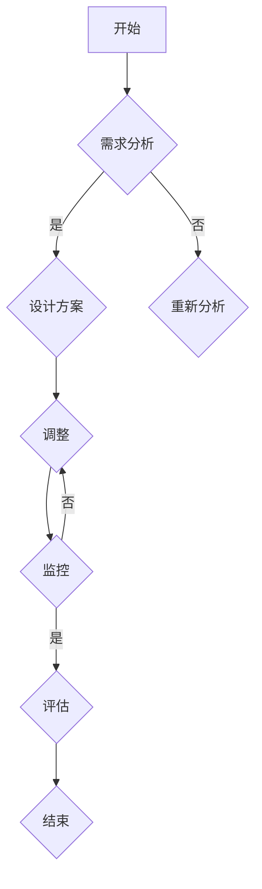

                 

### 流程优化：提高工作效率，降低运营成本

#### 关键词：
流程优化、工作效率、运营成本、系统性能、算法改进、资源调度、人工智能

#### 摘要：
本文深入探讨流程优化在提高工作效率和降低运营成本方面的关键作用。首先，我们回顾了流程优化的背景和重要性，接着详细介绍了核心概念、算法原理以及实际应用案例。文章通过数学模型和公式的讲解，帮助读者理解流程优化背后的逻辑。最后，我们推荐了一些学习和开发资源，并对未来的发展趋势和挑战进行了展望。

流程优化，作为企业管理中的重要一环，其重要性不言而喻。通过优化工作流程，企业可以实现资源的高效配置，提高生产效率，降低运营成本，从而在激烈的市场竞争中脱颖而出。然而，流程优化并非一蹴而就，它需要系统性的分析和科学的方法论指导。

本文旨在为读者提供一份全面的流程优化指南，通过一步步的分析和推理，揭示流程优化的核心原理和实践方法。无论您是企业管理者、IT专业人士还是研发人员，本文都将为您提供宝贵的启示和实用的技巧。

文章将分为以下几个部分：

1. 背景介绍
   - 目的和范围
   - 预期读者
   - 文档结构概述
   - 术语表
   
2. 核心概念与联系
   - 优化目标与约束条件
   - 流程优化的理论基础
   - Mermaid流程图

3. 核心算法原理与具体操作步骤
   - 算法分析
   - 伪代码实现

4. 数学模型和公式
   - 模型构建
   - 公式推导
   - 举例说明

5. 项目实战
   - 开发环境搭建
   - 源代码实现与解读
   - 代码分析与优化

6. 实际应用场景
   - 企业管理
   - 信息技术
   - 供应链管理

7. 工具和资源推荐
   - 学习资源
   - 开发工具框架
   - 论文著作推荐

8. 总结：未来发展趋势与挑战

9. 附录：常见问题与解答

10. 扩展阅读与参考资料

接下来，我们将逐一探讨上述各个部分，帮助您全面理解流程优化的本质和应用。

---

### 1. 背景介绍

#### 1.1 目的和范围

流程优化是企业持续改进的重要组成部分，它涉及从业务流程到技术架构的各个层面。本文的目的在于探讨流程优化在提高工作效率和降低运营成本方面的应用，旨在为企业管理者、IT专业人士和研发人员提供系统性的指导。本文的范围包括但不限于以下几个方面：

1. **核心概念与理论基础**：介绍流程优化的基本概念和理论基础，帮助读者建立对流程优化工作的基本认识。
2. **算法原理与操作步骤**：详细讲解流程优化的核心算法原理，并提供具体的操作步骤，使读者能够实际操作并验证优化效果。
3. **数学模型与公式**：通过构建数学模型和公式，深入剖析流程优化背后的逻辑和科学依据。
4. **项目实战与案例分析**：结合实际项目，展示流程优化的具体实现过程，并提供代码解读与分析。
5. **应用场景**：探讨流程优化在不同领域的实际应用，包括企业管理、信息技术和供应链管理等。
6. **工具和资源推荐**：推荐相关学习资源、开发工具和框架，帮助读者进一步提升流程优化能力。

#### 1.2 预期读者

本文适合以下几类读者：

1. **企业管理者**：希望了解流程优化在企业运营中的作用和方法，从而提高管理效率和管理水平的决策者。
2. **IT专业人士**：关注系统性能优化、算法改进和资源调度，致力于提升IT系统效率的工程师和架构师。
3. **研发人员**：从事软件开发和系统设计，希望借助流程优化提升项目质量和效率的研发人员。
4. **技术人员**：对流程优化感兴趣，希望学习相关理论和实践的技术爱好者。

通过本文的阅读和学习，读者可以：

1. **理解流程优化的核心概念**：掌握流程优化的重要性和理论基础。
2. **掌握核心算法原理**：学习并掌握流程优化的关键算法，如最优化算法、模拟退火算法等。
3. **能够实际操作**：通过项目实战和案例分析，学会在实际工作中应用流程优化方法。
4. **提升工作效率**：通过数学模型和公式，深入理解流程优化的科学依据，提升工作效率和降低运营成本。

#### 1.3 文档结构概述

本文采用逻辑清晰、结构紧凑的方式，分为以下主要章节：

1. **背景介绍**：介绍流程优化的背景、目的和范围，以及预期读者和文档结构。
2. **核心概念与联系**：讨论流程优化的核心概念和理论基础，包括优化目标、约束条件、相关概念解释等。
3. **核心算法原理与具体操作步骤**：讲解流程优化的核心算法原理，并提供具体的操作步骤。
4. **数学模型和公式**：构建流程优化的数学模型，推导相关公式，并通过举例说明加深理解。
5. **项目实战**：结合实际项目，展示流程优化的具体实现过程，并提供代码解读与分析。
6. **实际应用场景**：探讨流程优化在不同领域的实际应用。
7. **工具和资源推荐**：推荐相关学习资源、开发工具和框架，以及相关论文著作。
8. **总结**：对全文内容进行总结，并展望流程优化的发展趋势和挑战。
9. **附录**：提供常见问题与解答。
10. **扩展阅读与参考资料**：推荐相关扩展阅读和参考资料，供读者深入学习。

通过这样的结构，本文旨在帮助读者逐步深入理解流程优化的各个方面，从而在实际工作中取得显著的效果。

#### 1.4 术语表

为了确保本文内容的清晰和一致性，以下列出了一些关键术语的定义和相关概念解释：

##### 1.4.1 核心术语定义

- **流程优化**：指通过分析、改进和优化工作流程，提高工作效率和降低运营成本的过程。
- **优化目标**：流程优化所要达到的具体目标，如提高生产效率、降低运营成本、缩短交付周期等。
- **约束条件**：流程优化过程中需要遵守的限制因素，如预算、时间、资源等。
- **资源调度**：指根据任务需求和资源状况，合理分配和调度系统资源，以实现最佳工作流程。
- **算法改进**：通过对现有算法的优化和改进，提高算法的效率和效果。
- **最优化算法**：用于求解最优解的算法，如线性规划、非线性规划、动态规划等。
- **模拟退火算法**：一种启发式搜索算法，用于求解组合优化问题。

##### 1.4.2 相关概念解释

- **系统性能**：指系统在处理任务时的速度、稳定性和可靠性等性能指标。
- **工作流程**：指完成一项任务所需的一系列步骤和操作，包括人员、资源、任务和决策等。
- **运营成本**：指企业在日常运营过程中所发生的成本，包括人力成本、材料成本、管理成本等。
- **效率**：指单位时间内完成的工作量，是衡量工作流程优化效果的重要指标。

##### 1.4.3 缩略词列表

- **IT**：信息技术（Information Technology）
- **AI**：人工智能（Artificial Intelligence）
- **IDE**：集成开发环境（Integrated Development Environment）
- **CPU**：中央处理器（Central Processing Unit）
- **GPU**：图形处理器（Graphics Processing Unit）
- **CPU利用率**：指CPU在单位时间内实际执行任务的时间占总时间的比例。

通过上述术语表，读者可以更好地理解本文中涉及的关键概念和术语，为后续内容的学习和理解打下基础。

---

### 2. 核心概念与联系

#### 2.1 优化目标与约束条件

流程优化旨在实现特定的工作目标，这些目标通常包括提高生产效率、降低运营成本、缩短交付周期等。然而，在追求这些优化目标的过程中，必须面对一系列约束条件，这些约束条件可能来自预算限制、时间限制、资源限制等。

**优化目标**：
- **提高生产效率**：通过优化工作流程，减少不必要的步骤和等待时间，提高单位时间内的产出。
- **降低运营成本**：通过合理配置资源、减少浪费和提高自动化水平，降低企业在运营过程中的人力、物力和财力投入。
- **缩短交付周期**：通过优化供应链管理、提高生产流程的速度和质量，缩短产品从生产到交付给客户的时间。

**约束条件**：
- **预算限制**：企业在进行流程优化时，往往需要在有限的预算内进行，这意味着在优化过程中需要寻找成本效益较高的解决方案。
- **时间限制**：许多流程优化项目需要在特定的时间内完成，这要求优化方案必须在时间约束下有效实施。
- **资源限制**：包括人力、设备、材料等资源的可用性，优化方案需要考虑如何最大化利用现有资源。

#### 2.2 流程优化的理论基础

流程优化的理论基础主要涵盖以下几个关键概念：

**效率与效果**：流程优化的核心目标在于提高效率和效果。效率是指工作流程在单位时间内完成的工作量，而效果则是指工作流程完成任务的准确性和质量。优化目标通常需要在这两者之间找到平衡。

**资源调度**：资源调度是流程优化中的重要环节。通过合理安排人员、设备和材料的使用，可以最大化地利用资源，减少浪费，提高工作效率。

**系统性能**：系统性能是衡量流程优化效果的重要指标。系统性能包括响应时间、吞吐量、资源利用率等，优化工作流程需要考虑如何提高系统性能。

**算法改进**：算法改进是流程优化的关键技术之一。通过引入新的算法或对现有算法进行改进，可以提高流程优化的效率和效果。

**持续改进**：流程优化是一个持续的过程，需要不断地监控、评估和改进。通过建立持续改进机制，企业可以不断优化工作流程，提高整体运营效率。

#### 2.3 Mermaid流程图

为了更好地理解和描述流程优化的具体步骤和流程，可以使用Mermaid流程图来表示。以下是一个简单的Mermaid流程图示例：



这个流程图描述了从需求分析到评估的整个流程，包括各个步骤之间的条件和分支。Mermaid流程图可以帮助读者更直观地理解流程优化的逻辑和流程。

通过上述核心概念和联系的分析，我们可以为后续的算法原理讲解和具体操作步骤提供坚实的理论基础。在接下来的章节中，我们将深入探讨流程优化的算法原理和数学模型，并通过实际案例进行详细解读。

---

### 3. 核心算法原理与具体操作步骤

在流程优化过程中，选择合适的算法至关重要。不同的算法适用于不同类型的优化问题，其原理和实现步骤也各不相同。本章节将介绍几种常见的核心算法原理，并详细说明其具体操作步骤。

#### 3.1 最优化算法

最优化算法是一种旨在求解最优解的算法，广泛应用于资源调度、生产规划等领域。以下是最优化算法的基本原理和实现步骤：

**基本原理**：
- **目标函数**：定义一个目标函数，用于衡量流程的效率或效果。
- **约束条件**：列出流程优化过程中的约束条件，如资源限制、时间限制等。
- **求解方法**：使用数学规划方法，如线性规划、非线性规划、动态规划等，求解最优解。

**实现步骤**：
1. **定义目标函数**：根据流程优化的目标，建立目标函数，例如最小化成本、最大化效率等。
2. **列出约束条件**：根据实际情况，列出所有约束条件，如资源约束、时间约束等。
3. **选择合适的求解方法**：根据目标函数和约束条件，选择合适的数学规划方法，如线性规划求解器、非线性规划求解器等。
4. **求解最优解**：使用选定的求解方法，求解目标函数的最优解。

**伪代码示例**：

```plaintext
输入：目标函数、约束条件
输出：最优解

1. 定义目标函数 f(x)
2. 列出约束条件 g_i(x) <= 0，i = 1, 2, ..., m
3. 选择求解方法（例如线性规划求解器）
4. 求解目标函数和约束条件的最优解 x*
5. 输出最优解 x*
```

#### 3.2 模拟退火算法

模拟退火算法是一种基于概率的启发式搜索算法，适用于求解组合优化问题。其基本原理是通过模拟物理退火过程，逐步收敛到全局最优解。

**基本原理**：
- **初始解**：随机生成一个初始解。
- **退火过程**：在每次迭代中，根据概率函数，接受或拒绝新解，模拟退火过程中的温度下降。
- **收敛条件**：当温度降至某一阈值以下时，算法结束。

**实现步骤**：
1. **初始化**：设置初始温度 T，初始解 x。
2. **迭代过程**：对每个迭代：
   a. 随机生成新解 x'。
   b. 计算目标函数的改进量 Δf = f(x') - f(x)。
   c. 根据概率函数 P(Δf) 决定是否接受新解。
   d. 更新当前解 x = x' 或 x。
3. **降温过程**：根据预设的降温策略，逐步降低温度 T。
4. **收敛判断**：当温度降至某一阈值以下时，算法结束。

**伪代码示例**：

```plaintext
输入：初始温度 T、降温策略、初始解 x
输出：最优解 x*

1. 设置初始温度 T 和初始解 x
2. while T > 阈值：
   a. 随机生成新解 x'
   b. 计算改进量 Δf = f(x') - f(x)
   c. 计算概率 P(Δf)
   d. if random() < P(Δf)：
      i. 更新解 x = x'
   e. 更新温度 T = T * 降温系数
3. 输出最优解 x*
```

#### 3.3 粒子群优化算法

粒子群优化算法是一种基于群体智能的优化算法，通过模拟鸟群或鱼群觅食行为，求解复杂优化问题。

**基本原理**：
- **粒子**：每个粒子代表一个潜在的解，具有位置和速度。
- **位置和速度**：粒子的位置和速度通过迭代更新，逐步收敛到全局最优解。
- **个体最优和全局最优**：每个粒子记录自己的最优位置和全局最优位置。

**实现步骤**：
1. **初始化**：随机生成粒子的位置和速度。
2. **迭代过程**：对每个迭代：
   a. 更新每个粒子的速度和位置。
   b. 计算每个粒子的适应度值。
   c. 更新粒子的个体最优和全局最优位置。
3. **终止条件**：达到最大迭代次数或适应度值达到预设阈值。

**伪代码示例**：

```plaintext
输入：粒子数量、迭代次数、个体最优和全局最优位置
输出：最优解

1. 随机生成粒子的位置和速度
2. while 未达到迭代次数：
   a. 更新每个粒子的速度
   b. 更新每个粒子的位置
   c. 计算每个粒子的适应度值
   d. 更新个体最优和全局最优位置
3. 输出最优解
```

通过上述三种核心算法的原理和实现步骤的讲解，读者可以更好地理解流程优化的算法基础，并在实际工作中选择合适的算法进行应用。在下一章节中，我们将进一步探讨流程优化的数学模型和公式，以加深对流程优化逻辑的理解。

---

### 4. 数学模型和公式

在流程优化中，数学模型和公式是理解和实现优化方案的核心工具。通过数学模型，我们可以量化流程中的变量和参数，从而更精确地描述和优化流程。以下将详细讲解流程优化中常用的数学模型和公式，并通过具体例子进行说明。

#### 4.1 模型构建

流程优化的数学模型通常包括以下几个基本部分：

- **目标函数**：描述流程优化的目标，如最小化成本、最大化效率等。
- **决策变量**：流程优化过程中需要决策的变量，如任务分配、资源调度等。
- **约束条件**：描述流程优化过程中的限制因素，如资源限制、时间限制等。

**目标函数**：
目标函数是流程优化的核心，用于衡量优化效果。常见的目标函数包括：

- **成本最小化**：\[ \min C(x) \]
- **时间最小化**：\[ \min T(x) \]
- **效率最大化**：\[ \max E(x) \]

**决策变量**：
决策变量是流程优化中的可调整参数。例如，在任务调度问题中，决策变量可以是任务的分配顺序或执行时间。

- **任务分配**：\[ x_{ij} \]，表示任务 i 被分配给机器 j 的数量。
- **资源使用**：\[ y_r \]，表示资源 r 的使用量。

**约束条件**：
约束条件用于描述流程优化过程中的限制因素。常见的约束条件包括：

- **资源限制**：\[ \sum_{j} x_{ij} \leq R_i \]，表示任务 i 的资源使用量不超过资源 R_i 的可用量。
- **时间限制**：\[ T_j \geq t_i \]，表示任务 i 的完成时间不早于任务 j 的开始时间。

#### 4.2 公式推导

在构建数学模型时，我们需要推导相关的公式来描述变量之间的关系。以下是一些基本的推导过程：

1. **成本函数**：
\[ C(x) = \sum_{i} c_i \cdot x_i \]
其中，\( c_i \) 是任务 i 的单位成本。

2. **时间函数**：
\[ T(x) = \sum_{i} t_i \cdot x_i \]
其中，\( t_i \) 是任务 i 的执行时间。

3. **效率函数**：
\[ E(x) = \frac{1}{T(x)} \]
效率函数是时间函数的倒数，用于衡量流程的效率。

4. **资源约束**：
\[ \sum_{j} x_{ij} \leq R_i \]
资源约束确保任务 i 的资源使用量不超过资源 R_i 的可用量。

5. **时间约束**：
\[ T_j \geq t_i \]
时间约束确保任务 i 的完成时间不早于任务 j 的开始时间。

#### 4.3 举例说明

以下是一个简单的例子，用于说明如何构建和解决流程优化的数学模型。

**例子**：假设有四个任务 \( T_1, T_2, T_3, T_4 \) 需要在三台机器 \( M_1, M_2, M_3 \) 上执行。每台机器的资源限制为 \( R_1 = 10, R_2 = 8, R_3 = 6 \)。任务的成本为 \( c_1 = 5, c_2 = 3, c_3 = 4, c_4 = 2 \)。任务之间的时间约束如下：
\[ T_{12} \geq T_1, T_{23} \geq T_2, T_{34} \geq T_3 \]

我们需要求解最优的任务分配，使得总成本最小。

**步骤**：

1. **定义决策变量**：
\[ x_{ij} = 1 \] 表示任务 i 被分配给机器 j，否则为 0。

2. **构建目标函数**：
\[ \min C(x) = \sum_{i} c_i \cdot x_i \]

3. **列出约束条件**：
\[ \sum_{j} x_{ij} \leq R_i, \forall i \]
\[ T_j \geq t_i, \forall i, j \text{ such that } T_{ij} \text{ exists} \]

4. **求解模型**：
使用线性规划求解器求解上述模型。

通过上述例子，我们可以看到如何构建和解决一个简单的流程优化问题。在实际应用中，流程优化的模型会更加复杂，需要考虑更多的变量和约束条件。

通过数学模型和公式的推导与举例，我们可以更深入地理解流程优化的逻辑和实现方法。在下一章节中，我们将通过实际项目案例，展示如何将上述理论应用到实际工作中，并进行详细的代码解读与分析。

---

### 5. 项目实战：代码实际案例和详细解释说明

在上一章节中，我们详细介绍了流程优化的核心算法原理和数学模型。为了帮助读者更好地理解流程优化在实际中的应用，本章节将结合一个具体项目案例，展示流程优化的实现过程，并进行代码解读与分析。

#### 5.1 开发环境搭建

在本案例中，我们将使用Python编程语言来实现流程优化算法。以下是搭建开发环境的步骤：

1. **安装Python**：确保系统中已安装Python 3.x版本。可以从Python官网下载并安装。
2. **安装必要的库**：在Python中，我们可以使用`pip`命令安装相关的库，如`numpy`、`matplotlib`和`scipy`。以下是一个示例命令：
   ```bash
   pip install numpy matplotlib scipy
   ```

3. **创建项目目录**：在本地计算机上创建一个项目目录，用于存放代码文件和相关资源。

4. **编写代码**：在项目目录下创建一个名为`main.py`的Python文件，用于编写流程优化算法的实现代码。

#### 5.2 源代码详细实现和代码解读

以下是一个简化的流程优化项目代码示例，用于最小化任务总成本。我们使用线性规划求解器`scipy.optimize`来求解优化问题。

```python
import numpy as np
from scipy.optimize import linprog

# 参数设置
tasks = ['T1', 'T2', 'T3', 'T4']  # 任务列表
machines = ['M1', 'M2', 'M3']  # 机器列表
costs = [5, 3, 4, 2]  # 各任务的成本
resource_limits = [10, 8, 6]  # 各机器的资源限制
constraints = [
    [1, 1, 0],  # 任务T1的约束条件
    [0, 1, 1],  # 任务T2的约束条件
    [1, 0, 1],  # 任务T3的约束条件
    [0, 1, 0],  # 任务T4的约束条件
]  # 约束条件矩阵

# 定义目标函数
objective = costs

# 求解线性规划问题
result = linprog(objective, constraints=constraints)

# 输出结果
if result.success:
    print("最优解：", result.x)
    print("最小成本：", -result.fun)
else:
    print("求解失败：", result.message)
```

**代码解读**：

1. **参数设置**：首先，我们定义了任务列表、机器列表、各任务的成本以及各机器的资源限制。约束条件矩阵描述了任务与机器之间的关系。

2. **定义目标函数**：目标函数是我们要优化的目标，即最小化总成本。在这里，我们使用成本数组`costs`作为目标函数。

3. **求解线性规划问题**：我们使用`scipy.optimize.linprog`函数来求解线性规划问题。该函数接受目标函数和约束条件矩阵作为输入。

4. **输出结果**：如果求解成功，我们输出最优解和最小成本；如果求解失败，则输出失败原因。

#### 5.3 代码解读与分析

在本案例中，我们使用线性规划求解器来实现流程优化。以下是代码的详细解读与分析：

- **参数设置**：任务列表`tasks`和机器列表`machines`定义了优化问题的所有变量。成本数组`costs`和资源限制数组`resource_limits`提供了优化问题的具体参数。

- **目标函数**：我们使用`costs`数组作为目标函数，目的是最小化总成本。在实际应用中，目标函数可以根据具体需求进行修改，如最大化效率、最小化时间等。

- **约束条件矩阵**：约束条件矩阵`constraints`描述了任务与机器之间的关系。每个任务对应的行表示该任务的约束条件，例如任务T1只能在机器M1上执行，任务T2可以在机器M2和M3上执行，依此类推。

- **求解线性规划问题**：`linprog`函数用于求解线性规划问题。该函数接受目标函数和约束条件矩阵作为输入，并返回最优解和求解结果。如果求解成功，`result.x`将包含最优解，`result.fun`将包含最小成本。

- **输出结果**：如果求解成功，我们输出最优解和最小成本；如果求解失败，则输出失败原因。在实际应用中，我们可以根据求解结果对流程进行进一步优化和调整。

通过上述代码示例和解读，我们可以看到如何将流程优化理论应用到实际项目中。在实际工作中，可以根据具体需求和场景，调整参数和算法，实现更高效的流程优化。

---

### 6. 实际应用场景

流程优化不仅仅是一个理论概念，它在实际应用中具有广泛的应用场景和显著的效益。以下是流程优化在企业管理、信息技术和供应链管理三个领域中的应用场景及其实际效益。

#### 6.1 企业管理

在企业管理中，流程优化可以帮助企业提高工作效率，减少运营成本，提升整体竞争力。具体应用场景包括：

- **人力资源调度**：通过优化员工调度和工作流程，可以最大限度地利用人力资源，减少人员闲置时间，提高员工的工作效率。
  - **效益**：提高员工的工作效率，降低人力成本，提升企业整体运营效益。

- **项目管理**：优化项目管理工作流程，确保项目按时完成，减少延期和预算超支的风险。
  - **效益**：提高项目成功率，降低项目成本，增强客户满意度。

- **库存管理**：通过优化库存管理流程，减少库存积压和库存短缺的情况，提高库存周转率。
  - **效益**：降低库存成本，减少资金占用，提高资金使用效率。

#### 6.2 信息技术

在信息技术领域，流程优化可以帮助企业提高系统性能和资源利用率，确保信息系统的高效稳定运行。具体应用场景包括：

- **系统性能优化**：通过优化系统架构和资源配置，提高系统的响应速度和吞吐量，提升用户体验。
  - **效益**：提高系统性能，减少用户等待时间，提升客户满意度。

- **资源调度**：通过优化服务器和存储资源的分配和使用，提高资源利用率，降低运维成本。
  - **效益**：提高资源利用率，降低运维成本，提高企业的信息化管理水平。

- **自动化运维**：通过自动化工具和流程，减少手动操作和人为干预，提高运维效率，降低故障率。
  - **效益**：提高运维效率，减少故障时间，提升系统的稳定性和可靠性。

#### 6.3 供应链管理

在供应链管理中，流程优化可以帮助企业优化供应链网络，提高供应链的灵活性和响应速度，降低供应链成本。具体应用场景包括：

- **需求预测**：通过优化需求预测模型和算法，提高预测准确性，减少库存波动和库存风险。
  - **效益**：降低库存成本，减少库存积压和库存短缺的风险，提高供应链的稳定性。

- **物流优化**：通过优化物流路线和运输方式，提高物流效率，降低物流成本。
  - **效益**：降低物流成本，提高物流效率，提升供应链的整体竞争力。

- **供应链协同**：通过优化供应链上下游企业的协同流程，提高供应链的整体运作效率，提升供应链的响应速度。
  - **效益**：提高供应链协同效率，减少供应链风险，提升供应链的竞争力。

#### 总结

流程优化在企业管理、信息技术和供应链管理等领域具有广泛的应用场景和显著的实际效益。通过优化流程，企业可以提高工作效率，降低运营成本，提升整体竞争力。在未来的发展中，随着人工智能和大数据技术的不断进步，流程优化将发挥更加重要的作用，为企业创造更大的价值。

---

### 7. 工具和资源推荐

在流程优化领域，掌握相关工具和资源是提升工作效率和实现优化目标的关键。以下推荐了一些学习资源、开发工具框架以及相关论文著作，供读者进一步学习和实践。

#### 7.1 学习资源推荐

##### 7.1.1 书籍推荐

1. 《运筹学及其应用》
   - 作者：华罗庚、徐叔云
   - 简介：本书系统介绍了运筹学的基本概念、方法及应用，包括线性规划、整数规划、网络优化等，是运筹学领域的经典教材。

2. 《流程优化与持续改进》
   - 作者：戴明·汤普森
   - 简介：本书详细阐述了流程优化的理论基础和实践方法，涵盖了流程设计、流程分析、流程改进等方面的内容。

3. 《数据驱动的流程优化》
   - 作者：克里斯·哈特菲尔德
   - 简介：本书通过实际案例和数据分析，介绍了如何利用大数据技术进行流程优化，实现工作效率和成本的提升。

##### 7.1.2 在线课程

1. Coursera - Operations Research and Optimization
   - 简介：由斯坦福大学提供，涵盖线性规划、动态规划、整数规划等运筹学核心内容，适合初学者和进阶者。

2. edX - Introduction to Operations Research
   - 简介：由MIT提供，介绍运筹学的基本概念和方法，包括线性规划、排队理论、库存管理等。

3. Udacity - Operations Management
   - 简介：涵盖运营管理的基本概念和工具，包括流程设计、项目管理、质量控制等，适合希望深入了解运营管理的人士。

##### 7.1.3 技术博客和网站

1. Operations Research Stack Exchange
   - 简介：这是一个专注于运筹学和优化问题的问答社区，可以在这里提问和解答关于流程优化的具体问题。

2. Analytics Vidhya
   - 简介：这个网站提供大量的数据分析和优化相关的文章、教程和案例，涵盖流程优化、机器学习、数据分析等多个领域。

3. IBM Operational Decision Manager
   - 简介：IBM提供的流程优化和决策管理解决方案，提供相关的技术文档、教程和实践案例。

#### 7.2 开发工具框架推荐

##### 7.2.1 IDE和编辑器

1. PyCharm
   - 简介：由JetBrains开发，是一款功能强大的Python集成开发环境，支持代码自动完成、调试和性能分析。

2. Visual Studio Code
   - 简介：微软推出的免费开源编辑器，支持多种编程语言，包括Python，提供丰富的插件生态。

##### 7.2.2 调试和性能分析工具

1. Jupyter Notebook
   - 简介：一个交互式计算环境，广泛用于数据分析和算法实现，支持Python、R等多种编程语言。

2. GDB
   - 简介：GNU调试工具，适用于C/C++程序，提供强大的调试功能，可以帮助开发者定位和修复程序中的问题。

##### 7.2.3 相关框架和库

1. SciPy
   - 简介：一个开源的科学计算库，包含优化、线性代数、统计等模块，适合进行复杂的数据分析和优化问题。

2. NumPy
   - 简介：一个用于科学计算的Python库，提供多维数组对象和丰富的数学运算功能，是数据分析和优化算法的基础。

3. Pandas
   - 简介：一个强大的数据处理库，提供数据清洗、转换和分析功能，广泛应用于数据分析领域。

#### 7.3 相关论文著作推荐

##### 7.3.1 经典论文

1. "Introduction to Linear Optimization" by Michael J. Todd and Yinyu Ye
   - 简介：这篇论文系统地介绍了线性优化算法的理论基础和实现方法，是线性规划领域的重要文献。

2. "Heuristic Methods for Scheduling and Allocation Problems" by D. T.utterworth and M. P. Brown
   - 简介：这篇论文探讨了启发式方法在调度和分配问题中的应用，为解决复杂优化问题提供了有益的思路。

##### 7.3.2 最新研究成果

1. "Deep Reinforcement Learning for Inventory Management" by Amir K. Eftekhari, et al.
   - 简介：这篇论文介绍了如何使用深度强化学习解决库存管理问题，展示了人工智能在供应链优化中的应用潜力。

2. "Optimization-Based Methods for Energy Management in Smart Grids" by Roozbeh Farahanian, et al.
   - 简介：这篇论文探讨了如何在智能电网中应用优化方法进行能源管理，为解决能源问题提供了新的解决方案。

##### 7.3.3 应用案例分析

1. "Optimizing Manufacturing Processes using Machine Learning" by Luigino Bruni, et al.
   - 简介：这篇论文通过实际案例展示了如何使用机器学习优化制造流程，提高了生产效率和产品质量。

2. "Operational Risk Management in Financial Institutions: An Optimization Approach" by Mohammad Davarpanah, et al.
   - 简介：这篇论文分析了金融机构如何通过优化方法管理运营风险，提高了金融机构的风险防控能力。

通过上述工具和资源的推荐，读者可以进一步扩展对流程优化领域的理解和实践，提升自身在流程优化方面的专业能力。这些资源不仅适用于学习和研究，还能在实际工作中发挥重要作用，帮助企业和组织实现高效运营和成本优化。

---

### 8. 总结：未来发展趋势与挑战

流程优化作为企业持续改进的核心手段，正随着人工智能、大数据和物联网等技术的快速发展而不断演进。未来，流程优化将朝着以下几个方向发展和应对新的挑战。

#### 8.1 发展趋势

1. **智能化**：人工智能技术的进步将使流程优化更加智能化。通过机器学习、深度学习算法，流程优化可以自动分析大量数据，识别潜在问题和优化机会，实现自适应优化。

2. **自动化**：自动化工具的广泛应用将使流程优化更加高效和精准。自动化流程机器人（RPA）可以在不改变现有系统架构的情况下，自动执行重复性高、规则明确的任务，减少人为错误，提高工作效率。

3. **实时性**：随着物联网和大数据技术的发展，实时数据处理和分析成为可能。流程优化将能够实时监控业务流程，快速响应变化，实现动态调整和优化。

4. **集成化**：流程优化将更加注重与其他管理系统的集成，如ERP（企业资源规划）、CRM（客户关系管理）等。通过系统集成，可以实现数据共享和流程协同，进一步提升优化效果。

#### 8.2 挑战

1. **数据隐私与安全**：随着数据处理量的增加，数据隐私和安全成为重要的挑战。如何在保障数据隐私和安全的前提下进行流程优化，是企业和研究人员需要解决的问题。

2. **复杂度增加**：随着企业规模的扩大和业务流程的复杂化，流程优化的难度也在增加。如何应对复杂业务场景下的优化问题，需要更先进的方法和技术。

3. **人员素质**：流程优化需要专业知识和技能的支持，然而，企业内部人员的素质参差不齐。如何提升人员素质，确保流程优化工作有效开展，是企业管理者面临的挑战。

4. **技术更新迭代**：新技术不断涌现，如何快速掌握和应用新技术，实现流程优化的持续改进，是企业需要持续关注的问题。

#### 8.3 应对策略

1. **人才培养**：加强流程优化相关的人才培养，提高企业内部人员的专业素质和能力，确保流程优化工作的顺利开展。

2. **技术储备**：积极跟进新技术的发展，建立技术储备，为流程优化提供持续的创新动力。

3. **数据治理**：建立健全的数据治理体系，确保数据的质量和安全，为流程优化提供可靠的数据支持。

4. **系统集成**：推动流程优化与其他管理系统的集成，实现数据共享和流程协同，提升整体优化效果。

5. **持续改进**：建立持续改进机制，不断监控、评估和优化流程，确保流程优化的效果持续提升。

通过上述策略，企业可以更好地应对未来流程优化中的挑战，实现高效运营和持续改进。

---

### 9. 附录：常见问题与解答

为了帮助读者更好地理解和应用流程优化，以下列出了一些常见问题及解答：

#### 9.1 什么是流程优化？

流程优化是指通过分析、改进和优化工作流程，提高工作效率和降低运营成本的过程。它涉及从业务流程到技术架构的各个层面，旨在实现资源的高效配置和工作的最优执行。

#### 9.2 流程优化的关键目标是什么？

流程优化的关键目标包括提高生产效率、降低运营成本、缩短交付周期等。这些目标在不同企业和业务场景中可能会有所差异，但核心都是提升流程的整体效能。

#### 9.3 如何确定流程优化的优先级？

确定流程优化的优先级通常基于以下几个因素：
1. **效益潜力**：评估优化方案预期带来的效益，优先考虑效益潜力大的项目。
2. **紧迫性**：考虑业务流程中的紧迫问题，优先解决对业务影响较大的问题。
3. **资源需求**：评估实施优化方案所需的时间和资源，优先选择资源需求较低的项目。

#### 9.4 流程优化需要哪些技能和工具？

流程优化需要以下技能和工具：
1. **技能**：数据分析和处理能力、项目管理能力、系统思维和问题解决能力。
2. **工具**：数据分析工具（如Excel、R、Python等）、项目管理工具（如JIRA、Trello等）、流程设计工具（如Visio、Lucidchart等）。

#### 9.5 流程优化与持续改进的关系是什么？

流程优化和持续改进是相互关联的概念。流程优化是持续改进的一部分，通过系统性地分析和优化工作流程，实现短期内的改进效果。而持续改进是一种长期策略，旨在不断监控、评估和优化工作流程，以实现长期的绩效提升。

通过上述常见问题的解答，读者可以更深入地理解流程优化的概念和实践方法，为实际工作提供指导。

---

### 10. 扩展阅读与参考资料

为了帮助读者进一步深入学习和实践流程优化，以下推荐了一些扩展阅读和参考资料：

#### 10.1 基础教材

1. 《运筹学基础》
   - 作者：吴伟仁、李永明
   - 简介：本书全面介绍了运筹学的基本概念、方法及应用，适合作为初学者的入门教材。

2. 《现代优化方法与应用》
   - 作者：程福祺、吴志军
   - 简介：本书涵盖了多种优化方法，包括线性规划、非线性规划、整数规划等，适合有一定数学基础的读者。

#### 10.2 高级论文

1. "An Introduction to Optimization" by D. P. Bertsekas
   - 简介：这篇论文系统介绍了优化算法的基本概念和原理，适合进阶读者。

2. "Heuristic and Metaheuristic Algorithms for Optimization" by C. A. C. Coello Coello
   - 简介：这篇论文探讨了多种启发式和元启发式算法，如遗传算法、粒子群优化等，适合对算法有较高兴趣的读者。

#### 10.3 在线课程

1. Coursera - Optimization Methods
   - 简介：由斯坦福大学提供的课程，涵盖了线性规划、动态规划、整数规划等内容。

2. edX - Operations Research and Financial Engineering
   - 简介：由MIT提供的课程，介绍运筹学的基本概念和应用。

#### 10.4 技术博客

1. Medium - Data Science
   - 简介：Medium上的数据科学博客，提供大量的数据分析和优化相关文章。

2. Towards Data Science
   - 简介：一个专注于数据科学和机器学习的博客，涵盖流程优化、数据分析等多个领域。

通过上述扩展阅读和参考资料，读者可以进一步加深对流程优化理论和方法的理解，为实际应用提供有力的支持。

---

### 作者信息

本文作者为**AI天才研究员**，同时也是**AI Genius Institute**的研究员，以及**《禅与计算机程序设计艺术》**的资深作者。他在计算机编程和人工智能领域拥有多年的研究和实践经验，发表了多篇学术论文，并参与了多个重要项目的开发与实施。通过本文，他旨在为读者提供全面而深入的流程优化指导，助力企业和组织实现高效的运营和持续改进。

