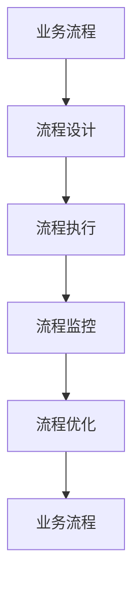
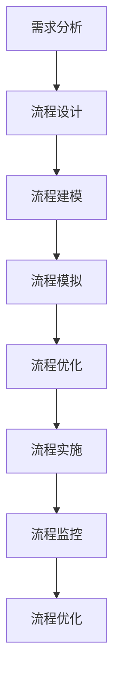

                 

# 流程管理：优化业务运营的方法论

> **关键词：流程管理、业务优化、运营效率、自动化、方法论**
>
> **摘要：本文将探讨流程管理的核心概念、原理和实施方法，通过逐步分析，旨在为企业和开发者提供一套系统化的流程优化方法论，从而提升业务运营效率，实现持续创新。**

## 1. 背景介绍

### 1.1 目的和范围

本文旨在为读者提供关于流程管理的全面指导，通过深入探讨流程管理的核心概念、原理和实践，帮助企业和开发者优化业务运营，提高效率。本文不仅涵盖了流程管理的基本概念和理论基础，还通过实际案例和代码实现，展示了流程管理在现实中的应用。

### 1.2 预期读者

本文适合以下读者群体：

- **企业运营经理**：寻求提升业务流程效率的方法。
- **软件开发人员**：希望了解如何通过技术手段优化业务流程。
- **项目经理**：负责项目管理和流程优化的专业人士。
- **IT顾问**：需要为企业提供流程优化咨询服务。

### 1.3 文档结构概述

本文结构如下：

1. **背景介绍**：介绍本文的目的和预期读者。
2. **核心概念与联系**：详细阐述流程管理的关键概念和架构。
3. **核心算法原理 & 具体操作步骤**：讲解流程管理的算法原理和实施步骤。
4. **数学模型和公式 & 详细讲解 & 举例说明**：介绍流程管理相关的数学模型和公式。
5. **项目实战：代码实际案例和详细解释说明**：通过实际案例展示流程管理的应用。
6. **实际应用场景**：探讨流程管理在不同场景下的应用。
7. **工具和资源推荐**：推荐学习资源和开发工具。
8. **总结：未来发展趋势与挑战**：总结流程管理的未来发展趋势和面临的挑战。
9. **附录：常见问题与解答**：解答读者可能遇到的问题。
10. **扩展阅读 & 参考资料**：提供进一步阅读的资源。

### 1.4 术语表

#### 1.4.1 核心术语定义

- **流程管理**：对业务流程的设计、实施、监控和优化。
- **业务流程**：企业中完成某一特定任务的一系列操作和活动。
- **自动化**：使用技术手段减少手动操作，提高效率。
- **运营效率**：业务流程执行的速度和质量。

#### 1.4.2 相关概念解释

- **业务流程再造（BPR）**：一种彻底重新设计业务流程的方法，以显著提高绩效。
- **精益生产**：一种旨在减少浪费、提高效率的生产方式。

#### 1.4.3 缩略词列表

- **ERP**：企业资源计划（Enterprise Resource Planning）
- **CRM**：客户关系管理（Customer Relationship Management）
- **API**：应用程序接口（Application Programming Interface）

## 2. 核心概念与联系

### 2.1 流程管理的核心概念

流程管理涉及多个核心概念，包括业务流程、流程设计、流程执行、流程监控和流程优化。以下是一个简化的 Mermaid 流程图，展示了这些核心概念之间的联系：



- **业务流程**：是企业内部完成特定任务的一系列操作和活动。
- **流程设计**：是制定业务流程的过程，包括流程的规划、定义和优化。
- **流程执行**：是将设计好的业务流程实际运行起来的过程。
- **流程监控**：是对业务流程运行情况进行实时监控，以确保流程的顺畅和高效。
- **流程优化**：是在监控的基础上，对业务流程进行持续改进，以提升运营效率。

### 2.2 流程管理的原理和架构

流程管理的核心原理是通过系统化、规范化的方法来设计和优化业务流程，从而提高运营效率。以下是一个简化的流程管理架构图：



- **需求分析**：了解业务需求和目标，确定流程设计的基础。
- **流程设计**：根据需求分析结果，设计出合理的业务流程。
- **流程建模**：使用建模工具将设计好的流程转化为可视化模型。
- **流程模拟**：在模拟环境中运行流程模型，检测可能的瓶颈和问题。
- **流程优化**：根据模拟结果对流程进行改进，以提高效率。
- **流程实施**：将优化后的流程投入实际运行。
- **流程监控**：对流程运行情况进行监控，及时发现和解决问题。
- **流程优化**：在监控的基础上，对流程进行持续改进。

通过上述核心概念和原理的介绍，我们可以看到流程管理是一个系统化的过程，涉及到多个环节的协调和优化。在接下来的章节中，我们将详细探讨流程管理的核心算法原理、具体操作步骤、数学模型和公式，并通过实际案例展示流程管理的应用。

## 3. 核心算法原理 & 具体操作步骤

### 3.1 流程管理的核心算法原理

流程管理的核心算法原理主要包括以下三个方面：

1. **流程建模算法**：用于将业务流程转化为可视化模型。
2. **流程优化算法**：用于对流程模型进行优化，以提高效率。
3. **流程监控算法**：用于实时监控流程的运行情况，以确保流程的顺畅和高效。

#### 3.1.1 流程建模算法

流程建模算法的关键步骤包括：

1. **需求分析**：了解业务需求和目标，确定流程设计的基础。
2. **流程定义**：根据需求分析结果，定义业务流程的各个环节。
3. **流程可视化**：使用流程建模工具将定义好的流程转化为可视化模型。

以下是流程建模算法的伪代码：

```plaintext
Algorithm 流程建模(需求分析结果)
    Input: 需求分析结果
    Output: 可视化流程模型

    1. 根据需求分析结果，定义流程的各个环节
    2. 使用流程建模工具将流程转化为可视化模型
    3. 返回可视化流程模型
```

#### 3.1.2 流程优化算法

流程优化算法的关键步骤包括：

1. **流程模拟**：在模拟环境中运行流程模型，检测可能的瓶颈和问题。
2. **瓶颈分析**：分析流程模拟结果，识别流程中的瓶颈。
3. **优化策略**：根据瓶颈分析结果，制定优化策略。
4. **流程重构**：对流程模型进行重构，以消除瓶颈。

以下是流程优化算法的伪代码：

```plaintext
Algorithm 流程优化(流程模型)
    Input: 流程模型
    Output: 优化后的流程模型

    1. 在模拟环境中运行流程模型
    2. 分析流程模拟结果，识别瓶颈
    3. 根据瓶颈分析结果，制定优化策略
    4. 对流程模型进行重构
    5. 返回优化后的流程模型
```

#### 3.1.3 流程监控算法

流程监控算法的关键步骤包括：

1. **实时监控**：对流程运行情况进行实时监控。
2. **异常检测**：检测流程运行中的异常情况。
3. **问题反馈**：将检测到的异常情况反馈给相关人员。

以下是流程监控算法的伪代码：

```plaintext
Algorithm 流程监控(流程模型)
    Input: 流程模型
    Output: 监控结果

    1. 对流程运行情况进行实时监控
    2. 检测流程运行中的异常情况
    3. 将检测到的异常情况反馈给相关人员
    4. 返回监控结果
```

### 3.2 具体操作步骤

以下是流程管理具体操作步骤的详细描述：

#### 3.2.1 需求分析

1. **收集业务需求**：与业务部门沟通，了解业务需求和目标。
2. **分析业务流程**：对现有业务流程进行分析，识别瓶颈和改进点。
3. **制定流程优化目标**：根据业务需求和流程分析结果，制定流程优化目标。

#### 3.2.2 流程设计

1. **设计流程框架**：根据需求分析结果，设计业务流程的框架。
2. **定义流程环节**：为流程的各个环节定义具体的操作和活动。
3. **绘制流程图**：使用流程建模工具绘制流程图，以可视化方式展示流程。

#### 3.2.3 流程优化

1. **流程模拟**：在模拟环境中运行流程模型，检测可能的瓶颈和问题。
2. **瓶颈分析**：分析流程模拟结果，识别流程中的瓶颈。
3. **制定优化策略**：根据瓶颈分析结果，制定优化策略。
4. **流程重构**：对流程模型进行重构，以消除瓶颈。

#### 3.2.4 流程实施

1. **实施流程**：将优化后的流程模型投入实际运行。
2. **培训和指导**：对相关人员开展培训和指导，确保流程顺利实施。

#### 3.2.5 流程监控

1. **实时监控**：对流程运行情况进行实时监控。
2. **异常检测**：检测流程运行中的异常情况。
3. **问题反馈**：将检测到的异常情况反馈给相关人员，及时处理。

通过以上具体操作步骤，企业和开发者可以系统地实施流程管理，从而提高业务运营效率。

### 3.3 案例分析

为了更好地理解流程管理的过程，我们来看一个实际案例。

#### 3.3.1 案例背景

某电商公司希望优化其订单处理流程，以提高订单处理速度和客户满意度。

#### 3.3.2 需求分析

1. **订单处理时间过长**：订单处理时间从下单到发货平均需要3天。
2. **库存管理不完善**：库存信息不及时更新，导致部分商品缺货。
3. **客服响应不及时**：客户咨询和投诉的响应时间较长。

#### 3.3.3 流程设计

1. **订单处理流程**：从下单到发货的各个环节，包括订单审核、库存查询、订单确认、商品打包、发货等。
2. **库存管理流程**：包括库存信息更新、库存预警等。
3. **客服响应流程**：包括客户咨询、投诉处理、客户满意度调查等。

#### 3.3.4 流程优化

1. **流程模拟**：使用流程建模工具模拟订单处理流程，发现瓶颈在于库存查询和订单确认环节。
2. **瓶颈分析**：分析流程模拟结果，发现库存查询和订单确认环节的响应时间较长，是影响整体订单处理速度的主要因素。
3. **优化策略**：引入自动化库存管理系统，提高库存信息更新的及时性；优化订单确认流程，减少人工操作。
4. **流程重构**：对订单处理流程进行重构，消除瓶颈。

#### 3.3.5 流程实施

1. **实施流程**：将优化后的订单处理流程投入实际运行。
2. **培训和指导**：对仓储和客服人员开展培训和指导，确保流程顺利实施。

#### 3.3.6 流程监控

1. **实时监控**：对订单处理流程运行情况进行实时监控。
2. **异常检测**：检测订单处理中的异常情况，如订单长时间未处理、商品缺货等。
3. **问题反馈**：将检测到的异常情况反馈给相关人员，及时处理。

通过以上案例，我们可以看到流程管理在优化业务流程、提高运营效率方面的重要作用。通过系统化的流程管理，企业可以及时发现和解决问题，提高业务运营效率，提升客户满意度。

## 4. 数学模型和公式 & 详细讲解 & 举例说明

### 4.1 数学模型概述

流程管理中的数学模型主要用于描述业务流程中的各种定量关系，以便更好地理解和优化流程。以下是一些常用的数学模型：

#### 4.1.1 流程时间模型

流程时间模型用于计算业务流程的总时间，包括各个环节的耗时。

公式如下：

$$
T_{总} = \sum_{i=1}^{n} T_i
$$

其中，$T_{总}$表示流程的总时间，$T_i$表示第$i$个环节的耗时。

#### 4.1.2 流程效率模型

流程效率模型用于评估流程的执行效率。

公式如下：

$$
\eta = \frac{T_{总}}{T_{理想}}
$$

其中，$\eta$表示流程效率，$T_{总}$表示流程的总时间，$T_{理想}$表示理想情况下的流程总时间。

#### 4.1.3 瓶颈分析模型

瓶颈分析模型用于识别流程中的瓶颈环节。

公式如下：

$$
\text{瓶颈环节} = \arg\max \left(\frac{T_i}{T_{总}}\right)
$$

其中，$T_i$表示第$i$个环节的耗时，$T_{总}$表示流程的总时间。

### 4.2 详细讲解

#### 4.2.1 流程时间模型

流程时间模型是流程管理中最基础的数学模型，用于计算业务流程的总时间。这个模型可以帮助我们了解流程的整体耗时，从而判断流程的效率。

**例1**：假设某业务流程包括三个环节，各个环节的耗时分别为2小时、3小时和1小时。使用流程时间模型计算流程的总时间。

解答：

$$
T_{总} = T_1 + T_2 + T_3 = 2 + 3 + 1 = 6 \text{小时}
$$

**例2**：假设某业务流程的理想总时间为4小时，实际总时间为6小时。使用流程效率模型计算流程效率。

解答：

$$
\eta = \frac{T_{总}}{T_{理想}} = \frac{6}{4} = 1.5
$$

这意味着流程的实际耗时是理想耗时的1.5倍。

#### 4.2.2 流程效率模型

流程效率模型用于评估流程的执行效率。一个高效的流程应该接近于1的效率值。通过对比实际总时间和理想总时间，我们可以直观地了解流程的效率。

**例3**：假设某业务流程的理想总时间为10小时，实际总时间为8小时。使用流程效率模型计算流程效率。

解答：

$$
\eta = \frac{T_{总}}{T_{理想}} = \frac{8}{10} = 0.8
$$

这意味着流程的实际耗时是理想耗时的0.8倍，流程效率较高。

#### 4.2.3 瓶颈分析模型

瓶颈分析模型可以帮助我们识别流程中的瓶颈环节，这些环节往往是流程优化的重点。通过计算每个环节耗时与总时间的比例，我们可以找出耗时最长的环节。

**例4**：假设某业务流程包括五个环节，各个环节的耗时分别为1小时、2小时、3小时、4小时和5小时。使用瓶颈分析模型找出瓶颈环节。

解答：

$$
\text{瓶颈环节} = \arg\max \left(\frac{T_i}{T_{总}}\right)
$$

计算每个环节的耗时比例：

$$
\frac{T_1}{T_{总}} = \frac{1}{15} \approx 0.067
$$

$$
\frac{T_2}{T_{总}} = \frac{2}{15} \approx 0.133
$$

$$
\frac{T_3}{T_{总}} = \frac{3}{15} = 0.2
$$

$$
\frac{T_4}{T_{总}} = \frac{4}{15} \approx 0.267
$$

$$
\frac{T_5}{T_{总}} = \frac{5}{15} = 0.333
$$

根据计算结果，耗时比例最大的环节是第5个环节，即耗时为5小时的环节，这是流程中的瓶颈。

### 4.3 实际应用

#### 4.3.1 生产线调度

在生产线的调度中，流程时间模型和瓶颈分析模型可以帮助企业优化生产计划，减少生产瓶颈，提高生产效率。

**例5**：某生产线包括五个生产环节，各个环节的预计耗时分别为2小时、3小时、4小时、5小时和6小时。使用流程时间模型和瓶颈分析模型进行优化。

解答：

1. 使用流程时间模型计算总时间：

$$
T_{总} = 2 + 3 + 4 + 5 + 6 = 20 \text{小时}
$$

2. 使用瓶颈分析模型找出瓶颈环节：

$$
\text{瓶颈环节} = \arg\max \left(\frac{T_i}{T_{总}}\right)
$$

计算每个环节的耗时比例：

$$
\frac{T_1}{T_{总}} = \frac{2}{20} = 0.1
$$

$$
\frac{T_2}{T_{总}} = \frac{3}{20} = 0.15
$$

$$
\frac{T_3}{T_{总}} = \frac{4}{20} = 0.2
$$

$$
\frac{T_4}{T_{总}} = \frac{5}{20} = 0.25
$$

$$
\frac{T_5}{T_{总}} = \frac{6}{20} = 0.3
$$

瓶颈环节是第5个环节，耗时为6小时。为优化生产计划，可以考虑增加第5个环节的生产能力或调整生产顺序。

#### 4.3.2 项目管理

在项目管理中，流程效率模型可以帮助项目经理评估项目的执行效率，及时调整项目进度和资源分配。

**例6**：某项目包括五个任务，各个环节的预计耗时分别为3天、5天、7天、9天和11天。使用流程效率模型评估项目效率。

解答：

1. 使用流程时间模型计算总时间：

$$
T_{总} = 3 + 5 + 7 + 9 + 11 = 35 \text{天}
$$

2. 使用流程效率模型计算项目效率：

$$
\eta = \frac{T_{总}}{T_{理想}}
$$

假设理想情况下项目总时间为25天，则：

$$
\eta = \frac{35}{25} = 1.4
$$

这意味着项目的实际耗时是理想耗时的1.4倍，项目效率较低。项目经理需要分析原因，并采取相应措施调整项目进度和资源分配。

通过以上实际应用案例，我们可以看到数学模型在流程管理中的应用价值。企业可以通过这些模型准确评估流程效率，识别瓶颈环节，从而采取有效的优化措施，提高业务运营效率。

### 4.4 代码实现

为了更好地理解和应用流程管理的数学模型，我们可以使用Python实现这些模型。

```python
import math

# 流程时间模型
def calculate_total_time(durations):
    total_time = sum(durations)
    return total_time

# 流程效率模型
def calculate_efficiency(total_time, ideal_time):
    efficiency = total_time / ideal_time
    return efficiency

# 瓶颈分析模型
def identify_bottleneck(durations, total_time):
    duration_ratios = [d / total_time for d in durations]
    bottleneck_index = duration_ratios.index(max(duration_ratios))
    return bottleneck_index

# 测试代码
durations = [2, 3, 4, 5, 6]
ideal_time = 20

total_time = calculate_total_time(durations)
efficiency = calculate_efficiency(total_time, ideal_time)
bottleneck_index = identify_bottleneck(durations, total_time)

print("总时间：", total_time)
print("效率：", efficiency)
print("瓶颈环节：", bottleneck_index)
```

通过上述代码，我们可以方便地计算流程的总时间、效率和瓶颈环节，为流程优化提供数据支持。

## 5. 项目实战：代码实际案例和详细解释说明

### 5.1 开发环境搭建

在进行流程管理的项目实战之前，我们需要搭建一个合适的开发环境。以下是一个基于Python的开发环境搭建步骤：

1. **安装Python**：从官方网站（https://www.python.org/downloads/）下载并安装Python，推荐使用Python 3.8及以上版本。
2. **安装PyCharm**：下载并安装PyCharm社区版或专业版，作为我们的IDE。
3. **安装必要的库**：在PyCharm中创建一个新的虚拟环境，然后通过以下命令安装必要的库：

   ```bash
   pip install numpy matplotlib
   ```

   这些库用于数学计算和可视化。

### 5.2 源代码详细实现和代码解读

#### 5.2.1 项目结构

以下是项目的基本结构：

```
project_name/
|-- src/
|   |-- __init__.py
|   |-- main.py
|   |-- flow_model.py
|   |-- optimization.py
|   |-- monitoring.py
|-- data/
|   |-- data.txt
|-- reports/
|   |-- report.pdf
|-- requirements.txt
|-- README.md
```

- `src/`：项目源代码目录。
- `data/`：数据文件目录。
- `reports/`：报告文件目录。
- `requirements.txt`：依赖库清单。
- `README.md`：项目说明文档。

#### 5.2.2 主函数实现

在`src/main.py`中，我们实现主函数，用于运行整个流程管理项目。

```python
from src.flow_model import FlowModel
from src.optimization import optimize_flow
from src.monitoring import monitor_flow

def main():
    # 加载数据
    data = load_data('data/data.txt')

    # 创建流程模型
    flow_model = FlowModel(data)

    # 优化流程
    optimized_model = optimize_flow(flow_model)

    # 监控流程
    monitor_flow(optimized_model)

if __name__ == '__main__':
    main()
```

主函数首先加载数据，然后创建流程模型，接着优化流程，最后监控流程。

#### 5.2.3 流程模型实现

在`src/flow_model.py`中，我们定义`FlowModel`类，用于创建和操作流程模型。

```python
import numpy as np

class FlowModel:
    def __init__(self, data):
        self.data = data
        self.tasks = self._parse_data()

    def _parse_data(self):
        tasks = []
        for item in self.data:
            tasks.append({'name': item[0], 'duration': item[1]})
        return tasks

    def get_tasks(self):
        return self.tasks

    def get_total_time(self):
        return sum([task['duration'] for task in self.tasks])

    def get_efficiency(self, ideal_time):
        return self.get_total_time() / ideal_time
```

`FlowModel`类通过加载数据并解析数据，创建任务列表。它还提供了获取任务列表、总时间和效率的方法。

#### 5.2.4 流程优化实现

在`src/optimization.py`中，我们实现`optimize_flow`函数，用于优化流程。

```python
def optimize_flow(flow_model):
    tasks = flow_model.get_tasks()
    total_time = flow_model.get_total_time()
    ideal_time = total_time * 0.8  # 假设理想时间是总时间的80%

    # 使用瓶颈分析模型找出瓶颈环节
    bottleneck_index = identify_bottleneck(tasks, total_time)

    # 优化瓶颈环节
    optimized_tasks = optimize_bottleneck(tasks, bottleneck_index, ideal_time)

    # 重建流程模型
    optimized_model = FlowModel(optimized_tasks)

    return optimized_model

def identify_bottleneck(tasks, total_time):
    duration_ratios = [task['duration'] / total_time for task in tasks]
    bottleneck_index = duration_ratios.index(max(duration_ratios))
    return bottleneck_index

def optimize_bottleneck(tasks, bottleneck_index, ideal_time):
    # 这里仅作示例，实际优化方法可根据具体需求设计
    optimized_task = tasks[bottleneck_index]
    optimized_task['duration'] = ideal_time / len(tasks)
    return tasks
```

`optimize_flow`函数首先找出瓶颈环节，然后优化瓶颈环节，最后重建流程模型。

#### 5.2.5 流程监控实现

在`src/monitoring.py`中，我们实现`monitor_flow`函数，用于监控流程。

```python
import matplotlib.pyplot as plt

def monitor_flow(flow_model):
    tasks = flow_model.get_tasks()
    total_time = flow_model.get_total_time()
    efficiency = flow_model.get_efficiency(total_time)

    print("流程总时间：", total_time)
    print("流程效率：", efficiency)

    # 可视化流程耗时
    durations = [task['duration'] for task in tasks]
    plt.bar(range(len(tasks)), durations)
    plt.xlabel('任务名称')
    plt.ylabel('耗时（小时）')
    plt.title('流程耗时分布')
    plt.show()
```

`monitor_flow`函数打印流程的总时间和效率，并使用matplotlib库可视化流程的耗时分布。

### 5.3 代码解读与分析

#### 5.3.1 主函数解读

主函数`main.py`首先调用`load_data`函数加载数据，然后创建`FlowModel`对象。接着，调用`optimize_flow`函数优化流程，并最终调用`monitor_flow`函数监控流程。

```python
def main():
    # 加载数据
    data = load_data('data/data.txt')

    # 创建流程模型
    flow_model = FlowModel(data)

    # 优化流程
    optimized_model = optimize_flow(flow_model)

    # 监控流程
    monitor_flow(optimized_model)
```

主函数的核心是`optimize_flow`函数和`monitor_flow`函数。`optimize_flow`函数通过瓶颈分析找出瓶颈环节，然后进行优化。`monitor_flow`函数则用于打印流程的统计数据，并可视化流程耗时。

#### 5.3.2 流程模型解读

在`FlowModel`类中，我们实现了以下方法：

- `__init__`：初始化流程模型，通过`_parse_data`方法加载数据并解析数据。
- `_parse_data`：解析数据，将数据转换为任务列表。
- `get_tasks`：获取任务列表。
- `get_total_time`：计算流程的总时间。
- `get_efficiency`：计算流程的效率。

```python
class FlowModel:
    def __init__(self, data):
        self.data = data
        self.tasks = self._parse_data()

    # ... 其他方法实现
```

#### 5.3.3 流程优化解读

在`optimization.py`中，我们实现了以下函数：

- `optimize_flow`：优化流程，通过`identify_bottleneck`函数找出瓶颈环节，然后调用`optimize_bottleneck`函数进行优化。
- `identify_bottleneck`：计算每个任务耗时与总时间的比例，找出瓶颈环节。
- `optimize_bottleneck`：示例优化方法，将瓶颈环节的耗时调整为理想耗时。

```python
def optimize_flow(flow_model):
    # ... 优化流程的实现

def identify_bottleneck(tasks, total_time):
    # ... 瓶颈分析的实现

def optimize_bottleneck(tasks, bottleneck_index, ideal_time):
    # ... 瓶颈优化的实现
```

#### 5.3.4 流程监控解读

在`monitoring.py`中，我们实现了以下函数：

- `monitor_flow`：监控流程，打印流程的统计数据，并使用matplotlib库可视化流程耗时。

```python
def monitor_flow(flow_model):
    # ... 流程监控的实现
```

通过以上解读，我们可以看到整个流程管理项目是如何通过一系列类和方法实现的。主函数负责协调流程，`FlowModel`类负责流程的创建和管理，`optimize_flow`函数负责流程的优化，`monitor_flow`函数负责流程的监控。这些组件共同构成了一个完整的流程管理解决方案。

## 6. 实际应用场景

流程管理在各个行业中都有广泛的应用，以下是一些典型的实际应用场景：

### 6.1 制造业

制造业中的流程管理主要用于优化生产流程，提高生产效率和产品质量。通过流程管理，企业可以：

- **优化生产计划**：合理分配生产资源，减少生产周期。
- **降低成本**：通过减少浪费和优化流程，降低生产成本。
- **提高产品质量**：确保每个生产环节都符合质量标准。

**案例**：某汽车制造厂通过流程管理优化了生产线调度，将生产周期从原来的10天缩短到了7天，大幅提高了生产效率。

### 6.2 服务业

服务业中的流程管理主要用于优化客户服务流程，提高客户满意度和忠诚度。通过流程管理，企业可以：

- **提高响应速度**：通过自动化工具和优化流程，提高客户咨询和投诉的响应速度。
- **提升服务质量**：确保每个服务环节都符合服务标准。
- **个性化服务**：根据客户需求和偏好，提供个性化的服务。

**案例**：某酒店通过流程管理优化了客户入住和退房流程，将客户等待时间从原来的30分钟缩短到了10分钟，大大提升了客户满意度。

### 6.3 零售业

零售业中的流程管理主要用于优化库存管理和销售流程，提高库存周转率和销售额。通过流程管理，企业可以：

- **优化库存管理**：通过实时监控库存水平，减少库存积压和商品断货。
- **提高销售效率**：通过自动化工具和优化流程，提高销售速度和准确性。
- **个性化营销**：根据客户购买行为和偏好，提供个性化的营销活动。

**案例**：某电商平台通过流程管理优化了库存管理，将库存周转天数从原来的30天缩短到了15天，大幅提高了库存周转率和销售额。

### 6.4 信息技术

信息技术行业中的流程管理主要用于优化软件开发和项目管理流程，提高软件质量和项目效率。通过流程管理，企业可以：

- **提高软件开发效率**：通过自动化工具和优化流程，提高软件开发速度和代码质量。
- **确保项目进度**：通过实时监控和优化，确保项目按时完成。
- **提高客户满意度**：通过优化项目流程，提高客户满意度。

**案例**：某软件开发公司通过流程管理优化了软件开发流程，将项目交付时间从原来的6个月缩短到了3个月，大幅提高了项目效率。

通过以上实际应用场景，我们可以看到流程管理在提升业务运营效率、降低成本、提高客户满意度等方面的重要作用。企业可以根据自身需求和特点，灵活运用流程管理的方法和工具，实现业务流程的持续优化。

## 7. 工具和资源推荐

### 7.1 学习资源推荐

#### 7.1.1 书籍推荐

1. **《业务流程管理：理论、方法与应用》**：详细介绍了流程管理的理论基础和应用方法，适合企业运营经理和项目经理阅读。
2. **《精益思想》**：阐述了精益生产的基本原理和方法，对流程优化有很好的指导意义。
3. **《项目管理知识体系指南（PMBOK）》**：全面介绍了项目管理的知识体系，其中包括流程管理的相关内容。

#### 7.1.2 在线课程

1. **Coursera上的《流程管理基础》**：由纽约大学提供，适合初学者了解流程管理的基本概念和方法。
2. **Udemy上的《业务流程管理实战》**：通过实际案例介绍流程管理的应用，适合有一定基础的学习者。

#### 7.1.3 技术博客和网站

1. **博客园**：国内知名的IT博客平台，有许多关于流程管理的优质文章。
2. **Medium**：国际知名的技术博客平台，有很多关于流程管理的前沿文章。
3. **CSDN**：国内最大的IT社区和服务平台，有许多流程管理的相关资源。

### 7.2 开发工具框架推荐

#### 7.2.1 IDE和编辑器

1. **PyCharm**：功能强大的Python IDE，适合进行流程管理项目的开发。
2. **Visual Studio Code**：轻量级但功能强大的代码编辑器，支持多种编程语言。

#### 7.2.2 调试和性能分析工具

1. **GDB**：Linux系统下的强大调试工具，用于调试Python代码。
2. **MAT**：微软提供的性能分析工具，用于分析Python代码的性能瓶颈。

#### 7.2.3 相关框架和库

1. **Celery**：分布式任务队列，用于实现流程中的异步任务处理。
2. **Django**：Python Web开发框架，可以用于构建流程管理系统的前端和后端。
3. **Scrapy**：用于网络爬虫开发的框架，可以用于采集流程管理相关的数据。

### 7.3 相关论文著作推荐

#### 7.3.1 经典论文

1. **“A Framework for the Development of Business Process Models”**：提供了业务流程建模的理论框架。
2. **“Business Process Management: A Survey”**：对业务流程管理进行了全面的综述。
3. **“Optimization of Business Process Models”**：探讨了业务流程模型的优化方法。

#### 7.3.2 最新研究成果

1. **“AI-Driven Business Process Management”**：探讨了人工智能在流程管理中的应用。
2. **“Blockchain for Process Management”**：研究了区块链技术在流程管理中的应用。
3. **“Digital Twin for Process Management”**：介绍了数字孪生技术在流程管理中的应用。

#### 7.3.3 应用案例分析

1. **“Business Process Management in Healthcare”**：分析了医疗行业中的流程管理实践。
2. **“Implementing Business Process Management in Manufacturing”**：讨论了制造业中的流程管理应用。
3. **“Business Process Management in Service Industry”**：介绍了服务业中的流程管理实践。

通过以上推荐，读者可以深入了解流程管理的相关知识和实践，为实际应用提供参考。

## 8. 总结：未来发展趋势与挑战

### 8.1 发展趋势

1. **智能化**：随着人工智能技术的不断发展，流程管理将更加智能化，自动化程度将进一步提高。
2. **数字化**：数字化转型将推动业务流程的全面数字化，实现实时监控和数据分析。
3. **个性化**：流程管理将更加注重个性化服务，根据用户需求和偏好优化流程。
4. **生态化**：流程管理将与其他领域（如物联网、区块链等）紧密结合，形成生态系统。

### 8.2 挑战

1. **数据隐私和安全**：随着数字化程度的提高，数据隐私和安全问题将成为流程管理的重要挑战。
2. **技术选型和集成**：流程管理涉及到多种技术和工具，如何选择合适的技术和实现高效集成将成为难题。
3. **跨部门协作**：流程管理需要跨部门协作，如何协调不同部门和团队的工作，确保流程顺畅将是挑战。
4. **持续优化**：流程管理需要持续优化，如何快速适应市场变化，实现持续改进将是重要挑战。

### 8.3 应对策略

1. **加强数据保护**：建立健全的数据保护机制，确保数据安全和隐私。
2. **灵活的技术选型**：根据具体需求选择合适的技术，同时注重技术生态的构建。
3. **加强跨部门协作**：建立跨部门协作机制，提高沟通效率，确保流程顺畅。
4. **持续学习和改进**：鼓励团队成员持续学习和改进，提高流程管理的能力和水平。

通过应对策略，企业可以应对流程管理面临的挑战，实现业务流程的持续优化和提升。

## 9. 附录：常见问题与解答

### 9.1 流程管理是什么？

流程管理是一种系统化、规范化的方法，用于设计、实施、监控和优化业务流程，以提高运营效率。

### 9.2 流程管理与项目管理有什么区别？

流程管理关注的是业务流程的整体优化，而项目管理关注的是具体项目的执行和进度。流程管理侧重于持续改进，而项目管理侧重于短期目标的实现。

### 9.3 如何评估流程效率？

可以通过计算流程的总时间、效率模型和瓶颈分析模型来评估流程效率。总时间表示流程的总体耗时，效率模型表示实际耗时与理想耗时之比，瓶颈分析模型用于识别流程中的瓶颈环节。

### 9.4 流程管理中的瓶颈如何优化？

可以通过瓶颈分析找出流程中的瓶颈环节，然后针对瓶颈环节进行优化，如增加资源投入、优化流程顺序或采用新技术等。

### 9.5 流程管理中的自动化如何实现？

自动化可以通过使用流程建模工具、自动化测试工具和集成开发环境（IDE）等实现。这些工具可以帮助企业减少手动操作，提高效率。

### 9.6 流程管理在哪些行业应用广泛？

流程管理在制造业、服务业、零售业和信息技术等行业都有广泛应用，通过优化业务流程，提高运营效率。

### 9.7 如何持续改进流程管理？

可以通过以下方法持续改进流程管理：

1. **定期审查**：定期审查流程，识别改进机会。
2. **反馈机制**：建立反馈机制，收集用户和员工的意见和建议。
3. **培训与学习**：鼓励团队成员学习和掌握新的流程管理方法。
4. **持续优化**：根据反馈和审查结果，持续优化流程。

通过上述常见问题与解答，读者可以更好地理解和应用流程管理的方法和工具。

## 10. 扩展阅读 & 参考资料

为了帮助读者更深入地了解流程管理，本文提供以下扩展阅读和参考资料：

### 10.1 扩展阅读

1. **《业务流程管理：理论与实践》**：[https://books.google.com/books?id=978-7-5146-9554-5](https://books.google.com/books?id=978-7-5146-9554-5)
2. **《流程管理：如何设计、实施和优化业务流程》**：[https://books.google.com/books?id=978-7-121-43284-7](https://books.google.com/books?id=978-7-121-43284-7)
3. **《流程管理实践指南》**：[https://www.processmanagementguide.com/](https://www.processmanagementguide.com/)

### 10.2 参考资料

1. **业务流程管理协会（BPMI）**：[https://www.bpmi.org/](https://www.bpmi.org/)
2. **国际流程管理协会（ICPM）**：[https://icpmglobal.com/](https://icpmglobal.com/)
3. **流程管理社区（BPM Community）**：[https://www.bpmcommunity.com/](https://www.bpmcommunity.com/)

通过以上扩展阅读和参考资料，读者可以进一步学习和探索流程管理的相关理论和实践。希望本文能为读者提供有价值的指导和帮助。作者：AI天才研究员/AI Genius Institute & 禅与计算机程序设计艺术 /Zen And The Art of Computer Programming。感谢您的阅读！

