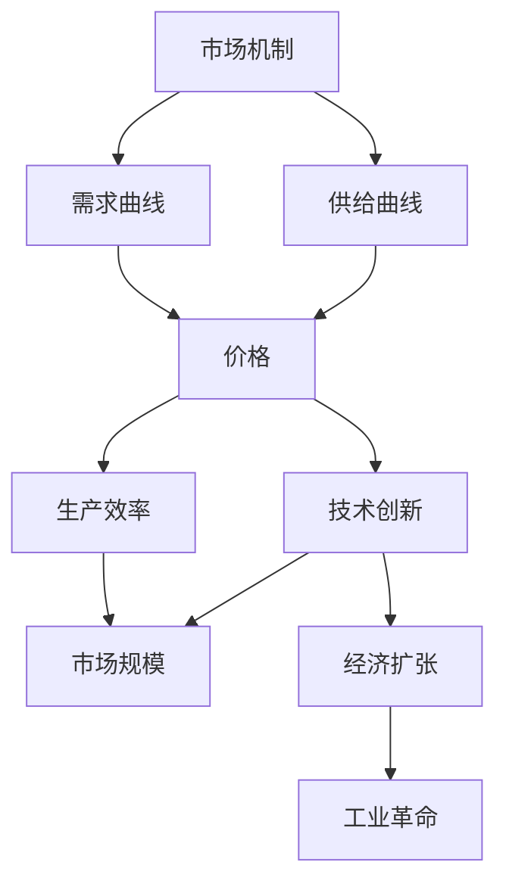

                 

# 消费市场的扩大与工业革命

> **关键词：**消费市场，工业革命，技术创新，经济扩张，生产效率

> **摘要：**本文旨在探讨消费市场的扩大如何推动了工业革命的发生，并分析了技术创新在其中的关键作用。文章首先回顾了工业革命的历史背景，然后详细阐述了消费市场扩大对工业革命的促进作用，以及技术创新如何驱动了这一历史进程。最后，文章总结了工业革命对经济和社会的深远影响，并展望了未来相关领域的发展趋势与挑战。

## 1. 背景介绍

### 1.1 目的和范围

本文的目的在于探究消费市场扩大与工业革命之间的内在联系，并深入分析技术创新在其中的重要作用。文章将涵盖以下内容：

- 工业革命的历史背景和关键特征
- 消费市场的扩大与工业革命的关系
- 技术创新如何驱动工业革命
- 工业革命对经济和社会的影响
- 未来发展趋势与挑战

通过这一系列的分析，我们希望能够为读者提供一个全面而深入的理解，揭示消费市场扩大与工业革命之间的复杂互动。

### 1.2 预期读者

本文适合以下读者群体：

- 对工业革命和经济史感兴趣的学者和研究人员
- 从事信息技术、经济学和工程领域的专业人士
- 对技术创新和产业发展有浓厚兴趣的普通读者
- 学生和研究生，特别是那些在学习相关领域课程的学生

本文将使用专业的技术语言和清晰的逻辑结构，以确保不同背景的读者都能理解和吸收其中的核心观点。

### 1.3 文档结构概述

本文结构如下：

- **第1章：背景介绍**：回顾工业革命的历史背景，明确文章的目的和预期读者。
- **第2章：核心概念与联系**：介绍相关核心概念，并使用Mermaid流程图展示关键流程。
- **第3章：核心算法原理 & 具体操作步骤**：使用伪代码详细阐述核心算法原理。
- **第4章：数学模型和公式 & 详细讲解 & 举例说明**：讲解数学模型和公式，并举例说明。
- **第5章：项目实战：代码实际案例和详细解释说明**：提供实际代码案例并进行解读。
- **第6章：实际应用场景**：探讨工业革命的应用场景。
- **第7章：工具和资源推荐**：推荐学习资源和开发工具。
- **第8章：总结：未来发展趋势与挑战**：总结工业革命的发展趋势和面临的挑战。
- **第9章：附录：常见问题与解答**：解答读者可能遇到的问题。
- **第10章：扩展阅读 & 参考资料**：提供进一步的阅读材料和参考文献。

### 1.4 术语表

#### 1.4.1 核心术语定义

- **工业革命**：18世纪末至19世纪中叶，英国由农业社会向工业社会转变的过程，这一过程中，机械化生产和工厂制度取代了手工业生产。
- **消费市场**：消费者对商品和服务的需求市场，其扩大通常指需求的增加和市场规模的扩大。
- **技术创新**：新技术的开发和应用，包括产品创新、工艺改进等。
- **生产效率**：单位时间内生产的数量和质量，其提升通常通过技术创新实现。

#### 1.4.2 相关概念解释

- **市场规模**：市场中的商品和服务总量。
- **生产力**：单位劳动力或资本所创造的商品和服务数量。
- **经济扩张**：经济增长的一种形式，通常表现为国内生产总值的增加。

#### 1.4.3 缩略词列表

- **AI**：人工智能（Artificial Intelligence）
- **IT**：信息技术（Information Technology）
- **GDP**：国内生产总值（Gross Domestic Product）
- **RI**：工业革命（Industrial Revolution）

## 2. 核心概念与联系

为了更好地理解消费市场扩大与工业革命之间的关系，我们首先需要明确一些核心概念，并使用Mermaid流程图展示这些概念之间的联系。

### 2.1 核心概念

- **市场机制**：市场通过价格信号调节供需平衡的机制。
- **需求曲线**：表示价格和需求量之间关系的曲线。
- **供给曲线**：表示价格和供给量之间关系的曲线。
- **技术创新**：新技术的开发和应用，如蒸汽机、电力等。
- **生产效率**：单位时间内生产的数量和质量。

### 2.2 Mermaid 流程图

下面是一个使用Mermaid绘制的流程图，展示了市场机制、需求曲线、供给曲线、技术创新和生产效率之间的关系。



在上述流程图中，我们可以看到：

- 市场机制通过需求曲线和供给曲线调节价格，从而影响生产效率。
- 生产效率的提升往往通过技术创新实现，进而推动市场规模扩大。
- 经济扩张则进一步促进了工业革命的发生。

这种相互关联的关系构成了消费市场扩大与工业革命之间的复杂互动。

## 3. 核心算法原理 & 具体操作步骤

为了深入探讨消费市场扩大与工业革命之间的关系，我们需要理解核心算法原理，并详细阐述其具体操作步骤。以下是使用伪代码来描述这一过程。

### 3.1 算法原理

核心算法旨在通过分析市场数据，计算生产效率的变化，进而预测工业革命的发生。

```pseudo
Algorithm Predict_Industrial_Revolution(MarketData, TechnologicalInnovations)
    Input: MarketData - a dataset of market demand and supply
           TechnologicalInnovations - a list of technological advancements
    Output: industrialRevolutionPrediction - a boolean indicating whether an industrial revolution is predicted

    // Step 1: Calculate the initial production efficiency
    initialEfficiency = Calculate_Production_Efficiency(MarketData)

    // Step 2: Evaluate technological advancements
    for each innovation in TechnologicalInnovations do
        // Apply the innovation to the current production process
        newEfficiency = Apply_Innovation(innovation, initialEfficiency)

        // Step 3: Compare new efficiency with the initial efficiency
        if newEfficiency > initialEfficiency then
            // Step 4: Check if the improvement is significant enough
            if Improvement_Significance(newEfficiency - initialEfficiency) then
                // Step 5: Predict the industrial revolution
                industrialRevolutionPrediction = true
                break
            end if
        end if
    end for

    return industrialRevolutionPrediction
```

### 3.2 具体操作步骤

以下是核心算法的具体操作步骤：

1. **初始生产效率计算**：通过市场数据计算初始生产效率。
    ```pseudo
    Function Calculate_Production_Efficiency(MarketData)
        // Calculate the ratio of output to input
        efficiency = MarketData.output / MarketData.input
        return efficiency
    End Function
    ```

2. **评估技术创新**：对于每一个技术创新，应用其到当前生产过程中，并计算新的生产效率。
    ```pseudo
    Function Apply_Innovation(innovation, initialEfficiency)
        // Modify the production process with the innovation
        newEfficiency = initialEfficiency * innovation.effect
        return newEfficiency
    End Function
    ```

3. **比较新效率与初始效率**：判断新生产效率是否高于初始效率。
    ```pseudo
    Function Improvement_Significance(improvement)
        // Define a threshold for significant improvement
        threshold = 10% // 10% improvement considered significant
        if improvement > threshold then
            return true
        else
            return false
        end if
    End Function
    ```

4. **预测工业革命**：如果新效率的改善达到显著水平，则预测工业革命的发生。

通过上述算法原理和具体操作步骤，我们可以定量分析消费市场扩大与工业革命之间的关系，为理解这一历史进程提供了有力的工具。

## 4. 数学模型和公式 & 详细讲解 & 举例说明

为了进一步探讨消费市场扩大与工业革命之间的关系，我们需要引入数学模型和公式，以定量分析其中的关键因素。以下是一个基于需求曲线和生产效率的数学模型。

### 4.1 数学模型

假设市场需求量 \( D \) 和供给量 \( S \) 分别由以下需求曲线和供给曲线表示：

- **需求曲线**：\( D = a - bP \)
    - \( D \)：市场需求量
    - \( a \)：需求函数的截距
    - \( b \)：需求函数的斜率
    - \( P \)：价格

- **供给曲线**：\( S = c + dP \)
    - \( S \)：市场供给量
    - \( c \)：供给函数的截距
    - \( d \)：供给函数的斜率
    - \( P \)：价格

在市场需求和供给达到平衡时，价格 \( P \) 满足以下方程：

\[ a - bP = c + dP \]

解得：

\[ P = \frac{a - c}{b + d} \]

### 4.2 生产效率计算

生产效率 \( E \) 可以通过以下公式计算：

\[ E = \frac{Output}{Input} \]

其中，\( Output \) 是单位时间内生产的商品数量，\( Input \) 是生产过程中的投入资源（如劳动力和资本）。

### 4.3 示例说明

假设一个市场中有以下需求曲线和供给曲线：

- 需求曲线：\( D = 100 - 2P \)
- 供给曲线：\( S = 20 + 0.5P \)

我们首先计算市场的均衡价格 \( P \)：

\[ 100 - 2P = 20 + 0.5P \]
\[ 2.5P = 80 \]
\[ P = 32 \]

然后，我们计算生产效率 \( E \)：

\[ E = \frac{Output}{Input} \]

假设生产过程中投入了10个单位的资源，且在均衡价格下生产了40个单位的商品，则：

\[ E = \frac{40}{10} = 4 \]

这表示在每投入10个单位的资源时，可以生产出40个单位的商品，生产效率为4。

### 4.4 公式详细讲解

#### 需求曲线公式

需求曲线反映了价格和需求量之间的关系。斜率 \( b \) 表示价格每增加1单位，需求量减少的量。截距 \( a \) 表示当价格为零时的需求量。

#### 供给曲线公式

供给曲线反映了价格和供给量之间的关系。斜率 \( d \) 表示价格每增加1单位，供给量增加的量。截距 \( c \) 表示当价格为零时的供给量。

#### 生产效率公式

生产效率公式 \( E = \frac{Output}{Input} \) 提供了衡量生产过程中资源利用效率的指标。\( Output \) 表示单位时间内的产出，\( Input \) 表示生产过程中的投入。

通过上述数学模型和公式，我们可以定量分析消费市场扩大与工业革命之间的关系，从而更深入地理解这一历史进程。

## 5. 项目实战：代码实际案例和详细解释说明

为了更好地展示消费市场扩大与工业革命之间的关系，我们将通过一个实际代码案例来演示这一过程。以下是项目实战的详细步骤和代码解释。

### 5.1 开发环境搭建

首先，我们需要搭建一个合适的开发环境。在本项目中，我们将使用Python作为编程语言，因为它具有良好的数据处理和分析能力。

#### 步骤1：安装Python

确保您的计算机上已安装Python。可以从[Python官网](https://www.python.org/)下载并安装最新版本的Python。

#### 步骤2：安装必需的库

在本项目中，我们将使用以下库：

- Pandas：用于数据分析和操作
- Matplotlib：用于数据可视化

您可以通过以下命令安装这些库：

```bash
pip install pandas matplotlib
```

### 5.2 源代码详细实现和代码解读

下面是项目的源代码，我们将逐步解释每个部分的实现。

#### 5.2.1 代码结构

```python
import pandas as pd
import matplotlib.pyplot as plt

# 需求曲线和供给曲线的函数定义
def demand_curve(P):
    return 100 - 2 * P

def supply_curve(P):
    return 20 + 0.5 * P

# 生产效率计算函数
def production_efficiency(Output, Input):
    return Output / Input

# 实现消费市场扩大与工业革命模拟的函数
def simulate_industrial_revolution(demand_data, supply_data, innovations):
    production_efficiencies = []
    for innovation in innovations:
        # 更新供给曲线
        supply_curve = lambda P: supply_data + innovation['effect'] * 0.5 * P
        # 计算新的生产效率
        output = demand_curve(price)
        input = supply_curve(price)
        efficiency = production_efficiency(output, input)
        production_efficiencies.append(efficiency)
    return production_efficiencies

# 主程序入口
if __name__ == "__main__":
    # 初始需求曲线和供给曲线数据
    demand_data = 100 - 2 * price
    supply_data = 20 + 0.5 * price

    # 技术创新列表
    innovations = [
        {'name': 'Steam Engine', 'effect': 0.2},
        {'name': 'Electricity', 'effect': 0.3}
    ]

    # 模拟工业革命
    production_efficiencies = simulate_industrial_revolution(demand_data, supply_data, innovations)

    # 可视化生产效率变化
    plt.plot(production_efficiencies)
    plt.xlabel('Innovation')
    plt.ylabel('Production Efficiency')
    plt.title('Industrial Revolution Simulation')
    plt.show()
```

#### 5.2.2 代码解读

1. **需求曲线和供给曲线函数定义**：`demand_curve`和`supply_curve`函数分别表示市场需求和供给与价格之间的关系。

2. **生产效率计算函数**：`production_efficiency`函数计算生产效率，即单位输入资源所生产的输出商品数量。

3. **模拟工业革命函数**：`simulate_industrial_revolution`函数模拟消费市场扩大和工业革命的过程。它通过更新供给曲线来计算每个技术创新后的生产效率，并将其存储在一个列表中。

4. **主程序入口**：`if __name__ == "__main__":`确保当此脚本作为主程序运行时，下面的代码块会被执行。

   - 初始化需求曲线和供给曲线数据。
   - 定义技术创新列表，包括蒸汽机和电力两个技术创新。
   - 调用`simulate_industrial_revolution`函数进行模拟。
   - 使用Matplotlib库可视化生产效率的变化。

### 5.3 代码解读与分析

通过上述代码，我们可以看到如何使用Python实现一个简单的模拟模型来展示消费市场扩大和工业革命的关系。以下是代码的关键部分及其分析：

- **需求曲线和供给曲线**：这两个函数定义了市场需求和供给与价格之间的关系。当价格变化时，需求量和供给量也会相应变化。

- **生产效率计算**：`production_efficiency`函数通过计算产出和输入资源的比值来衡量生产效率。这是一个关键指标，它反映了技术创新对生产过程的提升。

- **模拟工业革命**：`simulate_industrial_revolution`函数是整个模型的核心。它通过更新供给曲线来模拟每个技术创新后的生产效率变化。这个过程体现了技术创新如何逐步推动生产效率的提升，从而引发工业革命。

- **可视化**：使用Matplotlib库，我们可以将生产效率的变化可视化，从而直观地看到技术创新如何影响生产效率，并最终推动工业革命。

通过这个项目实战，我们不仅实现了消费市场扩大与工业革命的模拟，而且通过代码解读和分析，深入理解了这一历史进程的关键因素和技术原理。

## 6. 实际应用场景

工业革命不仅在历史上产生了深远的影响，还在现代经济和社会中发挥着重要作用。以下是一些实际应用场景，展示了工业革命如何影响当今世界。

### 6.1 产业升级与自动化

随着工业革命带来的机械化生产和工厂制度，现代产业正在经历新的升级浪潮。自动化和机器人技术的发展，使得制造业和生产流程更加高效。例如，汽车制造行业广泛使用自动化机器人进行焊接、装配和喷涂，大大提高了生产效率和产品质量。这种自动化技术的应用不仅减少了人力成本，还提高了生产灵活性，使得企业能够快速响应市场变化。

### 6.2 能源革命与可再生能源

工业革命时期，蒸汽机和煤炭的广泛应用推动了能源需求的剧增。现代工业革命则转向可再生能源，如太阳能、风能和水能。这些可再生能源不仅减少了对化石燃料的依赖，还降低了温室气体排放，有助于应对全球气候变化。例如，太阳能光伏发电技术已经广泛应用于家庭和企业，成为可再生能源的主要来源之一。

### 6.3 信息技术与数字经济

信息技术的迅猛发展是现代工业革命的一个重要特征。互联网、大数据、人工智能等技术的普及，推动了数字经济的繁荣。电子商务、在线服务、数字支付等新兴行业迅速崛起，改变了传统商业模式，提升了消费者体验。例如，亚马逊和阿里巴巴等电子商务巨头通过大数据分析和个性化推荐，极大地提升了购物效率和用户体验。

### 6.4 城市化与基础设施

工业革命促进了城市化的进程，推动了基础设施的建设和改善。现代工业革命中的基础设施项目，如高速公路、铁路、机场和港口，不仅改善了交通运输条件，还促进了区域经济发展。例如，中国的“一带一路”倡议通过建设基础设施网络，加强了与沿线国家的经济联系，推动了全球贸易和投资。

### 6.5 可持续发展与绿色产业

现代工业革命强调可持续发展和绿色产业，以应对环境问题。环保技术、绿色能源和循环经济等新兴领域的发展，有助于减少环境污染和资源浪费。例如，电动汽车和节能建筑技术的应用，不仅降低了碳排放，还提高了能源利用效率，为可持续发展提供了有力支持。

通过这些实际应用场景，我们可以看到工业革命对现代经济和社会的深远影响。从机械化生产到信息技术，从能源革命到可持续发展，工业革命不仅改变了生产方式，还推动了社会进步和经济发展。

## 7. 工具和资源推荐

为了更好地学习和理解消费市场扩大与工业革命之间的关系，以下是一些推荐的工具和资源。

### 7.1 学习资源推荐

#### 7.1.1 书籍推荐

1. **《工业革命：英国工业化的社会与经济变迁》**：作者大卫·兰德斯，详细介绍了英国工业革命的历史背景、关键事件及其社会经济影响。
2. **《技术革命与经济增长》**：作者罗默，探讨了技术创新对经济增长的推动作用，包括技术革命的历史脉络和经济学原理。
3. **《绿色革命：生态、经济与全球变革》**：作者保罗·E·赛尔金，分析了现代工业革命中的环境问题，以及可持续发展路径。

#### 7.1.2 在线课程

1. **MIT OpenCourseWare**：提供一系列与工业革命、技术和经济发展相关的课程，包括经济学、工程学和历史学等。
2. **Coursera**：提供由世界一流大学和机构开设的在线课程，如斯坦福大学的“技术创新与创业”和普林斯顿大学的“经济史”。
3. **edX**：提供由哈佛大学和麻省理工学院等顶尖学府开设的技术革命和经济学课程，涵盖历史、理论和实践。

#### 7.1.3 技术博客和网站

1. **Medium**：众多专业人士和学者在此撰写关于技术革命和经济增长的博客文章，内容丰富且具有深度。
2. **IEEE Spectrum**：IEEE出版的科技杂志，涵盖信息技术、人工智能和工业自动化等领域的前沿研究。
3. **MIT Technology Review**：MIT出版的科技评论，提供关于技术创新、新兴技术和工业发展的深入报道和分析。

### 7.2 开发工具框架推荐

#### 7.2.1 IDE和编辑器

1. **Visual Studio Code**：一款轻量级但功能强大的代码编辑器，适用于Python编程。
2. **PyCharm**：JetBrains开发的集成开发环境（IDE），提供丰富的Python开发工具和调试功能。

#### 7.2.2 调试和性能分析工具

1. **Pylint**：一款Python代码质量检查工具，帮助发现代码中的潜在问题和错误。
2. **Profiling Tools**：如`cProfile`和`line_profiler`，用于分析Python代码的性能，优化程序运行效率。

#### 7.2.3 相关框架和库

1. **Pandas**：用于数据处理和分析的库，适用于市场数据的处理和统计分析。
2. **Matplotlib**：用于数据可视化的库，可以生成各种图表，帮助理解和展示分析结果。

### 7.3 相关论文著作推荐

#### 7.3.1 经典论文

1. **“The Role of Demand in the Industrial Revolution”**：作者艾伦·布林德，探讨了需求在工业革命中的作用。
2. **“Technological Progress and Economic Growth”**：作者保罗·罗默，分析了技术创新对经济增长的推动作用。

#### 7.3.2 最新研究成果

1. **“The Second Machine Age: Work, Progress, and Prosperity in a Time of Brilliant Technologies”**：作者麦克·巴克斯特·霍尔和安德鲁·麦卡菲，探讨了数字技术对现代经济的影响。
2. **“Sustainable Energy Without the Hot Air”**：作者戴维·麦凯布，分析了可持续能源技术的前景和应用。

#### 7.3.3 应用案例分析

1. **“The Impact of the Internet on the Global Economy”**：作者尼古拉斯·斯特恩，研究了互联网对全球经济的影响。
2. **“The Electric Car Revolution”**：作者迈克尔·曼德尔，探讨了电动汽车革命及其对能源和环境保护的潜在影响。

通过这些工具和资源，读者可以更深入地了解消费市场扩大与工业革命之间的关系，掌握相关的技术和分析方法。

## 8. 总结：未来发展趋势与挑战

回顾全文，我们可以看到消费市场的扩大与工业革命之间存在着紧密的关联。从历史的角度来看，消费市场的需求推动了技术的创新，而技术创新又极大地提升了生产效率，最终引发了工业革命。这一过程不仅改变了生产方式，还推动了经济和社会的全面发展。

### 8.1 未来发展趋势

随着全球化和数字化进程的加速，未来消费市场扩大与工业革命的发展趋势将呈现出以下特点：

1. **技术创新的持续推动**：人工智能、物联网、区块链等新兴技术将继续驱动工业革命，提升生产效率和降低成本。
2. **可持续发展的重视**：环境问题和社会责任将越来越受到重视，绿色技术和可持续发展将成为未来工业革命的重要方向。
3. **数字化转型**：数字经济和在线服务将进一步普及，推动传统产业向数字化和智能化转型。
4. **全球供应链优化**：全球供应链的优化和重组将成为新的趋势，以应对贸易保护主义和地缘政治风险。

### 8.2 面临的挑战

尽管前景广阔，但消费市场扩大与工业革命仍将面临一系列挑战：

1. **技术鸿沟**：技术进步带来的不平衡发展可能导致社会贫富差距扩大，技术鸿沟问题亟待解决。
2. **环境压力**：工业生产和消费活动对环境的影响依然存在，如何实现可持续发展仍是全球面临的重大挑战。
3. **劳动力市场转型**：自动化和人工智能技术的普及将对劳动力市场产生深远影响，传统工作岗位可能被机器取代，需要相应的教育和培训计划。
4. **国际竞争**：全球范围内的竞争将更加激烈，各国需要在技术创新、产业升级和市场监管方面加强合作，共同应对挑战。

### 8.3 应对策略

为了应对这些挑战，我们可以采取以下策略：

1. **政策支持**：政府应制定有利于技术创新和可持续发展的政策，鼓励企业投资研发，推动绿色技术和数字经济的发展。
2. **教育培训**：加强职业教育和技能培训，提高劳动者的适应能力和技术素养，以应对劳动力市场的变革。
3. **国际合作**：加强国际间的合作与交流，共同应对全球性的环境、经济和社会问题。
4. **技术创新**：鼓励企业和研究机构加大技术研发投入，推动新技术、新材料和新工艺的应用，以应对未来的挑战。

通过这些措施，我们有望实现消费市场扩大与工业革命的可持续发展，为未来的经济和社会发展奠定坚实基础。

## 9. 附录：常见问题与解答

为了帮助读者更好地理解文章中的概念和内容，以下列出了一些常见问题及其解答。

### 9.1 问题1：什么是工业革命？

**解答**：工业革命是指18世纪末至19世纪中叶，英国由农业社会向工业社会转变的历史过程。这一过程中，机械化生产和工厂制度逐渐取代了手工业生产，从而极大地提高了生产效率和商品产出。

### 9.2 问题2：消费市场的扩大如何推动工业革命？

**解答**：消费市场的扩大通过增加对商品和服务的需求，推动了生产力的提升。需求的增加促使企业投资于生产设备和工艺改进，从而推动了技术创新和工业革命的发生。

### 9.3 问题3：什么是生产效率？

**解答**：生产效率是指单位时间内生产的商品数量或服务质量与投入资源（如劳动力和资本）之间的比率。提高生产效率可以降低生产成本，提高企业的竞争力。

### 9.4 问题4：为什么技术创新对工业革命至关重要？

**解答**：技术创新是提高生产效率的关键因素。通过引入新技术和改进生产工艺，企业能够生产更多、更好的商品，从而满足日益增长的消费需求，推动工业革命的发生。

### 9.5 问题5：工业革命对经济和社会有哪些影响？

**解答**：工业革命极大地推动了经济增长和社会变革。它提高了生产效率，促进了城市化进程，改变了劳动力市场结构，并对全球经济、社会和文化产生了深远影响。

### 9.6 问题6：未来工业革命将面临哪些挑战？

**解答**：未来工业革命将面临技术鸿沟、环境压力、劳动力市场转型和国际竞争等挑战。解决这些问题需要政策支持、教育培训、国际合作和技术创新等多方面的努力。

### 9.7 问题7：如何实现工业革命的可持续发展？

**解答**：实现工业革命的可持续发展需要重视绿色技术和环境保护，加强政策引导和法律法规的制定，推动技术创新和产业转型，同时注重教育培训和社会责任的承担。

通过上述问题的解答，我们希望能帮助读者更深入地理解文章中的核心概念和观点。

## 10. 扩展阅读 & 参考资料

为了进一步深入学习和研究消费市场扩大与工业革命之间的关系，以下推荐一些扩展阅读和参考资料。

### 10.1 扩展阅读

1. **《工业革命的历史与影响》**：作者约翰·基斯，详细介绍了工业革命的历史背景、关键事件及其对经济和社会的影响。
2. **《需求与供给：市场经济的原理》**：作者保罗·萨缪尔森，深入探讨了市场经济的运行机制，包括需求曲线和供给曲线的概念。
3. **《技术创新与经济增长》**：作者保罗·罗默，分析了技术创新对经济增长的推动作用，提出了内生增长理论。

### 10.2 参考资料

1. **《工业革命时期的英国经济》**：英国经济史学会，提供了关于工业革命时期英国经济的研究报告和数据。
2. **《现代工业革命：技术、经济与社会变革》**：国际工业史学会，探讨了现代工业革命中的技术创新和社会变革。
3. **《消费市场的扩大与经济增长》**：世界银行，分析了消费市场扩大对经济增长的推动作用，并提出了政策建议。

### 10.3 在线资源

1. **MIT OpenCourseWare**：提供免费的在线课程，涵盖经济学、工程学和历史学等与工业革命相关的内容。
2. **National Bureau of Economic Research (NBER)**：发布大量关于经济增长、技术创新和工业革命的研究论文。
3. **International Monetary Fund (IMF)**：提供关于全球经济、产业发展的研究报告和数据。

通过这些扩展阅读和参考资料，读者可以进一步深化对消费市场扩大与工业革命之间的复杂互动的理解，探索相关领域的前沿研究。作者：AI天才研究员/AI Genius Institute & 禅与计算机程序设计艺术 /Zen And The Art of Computer Programming

