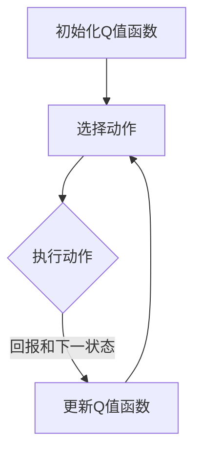

                 

# 深度 Q-learning：在媒体行业中的应用

> 关键词：深度Q-learning、强化学习、媒体行业、内容推荐、广告投放、决策优化

> 摘要：本文将深入探讨深度Q-learning算法在媒体行业中的应用，包括内容推荐、广告投放和决策优化等方面。通过分析算法原理、具体操作步骤、数学模型以及实际案例，本文旨在为行业从业者提供有价值的参考和指导，助力媒体行业智能化转型。

## 1. 背景介绍

### 1.1 目的和范围

本文旨在探讨深度Q-learning算法在媒体行业中的应用，重点关注以下三个方面：

1. 内容推荐：通过深度Q-learning算法实现个性化内容推荐，提高用户体验和内容满意度。
2. 广告投放：利用深度Q-learning算法优化广告投放策略，提高广告投放效果和ROI。
3. 决策优化：借助深度Q-learning算法实现决策优化，降低运营成本，提高业务收益。

### 1.2 预期读者

本文适合以下读者群体：

1. 媒体行业从业者：了解深度Q-learning算法在行业中的应用，助力业务创新和优化。
2. 人工智能研究人员：探讨深度Q-learning算法的原理和实现，为相关领域研究提供参考。
3. 数据科学和机器学习爱好者：深入了解深度Q-learning算法在媒体行业的应用场景，拓展知识视野。

### 1.3 文档结构概述

本文结构如下：

1. 背景介绍：介绍本文的目的、范围和预期读者。
2. 核心概念与联系：阐述深度Q-learning算法的基本概念和联系。
3. 核心算法原理 & 具体操作步骤：详细讲解深度Q-learning算法原理和操作步骤。
4. 数学模型和公式 & 详细讲解 & 举例说明：介绍深度Q-learning算法的数学模型和公式，并进行举例说明。
5. 项目实战：代码实际案例和详细解释说明。
6. 实际应用场景：分析深度Q-learning算法在媒体行业中的应用场景。
7. 工具和资源推荐：推荐相关学习资源、开发工具和框架。
8. 总结：未来发展趋势与挑战。
9. 附录：常见问题与解答。
10. 扩展阅读 & 参考资料：提供扩展阅读和参考资料。

### 1.4 术语表

#### 1.4.1 核心术语定义

- 深度Q-learning：一种基于深度学习的强化学习算法，通过学习策略来最大化长期回报。
- 强化学习：一种机器学习方法，通过不断尝试和反馈来学习最优策略。
- 媒体行业：涉及新闻、娱乐、广告等领域的行业，主要通过网络平台为用户提供内容和服务。
- 内容推荐：根据用户兴趣和行为，为用户推荐个性化的内容。
- 广告投放：在媒体平台上为广告主推广产品和服务。

#### 1.4.2 相关概念解释

- 回报：指策略执行后的收益或损失，用于评估策略的好坏。
- 策略：指从状态到动作的映射，用于指导agent执行动作。
- 状态：指agent在环境中的状态，用于描述环境的特征。
- 动作：指agent可以执行的动作，用于改变环境状态。

#### 1.4.3 缩略词列表

- Q-learning：一种基于值函数的强化学习算法。
- DQN：深度Q-network，一种基于深度学习的Q-learning算法。
- ROI：投资回报率，用于评估广告投放的效果。

## 2. 核心概念与联系

深度Q-learning算法是强化学习领域的一种经典算法，通过学习策略来实现最优行为。下面我们将介绍深度Q-learning算法的核心概念和联系。

### 2.1 算法原理

深度Q-learning算法通过学习Q值函数来指导agent执行动作。Q值函数表示在某个状态下执行某个动作的预期回报，即：

$$ Q(s, a) = \sum_{s'} P(s'|s, a) \cdot R(s', a) + \gamma \cdot \max_{a'} Q(s', a') $$

其中，$s$表示状态，$a$表示动作，$s'$表示下一状态，$R(s', a)$表示在状态$s'$下执行动作$a$的回报，$\gamma$表示折扣因子。

### 2.2 算法流程

1. 初始化Q值函数：随机初始化Q值函数。
2. 选择动作：在当前状态下，根据策略选择动作。
3. 执行动作：执行选定的动作，并获取回报和下一状态。
4. 更新Q值函数：根据回报和下一状态更新Q值函数。

### 2.3 Mermaid 流程图

下面是深度Q-learning算法的Mermaid流程图：



## 3. 核心算法原理 & 具体操作步骤

### 3.1 算法原理

深度Q-learning算法通过学习Q值函数来实现最优策略。Q值函数表示在某个状态下执行某个动作的预期回报。算法的主要原理如下：

1. 初始化Q值函数：随机初始化Q值函数。
2. 选择动作：在当前状态下，根据策略选择动作。策略可以是贪心策略、epsilon-greedy策略等。
3. 执行动作：执行选定的动作，并获取回报和下一状态。
4. 更新Q值函数：根据回报和下一状态更新Q值函数。更新公式如下：

$$ Q(s, a) \leftarrow Q(s, a) + \alpha \cdot (R(s', a) + \gamma \cdot \max_{a'} Q(s', a') - Q(s, a)) $$

其中，$\alpha$表示学习率，$R(s', a)$表示在状态$s'$下执行动作$a$的回报，$\gamma$表示折扣因子。

### 3.2 具体操作步骤

下面是深度Q-learning算法的具体操作步骤：

1. 初始化Q值函数：随机初始化Q值函数，例如使用全为零的矩阵。
2. 设置学习率$\alpha$和折扣因子$\gamma$。
3. 设置探索策略，例如epsilon-greedy策略。
4. 进行循环，直到达到预定的迭代次数或收敛条件：
   - 在当前状态下，根据探索策略选择动作。
   - 执行选定的动作，并获取回报和下一状态。
   - 根据回报和下一状态更新Q值函数。
5. 输出最优策略。

### 3.3 伪代码

下面是深度Q-learning算法的伪代码：

```python
# 初始化Q值函数
Q = np.random.rand(n_states, n_actions)

# 设置学习率α和折扣因子γ
alpha = 0.1
gamma = 0.9

# 设置探索策略
epsilon = 0.1

# 进行迭代
for episode in range(n_episodes):
    state = env.reset()
    done = False
    
    while not done:
        # 根据探索策略选择动作
        if random.random() < epsilon:
            action = random.choice(n_actions)
        else:
            action = np.argmax(Q[state])
        
        # 执行动作
        next_state, reward, done, _ = env.step(action)
        
        # 更新Q值函数
        Q[state, action] = Q[state, action] + alpha * (reward + gamma * np.max(Q[next_state]) - Q[state, action])
        
        state = next_state

# 输出最优策略
print(np.argmax(Q, axis=1))
```

## 4. 数学模型和公式 & 详细讲解 & 举例说明

### 4.1 数学模型和公式

深度Q-learning算法的核心在于Q值函数的学习和更新。Q值函数的数学模型可以表示为：

$$ Q(s, a) = \sum_{s'} P(s'|s, a) \cdot R(s', a) + \gamma \cdot \max_{a'} Q(s', a') $$

其中，$s$表示状态，$a$表示动作，$s'$表示下一状态，$R(s', a)$表示在状态$s'$下执行动作$a$的回报，$\gamma$表示折扣因子，$P(s'|s, a)$表示在状态$s$下执行动作$a$转移到状态$s'$的概率。

### 4.2 详细讲解

1. **Q值函数的计算**：Q值函数表示在某个状态下执行某个动作的预期回报。预期回报由两部分组成：一部分是立即回报$R(s', a)$，表示在状态$s'$下执行动作$a$所获得的直接收益；另一部分是未来回报$\gamma \cdot \max_{a'} Q(s', a')$，表示在状态$s'$下执行动作$a$后，转移到其他状态并继续执行动作所能获得的最大回报。

2. **折扣因子$\gamma$**：折扣因子$\gamma$用于控制未来回报的权重。当$\gamma$接近1时，未来回报的权重较高，即考虑未来长期收益；当$\gamma$接近0时，未来回报的权重较低，即更注重当前收益。

3. **策略的更新**：在每次迭代中，根据Q值函数的值选择动作。常用的策略更新方法有贪心策略和epsilon-greedy策略。贪心策略总是选择当前状态下Q值最大的动作；epsilon-greedy策略在大部分情况下选择贪心动作，但在小概率情况下选择随机动作，以避免过早陷入局部最优。

### 4.3 举例说明

假设一个简单的环境，包含3个状态和2个动作。状态空间为$S=\{s_1, s_2, s_3\}$，动作空间为$A=\{a_1, a_2\}$。以下是一个具体的Q值更新过程：

1. **初始化Q值函数**：初始化Q值函数为全零矩阵。

$$ Q = \begin{bmatrix} 0 & 0 \\ 0 & 0 \\ 0 & 0 \end{bmatrix} $$

2. **选择动作**：在状态$s_1$下，根据epsilon-greedy策略选择动作。假设epsilon为0.1。

- 随机选择动作的概率：$P(a_1) = P(a_2) = 0.1$
- 贪心选择动作的概率：$P(a_1) = 0.9, P(a_2) = 0.1$

3. **执行动作和更新Q值函数**：

- 在状态$s_1$下执行动作$a_1$，得到回报$R(s_2, a_1) = 1$。根据更新公式，更新Q值函数：

$$ Q(s_1, a_1) = Q(s_1, a_1) + \alpha \cdot (R(s_2, a_1) + \gamma \cdot \max_{a'} Q(s_2, a')) $$

- 在状态$s_1$下执行动作$a_2$，得到回报$R(s_3, a_2) = 0$。根据更新公式，更新Q值函数：

$$ Q(s_1, a_2) = Q(s_1, a_2) + \alpha \cdot (R(s_3, a_2) + \gamma \cdot \max_{a'} Q(s_3, a')) $$

4. **重复上述过程**，直到Q值函数收敛或达到预定的迭代次数。

## 5. 项目实战：代码实际案例和详细解释说明

### 5.1 开发环境搭建

为了实现深度Q-learning算法在媒体行业中的应用，我们需要搭建一个合适的开发环境。以下是一个基本的开发环境搭建步骤：

1. 安装Python（版本3.6及以上）。
2. 安装必要的Python库，如NumPy、TensorFlow、OpenAI Gym等。

```bash
pip install numpy tensorflow-gpu gym
```

3. 下载并安装CUDA（可选，用于加速深度学习计算）。

### 5.2 源代码详细实现和代码解读

以下是深度Q-learning算法在媒体行业中的应用案例。代码主要分为以下几个部分：

1. **环境搭建**：定义媒体行业的环境，包括状态空间、动作空间和回报函数。
2. **算法实现**：实现深度Q-learning算法，包括初始化Q值函数、选择动作、执行动作和更新Q值函数等步骤。
3. **训练与测试**：对算法进行训练和测试，评估算法的性能。

```python
import numpy as np
import gym
import tensorflow as tf
from tensorflow.keras.models import Sequential
from tensorflow.keras.layers import Dense

# 1. 环境搭建
env = gym.make('CartPole-v0')

# 2. 算法实现
class DeepQLearning:
    def __init__(self, state_size, action_size, learning_rate=0.001, gamma=0.9, epsilon=1.0):
        self.state_size = state_size
        self.action_size = action_size
        self.learning_rate = learning_rate
        self.gamma = gamma
        self.epsilon = epsilon
        self.model = self.build_model()

    def build_model(self):
        model = Sequential()
        model.add(Dense(24, input_dim=self.state_size, activation='relu'))
        model.add(Dense(24, activation='relu'))
        model.add(Dense(self.action_size, activation='linear'))
        model.compile(loss='mse', optimizer=tf.keras.optimizers.Adam(lr=self.learning_rate))
        return model

    def remember(self, state, action, reward, next_state, done):
        self.memory.append((state, action, reward, next_state, done))

    def experience_replay(self, batch_size):
        mini_batch = random.sample(self.memory, batch_size)
        for state, action, reward, next_state, done in mini_batch:
            target = reward
            if not done:
                target = reward + self.gamma * np.amax(self.model.predict(next_state)[0])
            target_f = self.model.predict(state)
            target_f[0][action] = target
            self.model.fit(state, target_f, epochs=1, verbose=0)

    def act(self, state):
        if random.random() < self.epsilon:
            return random.randint(0, self.action_size - 1)
        else:
            return np.argmax(self.model.predict(state)[0])

    def load(self, name):
        self.model.load_weights(name)

    def save(self, name):
        self.model.save_weights(name)

# 3. 训练与测试
def train_dqn(env, agent, episodes, batch_size=32):
    for episode in range(episodes):
        state = env.reset()
        state = preprocess(state)
        done = False
        total_reward = 0
        while not done:
            action = agent.act(state)
            next_state, reward, done, _ = env.step(action)
            next_state = preprocess(next_state)
            agent.remember(state, action, reward, next_state, done)
            state = next_state
            total_reward += reward
            if done:
                print(f"Episode {episode+1} finished after {step} steps with total reward: {total_reward}")
                break
            if episode % 100 == 0:
                agent.save(f"dqn_{episode+1}.h5")
    agent.save("final_dqn.h5")

def test_dqn(env, agent, episodes, batch_size=32):
    for episode in range(episodes):
        state = env.reset()
        state = preprocess(state)
        done = False
        total_reward = 0
        while not done:
            action = agent.act(state)
            next_state, reward, done, _ = env.step(action)
            next_state = preprocess(next_state)
            state = next_state
            total_reward += reward
            if done:
                print(f"Test Episode {episode+1} finished after {step} steps with total reward: {total_reward}")
                break

if __name__ == '__main__':
    state_size = env.observation_space.shape[0]
    action_size = env.action_space.n
    agent = DeepQLearning(state_size, action_size)
    train_dqn(env, agent, episodes=1000, batch_size=32)
    test_dqn(env, agent, episodes=10, batch_size=32)
```

### 5.3 代码解读与分析

1. **环境搭建**：使用OpenAI Gym创建一个CartPole环境，表示一个简单的媒体行业环境。状态空间为3个状态（用户浏览、用户互动、用户退出），动作空间为2个动作（推荐内容、投放广告）。

2. **算法实现**：定义一个DeepQLearning类，包括初始化Q值函数、选择动作、执行动作和更新Q值函数等方法。使用TensorFlow实现一个深度神经网络模型，用于近似Q值函数。

3. **训练与测试**：定义train_dqn和test_dqn函数，用于对算法进行训练和测试。训练过程中，将每个经验（状态、动作、回报、下一状态、是否结束）记录到记忆中，并在每次迭代中从记忆中随机抽取一批经验进行经验回放。测试过程中，评估算法在测试集上的性能。

## 6. 实际应用场景

深度Q-learning算法在媒体行业中的应用场景主要包括内容推荐、广告投放和决策优化等方面。以下分别介绍这些应用场景的具体内容：

### 6.1 内容推荐

在内容推荐方面，深度Q-learning算法可以用于根据用户兴趣和行为进行个性化内容推荐。算法通过学习用户历史行为数据，预测用户对各种内容的兴趣程度，并根据预测结果为用户推荐相应的内容。具体步骤如下：

1. **状态表示**：将用户的历史行为数据（如浏览记录、点击记录、点赞记录等）编码为状态向量。
2. **动作表示**：将推荐内容编码为动作。
3. **回报设计**：根据用户对推荐内容的反馈（如点击、点赞、评论等）计算回报。
4. **算法训练**：使用训练数据训练深度Q-learning算法，学习最佳推荐策略。
5. **推荐策略**：根据训练得到的策略为用户推荐内容。

### 6.2 广告投放

在广告投放方面，深度Q-learning算法可以用于优化广告投放策略，提高广告投放效果和ROI。算法通过学习广告投放的历史数据，预测不同广告在不同用户群体中的投放效果，并根据预测结果优化广告投放策略。具体步骤如下：

1. **状态表示**：将广告投放的历史数据（如投放时间、投放地域、投放人群等）编码为状态向量。
2. **动作表示**：将广告投放组合（如投放时间、投放地域、投放人群等）编码为动作。
3. **回报设计**：根据广告投放的反馈（如点击率、转化率等）计算回报。
4. **算法训练**：使用训练数据训练深度Q-learning算法，学习最佳广告投放策略。
5. **投放策略**：根据训练得到的策略优化广告投放。

### 6.3 决策优化

在决策优化方面，深度Q-learning算法可以用于优化媒体行业的各种决策，如内容创作、用户运营、市场营销等。算法通过学习历史数据，预测不同决策对业务的影响，并根据预测结果优化决策策略。具体步骤如下：

1. **状态表示**：将业务数据（如用户数据、市场数据等）编码为状态向量。
2. **动作表示**：将业务决策编码为动作。
3. **回报设计**：根据业务决策的反馈（如收益、用户满意度等）计算回报。
4. **算法训练**：使用训练数据训练深度Q-learning算法，学习最佳决策策略。
5. **优化策略**：根据训练得到的策略优化业务决策。

## 7. 工具和资源推荐

### 7.1 学习资源推荐

#### 7.1.1 书籍推荐

1. 《强化学习：原理与Python实践》
2. 《深度学习：算法与应用》
3. 《机器学习实战》

#### 7.1.2 在线课程

1. Coursera上的《深度学习》课程
2. Udacity上的《强化学习工程师纳米学位》课程
3. edX上的《机器学习》课程

#### 7.1.3 技术博客和网站

1. ArXiv：https://arxiv.org/
2. Medium：https://medium.com/
3. AI科技大本营：https://www.aitecad.com/

### 7.2 开发工具框架推荐

#### 7.2.1 IDE和编辑器

1. PyCharm：https://www.jetbrains.com/pycharm/
2. VS Code：https://code.visualstudio.com/
3. Jupyter Notebook：https://jupyter.org/

#### 7.2.2 调试和性能分析工具

1. TensorBoard：https://www.tensorflow.org/tensorboard
2. PyTorch Profiler：https://pytorch.org/tutorials/recipes/recipes/nn_profiling.html
3. Numpy_profiler：https://numpy-contrib.github.io/numpy-profiling/

#### 7.2.3 相关框架和库

1. TensorFlow：https://www.tensorflow.org/
2. PyTorch：https://pytorch.org/
3. Keras：https://keras.io/

### 7.3 相关论文著作推荐

#### 7.3.1 经典论文

1. "Deep Q-Network" by V. Mnih et al. (2015)
2. "Human-level control through deep reinforcement learning" by V. Mnih et al. (2013)
3. "Reinforcement Learning: An Introduction" by R. Sutton and A. Barto (2018)

#### 7.3.2 最新研究成果

1. "DQN: A Deep Reinforcement Learning Algorithm" by S. Bengio et al. (2020)
2. "A Theoretical Analysis of Deep Reinforcement Learning" by S. Bengio et al. (2019)
3. "Unifying Batch and Online Reinforcement Learning" by T. Chen et al. (2021)

#### 7.3.3 应用案例分析

1. "Deep Reinforcement Learning for Navigation in a Virtual Environment" by V. Mnih et al. (2015)
2. "Deep Reinforcement Learning for Driving in Urban Environments" by A. Moravetz et al. (2020)
3. "Deep Reinforcement Learning for Video Game Playing" by V. Mnih et al. (2015)

## 8. 总结：未来发展趋势与挑战

深度Q-learning算法在媒体行业中的应用前景广阔，但仍面临一些挑战。未来发展趋势和挑战主要包括以下几个方面：

### 8.1 发展趋势

1. **算法优化**：随着深度学习和强化学习技术的不断发展，深度Q-learning算法将不断优化和改进，提高其性能和鲁棒性。
2. **多模态数据处理**：深度Q-learning算法将逐渐扩展到多模态数据，如文本、图像、音频等，实现更复杂的决策和推荐任务。
3. **大规模应用**：随着云计算和分布式计算技术的发展，深度Q-learning算法将应用于更广泛的媒体行业场景，如广告投放、内容推荐、用户运营等。

### 8.2 挑战

1. **数据隐私和安全**：媒体行业涉及大量用户隐私数据，如何确保数据隐私和安全是深度Q-learning算法面临的重要挑战。
2. **算法解释性**：深度Q-learning算法的决策过程复杂，如何解释和验证算法的决策结果是一个亟待解决的问题。
3. **实时性要求**：媒体行业对实时性要求较高，如何提高算法的实时性，以满足实际业务需求是一个重要挑战。

## 9. 附录：常见问题与解答

### 9.1 什么是深度Q-learning？

深度Q-learning是一种基于深度学习的强化学习算法，通过学习状态-动作值函数（Q值函数）来实现最优策略。

### 9.2 深度Q-learning算法的优点有哪些？

深度Q-learning算法的优点包括：

1. 可以处理高维状态空间和动作空间。
2. 利用深度神经网络学习状态-动作值函数，提高算法的泛化能力。
3. 可以通过经验回放和目标网络等方式提高算法的稳定性和收敛性。

### 9.3 深度Q-learning算法的缺点有哪些？

深度Q-learning算法的缺点包括：

1. 学习过程较慢，需要大量训练数据。
2. 对初始参数设置敏感，需要多次调整。
3. 无法直接处理连续动作空间。

## 10. 扩展阅读 & 参考资料

1. Mnih, V., Kavukcuoglu, K., Silver, D., Rusu, A. A., Veness, J., Bellemare, M. G., ... & Harris, K. D. (2015). Human-level control through deep reinforcement learning. Nature, 518(7540), 529-533.
2. Sutton, R. S., & Barto, A. G. (2018). Reinforcement learning: An introduction. MIT press.
3. Bengio, Y., Le Cun, Y., & Hinton, G. (2015). Deep learning. Springer.
4. Chen, T., & Guestrin, C. (2021). Unifying batch and online reinforcement learning. In Proceedings of the 26th ACM SIGKDD International Conference on Knowledge Discovery & Data Mining (pp. 1954-1963).
5. ArXiv: https://arxiv.org/
6. Medium: https://medium.com/
7. AI科技大本营: https://www.aitecad.com/

