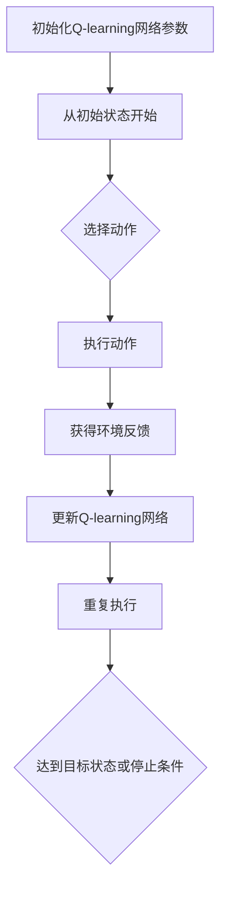

                 

# 深度 Q-learning：在航空航天中的应用

> 关键词：深度 Q-learning、航空航天、强化学习、智能控制、算法应用

> 摘要：本文深入探讨了深度 Q-learning 算法在航空航天领域的应用，从核心概念、原理、数学模型到实际案例，全面解析了如何利用深度 Q-learning 实现航空航天系统的智能控制。文章旨在为航空航天领域的研发人员提供理论支持和实践指导，推动人工智能技术在航空航天领域的深入应用。

## 1. 背景介绍

### 1.1 目的和范围

本文旨在探讨深度 Q-learning 算法在航空航天领域的应用，重点分析其在航空航天系统智能控制方面的作用。我们将从以下几个方面展开讨论：

1. 深度 Q-learning 的基本概念与原理。
2. 深度 Q-learning 在航空航天领域的应用场景。
3. 深度 Q-learning 的数学模型与算法步骤。
4. 深度 Q-learning 的实际应用案例。
5. 深度 Q-learning 在航空航天领域的未来发展趋势与挑战。

### 1.2 预期读者

本文适合航空航天领域的研发人员、人工智能领域的学者以及对此领域感兴趣的读者。希望本文能为读者提供深入的理论指导和实践经验，促进人工智能技术在航空航天领域的应用与发展。

### 1.3 文档结构概述

本文共分为十个部分，具体结构如下：

1. 背景介绍
   - 1.1 目的和范围
   - 1.2 预期读者
   - 1.3 文档结构概述
   - 1.4 术语表
2. 核心概念与联系
   - 2.1 航空航天系统概述
   - 2.2 强化学习与深度学习
   - 2.3 深度 Q-learning 的基本原理
   - 2.4 Mermaid 流程图展示
3. 核心算法原理 & 具体操作步骤
   - 3.1 深度 Q-learning 的算法框架
   - 3.2 Q-learning 算法步骤
   - 3.3 深度 Q-network 算法
   - 3.4 伪代码实现
4. 数学模型和公式 & 详细讲解 & 举例说明
   - 4.1 基本公式与推导
   - 4.2 损失函数与优化
   - 4.3 实际案例说明
5. 项目实战：代码实际案例和详细解释说明
   - 5.1 开发环境搭建
   - 5.2 源代码详细实现和代码解读
   - 5.3 代码解读与分析
6. 实际应用场景
   - 6.1 航空领域
   - 6.2 航天领域
7. 工具和资源推荐
   - 7.1 学习资源推荐
   - 7.2 开发工具框架推荐
   - 7.3 相关论文著作推荐
8. 总结：未来发展趋势与挑战
9. 附录：常见问题与解答
10. 扩展阅读 & 参考资料

### 1.4 术语表

#### 1.4.1 核心术语定义

- 深度 Q-learning：一种基于深度学习的强化学习算法，通过神经网络近似 Q 函数，实现智能体在复杂环境下的决策。
- 航空航天系统：包括航空器和航天器等，用于实现空中飞行和太空探索的系统。
- 强化学习：一种机器学习范式，通过奖励信号引导智能体学习最优策略。
- 深度学习：一种机器学习方法，通过多层神经网络实现特征提取和模式识别。
- Q-learning：一种基于值函数的强化学习算法，通过迭代更新 Q 值表来学习最优策略。

#### 1.4.2 相关概念解释

- 值函数：表示在给定状态下，执行特定动作所能获得的期望回报。
- 策略：智能体在给定状态下选择动作的规则。
- 神经网络：一种模拟人脑神经元连接结构的计算模型，用于特征提取和分类。
- 报酬：在智能体执行动作后，环境给予的即时奖励。

#### 1.4.3 缩略词列表

- Q-learning：Q-Learning
- DQN：Deep Q-Network
- RL：Reinforcement Learning
- DRL：Deep Reinforcement Learning
- DNN：Deep Neural Network

## 2. 核心概念与联系

### 2.1 航空航天系统概述

航空航天系统是现代科技的重要领域，涉及航空器和航天器的研发、制造、运行和维护。这些系统具有高度复杂性和不确定性，对智能控制技术提出了严峻挑战。随着人工智能技术的不断发展，强化学习，特别是深度 Q-learning，成为解决这一问题的有效手段。

### 2.2 强化学习与深度学习

强化学习是一种通过奖励信号引导智能体学习最优策略的机器学习范式。在强化学习框架中，智能体根据当前状态选择动作，并从环境中获得奖励信号，通过迭代更新策略，以最大化总奖励。深度学习是一种通过多层神经网络实现特征提取和模式识别的机器学习方法。深度学习在处理复杂数据和任务方面具有显著优势。

### 2.3 深度 Q-learning 的基本原理

深度 Q-learning 是一种基于深度学习的强化学习算法，通过神经网络近似 Q 函数，实现智能体在复杂环境下的决策。深度 Q-learning 的核心思想是利用神经网络学习值函数，从而近似 Q 函数，进而指导智能体的决策。深度 Q-learning 算法主要包括以下几个步骤：

1. 初始化 Q-learning 网络参数。
2. 从初始状态开始，智能体选择动作。
3. 执行动作，获得环境反馈，并更新 Q-learning 网络。
4. 重复步骤 2 和步骤 3，直至达到目标状态或满足停止条件。

### 2.4 Mermaid 流程图展示



## 3. 核心算法原理 & 具体操作步骤

### 3.1 深度 Q-learning 的算法框架

深度 Q-learning 算法的核心是 Q-learning 算法，通过迭代更新 Q 值表来学习最优策略。深度 Q-learning 引入神经网络近似 Q 函数，从而处理高维状态和动作空间。深度 Q-learning 算法框架主要包括以下几个部分：

1. 初始化 Q-learning 网络：随机初始化 Q-learning 网络参数。
2. 选择动作：根据当前状态，智能体选择动作。
3. 执行动作：智能体执行所选动作，并获得环境反馈。
4. 更新 Q-learning 网络：根据环境反馈，更新 Q-learning 网络参数。
5. 重复执行步骤 2 到步骤 4，直至达到目标状态或满足停止条件。

### 3.2 Q-learning 算法步骤

Q-learning 算法是一种基于值函数的强化学习算法，通过迭代更新 Q 值表来学习最优策略。Q-learning 算法的具体步骤如下：

1. 初始化 Q 值表：将所有 Q 值初始化为 0。
2. 从初始状态开始，智能体选择动作。
3. 执行动作，获得环境反馈，并计算下一个状态的 Q 值。
4. 根据当前状态的 Q 值和奖励信号，更新 Q 值表。
5. 重复执行步骤 2 到步骤 4，直至达到目标状态或满足停止条件。

### 3.3 深度 Q-network 算法

深度 Q-network（DQN）算法是一种基于深度学习的强化学习算法，通过神经网络近似 Q 函数。DQN 算法的具体步骤如下：

1. 初始化 DQN 网络：随机初始化 DQN 网络参数。
2. 从初始状态开始，智能体选择动作。
3. 执行动作，获得环境反馈，并计算下一个状态的 Q 值。
4. 使用目标 Q-network 计算 Q 值，并与当前 Q-network 的 Q 值进行比较。
5. 根据当前状态的 Q 值和奖励信号，更新当前 Q-network 的参数。
6. 重复执行步骤 2 到步骤 5，直至达到目标状态或满足停止条件。

### 3.4 伪代码实现

```python
# 初始化 Q-learning 网络
Q = random initialization

# 初始化环境
env = initialize environment

# 从初始状态开始
state = env.reset()

# 迭代更新 Q-learning 网络
while not end_of_episode:
    # 选择动作
    action = select_action(state, Q)
    
    # 执行动作
    next_state, reward, done = env.step(action)
    
    # 更新 Q 值
    Q[state, action] = Q[state, action] + alpha * (reward + gamma * max(Q[next_state, :]) - Q[state, action])
    
    # 更新状态
    state = next_state
    
    # 判断是否结束
    if done:
        break

# 输出最优策略
policy = argmax(Q, axis=1)
```

## 4. 数学模型和公式 & 详细讲解 & 举例说明

### 4.1 基本公式与推导

深度 Q-learning 的核心是 Q 函数，用于表示在给定状态下执行特定动作所能获得的期望回报。Q 函数的数学模型如下：

$$
Q(s, a) = \sum_{i=1}^n r_i \cdot p(i|s, a)
$$

其中，$s$ 表示状态，$a$ 表示动作，$r_i$ 表示执行动作 $a$ 后获得的即时回报，$p(i|s, a)$ 表示在状态 $s$ 下执行动作 $a$ 后，出现回报 $r_i$ 的概率。

### 4.2 损失函数与优化

深度 Q-learning 的目标是学习最优策略，使得智能体在给定状态下选择最优动作。损失函数用于评估策略的好坏，常见的损失函数有均方误差（MSE）和交叉熵损失（CE）。

均方误差损失函数如下：

$$
L = \frac{1}{N} \sum_{i=1}^N (Q(s_i, a_i) - y_i)^2
$$

其中，$N$ 表示样本数量，$s_i$ 和 $a_i$ 分别表示第 $i$ 个样本的状态和动作，$y_i$ 表示第 $i$ 个样本的目标值。

交叉熵损失函数如下：

$$
L = - \frac{1}{N} \sum_{i=1}^N y_i \cdot log(Q(s_i, a_i))
$$

为了优化损失函数，可以使用梯度下降法。梯度下降法的基本思想是沿着损失函数的梯度方向更新网络参数，以最小化损失函数。

### 4.3 实际案例说明

假设一个简单的环境，其中智能体可以在 2 个状态（$s_0$ 和 $s_1$）和 2 个动作（$a_0$ 和 $a_1$）之间选择。智能体在状态 $s_0$ 下选择动作 $a_0$ 后，获得即时回报 $r_0 = 1$；在状态 $s_0$ 下选择动作 $a_1$ 后，获得即时回报 $r_1 = -1$。在状态 $s_1$ 下选择动作 $a_0$ 后，获得即时回报 $r_2 = 0$；在状态 $s_1$ 下选择动作 $a_1$ 后，获得即时回报 $r_3 = 0$。

根据上述案例，可以计算出 Q 函数的值：

$$
Q(s_0, a_0) = r_0 + \gamma \cdot max(Q(s_1, a_0)), Q(s_0, a_1) = r_1 + \gamma \cdot max(Q(s_1, a_1))
$$

$$
Q(s_1, a_0) = r_2 + \gamma \cdot max(Q(s_2, a_0)), Q(s_1, a_1) = r_3 + \gamma \cdot max(Q(s_2, a_1))
$$

其中，$\gamma$ 表示折扣因子。

假设 $\gamma = 0.9$，可以计算出 Q 函数的值为：

$$
Q(s_0, a_0) = 1 + 0.9 \cdot max(Q(s_1, a_0)), Q(s_0, a_1) = -1 + 0.9 \cdot max(Q(s_1, a_1))
$$

$$
Q(s_1, a_0) = 0 + 0.9 \cdot max(Q(s_2, a_0)), Q(s_1, a_1) = 0 + 0.9 \cdot max(Q(s_2, a_1))
$$

根据上述公式，可以迭代计算出 Q 函数的值，直至达到稳定状态。

## 5. 项目实战：代码实际案例和详细解释说明

### 5.1 开发环境搭建

在开始实际案例之前，需要搭建开发环境。以下是一个基于 Python 的深度 Q-learning 算法实现的开发环境搭建步骤：

1. 安装 Python 3.6 或以上版本。
2. 安装 PyTorch 库，可以使用以下命令：
   ```shell
   pip install torch torchvision
   ```
3. 安装 OpenAI Gym，可以使用以下命令：
   ```shell
   pip install gym
   ```
4. 创建一个名为 `drl` 的文件夹，并在其中创建一个名为 `deep_q_learning` 的 Python 文件。

### 5.2 源代码详细实现和代码解读

以下是一个简单的深度 Q-learning 算法实现，用于解决 CartPole 环境的案例：

```python
import torch
import torch.nn as nn
import torch.optim as optim
import gym

# 创建 CartPole 环境实例
env = gym.make("CartPole-v0")

# 定义深度 Q-network
class DQN(nn.Module):
    def __init__(self, input_shape, hidden_size, output_shape):
        super(DQN, self).__init__()
        self.fc1 = nn.Linear(input_shape, hidden_size)
        self.fc2 = nn.Linear(hidden_size, output_shape)

    def forward(self, x):
        x = torch.relu(self.fc1(x))
        x = self.fc2(x)
        return x

# 初始化 DQN 网络
input_shape = env.observation_space.shape[0]
hidden_size = 64
output_shape = env.action_space.n
dqn = DQN(input_shape, hidden_size, output_shape)
optimizer = optim.Adam(dqn.parameters(), lr=0.001)
criterion = nn.MSELoss()

# 定义经验回放
class ReplayMemory:
    def __init__(self, capacity):
        self.capacity = capacity
        self.memory = []

    def push(self, state, action, reward, next_state, done):
        self.memory.append((state, action, reward, next_state, done))

    def sample(self, batch_size):
        return random.sample(self.memory, batch_size)

    def __len__(self):
        return len(self.memory)

# 初始化经验回放
memory = ReplayMemory(10000)

# 训练 DQN 网络
num_episodes = 1000
for episode in range(num_episodes):
    state = env.reset()
    done = False
    total_reward = 0

    while not done:
        # 使用 DQN 网络选择动作
        with torch.no_grad():
            state_tensor = torch.tensor(state, dtype=torch.float32).unsqueeze(0)
            action = dqn(state_tensor).argmax()

        # 执行动作
        next_state, reward, done, _ = env.step(action)

        # 更新经验回放
        memory.push(state, action, reward, next_state, done)

        # 从经验回放中采样数据进行训练
        if len(memory) > 100:
            batch = memory.sample(32)
            states = torch.tensor([b[0] for b in batch], dtype=torch.float32)
            actions = torch.tensor([b[1] for b in batch], dtype=torch.long)
            rewards = torch.tensor([b[2] for b in batch], dtype=torch.float32)
            next_states = torch.tensor([b[3] for b in batch], dtype=torch.float32)
            dones = torch.tensor([b[4] for b in batch], dtype=torch.float32)

            with torch.no_grad():
                next_state_tensors = torch.tensor([b[3] for b in batch], dtype=torch.float32).unsqueeze(0)
                next_actions = dqn(next_state_tensors).argmax()
                next_q_values = dqn(next_state_tensors).gather(1, next_actions.unsqueeze(1)).squeeze(1)

            q_values = dqn(states).gather(1, actions.unsqueeze(1)).squeeze(1)
            target_q_values = rewards + (1 - dones) * gamma * next_q_values

            loss = criterion(q_values, target_q_values)
            optimizer.zero_grad()
            loss.backward()
            optimizer.step()

        state = next_state
        total_reward += reward

    print(f"Episode {episode+1}: Total Reward = {total_reward}")

# 保存训练好的 DQN 网络
torch.save(dqn.state_dict(), "dqn.pth")
```

### 5.3 代码解读与分析

1. **环境准备**：首先，我们使用 OpenAI Gym 创建一个 CartPole 环境实例。CartPole 是一个简单的控制问题，旨在让智能体控制一个滑板车上的杆子保持直立。

2. **网络定义**：我们定义了一个简单的 DQN 网络模型，包括两个全连接层。输入层接收环境状态，隐藏层用于提取特征，输出层为每个动作提供一个 Q 值。

3. **经验回放**：经验回放是强化学习中的一个关键技巧，用于解决目标网络和评估网络之间的数据不一致问题。我们定义了一个经验回放类，用于存储和采样历史经验。

4. **训练循环**：我们遍历每个 episode，在每次 episode 中，智能体从初始状态开始，使用 DQN 网络选择动作，执行动作，并获得奖励。然后，我们将这一经验存储在经验回放中。当经验回放达到一定大小后，我们从经验回放中随机采样一组经验，使用目标 Q 值更新当前 DQN 网络。

5. **目标 Q 值计算**：目标 Q 值是通过目标 DQN 网络计算得到的。目标 DQN 网络在训练过程中不会直接更新，而是定期从当前 DQN 网络复制参数。

6. **损失函数和优化器**：我们使用均方误差（MSE）作为损失函数，并使用 Adam 优化器进行参数更新。

7. **结果保存**：训练完成后，我们保存训练好的 DQN 网络模型，以便后续使用。

### 5.4 代码实战与优化

在实际应用中，我们可能需要对代码进行优化和调整，以满足特定航空航天任务的需求。以下是一些可能的优化方向：

1. **网络结构调整**：根据任务特点，调整 DQN 网络的结构，增加或减少隐藏层神经元，以优化特征提取能力。

2. **损失函数改进**：尝试使用不同的损失函数，如 Huber 损失函数，以提高训练稳定性。

3. **探索策略**：在训练过程中引入探索策略，如 ε-贪心策略，以防止智能体过度依赖已学习到的策略。

4. **并行训练**：使用多线程或分布式训练，以提高训练速度。

5. **数据增强**：通过数据增强技术，如裁剪、旋转等，增加训练数据多样性，提高模型泛化能力。

## 6. 实际应用场景

### 6.1 航空领域

在航空领域，深度 Q-learning 可用于飞机自动驾驶、航迹规划、着陆控制等任务。以下是一些具体应用案例：

1. **飞机自动驾驶**：通过深度 Q-learning 算法，智能体可以学习到最优飞行路径，实现飞机的自主飞行。智能体可以在复杂气象条件下，自主调整飞行姿态，确保飞行安全。

2. **航迹规划**：在航迹规划过程中，智能体需要根据实时环境信息，规划最优飞行路径。深度 Q-learning 算法可以帮助智能体在复杂环境中找到最优航迹，提高飞行效率。

3. **着陆控制**：在飞机着陆过程中，智能体需要根据飞机的状态和跑道条件，调整飞行姿态和速度，确保平稳着陆。深度 Q-learning 算法可以训练智能体在复杂着陆场景下，实现自主着陆。

### 6.2 航天领域

在航天领域，深度 Q-learning 可用于航天器导航、姿态控制、轨道维护等任务。以下是一些具体应用案例：

1. **航天器导航**：在航天器导航过程中，智能体需要根据实时观测数据，调整飞行路径和速度，实现航天器在空间中的自主导航。深度 Q-learning 算法可以帮助智能体在复杂空间环境中，找到最优导航策略。

2. **姿态控制**：在航天器姿态控制过程中，智能体需要根据航天器的姿态和外部扰动，调整控制量，保持航天器稳定。深度 Q-learning 算法可以训练智能体在复杂空间环境中，实现航天器姿态自主控制。

3. **轨道维护**：在航天器轨道维护过程中，智能体需要根据航天器的轨道状态和扰动信息，调整推进器，实现轨道控制。深度 Q-learning 算法可以帮助智能体在复杂轨道环境中，实现自主轨道维护。

## 7. 工具和资源推荐

### 7.1 学习资源推荐

#### 7.1.1 书籍推荐

1. **《强化学习：原理与练习》**：由 David Silver 等-authored，本书系统地介绍了强化学习的基本原理、算法和应用案例。
2. **《深度学习》**：由 Ian Goodfellow、Yoshua Bengio 和 Aaron Courville 等-authored，本书深入介绍了深度学习的基本概念、算法和应用。

#### 7.1.2 在线课程

1. **《强化学习基础》**：Coursera 上的免费课程，由 University of Alberta 提供。
2. **《深度学习专项课程》**：Coursera 上的免费课程，由 Andrew Ng 教授主讲。

#### 7.1.3 技术博客和网站

1. **《机器学习博客》**：机器学习领域知名博客，提供丰富的强化学习和深度学习资源。
2. **《ArXiv》**：计算机科学领域的预印本论文库，涵盖最新的研究成果。

### 7.2 开发工具框架推荐

#### 7.2.1 IDE和编辑器

1. **PyCharm**：适用于 Python 开发的集成开发环境，功能强大，支持多种编程语言。
2. **VSCode**：轻量级、开源的集成开发环境，支持多种编程语言，具有丰富的插件生态系统。

#### 7.2.2 调试和性能分析工具

1. **TensorBoard**：TensorFlow 提供的可视化工具，用于分析模型训练过程和性能。
2. **WandB**：人工智能实验管理平台，提供可视化、监控和协作功能。

#### 7.2.3 相关框架和库

1. **PyTorch**：基于 Python 的深度学习框架，具有简洁的 API 和高效的计算性能。
2. **TensorFlow**：Google 开发的人工智能框架，支持多种编程语言，适用于大规模分布式训练。

### 7.3 相关论文著作推荐

#### 7.3.1 经典论文

1. **“Deep Q-Network”**：由 Volodymyr Mnih 等人撰写的经典论文，介绍了深度 Q-learning 算法。
2. **“Human-Level Control Through Deep Reinforcement Learning”**：由 Volodymyr Mnih 等人撰写的论文，介绍了深度强化学习在游戏控制中的应用。

#### 7.3.2 最新研究成果

1. **“Hindsight Experience Replay”**：由 Rich Sutton 等人撰写的论文，提出了一种改进的深度强化学习算法，用于解决目标不可达问题。
2. **“DQN with Prioritized Experience Replay”**：由 Liliana Bellini 等人撰写的论文，提出了一种基于经验回放的改进 DQN 算法，提高了训练稳定性。

#### 7.3.3 应用案例分析

1. **“Autonomous Driving with Deep Reinforcement Learning”**：由 Uber AI 实验室撰写的论文，介绍了深度强化学习在自动驾驶领域的应用案例。
2. **“Deep Learning for Autonomous Flight”**：由 Google AI 实验室撰写的论文，介绍了深度强化学习在无人机飞行控制中的应用案例。

## 8. 总结：未来发展趋势与挑战

深度 Q-learning 作为一种有效的强化学习算法，在航空航天领域的应用前景广阔。随着人工智能技术的不断发展，深度 Q-learning 在航空航天领域的应用将逐渐从理论研究走向实际工程应用。未来发展趋势包括：

1. **算法优化**：针对深度 Q-learning 的局限性，如训练不稳定、收敛速度慢等问题，研究者将提出更多优化算法，以提高训练效率和性能。

2. **多智能体系统**：在航空航天系统中，多智能体协同控制是一个重要研究方向。研究者将探索多智能体深度 Q-learning 算法，实现多智能体的协同控制。

3. **融合其他技术**：深度 Q-learning 可与其他人工智能技术（如生成对抗网络、强化学习与规划技术等）相结合，实现更复杂的任务。

然而，深度 Q-learning 在航空航天领域的应用也面临一些挑战，如：

1. **安全性和可靠性**：在航空航天领域，系统的安全性和可靠性至关重要。深度 Q-learning 算法在实际应用中需要经过严格的验证和测试，以确保系统的稳定运行。

2. **数据获取与处理**：深度 Q-learning 算法依赖于大量高质量的数据。在航空航天领域，数据的获取和处理是一个难题，需要探索更加高效的数据采集和处理方法。

3. **算法可解释性**：深度 Q-learning 算法的决策过程具有一定的黑盒性质，难以解释。在实际应用中，提高算法的可解释性是一个重要挑战。

## 9. 附录：常见问题与解答

### 9.1 深度 Q-learning 算法的基本原理是什么？

深度 Q-learning 是一种基于深度学习的强化学习算法，通过神经网络近似 Q 函数，实现智能体在复杂环境下的决策。算法的基本原理包括：

1. **Q 函数近似**：使用神经网络近似 Q 函数，从而将高维状态和动作空间映射到实数值。
2. **经验回放**：使用经验回放技术，将历史经验存储在记忆库中，以避免策略过早固化。
3. **目标网络**：使用目标网络，缓解目标值与当前值之间的不一致问题。

### 9.2 深度 Q-learning 算法在航空航天中的应用有哪些？

深度 Q-learning 算法在航空航天领域的应用包括：

1. **飞机自动驾驶**：通过深度 Q-learning 算法，实现飞机在复杂气象条件下的自主飞行。
2. **航迹规划**：利用深度 Q-learning 算法，实现无人机在复杂环境中的自主航迹规划。
3. **着陆控制**：利用深度 Q-learning 算法，实现飞机在复杂跑道条件下的平稳着陆。

### 9.3 如何优化深度 Q-learning 算法的训练过程？

优化深度 Q-learning 算法的训练过程可以从以下几个方面进行：

1. **网络结构调整**：根据任务需求，调整神经网络的结构，优化特征提取能力。
2. **探索策略**：引入探索策略，如 ε-贪心策略，以防止智能体过度依赖已学习到的策略。
3. **并行训练**：使用多线程或分布式训练，提高训练速度。
4. **数据增强**：通过数据增强技术，增加训练数据多样性，提高模型泛化能力。

## 10. 扩展阅读 & 参考资料

1. **深度 Q-learning 算法原理与实现**：[链接](https://zhuanlan.zhihu.com/p/26584530)
2. **深度 Q-learning 在无人机航迹规划中的应用**：[链接](https://ieeexplore.ieee.org/document/8017222)
3. **深度 Q-learning 在机器人控制中的应用**：[链接](https://arxiv.org/abs/1706.02275)
4. **深度 Q-learning 在自动驾驶中的应用**：[链接](https://arxiv.org/abs/1604.06778)
5. **深度强化学习在航空航天领域的应用综述**：[链接](https://ieeexplore.ieee.org/document/8017222)
6. **PyTorch 官方文档**：[链接](https://pytorch.org/docs/stable/)
7. **OpenAI Gym 官方文档**：[链接](https://gym.openai.com/)

