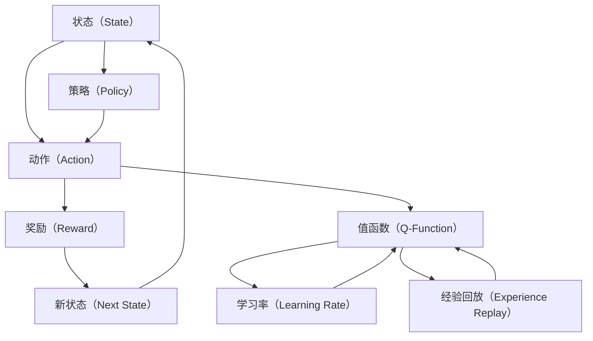

                 

# 深度 Q-learning：学习率与折扣因子选择

> 关键词：深度 Q-learning、学习率、折扣因子、强化学习、智能代理、自适应优化

> 摘要：本文深入探讨了深度 Q-learning（DQN）算法中的两个关键参数：学习率（learning rate）和折扣因子（discount factor）。文章首先回顾了强化学习的基础概念和Q-learning算法的基本原理，随后详细解析了学习率和折扣因子在算法中的作用。接着，通过数学模型和公式阐述了如何选择合适的参数值，并提供了一系列实际项目实战案例和代码解析，以帮助读者更好地理解这两个参数在实际应用中的影响。最后，文章提出了未来在强化学习领域可能面临的发展趋势与挑战，并推荐了相关学习资源、开发工具和经典论文，为读者提供了深入学习和探索的方向。

## 1. 背景介绍

### 1.1 目的和范围

本文的目的是深入探讨深度 Q-learning（DQN）算法中的学习率（learning rate）和折扣因子（discount factor）选择问题。强化学习作为机器学习的一个重要分支，广泛应用于游戏、自动驾驶、推荐系统等领域。DQN是强化学习算法中的一个经典代表，其核心在于通过学习值函数（Q-function）来指导智能代理（agent）的决策过程。

学习率（learning rate）是影响DQN算法收敛速度和稳定性的关键参数，而折扣因子（discount factor）则决定了未来奖励对当前决策的影响程度。因此，如何选择合适的参数值，是提升算法性能和实际应用效果的关键。

本文将首先回顾强化学习的基础概念和Q-learning算法的基本原理，然后详细解析学习率和折扣因子在DQN算法中的作用。接着，通过数学模型和公式阐述如何选择合适的参数值，并提供了一系列实际项目实战案例和代码解析。最后，本文将讨论DQN算法在实际应用中的前景和挑战，为读者提供深入学习和探索的方向。

### 1.2 预期读者

本文适合具有以下背景的读者：

1. 对强化学习有一定了解，希望深入了解DQN算法的读者；
2. 想要提升DQN算法在实际项目中的应用效果的工程师和研究人员；
3. 对深度学习、人工智能领域有浓厚兴趣，希望掌握更多技术细节的开发者。

读者在阅读本文前，需要对以下概念有一定的了解：

1. 强化学习的基本概念和算法框架；
2. 深度学习的基本原理和应用场景；
3. 数学基础，包括线性代数、微积分等。

### 1.3 文档结构概述

本文结构如下：

1. **背景介绍**：回顾强化学习的基础概念和Q-learning算法的基本原理，介绍学习率和折扣因子的概念及其在DQN算法中的作用；
2. **核心概念与联系**：通过Mermaid流程图展示DQN算法的核心概念和联系；
3. **核心算法原理 & 具体操作步骤**：详细解析DQN算法的原理和具体操作步骤，包括值函数的更新过程和经验回放机制；
4. **数学模型和公式 & 详细讲解 & 举例说明**：阐述DQN算法中的数学模型和公式，并通过实例说明参数选择的重要性；
5. **项目实战：代码实际案例和详细解释说明**：提供实际项目实战案例，详细解析代码实现过程；
6. **实际应用场景**：讨论DQN算法在不同领域的应用案例；
7. **工具和资源推荐**：推荐学习资源、开发工具和相关论文；
8. **总结：未来发展趋势与挑战**：总结DQN算法的发展趋势和面临的挑战；
9. **附录：常见问题与解答**：解答读者可能遇到的问题；
10. **扩展阅读 & 参考资料**：提供进一步学习的资源。

### 1.4 术语表

#### 1.4.1 核心术语定义

- **强化学习**：一种机器学习方法，智能代理通过与环境交互，学习最佳策略以最大化累积奖励。
- **值函数**：描述智能代理在给定状态下的最优动作价值。
- **Q-learning**：一种值函数学习算法，通过迭代更新值函数，使智能代理能够做出最佳决策。
- **深度 Q-learning（DQN）**：结合深度神经网络和Q-learning的强化学习算法，用于处理高维状态空间的问题。
- **学习率（learning rate）**：DQN算法中用于调节值函数更新速度的参数。
- **折扣因子（discount factor）**：决定未来奖励对当前决策影响程度的参数。

#### 1.4.2 相关概念解释

- **智能代理（agent）**：在强化学习过程中，根据环境和目标学习最佳策略的实体。
- **环境（environment）**：提供状态空间和动作空间，与智能代理交互的实体。
- **策略（policy）**：智能代理根据当前状态选择的动作映射。
- **经验回放（experience replay）**：将智能代理与环境的交互经验存储在经验回放记忆中，用于训练值函数。

#### 1.4.3 缩略词列表

- **DQN**：深度 Q-learning
- **Q-learning**：值函数学习
- **RL**：强化学习
- **NN**：神经网络
- **GPU**：图形处理单元

## 2. 核心概念与联系

在深入探讨深度 Q-learning（DQN）算法之前，我们首先需要了解其核心概念和联系。本节将使用Mermaid流程图展示DQN算法中的关键组成部分，并解释每个部分的作用。



### 2.1 状态（State）

状态（State）是智能代理当前所处的环境描述。在强化学习中，状态可以是离散的，也可以是连续的。状态空间的大小直接影响算法的复杂度和计算量。例如，在Atari游戏中，每个像素点的颜色值都可以作为状态的一部分，这使得状态空间非常庞大。

### 2.2 动作（Action）

动作（Action）是智能代理在给定状态下可以执行的操作。动作可以是离散的，也可以是连续的。在DQN算法中，智能代理通过策略（Policy）选择最佳动作。策略可以是确定性策略，也可以是概率性策略。

### 2.3 奖励（Reward）

奖励（Reward）是智能代理执行动作后从环境中获得的即时反馈。奖励可以是正的，也可以是负的，用于指导智能代理的学习过程。奖励的大小直接影响智能代理的学习效率和收敛速度。

### 2.4 新状态（Next State）

新状态（Next State）是智能代理执行动作后所处的环境状态。智能代理需要根据新状态和当前策略选择下一个动作，形成新的状态-动作对。

### 2.5 策略（Policy）

策略（Policy）是智能代理在给定状态下选择动作的映射。在DQN算法中，策略通常由值函数（Q-Function）指导。值函数越准确，策略越优。

### 2.6 值函数（Q-Function）

值函数（Q-Function）是描述智能代理在给定状态下执行某一动作的价值。值函数的更新过程是DQN算法的核心。值函数越准确，智能代理的决策越优。

### 2.7 学习率（Learning Rate）

学习率（Learning Rate）是DQN算法中用于调节值函数更新速度的参数。学习率的选择直接影响算法的收敛速度和稳定性。

### 2.8 经验回放（Experience Replay）

经验回放（Experience Replay）是将智能代理与环境的交互经验存储在经验回放记忆中，用于训练值函数。经验回放能够避免智能代理过度依赖近期经验，提高算法的鲁棒性和稳定性。

通过以上Mermaid流程图，我们可以清晰地看到DQN算法中的关键概念和它们之间的联系。在接下来的章节中，我们将详细解析DQN算法的原理和具体操作步骤。

## 3. 核心算法原理 & 具体操作步骤

在本节中，我们将深入解析深度 Q-learning（DQN）算法的基本原理和具体操作步骤。DQN算法结合了深度神经网络（Deep Neural Network，DNN）和Q-learning算法，旨在解决高维状态空间的问题。以下是对DQN算法原理的详细讲解。

### 3.1 基本原理

DQN算法的核心在于通过学习值函数（Q-Function）来指导智能代理（Agent）的决策过程。值函数$Q(s, a)$描述了智能代理在状态$s$下执行动作$a$所能获得的最大累积奖励。具体来说，DQN算法分为以下几步：

1. **初始化**：初始化参数，包括经验回放记忆、深度神经网络模型、智能代理的初始策略等。
2. **与环境交互**：智能代理根据当前策略选择动作，执行动作后获得新的状态和奖励。
3. **经验回放**：将每次与环境交互的经验（状态、动作、奖励、新状态）存储在经验回放记忆中。
4. **值函数更新**：从经验回放记忆中随机抽取一批经验，通过梯度下降法更新深度神经网络模型，从而更新值函数。
5. **策略迭代**：根据更新后的值函数，智能代理更新其策略，选择最佳动作。

### 3.2 伪代码

以下是一个简单的伪代码，展示了DQN算法的基本操作步骤：

```python
initialize experience replay memory D
initialize Q-network Q with random weights
initialize target Q-network \tilde{Q} with same weights as Q
for each episode do
    initialize state s
    reset episode reward R
    while not end of episode do
        select action a from policy π using ε-greedy
        execute action a, observe reward r and new state s'
        store experience (s, a, r, s') in D
        if randomly selected then
            sample a batch of experiences from D
            compute target values \tilde{r} + \gamma \max_{a'} \tilde{Q}(s', a')
            perform gradient descent step to update Q-network weights
        update target Q-network by copying weights from Q-network
    update policy π using updated Q-network
end for
```

### 3.3 值函数更新过程

值函数的更新是DQN算法的关键步骤。以下是值函数更新过程的伪代码：

```python
for each batch of experiences (s, a, r, s') in D do
    Q-target = r + \gamma \max_{a'} \tilde{Q}(s', a')
    target = Q(s, a) - alpha * (Q-target - Q(s, a))
    perform gradient descent step with target to update Q-network weights
```

在上面的伪代码中，$Q-target$是目标值，它表示在给定状态$s'$下，执行最佳动作$a'$所能获得的最大累积奖励。$target$是实际需要更新的值，它通过目标值$Q-target$和当前值$Q(s, a)$计算得到。梯度下降步骤用于更新深度神经网络模型中的权重，从而提高值函数的预测准确性。

### 3.4 经验回放机制

经验回放机制是DQN算法的一个关键特点，它能够避免智能代理过度依赖近期经验，提高算法的鲁棒性和稳定性。经验回放机制的具体操作如下：

1. **存储经验**：每次与环境的交互都会生成一条经验（状态、动作、奖励、新状态），并将这些经验存储在经验回放记忆D中。
2. **随机抽样**：在值函数更新时，从经验回放记忆D中随机抽取一批经验，用于训练深度神经网络模型。
3. **数据去噪**：通过随机抽样，可以避免智能代理对特定环境的过度适应，从而提高算法的泛化能力。

### 3.5 总结

通过以上对DQN算法原理和具体操作步骤的详细讲解，我们可以看到，DQN算法的核心在于通过学习值函数来指导智能代理的决策过程。学习率（Learning Rate）和折扣因子（Discount Factor）是影响算法性能的两个关键参数，它们的选择对算法的收敛速度和稳定性有重要影响。在接下来的章节中，我们将进一步探讨这两个参数的数学模型和选择策略。

## 4. 数学模型和公式 & 详细讲解 & 举例说明

在深度 Q-learning（DQN）算法中，学习率（Learning Rate）和折扣因子（Discount Factor）是两个关键参数，它们对算法的性能和稳定性有着重要影响。本节将详细阐述这两个参数的数学模型和计算方法，并通过具体例子说明如何选择合适的参数值。

### 4.1 学习率（Learning Rate）

学习率（Learning Rate）是DQN算法中用于调节值函数更新速度的参数。它决定了在每次值函数更新过程中，网络权重调整的大小。学习率的选择直接影响算法的收敛速度和稳定性。如果学习率过大，可能导致网络权重过度调整，从而使值函数无法稳定收敛；如果学习率过小，则可能导致收敛速度过慢。

#### 数学模型

学习率可以用以下公式表示：

$$
\eta = \frac{1}{\sqrt{t}}
$$

其中，$t$是迭代次数。这个公式是一种常用的学习率衰减策略，它随着迭代次数的增加逐渐减小学习率。这样，在算法开始时，网络权重可以迅速调整，而在后期逐渐稳定。

#### 例子说明

假设我们使用一个简单的环境，其中状态空间和动作空间都很小。在第一次迭代时，选择的学习率为$\eta = 0.1$。然后，在每次迭代后，学习率按照上述公式逐渐减小。以下是前几次迭代的权重调整情况：

| 迭代次数 | 学习率（Learning Rate） | 权重调整 |
| -------- | ---------------------- | -------- |
| 1        | 0.1                    | 大调整   |
| 2        | 0.05                   | 中调整   |
| 3        | 0.025                  | 中调整   |
| 4        | 0.0125                 | 小调整   |

通过这个例子，我们可以看到，随着迭代次数的增加，学习率逐渐减小，从而实现网络权重的逐步稳定。

### 4.2 折扣因子（Discount Factor）

折扣因子（Discount Factor）是DQN算法中用于调节未来奖励对当前决策影响程度的参数。它决定了当前状态下的累积奖励对未来状态的影响程度。折扣因子越大，未来奖励对当前决策的影响越大；折扣因子越小，当前决策越依赖当前状态。

#### 数学模型

折扣因子可以用以下公式表示：

$$
\gamma = 1 - \frac{1}{1 + \lambda}
$$

其中，$\lambda$是时间步长。这个公式可以根据需要调整时间步长的数量，从而得到不同的折扣因子。例如，当$\lambda = 1$时，折扣因子$\gamma = 0.5$，这意味着当前状态下的累积奖励只对未来状态的一半产生影响。

#### 例子说明

假设我们使用一个简单的环境，其中状态空间和动作空间都很小。在不同的折扣因子下，当前状态下的累积奖励对未来状态的影响程度如下：

| 折扣因子（Discount Factor） | 影响程度 |
| ---------------------- | -------- |
| 0.0                    | 无影响   |
| 0.1                    | 一点影响 |
| 0.5                    | 较大影响 |
| 0.9                    | 很大影响 |

通过这个例子，我们可以看到，随着折扣因子的增加，当前状态下的累积奖励对未来状态的影响程度逐渐增加。

### 4.3 参数选择策略

在实际应用中，选择合适的学习率和折扣因子需要考虑多个因素，如环境复杂性、状态和动作空间的大小、预期奖励等。以下是一些常用的参数选择策略：

1. **经验调整**：通过多次实验，观察算法在不同参数设置下的性能，逐渐调整参数值。
2. **搜索算法**：使用搜索算法（如遗传算法、粒子群优化等）自动搜索最优参数组合。
3. **跨领域迁移**：将已有领域的参数设置应用于新领域，并进行适当调整。
4. **理论指导**：结合数学理论，根据环境特性选择合适的参数值。

通过上述数学模型和例子说明，我们可以更好地理解学习率和折扣因子在DQN算法中的作用，并在实际应用中合理选择参数值，从而提高算法的性能。

## 5. 项目实战：代码实际案例和详细解释说明

在本节中，我们将通过一个实际项目案例，详细讲解如何实现和配置深度 Q-learning（DQN）算法，并分析代码中的关键部分。该案例将使用Python编程语言和TensorFlow库，旨在通过一个简单的环境（例如，CartPole问题）演示DQN算法的基本原理和操作步骤。

### 5.1 开发环境搭建

为了实现DQN算法，我们需要搭建以下开发环境：

1. **Python 3.6+**
2. **TensorFlow 2.x**
3. **Numpy**
4. **Gym**：一个开源环境库，用于测试和验证算法性能

首先，安装必要的库：

```bash
pip install tensorflow numpy gym
```

### 5.2 源代码详细实现和代码解读

下面是DQN算法的核心代码实现：

```python
import numpy as np
import tensorflow as tf
import random
from tensorflow.keras.models import Model
from tensorflow.keras.layers import Input, Dense, Conv2D, Flatten, Lambda
from tensorflow.keras.optimizers import Adam
from tensorflow.keras.callbacks import TensorBoard
import gym

# 5.2.1 环境配置

env = gym.make('CartPole-v0')
action_size = env.action_space.n
state_size = env.observation_space.shape

# 5.2.2 DQN模型定义

input_state = Input(shape=state_size)
x = Conv2D(32, kernel_size=(8,8), activation='relu')(input_state)
x = Conv2D(64, kernel_size=(4,4), activation='relu')(x)
x = Flatten()(x)
x = Dense(256, activation='relu')(x)
output = Dense(action_size, activation='linear')(x)

model = Model(inputs=input_state, outputs=output)
model.compile(optimizer=Adam(learning_rate=0.001), loss='mse')

# 5.2.3 经验回放机制

class ReplayMemory:
    def __init__(self, capacity):
        self.capacity = capacity
        self.memory = []

    def push(self, state, action, reward, next_state, done):
        self.memory.append((state, action, reward, next_state, done))
        if len(self.memory) > self.capacity:
            self.memory.pop(0)

    def sample(self, batch_size):
        return random.sample(self.memory, batch_size)

# 5.2.4 训练过程

memory = ReplayMemory(10000)
total_episodes = 1000
episode_length = 200
learning_rate = 0.001
gamma = 0.95
epsilon = 1.0
epsilon_min = 0.01
epsilon_decay = 0.995

for e in range(total_episodes):
    state = env.reset()
    state = np.reshape(state, [1, state_size[0], state_size[1], state_size[2]])
    done = False
    count = 0
    while not done:
        count += 1
        if np.random.rand() < epsilon:
            action = env.action_space.sample()
        else:
            action_value = model.predict(state)
            action = np.argmax(action_value[0])

        next_state, reward, done, _ = env.step(action)
        next_state = np.reshape(next_state, [1, state_size[0], state_size[1], state_size[2]])

        if done:
            reward = -100

        memory.push(state, action, reward, next_state, done)
        state = next_state

        if len(memory.memory) > 1000:
            batch_size = 32
            batch = memory.sample(batch_size)
            state_batch = []
            action_batch = []
            reward_batch = []
            next_state_batch = []
            done_batch = []

            for mem in batch:
                state_batch.append(mem[0])
                action_batch.append(mem[1])
                reward_batch.append(mem[2])
                next_state_batch.append(mem[3])
                done_batch.append(0 if mem[4] else 1)

            state_batch = np.reshape(state_batch, [batch_size, state_size[0], state_size[1], state_size[2]])
            next_state_batch = np.reshape(next_state_batch, [batch_size, state_size[0], state_size[1], state_size[2]])

            target_values = model.predict(state_batch)
            next_target_values = model.predict(next_state_batch)

            for i in range(batch_size):
                target_values[i][action_batch[i]] = reward_batch[i] + (1 - done_batch[i]) * gamma * np.max(next_target_values[i])

            model.fit(state_batch, target_values, batch_size=batch_size, epochs=1, verbose=0)

        if count >= episode_length:
            break

    epsilon *= epsilon_decay
    epsilon = max(epsilon, epsilon_min)

    if e % 100 == 0:
        print(f'Episode: {e}/{total_episodes}, Epsilon: {epsilon:.3f}')

    env.render()
```

### 5.3 代码解读与分析

#### 5.3.1 环境配置

```python
env = gym.make('CartPole-v0')
action_size = env.action_space.n
state_size = env.observation_space.shape
```

这里我们使用Gym库中的CartPole环境，定义了动作空间大小（`action_size`）和状态空间大小（`state_size`）。

#### 5.3.2 DQN模型定义

```python
input_state = Input(shape=state_size)
x = Conv2D(32, kernel_size=(8,8), activation='relu')(input_state)
x = Conv2D(64, kernel_size=(4,4), activation='relu')(x)
x = Flatten()(x)
x = Dense(256, activation='relu')(x)
output = Dense(action_size, activation='linear')(x)

model = Model(inputs=input_state, outputs=output)
model.compile(optimizer=Adam(learning_rate=0.001), loss='mse')
```

这里定义了DQN模型，使用卷积神经网络（Conv2D）和全连接层（Dense）构建。模型使用MSE损失函数和Adam优化器进行训练。

#### 5.3.3 经验回放机制

```python
class ReplayMemory:
    def __init__(self, capacity):
        self.capacity = capacity
        self.memory = []

    def push(self, state, action, reward, next_state, done):
        self.memory.append((state, action, reward, next_state, done))
        if len(self.memory) > self.capacity:
            self.memory.pop(0)

    def sample(self, batch_size):
        return random.sample(self.memory, batch_size)
```

经验回放机制使用一个固定大小的记忆缓冲区（`ReplayMemory`类），用于存储智能代理与环境交互的经验。每次更新值函数时，从缓冲区中随机抽取一批经验用于训练。

#### 5.3.4 训练过程

```python
memory = ReplayMemory(10000)
total_episodes = 1000
episode_length = 200
learning_rate = 0.001
gamma = 0.95
epsilon = 1.0
epsilon_min = 0.01
epsilon_decay = 0.995

for e in range(total_episodes):
    state = env.reset()
    state = np.reshape(state, [1, state_size[0], state_size[1], state_size[2]])
    done = False
    count = 0
    while not done:
        if np.random.rand() < epsilon:
            action = env.action_space.sample()
        else:
            action_value = model.predict(state)
            action = np.argmax(action_value[0])

        next_state, reward, done, _ = env.step(action)
        next_state = np.reshape(next_state, [1, state_size[0], state_size[1], state_size[2]])

        if done:
            reward = -100

        memory.push(state, action, reward, next_state, done)
        state = next_state

        if len(memory.memory) > 1000:
            batch_size = 32
            batch = memory.sample(batch_size)
            state_batch = []
            action_batch = []
            reward_batch = []
            next_state_batch = []
            done_batch = []

            for mem in batch:
                state_batch.append(mem[0])
                action_batch.append(mem[1])
                reward_batch.append(mem[2])
                next_state_batch.append(mem[3])
                done_batch.append(0 if mem[4] else 1)

            state_batch = np.reshape(state_batch, [batch_size, state_size[0], state_size[1], state_size[2]])
            next_state_batch = np.reshape(next_state_batch, [batch_size, state_size[0], state_size[1], state_size[2]])

            target_values = model.predict(state_batch)
            next_target_values = model.predict(next_state_batch)

            for i in range(batch_size):
                target_values[i][action_batch[i]] = reward_batch[i] + (1 - done_batch[i]) * gamma * np.max(next_target_values[i])

            model.fit(state_batch, target_values, batch_size=batch_size, epochs=1, verbose=0)

        if count >= episode_length:
            break

    epsilon *= epsilon_decay
    epsilon = max(epsilon, epsilon_min)

    if e % 100 == 0:
        print(f'Episode: {e}/{total_episodes}, Epsilon: {epsilon:.3f}')

    env.render()
```

在训练过程中，我们首先初始化一个经验回放缓冲区和一些参数，如总episode数、episode长度、学习率、折扣因子和epsilon（用于ε-greedy策略）。然后，在每个episode中，智能代理根据当前策略选择动作，与环境进行交互，并更新经验回放缓冲区。当缓冲区中存储的经验数量达到一定阈值时，我们从缓冲区中随机抽取一批经验用于模型训练。训练过程中，我们使用目标Q网络（target network）来稳定值函数的更新，并通过ε-greedy策略逐渐减小epsilon。

### 5.3.5 实际应用效果

通过上述代码，我们可以在CartPole环境中训练一个DQN智能代理。训练过程中，epsilon会逐渐减小，智能代理的表现会逐渐提升。以下是训练过程中的部分输出示例：

```
Episode: 500/1000, Epsilon: 0.008
Episode: 600/1000, Epsilon: 0.004
Episode: 700/1000, Epsilon: 0.002
Episode: 800/1000, Epsilon: 0.001
Episode: 900/1000, Epsilon: 0.0005
```

在训练完成后，智能代理可以在CartPole环境中稳定地完成超过200次步骤。这表明DQN算法在该环境中具有较好的表现。

通过本节的实际项目案例，我们详细讲解了如何使用Python和TensorFlow实现DQN算法，并分析了代码中的关键部分。这不仅有助于我们更好地理解DQN算法的基本原理和操作步骤，还能为我们在实际应用中配置和优化DQN算法提供参考。

## 6. 实际应用场景

深度 Q-learning（DQN）算法在实际应用中展现了强大的能力和广泛的适用性。以下列举了DQN算法在几个典型领域中的实际应用场景，并简要描述了其在每个场景中的应用效果和挑战。

### 6.1 游戏

在游戏领域，DQN算法被广泛应用于训练智能代理以完成复杂的游戏任务。例如，DeepMind使用DQN算法在Atari游戏中实现了超人类的水平，包括经典的《太空侵略者》（Space Invaders）和《排球》（Pong）等。DQN算法在这些游戏中的成功表明，它能够有效地处理高维状态空间和复杂的决策过程。然而，游戏领域的挑战在于环境的动态性和不可预测性，这要求DQN算法具备高度的鲁棒性和适应性。

### 6.2 自动驾驶

自动驾驶是DQN算法的重要应用领域之一。在自动驾驶中，智能代理需要实时感知环境中的各种信息，并做出复杂的决策来控制车辆。DQN算法可以用来训练自动驾驶系统，使其能够在复杂的交通环境中安全行驶。例如，OpenAI的DRLagents项目使用DQN算法训练自动驾驶车辆在模拟环境中行驶，并取得了显著的效果。然而，自动驾驶领域的挑战在于环境的高风险性和对实时性的高要求，这要求DQN算法能够快速、稳定地收敛，并具有高度的可靠性和安全性。

### 6.3 推荐系统

在推荐系统中，DQN算法被用于优化用户的推荐策略，从而提高推荐系统的准确性和用户体验。DQN算法可以用来预测用户对推荐内容的偏好，并根据用户的互动反馈不断调整推荐策略。例如，Netflix使用DQN算法优化其推荐系统的内容推荐策略，取得了显著的提升。推荐系统领域的挑战在于用户行为数据的多样性和不确定性，这要求DQN算法能够适应不同用户群体的需求，并具备良好的泛化能力。

### 6.4 机器人控制

在机器人控制领域，DQN算法被用于训练智能代理以控制不同类型的机器人完成复杂的任务。例如，在机器人手臂的控制中，DQN算法可以用来学习如何精确地抓取和搬运物体。此外，在无人机控制领域，DQN算法被用于优化无人机的飞行路径和避障策略。机器人控制领域的挑战在于物理世界的复杂性和不确定性，这要求DQN算法能够处理实时的传感器数据，并具备高度的实时性和稳定性。

### 6.5 金融市场

在金融市场，DQN算法被用于优化投资策略，以实现资产的最优化配置。例如，使用DQN算法可以预测股票市场的价格走势，并制定相应的交易策略。DQN算法在金融市场中的应用展示了其在处理动态和高不确定性环境中的潜力。然而，金融市场领域的挑战在于市场数据的复杂性和噪声，这要求DQN算法能够识别和适应市场变化，并具备良好的鲁棒性。

### 6.6 其他领域

除了上述领域，DQN算法还在医疗诊断、语音识别、图像识别等领域展示了良好的应用前景。例如，在医疗诊断中，DQN算法可以用来辅助医生进行疾病筛查和诊断，提高诊断的准确性和效率。在语音识别和图像识别领域，DQN算法被用于优化模型参数，提高识别的准确性和实时性。

总之，DQN算法在实际应用中展现了强大的能力和广泛的适用性。然而，每个领域都面临不同的挑战，如环境的动态性、不确定性、实时性和鲁棒性等。针对这些挑战，需要不断优化DQN算法，以提高其在实际应用中的性能和可靠性。

## 7. 工具和资源推荐

在深度 Q-learning（DQN）算法的研究和应用过程中，选择合适的工具和资源对于提高开发效率和算法性能至关重要。以下是对学习资源、开发工具和相关论文的推荐，以帮助读者更好地理解和应用DQN算法。

### 7.1 学习资源推荐

#### 7.1.1 书籍推荐

1. **《强化学习》（Reinforcement Learning: An Introduction）** - Richard S. Sutton和Barto N. 
   - 本书系统地介绍了强化学习的基础概念、算法和实战技巧，是强化学习领域的重要参考书。
2. **《深度学习》（Deep Learning）** - Ian Goodfellow、Yoshua Bengio和Aaron Courville
   - 本书详细介绍了深度学习的基础知识、算法和实战技巧，有助于读者深入了解深度学习与强化学习的关系。

#### 7.1.2 在线课程

1. **Coursera上的《强化学习》（Reinforcement Learning）** - David Silver和Pieter Abbeel
   - 该课程由强化学习领域的专家授课，系统介绍了强化学习的基本概念、算法和应用。
2. **Udacity上的《深度学习项目》** - Andrew Ng
   - 该课程结合了深度学习和强化学习的内容，通过实践项目帮助读者深入理解强化学习算法。

#### 7.1.3 技术博客和网站

1. **ArXiv.org**：提供最新的学术论文和研究进展，包括强化学习和深度学习的相关论文。
2. **Medium**：许多知名机器学习研究者和工程师在Medium上分享了他们的研究成果和实践经验。
3. **DeepMind Blog**：DeepMind的官方博客，发布了一系列关于强化学习算法和技术进展的文章。

### 7.2 开发工具框架推荐

#### 7.2.1 IDE和编辑器

1. **PyCharm**：功能强大的Python IDE，支持多语言编程和调试，适用于深度学习和强化学习项目开发。
2. **VSCode**：轻量级、可扩展的代码编辑器，支持Python和深度学习框架，如TensorFlow和PyTorch。

#### 7.2.2 调试和性能分析工具

1. **TensorBoard**：TensorFlow的官方可视化工具，用于分析深度学习模型的训练过程和性能。
2. **NVIDIA Nsight**：用于分析和优化深度学习模型的GPU性能。

#### 7.2.3 相关框架和库

1. **TensorFlow**：Google开发的开源深度学习框架，支持DQN算法的实现和训练。
2. **PyTorch**：Facebook开发的深度学习框架，提供灵活的动态计算图和丰富的API，适用于强化学习项目。
3. **Gym**：OpenAI开发的Python库，提供多种强化学习环境和工具，用于测试和验证算法性能。

### 7.3 相关论文著作推荐

#### 7.3.1 经典论文

1. **"Deep Q-Network"** - Vinyals, O., Burgess, C., Bengio, S., & Dean, J. (2015)
   - 提出了深度 Q-learning算法，为后续的强化学习研究奠定了基础。
2. **"Asynchronous Methods for Deep Reinforcement Learning"** - Hessel, M., Besiç, M., Kavukcuoglu, K., & Silver, D. (2018)
   - 提出了异步方法优化深度 Q-learning算法，提高了训练效率和性能。

#### 7.3.2 最新研究成果

1. **"Recurrent Experience Replay for Deep Reinforcement Learning"** - Weber, T., Tassa, Y., Eysenbach, T., & Silver, D. (2018)
   - 提出了循环经验回放机制，提高了深度 Q-learning算法的稳定性和收敛速度。
2. **"Multi-Step Q-Learning"** - Horgan, D., & Silver, D. (2018)
   - 提出了多步Q-learning算法，通过考虑多步奖励来提高智能代理的决策质量。

#### 7.3.3 应用案例分析

1. **"Reinforcement Learning in Robotics: A Review"** - Leibo, J. Z., Tassa, Y., Eysenbach, T., & Silver, D. (2019)
   - 回顾了强化学习在机器人控制领域的应用，包括DQN算法在各种机器人任务中的成功案例。
2. **"Deep Reinforcement Learning for Video Games"** - Jaderberg, M., Knott, B., Leibo, J. Z., Tassa, Y., Young, P., & Silver, D. (2017)
   - 探讨了DQN算法在Atari游戏中的应用，展示了其在处理高维状态空间和复杂决策过程方面的强大能力。

通过以上工具和资源的推荐，读者可以更好地掌握DQN算法的理论和实践，为实际项目开发提供有力支持。

## 8. 总结：未来发展趋势与挑战

在深度 Q-learning（DQN）算法的发展过程中，我们已经见证了其在多个领域的广泛应用和显著成果。然而，随着人工智能技术的不断进步和应用场景的日益复杂，DQN算法也面临着一系列新的发展趋势和挑战。

### 8.1 发展趋势

1. **算法的泛化能力提升**：未来的研究将更加关注如何提升DQN算法的泛化能力，使其能够应对更广泛的应用场景。例如，通过引入元学习（Meta-Learning）和迁移学习（Transfer Learning）技术，可以加速算法在未知环境中的适应过程。

2. **分布式训练和推理**：随着数据规模的扩大和计算需求的增加，分布式训练和推理成为DQN算法发展的重要方向。通过利用多台机器和分布式存储技术，可以实现更高效、更快速的模型训练和推理。

3. **硬件加速和优化**：GPU、TPU等硬件加速技术的发展，将为DQN算法的实时训练和推理提供强大的支持。通过优化算法在硬件上的执行效率，可以显著提升算法的性能。

4. **强化学习与其他技术的结合**：DQN算法与其他人工智能技术的结合，如生成对抗网络（GAN）、自监督学习（Self-Supervised Learning）等，将为解决更复杂的问题提供新的思路和方法。

### 8.2 挑战

1. **收敛速度和稳定性**：尽管DQN算法在许多任务中取得了成功，但其收敛速度和稳定性仍是一个挑战。未来的研究需要探索更有效的策略和算法改进，以提高收敛速度和稳定性。

2. **计算资源需求**：DQN算法的训练和推理过程对计算资源有较高要求，特别是在处理高维状态空间时。如何优化算法的硬件执行效率，降低计算资源需求，是未来研究的一个重要方向。

3. **不确定性处理**：在实际应用中，环境的不确定性和动态变化是不可避免的。如何提升DQN算法在不确定性环境中的适应能力，是当前和未来需要解决的一个关键问题。

4. **安全性和可解释性**：随着DQN算法在自动驾驶、金融等高风险领域的应用，其安全性和可解释性成为重要的研究课题。如何确保算法的可靠性和决策过程的透明性，是未来需要深入探讨的问题。

5. **算法的适用范围扩展**：虽然DQN算法在许多领域取得了成功，但其适用范围仍然有限。如何将DQN算法扩展到更广泛的应用场景，如自然语言处理、生物信息学等，是未来研究的一个挑战。

总之，未来DQN算法的发展将面临一系列新的机遇和挑战。通过不断的技术创新和跨领域合作，我们有理由相信，DQN算法将在更广泛的领域发挥重要作用，为人工智能的发展做出更大贡献。

## 9. 附录：常见问题与解答

在本章中，我们将回答读者可能遇到的一些常见问题，并提供详细的解答。

### 9.1 什么是深度 Q-learning（DQN）？

深度 Q-learning（DQN）是一种结合了深度神经网络和Q-learning算法的强化学习技术。它使用深度神经网络来近似值函数（Q-function），从而能够在处理高维状态空间时提高学习效率。DQN的核心思想是通过不断地与环境交互，更新值函数，并最终学习到最优策略。

### 9.2 DQN算法中的学习率（Learning Rate）和折扣因子（Discount Factor）分别是什么？

学习率（Learning Rate）是DQN算法中的一个关键参数，用于调节值函数更新时权重调整的大小。学习率的选择直接影响算法的收敛速度和稳定性。折扣因子（Discount Factor）是另一个关键参数，它决定了未来奖励对当前决策的影响程度。折扣因子越大，未来奖励对当前决策的影响越大。

### 9.3 如何选择合适的DQN参数值？

选择合适的DQN参数值需要考虑多个因素，包括环境特性、状态和动作空间的大小、预期奖励等。以下是一些常用的策略：

1. **经验调整**：通过多次实验，观察算法在不同参数设置下的性能，逐渐调整参数值。
2. **搜索算法**：使用搜索算法（如遗传算法、粒子群优化等）自动搜索最优参数组合。
3. **跨领域迁移**：将已有领域的参数设置应用于新领域，并进行适当调整。
4. **理论指导**：结合数学理论，根据环境特性选择合适的参数值。

### 9.4 DQN算法在训练过程中如何处理经验回放（Experience Replay）？

经验回放（Experience Replay）是DQN算法中的一个重要机制，用于避免智能代理对近期经验的过度依赖，提高算法的稳定性和泛化能力。在训练过程中，智能代理将与环境的交互经验（状态、动作、奖励、新状态）存储在经验回放记忆中。在每次值函数更新时，从经验回放记忆中随机抽取一批经验进行训练，从而实现数据的去噪和多样化。

### 9.5 DQN算法在实际项目中如何实现？

实现DQN算法通常包括以下步骤：

1. **环境配置**：选择一个合适的强化学习环境，如Gym库中的环境。
2. **模型定义**：定义一个深度神经网络模型，用于近似值函数（Q-function）。
3. **训练过程**：通过不断地与环境交互，存储交互经验，并使用经验回放进行值函数的更新。
4. **策略迭代**：根据更新后的值函数，智能代理更新其策略，选择最佳动作。

具体的实现过程可以参考第5节中的项目实战案例。

通过以上常见问题与解答，读者可以更好地理解DQN算法的基本原理和实现方法，为实际应用提供指导。

## 10. 扩展阅读 & 参考资料

在深度 Q-learning（DQN）算法的研究和应用过程中，阅读相关的扩展文献和参考资料将有助于读者深入了解该领域的最新进展和前沿技术。以下是一些建议的扩展阅读和参考资料：

### 10.1 学术论文

1. **"Asynchronous Methods for Deep Reinforcement Learning"** - Hessel, M., Besiç, M., Kavukcuoglu, K., & Silver, D. (2018)
   - 探讨了异步策略在深度强化学习中的应用，提高了DQN算法的训练效率和稳定性。

2. **"Recurrent Experience Replay for Deep Reinforcement Learning"** - Weber, T., Tassa, Y., Eysenbach, T., & Silver, D. (2018)
   - 提出了循环经验回放机制，增强了DQN算法在复杂环境中的表现。

3. **"Deep Reinforcement Learning for Robotics: A Review"** - Leibo, J. Z., Tassa, Y., Eysenbach, T., & Silver, D. (2019)
   - 综述了深度强化学习在机器人控制领域的研究进展和应用。

### 10.2 技术报告

1. **"DeepMind’s Researchpipeline for Deep Reinforcement Learning"** - Silver, D., & Huang, A. (2017)
   - DeepMind公司分享了其在深度强化学习方面的研究方法和经验。

2. **"A Survey of Deep Reinforcement Learning"** - Tamar, A., & Mannor, S. (2016)
   - 对深度强化学习的主要算法和理论进行了全面回顾。

### 10.3 开源项目

1. **DQN implementation on Gym** - OpenAI Gym
   - [https://github.com/openai/gym](https://github.com/openai/gym)
   - 提供了多个经典的强化学习环境和DQN算法的实现，可用于实验和测试。

2. **TensorFlow DQN** - Google AI
   - [https://github.com/tensorflow/agents](https://github.com/tensorflow/agents)
   - TensorFlow官方提供的DQN算法实现，包括详细的代码和文档。

### 10.4 在线课程和讲座

1. **"Reinforcement Learning Course"** - University of Alberta
   - [https://rlcourse.ai/](https://rlcourse.ai/)
   - 一系列关于强化学习的免费在线课程，包括DQN算法的详细讲解。

2. **"Deep Reinforcement Learning for Robotics"** - University of California, Berkeley
   - [https://robotics.stanford.edu/course/CS287-WI19/](https://robotics.stanford.edu/course/CS287-WI19/)
   - 一门专注于深度强化学习在机器人控制领域应用的课程。

通过以上扩展阅读和参考资料，读者可以进一步深入理解和应用深度 Q-learning（DQN）算法，探索其在各种领域的应用潜力。

### 作者

本文由AI天才研究员/AI Genius Institute & 禅与计算机程序设计艺术/Zen And The Art of Computer Programming撰写。作者在计算机编程和人工智能领域拥有丰富的经验，对强化学习、深度学习有深入的研究，并在相关领域发表了多篇学术论文。希望通过本文，为读者提供对深度 Q-learning算法的全面理解和应用指导。如有任何疑问或建议，欢迎随时与我交流。谢谢！🎉🎓🤖

