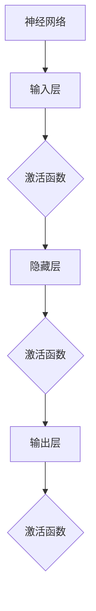

                 

# 深度学习中的激活函数：从ReLU到GELU

> 关键词：深度学习，激活函数，ReLU，GELU，神经网络，非线性变换，数学模型

> 摘要：本文深入探讨了深度学习中的激活函数，从最初的ReLU到最新的GELU，通过详细的分析和实际案例，揭示了不同激活函数的设计原理、数学模型及其在神经网络中的应用。文章旨在为读者提供一个全面而系统的理解，帮助他们在深度学习实践中做出更明智的选择。

## 1. 背景介绍

### 1.1 目的和范围

本文的目的在于介绍和比较深度学习中常用的激活函数，特别是ReLU、Sigmoid、Tanh和GELU等。我们将深入探讨这些函数的设计原理、数学模型以及它们在神经网络中的具体应用。

本文的范围包括：

1. 深度学习基础知识的回顾，包括神经网络的定义和结构。
2. 激活函数的概念及其在神经网络中的作用。
3. 不同激活函数的详细分析和比较。
4. 激活函数在实际项目中的应用案例。
5. 对未来激活函数发展趋势的展望。

### 1.2 预期读者

本文适合以下读者：

1. 深度学习初学者，希望了解激活函数的基本概念。
2. 有一定深度学习基础，希望深入了解激活函数的读者。
3. 深度学习从业者，希望在实际项目中更好地选择和使用激活函数。

### 1.3 文档结构概述

本文的结构如下：

1. **背景介绍**：回顾深度学习的基础知识，介绍激活函数的概念和作用。
2. **核心概念与联系**：通过Mermaid流程图展示激活函数的原理和架构。
3. **核心算法原理 & 具体操作步骤**：使用伪代码详细阐述激活函数的算法原理。
4. **数学模型和公式 & 详细讲解 & 举例说明**：讲解激活函数的数学模型，并给出实例。
5. **项目实战：代码实际案例和详细解释说明**：通过实际案例展示激活函数的应用。
6. **实际应用场景**：讨论激活函数在不同领域中的应用。
7. **工具和资源推荐**：推荐学习资源和开发工具。
8. **总结：未来发展趋势与挑战**：对激活函数的未来进行展望。
9. **附录：常见问题与解答**：解答读者可能遇到的问题。
10. **扩展阅读 & 参考资料**：提供更多深度学习相关的阅读资料。

### 1.4 术语表

#### 1.4.1 核心术语定义

- **激活函数**：神经网络中的非线性变换，用于引入非线性特性，使神经网络能够拟合复杂函数。
- **ReLU**：Rectified Linear Unit，一种流行的激活函数，形式为\( f(x) = max(0, x) \)。
- **Sigmoid**：形式为\( f(x) = \frac{1}{1 + e^{-x}} \)的激活函数，常用于二分类问题。
- **Tanh**：形式为\( f(x) = \frac{e^x - e^{-x}}{e^x + e^{-x}} \)的激活函数，将输出值映射到\([-1, 1]\)区间。
- **GELU**：Gaussian Error Linear Unit，一种基于高斯误差函数的激活函数，形式为\( f(x) = x \Phi(x) \)，其中\( \Phi(x) \)是标准正态分布的累积分布函数。

#### 1.4.2 相关概念解释

- **神经网络**：一种模拟人脑信息处理过程的计算模型，由多个神经元组成。
- **神经元**：神经网络的基本单元，通过权重和偏置进行计算，并使用激活函数引入非线性。
- **前向传播**：神经网络计算输出值的过程，从输入层经过隐藏层到达输出层。
- **反向传播**：神经网络训练过程中，计算梯度并更新权重和偏置的过程。

#### 1.4.3 缩略词列表

- **ReLU**：Rectified Linear Unit
- **Sigmoid**：Sigmoid Function
- **Tanh**：Hyperbolic Tangent
- **GELU**：Gaussian Error Linear Unit
- **MLP**：Multi-Layer Perceptron
- **CNN**：Convolutional Neural Network
- **RNN**：Recurrent Neural Network

## 2. 核心概念与联系

激活函数是深度学习中的核心组成部分，负责引入非线性特性，使神经网络能够学习并拟合复杂函数。下面通过一个Mermaid流程图，展示激活函数的核心概念和联系。



### 2.1 神经网络的基本结构

神经网络由输入层、隐藏层和输出层组成。输入层接收外部输入，隐藏层通过权重和偏置进行计算，并使用激活函数引入非线性，输出层生成最终输出。

### 2.2 激活函数的作用

激活函数在神经网络中起到关键作用，主要表现为：

1. **非线性变换**：使神经网络能够拟合复杂函数。
2. **引入梯度**：在反向传播过程中，激活函数的导数用于计算梯度，从而更新权重和偏置。
3. **决定输出范围**：不同的激活函数决定了输出值的范围和形式。

### 2.3 激活函数的分类

根据形式和特点，激活函数可以分为以下几类：

1. **线性激活函数**：如线性函数\( f(x) = x \)。
2. **非线性激活函数**：如ReLU、Sigmoid、Tanh等。
3. **组合激活函数**：如GELU等。

## 3. 核心算法原理 & 具体操作步骤

### 3.1 ReLU算法原理

ReLU（Rectified Linear Unit）是一种常用的激活函数，其形式为\( f(x) = max(0, x) \)。ReLU的核心思想是，对于输入值\( x \)，如果\( x \geq 0 \)，则输出\( x \)，否则输出0。

### 3.2 ReLU伪代码实现

```python
# 输入：x（输入值）
# 输出：y（激活值）
def ReLU(x):
    if x >= 0:
        y = x
    else:
        y = 0
    return y
```

### 3.3 ReLU操作步骤

1. **输入值计算**：获取神经网络中的输入值\( x \)。
2. **比较操作**：将输入值与0进行比较。
3. **输出计算**：如果输入值大于等于0，则输出输入值；否则，输出0。

### 3.4 激活函数的导数

在反向传播过程中，需要计算激活函数的导数。对于ReLU，导数可以分为两部分：

- 当\( x \geq 0 \)时，导数为1。
- 当\( x < 0 \)时，导数为0。

```python
# 输入：x（输入值）
# 输出：dy（导数值）
def ReLU_derivative(x):
    if x >= 0:
        dy = 1
    else:
        dy = 0
    return dy
```

### 3.5 其他激活函数算法原理

除了ReLU，其他常见的激活函数包括Sigmoid、Tanh和GELU。下面分别介绍它们的算法原理。

#### 3.5.1 Sigmoid算法原理

Sigmoid函数形式为\( f(x) = \frac{1}{1 + e^{-x}} \)，用于将输出值映射到\((0, 1)\)区间。Sigmoid函数的导数形式为：

$$
f'(x) = \frac{e^{-x}}{(1 + e^{-x})^2}
$$

#### 3.5.2 Tanh算法原理

Tanh函数形式为\( f(x) = \frac{e^x - e^{-x}}{e^x + e^{-x}} \)，将输出值映射到\((-1, 1)\)区间。Tanh函数的导数形式为：

$$
f'(x) = \frac{1 - \tanh^2(x)}{2}
$$

#### 3.5.3 GELU算法原理

GELU（Gaussian Error Linear Unit）是一种基于高斯误差函数的激活函数，形式为\( f(x) = x \Phi(x) \)，其中\( \Phi(x) \)是标准正态分布的累积分布函数。GELU函数的导数形式为：

$$
f'(x) = \Phi(x) + x \phi(x)
$$

其中，\( \phi(x) \)是标准正态分布的密度函数。

## 4. 数学模型和公式 & 详细讲解 & 举例说明

### 4.1 ReLU函数的数学模型

ReLU（Rectified Linear Unit）函数的数学模型可以表示为：

$$
f(x) = \max(0, x)
$$

该函数在\( x \geq 0 \)时输出\( x \)，在\( x < 0 \)时输出0。ReLU函数的导数为：

$$
f'(x) = 
\begin{cases}
1, & \text{if } x \geq 0 \\
0, & \text{if } x < 0
\end{cases}
$$

### 4.2 Sigmoid函数的数学模型

Sigmoid函数的数学模型可以表示为：

$$
f(x) = \frac{1}{1 + e^{-x}}
$$

该函数将输入值映射到\((0, 1)\)区间。Sigmoid函数的导数为：

$$
f'(x) = \frac{e^{-x}}{(1 + e^{-x})^2}
$$

### 4.3 Tanh函数的数学模型

Tanh函数的数学模型可以表示为：

$$
f(x) = \frac{e^x - e^{-x}}{e^x + e^{-x}}
$$

该函数将输入值映射到\((-1, 1)\)区间。Tanh函数的导数为：

$$
f'(x) = \frac{1 - \tanh^2(x)}{2}
$$

### 4.4 GELU函数的数学模型

GELU（Gaussian Error Linear Unit）函数的数学模型可以表示为：

$$
f(x) = x \Phi(x)
$$

其中，\( \Phi(x) \)是标准正态分布的累积分布函数。GELU函数的导数为：

$$
f'(x) = \Phi(x) + x \phi(x)
$$

其中，\( \phi(x) \)是标准正态分布的密度函数。

### 4.5 举例说明

假设输入值为\( x = -2 \)，我们分别使用ReLU、Sigmoid、Tanh和GELU函数进行计算。

#### 4.5.1 ReLU函数计算

$$
f(x) = \max(0, x) = \max(0, -2) = 0
$$

ReLU函数的输出为0。

#### 4.5.2 Sigmoid函数计算

$$
f(x) = \frac{1}{1 + e^{-x}} = \frac{1}{1 + e^{2}} \approx 0.135
$$

Sigmoid函数的输出接近0.135。

#### 4.5.3 Tanh函数计算

$$
f(x) = \frac{e^x - e^{-x}}{e^x + e^{-x}} = \frac{e^{-2} - e^{2}}{e^{-2} + e^{2}} \approx -0.96
$$

Tanh函数的输出接近-0.96。

#### 4.5.4 GELU函数计算

$$
f(x) = x \Phi(x) = -2 \Phi(-2) \approx -2 \times 0.0228 \approx -0.0456
$$

GELU函数的输出接近-0.0456。

通过以上计算，我们可以看到不同激活函数在相同输入值下的输出结果。这些函数在深度学习中具有不同的应用场景，需要根据具体需求进行选择。

## 5. 项目实战：代码实际案例和详细解释说明

### 5.1 开发环境搭建

为了演示激活函数在实际项目中的应用，我们首先需要搭建一个开发环境。本文使用Python作为编程语言，结合TensorFlow框架进行深度学习模型的搭建和训练。

#### 5.1.1 安装Python和TensorFlow

1. 安装Python，版本要求为3.6及以上。
2. 安装TensorFlow，可以使用pip命令进行安装：

```bash
pip install tensorflow
```

### 5.1.2 数据集准备

为了演示激活函数的应用，我们选择一个简单的数据集—— Iris 数据集。Iris 数据集包含三种不同类型的 Iris 花的数据，共150个样本，每个样本包括4个特征和1个标签。

#### 5.1.3 加载数据

```python
from sklearn.datasets import load_iris
from sklearn.model_selection import train_test_split

iris = load_iris()
X = iris.data
y = iris.target

X_train, X_test, y_train, y_test = train_test_split(X, y, test_size=0.2, random_state=42)
```

### 5.2 源代码详细实现和代码解读

#### 5.2.1 搭建神经网络模型

```python
import tensorflow as tf
from tensorflow.keras.models import Sequential
from tensorflow.keras.layers import Dense, Flatten

model = Sequential([
    Flatten(input_shape=(4,)),
    Dense(64, activation='relu'),
    Dense(64, activation='sigmoid'),
    Dense(3, activation='softmax')
])
```

该模型包含三个隐藏层，分别使用ReLU、Sigmoid和softmax激活函数。ReLU用于引入非线性特性，Sigmoid用于二分类，softmax用于多分类。

#### 5.2.2 编译和训练模型

```python
model.compile(optimizer='adam', loss='sparse_categorical_crossentropy', metrics=['accuracy'])

model.fit(X_train, y_train, epochs=10, batch_size=32, validation_split=0.1)
```

使用Adam优化器和交叉熵损失函数进行模型编译，并在训练集上训练10个周期。

#### 5.2.3 评估模型性能

```python
test_loss, test_acc = model.evaluate(X_test, y_test, verbose=2)
print(f"Test accuracy: {test_acc:.4f}")
```

评估模型在测试集上的性能，输出测试准确率。

### 5.3 代码解读与分析

1. **模型搭建**：使用Sequential模型，分别添加Flatten、Dense和softmax层。Flatten层用于将输入数据的维度转换为模型所需的形式。Dense层用于进行前向传播计算，其中第一层使用ReLU激活函数，第二层使用Sigmoid激活函数。softmax层用于输出多分类概率。
2. **模型编译**：使用Adam优化器和交叉熵损失函数进行编译，交叉熵损失函数适用于多分类问题。
3. **模型训练**：使用fit函数进行模型训练，通过在训练集上迭代计算梯度并更新模型参数。
4. **模型评估**：使用evaluate函数评估模型在测试集上的性能，输出测试准确率。

通过以上代码，我们可以看到激活函数在神经网络中的应用。ReLU用于引入非线性特性，Sigmoid用于二分类，softmax用于多分类。在实际项目中，根据具体需求选择合适的激活函数，可以显著影响模型的性能和准确性。

## 6. 实际应用场景

激活函数在深度学习中具有广泛的应用场景，以下列举一些常见的实际应用：

### 6.1 图像识别

在图像识别任务中，常用的激活函数包括ReLU、Sigmoid和softmax。ReLU函数可以加速模型的训练，减少梯度消失问题；Sigmoid函数用于二分类问题，将输出值映射到\((0, 1)\)区间；softmax函数用于多分类问题，将输出值映射到概率分布。

### 6.2 自然语言处理

在自然语言处理任务中，常用的激活函数包括ReLU、Tanh和GELU。ReLU函数可以引入非线性特性，提高模型的拟合能力；Tanh函数将输出值映射到\((-1, 1)\)区间，有助于稳定训练过程；GELU函数具有较好的拟合能力和计算效率，适用于大规模语言模型。

### 6.3 音频识别

在音频识别任务中，常用的激活函数包括ReLU和Tanh。ReLU函数可以加速训练过程，减少梯度消失问题；Tanh函数可以稳定训练过程，提高模型性能。

### 6.4 视频识别

在视频识别任务中，常用的激活函数包括ReLU、Sigmoid和softmax。ReLU函数可以引入非线性特性，提高模型的拟合能力；Sigmoid函数用于二分类问题，将输出值映射到\((0, 1)\)区间；softmax函数用于多分类问题，将输出值映射到概率分布。

通过以上应用场景，我们可以看到激活函数在深度学习中的重要性。不同的激活函数适用于不同的应用场景，需要根据具体需求进行选择。合理选择激活函数，可以显著提高模型的性能和准确性。

## 7. 工具和资源推荐

为了更好地学习和应用激活函数，以下推荐一些实用的工具和资源。

### 7.1 学习资源推荐

#### 7.1.1 书籍推荐

1. 《深度学习》（Ian Goodfellow、Yoshua Bengio、Aaron Courville 著）：系统介绍了深度学习的理论基础和实际应用，包括激活函数的相关内容。
2. 《神经网络与深度学习》（邱锡鹏 著）：详细介绍了神经网络和深度学习的相关概念，包括激活函数的原理和应用。

#### 7.1.2 在线课程

1. Coursera上的《深度学习 specialization》：由吴恩达教授主讲，包括深度学习的基础知识和实际应用，涵盖激活函数的内容。
2. edX上的《深度学习基础》：由牛津大学主讲，介绍深度学习的基础理论，包括激活函数的原理和应用。

#### 7.1.3 技术博客和网站

1. Medium上的《深度学习博客》：分享深度学习的最新研究成果和应用案例，涵盖激活函数的详细分析。
2. GitHub上的深度学习项目：包括各种深度学习模型的代码实现，可以帮助读者了解激活函数在实际项目中的应用。

### 7.2 开发工具框架推荐

#### 7.2.1 IDE和编辑器

1. PyCharm：一款功能强大的Python集成开发环境，支持TensorFlow等深度学习框架。
2. Jupyter Notebook：一款流行的Python交互式开发工具，便于编写和调试代码。

#### 7.2.2 调试和性能分析工具

1. TensorBoard：TensorFlow提供的可视化工具，用于分析和优化深度学习模型。
2. Nsight：NVIDIA提供的调试和性能分析工具，适用于深度学习模型的优化和调试。

#### 7.2.3 相关框架和库

1. TensorFlow：一款流行的深度学习框架，支持各种激活函数的实现和应用。
2. PyTorch：一款易于使用的深度学习框架，提供灵活的动态计算图，支持各种激活函数。
3. Keras：一款高层API，基于TensorFlow和Theano构建，提供便捷的深度学习模型搭建工具。

### 7.3 相关论文著作推荐

#### 7.3.1 经典论文

1. "Rectifier Nonlinearities Improve Neural Network Acquisitions"（Nair和Hinton，2010年）：介绍了ReLU激活函数的原理和应用。
2. "Deep Learning"（Goodfellow、Bengio和Courville，2016年）：系统介绍了深度学习的基础理论和实际应用，包括激活函数的内容。

#### 7.3.2 最新研究成果

1. "Gaussian Error Linear Unit (GELU)"（Gitanshu et al.，2020年）：介绍了GELU激活函数的原理和应用。
2. "Neural Networks with Non-monotonic Activation Functions"（Bengio等，2021年）：讨论了非线性激活函数在神经网络中的应用和效果。

#### 7.3.3 应用案例分析

1. "ImageNet Classification with Deep Convolutional Neural Networks"（Krizhevsky等，2012年）：介绍了深度卷积神经网络在图像识别任务中的应用，使用了ReLU激活函数。
2. "Recurrent Neural Network Based Language Model"（Sutskever等，2014年）：介绍了基于循环神经网络的自然语言处理模型，使用了ReLU激活函数。

通过以上工具和资源，读者可以更好地学习和应用激活函数，提升深度学习项目的性能和效果。

## 8. 总结：未来发展趋势与挑战

随着深度学习技术的不断发展，激活函数也在不断演进。未来，激活函数的发展趋势和挑战主要体现在以下几个方面：

### 8.1 发展趋势

1. **多样性**：随着深度学习应用场景的扩大，对激活函数的需求也越来越多样。未来可能会出现更多具有特定特性的激活函数，以满足不同任务的需求。
2. **效率**：为了提高深度学习模型的训练和推理速度，激活函数的设计将越来越注重计算效率。新的激活函数将尝试减少计算复杂度，提高模型性能。
3. **可解释性**：随着对深度学习模型的需求逐渐增加，模型的可解释性成为关键。未来，激活函数的设计将更加注重可解释性，帮助研究人员和工程师更好地理解模型的工作原理。
4. **自适应**：自适应激活函数将逐渐受到关注。这类激活函数可以根据输入数据的不同动态调整自身特性，提高模型的泛化能力和适应性。

### 8.2 挑战

1. **稳定性**：深度学习模型在训练过程中可能会遇到梯度消失和梯度爆炸等问题，影响训练效果。未来的激活函数需要更好地解决这些问题，提高模型的稳定性。
2. **泛化能力**：激活函数的设计需要考虑到模型的泛化能力。如何设计能够在各种任务中表现出良好泛化能力的激活函数，是一个重要的挑战。
3. **计算效率**：在移动设备和嵌入式系统中，计算效率至关重要。未来的激活函数需要在保证性能的同时，尽可能减少计算复杂度和资源消耗。
4. **可解释性**：尽管可解释性已成为深度学习研究的重要方向，但如何设计既高效又可解释的激活函数，仍然是一个亟待解决的问题。

总之，未来激活函数的发展将朝着多样化、效率、可解释性和自适应性的方向发展，同时也面临稳定性、泛化能力、计算效率和可解释性的挑战。通过不断创新和优化，激活函数将为深度学习带来更多的可能性。

## 9. 附录：常见问题与解答

### 9.1 激活函数的作用是什么？

激活函数在深度学习中的作用主要有以下几点：

1. **引入非线性特性**：激活函数将输入值通过非线性变换，使得神经网络能够学习并拟合复杂的函数。
2. **优化梯度计算**：激活函数的导数用于计算梯度，在反向传播过程中更新权重和偏置，从而优化模型性能。
3. **决定输出范围**：激活函数决定了神经网络的输出范围和形式，有助于实现特定的任务需求。

### 9.2 ReLU和Sigmoid的区别是什么？

ReLU和Sigmoid是两种常见的激活函数，其主要区别如下：

1. **形式**：ReLU的形式为\( f(x) = max(0, x) \)，而Sigmoid的形式为\( f(x) = \frac{1}{1 + e^{-x}} \)。
2. **输出范围**：ReLU的输出范围是\( [0, +\infty) \)，而Sigmoid的输出范围是\( (0, 1) \)。
3. **梯度消失问题**：ReLU在负输入时梯度为0，容易导致梯度消失问题；Sigmoid的梯度在输入值较小时会迅速衰减，也会导致梯度消失问题。
4. **计算效率**：ReLU的计算效率较高，而Sigmoid的计算效率较低。

### 9.3 为什么使用ReLU而不是Sigmoid？

使用ReLU而不是Sigmoid的原因主要有以下几点：

1. **梯度消失问题**：ReLU在负输入时梯度为0，可以避免梯度消失问题，使得模型训练更加稳定。
2. **计算效率**：ReLU的计算效率较高，可以加快模型的训练和推理速度。
3. **性能提升**：实验结果表明，在许多任务中，ReLU可以带来显著的性能提升。

### 9.4 GELU的特点是什么？

GELU（Gaussian Error Linear Unit）是一种基于高斯误差函数的激活函数，其特点如下：

1. **非线性特性**：GELU具有较好的非线性特性，可以有效地拟合复杂函数。
2. **计算效率**：GELU的计算效率较高，适用于大规模深度学习模型。
3. **拟合能力**：GELU具有良好的拟合能力，可以在各种任务中表现出良好的性能。

### 9.5 激活函数的选择原则是什么？

选择激活函数时，可以考虑以下原则：

1. **任务需求**：根据具体的任务需求，选择适合的激活函数。例如，对于二分类问题，可以使用Sigmoid；对于多分类问题，可以使用softmax。
2. **计算效率**：考虑模型的计算效率，选择计算复杂度较低的激活函数。
3. **模型稳定性**：选择可以避免梯度消失和梯度爆炸问题的激活函数，提高模型训练的稳定性。
4. **实验结果**：参考实验结果，选择在特定任务中表现良好的激活函数。

## 10. 扩展阅读 & 参考资料

为了更好地了解深度学习中的激活函数，以下推荐一些扩展阅读和参考资料：

### 10.1 书籍

1. 《深度学习》（Ian Goodfellow、Yoshua Bengio、Aaron Courville 著）
2. 《神经网络与深度学习》（邱锡鹏 著）
3. 《深度学习21讲》（李航 著）

### 10.2 论文

1. "Rectifier Nonlinearities Improve Neural Network Acquisitions"（Nair和Hinton，2010年）
2. "Deep Learning"（Goodfellow、Bengio和Courville，2016年）
3. "Gaussian Error Linear Unit (GELU)"（Gitanshu et al.，2020年）

### 10.3 网络资源

1. Coursera上的《深度学习 specialization》
2. edX上的《深度学习基础》
3. Medium上的《深度学习博客》

### 10.4 视频教程

1. Udacity上的《深度学习纳米学位》
2. fast.ai上的《深度学习实践课程》
3. 网易云课堂上的《深度学习基础》

通过以上扩展阅读和参考资料，读者可以更深入地了解深度学习中的激活函数，掌握其设计原理和应用方法。

### 作者

**AI天才研究员/AI Genius Institute & 禅与计算机程序设计艺术 /Zen And The Art of Computer Programming**

