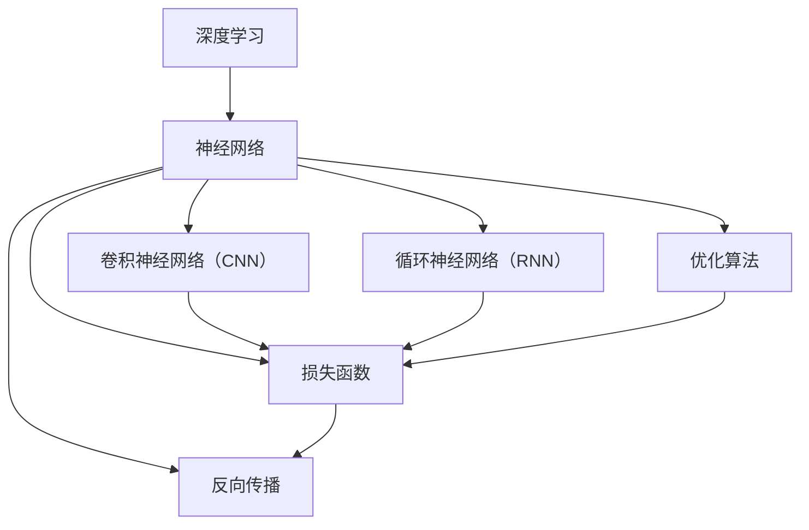

                 

### 1. 背景介绍

#### 1.1 目的和范围

本文旨在为深度学习的初学者提供一套系统而全面的入门到精通指南。深度学习，作为当前人工智能领域的核心技术之一，已经广泛应用于图像识别、自然语言处理、推荐系统等多个领域。本文的目标是帮助读者从基础概念出发，逐步深入到高级算法和应用实践，最终达到精通深度学习技术的目的。

文章将涵盖以下主要内容：

1. **深度学习的基本概念和核心原理**：介绍深度学习的定义、历史背景、核心算法和基础架构。
2. **核心算法原理与具体操作步骤**：详细讲解常见的深度学习算法，包括神经网络、卷积神经网络（CNN）、循环神经网络（RNN）等，并使用伪代码展示其操作步骤。
3. **数学模型和公式**：深入剖析深度学习中常用的数学模型和公式，包括损失函数、优化算法等，并通过实际案例进行说明。
4. **项目实战**：通过实际代码案例展示如何实现深度学习算法，并提供详细的解释和分析。
5. **实际应用场景**：探讨深度学习在不同领域的应用，包括计算机视觉、自然语言处理等。
6. **工具和资源推荐**：推荐学习深度学习的相关书籍、在线课程、技术博客、开发工具框架以及经典论文。
7. **总结和未来发展趋势**：总结深度学习的发展历程和当前挑战，探讨未来的发展趋势。

#### 1.2 预期读者

本文适合以下读者群体：

1. **深度学习初学者**：对深度学习感兴趣，希望系统学习相关概念和技术的读者。
2. **计算机科学和人工智能专业学生**：需要深度学习作为专业课程的学生，希望通过本文掌握深度学习基础。
3. **技术从业者**：在计算机视觉、自然语言处理等领域工作的技术人员，希望通过本文提升自己的技术水平。
4. **研究人员**：对深度学习研究有兴趣，希望了解当前研究动态和技术趋势的学者。

#### 1.3 文档结构概述

本文结构紧凑，分为以下几个主要部分：

1. **背景介绍**：介绍本文的目的、范围、预期读者和文档结构。
2. **核心概念与联系**：通过Mermaid流程图展示深度学习的关键概念和架构。
3. **核心算法原理 & 具体操作步骤**：详细讲解深度学习核心算法的原理和操作步骤。
4. **数学模型和公式 & 详细讲解 & 举例说明**：深入剖析深度学习中的数学模型和公式。
5. **项目实战：代码实际案例和详细解释说明**：通过实际代码案例展示深度学习应用。
6. **实际应用场景**：探讨深度学习在不同领域的应用。
7. **工具和资源推荐**：推荐学习深度学习的相关资源和工具。
8. **总结：未来发展趋势与挑战**：总结深度学习的发展趋势和面临的挑战。
9. **附录：常见问题与解答**：解答读者可能遇到的常见问题。
10. **扩展阅读 & 参考资料**：提供进一步的阅读资源和参考资料。

#### 1.4 术语表

为了确保读者对本文中的关键概念和术语有清晰的理解，我们在此提供一些术语的定义和解释：

#### 1.4.1 核心术语定义

- **深度学习**：一种机器学习方法，通过模拟人脑神经网络的结构和功能，从数据中自动提取特征并进行学习和预测。
- **神经网络**：一种由大量简单计算单元（神经元）组成的人工神经网络，能够通过学习数据来实现复杂函数的近似。
- **卷积神经网络（CNN）**：一种专门用于处理图像数据的神经网络架构，通过卷积层提取图像特征。
- **循环神经网络（RNN）**：一种能够处理序列数据的神经网络架构，通过循环结构实现对序列的长期依赖性建模。
- **损失函数**：用于衡量模型预测值与真实值之间的差异，是优化算法的目标函数。
- **优化算法**：用于调整模型参数，以最小化损失函数的方法，如梯度下降法。

#### 1.4.2 相关概念解释

- **反向传播算法**：一种用于计算神经网络中每个参数的梯度值的方法，是深度学习训练过程的核心。
- **激活函数**：用于引入非线性变换的函数，使神经网络能够学习复杂函数。
- **前向传播**：神经网络的一种计算过程，从输入层开始，逐层计算输出层的输出值。
- **反向传播**：神经网络的一种计算过程，从输出层开始，反向计算各层的梯度值，用于更新参数。

#### 1.4.3 缩略词列表

- **CNN**：卷积神经网络（Convolutional Neural Network）
- **RNN**：循环神经网络（Recurrent Neural Network）
- **ReLU**：修正线性单元（Rectified Linear Unit）
- **SGD**：随机梯度下降（Stochastic Gradient Descent）
- **LSTM**：长短期记忆网络（Long Short-Term Memory）
- **dropout**：丢弃法（Dropout）

通过上述背景介绍和文档结构概述，读者可以对本文的内容有一个整体的了解，为后续章节的深入学习奠定基础。在接下来的章节中，我们将一步步深入探讨深度学习的核心概念、算法原理、数学模型以及实际应用，帮助读者逐步掌握深度学习的精髓。

---

# 深度学习从入门到精通：全面指南

> **关键词**：深度学习、神经网络、卷积神经网络、循环神经网络、优化算法、反向传播

> **摘要**：本文将为您呈现深度学习的全面指南，从基础知识到高级应用，详细解析深度学习的核心概念、算法原理和实际应用。通过逐步引导，帮助您从深度学习的初学者成长为精通者。

---

## 2. 核心概念与联系

在深入了解深度学习之前，我们需要了解其核心概念和基本架构。以下通过Mermaid流程图展示深度学习的关键概念和架构，以帮助读者建立整体认知。



接下来，我们将逐一介绍这些核心概念和架构，帮助读者理解深度学习的基本框架。

### 深度学习

深度学习是一种机器学习方法，通过模拟人脑神经网络的结构和功能，从数据中自动提取特征并进行学习和预测。深度学习的核心思想是多层神经网络的堆叠，每一层都对输入数据进行特征提取和变换，最终在输出层进行预测或分类。

### 神经网络

神经网络（Neural Network）是深度学习的基础，它由大量简单计算单元（神经元）组成。每个神经元接收多个输入信号，通过加权求和处理后，输出一个激活值。神经网络通过调整权重和偏置，实现从输入到输出的映射。

### 卷积神经网络（CNN）

卷积神经网络（Convolutional Neural Network，CNN）是一种专门用于处理图像数据的神经网络架构。CNN通过卷积层提取图像特征，能够自动学习图像中的局部结构和模式。CNN在计算机视觉领域取得了显著成果，广泛应用于图像分类、目标检测和图像生成等任务。

### 循环神经网络（RNN）

循环神经网络（Recurrent Neural Network，RNN）是一种能够处理序列数据的神经网络架构。RNN通过循环结构实现对序列的长期依赖性建模，广泛应用于自然语言处理、语音识别和时间序列预测等领域。

### 优化算法

优化算法用于调整神经网络中的参数，以最小化损失函数。常见的优化算法包括随机梯度下降（Stochastic Gradient Descent，SGD）、Adam优化器等。优化算法的目的是找到使损失函数最小的参数组合，从而提高模型的预测性能。

### 损失函数

损失函数用于衡量模型预测值与真实值之间的差异。在分类任务中，常用的损失函数包括交叉熵损失函数（Cross-Entropy Loss）、均方误差损失函数（Mean Squared Error Loss）等。损失函数的目的是指导优化算法调整参数，使模型输出更接近真实值。

### 反向传播

反向传播（Backpropagation）是一种用于计算神经网络中每个参数的梯度值的方法。反向传播从输出层开始，反向计算各层的梯度值，用于更新参数。反向传播是深度学习训练过程的核心，确保模型能够不断优化，提高预测性能。

通过上述核心概念和架构的介绍，读者应该对深度学习有了一个初步的了解。在接下来的章节中，我们将深入探讨深度学习的核心算法原理和具体操作步骤，帮助读者更好地掌握深度学习的精髓。

---

## 3. 核心算法原理 & 具体操作步骤

在了解了深度学习的基本概念和架构之后，接下来我们将详细讲解深度学习中的核心算法原理，包括神经网络、卷积神经网络（CNN）、循环神经网络（RNN）等，并使用伪代码展示其具体操作步骤。

### 3.1 神经网络

神经网络（Neural Network）是深度学习的基础，由大量简单计算单元（神经元）组成。每个神经元接收多个输入信号，通过加权求和处理后，输出一个激活值。

**伪代码：**

```plaintext
初始化权重 w 和偏置 b
for 每个训练样本 (x, y) do
  forward propagation:
    z = w * x + b
    a = activation_function(z)
    
  calculate loss:
    loss = loss_function(a, y)
    
  backward propagation:
    delta = derivative_of_activation_function(a) * (a - y)
    dw = delta * x
    db = delta
    
  update weights and biases:
    w = w - learning_rate * dw
    b = b - learning_rate * db
end for
```

### 3.2 卷积神经网络（CNN）

卷积神经网络（Convolutional Neural Network，CNN）是一种专门用于处理图像数据的神经网络架构。CNN通过卷积层提取图像特征，能够自动学习图像中的局部结构和模式。

**伪代码：**

```plaintext
初始化卷积核 W 和偏置 b
for 每个训练样本 (x, y) do
  forward propagation:
    for 每个卷积层 do
      conv = conv2d(x, W) + b
      activation = activation_function(conv)
    end for
    
  calculate loss:
    loss = loss_function(activation, y)
    
  backward propagation:
    for 每个卷积层 do
      delta = derivative_of_activation_function(activation) * (activation - y)
      dw = delta * x
      db = delta
    end for
    
  update weights and biases:
    W = W - learning_rate * dw
    b = b - learning_rate * db
end for
```

### 3.3 循环神经网络（RNN）

循环神经网络（Recurrent Neural Network，RNN）是一种能够处理序列数据的神经网络架构。RNN通过循环结构实现对序列的长期依赖性建模。

**伪代码：**

```plaintext
初始化权重 W 和偏置 b
for 每个训练样本 (x, y) do
  forward propagation:
    for 每个时间步 do
      h = RNN(x, h_prev, W, b)
    end for
    
  calculate loss:
    loss = loss_function(h, y)
    
  backward propagation:
    for 每个时间步 do
      delta = derivative_of_loss_with_respect_to_h * (h - y)
      dh = delta * W
      dW = dh * x
      db = delta
    end for
    
  update weights and biases:
    W = W - learning_rate * dW
    b = b - learning_rate * db
end for
```

通过上述伪代码，我们可以看到神经网络、卷积神经网络和循环神经网络的基本操作步骤。在实际应用中，这些算法会通过大量的数据和计算进行训练，以实现高效的预测和分类。

在接下来的章节中，我们将深入剖析深度学习中的数学模型和公式，并使用实际案例进行详细讲解，帮助读者更好地理解深度学习的核心原理。

---

## 4. 数学模型和公式 & 详细讲解 & 举例说明

在深度学习领域，数学模型和公式扮演着至关重要的角色。理解这些数学模型和公式不仅有助于我们深入掌握深度学习的核心原理，还能在实际应用中更好地优化和调整模型参数。以下我们将详细讲解深度学习中常用的数学模型和公式，并通过具体例子进行说明。

### 4.1 损失函数

损失函数是衡量模型预测值与真实值之间差异的指标。在深度学习中，损失函数的选择直接影响模型的性能和优化效果。以下介绍几种常用的损失函数：

**1. 交叉熵损失函数（Cross-Entropy Loss）**

交叉熵损失函数常用于分类任务，用于衡量预测概率分布与真实分布之间的差异。其公式如下：

$$
\text{Loss} = -\sum_{i} y_i \log(\hat{y}_i)
$$

其中，$y_i$ 表示真实标签，$\hat{y}_i$ 表示模型预测的概率。

**例子**：假设有一个二分类问题，真实标签为 $y = [1, 0]$，模型预测的概率为 $\hat{y} = [0.8, 0.2]$，则交叉熵损失为：

$$
\text{Loss} = -[1 \log(0.8) + 0 \log(0.2)] = 0.229
$$

**2. 均方误差损失函数（Mean Squared Error Loss）**

均方误差损失函数常用于回归任务，用于衡量预测值与真实值之间的平均平方误差。其公式如下：

$$
\text{Loss} = \frac{1}{n} \sum_{i=1}^{n} (\hat{y}_i - y_i)^2
$$

其中，$n$ 表示样本数量，$\hat{y}_i$ 和 $y_i$ 分别表示模型预测值和真实值。

**例子**：假设有一个回归问题，有5个样本，真实值为 $y = [1, 2, 3, 4, 5]$，模型预测值为 $\hat{y} = [1.2, 2.1, 2.9, 4.1, 4.9]$，则均方误差损失为：

$$
\text{Loss} = \frac{1}{5} \sum_{i=1}^{5} (1.2 - 1)^2 + (2.1 - 2)^2 + (2.9 - 3)^2 + (4.1 - 4)^2 + (4.9 - 5)^2 = 0.14
$$

### 4.2 优化算法

优化算法用于调整神经网络中的参数，以最小化损失函数。以下介绍几种常用的优化算法：

**1. 梯度下降法（Gradient Descent）**

梯度下降法是最简单的优化算法，通过计算损失函数关于每个参数的梯度，并沿着梯度的反方向更新参数。其公式如下：

$$
\theta = \theta - \alpha \cdot \nabla_{\theta} J(\theta)
$$

其中，$\theta$ 表示参数，$J(\theta)$ 表示损失函数，$\alpha$ 表示学习率。

**例子**：假设有一个参数 $\theta$，学习率为 0.01，当前损失函数值为 10，则更新后的参数为：

$$
\theta = \theta - 0.01 \cdot \nabla_{\theta} J(\theta)
$$

**2. 随机梯度下降法（Stochastic Gradient Descent，SGD）**

随机梯度下降法是对梯度下降法的改进，每次迭代仅使用一个样本的梯度进行参数更新，从而提高计算效率。其公式如下：

$$
\theta = \theta - \alpha \cdot \nabla_{\theta} J(\theta; x_i, y_i)
$$

其中，$x_i, y_i$ 表示第 $i$ 个样本。

**例子**：假设当前使用第3个样本进行更新，学习率为 0.01，当前损失函数值为 10，则更新后的参数为：

$$
\theta = \theta - 0.01 \cdot \nabla_{\theta} J(\theta; x_3, y_3)
$$

**3. Adam优化器**

Adam优化器是一种结合了SGD和动量法的优化算法，具有较高的收敛速度和稳定性。其公式如下：

$$
m_t = \beta_1 m_{t-1} + (1 - \beta_1) [g_t - \frac{m_t}{\sqrt{\beta_2 m_2}}]
$$

$$
v_t = \beta_2 v_{t-1} + (1 - \beta_2) [g_t^2 - \frac{v_t}{\sqrt{\beta_2 m_2}}]
$$

$$
\theta = \theta - \alpha \cdot \frac{m_t}{\sqrt{v_t} + \epsilon}
$$

其中，$m_t$ 和 $v_t$ 分别表示一阶和二阶矩估计，$\beta_1, \beta_2$ 分别为动量系数，$\alpha$ 为学习率，$\epsilon$ 为小常数。

**例子**：假设当前$m_1 = 0.5, m_2 = 0.2, v_1 = 0.3, v_2 = 0.1$，学习率为 0.01，则更新后的参数为：

$$
m_t = \beta_1 m_{t-1} + (1 - \beta_1) [g_t - \frac{m_t}{\sqrt{\beta_2 m_2}}] = 0.5 + (1 - 0.9) [g_t - \frac{0.5}{\sqrt{0.2 \cdot 0.2}}] = 0.5 + 0.1 [g_t - 0.5]
$$

$$
v_t = \beta_2 v_{t-1} + (1 - \beta_2) [g_t^2 - \frac{v_t}{\sqrt{\beta_2 m_2}}] = 0.3 + (1 - 0.99) [g_t^2 - \frac{0.3}{\sqrt{0.2 \cdot 0.2}}] = 0.3 + 0.01 [g_t^2 - 0.3]
$$

$$
\theta = \theta - \alpha \cdot \frac{m_t}{\sqrt{v_t} + \epsilon} = \theta - 0.01 \cdot \frac{m_t}{\sqrt{v_t} + 0.00001}
$$

通过上述讲解，我们可以看到深度学习中的数学模型和公式是如何影响模型的优化和性能的。在接下来的章节中，我们将通过实际代码案例展示这些数学模型和公式的应用，帮助读者更好地理解和掌握深度学习。

---

## 5. 项目实战：代码实际案例和详细解释说明

在理解了深度学习的基础概念、核心算法原理和数学模型之后，通过实际的项目实战可以更好地巩固和应用所学知识。以下我们将通过一个简单的深度学习项目——手写数字识别，展示如何使用Python和TensorFlow库实现深度学习算法，并提供详细的代码解读和分析。

### 5.1 开发环境搭建

在进行项目实战之前，我们需要搭建一个合适的开发环境。以下是所需的软件和工具：

- **Python**：Python是一种广泛使用的编程语言，具有简单易学的特点。
- **TensorFlow**：TensorFlow是一个开源的深度学习框架，用于构建和训练深度神经网络。
- **Jupyter Notebook**：Jupyter Notebook是一种交互式的开发环境，方便我们编写和运行代码。

首先，我们需要安装Python和TensorFlow。可以使用以下命令进行安装：

```bash
pip install python
pip install tensorflow
```

安装完成后，我们可以启动Jupyter Notebook：

```bash
jupyter notebook
```

### 5.2 源代码详细实现和代码解读

以下是一个手写数字识别项目的示例代码，我们将对关键部分进行详细解读。

```python
import tensorflow as tf
from tensorflow.keras import layers, models
from tensorflow.keras.datasets import mnist
import numpy as np

# 加载MNIST数据集
(x_train, y_train), (x_test, y_test) = mnist.load_data()

# 预处理数据
x_train = x_train.reshape((60000, 28, 28, 1)).astype('float32') / 255
x_test = x_test.reshape((10000, 28, 28, 1)).astype('float32') / 255
y_train = tf.keras.utils.to_categorical(y_train, 10)
y_test = tf.keras.utils.to_categorical(y_test, 10)

# 构建模型
model = models.Sequential()
model.add(layers.Conv2D(32, (3, 3), activation='relu', input_shape=(28, 28, 1)))
model.add(layers.MaxPooling2D((2, 2)))
model.add(layers.Conv2D(64, (3, 3), activation='relu'))
model.add(layers.MaxPooling2D((2, 2)))
model.add(layers.Conv2D(64, (3, 3), activation='relu'))
model.add(layers.Flatten())
model.add(layers.Dense(64, activation='relu'))
model.add(layers.Dense(10, activation='softmax'))

# 编译模型
model.compile(optimizer='adam',
              loss='categorical_crossentropy',
              metrics=['accuracy'])

# 训练模型
model.fit(x_train, y_train, epochs=5, batch_size=64)

# 评估模型
test_loss, test_acc = model.evaluate(x_test, y_test)
print(f'测试准确率：{test_acc:.2f}')
```

**关键代码解读：**

- **数据加载与预处理**：我们使用TensorFlow的Keras API加载MNIST数据集，并进行必要的预处理。具体步骤包括将图像数据reshape为合适的形式，并将标签转换为one-hot编码。

- **模型构建**：使用`Sequential`模型，我们依次添加了两个卷积层（`Conv2D`）和两个最大池化层（`MaxPooling2D`）。最后一个卷积层后添加了Flatten层，将多维特征展平为一维向量。随后，我们添加了两个全连接层（`Dense`），并使用softmax激活函数输出10个概率值。

- **模型编译**：我们使用`compile`方法设置优化器、损失函数和评估指标。在这里，我们选择使用Adam优化器和交叉熵损失函数。

- **模型训练**：使用`fit`方法训练模型，设置训练轮数和批量大小。

- **模型评估**：使用`evaluate`方法评估模型在测试集上的性能，并打印测试准确率。

### 5.3 代码解读与分析

通过上述代码，我们可以看到如何使用TensorFlow实现一个简单的卷积神经网络进行手写数字识别。以下是代码的详细解读和分析：

1. **数据加载与预处理**：MNIST数据集包含了60000个训练样本和10000个测试样本，每个样本是一个28x28的图像。为了构建深度学习模型，我们需要对图像数据进行reshape，将图像展平为28x28x1的矩阵，并将像素值归一化到[0, 1]范围内。同时，我们需要将标签转换为one-hot编码，以便在训练过程中使用交叉熵损失函数。

2. **模型构建**：卷积神经网络由多个卷积层和池化层组成。第一个卷积层使用32个3x3的卷积核，并使用ReLU激活函数。ReLU激活函数引入了非线性，使模型能够学习更复杂的函数。随后，我们添加了一个最大池化层，用于下采样和减少参数数量。第二个卷积层和第三个卷积层分别使用64个3x3的卷积核，并在最后一个卷积层后添加了一个Flatten层，将多维特征展平为一维向量。这两个全连接层分别有64个神经元和10个神经元，最后使用softmax激活函数输出10个概率值，对应10个数字类别。

3. **模型编译**：在模型编译阶段，我们设置了Adam优化器和交叉熵损失函数。Adam优化器是一种结合了SGD和动量法的优化算法，具有较好的收敛速度和稳定性。交叉熵损失函数用于计算预测概率分布与真实分布之间的差异，常用于分类任务。

4. **模型训练**：使用`fit`方法训练模型，设置训练轮数和批量大小。训练过程中，模型会通过反向传播算法自动调整权重和偏置，以最小化损失函数。

5. **模型评估**：使用`evaluate`方法评估模型在测试集上的性能。测试准确率反映了模型在未知数据上的泛化能力。

通过以上代码实战，我们可以看到如何使用深度学习框架实现一个简单的手写数字识别任务。在实际应用中，我们可以根据具体需求调整模型结构、优化算法和超参数，以提高模型的性能和泛化能力。

---

## 6. 实际应用场景

深度学习技术已经在计算机视觉、自然语言处理、推荐系统等多个领域取得了显著的成果。以下将探讨深度学习在这些领域的实际应用场景，以展示其广泛的应用潜力和实用价值。

### 6.1 计算机视觉

计算机视觉是深度学习应用最为广泛的领域之一。深度学习在图像分类、目标检测、图像分割、图像生成等方面都有出色的表现。

**图像分类**：深度学习通过卷积神经网络（CNN）对图像进行特征提取，可以实现对大量图像的高效分类。例如，ImageNet图像分类挑战赛就是利用深度学习技术实现的高性能图像分类系统。

**目标检测**：目标检测是计算机视觉中的一个重要任务，旨在定位图像中的物体及其位置。以YOLO（You Only Look Once）为代表的目标检测算法，通过深度学习模型实现高效的目标检测，广泛应用于自动驾驶、安防监控等领域。

**图像分割**：图像分割是将图像中的每个像素分类到不同的区域。深度学习通过生成对抗网络（GAN）和卷积神经网络（CNN）等方法，实现了对图像的高效分割，应用于医疗影像分析、图像编辑等领域。

**图像生成**：深度学习可以通过生成对抗网络（GAN）生成逼真的图像。例如，DeepArt.io使用GAN将普通照片转换为艺术作品，StyleGAN则可以生成高质量的人脸图像。

### 6.2 自然语言处理

自然语言处理（NLP）是深度学习的另一个重要应用领域。深度学习在文本分类、情感分析、机器翻译、文本生成等方面取得了显著进展。

**文本分类**：深度学习通过循环神经网络（RNN）和变换器（Transformer）等方法，可以实现对大量文本数据的高效分类。例如，文本分类模型可以用于垃圾邮件过滤、新闻分类、情感分析等任务。

**情感分析**：情感分析是判断文本中表达的情感倾向。深度学习通过卷积神经网络（CNN）和循环神经网络（RNN）等方法，可以实现对文本的情感分类。例如，情感分析模型可以用于社交媒体情绪分析、舆情监控等领域。

**机器翻译**：深度学习在机器翻译领域取得了突破性进展。以Google翻译和百度翻译为代表的机器翻译系统，通过循环神经网络（RNN）和变换器（Transformer）等方法，实现了高质量的翻译效果。

**文本生成**：深度学习可以通过生成对抗网络（GAN）和变换器（Transformer）等方法，生成高质量的文本。例如，OpenAI的GPT-3模型可以通过输入短句生成连贯的文章和对话。

### 6.3 推荐系统

推荐系统是深度学习在商业领域的重要应用之一。深度学习可以通过协同过滤、矩阵分解等方法，实现高效的用户兴趣挖掘和推荐。

**协同过滤**：协同过滤是一种基于用户行为数据的推荐方法。深度学习可以通过卷积神经网络（CNN）和循环神经网络（RNN）等方法，实现基于协同过滤的推荐系统。例如，Netflix和YouTube等平台利用深度学习技术，为用户提供个性化的推荐。

**矩阵分解**：矩阵分解是一种通过低阶矩阵表示用户和物品的方法。深度学习可以通过循环神经网络（RNN）和变换器（Transformer）等方法，实现高效的矩阵分解。例如，Amazon和淘宝等电商平台利用深度学习技术，为用户提供个性化的推荐。

### 6.4 其他应用场景

除了计算机视觉、自然语言处理和推荐系统，深度学习还在医学影像分析、金融风险评估、语音识别等领域有广泛应用。

**医学影像分析**：深度学习可以通过卷积神经网络（CNN）和循环神经网络（RNN）等方法，实现医学影像的自动分析和诊断。例如，深度学习模型可以用于肺癌检测、脑肿瘤分割等医学影像任务。

**金融风险评估**：深度学习可以通过循环神经网络（RNN）和变换器（Transformer）等方法，实现金融风险的自动分析和预测。例如，深度学习模型可以用于信用评分、股票市场预测等金融任务。

**语音识别**：深度学习可以通过循环神经网络（RNN）和变换器（Transformer）等方法，实现高效的语音识别。例如，苹果的Siri和亚马逊的Alexa等语音助手利用深度学习技术，为用户提供语音识别和交互功能。

综上所述，深度学习在计算机视觉、自然语言处理、推荐系统以及其他领域都有广泛的应用。通过不断的技术创新和应用探索，深度学习将为我们带来更多的便利和变革。

---

## 7. 工具和资源推荐

为了更好地学习和应用深度学习技术，以下我们将推荐一些学习资源、开发工具框架以及相关论文著作，以帮助读者深入理解和掌握深度学习。

### 7.1 学习资源推荐

#### 7.1.1 书籍推荐

1. **《深度学习》（Goodfellow, Bengio, Courville）**  
   这本书是深度学习领域的经典教材，详细介绍了深度学习的理论基础、算法实现和应用实例。

2. **《神经网络与深度学习》（邱锡鹏）**  
   本书系统地介绍了神经网络和深度学习的基础知识，适合初学者逐步深入理解这一领域。

3. **《Python深度学习》（François Chollet）**  
   本书通过丰富的实践案例，介绍了深度学习的实现方法和技巧，适合有一定编程基础的读者。

#### 7.1.2 在线课程

1. **《深度学习课程》（吴恩达，Coursera）**  
   由深度学习领域知名学者吴恩达教授讲授的免费在线课程，涵盖了深度学习的核心概念和应用实例。

2. **《深度学习与强化学习》（Udacity）**  
   Udacity提供的深度学习和强化学习课程，包含多个实践项目，帮助读者掌握深度学习的实际应用。

3. **《深度学习基础教程》（Fast.ai）**  
   Fast.ai的免费在线课程，注重实践，适合初学者快速入门深度学习。

#### 7.1.3 技术博客和网站

1. **《Deep Learning Blog》（Distill）**  
   Distill是一个专注于深度学习的博客网站，提供了高质量的深度学习教程和论文解读。

2. **《Medium上的深度学习文章》**  
   Medium上有很多关于深度学习的优秀文章，涵盖最新的研究进展和应用实例。

3. **《AI for Everyone》（Google）**  
   Google推出的深度学习教程网站，适合不同层次的读者，提供了丰富的学习资源和案例。

### 7.2 开发工具框架推荐

#### 7.2.1 IDE和编辑器

1. **Jupyter Notebook**  
   Jupyter Notebook是一种交互式的开发环境，适合编写和运行Python代码，特别适合深度学习项目的开发和调试。

2. **PyCharm**  
   PyCharm是一个功能强大的Python IDE，提供了丰富的调试、性能分析和代码自动补全功能，适合深度学习开发。

3. **Google Colab**  
   Google Colab是Google推出的免费云端计算平台，提供了GPU加速，非常适合进行深度学习实验。

#### 7.2.2 调试和性能分析工具

1. **TensorBoard**  
   TensorBoard是TensorFlow提供的可视化工具，用于监控和调试深度学习模型的训练过程，显示包括梯度、损失函数和激活值等关键指标的图表。

2. **NVIDIA Nsight**  
   NVIDIA Nsight是一个用于性能分析和调试的工具，特别适用于深度学习在GPU上的优化和调试。

3. **Valhalla**  
   Valhalla是一个用于深度学习性能分析的开源工具，提供了丰富的性能优化建议和调试功能。

#### 7.2.3 相关框架和库

1. **TensorFlow**  
   TensorFlow是一个开源的深度学习框架，提供了丰富的API和工具，支持多种深度学习模型和应用。

2. **PyTorch**  
   PyTorch是一个流行的深度学习框架，以其灵活的动态计算图和丰富的API，深受研究人员和开发者的喜爱。

3. **Keras**  
   Keras是一个高层次的深度学习框架，基于TensorFlow和Theano，提供了简洁的API和丰富的预训练模型。

### 7.3 相关论文著作推荐

#### 7.3.1 经典论文

1. **"A Learning Algorithm for Continually Running Fully Recurrent Neural Networks" (1986)**  
   该论文提出了神经网络训练的重要方法——反向传播算法，奠定了深度学习的基础。

2. **"Backpropagation Through Time: Converging Recurrent Neural Networks" (1990)**  
   该论文将反向传播算法应用于递归神经网络，实现了神经网络在序列数据上的训练。

3. **"Deep Learning" (2015)**  
   这本书系统总结了深度学习的理论基础、算法和应用，是深度学习领域的经典著作。

#### 7.3.2 最新研究成果

1. **"BERT: Pre-training of Deep Bidirectional Transformers for Language Understanding" (2018)**  
   BERT是Google提出的一种基于变换器的预训练模型，大幅提升了自然语言处理任务的表现。

2. **"You Only Look Once: Unified, Real-Time Object Detection" (2016)**  
   YOLO是一种高效的目标检测算法，通过单次前向传播实现了实时目标检测。

3. **"Generative Adversarial Networks" (2014)**  
   GAN是由Ian Goodfellow等人提出的一种生成模型，通过对抗训练生成高质量的图像。

#### 7.3.3 应用案例分析

1. **"Deep Learning for Robotics" (2019)**  
   该论文探讨了深度学习在机器人领域的应用，包括运动控制、路径规划和感知等任务。

2. **"Deep Learning in Healthcare" (2020)**  
   该论文总结了深度学习在医疗领域的应用，包括疾病诊断、药物设计和个性化治疗等。

3. **"Deep Learning for Finance" (2019)**  
   该论文探讨了深度学习在金融领域的应用，包括市场预测、信用评分和风险控制等任务。

通过上述学习和资源推荐，读者可以系统地学习和掌握深度学习技术，并在实际项目中应用这些知识，提升自己的技术水平。

---

## 8. 总结：未来发展趋势与挑战

深度学习作为人工智能的核心技术之一，已经取得了显著的进展，并在多个领域展示了强大的应用潜力。然而，随着技术的不断发展和应用的深入，深度学习也面临着一系列挑战和机遇。

### 8.1 未来发展趋势

1. **硬件加速与优化**：随着GPU、TPU等硬件的发展，深度学习在计算能力上的瓶颈逐渐被突破。未来，硬件加速和优化将进一步提升深度学习的计算效率和性能。

2. **模型压缩与高效推理**：为了满足移动端和嵌入式设备的需求，模型压缩和高效推理技术将成为研究热点。例如，量化、剪枝和知识蒸馏等技术将有助于减小模型规模和提高推理速度。

3. **跨模态和多模态学习**：跨模态和多模态学习将使深度学习能够处理更多类型的数据，例如结合文本、图像和音频等多模态信息，实现更全面的理解和推理。

4. **强化学习与深度学习的融合**：强化学习在决策优化和策略学习方面具有优势，与深度学习的融合将有望解决复杂环境的优化问题，例如自动驾驶、游戏AI等。

5. **可解释性和透明度**：随着深度学习的广泛应用，人们对于模型的可解释性和透明度要求越来越高。未来，研究者将致力于开发可解释的深度学习模型，提高模型的可信度和可接受度。

### 8.2 面临的挑战

1. **数据隐私和安全**：深度学习模型通常需要大量的训练数据，如何在保证数据隐私和安全的前提下进行数据收集和处理，是一个重要的挑战。

2. **计算资源消耗**：深度学习模型在训练和推理过程中需要大量的计算资源，如何在有限的计算资源下高效地训练和部署模型，是一个亟待解决的问题。

3. **模型泛化能力**：深度学习模型在特定任务上表现出色，但在面对新任务时可能表现不佳。如何提高模型的泛化能力，使其在更广泛的应用场景中保持稳定的表现，是一个重要的研究方向。

4. **算法公平性和伦理**：随着深度学习在金融、医疗等关键领域的应用，如何确保算法的公平性和伦理，避免歧视和偏见，是深度学习发展面临的重要问题。

5. **人才和知识传播**：深度学习作为一门新兴技术，人才和知识的传播也是一个挑战。未来，需要通过教育和培训，培养更多的深度学习专业人才，推动技术的普及和应用。

总之，深度学习的发展前景广阔，但也面临着一系列挑战。通过持续的研究和技术创新，深度学习有望在未来实现更多的突破和应用，为人工智能领域的发展贡献力量。

---

## 9. 附录：常见问题与解答

在阅读本文的过程中，读者可能会遇到一些常见的问题。以下我们将针对这些问题进行解答，帮助读者更好地理解深度学习的相关知识。

### 9.1 深度学习的基本问题

**Q1：什么是深度学习？**

A1：深度学习是一种机器学习方法，通过模拟人脑神经网络的结构和功能，从数据中自动提取特征并进行学习和预测。深度学习的核心思想是多层神经网络的堆叠，每一层都对输入数据进行特征提取和变换。

**Q2：深度学习和传统机器学习的区别是什么？**

A2：传统机器学习通常依赖于手工程特征，而深度学习则通过多层神经网络自动学习数据中的特征。深度学习可以处理更复杂的任务，并在大量数据上有更好的表现。

**Q3：什么是反向传播算法？**

A3：反向传播算法是一种用于计算神经网络中每个参数的梯度值的方法。它通过从输出层开始，反向计算各层的梯度值，用于更新参数，以最小化损失函数。

### 9.2 深度学习应用问题

**Q4：深度学习在计算机视觉中的应用有哪些？**

A4：深度学习在计算机视觉中有着广泛的应用，包括图像分类、目标检测、图像分割、图像生成等。例如，卷积神经网络（CNN）可以用于图像分类，循环神经网络（RNN）可以用于视频分类，生成对抗网络（GAN）可以用于图像生成。

**Q5：深度学习在自然语言处理中的应用有哪些？**

A5：深度学习在自然语言处理中也有着重要的应用，包括文本分类、情感分析、机器翻译、文本生成等。例如，循环神经网络（RNN）和变换器（Transformer）可以用于机器翻译，BERT模型可以用于文本分类和问答系统。

**Q6：深度学习在推荐系统中的应用有哪些？**

A6：深度学习在推荐系统中可以用于协同过滤、矩阵分解、用户兴趣挖掘等。例如，基于深度学习的推荐系统可以通过分析用户的交互行为，为用户推荐个性化的内容。

### 9.3 深度学习实现问题

**Q7：如何搭建一个简单的深度学习模型？**

A7：可以使用Python和TensorFlow等深度学习框架搭建简单的深度学习模型。通常包括以下步骤：

1. 导入所需的库和模块。
2. 加载和预处理数据。
3. 构建模型结构，包括输入层、隐藏层和输出层。
4. 编译模型，设置优化器、损失函数和评估指标。
5. 训练模型，监控训练过程。
6. 评估模型，测试模型性能。

**Q8：如何调整深度学习模型的超参数？**

A8：调整深度学习模型的超参数可以影响模型的性能和收敛速度。以下是一些常用的超参数调整方法：

1. 学习率：调整学习率可以影响模型收敛的速度和稳定性。
2. 批量大小：调整批量大小可以影响梯度估计的准确性和计算效率。
3. 激活函数：选择合适的激活函数可以引入非线性，提高模型的表现。
4. 模型架构：调整模型架构，如层数、神经元数量和连接方式，可以影响模型的学习能力和泛化能力。

### 9.4 其他问题

**Q9：深度学习中的过拟合问题如何解决？**

A9：过拟合是指模型在训练数据上表现良好，但在测试数据上表现较差。以下是一些解决过拟合问题的方法：

1. 增加训练数据：收集更多的训练数据可以提高模型的泛化能力。
2. 正则化：使用L1或L2正则化项可以减小模型参数的规模，防止过拟合。
3. dropout：在训练过程中随机丢弃部分神经元，降低模型对特定数据的依赖性。
4. 交叉验证：使用交叉验证方法评估模型性能，选择合适的模型参数。

通过上述常见问题与解答，读者可以更好地理解深度学习的基本概念、应用方法和实现技巧。在实践过程中，不断探索和总结经验，将有助于提升深度学习的应用效果。

---

## 10. 扩展阅读 & 参考资料

为了帮助读者进一步深入了解深度学习，以下我们推荐一些扩展阅读资料，包括经典书籍、论文以及权威网站，以供读者参考。

### 10.1 经典书籍

1. **《深度学习》（Ian Goodfellow、Yoshua Bengio、Aaron Courville著）**  
   这本书是深度学习领域的权威教材，详细介绍了深度学习的理论基础、算法和应用。

2. **《神经网络与深度学习》（邱锡鹏著）**  
   本书系统介绍了神经网络和深度学习的基础知识，适合初学者逐步深入理解深度学习。

3. **《Python深度学习》（François Chollet著）**  
   通过丰富的实践案例，介绍了深度学习的实现方法和技巧，适合有一定编程基础的读者。

### 10.2 权威论文

1. **"A Learning Algorithm for Continually Running Fully Recurrent Neural Networks"（1986）**  
   该论文提出了神经网络训练的重要方法——反向传播算法，奠定了深度学习的基础。

2. **"Backpropagation Through Time: Converging Recurrent Neural Networks"（1990）**  
   该论文将反向传播算法应用于递归神经网络，实现了神经网络在序列数据上的训练。

3. **"Deep Learning"（2015）**  
   这本书系统总结了深度学习的理论基础、算法和应用，是深度学习领域的经典著作。

4. **"BERT: Pre-training of Deep Bidirectional Transformers for Language Understanding"（2018）**  
   BERT是Google提出的一种基于变换器的预训练模型，大幅提升了自然语言处理任务的表现。

5. **"Generative Adversarial Networks"（2014）**  
   GAN是由Ian Goodfellow等人提出的一种生成模型，通过对抗训练生成高质量的图像。

### 10.3 权威网站

1. **[TensorFlow官方文档](https://www.tensorflow.org/)**
   TensorFlow是Google开发的深度学习框架，其官方文档提供了丰富的教程、API文档和示例代码，非常适合深度学习初学者。

2. **[PyTorch官方文档](https://pytorch.org/)**
   PyTorch是另一个流行的深度学习框架，其官方文档详细介绍了PyTorch的使用方法、模型架构和高级功能。

3. **[Keras官方文档](https://keras.io/)**
   Keras是一个高层次的深度学习框架，基于TensorFlow和Theano，其官方文档提供了简洁的API和丰富的预训练模型。

4. **[Distill](https://distill.pub/)**
   Distill是一个专注于深度学习的博客网站，提供了高质量的技术文章和论文解读，适合深度学习爱好者。

5. **[AI for Everyone](https://ai.google/)**
   Google推出的深度学习教程网站，提供了丰富的学习资源和案例，适合不同层次的读者。

通过上述扩展阅读和参考资料，读者可以进一步深入了解深度学习的理论基础、应用方法和最新进展，不断提升自己的技术水平。

