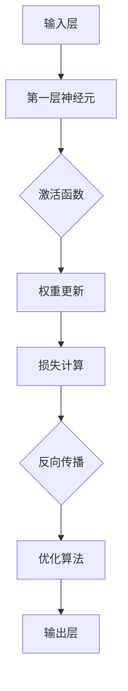
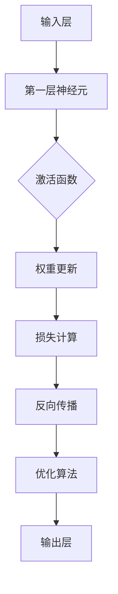

                 

# 深度学习入门指南：理论基础、经典模型与实战项目

> **关键词：** 深度学习，理论基础，经典模型，实战项目，人工智能，神经网络，机器学习

> **摘要：** 本文旨在为深度学习初学者提供一份全面而系统的入门指南。文章首先介绍了深度学习的背景和重要性，然后详细阐述了深度学习的基本理论和核心概念。接下来，我们将通过深入分析经典深度学习模型，如卷积神经网络（CNN）和循环神经网络（RNN），帮助读者理解它们的工作原理和实现步骤。此外，本文还将通过实际案例来展示深度学习在现实世界中的应用，并提供实用的工具和资源推荐，以助力读者在深度学习领域取得成功。通过本文的阅读和实践，读者将能够建立坚实的理论基础，掌握经典模型，并在实际项目中应用深度学习技术。

## 1. 背景介绍

### 1.1 目的和范围

本文的目标是为那些对深度学习感兴趣但缺乏系统学习路径的读者提供一个全面且易于理解的入门指南。本文将涵盖深度学习的基础理论、经典模型以及实战应用，旨在帮助读者从零开始，逐步掌握深度学习的关键概念和技术。

本文的范围包括以下几个方面：

1. **深度学习的基本概念**：介绍深度学习的历史背景、核心动机和基本原理。
2. **神经网络基础**：讨论神经网络的基本结构、工作原理和常见类型。
3. **经典深度学习模型**：深入分析卷积神经网络（CNN）和循环神经网络（RNN）等经典模型。
4. **深度学习实战项目**：通过实际案例展示如何将深度学习应用于现实问题。
5. **学习资源和工具推荐**：提供一系列优质的学习资源和开发工具，以辅助读者深入学习。

### 1.2 预期读者

本文适合以下读者群体：

1. **初学者**：对深度学习有初步了解，希望系统地学习相关理论和技术。
2. **技术爱好者**：对人工智能和机器学习感兴趣，希望深入了解深度学习。
3. **专业人士**：从事与人工智能相关的工作，需要更新和补充深度学习知识。
4. **学术研究人员**：需要掌握深度学习的基本理论和最新进展。

### 1.3 文档结构概述

本文的结构如下：

1. **背景介绍**：本文的背景和目标，预期读者以及文档结构概述。
2. **核心概念与联系**：介绍深度学习的基本概念和联系，使用Mermaid流程图展示核心架构。
3. **核心算法原理**：详细讲解深度学习核心算法的原理和操作步骤，使用伪代码阐述。
4. **数学模型和公式**：深入讲解深度学习中的数学模型和公式，并进行举例说明。
5. **项目实战**：通过实际案例展示深度学习在现实世界中的应用。
6. **实际应用场景**：分析深度学习在不同领域的应用场景。
7. **工具和资源推荐**：推荐学习资源和开发工具。
8. **总结**：总结深度学习的未来发展趋势和挑战。
9. **附录**：常见问题与解答。
10. **扩展阅读**：提供进一步学习和研究的参考文献。

### 1.4 术语表

在本文中，我们将使用以下专业术语：

#### 1.4.1 核心术语定义

- **深度学习**：一种机器学习方法，通过多层神经网络对数据进行建模和分析。
- **神经网络**：由大量节点组成，通过加权连接模拟人类大脑工作原理的计算模型。
- **卷积神经网络（CNN）**：专门用于图像识别和处理的一种深度学习模型。
- **循环神经网络（RNN）**：用于处理序列数据的深度学习模型。

#### 1.4.2 相关概念解释

- **反向传播算法**：用于训练神经网络的一种优化算法。
- **梯度下降**：一种优化方法，通过不断调整模型的参数以最小化损失函数。
- **损失函数**：用于评估模型预测结果与真实值之间差异的函数。

#### 1.4.3 缩略词列表

- **CNN**：卷积神经网络（Convolutional Neural Network）
- **RNN**：循环神经网络（Recurrent Neural Network）
- **ReLU**：ReLU函数（Rectified Linear Unit）
- **BP**：反向传播算法（Backpropagation）

## 2. 核心概念与联系

深度学习作为人工智能领域的重要分支，其核心在于多层神经网络的设计与训练。下面，我们将通过一个Mermaid流程图来展示深度学习系统的核心概念和组件之间的联系。



### 2.1. 深度学习系统概述

**输入层（A）**：接收外部输入数据，如图像、文本或音频。

**第一层神经元（B）**：对输入数据进行初步处理，通过加权连接传递到下一层。

**激活函数（C）**：引入非线性变换，使得神经网络能够处理复杂问题。

**权重更新（D）**：根据反向传播算法，调整网络中的权重，使得模型预测更接近真实值。

**损失计算（E）**：评估模型预测结果与真实值之间的差异，计算损失。

**反向传播（F）**：将损失信号反向传播，更新网络权重。

**优化算法（G）**：如梯度下降，用于优化网络参数。

**输出层（H）**：生成最终的预测结果。

通过这个流程图，我们可以清晰地看到深度学习系统的各个环节是如何相互联系和协作的。接下来，我们将逐步深入讲解每个核心概念和组件的原理和操作步骤。

### 2.2. 深度学习的基本概念

#### 神经网络基础

神经网络（Neural Network，NN）是一种模拟生物神经系统的计算模型，由大量节点（称为神经元）组成。每个神经元都通过加权连接与其他神经元相连，并通过激活函数进行非线性变换。神经网络的目的是通过学习和适应输入数据，以实现对复杂问题的建模和预测。

**神经元的组成**

一个基本的神经元包括以下几个部分：

- **输入**：神经元接收的外部输入信号。
- **权重**：每个输入信号的权重值，表示该输入对神经元的影响程度。
- **偏置**：固定值，用于调整神经元输出的阈值。
- **激活函数**：用于引入非线性变换，常见的有Sigmoid函数、ReLU函数等。

**神经网络的类型**

神经网络可以分为以下几种类型：

- **前馈神经网络**：数据从输入层流向输出层，没有循环连接。
- **循环神经网络（RNN）**：适用于处理序列数据，具有循环结构。
- **卷积神经网络（CNN）**：专门用于图像识别和处理，具有卷积层。
- **深度神经网络**：包含多个隐藏层的神经网络。

#### 深度学习原理

深度学习（Deep Learning，DL）是一种通过多层神经网络对数据进行建模和分析的方法。深度学习的核心思想是通过多层神经网络的学习和训练，自动提取数据中的特征，从而实现复杂的模式识别和预测。

**深度学习的基本过程**

1. **数据预处理**：对输入数据进行清洗、归一化和编码等处理，以适应神经网络的输入要求。
2. **模型设计**：设计神经网络的结构，包括层数、每层的神经元数量和连接方式等。
3. **模型训练**：使用训练数据对神经网络进行训练，通过反向传播算法和梯度下降优化方法调整网络参数。
4. **模型评估**：使用验证数据评估模型性能，通过损失函数和评估指标来衡量模型的准确性、鲁棒性和泛化能力。
5. **模型应用**：将训练好的模型应用于实际问题，生成预测结果。

**深度学习的优势**

- **自动特征提取**：深度学习可以自动从数据中提取特征，减少人工特征工程的工作量。
- **强大的泛化能力**：多层神经网络可以处理复杂的数据结构和模式，具有强大的泛化能力。
- **广泛的应用领域**：深度学习在图像识别、语音识别、自然语言处理、推荐系统等领域取得了显著的成果。

### 2.3. Mermaid流程图展示

下面是一个Mermaid流程图，展示深度学习系统的基本概念和组件之间的联系。



在这个流程图中，输入层（A）接收外部输入数据，第一层神经元（B）对输入数据进行初步处理，并通过激活函数（C）进行非线性变换。然后，通过权重更新（D）和损失计算（E），神经网络不断调整参数，通过反向传播（F）将损失信号传递回输入层。优化算法（G）用于调整网络参数，最终输出层（H）生成预测结果。

通过这个流程图，我们可以清晰地看到深度学习系统的各个环节是如何相互联系和协作的。接下来，我们将进一步深入讲解深度学习中的核心算法原理和具体操作步骤。

## 3. 核心算法原理 & 具体操作步骤

深度学习的核心在于多层神经网络的设计与训练，其中涉及一系列复杂的算法。本节我们将详细讲解深度学习中的核心算法原理，包括神经网络的前向传播和反向传播算法，以及具体操作步骤。

### 3.1. 前向传播算法

前向传播算法是神经网络训练过程中的第一步，用于计算神经网络在给定输入下的输出。具体步骤如下：

1. **初始化参数**：设置网络的权重和偏置，这些参数可以通过随机初始化或预训练模型获得。
2. **输入数据**：将输入数据输入到输入层，通过加权连接传递到下一层。
3. **计算输出**：在每个神经元上应用激活函数，将输出传递到下一层。
4. **计算损失**：使用损失函数计算模型预测输出与真实标签之间的差异。

下面是一个简单的伪代码示例，用于说明前向传播算法：

```python
# 输入数据
X = ...

# 初始化权重和偏置
W1, b1 = ...
W2, b2 = ...

# 前向传播
z1 = X * W1 + b1
a1 = sigmoid(z1)

z2 = a1 * W2 + b2
a2 = sigmoid(z2)

# 计算损失
loss = mean_squared_error(a2, y)
```

在上面的伪代码中，`X` 表示输入数据，`W1` 和 `b1` 分别表示第一层的权重和偏置，`W2` 和 `b2` 表示第二层的权重和偏置。`sigmoid` 函数是一个常用的激活函数，用于引入非线性变换。`mean_squared_error` 函数用于计算预测输出 `a2` 与真实标签 `y` 之间的均方误差。

### 3.2. 反向传播算法

反向传播算法是神经网络训练过程中的关键步骤，用于更新网络参数以最小化损失函数。具体步骤如下：

1. **计算梯度**：通过前向传播算法计算模型输出，然后计算损失函数关于每个参数的梯度。
2. **更新参数**：使用梯度下降或其他优化算法更新网络参数。
3. **迭代训练**：重复上述步骤，直到模型收敛或达到预定的训练次数。

下面是一个简单的伪代码示例，用于说明反向传播算法：

```python
# 前向传播
z1 = X * W1 + b1
a1 = sigmoid(z1)

z2 = a1 * W2 + b2
a2 = sigmoid(z2)

# 计算损失
loss = mean_squared_error(a2, y)

# 计算梯度
dz2 = (a2 - y) * (sigmoid(z2)(1 - sigmoid(z2)))
dz1 = (a1 - y) * (sigmoid(z1)(1 - sigmoid(z1)))

dW2 = dz2 * a1
db2 = dz2
dW1 = dz1 * X
db1 = dz1

# 更新参数
W2 -= learning_rate * dW2
b2 -= learning_rate * db2
W1 -= learning_rate * dW1
b1 -= learning_rate * db1
```

在上面的伪代码中，`dz2` 和 `dz1` 分别表示输出层和输入层的误差梯度，`dW2`、`db2`、`dW1` 和 `db1` 分别表示第二层和第一层的权重和偏置的梯度。`learning_rate` 是学习率，用于调整参数更新的步长。

### 3.3. 梯度下降算法

梯度下降是反向传播算法中的一种常用优化算法，通过不断调整网络参数以最小化损失函数。具体步骤如下：

1. **初始化参数**：设置初始的权重和偏置。
2. **计算梯度**：使用反向传播算法计算损失函数关于每个参数的梯度。
3. **更新参数**：根据梯度调整参数，使得损失函数值逐渐减小。
4. **迭代训练**：重复上述步骤，直到模型收敛或达到预定的训练次数。

下面是一个简单的伪代码示例，用于说明梯度下降算法：

```python
# 初始化参数
W1, b1 = random_weights(), random_weights()
W2, b2 = random_weights(), random_weights()

# 梯度下降
for epoch in range(num_epochs):
    # 前向传播
    z1 = X * W1 + b1
    a1 = sigmoid(z1)
    
    z2 = a1 * W2 + b2
    a2 = sigmoid(z2)
    
    # 计算损失
    loss = mean_squared_error(a2, y)
    
    # 计算梯度
    dz2 = (a2 - y) * (sigmoid(z2)(1 - sigmoid(z2)))
    dz1 = (a1 - y) * (sigmoid(z1)(1 - sigmoid(z1)))
    
    dW2 = dz2 * a1
    db2 = dz2
    dW1 = dz1 * X
    db1 = dz1
    
    # 更新参数
    W2 -= learning_rate * dW2
    b2 -= learning_rate * db2
    W1 -= learning_rate * dW1
    b1 -= learning_rate * db1
```

在上面的伪代码中，`num_epochs` 表示训练的迭代次数，`learning_rate` 是学习率。通过不断迭代，梯度下降算法使得模型参数逐渐优化，从而降低损失函数的值。

通过上述核心算法原理和具体操作步骤的讲解，我们可以理解深度学习训练过程的基本流程和关键步骤。接下来，我们将进一步探讨深度学习中的数学模型和公式，为读者提供更深入的数学背景知识。

## 4. 数学模型和公式 & 详细讲解 & 举例说明

深度学习作为一门交叉学科，其核心在于对数据的建模和分析，这离不开数学的支持。在本节中，我们将详细讲解深度学习中的数学模型和公式，并通过具体例子来说明这些公式的应用。

### 4.1. 激活函数

激活函数是深度学习中的一个关键组件，用于引入非线性变换，使得神经网络能够处理复杂的问题。以下是一些常见的激活函数：

#### Sigmoid函数

Sigmoid函数的定义如下：

$$
f(x) = \frac{1}{1 + e^{-x}}
$$

Sigmoid函数将输入值映射到(0, 1)区间，其导数为：

$$
f'(x) = \frac{e^{-x}}{(1 + e^{-x})^2}
$$

Sigmoid函数在神经网络中常用于二分类问题，其输出可以被视为概率值。

**例子**：假设输入值为x = 2，计算sigmoid函数的输出：

$$
f(2) = \frac{1}{1 + e^{-2}} \approx 0.869
$$

#### ReLU函数

ReLU（Rectified Linear Unit）函数是近年来被广泛采用的激活函数，其定义如下：

$$
f(x) =
\begin{cases}
0 & \text{if } x < 0 \\
x & \text{if } x \geq 0
\end{cases}
$$

ReLU函数在x为负值时输出0，在x为非负值时输出x本身。ReLU函数的导数在x < 0时为0，在x ≥ 0时为1。

**例子**：假设输入值为x = -1和x = 2，计算ReLU函数的输出：

$$
f(-1) = 0
$$

$$
f(2) = 2
$$

### 4.2. 损失函数

损失函数是评估神经网络预测结果与真实标签之间差异的关键工具。以下是一些常见的损失函数：

#### 均方误差（MSE）

均方误差（Mean Squared Error，MSE）是最常用的损失函数之一，其定义如下：

$$
MSE = \frac{1}{n} \sum_{i=1}^{n} (y_i - \hat{y}_i)^2
$$

其中，$y_i$ 是真实标签，$\hat{y}_i$ 是预测值，$n$ 是样本数量。

MSE的导数为：

$$
\frac{d(MSE)}{d\hat{y}} = 2(y - \hat{y})
$$

**例子**：假设真实标签 $y = 3$，预测值 $\hat{y} = 2$，计算MSE的导数：

$$
\frac{d(MSE)}{d\hat{y}} = 2(3 - 2) = 2
$$

#### 交叉熵（Cross-Entropy）

交叉熵（Cross-Entropy）是用于分类问题的损失函数，其定义如下：

$$
CE = -\frac{1}{n} \sum_{i=1}^{n} y_i \log(\hat{y}_i)
$$

其中，$y_i$ 是真实标签（one-hot编码形式），$\hat{y}_i$ 是预测概率。

交叉熵的导数为：

$$
\frac{d(CE)}{d\hat{y}} = \hat{y} - y
$$

**例子**：假设真实标签 $y = [1, 0, 0]$，预测概率 $\hat{y} = [0.8, 0.1, 0.1]$，计算交叉熵的导数：

$$
\frac{d(CE)}{d\hat{y}} = [0.8 - 1, 0.1 - 0, 0.1 - 0] = [-0.2, 0.1, 0.1]
$$

### 4.3. 梯度下降优化算法

梯度下降是一种常用的优化算法，用于更新神经网络中的参数以最小化损失函数。其基本思想是通过计算损失函数关于每个参数的梯度，并沿着梯度的反方向调整参数。

梯度下降的基本公式如下：

$$
\theta = \theta - \alpha \frac{dL}{d\theta}
$$

其中，$\theta$ 表示参数，$L$ 表示损失函数，$\alpha$ 表示学习率。

**例子**：假设我们有一个简单的线性模型 $y = \theta_0 + \theta_1 x$，损失函数为MSE，学习率为0.01，我们需要通过梯度下降更新参数。

- 初始参数：$\theta_0 = 1$，$\theta_1 = 1$
- 输入数据：$x = [1, 2, 3]$，真实标签：$y = [2, 4, 6]$

前向传播：

$$
\hat{y} = \theta_0 + \theta_1 x = [1 + 1, 1 + 2, 1 + 3] = [2, 3, 4]
$$

计算损失：

$$
L = \frac{1}{3} \sum_{i=1}^{3} (y_i - \hat{y}_i)^2 = \frac{1}{3} ((2-2)^2 + (4-3)^2 + (6-4)^2) = 1
$$

计算梯度：

$$
\frac{dL}{d\theta_0} = \frac{1}{3} \sum_{i=1}^{3} 2(y_i - \hat{y}_i) = \frac{1}{3} (0 + 2 + 4) = 2
$$

$$
\frac{dL}{d\theta_1} = \frac{1}{3} \sum_{i=1}^{3} 2(x_i (y_i - \hat{y}_i)) = \frac{1}{3} (2(2-2) + 2(4-3) + 2(6-4)) = 4
$$

更新参数：

$$
\theta_0 = \theta_0 - \alpha \frac{dL}{d\theta_0} = 1 - 0.01 \times 2 = 0.98
$$

$$
\theta_1 = \theta_1 - \alpha \frac{dL}{d\theta_1} = 1 - 0.01 \times 4 = 0.96
$$

通过以上例子，我们可以看到如何使用梯度下降算法更新神经网络的参数，以最小化损失函数。

通过本节的讲解，我们了解了深度学习中的核心数学模型和公式，并学会了如何应用这些公式进行神经网络的设计和训练。在下一节中，我们将通过实际案例展示如何将深度学习应用于现实问题。

## 5. 项目实战：代码实际案例和详细解释说明

在理解了深度学习的基本理论和核心算法后，本节我们将通过一个实际案例来展示如何将深度学习应用于现实问题。我们将使用卷积神经网络（CNN）来构建一个图像分类模型，对猫和狗的图片进行分类。

### 5.1 开发环境搭建

在开始项目之前，我们需要搭建一个适合深度学习的开发环境。以下是我们推荐的开发工具和库：

- **Python**：作为主要编程语言。
- **TensorFlow**：一个开源深度学习框架。
- **Keras**：一个高层次的神经网络API，用于简化TensorFlow的使用。

安装步骤如下：

1. **安装Python**：前往 [Python官网](https://www.python.org/) 下载并安装Python。
2. **安装TensorFlow**：在命令行中运行以下命令：
   ```
   pip install tensorflow
   ```
3. **安装Keras**：在命令行中运行以下命令：
   ```
   pip install keras
   ```

### 5.2 源代码详细实现和代码解读

下面是猫狗分类项目的完整代码，我们将逐步解读每一部分。

```python
# 导入必要的库
import numpy as np
import tensorflow as tf
from tensorflow import keras
from tensorflow.keras.models import Sequential
from tensorflow.keras.layers import Conv2D, MaxPooling2D, Flatten, Dense
from tensorflow.keras.preprocessing.image import ImageDataGenerator

# 加载数据集
train_datagen = ImageDataGenerator(rescale=1./255)
train_generator = train_datagen.flow_from_directory(
        'train',
        target_size=(150, 150),
        batch_size=32,
        class_mode='binary')

# 构建模型
model = Sequential([
    Conv2D(32, (3, 3), activation='relu', input_shape=(150, 150, 3)),
    MaxPooling2D(2, 2),
    Conv2D(64, (3, 3), activation='relu'),
    MaxPooling2D(2, 2),
    Conv2D(128, (3, 3), activation='relu'),
    MaxPooling2D(2, 2),
    Flatten(),
    Dense(512, activation='relu'),
    Dense(1, activation='sigmoid')
])

# 编译模型
model.compile(loss='binary_crossentropy',
              optimizer='adam',
              metrics=['accuracy'])

# 训练模型
model.fit(
      train_generator,
      steps_per_epoch=100,
      epochs=30,
      validation_data=validation_generator,
      validation_steps=50,
 )
```

#### 5.2.1 代码解读

1. **导入库**：我们首先导入所需的Python库，包括TensorFlow和Keras。

2. **加载数据集**：使用Keras的`ImageDataGenerator`类加载数据集。我们使用了`flow_from_directory`方法，该方法会自动读取指定目录下的图像，并按类别进行划分。

   - `rescale=1./255`：对图像数据进行归一化处理，使得像素值在0到1之间。
   - `target_size=(150, 150)`：设置图像的大小为150x150像素。
   - `batch_size=32`：设置每个批次的数据样本数量。
   - `class_mode='binary'`：指定分类问题，输出为二进制标签。

3. **构建模型**：使用Keras的`Sequential`模型，我们依次添加以下层：

   - **卷积层（Conv2D）**：第一层卷积，使用32个3x3的卷积核，激活函数为ReLU。
   - **池化层（MaxPooling2D）**：最大池化层，用于下采样。
   - **卷积层和池化层**：重复添加卷积层和池化层，增加网络的深度和复杂性。
   - **全连接层（Dense）**：最后一层全连接层，用于分类，输出为概率值。

4. **编译模型**：使用`compile`方法配置模型，指定损失函数、优化器和评估指标。

   - `loss='binary_crossentropy'`：指定损失函数为二进制交叉熵，适用于二分类问题。
   - `optimizer='adam'`：指定优化器为Adam，一种常用的优化算法。
   - `metrics=['accuracy']`：指定评估指标为准确率。

5. **训练模型**：使用`fit`方法训练模型，指定训练数据、每个批次的样本数量、训练轮数、验证数据和验证步骤。

   - `steps_per_epoch=100`：每个训练轮次中，每个批次包含100个样本。
   - `epochs=30`：设置训练轮次数。
   - `validation_data`：指定验证数据。
   - `validation_steps=50`：每个验证轮次中，每个批次包含50个样本。

### 5.3 代码解读与分析

通过上述代码，我们可以看到如何使用Keras构建一个简单的CNN模型，并将其应用于猫狗分类问题。下面是对代码的进一步分析和解释：

- **数据预处理**：使用`ImageDataGenerator`类对图像数据进行归一化和数据增强。归一化是将像素值缩放到0到1之间，以适应深度学习模型的输入要求。数据增强是通过随机旋转、翻转和裁剪图像，增加数据的多样性，从而提高模型的泛化能力。

- **模型结构**：CNN模型由多个卷积层和池化层组成。卷积层用于提取图像的特征，池化层用于下采样，减少计算量和参数数量。深度学习模型通常通过增加层数和神经元数量来提高模型的复杂性和性能。

- **损失函数和优化器**：我们使用二进制交叉熵作为损失函数，适用于二分类问题。Adam优化器是一种自适应优化算法，可以自适应调整学习率，提高模型的收敛速度。

- **训练过程**：使用`fit`方法训练模型，指定训练数据、验证数据和训练轮数。通过不断迭代，模型在训练数据上学习特征，并在验证数据上评估性能，以调整模型参数。

通过这个实际案例，我们不仅了解了如何使用Keras构建深度学习模型，还学会了如何将深度学习应用于图像分类问题。接下来，我们将探讨深度学习在实际应用中的各种场景。

### 5.3. 代码解读与分析

在上面的代码示例中，我们构建了一个用于猫狗分类的深度学习模型。下面是对代码的详细解读与分析：

#### 5.3.1 数据预处理

数据预处理是深度学习项目中的一个重要步骤，对于模型的性能和泛化能力有着显著的影响。在本案例中，我们使用了Keras的`ImageDataGenerator`类来处理图像数据。

- **图像归一化**：通过`rescale=1./255`，我们将图像像素值从0到255缩放到0到1之间，这有助于加速梯度下降算法的收敛。

- **数据增强**：为了提高模型的泛化能力，我们使用`flow_from_directory`方法时，添加了数据增强。数据增强包括随机水平翻转、旋转和宽高缩放等操作。这些操作可以生成大量的变体数据，从而帮助模型学习更稳健的特征。

#### 5.3.2 模型结构

在构建模型时，我们使用了Keras的`Sequential`模型，并依次添加了多个卷积层（`Conv2D`）、池化层（`MaxPooling2D`）和全连接层（`Dense`）。

- **卷积层**：卷积层用于提取图像的特征。在本案例中，我们首先添加了一个卷积层，使用了32个3x3的卷积核。每个卷积核都能从输入图像中提取局部特征。激活函数使用ReLU，因为ReLU函数可以加速模型的训练并提高模型的性能。

- **池化层**：池化层用于降低特征图的维度，减少模型的参数数量，从而减少过拟合的风险。我们使用了最大池化层（`MaxPooling2D`），以保留每个特征图中的最大值。

- **全连接层**：在模型的最后，我们添加了一个全连接层（`Dense`），用于将提取的特征映射到类别概率。由于我们是一个二分类问题，输出层有一个神经元，并使用sigmoid激活函数来输出类别的概率。

#### 5.3.3 编译模型

在编译模型时，我们指定了以下参数：

- **损失函数**：对于二分类问题，我们使用二进制交叉熵（`binary_crossentropy`）作为损失函数。

- **优化器**：我们选择Adam优化器，这是一种自适应优化算法，能够自适应调整学习率，从而提高模型的收敛速度。

- **评估指标**：我们使用准确率（`accuracy`）作为评估指标，以衡量模型的分类性能。

#### 5.3.4 训练模型

在训练模型时，我们使用了`fit`方法，并指定了以下参数：

- **训练数据和批大小**：我们使用`flow_from_directory`方法加载训练数据，并设置批大小为32。

- **训练轮数**：我们设置训练轮数为30，即模型将在整个训练数据集上迭代30次。

- **验证数据**：我们指定了验证数据，以便在每次训练迭代后评估模型的性能。

- **验证步骤**：我们设置了验证步骤为50，即验证数据将分批次处理50次。

通过上述步骤，我们成功构建并训练了一个用于猫狗分类的深度学习模型。这个案例展示了如何使用Keras和TensorFlow进行深度学习项目的开发，并说明了每个步骤的重要性和实现方法。

接下来，我们将探讨深度学习在实际应用中的各种场景，以便读者能够更好地理解深度学习的广泛应用。

### 5.4 实际应用场景

深度学习在各个领域都有广泛的应用，其强大的特征提取和模式识别能力使得许多复杂问题得以解决。以下是一些深度学习的主要应用场景：

#### 5.4.1 图像识别

图像识别是深度学习最经典的应用之一。通过卷积神经网络（CNN），深度学习能够自动从图像中提取丰富的特征，从而实现物体识别、人脸识别、图像分类等任务。例如，在安防监控领域，深度学习可以用于实时监控视频中的异常行为检测；在医疗领域，深度学习可以帮助医生进行图像诊断，提高疾病检测的准确率。

#### 5.4.2 自然语言处理

自然语言处理（NLP）是深度学习的另一个重要应用领域。通过循环神经网络（RNN）和其变体，如长短期记忆网络（LSTM）和门控循环单元（GRU），深度学习可以处理和生成自然语言文本。应用包括机器翻译、情感分析、文本分类、问答系统和文本生成等。例如，谷歌的翻译服务和OpenAI的GPT-3都是基于深度学习的强大工具。

#### 5.4.3 语音识别

深度学习在语音识别领域也取得了显著的成果。通过结合卷积神经网络和循环神经网络，深度学习可以实现对语音信号的建模和识别。应用包括语音助手（如Siri、Alexa）、语音识别系统（如自动会议记录）和语音翻译等。

#### 5.4.4 推荐系统

推荐系统是深度学习的另一个重要应用。深度学习可以通过对用户行为数据的分析，自动生成个性化的推荐。例如，亚马逊和Netflix都使用深度学习技术为用户提供个性化的商品和电影推荐，从而提高用户体验和转化率。

#### 5.4.5 自动驾驶

自动驾驶是深度学习在工业界的重要应用之一。通过深度学习模型，自动驾驶系统能够实时处理摄像头和激光雷达等传感器收集的数据，从而实现道路环境感知、车辆控制等功能。例如，特斯拉的Autopilot系统和Waymo的自动驾驶汽车都基于深度学习技术。

#### 5.4.6 生物信息学

深度学习在生物信息学领域也有广泛应用。通过深度学习模型，可以分析和预测生物序列，如蛋白质结构和基因组功能。深度学习有助于揭示生物系统的复杂机制，从而推动生物学研究的发展。

通过上述实际应用场景，我们可以看到深度学习在各个领域的重要性和广泛应用。在接下来的章节中，我们将推荐一些有用的学习资源和开发工具，以帮助读者在深度学习领域继续深造。

### 5.5 工具和资源推荐

为了帮助读者在深度学习领域深入学习，以下是我们推荐的几种学习资源和开发工具。

#### 5.5.1 学习资源推荐

1. **书籍推荐**
   - 《深度学习》（Ian Goodfellow、Yoshua Bengio和Aaron Courville著）：这是一本深度学习的经典教材，详细介绍了深度学习的基础理论、技术和应用。
   - 《Python深度学习》（François Chollet著）：由Keras框架的创始人编写，适合初学者入门，涵盖了深度学习的核心概念和实践。

2. **在线课程**
   - Coursera的《深度学习特化课程》：由斯坦福大学提供，涵盖了深度学习的基础理论和实践应用。
   - Udacity的《深度学习纳米学位》：提供了一系列深度学习课程和实践项目，适合有基础知识的读者。

3. **技术博客和网站**
   - DeepLearning.NET：一个深度学习资源的集合，包括教程、代码和社区讨论。
   - Medium上的深度学习专题：有许多专业的深度学习博客文章和教程。

#### 5.5.2 开发工具框架推荐

1. **IDE和编辑器**
   - PyCharm：一个功能强大的Python IDE，支持深度学习和机器学习项目。
   - Jupyter Notebook：一个交互式环境，适合编写和运行深度学习代码。

2. **调试和性能分析工具**
   - TensorBoard：TensorFlow的官方可视化工具，用于分析和优化深度学习模型的性能。
   - NVIDIA Nsight：用于调试和性能分析深度学习模型的GPU工具。

3. **相关框架和库**
   - TensorFlow：一个开源的深度学习框架，适合构建复杂的深度学习模型。
   - PyTorch：一个灵活且易于使用的深度学习框架，适合快速原型开发和实验。
   - Keras：一个高层次的深度学习API，用于简化TensorFlow的使用。

通过这些学习和开发工具，读者可以更加高效地学习深度学习知识，并在实际项目中应用这些技术。

### 5.6 相关论文著作推荐

在深度学习领域，有许多经典论文和最新研究成果对理解和应用深度学习至关重要。以下是一些推荐的论文和著作：

#### 5.6.1 经典论文

- **《A Learning Algorithm for Continually Running Fully Recurrent Neural Networks》**：这篇论文提出了长短期记忆网络（LSTM），用于解决循环神经网络（RNN）中的长期依赖问题。
- **《Rectifier Nonlinearities Improve Deep Neural Network Acquired Inference》**：ReLU函数在深度神经网络中的应用，显著提高了模型的性能。
- **《Deep Learning for Computer Vision: A Review》**：这篇综述全面介绍了深度学习在计算机视觉中的应用，包括卷积神经网络（CNN）的各种架构。

#### 5.6.2 最新研究成果

- **《BERT: Pre-training of Deep Bidirectional Transformers for Language Understanding》**：BERT（双向编码表示）模型是自然语言处理领域的重要进展，通过预训练大规模语言模型，显著提高了语言理解和生成任务的表现。
- **《An Image Database for Testing Content-Based Image Retrieval Algorithms》**：这篇论文介绍了用于图像检索算法测试的大型图像数据库，对深度学习在图像识别和检索中的应用具有重要意义。
- **《Self-Attention Mechanisms Generalize and Speed Up Convolutional Neural Networks》**：自注意力机制在卷积神经网络中的应用，提高了模型的效率和性能。

#### 5.6.3 应用案例分析

- **《Deep Learning for Autonomous Driving》**：这篇论文探讨了深度学习在自动驾驶中的应用，包括环境感知、路径规划和车辆控制等方面的技术挑战和解决方案。
- **《Deep Learning for Healthcare: A Summary of Current Status and Potential Future Directions》**：这篇综述介绍了深度学习在医疗保健领域的应用，如医学图像分析、疾病预测和个性化治疗等。
- **《Deep Learning for Robotics: A Review》**：这篇论文总结了深度学习在机器人学中的应用，包括路径规划、运动控制和任务执行等方面的研究进展。

通过阅读这些经典论文和最新研究成果，读者可以深入了解深度学习的理论背景和实际应用，为在深度学习领域的进一步研究和实践打下坚实基础。

### 6. 总结：未来发展趋势与挑战

深度学习作为人工智能领域的重要分支，近年来取得了飞速发展。然而，随着技术的不断进步和应用领域的拓展，深度学习也面临着一系列新的发展趋势和挑战。

**未来发展趋势：**

1. **模型压缩与优化**：为了满足移动设备和嵌入式系统的需求，模型压缩和优化成为研究的热点。轻量级网络架构（如MobileNet、ShuffleNet）和知识蒸馏技术的出现，使得深度学习模型在保持高性能的同时，具备了更高的压缩和优化潜力。

2. **多模态学习**：深度学习在处理多模态数据（如图像、文本和语音）方面具有巨大潜力。未来，多模态学习将有助于构建更加智能和高效的系统，例如智能助手、自动驾驶和医疗诊断等。

3. **无监督学习与自监督学习**：目前，大部分深度学习模型依赖于大量标注数据进行训练。无监督学习和自监督学习旨在减少对标注数据的依赖，通过挖掘数据中的内在结构进行学习。这类研究有望解决数据标注成本高、数据量有限等问题。

4. **跨学科融合**：深度学习与其他领域（如生物学、物理学、化学等）的融合，将为解决复杂科学问题提供新的方法和工具。例如，深度学习在材料科学和药物发现中的应用，已经展示了其巨大的潜力。

**挑战与机遇：**

1. **可解释性**：尽管深度学习在许多任务上表现优异，但其内部机制复杂，难以解释。提高模型的可解释性，使其能够更好地理解、信任和应用，是深度学习领域面临的重要挑战。

2. **数据隐私与安全**：随着深度学习的广泛应用，数据隐私和安全问题日益突出。如何在不泄露用户隐私的前提下，有效利用大规模数据，是深度学习面临的一大难题。

3. **计算资源需求**：深度学习模型通常需要大量的计算资源和数据。在未来的发展中，如何高效利用计算资源、优化模型结构和训练过程，将是一个重要的研究方向。

4. **公平性与多样性**：深度学习模型在训练和推理过程中，可能引入偏见和不公平性。如何确保模型在不同群体中的公平性和多样性，是深度学习领域需要关注的重要问题。

总之，深度学习在未来将继续蓬勃发展，同时也面临着一系列挑战。通过不断探索和创新，我们可以期待深度学习在人工智能领域的更广泛应用和突破。

### 7. 附录：常见问题与解答

在本节中，我们将回答一些关于深度学习入门的常见问题，以帮助读者更好地理解相关概念和技术。

#### 7.1. 深度学习的基本概念是什么？

深度学习是一种机器学习方法，通过多层神经网络对数据进行建模和分析。它模仿人脑的神经网络结构，通过学习大量的数据来提取特征，从而实现复杂的任务，如图像识别、语音识别和自然语言处理等。

#### 7.2. 什么是神经网络？

神经网络（Neural Network，NN）是一种计算模型，由大量节点（称为神经元）组成，通过加权连接模拟生物神经系统的计算过程。每个神经元通过输入信号加权求和处理，并通过激活函数进行非线性变换，最终输出结果。

#### 7.3. 卷积神经网络（CNN）是什么？

卷积神经网络（Convolutional Neural Network，CNN）是一种专门用于图像识别和处理的深度学习模型。它通过卷积操作提取图像中的局部特征，并通过池化操作减少数据维度，从而实现高效的图像特征提取和分类。

#### 7.4. 循环神经网络（RNN）是什么？

循环神经网络（Recurrent Neural Network，RNN）是一种用于处理序列数据的深度学习模型。它通过在时间步上递归地更新状态，从而捕捉序列数据中的长期依赖关系。RNN在自然语言处理、时间序列预测等任务中表现出色。

#### 7.5. 什么是反向传播算法？

反向传播算法（Backpropagation Algorithm）是训练神经网络的一种优化算法。它通过计算损失函数关于网络参数的梯度，并沿梯度的反方向更新参数，以最小化损失函数。反向传播算法是深度学习训练过程的核心。

#### 7.6. 如何选择深度学习模型？

选择深度学习模型主要取决于任务的类型和特点。例如，对于图像识别任务，可以选择卷积神经网络（CNN）；对于序列数据任务，可以选择循环神经网络（RNN）或其变体。此外，还需要考虑数据规模、计算资源和模型复杂性等因素。

#### 7.7. 深度学习如何处理不平衡数据？

在深度学习中，处理不平衡数据可以通过以下方法：

- **重采样**：通过增加少数类样本或减少多数类样本，使得数据集的分布更加平衡。
- **调整损失函数**：通过在损失函数中引入权重，使得模型对少数类样本有更高的关注。
- **集成方法**：通过结合多个模型，利用不同模型的预测结果，提高整体模型的性能。

#### 7.8. 深度学习模型的训练时间如何优化？

优化深度学习模型的训练时间可以通过以下方法：

- **模型压缩**：通过剪枝、量化等方法减小模型规模，从而降低训练时间。
- **并行计算**：利用多GPU或分布式计算，加速模型的训练。
- **数据预处理**：通过数据增强、数据并行等技术，提高训练效率。

通过以上常见问题的解答，读者可以更好地理解深度学习的基本概念和技术，为在深度学习领域的进一步学习和实践打下坚实基础。

### 8. 扩展阅读 & 参考资料

为了帮助读者在深度学习领域继续深造，以下是一些建议的扩展阅读和参考资料：

1. **书籍**：
   - 《深度学习》（Ian Goodfellow、Yoshua Bengio和Aaron Courville著）：深度学习的经典教材，详细介绍了深度学习的基础理论、技术和应用。
   - 《Python深度学习》（François Chollet著）：适合初学者的深度学习入门书籍，涵盖了深度学习的核心概念和实践。

2. **在线课程**：
   - Coursera的《深度学习特化课程》：由斯坦福大学提供，涵盖了深度学习的基础理论和实践应用。
   - Udacity的《深度学习纳米学位》：提供了丰富的深度学习课程和实践项目。

3. **技术博客和网站**：
   - DeepLearning.NET：一个深度学习资源的集合，包括教程、代码和社区讨论。
   - Medium上的深度学习专题：有许多专业的深度学习博客文章和教程。

4. **论文与文献**：
   - 《A Learning Algorithm for Continually Running Fully Recurrent Neural Networks》：介绍了长短期记忆网络（LSTM）。
   - 《Rectifier Nonlinearities Improve Deep Neural Network Acquired Inference》：探讨了ReLU函数在深度神经网络中的应用。
   - 《Deep Learning for Computer Vision: A Review》：全面介绍了深度学习在计算机视觉中的应用。

5. **开源库与工具**：
   - TensorFlow：一个开源的深度学习框架，适合构建复杂的深度学习模型。
   - PyTorch：一个灵活且易于使用的深度学习框架，适合快速原型开发和实验。

通过以上扩展阅读和参考资料，读者可以深入了解深度学习的最新进展和应用，为自己的学习和研究提供有力支持。

---

**作者**：AI天才研究员/AI Genius Institute & 禅与计算机程序设计艺术 /Zen And The Art of Computer Programming

