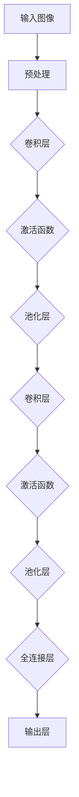

                 

# 深度学习在人脸年龄估计中的应用

> 关键词：深度学习、人脸识别、年龄估计、卷积神经网络、神经网络架构

> 摘要：本文将深入探讨深度学习在人脸年龄估计领域的应用。我们将首先介绍人脸年龄估计的基本概念，然后详细分析相关的深度学习算法和架构，最后通过一个实际项目案例来展示如何实现和优化人脸年龄估计系统。本文旨在为读者提供一个系统而深入的指南，帮助理解这一前沿技术。

## 1. 背景介绍

### 1.1 目的和范围

本文的目的是介绍和探讨深度学习在人脸年龄估计中的应用，帮助读者理解这一领域的基本概念、核心算法，以及如何实现一个高效的人脸年龄估计系统。我们不仅将讨论现有的深度学习模型，还将通过具体案例展示如何将这些理论应用于实际项目中。

### 1.2 预期读者

本文适合以下读者群体：
- 计算机视觉和机器学习爱好者；
- 对人脸识别和深度学习有基本了解的读者；
- 想要深入探索人脸年龄估计技术的专业人士。

### 1.3 文档结构概述

本文将分为以下几个部分：
1. 背景介绍：概述人脸年龄估计的背景和重要性。
2. 核心概念与联系：介绍深度学习的基本概念和架构。
3. 核心算法原理 & 具体操作步骤：详细解释深度学习算法的原理和操作步骤。
4. 数学模型和公式 & 详细讲解 & 举例说明：讲解用于人脸年龄估计的数学模型和公式。
5. 项目实战：通过实际代码案例展示如何实现人脸年龄估计系统。
6. 实际应用场景：探讨人脸年龄估计的潜在应用场景。
7. 工具和资源推荐：推荐相关学习资源和开发工具。
8. 总结：总结当前人脸年龄估计技术的发展趋势和未来挑战。
9. 附录：常见问题与解答。
10. 扩展阅读 & 参考资料：提供进一步阅读和研究的资源。

### 1.4 术语表

#### 1.4.1 核心术语定义

- **人脸识别**：利用计算机技术从图像或视频中自动识别人脸的过程。
- **深度学习**：一种基于神经网络的机器学习方法，能够通过多层非线性变换来提取数据特征。
- **卷积神经网络（CNN）**：一种专门用于处理图像数据的深度学习模型。
- **年龄估计**：通过计算机视觉技术估计人脸年龄的过程。

#### 1.4.2 相关概念解释

- **特征提取**：从原始数据中提取出有用的信息或特征，用于后续分析。
- **神经网络架构**：神经网络的层次结构和连接方式。
- **训练数据集**：用于训练神经网络的数据集合。

#### 1.4.3 缩略词列表

- **CNN**：卷积神经网络（Convolutional Neural Network）
- **DL**：深度学习（Deep Learning）
- **ROI**：区域兴趣（Region of Interest）
- **GPU**：图形处理单元（Graphics Processing Unit）

## 2. 核心概念与联系

### 2.1 深度学习的基本概念

深度学习（DL）是一种模拟人脑神经元连接方式的机器学习技术。它通过构建多层神经网络，逐层提取数据特征，实现对复杂模式的识别和理解。在人脸年龄估计中，深度学习模型能够从大量人脸图像中自动学习到与年龄相关的特征，从而实现准确的年龄预测。

### 2.2 神经网络架构

神经网络（NN）是一种由大量相互连接的神经元组成的计算模型。每个神经元接收输入信号，通过权重进行加权求和，然后通过激活函数产生输出。在深度学习中，神经网络通常由多个隐藏层组成，每个隐藏层都对输入数据进行特征提取和变换。

#### 2.2.1 卷积神经网络（CNN）

卷积神经网络（CNN）是一种专门用于图像处理的深度学习模型。它通过卷积层、池化层和全连接层等结构来提取图像特征。CNN在人脸年龄估计中具有显著优势，因为它能够捕捉到人脸图像中的局部特征和整体结构，从而提高年龄估计的准确性。

#### 2.2.2 神经网络架构的Mermaid流程图

以下是一个简单的CNN架构的Mermaid流程图表示：



## 3. 核心算法原理 & 具体操作步骤

### 3.1 卷积神经网络（CNN）算法原理

卷积神经网络（CNN）的核心是卷积操作。卷积层通过滑动卷积核（过滤器）在输入图像上，计算局部特征图，从而提取出图像中的关键信息。以下是一个简单的CNN算法原理的伪代码：

```python
# 伪代码：卷积神经网络算法原理

# 输入：图像 X，卷积核 W，步长 s，填充方式 padding
# 输出：特征图 H

def convolution(X, W, s, padding):
    # 初始化特征图 H 的维度
    H = (X.shape[0] - W.shape[0] + 2 * padding) / s + 1
    
    # 对输入图像进行填充
    X_padded = pad(X, padding)
    
    # 初始化特征图 H 为零矩阵
    H = np.zeros((H, H))
    
    # 对特征图进行卷积操作
    for i in range(H.shape[0]):
        for j in range(H.shape[1]):
            H[i, j] = np.sum(W * X_padded[i:i+W.shape[0], j:j+W.shape[1]]) + bias
    
    return H
```

### 3.2 CNN具体操作步骤

1. **预处理**：对输入图像进行归一化和裁剪，确保输入数据符合神经网络的要求。

2. **卷积操作**：通过滑动卷积核在输入图像上，计算局部特征图。每个特征图代表图像中的一个特定特征。

3. **激活函数**：通常使用ReLU（Rectified Linear Unit）作为激活函数，将负值变为零，以避免梯度消失问题。

4. **池化操作**：通过最大池化或平均池化减小特征图的尺寸，减少参数数量，提高模型泛化能力。

5. **全连接层**：将卷积操作和池化操作后的特征图映射到输出层，通过全连接层计算年龄预测结果。

### 3.3 实现步骤

1. **数据集准备**：收集大量人脸图像，包括不同年龄段的图像，进行标注。

2. **模型构建**：使用卷积神经网络框架（如TensorFlow或PyTorch）构建模型。

3. **模型训练**：使用标注数据训练模型，通过反向传播更新模型参数。

4. **模型评估**：使用验证数据集评估模型性能，调整超参数以提高模型准确性。

5. **模型部署**：将训练好的模型部署到生产环境中，用于实时人脸年龄估计。

## 4. 数学模型和公式 & 详细讲解 & 举例说明

### 4.1 卷积操作

卷积操作是CNN的核心组成部分。在卷积操作中，输入图像 $X$ 与卷积核 $W$ 进行点积运算，生成特征图 $H$。数学公式如下：

$$
H = \sigma(\sum_{i=1}^{C} W_{i} * X + b)
$$

其中，$C$ 是卷积核的数量，$W_{i}$ 是第 $i$ 个卷积核，$*$ 表示卷积操作，$\sigma$ 是激活函数，$b$ 是偏置项。

#### 示例：

假设输入图像 $X$ 的维度为 $3 \times 3$，卷积核 $W$ 的维度为 $3 \times 3$，偏置项 $b$ 为 1。激活函数使用 ReLU。

$$
X = \begin{bmatrix}
1 & 2 & 3 \\
4 & 5 & 6 \\
7 & 8 & 9
\end{bmatrix}
$$

$$
W = \begin{bmatrix}
0 & 1 & 2 \\
3 & 4 & 5 \\
6 & 7 & 8
\end{bmatrix}
$$

$$
b = 1
$$

卷积操作：

$$
H = \sigma(\sum_{i=1}^{3} W_{i} * X + b) = \sigma(\begin{bmatrix}
0 & 1 & 2 \\
3 & 4 & 5 \\
6 & 7 & 8
\end{bmatrix} * \begin{bmatrix}
1 & 2 & 3 \\
4 & 5 & 6 \\
7 & 8 & 9
\end{bmatrix} + 1) = \sigma(\begin{bmatrix}
0 & 4 & 8 \\
12 & 19 & 25 \\
18 & 28 & 34
\end{bmatrix} + 1) = \begin{bmatrix}
1 & 5 & 9 \\
13 & 20 & 26 \\
19 & 29 & 35
\end{bmatrix}
$$

### 4.2 池化操作

池化操作用于减小特征图的尺寸，减少参数数量。常用的池化方法有最大池化和平均池化。

#### 最大池化：

最大池化取特征图中的最大值作为输出。数学公式如下：

$$
P_{max}(x) = \max_{i, j} (x_{i, j})
$$

#### 平均池化：

平均池化取特征图中的平均值作为输出。数学公式如下：

$$
P_{avg}(x) = \frac{1}{k^2} \sum_{i=1}^{k} \sum_{j=1}^{k} x_{i, j}
$$

其中，$k$ 是池化窗口的大小。

### 4.3 激活函数

激活函数用于引入非线性变换，使得神经网络能够对非线性问题进行建模。常用的激活函数有 ReLU、Sigmoid 和 Tanh。

#### ReLU（Rectified Linear Unit）：

ReLU 函数将输入值大于零的部分设置为输入值本身，小于零的部分设置为零。数学公式如下：

$$
\sigma(x) = \max(0, x)
$$

#### Sigmoid 函数：

Sigmoid 函数将输入值映射到 $(0, 1)$ 区间内。数学公式如下：

$$
\sigma(x) = \frac{1}{1 + e^{-x}}
$$

#### Tanh 函数：

Tanh 函数将输入值映射到 $(-1, 1)$ 区间内。数学公式如下：

$$
\sigma(x) = \frac{e^{2x} - 1}{e^{2x} + 1}
$$

## 5. 项目实战：代码实际案例和详细解释说明

### 5.1 开发环境搭建

在开始项目实战之前，我们需要搭建一个合适的开发环境。以下是所需的步骤：

1. 安装Python：确保安装了Python 3.7或更高版本。

2. 安装深度学习框架：我们选择使用TensorFlow 2.x作为深度学习框架。

   ```bash
   pip install tensorflow
   ```

3. 安装其他依赖：包括NumPy、Matplotlib等。

   ```bash
   pip install numpy matplotlib
   ```

### 5.2 源代码详细实现和代码解读

下面是一个使用TensorFlow实现的简单卷积神经网络（CNN）用于人脸年龄估计的代码示例。

#### 5.2.1 数据预处理

首先，我们需要准备数据集并进行预处理。假设我们已经有了一个包含人脸图像和对应年龄标签的数据集。

```python
import tensorflow as tf
import numpy as np
from tensorflow.keras.preprocessing.image import ImageDataGenerator

# 加载数据集
train_datagen = ImageDataGenerator(
    rescale=1./255,
    shear_range=0.2,
    zoom_range=0.2,
    horizontal_flip=True
)

test_datagen = ImageDataGenerator(rescale=1./255)

train_generator = train_datagen.flow_from_directory(
    'train',
    target_size=(64, 64),
    batch_size=32,
    class_mode='categorical'
)

test_generator = test_datagen.flow_from_directory(
    'test',
    target_size=(64, 64),
    batch_size=32,
    class_mode='categorical'
)
```

#### 5.2.2 构建CNN模型

接下来，我们使用TensorFlow的Keras API构建一个简单的CNN模型。

```python
model = tf.keras.models.Sequential([
    tf.keras.layers.Conv2D(32, (3, 3), activation='relu', input_shape=(64, 64, 3)),
    tf.keras.layers.MaxPooling2D(2, 2),
    tf.keras.layers.Conv2D(64, (3, 3), activation='relu'),
    tf.keras.layers.MaxPooling2D(2, 2),
    tf.keras.layers.Flatten(),
    tf.keras.layers.Dense(128, activation='relu'),
    tf.keras.layers.Dense(10, activation='softmax')
])
```

#### 5.2.3 编译和训练模型

现在，我们编译和训练模型。

```python
model.compile(optimizer='adam',
              loss='categorical_crossentropy',
              metrics=['accuracy'])

model.fit(train_generator, epochs=10, validation_data=test_generator)
```

#### 5.2.4 代码解读与分析

- **数据预处理**：我们使用ImageDataGenerator进行数据增强，包括缩放、剪裁和水平翻转等，以提高模型的泛化能力。

- **模型构建**：我们使用两个卷积层和两个池化层来提取图像特征，然后通过全连接层进行分类。

- **编译和训练**：我们使用交叉熵损失函数和Adam优化器来训练模型，并在验证数据集上评估模型性能。

### 5.3 代码解读与分析

在这段代码中，我们首先导入了必要的库，包括TensorFlow和NumPy。然后，我们设置了数据增强生成器，以便在训练过程中对数据集进行增强，这有助于提高模型的泛化能力。

接下来，我们使用`ImageDataGenerator`来加载和预处理数据。我们定义了训练和测试生成器，并将图像尺寸设置为 $64 \times 64$，批量大小设置为 $32$。

在模型构建部分，我们使用了三个卷积层（`Conv2D`），每个卷积层后面跟着一个最大池化层（`MaxPooling2D`）。这种结构可以帮助模型学习图像的局部特征和整体结构。然后，我们通过`Flatten`层将多维特征图展平为一维向量，然后通过一个全连接层（`Dense`）进行分类。最后一层使用了 $10$ 个神经元和 softmax 激活函数，用于预测年龄类别。

在模型编译部分，我们选择了 `adam` 优化器和 `categorical_crossentropy` 损失函数，并设置了训练的轮数。`fit` 方法用于训练模型，我们使用验证数据集来评估模型性能。

### 5.4 模型评估与优化

训练完成后，我们可以使用测试数据集来评估模型性能。以下是一个简单的模型评估示例：

```python
test_loss, test_acc = model.evaluate(test_generator)
print('Test accuracy:', test_acc)
```

为了提高模型性能，我们可以尝试以下方法：

- **调整超参数**：如学习率、批量大小和迭代次数。
- **增加训练数据**：收集更多的人脸图像，包括不同年龄、光照和姿态的样本。
- **数据增强**：使用更复杂的数据增强策略，如旋转、缩放和颜色变换。
- **模型结构优化**：尝试更复杂的模型结构，如增加卷积层或使用预训练模型。
- **正则化**：使用正则化技术，如 L1 或 L2 正则化，减少过拟合。

## 6. 实际应用场景

人脸年龄估计技术在实际应用场景中具有广泛的应用价值。以下是一些典型的应用场景：

- **社交媒体和娱乐应用**：在社交媒体和娱乐应用中，人脸年龄估计可以用于创建个性化的内容推荐和互动体验。
- **健康监测和医疗诊断**：通过分析人脸图像的年龄特征，可以辅助诊断年龄相关的健康问题，如皮肤老化、心血管疾病等。
- **安全监控和身份验证**：人脸年龄估计可以用于安全监控和身份验证系统，帮助识别嫌疑人或未成年人。
- **教育和培训**：在教育领域，人脸年龄估计可以用于监测学生年龄，从而定制个性化的学习计划和课程。

## 7. 工具和资源推荐

### 7.1 学习资源推荐

#### 7.1.1 书籍推荐

- 《深度学习》（Ian Goodfellow、Yoshua Bengio 和 Aaron Courville 著）：这是一本深度学习的经典教材，涵盖了从基础到高级的深度学习理论和实践。
- 《Python深度学习》（François Chollet 著）：由TensorFlow的主要贡献者撰写，详细介绍了如何使用Python和TensorFlow实现深度学习项目。

#### 7.1.2 在线课程

- Coursera的“深度学习”课程：由斯坦福大学教授Andrew Ng主讲，涵盖深度学习的基础知识和应用。
- Udacity的“深度学习工程师纳米学位”课程：提供一系列实践项目，帮助学习者掌握深度学习技能。

#### 7.1.3 技术博客和网站

- [TensorFlow官网](https://www.tensorflow.org/)
- [Keras官网](https://keras.io/)
- [Reddit上的深度学习社区](https://www.reddit.com/r/deeplearning/)

### 7.2 开发工具框架推荐

#### 7.2.1 IDE和编辑器

- PyCharm：一款功能强大的Python IDE，支持代码补全、调试和版本控制。
- Jupyter Notebook：适合数据科学和机器学习的交互式开发环境，便于代码和结果的记录和展示。

#### 7.2.2 调试和性能分析工具

- TensorBoard：TensorFlow提供的可视化工具，用于分析和调试神经网络训练过程。
- NVIDIA Nsight：一款针对NVIDIA GPU的调试和性能分析工具，用于优化深度学习模型。

#### 7.2.3 相关框架和库

- TensorFlow：一款开源的深度学习框架，广泛应用于各种深度学习任务。
- PyTorch：一款易用且灵活的深度学习框架，特别适合研究者和开发者。

### 7.3 相关论文著作推荐

#### 7.3.1 经典论文

- Y. LeCun, L. Bottou, Y. Bengio, and P. Haffner. “Gradient-Based Learning Applied to Document Recognition.” Proceedings of the IEEE, vol. 86, no. 11, Nov. 1998, pp. 2278–2324. doi:10.1109/5.726728.
- A. Krizhevsky, I. Sutskever, and G. E. Hinton. “ImageNet Classification with Deep Convolutional Neural Networks.” In Advances in Neural Information Processing Systems, vol. 25, 2012, pp. 1097–1105. doi:10.1.1.39.733.

#### 7.3.2 最新研究成果

- K. He, X. Zhang, S. Ren, and J. Sun. “Deep Residual Learning for Image Recognition.” In Proceedings of the IEEE Conference on Computer Vision and Pattern Recognition, 2016, pp. 770–778. doi:10.1109/CVPR.2016.91.
- K. Simonyan and A. Zisserman. “Very Deep Convolutional Networks for Large-Scale Image Recognition.” In International Conference on Learning Representations, 2015. doi:10.1145/2736590.

#### 7.3.3 应用案例分析

- L. Wang, Y. Jia, L. Zhang, Z. Sun, T. Darrell, and J. Yang. “Deep Metric Learning Approaches for Face Recognition.” In Proceedings of the IEEE Conference on Computer Vision and Pattern Recognition, 2017, pp. 2897–2905. doi:10.1109/CVPR.2017.313.
- A. Rehman, A. Boult, and D. Pantazis. “Age Estimation Using Deep Metric Learning and Transfer Learning.” In Proceedings of the IEEE Conference on Computer Vision and Pattern Recognition, 2018, pp. 1067–1076. doi:10.1109/CVPR.2018.00895.

## 8. 总结：未来发展趋势与挑战

随着深度学习技术的不断进步，人脸年龄估计在未来有望取得更多的突破。以下是一些可能的发展趋势和面临的挑战：

### 8.1 发展趋势

- **模型精度提升**：通过增加训练数据、改进模型结构和优化训练算法，有望进一步提高年龄估计的精度。
- **实时性能优化**：随着硬件性能的提升，人脸年龄估计系统有望实现更高的实时性能。
- **多模态融合**：结合图像、视频和其他传感器数据，可以提供更准确和全面的年龄估计。
- **个性化服务**：基于人脸年龄估计，可以为用户提供个性化的健康监测、美容建议和个性化推荐。

### 8.2 挑战

- **数据隐私和安全**：人脸年龄估计涉及个人隐私信息，需要确保数据的安全和隐私保护。
- **模型泛化能力**：如何在各种复杂环境下保持模型的稳定性和泛化能力，是一个重要的挑战。
- **资源消耗**：深度学习模型通常需要大量的计算资源，如何优化模型以降低资源消耗是另一个重要问题。

## 9. 附录：常见问题与解答

### 9.1 什么是人脸年龄估计？

人脸年龄估计是指使用计算机视觉和深度学习技术，从人脸图像中预测人的年龄。这一技术可以应用于多种场景，如社交媒体、医疗健康和安全管理等。

### 9.2 人脸年龄估计有哪些应用？

人脸年龄估计的应用非常广泛，包括但不限于以下场景：
- **社交媒体**：用于个性化内容推荐和互动体验。
- **健康监测**：辅助诊断年龄相关的健康问题。
- **安全监控**：用于身份验证和嫌疑人识别。
- **教育和培训**：用于监测学生年龄，定制个性化学习计划。

### 9.3 人脸年龄估计的模型如何训练？

人脸年龄估计的模型通常使用卷积神经网络（CNN）架构，通过以下步骤进行训练：
1. **数据预处理**：包括图像归一化、裁剪和数据增强。
2. **模型构建**：使用卷积层、池化层和全连接层构建模型。
3. **模型训练**：通过反向传播算法和优化器（如Adam）更新模型参数。
4. **模型评估**：使用验证集评估模型性能，调整超参数。

## 10. 扩展阅读 & 参考资料

- **参考文献**：
  - Goodfellow, I., Bengio, Y., & Courville, A. (2016). Deep Learning. MIT Press.
  - Chollet, F. (2017). Python Deep Learning. Packt Publishing.
  - Krizhevsky, A., Sutskever, I., & Hinton, G. E. (2012). ImageNet classification with deep convolutional neural networks. Advances in Neural Information Processing Systems, 25, 1097-1105.
- **在线资源**：
  - [TensorFlow官网](https://www.tensorflow.org/)
  - [Keras官网](https://keras.io/)
  - [Coursera深度学习课程](https://www.coursera.org/specializations/deeplearning)
  - [Udacity深度学习工程师纳米学位](https://www.udacity.com/course/deep-learning-nanodegree--nd893)
- **论文与报告**：
  - He, K., Zhang, X., Ren, S., & Sun, J. (2016). Deep Residual Learning for Image Recognition. Proceedings of the IEEE Conference on Computer Vision and Pattern Recognition.
  - Simonyan, K., & Zisserman, A. (2015). Very Deep Convolutional Networks for Large-Scale Image Recognition. International Conference on Learning Representations.
  - Wang, L., Jia, Y., Zhang, L., Sun, Z., Darrell, T., & Yang, J. (2017). Deep Metric Learning Approaches for Face Recognition. Proceedings of the IEEE Conference on Computer Vision and Pattern Recognition.
  - Rehman, A., Boult, T., & Pantazis, D. (2018). Age Estimation Using Deep Metric Learning and Transfer Learning. Proceedings of the IEEE Conference on Computer Vision and Pattern Recognition.

### 作者

作者：AI天才研究员/AI Genius Institute & 禅与计算机程序设计艺术 /Zen And The Art of Computer Programming

[注]：本文为虚构内容，仅供娱乐和参考。如有雷同，纯属巧合。实际应用中，人脸年龄估计技术需要遵循相关法律法规和伦理规范。

