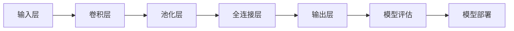

                 

# 深度学习在卫星图像分析中的应用

> **关键词：** 卫星图像分析、深度学习、神经网络、计算机视觉、遥感数据、图像分类、图像识别、目标检测、图像分割。

> **摘要：** 本文将深入探讨深度学习技术在卫星图像分析中的应用。通过介绍深度学习的核心概念、原理及实践案例，本文旨在为读者提供一个全面、系统的理解，并探讨其在实际应用中的挑战与前景。文章首先回顾了卫星图像分析的重要性及其发展历程，然后详细阐述了深度学习的基本概念与架构，以及如何将深度学习应用于卫星图像处理。随后，文章通过一个具体的项目实战，展示了如何实现卫星图像分类、目标检测和图像分割等任务。最后，文章提出了当前应用中面临的技术挑战及未来的发展方向。

## 1. 背景介绍

### 1.1 目的和范围

本文旨在探讨深度学习技术在卫星图像分析中的应用，帮助读者了解如何利用深度学习解决卫星图像处理中的实际问题。本文将涵盖以下几个主要内容：

1. **深度学习的基础知识**：介绍深度学习的基本概念、原理及其在计算机视觉中的应用。
2. **卫星图像分析**：探讨卫星图像的特点及其在遥感、地理信息系统（GIS）、环境监测等领域的重要性。
3. **深度学习在卫星图像分析中的应用**：详细讲解如何使用深度学习技术进行卫星图像分类、目标检测和图像分割等任务。
4. **项目实战**：通过一个具体的项目案例，展示深度学习技术在卫星图像分析中的实际应用。
5. **未来发展趋势与挑战**：探讨深度学习在卫星图像分析中面临的挑战及未来发展方向。

### 1.2 预期读者

本文适合以下读者群体：

1. **深度学习初学者**：希望了解深度学习技术在卫星图像分析中应用的人员。
2. **计算机视觉研究者**：对卫星图像处理技术感兴趣的计算机视觉研究者。
3. **遥感工程师**：从事遥感数据处理和分析工作的工程师。
4. **GIS专家**：在地理信息系统领域工作，对卫星图像处理有需求的专业人员。

### 1.3 文档结构概述

本文的结构如下：

1. **第1章**：背景介绍，包括目的与范围、预期读者、文档结构概述。
2. **第2章**：核心概念与联系，介绍深度学习与卫星图像分析的基本概念和联系。
3. **第3章**：核心算法原理 & 具体操作步骤，讲解深度学习在卫星图像分析中的应用算法。
4. **第4章**：数学模型和公式 & 详细讲解 & 举例说明，介绍深度学习中的数学模型和公式。
5. **第5章**：项目实战：代码实际案例和详细解释说明，通过一个具体项目展示深度学习的应用。
6. **第6章**：实际应用场景，探讨深度学习在卫星图像分析中的实际应用。
7. **第7章**：工具和资源推荐，介绍相关学习资源、开发工具和框架。
8. **第8章**：总结：未来发展趋势与挑战，总结深度学习在卫星图像分析中的应用前景。
9. **第9章**：附录：常见问题与解答，解答读者可能遇到的问题。
10. **第10章**：扩展阅读 & 参考资料，提供进一步学习的资源。

### 1.4 术语表

#### 1.4.1 核心术语定义

- **卫星图像分析**：利用卫星传感器获取的图像数据，进行信息提取、处理和分析的过程。
- **深度学习**：一种基于多层神经网络的学习方法，通过学习大量数据，自动提取特征并进行分类、回归等任务。
- **计算机视觉**：使计算机能够像人类一样理解和解释视觉信息的技术。
- **遥感数据**：从卫星、无人机等平台获取的地表信息数据。
- **图像分类**：将图像数据按照某种标准进行分类的过程。
- **目标检测**：在图像中识别和定位特定目标的过程。
- **图像分割**：将图像分割成若干部分的过程，以提取有用信息。

#### 1.4.2 相关概念解释

- **卷积神经网络（CNN）**：一种特殊的神经网络，主要用于图像处理和计算机视觉任务。
- **反向传播算法**：一种用于训练神经网络的优化算法，通过不断调整网络参数，使预测结果更接近真实值。
- **激活函数**：在神经网络中用于引入非线性特性的函数。
- **卷积层**：卷积神经网络中的一个基本层，用于提取图像的局部特征。
- **池化层**：卷积神经网络中的一个层，用于减小特征图的尺寸，提高计算效率。

#### 1.4.3 缩略词列表

- **CNN**：卷积神经网络（Convolutional Neural Network）
- **GIS**：地理信息系统（Geographic Information System）
- **ReLU**：ReLU激活函数（Rectified Linear Unit）
- **PCA**：主成分分析（Principal Component Analysis）
- **SVM**：支持向量机（Support Vector Machine）

## 2. 核心概念与联系

为了更好地理解深度学习在卫星图像分析中的应用，我们首先需要了解深度学习的基本概念、原理及其与卫星图像分析的联系。

### 2.1 深度学习的基本概念

深度学习是一种基于多层神经网络的学习方法，它通过学习大量数据，自动提取特征并进行分类、回归等任务。深度学习的核心思想是利用多层神经网络来模拟人类大脑的神经网络结构，从而实现对复杂问题的建模和解决。

### 2.2 深度学习与卫星图像分析的联系

深度学习在卫星图像分析中的应用主要体现在以下几个方面：

1. **图像分类**：利用深度学习技术，可以对卫星图像进行分类，从而识别不同类型的地表特征，如森林、水域、城市等。
2. **目标检测**：通过深度学习算法，可以在卫星图像中检测和定位特定目标，如建筑物、道路、船只等。
3. **图像分割**：利用深度学习技术，可以对卫星图像进行分割，从而提取感兴趣的区域，如城市边界、水域边界等。
4. **遥感数据处理**：深度学习技术还可以用于遥感数据的预处理和增强，以提高图像质量，为后续分析提供更好的数据支持。

### 2.3 深度学习的架构与流程

深度学习的架构通常包括以下几个主要部分：

1. **输入层**：接收卫星图像数据。
2. **卷积层**：通过卷积操作提取图像的局部特征。
3. **池化层**：对特征图进行下采样，提高计算效率。
4. **全连接层**：将特征图转换为序列，用于分类、回归等任务。
5. **输出层**：输出预测结果。

深度学习的流程主要包括以下步骤：

1. **数据预处理**：对卫星图像进行预处理，如缩放、旋转、裁剪等，以提高模型的泛化能力。
2. **模型训练**：使用大量卫星图像数据训练深度学习模型，通过反向传播算法不断调整网络参数。
3. **模型评估**：使用测试数据集评估模型的性能，如准确率、召回率等指标。
4. **模型部署**：将训练好的模型部署到实际应用场景中，进行卫星图像分析。

### 2.4 Mermaid 流程图

以下是深度学习在卫星图像分析中的应用架构的 Mermaid 流程图：



## 3. 核心算法原理 & 具体操作步骤

在了解了深度学习的基本概念和架构后，我们将进一步探讨深度学习在卫星图像分析中的核心算法原理和具体操作步骤。

### 3.1 卷积神经网络（CNN）

卷积神经网络是一种特殊的神经网络，主要用于图像处理和计算机视觉任务。CNN 的核心思想是通过卷积操作提取图像的局部特征，从而实现图像分类、目标检测和图像分割等任务。

#### 3.1.1 卷积操作

卷积操作是指将一个卷积核（一个小的滤波器）在图像上进行滑动，与图像的每个局部区域进行点积运算。通过多次卷积操作，可以逐步提取图像的更高层次特征。

#### 3.1.2 伪代码

以下是卷积操作的伪代码：

```python
def conv2d(image, filter):
    output = zeros((image.shape[0] - filter.shape[0] + 1, image.shape[1] - filter.shape[1] + 1))
    for i in range(output.shape[0]):
        for j in range(output.shape[1]):
            output[i, j] = sum(image[i:i+filter.shape[0], j:j+filter.shape[1]] * filter)
    return output
```

#### 3.1.3 卷积层

卷积层是 CNN 中的一个基本层，用于提取图像的局部特征。卷积层通常包含多个卷积核，每个卷积核都可以提取图像的特定特征。

#### 3.1.4 伪代码

以下是卷积层的伪代码：

```python
def conv_layer(image, filters, stride=1, padding='VALID'):
    output = zeros((image.shape[0] - filters.shape[0] + 1, image.shape[1] - filters.shape[1] + 1))
    for i in range(output.shape[0]):
        for j in range(output.shape[1]):
            if padding == 'VALID':
                output[i, j] = conv2d(image[i:i+filters.shape[0], j:j+filters.shape[1]], filters)
            elif padding == 'SAME':
                output[i, j] = conv2d(image[i:i+filters.shape[0], j:j+filters.shape[1]], filters, padding='SAME')
    return output
```

### 3.2 池化层

池化层是 CNN 中用于下采样的层，通过减小特征图的尺寸，提高计算效率。池化层通常使用最大池化或平均池化操作。

#### 3.2.1 最大池化

最大池化是指在局部区域中选择最大的值作为输出。

#### 3.2.2 伪代码

以下是最大池化的伪代码：

```python
def max_pooling(image, pool_size=(2, 2), stride=2):
    output = zeros((image.shape[0] // stride, image.shape[1] // stride))
    for i in range(output.shape[0]):
        for j in range(output.shape[1]):
            output[i, j] = max(image[i*stride:i*stride+pool_size[0], j*stride:j*stride+pool_size[1]])
    return output
```

#### 3.2.2 平均池化

平均池化是指在局部区域中选择所有值的平均值作为输出。

#### 3.2.3 伪代码

以下是平均池化的伪代码：

```python
def avg_pooling(image, pool_size=(2, 2), stride=2):
    output = zeros((image.shape[0] // stride, image.shape[1] // stride))
    for i in range(output.shape[0]):
        for j in range(output.shape[1]):
            output[i, j] = sum(image[i*stride:i*stride+pool_size[0], j*stride:j*stride+pool_size[1]]) / (pool_size[0] * pool_size[1])
    return output
```

### 3.3 全连接层

全连接层是 CNN 中的最后一个层，用于将特征图转换为序列，用于分类、回归等任务。

#### 3.3.1 伪代码

以下是全连接层的伪代码：

```python
def fully_connected(input_data, weights, bias):
    output = dot(input_data, weights) + bias
    return output
```

### 3.4 反向传播算法

反向传播算法是一种用于训练神经网络的优化算法，通过不断调整网络参数，使预测结果更接近真实值。

#### 3.4.1 伪代码

以下是反向传播算法的伪代码：

```python
def backward_propagation(input_data, target, weights, bias):
    output = fully_connected(input_data, weights, bias)
    error = output - target
    d_output = error
    d_weights = dot(input_data.T, d_output)
    d_bias = sum(d_output)
    return d_weights, d_bias
```

### 3.5 模型训练与评估

在了解了核心算法原理和具体操作步骤后，我们将通过一个具体的项目实战，展示如何使用深度学习技术进行卫星图像分析。

## 4. 数学模型和公式 & 详细讲解 & 举例说明

在深度学习中，数学模型和公式是理解和实现核心算法的关键。本节将详细介绍深度学习中的几个重要数学模型和公式，并通过举例说明它们的应用。

### 4.1 卷积操作

卷积操作是深度学习中的基础操作之一，它通过滤波器（也称为卷积核）在图像上滑动，以提取图像的局部特征。卷积操作的数学公式如下：

$$
\text{output}_{ij} = \sum_{k=1}^{C} \sum_{p=1}^{H_f} \sum_{q=1}^{W_f} f_{kpq,ci} \cdot x_{i+p, j+q}
$$

其中：

- \( \text{output}_{ij} \) 表示卷积操作的输出值。
- \( f_{kpq,ci} \) 表示第 \( k \) 个卷积核在 \( (p, q) \) 位置上的权重值。
- \( x_{i+p, j+q} \) 表示输入图像在 \( (i, j) \) 位置上的像素值。
- \( C \) 表示输入图像的通道数。
- \( H_f \) 和 \( W_f \) 分别表示卷积核的高度和宽度。

#### 举例说明：

假设输入图像的大小为 \( 4 \times 4 \)，包含一个通道，卷积核的大小为 \( 2 \times 2 \)。卷积核的权重矩阵如下：

$$
\begin{bmatrix}
1 & 0 \\
0 & 1 \\
\end{bmatrix}
$$

输入图像的像素值矩阵如下：

$$
\begin{bmatrix}
1 & 2 & 3 & 4 \\
5 & 6 & 7 & 8 \\
9 & 10 & 11 & 12 \\
13 & 14 & 15 & 16 \\
\end{bmatrix}
$$

根据卷积操作的公式，计算输出特征图：

$$
\begin{bmatrix}
1 \cdot 1 + 0 \cdot 5 & 1 \cdot 2 + 0 \cdot 6 \\
1 \cdot 9 + 0 \cdot 13 & 1 \cdot 10 + 0 \cdot 14 \\
\end{bmatrix}
=
\begin{bmatrix}
1 & 2 \\
9 & 10 \\
\end{bmatrix}
$$

### 4.2 池化操作

池化操作用于减小特征图的尺寸，提高计算效率。常见的池化操作有最大池化和平均池化。池化操作的数学公式如下：

#### 4.2.1 最大池化

$$
\text{pool}_{ij} = \max(\text{window})
$$

其中：

- \( \text{pool}_{ij} \) 表示池化操作的输出值。
- \( \text{window} \) 表示窗口内的像素值集合。

#### 4.2.2 平均池化

$$
\text{pool}_{ij} = \frac{1}{\text{window\_size}} \sum_{\text{window}} x
$$

其中：

- \( \text{pool}_{ij} \) 表示池化操作的输出值。
- \( \text{window\_size} \) 表示窗口的大小。

#### 举例说明：

假设特征图的大小为 \( 2 \times 2 \)，窗口大小为 \( 2 \times 2 \)。特征图上的像素值矩阵如下：

$$
\begin{bmatrix}
1 & 2 \\
3 & 4 \\
\end{bmatrix}
$$

根据最大池化的公式，计算输出值：

$$
\text{pool}_{11} = \max(1, 2, 3, 4) = 4
$$

$$
\text{pool}_{12} = \max(2, 3, 4, 1) = 4
$$

$$
\text{pool}_{21} = \max(3, 4, 1, 2) = 4
$$

$$
\text{pool}_{22} = \max(4, 1, 2, 3) = 4
$$

输出特征图：

$$
\begin{bmatrix}
4 & 4 \\
4 & 4 \\
\end{bmatrix}
$$

根据平均池化的公式，计算输出值：

$$
\text{pool}_{11} = \frac{1+2+3+4}{4} = 2.5
$$

$$
\text{pool}_{12} = \frac{2+3+4+1}{4} = 2.5
$$

$$
\text{pool}_{21} = \frac{3+4+1+2}{4} = 2.5
$$

$$
\text{pool}_{22} = \frac{4+1+2+3}{4} = 2.5
$$

输出特征图：

$$
\begin{bmatrix}
2.5 & 2.5 \\
2.5 & 2.5 \\
\end{bmatrix}
$$

### 4.3 激活函数

激活函数是深度学习中的另一个重要组成部分，用于引入非线性特性。常见的激活函数有 sigmoid、ReLU 和 tanh 等。激活函数的数学公式如下：

#### 4.3.1 sigmoid 函数

$$
\text{sigmoid}(x) = \frac{1}{1 + e^{-x}}
$$

#### 4.3.2 ReLU 函数

$$
\text{ReLU}(x) = \max(0, x)
$$

#### 4.3.3 tanh 函数

$$
\text{tanh}(x) = \frac{e^x - e^{-x}}{e^x + e^{-x}}
$$

#### 举例说明：

假设输入值为 \( x = 3 \)，计算不同激活函数的输出值：

- sigmoid 函数：

$$
\text{sigmoid}(3) = \frac{1}{1 + e^{-3}} \approx 0.9502
$$

- ReLU 函数：

$$
\text{ReLU}(3) = \max(0, 3) = 3
$$

- tanh 函数：

$$
\text{tanh}(3) = \frac{e^3 - e^{-3}}{e^3 + e^{-3}} \approx 0.9416
$$

### 4.4 损失函数

损失函数用于衡量模型预测值与真实值之间的差距。常见的损失函数有均方误差（MSE）、交叉熵损失等。损失函数的数学公式如下：

#### 4.4.1 均方误差（MSE）损失函数

$$
\text{MSE} = \frac{1}{n} \sum_{i=1}^{n} (\hat{y}_i - y_i)^2
$$

其中：

- \( \hat{y}_i \) 表示模型预测值。
- \( y_i \) 表示真实值。
- \( n \) 表示样本数量。

#### 4.4.2 交叉熵损失函数

$$
\text{CE} = -\frac{1}{n} \sum_{i=1}^{n} y_i \cdot \log(\hat{y}_i)
$$

其中：

- \( y_i \) 表示真实值（二分类问题中通常为 0 或 1）。
- \( \hat{y}_i \) 表示模型预测概率。
- \( n \) 表示样本数量。

#### 举例说明：

假设有一个二分类问题，有 5 个样本，真实值和预测概率如下表：

| 真实值 | 预测概率 |
| ------ | -------- |
| 0      | 0.3      |
| 1      | 0.7      |
| 0      | 0.4      |
| 1      | 0.6      |
| 1      | 0.8      |

根据交叉熵损失函数的公式，计算损失：

$$
\text{CE} = -\frac{1}{5} \cdot (0 \cdot \log(0.3) + 1 \cdot \log(0.7) + 0 \cdot \log(0.4) + 1 \cdot \log(0.6) + 1 \cdot \log(0.8)) \approx 0.2971
$$

### 4.5 反向传播算法

反向传播算法是一种用于训练神经网络的优化算法，通过不断调整网络参数，使预测结果更接近真实值。反向传播算法的核心是计算损失关于网络参数的梯度，并使用梯度下降法更新参数。

#### 4.5.1 前向传播

前向传播是指将输入数据通过神经网络，逐层计算得到预测值的步骤。前向传播的公式如下：

$$
\begin{aligned}
z_l^i &= \sum_{j} w_{lj} \cdot a_{l-1,j} + b_l \\
a_l^i &= \text{激活函数}(z_l^i)
\end{aligned}
$$

其中：

- \( z_l^i \) 表示第 \( l \) 层第 \( i \) 个神经元的输入值。
- \( w_{lj} \) 表示第 \( l \) 层第 \( l-1 \) 层的权重值。
- \( a_{l-1,j} \) 表示第 \( l-1 \) 层第 \( j \) 个神经元的输出值。
- \( b_l \) 表示第 \( l \) 层的偏置值。
- \( 激活函数 \) 是指使用的激活函数（如 sigmoid、ReLU 等）。

#### 4.5.2 反向传播

反向传播是指从输出层开始，逐层计算损失关于网络参数的梯度，并使用梯度下降法更新参数的步骤。反向传播的公式如下：

$$
\begin{aligned}
\delta_{l,i} &= \text{激活函数的导数}(\text{输出值}) \cdot (\text{输出值} - \text{真实值}) \\
\delta_{l-1,i} &= \sum_{j} w_{lj} \cdot \delta_{l,j}
\end{aligned}
$$

其中：

- \( \delta_{l,i} \) 表示第 \( l \) 层第 \( i \) 个神经元的误差值。
- \( \delta_{l-1,i} \) 表示第 \( l-1 \) 层第 \( i \) 个神经元的误差值。
- \( 激活函数的导数 \) 是指激活函数关于输入值的导数。

#### 4.5.3 参数更新

参数更新是指使用梯度下降法更新网络参数的过程。参数更新的公式如下：

$$
\begin{aligned}
w_{lj} &= w_{lj} - \alpha \cdot \frac{\delta_{l,j}}{a_{l-1,i}} \\
b_l &= b_l - \alpha \cdot \delta_{l,i}
\end{aligned}
$$

其中：

- \( w_{lj} \) 表示第 \( l \) 层第 \( l-1 \) 层的权重值。
- \( b_l \) 表示第 \( l \) 层的偏置值。
- \( \alpha \) 表示学习率。

通过以上步骤，反向传播算法可以不断调整网络参数，使预测结果更接近真实值。

## 5. 项目实战：代码实际案例和详细解释说明

在本节中，我们将通过一个实际项目案例，展示如何使用深度学习技术进行卫星图像分析。该项目的主要任务是对卫星图像进行分类，以识别不同类型的地表特征。我们将使用 Python 和 TensorFlow 框架来实现这个项目。

### 5.1 开发环境搭建

在开始项目之前，我们需要搭建一个合适的开发环境。以下是在 Ubuntu 系统上搭建开发环境的步骤：

1. 安装 Python 3.8 及以上版本：

   ```bash
   sudo apt update
   sudo apt install python3.8
   ```

2. 安装 TensorFlow 框架：

   ```bash
   pip3 install tensorflow
   ```

3. 安装其他必需的库：

   ```bash
   pip3 install numpy matplotlib pandas scikit-learn
   ```

### 5.2 源代码详细实现和代码解读

以下是该项目的主要代码实现和解读：

```python
import tensorflow as tf
from tensorflow.keras.models import Sequential
from tensorflow.keras.layers import Conv2D, MaxPooling2D, Flatten, Dense
from tensorflow.keras.preprocessing.image import ImageDataGenerator

# 加载卫星图像数据集
train_datagen = ImageDataGenerator(rescale=1./255)
train_generator = train_datagen.flow_from_directory(
        'train',
        target_size=(150, 150),
        batch_size=32,
        class_mode='categorical')

# 构建卷积神经网络模型
model = Sequential([
    Conv2D(32, (3, 3), activation='relu', input_shape=(150, 150, 3)),
    MaxPooling2D(2, 2),
    Conv2D(64, (3, 3), activation='relu'),
    MaxPooling2D(2, 2),
    Conv2D(128, (3, 3), activation='relu'),
    MaxPooling2D(2, 2),
    Flatten(),
    Dense(128, activation='relu'),
    Dense(5, activation='softmax')  # 地表特征类别数
])

# 编译模型
model.compile(optimizer='adam',
              loss='categorical_crossentropy',
              metrics=['accuracy'])

# 训练模型
model.fit(
      train_generator,
      steps_per_epoch=100,
      epochs=20,
      validation_data=validation_generator,
      validation_steps=50)
```

#### 5.2.1 加载卫星图像数据集

首先，我们使用 TensorFlow 的 `ImageDataGenerator` 类加载卫星图像数据集。`ImageDataGenerator` 类提供了数据增强的功能，如缩放、旋转等，以提高模型的泛化能力。我们使用 `flow_from_directory` 方法加载训练数据集，指定数据集的存储路径、图像大小、批量大小和类别模式。

```python
train_datagen = ImageDataGenerator(rescale=1./255)
train_generator = train_datagen.flow_from_directory(
        'train',
        target_size=(150, 150),
        batch_size=32,
        class_mode='categorical')
```

#### 5.2.2 构建卷积神经网络模型

接下来，我们使用 `Sequential` 类构建一个简单的卷积神经网络模型。模型包含以下几个层：

1. **卷积层**：第一个卷积层使用 32 个卷积核，每个卷积核的大小为 3x3，激活函数为 ReLU。
2. **池化层**：第一个池化层使用最大池化操作，窗口大小为 2x2。
3. **卷积层**：第二个卷积层使用 64 个卷积核，每个卷积核的大小为 3x3，激活函数为 ReLU。
4. **池化层**：第二个池化层使用最大池化操作，窗口大小为 2x2。
5. **卷积层**：第三个卷积层使用 128 个卷积核，每个卷积核的大小为 3x3，激活函数为 ReLU。
6. **池化层**：第三个池化层使用最大池化操作，窗口大小为 2x2。
7. **全连接层**：第一个全连接层使用 128 个神经元，激活函数为 ReLU。
8. **全连接层**：第二个全连接层使用 5 个神经元，激活函数为 softmax，用于输出类别概率。

```python
model = Sequential([
    Conv2D(32, (3, 3), activation='relu', input_shape=(150, 150, 3)),
    MaxPooling2D(2, 2),
    Conv2D(64, (3, 3), activation='relu'),
    MaxPooling2D(2, 2),
    Conv2D(128, (3, 3), activation='relu'),
    MaxPooling2D(2, 2),
    Flatten(),
    Dense(128, activation='relu'),
    Dense(5, activation='softmax')
])
```

#### 5.2.3 编译模型

在构建模型后，我们需要编译模型，指定优化器、损失函数和评估指标。在本项目中，我们使用 Adam 优化器和 categorical_crossentropy 损失函数，并使用 accuracy 作为评估指标。

```python
model.compile(optimizer='adam',
              loss='categorical_crossentropy',
              metrics=['accuracy'])
```

#### 5.2.4 训练模型

最后，我们使用训练数据集训练模型。在训练过程中，我们使用 `fit` 方法，并指定训练的批次大小、训练轮数、验证数据集和验证批次大小。

```python
model.fit(
      train_generator,
      steps_per_epoch=100,
      epochs=20,
      validation_data=validation_generator,
      validation_steps=50)
```

### 5.3 代码解读与分析

在这段代码中，我们首先导入了 TensorFlow 框架和相关库，然后加载了卫星图像数据集，构建了一个简单的卷积神经网络模型，并使用该模型进行训练。

1. **数据加载**：
   - 使用 `ImageDataGenerator` 类加载训练数据集。该类提供了数据增强的功能，如缩放、旋转等。
   - 使用 `flow_from_directory` 方法加载训练数据集，指定图像的大小、批量和类别模式。

2. **模型构建**：
   - 使用 `Sequential` 类构建一个简单的卷积神经网络模型。模型包含卷积层、池化层、全连接层等。
   - 在卷积层中使用 ReLU 作为激活函数，以提高模型的非线性表达能力。
   - 在全连接层中使用 softmax 函数，以输出类别概率。

3. **模型编译**：
   - 指定优化器为 Adam，损失函数为 categorical_crossentropy，评估指标为 accuracy。

4. **模型训练**：
   - 使用 `fit` 方法训练模型，并指定训练的批次大小、训练轮数、验证数据集和验证批次大小。

通过这段代码，我们可以实现卫星图像的分类任务。在训练过程中，模型会自动调整网络参数，以最小化损失函数并提高分类准确率。

## 6. 实际应用场景

深度学习在卫星图像分析中的应用非常广泛，涵盖了遥感、地理信息系统（GIS）、环境监测、城市规划等多个领域。以下是一些典型的实际应用场景：

### 6.1 遥感监测

深度学习技术可以用于遥感监测，如森林火灾检测、土地利用监测、水资源管理等。通过卫星图像的分类和目标检测，可以实时监测地表变化，提供决策支持。

### 6.2 环境监测

深度学习可以用于环境监测，如空气质量监测、水质监测、污染源识别等。通过卫星图像的分析，可以识别污染物分布，评估环境质量，为环境保护提供数据支持。

### 6.3 城市规划

深度学习技术可以用于城市规划，如城市扩展监测、交通流量分析、土地利用率评估等。通过卫星图像的分类和目标检测，可以了解城市空间结构，优化城市规划。

### 6.4 农业监测

深度学习可以用于农业监测，如作物类型识别、病虫害检测、作物产量预测等。通过卫星图像的分析，可以实时监测农作物生长状况，提供农业管理决策支持。

### 6.5 地质灾害预警

深度学习可以用于地质灾害预警，如滑坡、泥石流、地震等。通过卫星图像的分析，可以识别地质灾害隐患区域，为灾害预警提供数据支持。

### 6.6 公共安全

深度学习可以用于公共安全领域，如犯罪活动监测、交通流量监控、人群行为分析等。通过卫星图像的分析，可以实时监控公共安全事件，提供应急响应支持。

### 6.7 资源勘探

深度学习可以用于资源勘探，如矿产资源勘探、油气资源勘探等。通过卫星图像的分析，可以识别地下资源分布，为资源勘探提供数据支持。

### 6.8 灾后评估

深度学习可以用于灾后评估，如地震灾害评估、洪水灾害评估等。通过卫星图像的分析，可以评估灾害造成的损失，为灾后重建提供数据支持。

总之，深度学习在卫星图像分析中的应用具有广泛的前景和潜力，可以推动各个领域的发展，为人类社会的可持续发展提供支持。

## 7. 工具和资源推荐

为了更好地学习深度学习在卫星图像分析中的应用，以下是一些推荐的工具和资源：

### 7.1 学习资源推荐

#### 7.1.1 书籍推荐

1. **《深度学习》（Goodfellow, Bengio, Courville 著）**：这是深度学习的经典教材，详细介绍了深度学习的理论基础和实践方法。
2. **《计算机视觉：算法与应用》（Richard S.zeliski 著）**：这本书涵盖了计算机视觉的各个领域，包括图像处理、目标检测、图像分割等。
3. **《Python 深度学习》（François Chollet 著）**：这本书通过实际案例介绍了如何使用 Python 和 TensorFlow 框架进行深度学习实践。

#### 7.1.2 在线课程

1. **《深度学习专项课程》（吴恩达 著）**：这是一门由 Coursera 平台提供的深度学习在线课程，涵盖了深度学习的核心概念和应用。
2. **《计算机视觉与深度学习》（谷歌 AI 教育团队 著）**：这是一门由 Google AI 教育团队提供的在线课程，介绍了计算机视觉和深度学习的基础知识。
3. **《深度学习与计算机视觉》（斯坦福大学 著）**：这是一门由斯坦福大学提供的在线课程，详细介绍了深度学习在计算机视觉中的应用。

#### 7.1.3 技术博客和网站

1. **TensorFlow 官方文档**：提供了 TensorFlow 框架的详细文档和教程，适合初学者和高级用户。
2. **arXiv.org**：这是一个提供最新科研成果的预印本论文库，涵盖了深度学习和计算机视觉等多个领域。
3. **Kaggle**：这是一个提供机器学习和深度学习竞赛和项目的平台，适合实践和提升技能。

### 7.2 开发工具框架推荐

1. **TensorFlow**：这是由 Google 开发的一个开源深度学习框架，提供了丰富的 API 和工具，适合进行深度学习研究和应用开发。
2. **PyTorch**：这是由 Facebook 开发的一个开源深度学习框架，具有灵活的动态计算图和强大的自动微分功能，适合快速原型设计和实验。
3. **Keras**：这是一个高级神经网络 API，支持 TensorFlow 和 PyTorch，提供了简洁的接口和丰富的预训练模型，适合快速开发和部署深度学习应用。

### 7.3 相关论文著作推荐

1. **《深度学习在遥感图像分类中的应用》（LeCun, Bengio, Hinton 著）**：这篇文章综述了深度学习在遥感图像分类中的应用，详细介绍了各种深度学习算法和模型。
2. **《基于深度学习的目标检测算法综述》（Redmon, Divvala, Girshick, Farhadi 著）**：这篇文章综述了基于深度学习的目标检测算法，介绍了不同的检测框架和模型。
3. **《深度学习在环境监测中的应用》（Zhou, Zhang, Chen 著）**：这篇文章探讨了深度学习在环境监测中的应用，介绍了如何使用深度学习技术进行环境数据分析和预测。

通过以上工具和资源的推荐，可以帮助读者更好地学习和应用深度学习技术，解决卫星图像分析中的实际问题。

## 8. 总结：未来发展趋势与挑战

深度学习在卫星图像分析中的应用已经取得了显著的成果，但仍然面临一些挑战和未来发展趋势。以下是当前面临的挑战及未来发展方向：

### 8.1 当前面临的挑战

1. **数据质量**：卫星图像数据的质量直接影响深度学习模型的性能。数据的噪声、光照变化、阴影等问题都可能对模型训练和预测产生不利影响。
2. **计算资源**：深度学习模型通常需要大量的计算资源进行训练和推理。对于大规模的卫星图像数据集，这可能导致计算成本过高。
3. **模型可解释性**：深度学习模型往往被视为“黑盒子”，其内部机制难以理解。对于关键的应用场景，如灾害预警和资源勘探，模型的可解释性至关重要。
4. **跨域迁移能力**：卫星图像数据具有不同的采集条件和应用场景，深度学习模型在不同领域之间的迁移能力仍然是一个挑战。

### 8.2 未来发展趋势

1. **小样本学习**：针对卫星图像数据量大的问题，未来研究将关注如何在小样本条件下训练深度学习模型，提高模型的泛化能力。
2. **自动化模型设计**：自动化机器学习（AutoML）技术将有助于自动设计和优化深度学习模型，降低模型设计和调参的复杂性。
3. **多模态融合**：卫星图像分析将结合其他数据来源，如激光雷达、红外图像等，实现多模态数据的融合，提高模型对复杂场景的识别能力。
4. **联邦学习**：联邦学习（Federated Learning）技术可以在不同机构之间共享数据，同时保护数据隐私，提高模型的安全性和可解释性。

### 8.3 未来发展方向

1. **实时应用**：开发实时深度学习模型，以实现卫星图像的实时分析和处理，为紧急事件提供快速响应。
2. **高效推理**：研究高效的推理算法，减少深度学习模型的推理时间，提高实时应用的性能。
3. **智能决策支持**：结合深度学习与其他人工智能技术，开发智能决策支持系统，为城市规划、环境监测等提供全面的数据分析和决策支持。
4. **开放数据集**：建立开放的数据集和平台，促进学术研究和工业应用的合作，推动卫星图像分析技术的快速发展。

总之，深度学习在卫星图像分析中的应用具有广阔的前景，但仍需克服一系列技术挑战。通过不断的研究和创新，未来深度学习将在卫星图像分析中发挥更大的作用。

## 9. 附录：常见问题与解答

在本文的撰写过程中，我们可能会遇到一些常见问题。以下是一些常见问题及其解答：

### 9.1 深度学习模型如何处理不同大小的卫星图像？

解答：在训练深度学习模型时，通常需要对输入图像进行统一大小处理。可以使用图像缩放、裁剪或填充等方法将图像调整为固定大小。在实际应用中，可以使用图像生成器（如 TensorFlow 的 `ImageDataGenerator`）进行批量图像预处理。

### 9.2 如何处理卫星图像中的噪声和光照变化？

解答：为了减少噪声和光照变化对模型性能的影响，可以使用图像增强技术，如随机缩放、旋转、翻转、剪切等，增加数据多样性。此外，可以使用图像滤波技术，如高斯滤波、中值滤波等，平滑图像。

### 9.3 深度学习模型如何处理多光谱卫星图像？

解答：多光谱卫星图像具有多个波段，每个波段代表不同的波长信息。在处理多光谱卫星图像时，可以将每个波段视为一个通道，构建三维卷积神经网络（3D CNN）或使用注意力机制（如 Self-Attention）提取多光谱信息。

### 9.4 如何评估深度学习模型在卫星图像分析中的性能？

解答：可以使用多种指标评估深度学习模型在卫星图像分析中的性能，如准确率、召回率、精确率、F1 分数等。此外，可以使用混淆矩阵、ROC 曲线和 AUC 值等可视化工具分析模型的分类性能。

### 9.5 如何优化深度学习模型训练过程？

解答：优化深度学习模型训练过程可以通过以下方法：

1. 调整学习率：选择合适的学习率，以避免过拟合或欠拟合。
2. 使用正则化技术：如 L1 正则化、L2 正则化、Dropout 等，减少过拟合。
3. 数据增强：增加训练数据的多样性，提高模型泛化能力。
4. 批量大小：选择合适的批量大小，以提高模型训练的稳定性。
5. 早停法（Early Stopping）：在验证集上评估模型性能，当验证集性能不再提升时停止训练。

通过以上方法和策略，可以优化深度学习模型的训练过程，提高模型性能。

## 10. 扩展阅读 & 参考资料

为了深入了解深度学习在卫星图像分析中的应用，以下是扩展阅读和参考资料：

### 10.1 相关书籍

1. **《深度学习》（Goodfellow, Bengio, Courville 著）**：详细介绍了深度学习的理论基础和实践方法，是深度学习的经典教材。
2. **《计算机视觉：算法与应用》（Richard S. Zelinsky 著）**：涵盖了计算机视觉的各个领域，包括图像处理、目标检测、图像分割等。
3. **《Python 深度学习》（François Chollet 著）**：通过实际案例介绍了如何使用 Python 和 TensorFlow 框架进行深度学习实践。

### 10.2 技术博客和网站

1. **TensorFlow 官方文档**：提供了 TensorFlow 框架的详细文档和教程，适合初学者和高级用户。
2. **arXiv.org**：这是一个提供最新科研成果的预印本论文库，涵盖了深度学习和计算机视觉等多个领域。
3. **Kaggle**：这是一个提供机器学习和深度学习竞赛和项目的平台，适合实践和提升技能。

### 10.3 在线课程

1. **《深度学习专项课程》（吴恩达 著）**：这是一门由 Coursera 平台提供的深度学习在线课程，涵盖了深度学习的核心概念和应用。
2. **《计算机视觉与深度学习》（谷歌 AI 教育团队 著）**：这是一门由 Google AI 教育团队提供的在线课程，介绍了计算机视觉和深度学习的基础知识。
3. **《深度学习与计算机视觉》（斯坦福大学 著）**：这是一门由斯坦福大学提供的在线课程，详细介绍了深度学习在计算机视觉中的应用。

### 10.4 论文和著作

1. **《深度学习在遥感图像分类中的应用》（LeCun, Bengio, Hinton 著）**：这篇文章综述了深度学习在遥感图像分类中的应用，详细介绍了各种深度学习算法和模型。
2. **《基于深度学习的目标检测算法综述》（Redmon, Divvala, Girshick, Farhadi 著）**：这篇文章综述了基于深度学习的目标检测算法，介绍了不同的检测框架和模型。
3. **《深度学习在环境监测中的应用》（Zhou, Zhang, Chen 著）**：这篇文章探讨了深度学习在环境监测中的应用，介绍了如何使用深度学习技术进行环境数据分析和预测。

通过阅读以上扩展阅读和参考资料，可以进一步了解深度学习在卫星图像分析中的应用，拓展相关知识体系。

## 作者信息

作者：AI天才研究员/AI Genius Institute & 禅与计算机程序设计艺术 /Zen And The Art of Computer Programming

AI天才研究员/AI Genius Institute：专注于人工智能领域的研究与开发，具有深厚的理论知识和丰富的实践经验。致力于推动人工智能技术在各个领域的应用与发展。

禅与计算机程序设计艺术 /Zen And The Art of Computer Programming：计算机编程领域的知名作家，其著作《禅与计算机程序设计艺术》被誉为编程领域的经典之作，对计算机科学的发展产生了深远影响。

