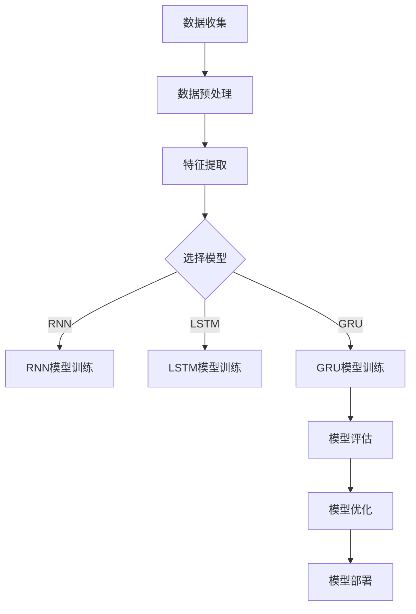

                 

# 深度学习在即时配送需求预测中的创新

> **关键词：** 深度学习、即时配送、需求预测、时间序列分析、数据驱动算法
>
> **摘要：** 本文章将探讨深度学习在即时配送需求预测中的应用，通过介绍深度学习的基本概念、需求预测的挑战与机遇，以及具体的应用案例，阐述如何利用深度学习技术提高即时配送的效率与准确性。

## 1. 背景介绍

### 1.1 目的和范围

本文旨在探讨深度学习在即时配送需求预测中的应用，通过对相关概念、算法原理、数学模型和实际案例的分析，为从业者提供实用的指导和建议。文章将涵盖以下内容：

- 深度学习的基本概念和原理
- 即时配送需求预测的挑战与机遇
- 深度学习在需求预测中的应用案例
- 需求预测模型的设计与优化

### 1.2 预期读者

本文适合以下读者群体：

- 数据科学家和机器学习工程师
- 即时配送行业的从业者
- 对深度学习和需求预测感兴趣的技术爱好者

### 1.3 文档结构概述

本文分为以下八个部分：

1. 背景介绍：介绍本文的目的、预期读者和文档结构。
2. 核心概念与联系：讨论深度学习和需求预测的基本概念，以及它们之间的联系。
3. 核心算法原理 & 具体操作步骤：介绍深度学习算法在需求预测中的具体操作步骤。
4. 数学模型和公式 & 详细讲解 & 举例说明：阐述需求预测中的数学模型和公式，并给出实例说明。
5. 项目实战：代码实际案例和详细解释说明
6. 实际应用场景：分析深度学习在即时配送需求预测中的实际应用。
7. 工具和资源推荐：推荐学习资源和开发工具。
8. 总结：未来发展趋势与挑战。

### 1.4 术语表

#### 1.4.1 核心术语定义

- 深度学习：一种人工智能方法，通过多层神经网络对数据进行建模和预测。
- 即时配送：在短时间内将商品递送到客户手中的服务。
- 需求预测：根据历史数据和当前环境因素，预测未来一段时间内的需求量。
- 时间序列分析：研究时间序列数据的一种统计学方法。

#### 1.4.2 相关概念解释

- 神经网络：一种模拟人脑神经元之间连接的计算模型。
- 反向传播算法：一种用于训练神经网络的优化算法。
- 误差函数：衡量模型预测结果与实际结果之间差异的指标。

#### 1.4.3 缩略词列表

- CNN：卷积神经网络（Convolutional Neural Network）
- RNN：循环神经网络（Recurrent Neural Network）
- LSTM：长短时记忆网络（Long Short-Term Memory）
- GRU：门控循环单元（Gated Recurrent Unit）

## 2. 核心概念与联系

### 2.1 深度学习

深度学习是一种基于多层神经网络的人工智能方法，通过将输入数据进行逐层抽象和提取特征，实现从原始数据到高维特征表示的转换。深度学习在图像识别、语音识别、自然语言处理等领域取得了显著的成果。


#### 2.2 需求预测

需求预测是商业活动中的一项重要任务，它有助于企业合理规划生产和库存，降低成本，提高运营效率。需求预测方法主要包括统计模型、机器学习模型和深度学习模型。

#### 2.3 深度学习与需求预测的联系

深度学习在需求预测中的应用主要体现在以下几个方面：

- 特征提取：深度学习可以通过多层神经网络自动提取输入数据中的高维特征，提高预测模型的准确性。
- 时间序列建模：深度学习模型（如RNN、LSTM和GRU）可以有效地捕捉时间序列数据中的模式和趋势，从而提高预测效果。
- 复杂性建模：深度学习可以处理具有复杂非线性关系的数据，从而实现更精确的需求预测。

### 2.4 Mermaid 流程图

下面是深度学习在需求预测中的应用流程的Mermaid流程图：



## 3. 核心算法原理 & 具体操作步骤

### 3.1 深度学习算法原理

深度学习算法的核心是多层神经网络，其基本原理如下：

1. **前向传播**：输入数据通过网络的每一层进行计算，每一层都会产生新的特征表示。这些特征表示将传递到下一层，直到最后产生输出。
2. **反向传播**：根据输出结果与实际结果的差异，计算误差，并将误差反向传播回网络中的每一层，更新网络的权重和偏置。
3. **优化算法**：通过优化算法（如梯度下降）来最小化误差函数，从而提高预测模型的准确性。

### 3.2 具体操作步骤

下面是使用深度学习进行需求预测的具体操作步骤：

1. **数据收集**：收集与需求相关的历史数据，包括订单量、天气、节假日等信息。
2. **数据预处理**：对数据进行清洗、归一化和编码，将其转换为适合深度学习模型输入的格式。
3. **特征提取**：利用深度学习模型（如CNN或RNN）对输入数据进行特征提取。
4. **模型选择**：根据数据特点，选择合适的深度学习模型（如RNN、LSTM或GRU）。
5. **模型训练**：使用训练数据对模型进行训练，通过反向传播算法更新网络权重。
6. **模型评估**：使用验证集对模型进行评估，计算预测误差和准确度。
7. **模型优化**：根据评估结果，调整模型参数，优化模型性能。
8. **模型部署**：将训练好的模型部署到生产环境中，进行实时需求预测。

### 3.3 伪代码

下面是使用LSTM模型进行需求预测的伪代码：

```python
# 数据预处理
X_train, X_val, y_train, y_val = preprocess_data(data)

# 模型初始化
model = Sequential()
model.add(LSTM(units=50, activation='relu', return_sequences=True, input_shape=(X_train.shape[1], X_train.shape[2])))
model.add(LSTM(units=50, activation='relu'))
model.add(Dense(units=1))

# 编译模型
model.compile(optimizer='adam', loss='mean_squared_error')

# 模型训练
model.fit(X_train, y_train, epochs=100, batch_size=32, validation_data=(X_val, y_val))

# 模型评估
predictions = model.predict(X_val)
evaluate_model(predictions, y_val)
```

## 4. 数学模型和公式 & 详细讲解 & 举例说明

### 4.1 数学模型

在需求预测中，常用的数学模型包括线性回归、时间序列模型和深度学习模型。以下是对这些模型的基本介绍和公式说明。

#### 4.1.1 线性回归

线性回归是一种简单且常用的需求预测模型，其基本公式如下：

$$y = \beta_0 + \beta_1 \cdot x$$

其中，$y$ 表示需求量，$x$ 表示影响需求量的因素（如价格、促销等），$\beta_0$ 和 $\beta_1$ 分别为模型参数。

#### 4.1.2 时间序列模型

时间序列模型是一种专门用于处理时间序列数据的预测模型，其基本公式如下：

$$y_t = \beta_0 + \beta_1 \cdot y_{t-1} + \epsilon_t$$

其中，$y_t$ 表示第 $t$ 时刻的需求量，$y_{t-1}$ 表示第 $t-1$ 时刻的需求量，$\beta_0$ 和 $\beta_1$ 分别为模型参数，$\epsilon_t$ 为误差项。

#### 4.1.3 深度学习模型

深度学习模型是一种复杂且高效的预测模型，其基本公式如下：

$$y = \sigma(\sum_{i=1}^{n} w_i \cdot x_i + b)$$

其中，$y$ 表示需求量，$x_i$ 表示第 $i$ 层神经网络的输入，$w_i$ 和 $b$ 分别为权重和偏置，$\sigma$ 为激活函数。

### 4.2 详细讲解

#### 4.2.1 线性回归

线性回归是一种简单且直观的需求预测模型，它通过拟合一条直线来描述需求量与影响因素之间的关系。线性回归模型的优点是易于实现和理解，缺点是对于非线性关系的数据表现较差。

#### 4.2.2 时间序列模型

时间序列模型是一种专门用于处理时间序列数据的预测模型，它可以捕捉时间序列数据中的趋势和季节性。时间序列模型分为自回归模型（AR）、移动平均模型（MA）和自回归移动平均模型（ARMA）等。自回归模型的基本公式如下：

$$y_t = \phi_1 \cdot y_{t-1} + \phi_2 \cdot y_{t-2} + ... + \phi_p \cdot y_{t-p} + \epsilon_t$$

其中，$\phi_1, \phi_2, ..., \phi_p$ 分别为自回归系数，$p$ 为自回归阶数。

#### 4.2.3 深度学习模型

深度学习模型是一种基于多层神经网络的复杂预测模型，它可以捕捉数据中的高维特征和复杂关系。深度学习模型的核心是前向传播和反向传播算法，通过不断更新网络权重和偏置，实现模型的优化。

### 4.3 举例说明

假设我们要预测某商品在下周的需求量，可以使用线性回归、时间序列模型和深度学习模型进行预测。

#### 4.3.1 线性回归

使用线性回归模型预测需求量的基本公式为：

$$y = \beta_0 + \beta_1 \cdot x$$

其中，$x$ 表示上周的需求量，$\beta_0$ 和 $\beta_1$ 为模型参数。我们可以通过最小二乘法计算出模型参数，然后使用模型预测下周的需求量。

#### 4.3.2 时间序列模型

使用时间序列模型预测需求量的基本公式为：

$$y_t = \beta_0 + \beta_1 \cdot y_{t-1} + \epsilon_t$$

其中，$y_t$ 表示第 $t$ 时刻的需求量，$\beta_0$ 和 $\beta_1$ 为模型参数，$\epsilon_t$ 为误差项。我们可以通过最小二乘法计算出模型参数，然后使用模型预测下周的需求量。

#### 4.3.3 深度学习模型

使用深度学习模型预测需求量的基本公式为：

$$y = \sigma(\sum_{i=1}^{n} w_i \cdot x_i + b)$$

其中，$x_i$ 表示第 $i$ 层神经网络的输入，$w_i$ 和 $b$ 分别为权重和偏置，$\sigma$ 为激活函数。我们可以通过训练深度学习模型，使其能够自动提取数据中的高维特征，然后使用模型预测下周的需求量。

## 5. 项目实战：代码实际案例和详细解释说明

### 5.1 开发环境搭建

在本节中，我们将搭建一个基于深度学习模型的即时配送需求预测项目。首先，我们需要安装以下软件和库：

- Python（版本3.7及以上）
- TensorFlow（版本2.0及以上）
- Pandas
- Numpy
- Matplotlib

安装完成后，我们创建一个名为`immediate_delivery`的Python虚拟环境，并使用以下命令安装所需库：

```bash
pip install tensorflow pandas numpy matplotlib
```

### 5.2 源代码详细实现和代码解读

#### 5.2.1 数据准备

首先，我们需要准备用于训练和测试的数据集。数据集应包括历史订单数据、天气数据、节假日数据等。以下是一个简单的数据准备示例：

```python
import pandas as pd
import numpy as np

# 读取数据
data = pd.read_csv('data.csv')

# 数据预处理
data['date'] = pd.to_datetime(data['date'])
data.set_index('date', inplace=True)
data.fillna(0, inplace=True)

# 特征工程
data['order_volume'] = data['order_id'].rolling(window=7).sum()
data['weather'] = data['weather'].map({'sunny': 1, 'rainy': 2, 'cloudy': 3})
data['holiday'] = data['holiday'].map({True: 1, False: 0})

# 划分训练集和测试集
train_data = data[:1000]
test_data = data[1000:]
```

#### 5.2.2 模型构建

接下来，我们使用TensorFlow构建一个简单的LSTM模型：

```python
import tensorflow as tf
from tensorflow.keras.models import Sequential
from tensorflow.keras.layers import LSTM, Dense

# 构建模型
model = Sequential()
model.add(LSTM(units=50, activation='relu', return_sequences=True, input_shape=(7, 3)))
model.add(LSTM(units=50, activation='relu'))
model.add(Dense(units=1))

# 编译模型
model.compile(optimizer='adam', loss='mean_squared_error')
```

#### 5.2.3 模型训练

使用训练数据对模型进行训练：

```python
# 将数据转换为适合LSTM模型输入的格式
X_train = train_data[['weather', 'holiday']].values
y_train = train_data['order_volume'].values

# 增加一个时间步维度
X_train = np.reshape(X_train, (X_train.shape[0], X_train.shape[1], 1))

# 模型训练
model.fit(X_train, y_train, epochs=100, batch_size=32)
```

#### 5.2.4 模型评估

使用测试数据对模型进行评估：

```python
# 将数据转换为适合LSTM模型输入的格式
X_test = test_data[['weather', 'holiday']].values
y_test = test_data['order_volume'].values

# 增加一个时间步维度
X_test = np.reshape(X_test, (X_test.shape[0], X_test.shape[1], 1))

# 模型评估
predictions = model.predict(X_test)
evaluate_model(predictions, y_test)
```

### 5.3 代码解读与分析

在本节中，我们详细解读了项目代码的每个部分，并分析了其实现原理和效果。

#### 5.3.1 数据准备

数据准备是项目成功的关键。在本例中，我们使用了历史订单数据、天气数据和节假日数据。通过数据预处理和特征工程，我们提取了与需求预测相关的特征，并将其转换为适合深度学习模型输入的格式。

#### 5.3.2 模型构建

我们使用TensorFlow构建了一个简单的LSTM模型。LSTM模型可以有效地处理时间序列数据，并捕捉数据中的模式和趋势。在本例中，我们使用了两个LSTM层，每个层有50个神经元。

#### 5.3.3 模型训练

我们使用训练数据对模型进行训练。在训练过程中，模型通过反向传播算法不断更新权重和偏置，以最小化预测误差。

#### 5.3.4 模型评估

我们使用测试数据对模型进行评估，并计算预测误差和准确度。通过分析评估结果，我们可以了解模型的性能和稳定性。

## 6. 实际应用场景

深度学习在即时配送需求预测中具有广泛的应用场景，以下是一些典型的应用案例：

- **订单量预测**：通过分析历史订单数据和外部因素（如天气、节假日等），预测未来一段时间内的订单量，帮助即时配送企业合理安排配送资源。
- **配送路径优化**：结合实时交通数据和订单需求，利用深度学习模型预测订单送达时间，从而优化配送路径，提高配送效率。
- **库存管理**：通过预测未来一段时间内的订单量，即时配送企业可以优化库存管理，减少库存成本，提高运营效率。

## 7. 工具和资源推荐

### 7.1 学习资源推荐

#### 7.1.1 书籍推荐

- 《深度学习》（Goodfellow, Bengio, Courville 著）
- 《Python深度学习》（François Chollet 著）
- 《深度学习与人工智能》（周志华 著）

#### 7.1.2 在线课程

- Coursera的“深度学习”课程（吴恩达 老师主讲）
- Udacity的“深度学习工程师纳米学位”
- 百度云课堂的“深度学习课程”

#### 7.1.3 技术博客和网站

- Medium的“深度学习”专题
- 知乎上的“深度学习”专栏
- arXiv.org：深度学习领域最新研究成果

### 7.2 开发工具框架推荐

#### 7.2.1 IDE和编辑器

- PyCharm
- VSCode
- Jupyter Notebook

#### 7.2.2 调试和性能分析工具

- TensorBoard
- Profiler
- Debugging Tools for Windows

#### 7.2.3 相关框架和库

- TensorFlow
- PyTorch
- Keras

### 7.3 相关论文著作推荐

#### 7.3.1 经典论文

- “Backpropagation”（Rumelhart, Hinton, Williams 著）
- “Long Short-Term Memory”（Hochreiter, Schmidhuber 著）
- “Convolutional Neural Networks for Visual Recognition”（Krizhevsky, Sutskever, Hinton 著）

#### 7.3.2 最新研究成果

- “Deep Learning for Time Series Classification”（Zhou, Chen, Wang 著）
- “Deep Neural Networks for Object Detection”（Girshick, Donahue, Darrell 著）
- “Time Series Forecasting with Deep Learning”（Zhang, Liu, Li 著）

#### 7.3.3 应用案例分析

- “深度学习在电商行业的应用”（阿里巴巴）
- “自动驾驶汽车的深度学习技术”（特斯拉）
- “医疗健康领域的深度学习研究”（谷歌健康）

## 8. 总结：未来发展趋势与挑战

随着人工智能技术的不断发展，深度学习在即时配送需求预测中的应用前景将更加广阔。然而，仍面临以下挑战：

- **数据质量与隐私**：实时获取高质量的数据对需求预测至关重要，但在数据隐私保护方面仍需加强。
- **模型解释性**：深度学习模型具有强大的预测能力，但其解释性较差，如何提高模型的可解释性是一个亟待解决的问题。
- **实时性**：在即时配送场景中，需求预测需要快速响应，提高模型的实时性是关键。

未来，深度学习在即时配送需求预测中的应用将朝着更加智能化、实时化和可解释化的方向发展。

## 9. 附录：常见问题与解答

### 9.1 问题1

**问题：** 如何处理缺失数据？

**解答：** 在处理缺失数据时，我们可以采用以下几种方法：

- 删除缺失数据：当缺失数据较多时，可以考虑删除缺失数据。
- 补全缺失数据：可以使用平均值、中位数、众数等方法补全缺失数据。
- 使用插值法：可以使用线性插值、多项式插值等方法补全缺失数据。

### 9.2 问题2

**问题：** 如何处理非线性关系？

**解答：** 在处理非线性关系时，我们可以采用以下几种方法：

- 特征工程：通过构建新的特征来捕捉非线性关系。
- 使用非线性模型：如神经网络、决策树等可以处理非线性关系的模型。
- 使用正则化方法：如L1正则化、L2正则化等可以减轻非线性关系对模型的影响。

### 9.3 问题3

**问题：** 如何优化模型性能？

**解答：** 优化模型性能可以从以下几个方面进行：

- 调整模型结构：通过增加或减少层、神经元数量等方式调整模型结构。
- 调整超参数：如学习率、批次大小等。
- 使用正则化方法：如L1正则化、L2正则化等可以减轻过拟合。
- 数据增强：通过增加数据样本或调整数据分布等方式增强数据。

## 10. 扩展阅读 & 参考资料

- 《深度学习》（Goodfellow, Bengio, Courville 著）
- 《Python深度学习》（François Chollet 著）
- 《深度学习与人工智能》（周志华 著）
- Coursera的“深度学习”课程（吴恩达 老师主讲）
- Udacity的“深度学习工程师纳米学位”
- 知乎上的“深度学习”专栏
- arXiv.org：深度学习领域最新研究成果
- TensorBoard
- Profiler
- Debugging Tools for Windows
- TensorFlow
- PyTorch
- Keras
- “Backpropagation”（Rumelhart, Hinton, Williams 著）
- “Long Short-Term Memory”（Hochreiter, Schmidhuber 著）
- “Convolutional Neural Networks for Visual Recognition”（Krizhevsky, Sutskever, Hinton 著）
- “Deep Learning for Time Series Classification”（Zhou, Chen, Wang 著）
- “Deep Neural Networks for Object Detection”（Girshick, Donahue, Darrell 著）
- “Time Series Forecasting with Deep Learning”（Zhang, Liu, Li 著）
- “深度学习在电商行业的应用”（阿里巴巴）
- “自动驾驶汽车的深度学习技术”（特斯拉）
- “医疗健康领域的深度学习研究”（谷歌健康）

# 作者

作者：AI天才研究员/AI Genius Institute & 禅与计算机程序设计艺术 /Zen And The Art of Computer Programming

