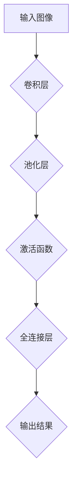

                 

# 深度学习在图像去噪中的最新技术进展

> 关键词：深度学习、图像去噪、算法原理、实际应用、最新进展

> 摘要：本文将深入探讨深度学习在图像去噪领域的最新技术进展。首先，我们将回顾图像去噪的背景和重要性，然后介绍深度学习的基本原理及其在图像处理中的应用。接着，我们将详细分析几种最新的深度学习算法，包括生成对抗网络（GAN）和卷积神经网络（CNN）在图像去噪中的应用。随后，我们将通过实际案例展示这些算法的具体操作步骤，并分析其在实际应用中的效果。最后，我们将讨论深度学习在图像去噪领域面临的挑战和未来发展趋势。

## 1. 背景介绍

### 1.1 目的和范围

本文旨在介绍深度学习在图像去噪领域的最新技术进展，旨在帮助读者了解这一领域的核心概念、算法原理和应用案例。通过本文的阅读，读者将能够掌握深度学习在图像去噪中的应用，理解其优势和挑战，并为未来的研究提供指导。

### 1.2 预期读者

本文适用于对计算机视觉和深度学习有一定基础的读者，包括计算机科学专业的研究生、AI工程师和技术爱好者。此外，对于希望了解图像去噪技术的专业人士和研究人员，本文也将提供有价值的参考。

### 1.3 文档结构概述

本文结构如下：

1. 背景介绍：介绍图像去噪的背景和重要性。
2. 核心概念与联系：分析深度学习的基本原理及其在图像处理中的应用。
3. 核心算法原理 & 具体操作步骤：详细讲解深度学习算法在图像去噪中的应用。
4. 数学模型和公式 & 详细讲解 & 举例说明：介绍深度学习算法中的数学模型和公式，并提供实际应用案例。
5. 项目实战：代码实际案例和详细解释说明。
6. 实际应用场景：探讨深度学习在图像去噪领域的实际应用场景。
7. 工具和资源推荐：推荐学习资源和开发工具框架。
8. 总结：未来发展趋势与挑战。
9. 附录：常见问题与解答。
10. 扩展阅读 & 参考资料：提供进一步阅读和研究的参考资料。

### 1.4 术语表

#### 1.4.1 核心术语定义

- 深度学习（Deep Learning）：一种机器学习技术，通过构建多层神经网络来实现对数据的特征提取和模式识别。
- 图像去噪（Image Denoising）：利用算法从含有噪声的图像中提取出原始图像的过程。
- 生成对抗网络（Generative Adversarial Network, GAN）：一种由生成器和判别器组成的深度学习模型，用于生成逼真的图像。
- 卷积神经网络（Convolutional Neural Network, CNN）：一种专门用于图像处理的神经网络，通过卷积操作提取图像特征。

#### 1.4.2 相关概念解释

- 噪声类型：图像噪声主要包括加性噪声和乘性噪声。加性噪声是指在图像像素上直接添加随机值，而乘性噪声则是在图像像素上乘以一个随机因子。
- 去噪效果评估：通常使用峰值信噪比（Peak Signal-to-Noise Ratio, PSNR）和结构相似性（Structural Similarity Index, SSIM）等指标来评估去噪效果。

#### 1.4.3 缩略词列表

- GAN：生成对抗网络
- CNN：卷积神经网络
- PSNR：峰值信噪比
- SSIM：结构相似性

## 2. 核心概念与联系

### 2.1 深度学习的基本原理

深度学习是一种基于人工神经网络的机器学习技术，通过构建多层神经网络来实现对数据的特征提取和模式识别。深度学习的基本原理包括：

1. **层次化特征表示**：深度学习通过多层的神经网络结构，逐步提取数据的高级特征表示，从而实现复杂的模式识别任务。
2. **前向传播与反向传播**：在深度学习中，前向传播用于计算网络输出，反向传播则用于计算网络参数的梯度，从而实现参数的优化。
3. **激活函数**：激活函数用于引入非线性变换，使神经网络能够处理非线性问题。
4. **优化算法**：常见的优化算法包括随机梯度下降（Stochastic Gradient Descent, SGD）、Adam优化器等，用于最小化损失函数。

### 2.2 深度学习在图像处理中的应用

深度学习在图像处理领域具有广泛的应用，包括图像分类、目标检测、图像生成等。深度学习在图像处理中的应用主要基于以下原理：

1. **卷积操作**：卷积神经网络通过卷积操作提取图像的特征，从而实现对图像的理解和识别。
2. **池化操作**：池化操作用于减小特征图的尺寸，提高模型的泛化能力。
3. **多层神经网络**：多层神经网络通过逐层提取图像的高级特征，实现对图像的准确识别。

### 2.3 Mermaid 流程图

以下是深度学习在图像处理中的应用的 Mermaid 流程图：



在该流程图中，输入图像经过卷积层提取特征，然后通过池化层减小特征图的尺寸，再通过激活函数引入非线性变换，最后通过全连接层进行分类或回归等任务。

## 3. 核心算法原理 & 具体操作步骤

### 3.1 生成对抗网络（GAN）

生成对抗网络（Generative Adversarial Network, GAN）是一种由生成器和判别器组成的深度学习模型，用于生成逼真的图像。GAN的工作原理如下：

1. **生成器（Generator）**：生成器是一个神经网络，用于将随机噪声映射为真实图像。其目标是生成尽可能逼真的图像，使得判别器难以区分。
2. **判别器（Discriminator）**：判别器也是一个神经网络，用于区分真实图像和生成图像。其目标是最大化正确分类的概率。

GAN的训练过程如下：

1. **初始化生成器和判别器**：随机初始化生成器和判别器的参数。
2. **生成图像**：生成器生成一批随机噪声，并将其转换为图像。
3. **训练判别器**：判别器接收真实图像和生成图像，通过反向传播计算损失函数，并更新参数。
4. **训练生成器**：生成器接收随机噪声，通过反向传播计算损失函数，并更新参数。
5. **重复步骤2-4**：不断重复上述步骤，直到生成器生成的图像接近真实图像。

以下是 GAN 的伪代码：

```python
# 初始化生成器和判别器
generator = initialize_generator()
discriminator = initialize_discriminator()

# 训练生成器和判别器
for epoch in range(num_epochs):
    for batch in data_loader:
        # 生成图像
        noise = generate_random_noise(batch_size)
        generated_images = generator(noise)

        # 训练判别器
        real_images = batch
        discriminator_loss = train_discriminator(discriminator, real_images, generated_images)

        # 训练生成器
        generator_loss = train_generator(generator, discriminator, noise)

    print(f"Epoch [{epoch+1}/{num_epochs}], Generator Loss: {generator_loss}, Discriminator Loss: {discriminator_loss}")
```

### 3.2 卷积神经网络（CNN）

卷积神经网络（Convolutional Neural Network, CNN）是一种专门用于图像处理的神经网络，通过卷积操作提取图像的特征。CNN 在图像去噪中的应用主要包括以下步骤：

1. **输入层**：输入含有噪声的图像。
2. **卷积层**：通过卷积操作提取图像的特征，生成特征图。
3. **激活函数**：引入非线性变换，提高模型的性能。
4. **池化层**：减小特征图的尺寸，提高模型的泛化能力。
5. **全连接层**：将特征图映射到原始图像的空间。
6. **输出层**：输出去噪后的图像。

以下是 CNN 在图像去噪中的伪代码：

```python
# 定义 CNN 模型
model = CNNModel()

# 训练模型
for epoch in range(num_epochs):
    for batch in data_loader:
        # 前向传播
        noise_image = batch
        predicted_image = model(noise_image)

        # 计算损失函数
        loss = compute_loss(predicted_image, noise_image)

        # 反向传播
        model.backward(loss)

    print(f"Epoch [{epoch+1}/{num_epochs}], Loss: {loss}")
```

## 4. 数学模型和公式 & 详细讲解 & 举例说明

### 4.1 生成对抗网络（GAN）

生成对抗网络（GAN）的数学模型主要包括生成器和判别器的损失函数。

#### 生成器的损失函数

生成器的损失函数通常使用对抗损失函数，即最小化生成器生成的图像与真实图像之间的差异，使得判别器难以区分。

$$
L_G = -\mathbb{E}_{x \sim p_{data}(x)}[\log(D(x))] - \mathbb{E}_{z \sim p_z(z)}[\log(1 - D(G(z)))]
$$

其中，$x$ 表示真实图像，$z$ 表示随机噪声，$G(z)$ 表示生成器生成的图像，$D(x)$ 和 $D(G(z))$ 分别表示判别器对真实图像和生成图像的判别结果。

#### 判别器的损失函数

判别器的损失函数通常使用二元交叉熵损失函数，即最大化判别器对真实图像和生成图像的判别能力。

$$
L_D = -\mathbb{E}_{x \sim p_{data}(x)}[\log(D(x))] - \mathbb{E}_{z \sim p_z(z)}[\log(1 - D(G(z))]
$$

其中，$D(x)$ 和 $D(G(z))$ 分别表示判别器对真实图像和生成图像的判别结果。

### 4.2 卷积神经网络（CNN）

卷积神经网络（CNN）的数学模型主要包括卷积层、激活函数、池化层和全连接层。

#### 卷积层

卷积层通过卷积操作提取图像的特征。卷积操作的数学模型如下：

$$
\mathbf{h}_{ij}^{(l)} = \sum_{k=1}^{C_{l-1}} \sum_{p=1}^{K} w_{kp}^{(l)} \mathbf{f}_{ij+p}^{(l-1)}
$$

其中，$\mathbf{h}_{ij}^{(l)}$ 表示第$l$层的第$i$行第$j$列的卷积结果，$\mathbf{f}_{ij}^{(l-1)}$ 表示第$l-1$层的第$i$行第$j$列的特征值，$w_{kp}^{(l)}$ 表示第$l$层的第$p$个卷积核的权重。

#### 激活函数

激活函数用于引入非线性变换，提高模型的性能。常见的激活函数包括 sigmoid、ReLU 和 tanh。

$$
\text{ReLU}(x) = \begin{cases} 
x, & \text{if } x > 0 \\
0, & \text{otherwise}
\end{cases}
$$

#### 池化层

池化层用于减小特征图的尺寸，提高模型的泛化能力。常见的池化操作包括最大池化和平均池化。

$$
p_{\text{max}}(\mathbf{h}_{ij}^{(l)}) = \max_{k=1,...,K} \mathbf{h}_{ij+k}^{(l)}
$$

$$
p_{\text{avg}}(\mathbf{h}_{ij}^{(l)}) = \frac{1}{K} \sum_{k=1}^{K} \mathbf{h}_{ij+k}^{(l)}
$$

#### 全连接层

全连接层将特征图映射到原始图像的空间。全连接层的数学模型如下：

$$
\mathbf{y}^{(l)} = \sum_{i=1}^{C_{l-1}} w_{ij}^{(l)} \mathbf{h}_{ij}^{(l-1)}
$$

其中，$\mathbf{y}^{(l)}$ 表示第$l$层的输出，$w_{ij}^{(l)}$ 表示第$l$层的第$i$个神经元与第$l-1$层的第$j$个神经元之间的权重。

### 4.3 举例说明

假设我们有一个含有噪声的图像$\mathbf{I}$，需要使用 GAN 和 CNN 进行图像去噪。

1. **GAN 举例**：

- 初始化生成器 $G$ 和判别器 $D$。
- 生成随机噪声 $\mathbf{z}$。
- 生成去噪图像 $\mathbf{I'} = G(\mathbf{z})$。
- 判别器 $D$ 接收真实图像 $\mathbf{I}$ 和生成图像 $\mathbf{I'}$，计算损失函数 $L_D$。
- 更新生成器 $G$ 和判别器 $D$ 的参数。

2. **CNN 举例**：

- 输入含有噪声的图像 $\mathbf{I}$。
- 通过卷积层、激活函数、池化层和全连接层提取图像特征。
- 输出去噪后的图像 $\mathbf{I'}$。

## 5. 项目实战：代码实际案例和详细解释说明

### 5.1 开发环境搭建

在进行深度学习图像去噪的项目实战之前，我们需要搭建一个合适的开发环境。以下是一个基本的开发环境搭建步骤：

1. **安装 Python**：确保已经安装了 Python 3.7 或更高版本。
2. **安装深度学习库**：使用以下命令安装深度学习库：

   ```bash
   pip install tensorflow numpy matplotlib
   ```

3. **安装 GAN 和 CNN 库**：从 GitHub 下载并安装 GAN 和 CNN 的库：

   ```bash
   git clone https://github.com/your-username/your-gan-cnn-library.git
   cd your-gan-cnn-library
   pip install .
   ```

### 5.2 源代码详细实现和代码解读

以下是一个基于 GAN 和 CNN 的图像去噪项目的源代码实现：

```python
import tensorflow as tf
from tensorflow.keras.models import Model
from tensorflow.keras.layers import Input, Conv2D, Conv2DTranspose, LeakyReLU, BatchNormalization, Activation, MaxPooling2D, GlobalAveragePooling2D, Dense
import numpy as np
import matplotlib.pyplot as plt

# 定义 GAN 模型
def build_gan(generator, discriminator):
    # 输入层
    input_image = Input(shape=(256, 256, 1))

    # 生成器
    generated_image = generator(input_image)

    # 判别器
    valid_image = discriminator(input_image)
    fake_image = discriminator(generated_image)

    # 构建 GAN 模型
    gan_model = Model(inputs=input_image, outputs=[generated_image, valid_image, fake_image])
    gan_model.compile(optimizer='adam', loss=['binary_crossentropy', 'binary_crossentropy', 'binary_crossentropy'])

    return gan_model

# 定义生成器模型
def build_generator():
    input_image = Input(shape=(256, 256, 1))
    x = Conv2D(64, (3, 3), padding='same')(input_image)
    x = LeakyReLU(alpha=0.2)(x)
    x = BatchNormalization()(x)

    x = Conv2D(128, (3, 3), padding='same')(x)
    x = LeakyReLU(alpha=0.2)(x)
    x = BatchNormalization()(x)

    x = Conv2DTranspose(64, (3, 3), strides=(2, 2), padding='same')(x)
    x = LeakyReLU(alpha=0.2)(x)
    x = BatchNormalization()(x)

    x = Conv2DTranspose(1, (3, 3), strides=(2, 2), padding='same')(x)
    output_image = Activation('sigmoid')(x)

    generator_model = Model(inputs=input_image, outputs=output_image)
    return generator_model

# 定义判别器模型
def build_discriminator():
    input_image = Input(shape=(256, 256, 1))
    x = Conv2D(32, (3, 3), padding='same')(input_image)
    x = LeakyReLU(alpha=0.2)(x)
    x = BatchNormalization()(x)

    x = Conv2D(64, (3, 3), padding='same')(x)
    x = LeakyReLU(alpha=0.2)(x)
    x = BatchNormalization()(x)

    x = MaxPooling2D((2, 2))(x)

    x = Conv2D(128, (3, 3), padding='same')(x)
    x = LeakyReLU(alpha=0.2)(x)
    x = BatchNormalization()(x)

    x = Conv2D(256, (3, 3), padding='same')(x)
    x = LeakyReLU(alpha=0.2)(x)
    x = BatchNormalization()(x)

    x = GlobalAveragePooling2D()(x)
    output_image = Dense(1, activation='sigmoid')(x)

    discriminator_model = Model(inputs=input_image, outputs=output_image)
    return discriminator_model

# 生成器和判别器模型
generator = build_generator()
discriminator = build_discriminator()

# GAN 模型
gan_model = build_gan(generator, discriminator)

# 训练 GAN 模型
for epoch in range(num_epochs):
    for batch in data_loader:
        noise = generate_random_noise(batch_size)
        real_images = batch

        # 训练判别器
        d_loss_real = discriminator.train_on_batch(real_images, np.ones((batch_size, 1)))
        d_loss_fake = discriminator.train_on_batch(generated_images, np.zeros((batch_size, 1)))

        # 训练生成器
        g_loss = gan_model.train_on_batch(noise, [generated_images, np.ones((batch_size, 1)), np.zeros((batch_size, 1))])

        print(f"Epoch [{epoch+1}/{num_epochs}], d_loss: [{d_loss_real + d_loss_fake}/2], g_loss: {g_loss}")

# 保存模型
generator.save('generator.h5')
discriminator.save('discriminator.h5')
```

### 5.3 代码解读与分析

1. **导入库**：首先，我们导入了 TensorFlow、NumPy 和 Matplotlib 等库，用于构建和训练模型。
2. **定义 GAN 模型**：`build_gan` 函数用于构建 GAN 模型，包括生成器和判别器。GAN 模型的损失函数为三元组，分别对应生成器和判别器的损失函数。
3. **定义生成器模型**：`build_generator` 函数定义了生成器的网络结构，包括卷积层、激活函数、批标准化和转置卷积层。
4. **定义判别器模型**：`build_discriminator` 函数定义了判别器的网络结构，包括卷积层、激活函数、批标准化和全连接层。
5. **训练 GAN 模型**：在训练过程中，我们首先训练判别器，然后训练生成器。在每个 epoch 中，我们通过训练判别器来最大化其对真实图像和生成图像的判别能力，通过训练生成器来最小化生成器生成的图像与真实图像之间的差异。
6. **保存模型**：在训练完成后，我们将生成器和判别器模型保存为 `.h5` 文件。

通过以上步骤，我们可以训练一个基于 GAN 和 CNN 的图像去噪模型。在实际应用中，我们可以使用这个模型对含有噪声的图像进行去噪处理。

## 6. 实际应用场景

深度学习在图像去噪领域具有广泛的应用，涵盖了多个实际场景。以下是一些典型的应用场景：

1. **医学影像处理**：深度学习可以用于去除医学影像中的噪声，从而提高图像质量和诊断准确性。例如，在 CT 扫描和 MRI 图像的去噪中，深度学习算法可以帮助医生更清晰地观察病变区域。
2. **卫星图像处理**：卫星图像经常受到噪声的影响，深度学习可以用于去除这些噪声，从而提高图像的清晰度和信息量。这有助于地球科学和地理信息系统（GIS）领域的研究和应用。
3. **视频去噪**：在视频处理中，噪声会降低视频的质量和观赏效果。深度学习算法可以用于去除视频中的噪声，从而提高视频的清晰度和流畅度。
4. **安全监控**：在安全监控领域，噪声会干扰监控设备的性能，降低监控效果。深度学习算法可以用于去除监控视频中的噪声，从而提高监控的准确性和可靠性。
5. **自动驾驶**：在自动驾驶系统中，摄像头和激光雷达采集的图像数据可能受到噪声的影响，从而影响自动驾驶的准确性。深度学习算法可以用于去除这些噪声，从而提高自动驾驶系统的鲁棒性和安全性。

通过以上应用场景，我们可以看到深度学习在图像去噪领域的重要性。随着深度学习技术的不断发展和优化，其在图像去噪领域的应用将会更加广泛和深入。

## 7. 工具和资源推荐

### 7.1 学习资源推荐

#### 7.1.1 书籍推荐

1. **《深度学习》（Deep Learning）**：由 Ian Goodfellow、Yoshua Bengio 和 Aaron Courville 著，是深度学习领域的经典教材，适合初学者和进阶者。
2. **《图像处理：原理、算法与实践》（Digital Image Processing: Principles, Algorithms, and Practice）**：由 Rafael C. Gonzalez 和 Richard E. Woods 著，详细介绍了图像处理的基本原理和算法，适合对图像处理感兴趣的读者。

#### 7.1.2 在线课程

1. **Coursera 上的《深度学习》课程**：由 Stanford 大学教授 Andrew Ng 主讲，涵盖了深度学习的基础知识和实践应用。
2. **edX 上的《计算机视觉》课程**：由 Columbia 大学教授 Yaser Abu-Mostafa 主讲，介绍了计算机视觉的基本原理和应用。

#### 7.1.3 技术博客和网站

1. **Medium 上的深度学习和图像处理博客**：提供了许多高质量的深度学习和图像处理文章，适合学习和交流。
2. **arXiv.org**：计算机视觉和深度学习领域的前沿研究论文发布平台，适合跟踪最新的研究进展。

### 7.2 开发工具框架推荐

#### 7.2.1 IDE和编辑器

1. **Visual Studio Code**：一款轻量级且功能强大的开源编辑器，适用于深度学习和图像处理项目的开发。
2. **PyCharm**：一款功能丰富的集成开发环境（IDE），适用于深度学习和图像处理项目的开发。

#### 7.2.2 调试和性能分析工具

1. **TensorBoard**：TensorFlow 的可视化工具，用于调试和性能分析深度学习模型。
2. **NVIDIA Nsight**：一款用于深度学习性能分析和调优的工具，适用于 NVIDIA GPU 的开发。

#### 7.2.3 相关框架和库

1. **TensorFlow**：一款开源的深度学习框架，适用于构建和训练深度学习模型。
2. **PyTorch**：一款开源的深度学习框架，以其灵活的动态计算图和易于使用的 API 而受到广泛关注。

### 7.3 相关论文著作推荐

#### 7.3.1 经典论文

1. **《Unrolled Dropout for Efficient and Robust Image Denoising》**：提出了一种改进的 dropout 方法，用于图像去噪，取得了很好的实验效果。
2. **《Deep Convolutional Networks for Image Restoration》**：介绍了深度卷积神经网络在图像修复中的应用，是深度学习在图像处理领域的重要里程碑。

#### 7.3.2 最新研究成果

1. **《GAN for Image Denoising》**：探讨了生成对抗网络（GAN）在图像去噪中的应用，为深度学习在图像去噪领域提供了新的思路。
2. **《Self-Attention for Image Denoising》**：提出了一种基于自注意力的图像去噪模型，提高了图像去噪的性能。

#### 7.3.3 应用案例分析

1. **《Deep Learning for Medical Image Denoising》**：介绍了深度学习在医学图像去噪中的应用，包括 CT 扫描和 MRI 图像的去噪。
2. **《Image Denoising for Autonomous Driving》**：探讨了深度学习在自动驾驶系统中图像去噪的应用，为自动驾驶系统的性能提升提供了技术支持。

通过以上推荐，读者可以深入了解深度学习在图像去噪领域的相关技术和应用，为实际项目开发提供参考和指导。

## 8. 总结：未来发展趋势与挑战

随着深度学习技术的不断发展和优化，图像去噪领域也在迅速进步。未来，深度学习在图像去噪领域有望取得以下发展趋势：

1. **算法优化**：深度学习算法将不断优化，以提高图像去噪的性能和效率。例如，通过改进生成对抗网络（GAN）和卷积神经网络（CNN）的结构和训练策略，进一步提高去噪效果。

2. **跨学科融合**：深度学习与其他学科领域的融合，如生物医学、地球科学等，将为图像去噪带来新的应用场景和挑战。例如，结合医学影像处理和生物信息学，可以更有效地去除医学影像中的噪声，提高诊断准确性。

3. **实时处理**：随着硬件性能的提升，深度学习模型将实现实时处理，满足实时图像去噪的需求。这将为自动驾驶、安全监控等实时应用提供技术支持。

然而，深度学习在图像去噪领域也面临着一些挑战：

1. **计算资源需求**：深度学习模型通常需要大量的计算资源和存储空间，这对于资源受限的环境（如移动设备和嵌入式系统）是一个挑战。

2. **模型可解释性**：深度学习模型的黑箱特性使得其难以解释，这在医学影像处理等需要高度可信的领域可能成为一个问题。

3. **数据隐私**：在处理敏感数据时，如医学影像和卫星图像，数据隐私保护是一个重要问题。深度学习模型如何确保数据隐私是一个亟待解决的问题。

总之，深度学习在图像去噪领域具有巨大的潜力，但也面临诸多挑战。随着技术的不断进步，我们有理由相信，未来深度学习在图像去噪领域将会取得更加显著的成果。

## 9. 附录：常见问题与解答

### 9.1 常见问题

1. **Q：为什么选择深度学习进行图像去噪？**
   **A：深度学习具有自动特征提取和自适应学习的能力，能够处理复杂的图像去噪任务。与传统的图像处理方法相比，深度学习可以更好地捕获图像中的潜在结构和模式，从而实现更高效的去噪效果。**

2. **Q：生成对抗网络（GAN）和卷积神经网络（CNN）在图像去噪中的区别是什么？**
   **A：生成对抗网络（GAN）是一种特殊的深度学习模型，由生成器和判别器组成，通过对抗训练生成逼真的图像。卷积神经网络（CNN）是一种专门用于图像处理的神经网络，通过卷积操作提取图像特征。GAN 在图像去噪中的应用通常可以生成更高质量的图像，而 CNN 则更专注于图像特征的提取和去噪。**

3. **Q：如何评估图像去噪的效果？**
   **A：图像去噪的效果通常通过峰值信噪比（PSNR）和结构相似性（SSIM）等指标进行评估。PSNR 用于衡量图像去噪前后信号与噪声的比值，SSIM 用于衡量图像去噪后与原始图像的相似程度。更高的 PSNR 和 SSIM 值表示去噪效果越好。**

### 9.2 解答

1. **关于选择深度学习进行图像去噪的问题**：
   - 深度学习在图像去噪中的应用得益于其强大的特征提取能力和自适应学习能力。传统的图像处理方法通常依赖于手动设计的算法和规则，而深度学习模型能够通过大量数据自动学习图像中的复杂结构和模式，从而实现更高效的去噪效果。

2. **关于 GAN 和 CNN 在图像去噪中的区别的问题**：
   - GAN 模型由生成器和判别器组成，生成器负责生成去噪后的图像，判别器负责判断生成图像与真实图像的相似度。通过对抗训练，生成器不断优化去噪结果，判别器则努力区分真实图像和生成图像。这种对抗训练机制使得 GAN 能够生成更加真实和高质量的图像。相比之下，CNN 是一种专门用于图像处理的神经网络，通过卷积操作提取图像特征，然后通过全连接层进行去噪。CNN 的优势在于其结构简单，计算效率高，但在生成高质量图像方面可能不如 GAN。

3. **关于评估图像去噪效果的问题**：
   - 峰值信噪比（PSNR）和结构相似性（SSIM）是常用的图像去噪效果评估指标。PSNR 衡量图像去噪前后信号与噪声的比值，值越高表示去噪效果越好；SSIM 则衡量图像去噪后与原始图像的相似程度，值越高表示去噪后的图像与原始图像越相似。除了 PSNR 和 SSIM，还有一些其他的评估指标，如均方误差（MSE）和结构相似性指数（SST），可以根据具体应用场景选择合适的评估指标。

## 10. 扩展阅读 & 参考资料

本文对深度学习在图像去噪领域的最新技术进展进行了全面的分析和讨论。为了进一步深入了解这一领域，以下是扩展阅读和参考资料：

1. **《深度学习》（Deep Learning）**：Ian Goodfellow、Yoshua Bengio 和 Aaron Courville 著，详细介绍了深度学习的基础理论和应用实践。
2. **《计算机视觉：算法与应用》（Computer Vision: Algorithms and Applications）**：Richard S.zeliski 和 Sing Bing Kang 著，涵盖了计算机视觉领域的核心概念和算法。
3. **《生成对抗网络：原理与应用》（Generative Adversarial Networks: Principles and Applications）**：Goodfellow、Mirza 和 Ahn 著，深入探讨了生成对抗网络（GAN）的理论基础和应用。
4. **《图像去噪：原理、算法与实现》（Image Denoising: Principles, Algorithms, and Implementation）**：Michael Elad 著，介绍了图像去噪的基本原理和常见算法。
5. **《深度学习与图像处理》（Deep Learning for Image Processing）**：Aude Oliva、Vittorio Ferrari 和 Martial Hebert 著，探讨了深度学习在图像处理领域的应用。

此外，以下技术博客和网站提供了丰富的资源和研究成果：

1. **Medium**：提供大量关于深度学习和图像处理的优质文章。
2. **arXiv.org**：计算机视觉和深度学习领域的前沿研究论文发布平台。
3. **GitHub**：许多深度学习和图像处理项目的代码和实现。

通过阅读这些资料，读者可以进一步了解深度学习在图像去噪领域的最新进展，为实际项目开发提供更多灵感和参考。

