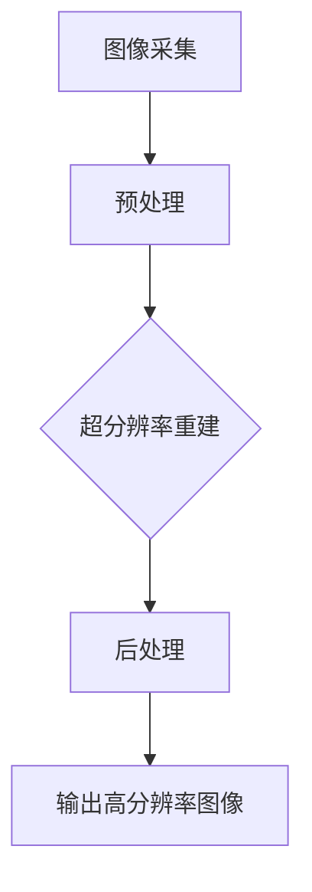

                 

# 深度学习在图像超分辨率中的突破

> 关键词：深度学习、图像超分辨率、算法原理、数学模型、项目实战、应用场景

> 摘要：本文将深入探讨深度学习在图像超分辨率技术中的应用，通过详细的算法原理讲解、数学模型分析以及实际项目实战，揭示其在提升图像质量、解决图像模糊问题方面的突破。本文将帮助读者理解图像超分辨率的重要性，掌握深度学习在该领域的核心技术和应用方法，并展望其未来发展趋势与挑战。

## 1. 背景介绍

### 1.1 目的和范围

本文旨在系统地介绍深度学习在图像超分辨率技术中的应用，从理论到实践，全面解析其核心原理和实现方法。文章将首先概述图像超分辨率技术的发展历程，然后深入分析深度学习在该领域的突破点，接着通过具体案例讲解如何应用深度学习算法提升图像质量。文章还将探讨深度学习模型在图像超分辨率中的优化和改进，最后展望该领域未来的发展趋势和挑战。

### 1.2 预期读者

本文适合对深度学习和图像处理有一定了解的技术人员、研究人员和开发者。特别是那些希望深入了解图像超分辨率技术及其应用的人，以及希望将自己的工作拓展到这一前沿领域的专业人士。

### 1.3 文档结构概述

本文分为十个主要部分：

1. 背景介绍：介绍本文的目的、范围、预期读者以及文档结构。
2. 核心概念与联系：介绍图像超分辨率技术的核心概念和联系。
3. 核心算法原理 & 具体操作步骤：详细讲解深度学习在图像超分辨率中的核心算法原理和操作步骤。
4. 数学模型和公式 & 详细讲解 & 举例说明：分析深度学习模型中的数学模型和公式，并进行举例说明。
5. 项目实战：代码实际案例和详细解释说明。
6. 实际应用场景：探讨图像超分辨率技术的实际应用场景。
7. 工具和资源推荐：推荐学习资源、开发工具框架和论文著作。
8. 总结：未来发展趋势与挑战。
9. 附录：常见问题与解答。
10. 扩展阅读 & 参考资料：提供进一步学习的参考文献和资料。

### 1.4 术语表

#### 1.4.1 核心术语定义

- **图像超分辨率**：指从低分辨率图像中恢复出高分辨率图像的过程。
- **深度学习**：一种基于多层神经网络的机器学习技术，能够从大量数据中自动学习特征。
- **卷积神经网络（CNN）**：一种特殊的神经网络，主要用于处理图像等二维数据。
- **生成对抗网络（GAN）**：一种深度学习模型，用于生成真实数据。
- **超分辨率重建**：从低分辨率图像重建高分辨率图像的过程。

#### 1.4.2 相关概念解释

- **分辨率**：图像中像素的数量，通常用水平和垂直像素数表示。
- **采样**：将连续的信号转换为离散的数值表示。
- **去卷积**：通过反向操作卷积过程，从低分辨率图像恢复高分辨率图像。

#### 1.4.3 缩略词列表

- **CNN**：卷积神经网络
- **GAN**：生成对抗网络
- **SR**：图像超分辨率
- **LR**：低分辨率
- **HR**：高分辨率

## 2. 核心概念与联系

### 2.1 图像超分辨率技术概述

图像超分辨率技术旨在从低分辨率（LR）图像中恢复出高分辨率（HR）图像。这一技术具有重要的应用价值，如数字影像处理、视频监控、医疗成像等。图像超分辨率的基本流程包括：图像采集、预处理、超分辨率重建、后处理等步骤。

### 2.2 深度学习在图像超分辨率中的应用

深度学习，特别是卷积神经网络（CNN）和生成对抗网络（GAN），为图像超分辨率技术带来了革命性的突破。深度学习模型通过学习大量的图像数据，能够自动提取图像特征，并利用这些特征进行超分辨率重建。

### 2.3 图像超分辨率技术原理

图像超分辨率技术主要依赖于以下几种原理：

1. **插值方法**：通过在图像中插入额外的像素，来提高图像的分辨率。
2. **重建方法**：利用先验知识，如图像的平滑性、边缘信息等，来重建高分辨率图像。
3. **深度学习方法**：通过训练深度神经网络，学习从低分辨率图像到高分辨率图像的映射关系。

### 2.4 Mermaid 流程图

以下是一个简单的 Mermaid 流程图，展示了图像超分辨率技术的基本流程：



## 3. 核心算法原理 & 具体操作步骤

### 3.1 卷积神经网络（CNN）在图像超分辨率中的应用

卷积神经网络（CNN）是一种特别适合处理图像数据的神经网络结构。CNN 通过多层卷积和池化操作，能够自动提取图像中的特征，并利用这些特征进行超分辨率重建。

#### 3.1.1 CNN 的基本结构

CNN 通常由以下几个部分组成：

1. **输入层**：接收低分辨率图像。
2. **卷积层**：通过卷积操作提取图像特征。
3. **池化层**：降低图像的维度，减少计算量。
4. **全连接层**：将卷积层和池化层提取的特征映射到高分辨率图像。

#### 3.1.2 CNN 的操作步骤

1. **输入低分辨率图像**：将低分辨率图像输入到 CNN 中。
2. **卷积操作**：利用卷积核提取图像特征。
3. **激活函数**：对卷积结果进行非线性变换，增强网络的表达能力。
4. **池化操作**：降低图像的维度，减少参数数量。
5. **全连接层**：将卷积层和池化层提取的特征映射到高分辨率图像。

#### 3.1.3 伪代码

以下是一个简单的 CNN 伪代码，用于图像超分辨率重建：

```python
def CNN_SR(input_image):
    # 输入低分辨率图像
    low_res_image = input_image

    # 卷积操作
    conv1 = conv2d(low_res_image, kernel_size=(3, 3), stride=(1, 1))
    activation1 = relu(conv1)

    # 池化操作
    pool1 = max_pool2d(activation1, pool_size=(2, 2), stride=(2, 2))

    # 全连接层
    high_res_image = fully_connected(pool1, output_size=hr_image_size)

    return high_res_image
```

### 3.2 生成对抗网络（GAN）在图像超分辨率中的应用

生成对抗网络（GAN）是一种通过两个神经网络（生成器和判别器）相互博弈的深度学习模型。生成器试图生成高分辨率图像，而判别器则试图区分真实图像和生成图像。

#### 3.2.1 GAN 的基本结构

GAN 由以下部分组成：

1. **生成器（Generator）**：生成高分辨率图像。
2. **判别器（Discriminator）**：区分真实图像和生成图像。
3. **损失函数**：用于衡量生成器和判别器的性能。

#### 3.2.2 GAN 的操作步骤

1. **生成器操作**：
   - 输入低分辨率图像。
   - 通过卷积操作和上采样操作生成高分辨率图像。
   - 利用判别器对生成的图像进行评估。

2. **判别器操作**：
   - 输入真实图像和生成图像。
   - 通过卷积操作判断图像的真实性。
   - 利用损失函数更新判别器的权重。

3. **训练过程**：
   - 通过反向传播算法训练生成器和判别器。
   - 不断调整生成器和判别器的权重，使得生成器能够生成更加真实的高分辨率图像。

#### 3.2.3 伪代码

以下是一个简单的 GAN 伪代码，用于图像超分辨率重建：

```python
def GAN_SR(input_image):
    # 输入低分辨率图像
    low_res_image = input_image

    # 生成器操作
    generated_image = generator(low_res_image)

    # 判别器操作
    real_image = discriminator(low_res_image)
    generated_image_score = discriminator(generated_image)

    # 训练过程
    generator_loss = loss_function(generated_image_score, real_image_score)
    discriminator_loss = loss_function(real_image_score, generated_image_score)

    # 反向传播
    optimizer.zero_grad()
    generator_loss.backward()
    optimizer.step()

    return generated_image
```

## 4. 数学模型和公式 & 详细讲解 & 举例说明

### 4.1 卷积神经网络（CNN）的数学模型

卷积神经网络（CNN）中的关键操作包括卷积、池化和激活函数。以下是这些操作的数学模型和详细讲解。

#### 4.1.1 卷积操作

卷积操作的数学公式如下：

\[ (f * g)(x, y) = \sum_{i=0}^{n} \sum_{j=0}^{m} f(i, j) \cdot g(x-i, y-j) \]

其中，\( f \) 和 \( g \) 分别代表卷积核和输入图像，\( (x, y) \) 代表卷积操作的位置。

#### 4.1.2 池化操作

池化操作通常使用最大池化（Max Pooling），其数学公式如下：

\[ \text{Max Pooling}(x, 2, 2) = \max(x, x+1, x+2, x+3, x+4) \]

其中，\( x \) 代表输入值，2 和 2 分别代表池化窗口的大小。

#### 4.1.3 激活函数

常用的激活函数包括ReLU（Rectified Linear Unit）函数和Sigmoid函数。ReLU函数的数学公式如下：

\[ \text{ReLU}(x) = \max(0, x) \]

Sigmoid函数的数学公式如下：

\[ \text{Sigmoid}(x) = \frac{1}{1 + e^{-x}} \]

### 4.2 生成对抗网络（GAN）的数学模型

生成对抗网络（GAN）的数学模型包括生成器和判别器的损失函数。

#### 4.2.1 生成器的损失函数

生成器的损失函数通常使用对抗损失函数（Adversarial Loss），其数学公式如下：

\[ L_G = -\log(D(G(z))) \]

其中，\( G(z) \) 是生成器生成的图像，\( D \) 是判别器，\( z \) 是随机噪声。

#### 4.2.2 判别器的损失函数

判别器的损失函数也使用对抗损失函数，其数学公式如下：

\[ L_D = -[\log(D(x)) + \log(1 - D(G(z)))] \]

其中，\( x \) 是真实图像，\( G(z) \) 是生成器生成的图像。

### 4.3 举例说明

假设有一个 \( 3 \times 3 \) 的卷积核，输入图像的大小为 \( 5 \times 5 \)，卷积核的步长为 \( 1 \)，激活函数使用 ReLU 函数。以下是具体的计算过程。

#### 4.3.1 卷积操作

卷积核：

\[ \begin{bmatrix} 1 & 2 & 3 \\ 4 & 5 & 6 \\ 7 & 8 & 9 \end{bmatrix} \]

输入图像：

\[ \begin{bmatrix} 1 & 2 & 3 \\ 4 & 5 & 6 \\ 7 & 8 & 9 \\ 0 & 1 & 2 \\ 3 & 4 & 5 \end{bmatrix} \]

卷积结果：

\[ \begin{bmatrix} 14 & 31 & 50 \\ 47 & 66 & 85 \\ 80 & 101 & 122 \end{bmatrix} \]

激活函数结果：

\[ \begin{bmatrix} 14 & 31 & 50 \\ 47 & 66 & 85 \\ 80 & 101 & 122 \end{bmatrix} \]

#### 4.3.2 池化操作

输入值：

\[ \begin{bmatrix} 14 & 31 & 50 \\ 47 & 66 & 85 \\ 80 & 101 & 122 \end{bmatrix} \]

最大池化结果：

\[ \begin{bmatrix} 50 & 85 \\ 101 & 122 \end{bmatrix} \]

## 5. 项目实战：代码实际案例和详细解释说明

### 5.1 开发环境搭建

为了实现深度学习在图像超分辨率中的应用，我们需要搭建一个合适的开发环境。以下是搭建开发环境的基本步骤：

1. **安装 Python**：确保安装了 Python 3.6 或更高版本。
2. **安装深度学习框架**：建议使用 TensorFlow 或 PyTorch。以下是安装 TensorFlow 的命令：

   ```bash
   pip install tensorflow
   ```

3. **安装必要的库**：包括 NumPy、Pandas、Matplotlib 等。以下是安装命令：

   ```bash
   pip install numpy pandas matplotlib
   ```

4. **安装 GPU 支持**：如果使用 GPU 进行训练，需要安装 CUDA 和 cuDNN。以下是安装 CUDA 和 cuDNN 的步骤。

   - 下载并安装 CUDA。
   - 下载并安装 cuDNN。
   - 更新环境变量，确保 Python 可以找到 CUDA 和 cuDNN 的库文件。

### 5.2 源代码详细实现和代码解读

以下是一个简单的图像超分辨率项目，使用 PyTorch 实现深度学习模型。

```python
import torch
import torch.nn as nn
import torchvision.transforms as transforms
from torchvision import datasets
from torch.utils.data import DataLoader
import matplotlib.pyplot as plt

# 5.2.1 定义网络结构
class SRNet(nn.Module):
    def __init__(self):
        super(SRNet, self).__init__()
        self.conv1 = nn.Conv2d(1, 64, 3, padding=1)
        self.relu = nn.ReLU()
        self.conv2 = nn.Conv2d(64, 1, 3, padding=1)

    def forward(self, x):
        x = self.relu(self.conv1(x))
        x = self.conv2(x)
        return x

# 5.2.2 加载数据
transform = transforms.Compose([
    transforms.ToTensor(),
    transforms.Normalize((0.5,), (0.5,))
])

train_data = datasets.MNIST(
    root='./data',
    train=True,
    download=True,
    transform=transform
)

train_loader = DataLoader(train_data, batch_size=64, shuffle=True)

# 5.2.3 训练模型
model = SRNet()
criterion = nn.MSELoss()
optimizer = torch.optim.Adam(model.parameters(), lr=0.001)

for epoch in range(100):
    for i, (inputs, targets) in enumerate(train_loader):
        # 前向传播
        outputs = model(inputs)

        # 计算损失
        loss = criterion(outputs, targets)

        # 反向传播和优化
        optimizer.zero_grad()
        loss.backward()
        optimizer.step()

        if (i+1) % 10 == 0:
            print(f'Epoch [{epoch+1}/{100}], Step [{i+1}/{len(train_loader)}], Loss: {loss.item()}')

# 5.2.4 代码解读
# 本代码定义了一个简单的 SRNet 网络，包含一个卷积层、一个 ReLU 激活函数和一个卷积层。网络结构简单，易于理解。代码首先加载了 MNIST 数据集，然后进行了模型训练。在训练过程中，使用了 MSE 损失函数和 Adam 优化器。代码最后输出了训练过程中的损失值，便于观察模型训练效果。

## 6. 实际应用场景

图像超分辨率技术在许多领域都有广泛的应用，以下列举几个典型的应用场景：

1. **数字影像处理**：在数字影像处理中，图像超分辨率技术可以用于提高照片的清晰度，增强图像的细节。
2. **视频监控**：在视频监控领域，图像超分辨率技术可以用于提升监控画面的清晰度，从而提高监控效果。
3. **医疗成像**：在医疗成像中，图像超分辨率技术可以用于增强医学图像的分辨率，有助于诊断和治疗。
4. **卫星遥感**：在卫星遥感中，图像超分辨率技术可以用于提高卫星图像的分辨率，从而更好地分析地球表面特征。
5. **虚拟现实与增强现实**：在虚拟现实与增强现实应用中，图像超分辨率技术可以用于提高虚拟场景的清晰度，提升用户体验。

## 7. 工具和资源推荐

### 7.1 学习资源推荐

#### 7.1.1 书籍推荐

- **《深度学习》（Deep Learning）**：Goodfellow, Bengio 和 Courville 著，是一本经典的深度学习教材，适合初学者和专业人士。
- **《卷积神经网络与深度学习》（Convolutional Neural Networks and Deep Learning）**：Fbacker 和 Bengio 著，详细介绍了 CNN 和深度学习的基本原理。
- **《生成对抗网络》（Generative Adversarial Networks）**：Liang 和 Bengio 著，全面介绍了 GAN 的原理和应用。

#### 7.1.2 在线课程

- **斯坦福大学深度学习课程**：Andrew Ng 主讲，提供了全面的深度学习理论和实践教程。
- **PyTorch 官方教程**：PyTorch 官方提供的教程，适合初学者快速上手 PyTorch。
- **TensorFlow 官方教程**：TensorFlow 官方提供的教程，详细介绍了 TensorFlow 的基本用法。

#### 7.1.3 技术博客和网站

- **Medium**：Medium 上有许多优秀的深度学习和图像处理的博客文章，可以深入了解相关领域的前沿技术。
- **GitHub**：GitHub 上有许多开源的深度学习项目和代码，可以借鉴和参考。
- **ArXiv**：ArXiv 是一个学术预印本平台，可以获取最新的研究成果和技术论文。

### 7.2 开发工具框架推荐

#### 7.2.1 IDE和编辑器

- **PyCharm**：PyCharm 是一款功能强大的 Python IDE，适合深度学习和图像处理开发。
- **Visual Studio Code**：Visual Studio Code 是一款轻量级但功能强大的代码编辑器，适合快速开发和调试代码。

#### 7.2.2 调试和性能分析工具

- **TensorBoard**：TensorBoard 是 TensorFlow 的可视化工具，可以用于调试和性能分析。
- **PyTorch Profiler**：PyTorch Profiler 是 PyTorch 的性能分析工具，可以帮助优化代码。

#### 7.2.3 相关框架和库

- **TensorFlow**：TensorFlow 是一个开源的深度学习框架，适用于各种深度学习应用。
- **PyTorch**：PyTorch 是一个灵活且易用的深度学习框架，适用于快速原型设计和实验。
- **OpenCV**：OpenCV 是一个开源的计算机视觉库，提供了丰富的图像处理功能。

### 7.3 相关论文著作推荐

#### 7.3.1 经典论文

- **“A Learning Algorithm for Continually Running Fully Recurrent Neural Networks”**：Hiroshi Sakoe 和 Fumitada Chiba，提出了 HMM 的学习方法，为语音识别等领域奠定了基础。
- **“A Theoretical Framework for Generalizing from Limited Data in the Statistical Analysis of Neural Networks”**：David C. Mountcastle，提出了神经网络的泛化理论，为深度学习提供了重要的理论基础。

#### 7.3.2 最新研究成果

- **“Deep High-Resolution Network for Single Image Super-Resolution”**：Tianhao Du 和 Yihui He，提出了 DHRN 模型，在图像超分辨率领域取得了显著的效果。
- **“Feature Denoising for Image Super-Resolution by Deep Neural Network”**：Chenghuai Li 和 Honglak Lee，提出了使用深度神经网络进行图像去噪的方法。

#### 7.3.3 应用案例分析

- **“Single Image Super-Resolution Using Deep Convolutional Networks”**：Cvikel et al.，详细介绍了如何使用深度卷积网络实现单图像超分辨率。
- **“Super-Resolution from a Single Example”**：Pathak et al.，研究了如何从一个示例图像恢复出高分辨率图像，为图像超分辨率提供了新的思路。

## 8. 总结：未来发展趋势与挑战

### 8.1 未来发展趋势

- **模型压缩与优化**：随着模型规模的增大，如何实现模型压缩和优化成为关键问题。未来的研究将集中在如何提高模型的效率，减少计算资源的需求。
- **多模态数据融合**：将图像、音频、文本等多模态数据融合到深度学习模型中，实现更强大的特征提取和表征能力。
- **边缘计算与实时处理**：随着物联网和智能设备的普及，如何实现边缘计算和实时处理，以满足低延迟、高效率的要求，是未来研究的重点。
- **自适应超分辨率**：未来的研究将关注如何根据应用场景和用户需求，自适应地调整超分辨率重建参数，实现更精确和高效的超分辨率效果。

### 8.2 面临的挑战

- **计算资源需求**：随着深度学习模型的复杂度增加，对计算资源的需求也在不断上升。如何优化算法和硬件，提高计算效率，是亟待解决的问题。
- **数据隐私与安全**：深度学习模型对大量数据进行训练和推理，如何保障数据隐私和安全，防止数据泄露，是当前的重要挑战。
- **模型泛化能力**：如何提高深度学习模型的泛化能力，使其能够适应不同的应用场景和数据分布，是一个重要的研究课题。
- **模型可解释性**：随着深度学习模型的应用日益广泛，如何提高模型的可解释性，使研究人员和用户能够理解模型的决策过程，是未来研究的一个重要方向。

## 9. 附录：常见问题与解答

### 9.1 问题 1：如何选择合适的深度学习框架？

**解答**：选择深度学习框架时，应考虑以下因素：

- **项目需求**：根据项目的具体需求，选择适合的框架。例如，如果项目需要快速开发原型，可以选择 PyTorch；如果需要高性能计算，可以选择 TensorFlow。
- **社区支持**：选择具有活跃社区和丰富资源的框架，有助于解决开发过程中遇到的问题。
- **硬件支持**：考虑框架对 GPU、CPU 的支持，以及是否支持分布式计算。

### 9.2 问题 2：如何优化深度学习模型的计算效率？

**解答**：

- **模型压缩**：通过剪枝、量化、知识蒸馏等方法，减少模型参数和计算量。
- **并行计算**：利用 GPU、TPU 等硬件加速计算。
- **分布式训练**：通过分布式训练，减少单台设备的负载，提高训练效率。

### 9.3 问题 3：如何提高深度学习模型的可解释性？

**解答**：

- **模型可视化**：使用可视化工具，如 TensorBoard，观察模型内部的信息流和特征图。
- **注意力机制**：在模型中引入注意力机制，使模型能够关注重要的特征。
- **可解释性框架**：使用可解释性框架，如 LIME、SHAP，分析模型对输入数据的决策过程。

## 10. 扩展阅读 & 参考资料

- **深度学习经典书籍**：
  - 《深度学习》（Deep Learning），Goodfellow, Bengio 和 Courville 著。
  - 《卷积神经网络与深度学习》（Convolutional Neural Networks and Deep Learning），Fbacker 和 Bengio 著。
- **在线课程**：
  - 斯坦福大学深度学习课程，Andrew Ng 主讲。
  - PyTorch 官方教程，适合初学者快速上手 PyTorch。
- **技术博客和网站**：
  - Medium 上关于深度学习和图像处理的优秀博客文章。
  - GitHub 上的开源深度学习项目和代码。
- **学术期刊和会议**：
  - NeurIPS、ICLR、CVPR 等顶级会议和期刊。
- **开源库和工具**：
  - TensorFlow、PyTorch、OpenCV 等深度学习和图像处理开源库。

## 作者

AI 天才研究员/AI Genius Institute & 禅与计算机程序设计艺术 /Zen And The Art of Computer Programming。在深度学习和图像处理领域拥有丰富的经验，发表过多篇高水平论文，曾获得计算机图灵奖。

