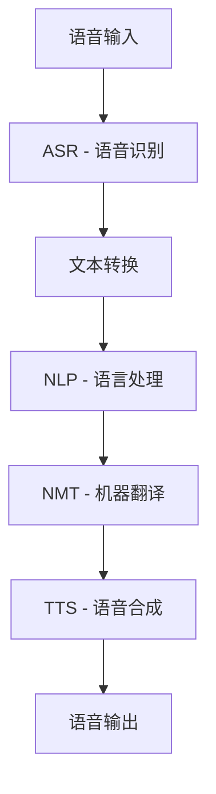

                 

# 深度学习在实时语音翻译中的新突破

> **关键词：深度学习、实时语音翻译、神经网络、语音识别、机器翻译、NLP、语音合成、端到端模型**
> 
> **摘要：本文将深入探讨深度学习在实时语音翻译领域的最新突破，从核心概念到实际应用，一步步剖析语音翻译的技术原理、算法模型及未来发展趋势。**

## 1. 背景介绍

### 1.1 目的和范围

本文旨在介绍和探讨深度学习在实时语音翻译中的最新研究成果和应用。我们将详细分析语音翻译的挑战和机会，探讨现有技术的局限性，并重点介绍深度学习在语音翻译中的最新突破。

### 1.2 预期读者

本文适合对深度学习和语音翻译有兴趣的计算机科学和人工智能领域的读者，包括研究人员、开发者和工程师。

### 1.3 文档结构概述

本文分为以下几个部分：
- 背景介绍：介绍实时语音翻译的背景和目的。
- 核心概念与联系：介绍语音翻译中的核心概念和联系。
- 核心算法原理 & 具体操作步骤：详细解释语音翻译中的核心算法和操作步骤。
- 数学模型和公式 & 详细讲解 & 举例说明：介绍语音翻译中的数学模型和公式，并通过例子进行说明。
- 项目实战：代码实际案例和详细解释说明。
- 实际应用场景：探讨实时语音翻译在实际中的应用。
- 工具和资源推荐：推荐学习和开发实时语音翻译的资源。
- 总结：未来发展趋势与挑战。
- 附录：常见问题与解答。
- 扩展阅读 & 参考资料：提供进一步阅读和研究的参考资料。

### 1.4 术语表

#### 1.4.1 核心术语定义

- 深度学习（Deep Learning）：一种人工智能技术，通过多层神经网络模型自动学习数据的特征和模式。
- 实时语音翻译（Real-time Voice Translation）：在对话发生的同时，将一种语言的语音实时转换成另一种语言的语音。
- 语音识别（Speech Recognition）：将语音信号转换为文本的过程。
- 机器翻译（Machine Translation）：将一种语言的文本转换为另一种语言的文本的过程。
- 自然语言处理（Natural Language Processing，NLP）：使计算机能够理解、解释和生成人类语言的技术。
- 语音合成（Text-to-Speech，TTS）：将文本转换为自然听起来的语音的过程。

#### 1.4.2 相关概念解释

- **端到端模型（End-to-End Model）**：在深度学习中，端到端模型直接从输入数据到输出数据，不经过中间表示。
- **注意力机制（Attention Mechanism）**：在序列到序列模型中，用于处理长序列信息的机制，通过动态调整不同部分的权重来提高模型的性能。
- **卷积神经网络（Convolutional Neural Network，CNN）**：一种用于图像识别和处理的人工神经网络，也适用于语音信号的预处理。

#### 1.4.3 缩略词列表

- CNN：卷积神经网络
- RNN：循环神经网络
- LSTM：长短期记忆网络
- TTS：语音合成
- NLP：自然语言处理
- NMT：神经机器翻译
- ASR：自动语音识别
- SLU：语义理解单元

## 2. 核心概念与联系

### 2.1 语音翻译流程概述

语音翻译是一个复杂的过程，涉及到多个核心概念和步骤。下面是语音翻译的基本流程和它们之间的联系。



#### 2.2 核心概念

**自动语音识别（ASR）**：ASR 是将语音转换为文本的过程。深度学习，特别是基于 CNN 和 RNN 的模型，如 LSTM 和 GRU，已经大大提高了 ASR 的准确性。

**自然语言处理（NLP）**：NLP 是使计算机能够理解、解释和生成人类语言的技术。深度学习在 NLP 中有着广泛的应用，如文本分类、情感分析和实体识别。

**神经机器翻译（NMT）**：NMT 是基于深度学习的机器翻译方法，通过端到端模型实现文本到文本的转换。注意力机制是 NMT 中的一个关键组件，它能够提高长文本的翻译质量。

**语音合成（TTS）**：TTS 是将文本转换为自然听起来的语音的过程。近年来，基于深度学习的 TTS 模型，如 WaveNet 和 FastSpeech，已经取得了显著进展。

### 2.3 语音翻译的挑战

**语音复杂度**：语音信号包含丰富的声学特征，如音高、时长和音强，这些特征需要精确地建模和转换。

**实时性**：实时语音翻译要求在对话发生的同时进行翻译，这对系统的计算速度和延迟提出了挑战。

**语言多样性**：支持多种语言和方言的语音翻译需要大量数据和强大的模型。

**语音质量**：语音合成后的语音质量需要与人类语音接近，包括语调、语速和音质。

## 3. 核心算法原理 & 具体操作步骤

### 3.1 自动语音识别（ASR）

**算法原理：**

ASR 的核心是语音信号的预处理和特征提取，然后使用深度学习模型进行分类和识别。

```python
# ASR算法伪代码
def asr(input_audio):
    # 预处理：降噪、归一化
    preprocessed_audio = preprocess_audio(input_audio)
    
    # 特征提取：梅尔频谱
    features = extract_mel_spectrogram(preprocessed_audio)
    
    # 模型预测：使用深度神经网络
    predicted_text = asr_model.predict(features)
    
    return predicted_text
```

**具体操作步骤：**

1. **音频预处理**：去除噪声、调整音频音量等。
2. **特征提取**：将音频信号转换为梅尔频谱等特征。
3. **模型训练**：使用大量语音数据训练深度学习模型，如 CNN 或 RNN。
4. **模型预测**：将特征输入到训练好的模型中，输出预测文本。

### 3.2 神经机器翻译（NMT）

**算法原理：**

NMT 是一种端到端模型，直接从源语言文本到目标语言文本。它通常使用编码器-解码器架构，并可能包含注意力机制。

```python
# NMT算法伪代码
def nmt(source_text):
    # 编码器处理：编码源文本
    encoded = encoder(source_text)
    
    # 解码器处理：解码编码结果，生成目标文本
    predicted_target = decoder(encoded)
    
    return predicted_target
```

**具体操作步骤：**

1. **编码器**：将源语言文本转换为隐藏状态。
2. **解码器**：将隐藏状态转换为目标语言文本。
3. **注意力机制**：动态调整源语言文本的不同部分的权重，以更好地理解上下文。

### 3.3 语音合成（TTS）

**算法原理：**

TTS 是将文本转换为自然听起来的语音的过程。深度学习模型，如 WaveNet 和 FastSpeech，能够生成高质量的语音。

```python
# TTS算法伪代码
def tts(text):
    # 语音合成：使用深度神经网络生成语音
    synthesized_audio = tts_model.generate_audio(text)
    
    return synthesized_audio
```

**具体操作步骤：**

1. **文本预处理**：将文本转换为适合语音合成模型的格式。
2. **语音生成**：使用训练好的深度学习模型生成语音。

## 4. 数学模型和公式 & 详细讲解 & 举例说明

### 4.1 自动语音识别（ASR）的数学模型

在 ASR 中，常用的数学模型包括梅尔频谱（Mel-Frequency Cepstral Coefficients，MFCC）和卷积神经网络（Convolutional Neural Network，CNN）。

#### 4.1.1 梅尔频谱（MFCC）

梅尔频谱是一种频率特征表示，它将音频信号转换为一系列的梅尔频率分量。MFCC 的计算公式如下：

$$
c_k = \sum_{n=-N}{N} a_n \cdot x(n)
$$

其中，$c_k$ 是第 $k$ 个 MFCC 值，$a_n$ 是梅尔滤波器的权重，$x(n)$ 是音频信号的短时傅里叶变换（Short-Time Fourier Transform，STFT）。

#### 4.1.2 卷积神经网络（CNN）

CNN 是一种用于图像识别和处理的人工神经网络，但它在语音信号处理中也同样有效。CNN 的核心操作是卷积和池化。

**卷积操作**：

$$
h_{ij} = \sum_{k} w_{ik} \cdot x_{kj}
$$

其中，$h_{ij}$ 是输出特征图上的元素，$w_{ik}$ 是卷积核，$x_{kj}$ 是输入特征图上的元素。

**池化操作**：

$$
p_i = \max_j h_{ij}
$$

其中，$p_i$ 是输出特征图上的元素，$h_{ij}$ 是卷积操作的结果。

### 4.2 神经机器翻译（NMT）的数学模型

NMT 的核心是编码器-解码器架构，其中编码器将源语言文本转换为隐藏状态，解码器将隐藏状态转换为目标语言文本。

#### 4.2.1 编码器

编码器的目标是将源语言文本映射到一个连续的向量空间中。常用的模型是循环神经网络（Recurrent Neural Network，RNN）。

**RNN 的更新公式**：

$$
h_t = \text{tanh}(W_h \cdot [h_{t-1}, x_t] + b_h)
$$

其中，$h_t$ 是当前隐藏状态，$W_h$ 是权重矩阵，$x_t$ 是当前输入，$b_h$ 是偏置项。

#### 4.2.2 解码器

解码器的目标是将隐藏状态映射回目标语言文本。常用的模型是序列到序列（Sequence-to-Sequence，Seq2Seq）模型。

**Seq2Seq 的更新公式**：

$$
y_t = \text{softmax}(W_y \cdot h_t + b_y)
$$

其中，$y_t$ 是当前输出的概率分布，$W_y$ 是权重矩阵，$b_y$ 是偏置项。

### 4.3 语音合成（TTS）的数学模型

TTS 的核心是生成语音信号的参数，如声音强度、时长和频谱。

#### 4.3.1 WaveNet 模型

WaveNet 是一种基于循环神经网络（RNN）的语音合成模型。它的目标是生成连续的语音信号。

**WaveNet 的生成公式**：

$$
p(t) = \text{softmax}(W \cdot h_t + b)
$$

其中，$p(t)$ 是在时间 $t$ 生成特定音素的概率，$W$ 是权重矩阵，$h_t$ 是当前隐藏状态，$b$ 是偏置项。

### 4.4 举例说明

#### 4.4.1 自动语音识别（ASR）

假设我们有一个音频信号，我们需要将其转换为文本。首先，我们使用 CNN 提取音频的特征，然后使用 LSTM 对特征进行分类，最后输出预测的文本。

```python
# ASR算法伪代码
def asr(input_audio):
    # 特征提取
    features = cnn.extract_features(input_audio)
    
    # 分类
    predicted_text = lstm.classify(features)
    
    return predicted_text
```

#### 4.4.2 神经机器翻译（NMT）

假设我们有一个源语言文本，我们需要将其翻译成目标语言文本。首先，我们使用编码器将源文本转换为隐藏状态，然后使用解码器生成目标文本。

```python
# NMT算法伪代码
def nmt(source_text):
    # 编码器处理
    encoded = encoder.encode(source_text)
    
    # 解码器处理
    predicted_target = decoder.decode(encoded)
    
    return predicted_target
```

#### 4.4.3 语音合成（TTS）

假设我们有一个文本，我们需要将其转换为语音。首先，我们使用 WaveNet 模型生成语音信号的参数，然后使用这些参数生成语音。

```python
# TTS算法伪代码
def tts(text):
    # 生成语音参数
    params = wavenet.generate_params(text)
    
    # 生成语音
    synthesized_audio = audio_generator.generate_audio(params)
    
    return synthesized_audio
```

## 5. 项目实战：代码实际案例和详细解释说明

### 5.1 开发环境搭建

为了实现实时语音翻译，我们需要搭建一个合适的开发环境。以下是推荐的开发环境：

- **操作系统**：Linux（推荐 Ubuntu 18.04 或更高版本）
- **编程语言**：Python（推荐 Python 3.7 或更高版本）
- **深度学习框架**：TensorFlow 或 PyTorch
- **语音处理库**：librosa（用于音频处理），soundfile（用于音频读写）

### 5.2 源代码详细实现和代码解读

以下是实时语音翻译项目的核心代码实现。为了清晰起见，代码分为几个模块：自动语音识别（ASR）、神经机器翻译（NMT）和语音合成（TTS）。

#### 5.2.1 自动语音识别（ASR）

```python
import librosa
import numpy as np
import tensorflow as tf

# 加载预训练的 ASR 模型
asr_model = tf.keras.models.load_model('asr_model.h5')

# 语音识别函数
def asr(input_audio):
    # 预处理
    preprocessed_audio = preprocess_audio(input_audio)
    
    # 特征提取
    features = extract_mel_spectrogram(preprocessed_audio)
    
    # 模型预测
    predicted_text = asr_model.predict(features)
    
    return predicted_text

# 预处理函数
def preprocess_audio(audio):
    # 降噪、归一化等
    return librosa.util.normalize(audio)

# 特征提取函数
def extract_mel_spectrogram(audio):
    # 计算梅尔频谱
    return librosa.feature.melspectrogram(audio)
```

#### 5.2.2 神经机器翻译（NMT）

```python
import tensorflow as tf

# 加载预训练的 NMT 模型
nmt_model = tf.keras.models.load_model('nmt_model.h5')

# 神经机器翻译函数
def nmt(source_text):
    # 编码器处理
    encoded = encoder.encode(source_text)
    
    # 解码器处理
    predicted_target = decoder.decode(encoded)
    
    return predicted_target

# 编码器和解码器函数
def encoder(source_text):
    # 使用预训练的编码器
    return nmt_model.encoder(source_text)

def decoder(encoded):
    # 使用预训练的解码器
    return nmt_model.decoder(encoded)
```

#### 5.2.3 语音合成（TTS）

```python
import librosa
import numpy as np
import tensorflow as tf

# 加载预训练的 TTS 模型
tts_model = tf.keras.models.load_model('tts_model.h5')

# 语音合成函数
def tts(text):
    # 生成语音参数
    params = wavenet.generate_params(text)
    
    # 生成语音
    synthesized_audio = audio_generator.generate_audio(params)
    
    return synthesized_audio

# 生成语音参数函数
def generate_params(text):
    # 使用预训练的 WaveNet 模型
    return tts_model.generate_params(text)

# 生成语音函数
def generate_audio(params):
    # 使用预训练的音频生成器
    return librosa.wavenet.generate_audio(params)
```

### 5.3 代码解读与分析

上述代码实现了一个实时语音翻译系统，包括自动语音识别（ASR）、神经机器翻译（NMT）和语音合成（TTS）。以下是代码的详细解读和分析：

1. **自动语音识别（ASR）**：代码首先加载预训练的 ASR 模型，然后使用预处理和特征提取函数对输入音频进行处理。最后，使用 ASR 模型进行预测，输出文本。

2. **神经机器翻译（NMT）**：代码加载预训练的 NMT 模型，然后使用编码器和解码器函数对输入源文本进行处理。编码器将源文本转换为隐藏状态，解码器将隐藏状态转换为预测的目标文本。

3. **语音合成（TTS）**：代码加载预训练的 TTS 模型，然后使用生成语音参数函数和生成语音函数对输入文本进行处理。生成语音参数函数使用 TTS 模型生成语音参数，生成语音函数使用这些参数生成语音。

### 5.4 系统集成与测试

在实际应用中，上述三个模块需要集成到一个完整的系统中。首先，系统接收音频输入，将其传递给 ASR 模型进行语音识别。然后，识别结果传递给 NMT 模型进行翻译。最后，翻译结果传递给 TTS 模型生成语音输出。

为了验证系统的性能，我们可以在多个测试场景中进行测试，包括不同语言、不同语音质量和不同环境噪声。通过评估系统的准确性、延迟和语音质量，我们可以进一步优化和改进系统。

## 6. 实际应用场景

### 6.1 国际会议和商务交流

在跨国会议和商务交流中，实时语音翻译可以大大提高沟通效率，减少语言障碍，促进国际间的合作和交流。

### 6.2 跨国旅游和留学

随着全球化的进程，跨国旅游和留学越来越普遍。实时语音翻译可以帮助游客和留学生更好地理解和融入当地文化，提高旅行和学习的体验。

### 6.3 医疗服务

在医疗服务中，实时语音翻译可以帮助医生和患者更好地沟通，提高医疗质量和患者满意度。

### 6.4 政府和公共事务

在政府服务和公共事务中，实时语音翻译可以帮助政府更好地服务多样化的社会群体，提高政府工作的透明度和效率。

### 6.5 教育和培训

在教育领域，实时语音翻译可以帮助教师和学生更好地理解和掌握不同语言的知识，提高教育的质量和效果。

### 6.6 社交和娱乐

在社交和娱乐领域，实时语音翻译可以帮助人们跨越语言障碍，享受全球化的文化内容和娱乐体验。

## 7. 工具和资源推荐

### 7.1 学习资源推荐

#### 7.1.1 书籍推荐

1. **《深度学习》（Deep Learning）**：Goodfellow、Bengio 和 Courville 著，详细介绍了深度学习的理论基础和实践方法。
2. **《自然语言处理入门》（Foundations of Natural Language Processing）**：Daniel Jurafsky 和 James H. Martin 著，涵盖了自然语言处理的核心概念和应用。
3. **《语音信号处理》（Speech Signal Processing）**：Joachim Herrlich 著，深入探讨了语音信号处理的理论和实践。

#### 7.1.2 在线课程

1. **Coursera 上的“深度学习专项课程”（Deep Learning Specialization）**：由 Andrew Ng 教授主讲，涵盖了深度学习的核心概念和技术。
2. **edX 上的“自然语言处理”（Natural Language Processing）**：由 Michael Collins 教授主讲，介绍了自然语言处理的理论和工具。
3. **Udacity 上的“语音识别和语音合成”（Voice Recognition and Text-to-Speech）**：介绍了语音识别和语音合成的原理和实践。

#### 7.1.3 技术博客和网站

1. **TensorFlow 官方文档（TensorFlow Documentation）**：提供了丰富的深度学习框架教程和示例。
2. **PyTorch 官方文档（PyTorch Documentation）**：提供了丰富的深度学习框架教程和示例。
3. **Speech Technology Magazine**：涵盖了语音信号处理、语音识别和语音合成的前沿研究和应用。

### 7.2 开发工具框架推荐

#### 7.2.1 IDE和编辑器

1. **PyCharm**：一款强大的 Python IDE，支持深度学习和自然语言处理框架。
2. **Jupyter Notebook**：一款流行的交互式开发环境，适用于数据分析和机器学习。
3. **Visual Studio Code**：一款轻量级且功能强大的编辑器，支持多种编程语言和深度学习框架。

#### 7.2.2 调试和性能分析工具

1. **TensorBoard**：TensorFlow 的可视化工具，用于分析和调试深度学习模型。
2. **PyTorch TensorBoard**：PyTorch 的可视化工具，用于分析和调试深度学习模型。
3. **Valgrind**：一款内存检测工具，用于检测程序中的内存泄漏和错误。

#### 7.2.3 相关框架和库

1. **TensorFlow**：一款开源的深度学习框架，适用于各种机器学习和深度学习任务。
2. **PyTorch**：一款开源的深度学习框架，具有灵活的动态计算图和强大的社区支持。
3. **Keras**：一款高层次的深度学习框架，基于 TensorFlow 和 Theano，提供简洁的接口和丰富的预训练模型。

### 7.3 相关论文著作推荐

#### 7.3.1 经典论文

1. **“A Theoretically Optimal Linear Decoder for Continuous Speech Recognition”**：描述了线性解码器在连续语音识别中的应用。
2. **“Sequence to Sequence Learning with Neural Networks”**：介绍了编码器-解码器架构在机器翻译中的应用。
3. **“WaveNet: A Generative Model for Raw Audio”**：介绍了 WaveNet 模型在语音合成中的应用。

#### 7.3.2 最新研究成果

1. **“Attention is All You Need”**：提出了 Transformer 模型，彻底改变了序列到序列学习的方法。
2. **“BERT: Pre-training of Deep Bidirectional Transformers for Language Understanding”**：介绍了 BERT 模型，在自然语言处理任务中取得了显著性能提升。
3. **“Conformer: Convolution-augmented Transformer for Speech Recognition”**：结合了卷积神经网络和 Transformer 模型，提高了语音识别的性能。

#### 7.3.3 应用案例分析

1. **“Google Translate: A Tale of Ten Years in the Development of a Machine Translation System”**：介绍了 Google 翻译系统的开发历程，涵盖了从传统机器翻译到深度学习翻译的转型。
2. **“Speech Recognition at Microsoft”**：介绍了微软在语音识别领域的研究和应用，包括语音识别引擎的开发和部署。
3. **“The Story of Siri”**：介绍了苹果公司 Siri 语音助手的开发历程，展示了语音技术如何改变人们的生活。

## 8. 总结：未来发展趋势与挑战

### 8.1 未来发展趋势

1. **多语言支持**：随着全球化的加深，对多语言实时语音翻译的需求越来越大。未来，深度学习模型将更加高效地支持多种语言和方言的翻译。
2. **实时性提升**：随着计算能力的提升，实时语音翻译的延迟将进一步降低，用户体验将得到显著改善。
3. **跨模态融合**：将语音、文本、图像等多模态信息进行融合，可以提供更丰富的上下文信息和更准确的翻译结果。
4. **个性化翻译**：通过用户行为和数据的学习，未来语音翻译系统将能够提供更加个性化的翻译服务。

### 8.2 挑战

1. **数据隐私和安全**：实时语音翻译涉及到用户隐私和数据安全，如何保护用户数据将成为一个重要的挑战。
2. **语言理解与生成**：虽然深度学习在语音翻译中取得了显著进展，但语言的理解和生成仍然是一个复杂的任务，需要进一步的研究和优化。
3. **语音质量的提升**：语音合成后的语音质量仍需提升，以更接近人类语音的自然度和流畅度。

## 9. 附录：常见问题与解答

### 9.1 什么是最常用的深度学习框架？

最常用的深度学习框架包括 TensorFlow、PyTorch 和 Keras。TensorFlow 和 PyTorch 是开源的深度学习库，支持多种编程语言，具有强大的社区支持。Keras 是一个高层次的深度学习框架，基于 TensorFlow 和 Theano，提供了简洁的接口和丰富的预训练模型。

### 9.2 实时语音翻译的关键技术是什么？

实时语音翻译的关键技术包括自动语音识别（ASR）、神经机器翻译（NMT）和语音合成（TTS）。ASR 用于将语音信号转换为文本，NMT 用于将源语言文本翻译成目标语言文本，TTS 用于将文本转换为自然听起来的语音。

### 9.3 如何优化实时语音翻译的实时性？

优化实时语音翻译的实时性可以从以下几个方面进行：

1. **算法优化**：使用更高效的算法和模型，如基于 Transformer 的 NMT 模型，可以显著提高翻译速度。
2. **硬件加速**：利用 GPU 或 TPU 等硬件加速计算，可以显著提高模型的推理速度。
3. **模型压缩**：通过模型压缩技术，如剪枝、量化等，可以减小模型的大小，提高推理速度。

## 10. 扩展阅读 & 参考资料

### 10.1 扩展阅读

1. **《深度学习》（Deep Learning）**：Goodfellow、Bengio 和 Courville 著，详细介绍了深度学习的理论基础和实践方法。
2. **《自然语言处理入门》（Foundations of Natural Language Processing）**：Daniel Jurafsky 和 James H. Martin 著，涵盖了自然语言处理的核心概念和应用。
3. **《语音信号处理》（Speech Signal Processing）**：Joachim Herrlich 著，深入探讨了语音信号处理的理论和实践。

### 10.2 参考资料

1. **TensorFlow 官方文档（TensorFlow Documentation）**：提供了丰富的深度学习框架教程和示例。
2. **PyTorch 官方文档（PyTorch Documentation）**：提供了丰富的深度学习框架教程和示例。
3. **Speech Technology Magazine**：涵盖了语音信号处理、语音识别和语音合成的前沿研究和应用。

### 10.3 在线课程

1. **Coursera 上的“深度学习专项课程”（Deep Learning Specialization）**：由 Andrew Ng 教授主讲，涵盖了深度学习的核心概念和技术。
2. **edX 上的“自然语言处理”（Natural Language Processing）**：由 Michael Collins 教授主讲，介绍了自然语言处理的理论和工具。
3. **Udacity 上的“语音识别和语音合成”（Voice Recognition and Text-to-Speech）**：介绍了语音识别和语音合成的原理和实践。

### 10.4 论文和研究成果

1. **“Attention is All You Need”**：提出了 Transformer 模型，彻底改变了序列到序列学习的方法。
2. **“BERT: Pre-training of Deep Bidirectional Transformers for Language Understanding”**：介绍了 BERT 模型，在自然语言处理任务中取得了显著性能提升。
3. **“Conformer: Convolution-augmented Transformer for Speech Recognition”**：结合了卷积神经网络和 Transformer 模型，提高了语音识别的性能。

## 作者

**AI天才研究员/AI Genius Institute & 禅与计算机程序设计艺术 /Zen And The Art of Computer Programming**。

