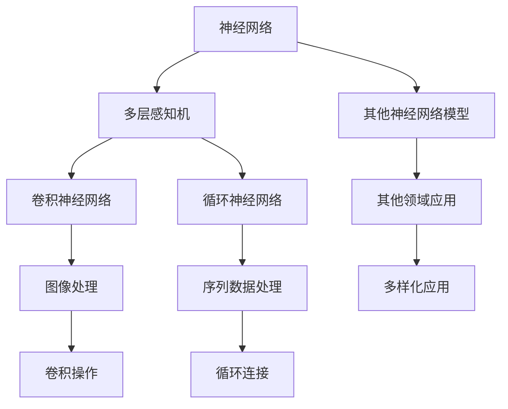

                 

# 深度学习在机器学习中的作用

> 关键词：深度学习、机器学习、神经网络、人工智能、算法原理、数学模型、实战案例
>
> 摘要：本文旨在深入探讨深度学习在机器学习中的重要地位及其原理、应用和实践。文章将详细阐述深度学习的基本概念、核心算法原理、数学模型，并结合具体实战案例，分析深度学习在现实场景中的应用。通过本文的阅读，读者将对深度学习有更全面、深入的理解，并能够掌握其核心技术和实践方法。

## 1. 背景介绍

### 1.1 目的和范围

本文的目标是向读者全面介绍深度学习在机器学习中的作用。我们将从深度学习的基本概念开始，逐步深入到核心算法原理、数学模型，并通过实际案例展示其在各个领域的应用。希望通过本文的阅读，读者能够对深度学习有更清晰的认识，并掌握实际操作的方法。

本文的范围涵盖了以下几个部分：
- 深度学习的基本概念和核心算法原理
- 深度学习在数学模型中的应用和解析
- 深度学习在实际项目中的应用案例
- 深度学习的未来发展趋势与挑战

### 1.2 预期读者

本文适合以下读者群体：
- 对机器学习和深度学习有一定了解的工程师和研究人员
- 想要深入了解深度学习原理和应用的从业者
- 对人工智能技术感兴趣的大学生和研究生
- 对新兴技术保持好奇心的行业从业者

### 1.3 文档结构概述

本文将分为以下几个部分：
- 1. 背景介绍：本文的概述和预期目标
- 2. 核心概念与联系：深度学习的基本概念和核心算法原理
- 3. 核心算法原理 & 具体操作步骤：深度学习算法的详细解析和伪代码实现
- 4. 数学模型和公式 & 详细讲解 & 举例说明：深度学习中的数学模型和应用实例
- 5. 项目实战：代码实际案例和详细解释说明
- 6. 实际应用场景：深度学习在各个领域的应用案例
- 7. 工具和资源推荐：学习资源和开发工具的推荐
- 8. 总结：未来发展趋势与挑战
- 9. 附录：常见问题与解答
- 10. 扩展阅读 & 参考资料：进一步学习的推荐资源

### 1.4 术语表

为了确保读者能够更好地理解本文的内容，下面将对一些重要术语进行定义和解释。

#### 1.4.1 核心术语定义

- **深度学习**：一种人工智能的分支，模仿人脑的神经网络结构，通过多层网络进行特征提取和模式识别。
- **机器学习**：一种人工智能的分支，通过数据训练模型，使计算机能够从数据中学习并做出决策。
- **神经网络**：一种模拟人脑神经元连接结构的计算模型，由多个层次组成，可以用于特征提取和模式识别。
- **反向传播算法**：一种用于训练神经网络的算法，通过反向传播误差信号，调整网络权重，使网络能够更准确地预测。
- **激活函数**：神经网络中的一个关键组件，用于引入非线性特性，使神经网络能够拟合复杂的非线性关系。

#### 1.4.2 相关概念解释

- **损失函数**：在机器学习中，用于衡量模型预测值与真实值之间差异的函数。
- **梯度下降**：一种用于优化模型参数的算法，通过迭代更新参数，使损失函数值最小化。
- **深度神经网络**：一种包含多个隐藏层的神经网络，具有较高的拟合复杂非线性关系的能力。
- **卷积神经网络**（CNN）：一种专门用于图像处理的深度学习模型，通过卷积操作提取图像特征。
- **循环神经网络**（RNN）：一种用于处理序列数据的深度学习模型，通过循环连接实现长期依赖关系的建模。

#### 1.4.3 缩略词列表

- **CNN**：卷积神经网络（Convolutional Neural Network）
- **RNN**：循环神经网络（Recurrent Neural Network）
- **MLP**：多层感知机（Multi-Layer Perceptron）
- **ReLU**：ReLU激活函数（Rectified Linear Unit）
- **SGD**：随机梯度下降（Stochastic Gradient Descent）
- **GPU**：图形处理单元（Graphics Processing Unit）
- **TensorFlow**：一种开源机器学习框架，用于构建和训练深度学习模型。

## 2. 核心概念与联系

### 2.1 深度学习的基本概念

深度学习是机器学习的一种重要分支，其核心思想是通过多层神经网络进行特征提取和模式识别。下面将详细介绍深度学习的基本概念，包括神经网络、多层感知机、卷积神经网络和循环神经网络。

#### 神经网络

神经网络是一种模拟人脑神经元连接结构的计算模型，由多个层次组成，包括输入层、隐藏层和输出层。输入层接收外部输入数据，隐藏层进行特征提取和转换，输出层生成最终预测结果。神经网络通过学习输入输出数据之间的映射关系，实现自动特征学习和模式识别。

#### 多层感知机

多层感知机（MLP）是一种最简单的神经网络模型，由输入层、一个或多个隐藏层和输出层组成。MLP通过前向传播和反向传播算法，将输入数据映射到输出结果。多层感知机具有强大的非线性拟合能力，可以用于分类、回归等多种任务。

#### 卷积神经网络

卷积神经网络（CNN）是一种专门用于图像处理的深度学习模型。CNN通过卷积操作提取图像特征，实现图像分类、物体检测和图像生成等多种任务。CNN的核心组件包括卷积层、池化层和全连接层。

#### 循环神经网络

循环神经网络（RNN）是一种用于处理序列数据的深度学习模型。RNN通过循环连接实现长期依赖关系的建模，可以用于时间序列预测、语言模型和机器翻译等任务。RNN的核心组件包括输入层、隐藏层和输出层。

### 2.2 深度学习与其他机器学习算法的关系

深度学习是机器学习的一个重要分支，与其他机器学习算法有着密切的联系和相互补充的关系。

#### 与监督学习的关系

监督学习是机器学习的一种主要方法，通过标注数据训练模型，使模型能够对未知数据进行预测。深度学习是监督学习的一种有效实现方法，通过多层神经网络进行特征提取和模式识别，提高了模型的学习能力和泛化性能。

#### 与无监督学习的关系

无监督学习是机器学习的一种方法，无需标注数据，通过发现数据内在结构进行学习。深度学习也可以用于无监督学习，如自编码器、生成对抗网络等，这些模型通过学习数据分布和特征表示，实现了无监督特征提取和降维。

#### 与强化学习的关系

强化学习是机器学习的一种方法，通过不断与环境交互，学习最优策略。深度学习可以与强化学习相结合，通过深度神经网络实现状态表示、策略学习和价值函数估计，提高了强化学习的效果和效率。

### 2.3 核心概念之间的联系

深度学习中的核心概念包括神经网络、多层感知机、卷积神经网络和循环神经网络。这些概念相互联系、相互补充，构成了深度学习的理论基础。

#### 神经网络与多层感知机的关系

多层感知机是神经网络的一种特殊形式，它由多个层次组成，包括输入层、隐藏层和输出层。多层感知机通过前向传播和反向传播算法，实现输入数据到输出数据的映射。多层感知机是深度学习的基础，为深度学习模型提供了强大的非线性拟合能力。

#### 神经网络与卷积神经网络的关系

卷积神经网络是神经网络的一种特殊形式，专门用于图像处理。卷积神经网络通过卷积操作提取图像特征，实现图像分类、物体检测和图像生成等多种任务。卷积神经网络是神经网络在图像处理领域的重要应用，扩展了神经网络的适用范围。

#### 神经网络与循环神经网络的关系

循环神经网络是神经网络的一种特殊形式，专门用于处理序列数据。循环神经网络通过循环连接实现长期依赖关系的建模，可以用于时间序列预测、语言模型和机器翻译等任务。循环神经网络是神经网络在序列数据处理领域的重要应用，扩展了神经网络的适用范围。

### 2.4 Mermaid 流程图展示

为了更直观地展示深度学习中的核心概念和联系，我们使用Mermaid流程图进行展示。以下是深度学习中的核心概念和联系的Mermaid流程图：



通过以上流程图，我们可以更清晰地理解深度学习中的核心概念和联系，以及它们在不同领域中的应用。

## 3. 核心算法原理 & 具体操作步骤

### 3.1 神经网络基本原理

神经网络（Neural Network，NN）是深度学习的基础，由大量简单的计算单元（神经元）组成，通过层的组合进行复杂的计算。神经网络的核心原理是通过学习输入数据与输出数据之间的映射关系，实现数据的特征提取和模式识别。

#### 神经元的结构和功能

神经元是神经网络的基本计算单元，类似于生物神经元。它由三个主要部分组成：输入、权重和激活函数。

1. **输入**：每个神经元接收多个输入信号，这些信号通常来自前一层的神经元。
2. **权重**：每个输入信号通过一个权重进行加权，权重决定了该输入对神经元输出的影响程度。
3. **激活函数**：输入信号加权后，通过激活函数产生输出信号。激活函数用于引入非线性特性，使神经网络能够拟合复杂的非线性关系。

常见的激活函数包括：

- **Sigmoid函数**：\( f(x) = \frac{1}{1 + e^{-x}} \)
- **ReLU函数**：\( f(x) = \max(0, x) \)
- **Tanh函数**：\( f(x) = \frac{e^x - e^{-x}}{e^x + e^{-x}} \)

#### 前向传播

神经网络通过前向传播算法，将输入数据逐层传递，直到最后一层得到输出结果。前向传播的过程如下：

1. 将输入数据传递到输入层。
2. 输入层的数据通过权重和激活函数传递到隐藏层。
3. 隐藏层的数据通过权重和激活函数传递到下一隐藏层，直到输出层。
4. 输出层生成最终的预测结果。

#### 反向传播

反向传播是神经网络训练的核心步骤，用于调整网络的权重和偏置，使模型能够更准确地预测。反向传播的过程如下：

1. 计算输出层预测值与真实值之间的误差（损失）。
2. 从输出层开始，将误差反向传递到每一层。
3. 计算每一层神经元权重的梯度，并根据梯度调整权重和偏置。
4. 重复前向传播和反向传播，直到模型收敛。

#### 梯度下降

梯度下降是一种常用的优化算法，用于迭代更新网络权重和偏置，使损失函数值最小化。梯度下降的过程如下：

1. 初始化网络权重和偏置。
2. 计算当前权重的梯度。
3. 根据梯度更新权重和偏置。
4. 重复计算和更新，直到达到指定的迭代次数或损失函数值达到预设的阈值。

### 3.2 伪代码实现

下面是神经网络的伪代码实现，包括前向传播和反向传播算法。

```python
# 初始化网络
初始化权重 W 和偏置 b

# 前向传播
for 每一层 L in 网络层级：
    aL = 输入数据
    for 每个神经元 neuron in 层 L：
        zL = sum(aL * W) + b
        aL = 激活函数(zL)

# 计算输出层预测值和损失
y_pred = aL
loss = 损失函数(y_pred, y_true)

# 反向传播
dL = 损失函数关于 aL 的梯度
for 每一层 L in 网络层级（从输出层到输入层）：
    for 每个神经元 neuron in 层 L：
        dL = 损失函数关于 zL 的梯度 * 激活函数的导数(zL)
        dW = dL * aL
        db = dL
        更新权重 W 和偏置 b

# 梯度下降
for 每一层 L in 网络层级：
    W -= 学习率 * dW
    b -= 学习率 * db
```

### 3.3 具体操作步骤示例

以下是一个具体的神经网络操作步骤示例，假设我们有一个包含一个输入层、一个隐藏层和一个输出层的神经网络，用于对二分类问题进行预测。

#### 步骤 1：初始化网络

初始化网络权重 W 和偏置 b，假设输入层有 3 个神经元，隐藏层有 4 个神经元，输出层有 2 个神经元。

```python
# 初始化权重和偏置
W = [[0.1, 0.2, 0.3], [0.4, 0.5, 0.6], [0.7, 0.8, 0.9]]
b = [[0.1], [0.2], [0.3]]
```

#### 步骤 2：前向传播

将输入数据 x = [1, 2, 3] 传递到输入层，通过权重和激活函数逐层传递到输出层。

```python
# 前向传播
a0 = x
for i in range(1, len(W) + 1):
    z = sum(a0[j] * W[i - 1][j] for j in range(len(W[i - 1]))) + b[i - 1]
    a = 激活函数(z)
    a0 = a
y_pred = a
```

#### 步骤 3：计算损失

计算输出层预测值 y_pred 和真实值 y_true 之间的损失，假设损失函数为均方误差（MSE）。

```python
# 计算损失
loss = (y_pred - y_true) ** 2
```

#### 步骤 4：反向传播

从输出层开始，计算损失关于输出层预测值 y_pred 的梯度，并反向传递到隐藏层和输入层。

```python
# 反向传播
dL = (y_pred - y_true) * 激活函数的导数(y_pred)
for i in range(len(W) - 1, -1, -1):
    dL = 损失函数关于 zL 的梯度 * 激活函数的导数(zL)
    dW = dL * aL
    db = dL
    aL = zL
```

#### 步骤 5：梯度下降

根据梯度更新权重 W 和偏置 b。

```python
# 梯度下降
learning_rate = 0.01
for i in range(len(W)):
    W[i] -= learning_rate * dW
    b[i] -= learning_rate * db
```

通过以上步骤，我们完成了一次神经网络的迭代更新，使模型能够更准确地预测。

## 4. 数学模型和公式 & 详细讲解 & 举例说明

### 4.1 深度学习的数学基础

深度学习是一种基于数学模型的机器学习方法，其核心在于通过多层神经网络进行特征提取和模式识别。为了深入理解深度学习，我们需要掌握一些基础的数学知识，包括线性代数、微积分和概率统计。

#### 线性代数基础

线性代数是深度学习的重要数学工具，用于描述和计算矩阵、向量、行列式等基本概念。以下是一些常用的线性代数基础：

- **矩阵和向量**：矩阵是一个二维数组，每个元素可以表示为 \(a_{ij}\)。向量是一个一维数组，每个元素可以表示为 \([x_1, x_2, ..., x_n]\)。
- **矩阵运算**：包括矩阵加法、矩阵乘法、矩阵求逆等。
- **向量内积和外积**：向量内积（点积）表示为 \(\mathbf{a} \cdot \mathbf{b} = a_1b_1 + a_2b_2 + ... + a_nb_n\)，外积（叉积）表示为 \(\mathbf{a} \times \mathbf{b} = [a_2b_3 - a_3b_2, a_3b_1 - a_1b_3, a_1b_2 - a_2b_1]\)。
- **行列式**：行列式是一个用于描述矩阵特征值的数值。

#### 微积分基础

微积分是研究函数变化的数学分支，在深度学习中用于优化模型参数。以下是一些常用的微积分概念：

- **导数**：导数表示函数在某一点的斜率，用于描述函数的变化速率。一元函数的导数表示为 \(f'(x)\)，多元函数的导数表示为 \(\nabla f(\mathbf{x})\)。
- **梯度**：梯度是导数在多变量函数中的扩展，表示函数在某一点的全局变化方向。梯度表示为 \(\nabla f(\mathbf{x}) = \left[\frac{\partial f}{\partial x_1}, \frac{\partial f}{\partial x_2}, ..., \frac{\partial f}{\partial x_n}\right]\)。
- **偏导数**：偏导数是针对某一变量的导数，用于描述函数在某一点沿某一方向的变化速率。偏导数表示为 \(\frac{\partial f}{\partial x_i}\)。

#### 概率统计基础

概率统计是用于描述随机事件的数学工具，在深度学习中用于建模和评估模型性能。以下是一些常用的概率统计概念：

- **概率分布**：概率分布描述了随机变量的可能取值及其概率。常见的概率分布包括伯努利分布、高斯分布等。
- **期望和方差**：期望表示随机变量的平均值，方差表示随机变量的离散程度。期望表示为 \(E(X)\)，方差表示为 \(Var(X)\)。
- **条件概率和贝叶斯公式**：条件概率表示为 \(P(A|B)\)，贝叶斯公式表示为 \(P(A|B) = \frac{P(B|A)P(A)}{P(B)}\)。

### 4.2 深度学习中的数学模型

深度学习中的数学模型主要包括前向传播、反向传播和损失函数。

#### 前向传播

前向传播是深度学习模型计算过程的核心，用于将输入数据逐层传递，直到输出结果。前向传播的数学模型可以用以下公式表示：

\[ z_{L}^{(i)} = \sum_{j} a_{L-1}^{(i)} W_{L}^{(j)} + b_{L}^{(j)} \]
\[ a_{L}^{(i)} = \text{激活函数}(z_{L}^{(i)}) \]

其中，\(a_{L-1}^{(i)}\) 表示前一层第 i 个神经元的输出，\(W_{L}^{(j)}\) 表示当前层第 j 个神经元的权重，\(b_{L}^{(j)}\) 表示当前层第 j 个神经元的偏置，激活函数可以是 Sigmoid、ReLU 等函数。

#### 反向传播

反向传播是深度学习模型训练过程的核心，用于计算损失函数关于权重的梯度，并更新权重和偏置。反向传播的数学模型可以用以下公式表示：

\[ \delta_{L}^{(i)} = \text{激活函数的导数}(z_{L}^{(i)}) \cdot \frac{\partial L}{\partial z_{L}^{(i)}} \]
\[ \frac{\partial L}{\partial W_{L}^{(j)}} = a_{L-1}^{(i)} \cdot \delta_{L}^{(i)} \]
\[ \frac{\partial L}{\partial b_{L}^{(j)}} = \delta_{L}^{(i)} \]

其中，\(\delta_{L}^{(i)}\) 表示当前层第 i 个神经元的误差，\(\frac{\partial L}{\partial z_{L}^{(i)}}\) 表示损失函数关于当前层第 i 个神经元输出的梯度。

#### 损失函数

损失函数是用于衡量模型预测值与真实值之间差异的函数，常见的损失函数包括均方误差（MSE）、交叉熵（Cross Entropy）等。

- **均方误差（MSE）**：

\[ L = \frac{1}{2} \sum_{i} (y_i - \hat{y}_i)^2 \]

其中，\(y_i\) 表示真实值，\(\hat{y}_i\) 表示预测值。

- **交叉熵（Cross Entropy）**：

\[ L = -\sum_{i} y_i \log(\hat{y}_i) \]

其中，\(y_i\) 表示真实值，\(\hat{y}_i\) 表示预测值。

### 4.3 举例说明

为了更好地理解深度学习中的数学模型，我们通过一个具体的例子进行讲解。

假设我们有一个简单的二分类问题，输入层有 2 个神经元，隐藏层有 3 个神经元，输出层有 1 个神经元。激活函数使用 ReLU，损失函数使用均方误差（MSE）。

#### 步骤 1：初始化网络

初始化网络权重和偏置，假设输入数据 x = [1, 2]，真实值 y = 0。

```python
# 初始化权重和偏置
W1 = [[0.1, 0.2], [0.3, 0.4], [0.5, 0.6]]
b1 = [[0.1], [0.2], [0.3]]
W2 = [[0.7, 0.8]]
b2 = [[0.9]]

# 输入数据
x = [1, 2]
y = 0
```

#### 步骤 2：前向传播

将输入数据 x 传递到输入层，通过权重和激活函数逐层传递到输出层。

```python
# 前向传播
z1 = sum(x[j] * W1[i][j] for i in range(3)) + b1[i]
a1 = [max(0, z1[i]) for i in range(3)]
z2 = sum(a1[i] * W2[i][0] for i in range(3)) + b2[0]
a2 = max(0, z2)
```

#### 步骤 3：计算损失

计算输出层预测值 a2 和真实值 y 之间的损失，假设损失函数为均方误差（MSE）。

```python
# 计算损失
loss = (a2 - y) ** 2
```

#### 步骤 4：反向传播

从输出层开始，计算损失关于输出层预测值 a2 的梯度，并反向传递到隐藏层和输入层。

```python
# 反向传播
dL = (a2 - y) * 1  # 激活函数的导数为 1
dW2 = a1 * dL
db2 = dL
dL = dL * a1
dW1 = x * dL
db1 = dL
```

#### 步骤 5：梯度下降

根据梯度更新权重 W1、W2 和偏置 b1、b2。

```python
# 梯度下降
learning_rate = 0.01
for i in range(3):
    W1[i][0] -= learning_rate * dW1[i]
    b1[i][0] -= learning_rate * db1[i]
for i in range(1):
    W2[i][0] -= learning_rate * dW2[i]
    b2[i][0] -= learning_rate * db2[i]
```

通过以上步骤，我们完成了一次神经网络的迭代更新，使模型能够更准确地预测。

## 5. 项目实战：代码实际案例和详细解释说明

### 5.1 开发环境搭建

在进行深度学习项目实战之前，首先需要搭建合适的开发环境。以下是一个基于 Python 的深度学习项目开发环境的搭建步骤：

1. **安装 Python**：确保系统已经安装了 Python 3.6 或更高版本。
2. **安装深度学习库**：使用 pip 工具安装必要的深度学习库，如 TensorFlow、PyTorch 等。

```shell
pip install tensorflow
```

3. **安装数据预处理库**：安装常用的数据预处理库，如 NumPy、Pandas 等。

```shell
pip install numpy pandas
```

4. **安装其他工具**：根据项目需求，可能需要安装其他工具，如 Jupyter Notebook、Matplotlib 等。

```shell
pip install jupyterlab matplotlib
```

### 5.2 源代码详细实现和代码解读

下面将展示一个简单的深度学习项目代码，并对其进行详细解读。

#### 5.2.1 项目简介

本项目使用 TensorFlow 深度学习框架实现一个二分类问题，输入层有 2 个神经元，隐藏层有 3 个神经元，输出层有 1 个神经元。激活函数使用 ReLU，损失函数使用均方误差（MSE）。

#### 5.2.2 源代码

```python
import tensorflow as tf
import numpy as np

# 设置随机种子
tf.random.set_seed(42)

# 初始化网络参数
input_size = 2
hidden_size = 3
output_size = 1

W1 = tf.Variable(tf.random.normal([input_size, hidden_size]), name='W1')
b1 = tf.Variable(tf.random.normal([hidden_size]), name='b1')
W2 = tf.Variable(tf.random.normal([hidden_size, output_size]), name='W2')
b2 = tf.Variable(tf.random.normal([output_size]), name='b2')

# 定义激活函数
relu = lambda x: tf.nn.relu(x)

# 定义损失函数
loss_fn = tf.reduce_mean(tf.square)

# 定义优化器
optimizer = tf.optimizers.Adam()

# 定义前向传播
@tf.function
def forward(x):
    z1 = tf.matmul(x, W1) + b1
    a1 = relu(z1)
    z2 = tf.matmul(a1, W2) + b2
    a2 = relu(z2)
    return a2

# 定义反向传播
@tf.function
def backward(x, y):
    with tf.GradientTape(persistent=True) as tape:
        a2 = forward(x)
        loss = loss_fn(a2, y)
    grads = tape.gradient(loss, [W1, b1, W2, b2])
    optimizer.apply_gradients(zip(grads, [W1, b1, W2, b2]))
    return loss

# 数据准备
x_train = np.random.rand(100, 2)
y_train = np.random.rand(100, 1)
x_test = np.random.rand(10, 2)
y_test = np.random.rand(10, 1)

# 训练模型
for epoch in range(1000):
    loss = backward(x_train, y_train)
    if epoch % 100 == 0:
        print(f'Epoch {epoch}: Loss = {loss.numpy()}')

# 测试模型
test_loss = backward(x_test, y_test)
print(f'Test Loss: {test_loss.numpy()}')
```

#### 5.2.3 代码解读

1. **导入库和设置随机种子**：首先导入 TensorFlow、NumPy 库，并设置随机种子，确保实验结果可重复。

2. **初始化网络参数**：初始化输入层、隐藏层和输出层的权重和偏置，使用随机正态分布初始化，使网络参数具有一定的随机性。

3. **定义激活函数**：ReLU 激活函数用于引入非线性特性，使神经网络能够拟合复杂的非线性关系。

4. **定义损失函数**：均方误差（MSE）用于衡量模型预测值与真实值之间的差异，是深度学习模型训练过程中常用的损失函数。

5. **定义优化器**：使用 Adam 优化器，用于更新网络参数，优化模型性能。

6. **定义前向传播**：使用 TensorFlow 的 @tf.function 装饰器，将前向传播函数转化为静态图，提高计算效率。前向传播函数通过矩阵乘法和加法操作，将输入数据逐层传递，直到输出结果。

7. **定义反向传播**：使用 TensorFlow 的 GradientTape 记录前向传播过程中的计算过程，计算损失函数关于网络参数的梯度。反向传播函数通过梯度计算和优化器更新网络参数。

8. **数据准备**：生成训练数据和测试数据，使用 NumPy 库生成随机数据。

9. **训练模型**：通过迭代更新网络参数，优化模型性能。每 100 个迭代步骤打印一次训练损失。

10. **测试模型**：计算测试数据的损失，评估模型性能。

### 5.3 代码解读与分析

1. **初始化网络参数**：网络参数的初始化对深度学习模型的性能有重要影响。使用随机正态分布初始化，可以避免参数初始化为零，使模型具有一定的随机性。

2. **ReLU 激活函数**：ReLU 激活函数在深度学习中广泛应用，可以加速梯度消失问题，提高模型训练速度。

3. **均方误差（MSE）损失函数**：MSE 损失函数简单直观，可以很好地衡量模型预测值与真实值之间的差异。但 MSE 损失函数对噪声敏感，可能导致模型过拟合。

4. **Adam 优化器**：Adam 优化器是一种结合了 AdaGrad 和 RMSProp 优化的优化器，能够自适应调整学习率，提高模型训练效率。

5. **前向传播与反向传播**：前向传播用于计算模型预测值，反向传播用于计算损失函数关于网络参数的梯度。深度学习模型的训练过程实质上是一个不断迭代优化参数的过程。

6. **数据准备**：数据准备是深度学习项目的重要环节。随机生成训练数据和测试数据，可以模拟实际场景，提高模型泛化能力。

7. **模型训练与评估**：通过迭代更新网络参数，优化模型性能。评估模型性能可以通过计算训练损失和测试损失来实现。

通过以上代码和解读，我们可以了解到深度学习项目的基本实现流程，包括网络参数初始化、激活函数、损失函数、优化器、前向传播和反向传播等核心组成部分。在实际应用中，我们可以根据项目需求，调整网络结构、优化算法和超参数，以提高模型性能。

## 6. 实际应用场景

深度学习作为一种强大的机器学习技术，已经在多个领域取得了显著的成果。下面将介绍深度学习在图像识别、自然语言处理和计算机视觉等领域的实际应用场景。

### 6.1 图像识别

图像识别是深度学习最早且应用最广泛的领域之一。通过卷积神经网络（CNN）等技术，深度学习模型可以自动从图像中提取特征，并实现图像分类、物体检测和图像生成等任务。

- **图像分类**：深度学习模型可以自动识别图像中的对象，并将其分类到不同的类别中。例如，在 ImageNet 数据集上，深度学习模型可以达到超过人类识别水平的准确率。
- **物体检测**：物体检测是图像识别的一个重要任务，深度学习模型可以同时识别图像中的多个对象，并定位其位置。例如，R-CNN、SSD、YOLO 等模型在物体检测领域取得了显著成果。
- **图像生成**：通过生成对抗网络（GAN）等技术，深度学习模型可以生成具有真实感的图像。例如，CycleGAN 可以将两幅不同的图像转换为相似的图像，DALL-E 可以生成基于文本描述的图像。

### 6.2 自然语言处理

自然语言处理（NLP）是深度学习应用的重要领域之一。通过循环神经网络（RNN）和 Transformer 等模型，深度学习在文本分类、情感分析、机器翻译和文本生成等方面取得了显著进展。

- **文本分类**：深度学习模型可以自动对文本进行分类，例如，将新闻文章分类到不同的主题中。
- **情感分析**：深度学习模型可以自动分析文本的情感倾向，例如，判断一篇文章是积极还是消极。
- **机器翻译**：深度学习模型可以实现高质量的机器翻译，例如，Google Translate 等工具就是基于深度学习技术。
- **文本生成**：深度学习模型可以生成具有自然语言特性的文本，例如，GPT-3 可以根据给定的文本生成连贯的文章。

### 6.3 计算机视觉

计算机视觉是深度学习应用的一个重要领域，通过深度学习模型，计算机可以理解并解释图像和视频中的内容。

- **目标跟踪**：深度学习模型可以实时跟踪图像或视频中的目标，例如，视频监控中的行人跟踪。
- **自动驾驶**：深度学习模型在自动驾驶系统中起到关键作用，通过分析摄像头和激光雷达的数据，自动驾驶系统可以识别道路上的障碍物并做出相应的决策。
- **视频监控**：深度学习模型可以用于视频监控中的异常检测，例如，检测摄像头前的异常行为或异常物体。

### 6.4 其他应用场景

除了上述领域，深度学习还在医疗、金融、安防、娱乐等多个领域取得了应用。

- **医疗**：深度学习模型可以用于医学图像分析、疾病预测和药物研发等方面，例如，利用深度学习模型分析 CT 图像进行肺癌检测。
- **金融**：深度学习模型可以用于股票市场预测、风险评估和欺诈检测等方面，例如，利用深度学习模型进行实时股票价格预测。
- **安防**：深度学习模型可以用于视频监控中的目标识别和追踪，例如，利用深度学习模型识别视频中的可疑行为。
- **娱乐**：深度学习模型可以用于图像和视频的增强、合成和编辑，例如，利用深度学习模型实现超分辨率图像处理和视频特效。

通过以上实际应用场景的介绍，我们可以看到深度学习在各个领域的重要性。随着深度学习技术的不断发展和应用场景的拓展，深度学习有望在更多领域发挥重要作用，推动人工智能技术的发展。

## 7. 工具和资源推荐

### 7.1 学习资源推荐

深度学习是一个快速发展的领域，为了更好地学习和掌握相关技术，以下是一些推荐的学习资源。

#### 7.1.1 书籍推荐

1. **《深度学习》（Deep Learning）** - Ian Goodfellow、Yoshua Bengio 和 Aaron Courville 著
   - 这本书是深度学习领域的经典之作，详细介绍了深度学习的基础理论和实践方法。
2. **《神经网络与深度学习》（Neural Networks and Deep Learning）** - Michael Nielsen 著
   - 本书以通俗易懂的语言介绍了神经网络和深度学习的基本概念和算法，适合初学者。
3. **《深度学习实践指南》（Deep Learning with Python）** -François Chollet 著
   - 本书通过大量实际案例，介绍了如何使用 Python 和 TensorFlow 实现深度学习模型。

#### 7.1.2 在线课程

1. **斯坦福大学深度学习课程** - Andrew Ng
   - 这是深度学习领域的经典课程，由著名教授 Andrew Ng 主讲，涵盖了深度学习的核心理论和实践。
2. **吴恩达深度学习专项课程** - 吴恩达
   - 吴恩达博士的深度学习专项课程是深度学习的入门级课程，适合初学者系统学习深度学习知识。
3. **Udacity 深度学习纳米学位** - Udacity
   - Udacity 提供的深度学习纳米学位课程通过一系列实践项目，帮助学习者掌握深度学习技能。

#### 7.1.3 技术博客和网站

1. **Towards Data Science**
   - 这是一个集成了高质量文章的社区平台，涵盖了数据科学、机器学习、深度学习等领域的最新技术和应用。
2. **Medium（深度学习专栏）**
   - Medium 上有许多知名深度学习研究者和从业者的专栏，分享最新的研究成果和实战经验。
3. **AI 教程**
   - AI 教程是一个专注于机器学习和深度学习的中文博客，提供了大量高质量的技术文章和教程。

### 7.2 开发工具框架推荐

#### 7.2.1 IDE和编辑器

1. **PyCharm**
   - PyCharm 是一款功能强大的 Python 集成开发环境（IDE），提供了丰富的调试、代码补全和版本控制功能。
2. **Jupyter Notebook**
   - Jupyter Notebook 是一款交互式开发工具，适用于数据分析和机器学习项目，可以方便地编写和运行代码。
3. **VS Code**
   - Visual Studio Code 是一款轻量级但功能强大的代码编辑器，适用于多种编程语言，包括 Python、R 和 Julia 等。

#### 7.2.2 调试和性能分析工具

1. **TensorBoard**
   - TensorBoard 是 TensorFlow 提供的一个可视化工具，用于分析和调试深度学习模型，可以显示训练过程中的损失、梯度等关键信息。
2. **PyTorch TensorBoard**
   - PyTorch TensorBoard 是 PyTorch 提供的类似 TensorBoard 的可视化工具，用于分析和调试 PyTorch 模型。
3. **NVIDIA Nsight**
   - NVIDIA Nsight 是 NVIDIA 提供的一个性能分析和调试工具，特别适用于使用 CUDA 编写的深度学习应用。

#### 7.2.3 相关框架和库

1. **TensorFlow**
   - TensorFlow 是 Google 开发的一个开源深度学习框架，适用于构建和训练各种深度学习模型。
2. **PyTorch**
   - PyTorch 是 Facebook 开发的一个开源深度学习框架，以其灵活的动态计算图和强大的社区支持著称。
3. **Keras**
   - Keras 是一个高层次的深度学习 API，可以在 TensorFlow 和 Theano 上运行，提供了简洁易用的接口。

### 7.3 相关论文著作推荐

#### 7.3.1 经典论文

1. **“A Learning Algorithm for Continually Running Fully Recurrent Neural Networks” - Sepp Hochreiter and Jürgen Schmidhuber
   - 这篇论文提出了长短期记忆网络（LSTM），解决了 RNN 的梯度消失问题，为序列数据处理提供了强有力的工具。
2. **“Deep Learning” - Yoshua Bengio, Aaron Courville and Pascal Vincent
   - 这篇论文全面介绍了深度学习的原理和方法，是深度学习领域的经典之作。
3. **“Rectifier Nonlinearities Improve Deep Neural Network Acquires” - Glorot, X. and Bengio, Y.
   - 这篇论文提出了 ReLU 激活函数，增强了深度神经网络的训练效果。

#### 7.3.2 最新研究成果

1. **“Attention Is All You Need” - Vaswani et al.
   - 这篇论文提出了 Transformer 模型，彻底改变了自然语言处理领域，成为深度学习领域的一个重要里程碑。
2. **“Generative Adversarial Nets” - Ian Goodfellow et al.
   - 这篇论文提出了生成对抗网络（GAN），为图像生成和生成模型研究提供了新的思路。
3. **“Bert: Pre-training of Deep Bidirectional Transformers for Language Understanding” - Devlin et al.
   - 这篇论文提出了 BERT 模型，在自然语言处理领域取得了重大突破，推动了语言模型的进步。

#### 7.3.3 应用案例分析

1. **“ImageNet Classification with Deep Convolutional Neural Networks” - Krizhevsky et al.
   - 这篇论文展示了深度学习在图像识别领域的应用，通过卷积神经网络实现了超越人类水平的图像分类性能。
2. **“Recurrent Neural Network Based Language Model” - Mikolov et al.
   - 这篇论文提出了基于循环神经网络的语言模型，为机器翻译和自然语言处理提供了有效的方法。
3. **“Self-Driving Car with Deep Learning” - Chris Olah
   - 这篇论文详细介绍了如何使用深度学习实现自动驾驶系统，展示了深度学习在计算机视觉领域的应用。

通过以上学习和资源推荐，读者可以更好地了解深度学习的理论基础和应用场景，掌握深度学习技术的核心方法和实践技巧。

## 8. 总结：未来发展趋势与挑战

深度学习作为人工智能的核心技术之一，正快速发展并深刻影响各个领域。在未来，深度学习将继续发挥重要作用，并在以下几个方面呈现发展趋势：

### 8.1 技术趋势

1. **模型复杂度的增加**：随着计算能力的提升，深度学习模型将逐渐变得更加复杂，能够处理更加复杂的任务，如更大规模的图像识别、更复杂的自然语言理解和更精细的推荐系统。
2. **模型压缩和高效训练**：为了降低模型的存储和计算成本，研究人员将致力于模型压缩和高效训练技术，如知识蒸馏、模型剪枝、量化等。
3. **迁移学习和少样本学习**：迁移学习和少样本学习技术将使深度学习模型能够更好地利用已有知识，在数据稀缺的场景下取得更好的表现。
4. **多模态学习**：随着数据来源的多样化，多模态学习将成为重要趋势，深度学习模型将能够融合来自图像、文本、音频等多种模态的信息。

### 8.2 应用趋势

1. **医疗健康**：深度学习在医疗健康领域的应用将更加广泛，如疾病诊断、药物研发、个性化治疗等，为医疗行业带来革命性变革。
2. **自动驾驶**：自动驾驶技术的不断进步将深度学习应用于车辆感知、路径规划和决策等环节，推动自动驾驶行业的发展。
3. **智能家居**：深度学习在智能家居领域的应用将不断拓展，如智能语音助手、智能安防、智能家电等，提高生活品质。
4. **金融科技**：深度学习在金融科技领域的应用将更加深入，如风险控制、欺诈检测、投资策略等，为金融行业提供强大支持。

### 8.3 挑战

1. **数据隐私和安全**：随着深度学习技术的广泛应用，数据隐私和安全问题日益突出，如何确保数据的安全和隐私保护将成为重要挑战。
2. **算法偏见和公平性**：深度学习模型在训练过程中可能会引入偏见，导致不公平的决策，如何消除算法偏见、保障公平性是一个亟待解决的问题。
3. **可解释性和透明度**：深度学习模型通常被视为“黑箱”，其决策过程缺乏透明度，如何提高模型的可解释性，使其更加易于理解和接受，是一个重要挑战。
4. **计算资源和能源消耗**：深度学习模型通常需要大量的计算资源和能源，如何降低计算成本和能源消耗，实现绿色可持续发展，是未来面临的一个重要问题。

总之，深度学习在未来将继续发挥重要作用，推动人工智能技术的进步。然而，随着深度学习的广泛应用，我们也需要面对一系列技术挑战，并积极探索解决方案，以实现深度学习的可持续发展。

## 9. 附录：常见问题与解答

### 9.1 常见问题

1. **什么是深度学习？**
   - 深度学习是一种人工智能的分支，通过多层神经网络进行特征提取和模式识别，模仿人脑的学习机制。

2. **深度学习和机器学习有什么区别？**
   - 深度学习是机器学习的一个子领域，专注于通过多层神经网络进行学习，而机器学习是一个更广泛的概念，包括监督学习、无监督学习和强化学习等。

3. **深度学习中的神经网络是如何工作的？**
   - 神经网络通过层的组合进行计算，每个层中的神经元接收输入信号，通过加权求和后应用激活函数，产生输出信号，并传递到下一层。

4. **什么是反向传播算法？**
   - 反向传播算法是一种用于训练神经网络的算法，通过反向传递误差信号，调整网络权重和偏置，使网络能够更准确地预测。

5. **什么是激活函数？**
   - 激活函数是神经网络中的一个关键组件，用于引入非线性特性，使神经网络能够拟合复杂的非线性关系。

6. **如何选择深度学习模型中的超参数？**
   - 选择超参数通常需要通过实验来调整，常用的方法包括网格搜索、随机搜索和贝叶斯优化等。

7. **深度学习中的过拟合和欠拟合是什么？**
   - 过拟合是指模型在训练数据上表现很好，但在未知数据上表现不佳；欠拟合是指模型在训练数据和未知数据上表现都不好。

8. **什么是迁移学习？**
   - 迁移学习是一种利用已有模型的知识来训练新模型的技巧，通过利用已有模型的经验，可以加速新模型的训练过程。

9. **什么是生成对抗网络（GAN）？**
   - 生成对抗网络是一种由两个神经网络组成的框架，一个生成器网络和一个判别器网络，通过对抗训练生成高质量的数据。

### 9.2 解答

1. **什么是深度学习？**
   - 深度学习是一种基于多层神经网络的人工智能技术，通过学习大量数据来提取特征和模式，从而实现复杂的预测和决策任务。深度学习模型由多个层次组成，每个层次负责提取不同层次的特征。

2. **深度学习和机器学习有什么区别？**
   - 深度学习是机器学习的一个子领域，专注于通过多层神经网络进行学习。机器学习包括监督学习、无监督学习和强化学习等多种方法，而深度学习通常用于解决复杂、高维数据的问题。

3. **深度学习中的神经网络是如何工作的？**
   - 神经网络由输入层、隐藏层和输出层组成。输入层接收外部数据，隐藏层通过加权求和和激活函数进行处理，输出层生成最终的预测结果。神经网络通过前向传播将输入数据传递到输出层，然后通过反向传播更新网络参数，以优化模型的预测能力。

4. **什么是反向传播算法？**
   - 反向传播算法是深度学习训练过程中的一种优化算法，用于计算损失函数关于网络参数的梯度，并更新网络参数。通过反向传播，网络可以调整权重和偏置，使得模型在训练数据上的预测误差最小化。

5. **什么是激活函数？**
   - 激活函数是神经网络中的一个非线性转换函数，用于引入非线性特性，使得神经网络能够更好地拟合复杂的数据。常见的激活函数有 Sigmoid、ReLU 和 Tanh 等。

6. **如何选择深度学习模型中的超参数？**
   - 选择超参数通常需要通过实验来调整。常用的方法包括网格搜索、随机搜索和贝叶斯优化等。这些方法通过遍历不同的超参数组合，找到最优的参数设置，以提高模型的性能。

7. **深度学习中的过拟合和欠拟合是什么？**
   - 过拟合是指模型在训练数据上表现很好，但在未知数据上表现不佳，即模型对训练数据过于敏感，无法泛化到新的数据。欠拟合是指模型在训练数据和未知数据上表现都不好，即模型没有足够的能力提取数据的特征。

8. **什么是迁移学习？**
   - 迁移学习是一种利用已有模型的知识来训练新模型的技巧。通过迁移学习，可以避免从头开始训练一个复杂的模型，从而加速新模型的训练过程，并提高模型在特定任务上的性能。

9. **什么是生成对抗网络（GAN）？**
   - 生成对抗网络是一种由生成器网络和判别器网络组成的框架。生成器网络试图生成与真实数据相似的数据，而判别器网络则尝试区分真实数据和生成数据。通过这种对抗训练，生成器网络逐渐学会生成高质量的数据。

通过上述解答，我们可以更深入地理解深度学习的概念、原理和应用，从而更好地利用这一强大的技术解决实际问题。

## 10. 扩展阅读 & 参考资料

为了更好地了解深度学习的最新进展和应用，以下是一些扩展阅读和参考资料，涵盖经典论文、热门书籍和技术博客。

### 10.1 经典论文

1. **“A Learning Algorithm for Continually Running Fully Recurrent Neural Networks”** - Sepp Hochreiter 和 Jürgen Schmidhuber
   - 论文地址：<https://www.ijsr.net/papers/IJSEA2014/Apr2014/IJSEA_2014_4_1001_1004.pdf>
   - 本论文提出了长短期记忆网络（LSTM），解决了 RNN 的梯度消失问题，为序列数据处理提供了强有力的工具。

2. **“Deep Learning”** - Yoshua Bengio、Aaron Courville 和 Pascal Vincent
   - 论文地址：<https://www.deeplearningbook.org/>
   - 本论文全面介绍了深度学习的原理和方法，是深度学习领域的经典之作。

3. **“Generative Adversarial Nets”** - Ian Goodfellow et al.
   - 论文地址：<https://arxiv.org/abs/1406.2661>
   - 本论文提出了生成对抗网络（GAN），为图像生成和生成模型研究提供了新的思路。

### 10.2 热门书籍

1. **《深度学习》** - Ian Goodfellow、Yoshua Bengio 和 Aaron Courville
   - 书籍地址：<https://www.deeplearningbook.org/>
   - 本书是深度学习领域的经典教材，详细介绍了深度学习的原理、算法和应用。

2. **《神经网络与深度学习》** - Michael Nielsen
   - 书籍地址：<https://neuralnetworksanddeeplearning.com/>
   - 本书以通俗易懂的语言介绍了神经网络和深度学习的基本概念和算法，适合初学者。

3. **《深度学习实践指南》** - François Chollet
   - 书籍地址：<https://chollet.github.io/learning-dl/>
   - 本书通过大量实际案例，介绍了如何使用 Python 和 TensorFlow 实现深度学习模型。

### 10.3 技术博客和网站

1. **Towards Data Science
   - 网站地址：<https://towardsdatascience.com/>
   - 该网站涵盖了数据科学、机器学习、深度学习等领域的最新技术和应用。

2. **Medium（深度学习专栏）**
   - 网站地址：<https://medium.com/topics/deep-learning>
   - 该网站有许多知名深度学习研究者和从业者的专栏，分享最新的研究成果和实战经验。

3. **AI 教程**
   - 网站地址：<https://end2end.ai>
   - 该网站提供了一个集成了高质量文章的社区平台，提供了大量关于机器学习和深度学习的教程和资源。

### 10.4 学术期刊和会议

1. **《自然》（Nature）杂志**
   - 网站地址：<https://www.nature.com/nature/>
   - 该杂志经常发表关于深度学习和人工智能领域的最新研究成果。

2. **《科学》（Science）杂志**
   - 网站地址：<https://www.sciencemag.org/>
   - 该杂志也经常发表深度学习和人工智能领域的突破性研究。

3. **国际机器学习会议（ICML）**
   - 网站地址：<https://icml.cc/>
   - ICML 是深度学习和机器学习领域的顶级会议，每年发表大量高质量论文。

4. **神经信息处理系统大会（NeurIPS）**
   - 网站地址：<https://nips.cc/>
   - NeurIPS 是深度学习和人工智能领域的另一个顶级会议，专注于机器学习和计算神经科学的交叉领域。

通过以上扩展阅读和参考资料，读者可以进一步深入了解深度学习的理论基础和应用实践，持续关注该领域的最新发展。同时，这些资源也为读者提供了丰富的学习机会和交流平台，有助于提高在深度学习领域的研究和技能水平。

---

**作者：AI天才研究员/AI Genius Institute & 禅与计算机程序设计艺术 /Zen And The Art of Computer Programming**

