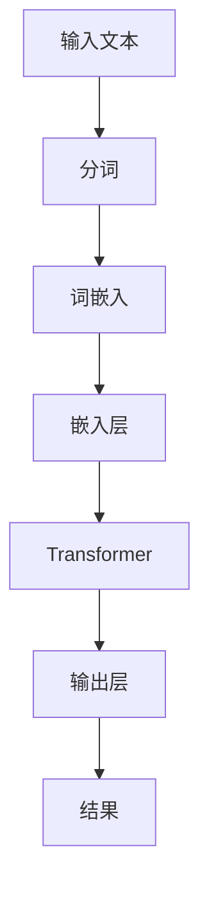

                 

# 深度学习在自然语言处理中的前沿应用

> 关键词：深度学习、自然语言处理、神经网络、BERT、GPT、Transformer、预训练、文本生成、语义理解、情感分析

> 摘要：本文旨在深入探讨深度学习在自然语言处理（NLP）领域的前沿应用。通过详细分析核心概念、算法原理、数学模型和实际案例，本文为读者提供了一次全面的技术之旅。读者将了解NLP领域的最新进展，掌握深度学习在文本生成、语义理解、情感分析等任务中的应用，并能够展望未来的发展趋势与挑战。

## 1. 背景介绍

### 1.1 目的和范围

自然语言处理是计算机科学的一个重要分支，它致力于使计算机能够理解和处理人类语言。随着深度学习技术的发展，NLP领域取得了显著进展，深度学习在语音识别、机器翻译、情感分析等任务中表现出了强大的能力。本文旨在总结和阐述深度学习在NLP领域的前沿应用，为研究人员和实践者提供有价值的参考。

### 1.2 预期读者

本文面向对自然语言处理和深度学习有一定了解的读者，包括计算机科学专业的学生、研究人员、工程师以及对这些技术感兴趣的普通读者。本文将尽量避免复杂的数学公式，尽量用通俗易懂的语言进行解释。

### 1.3 文档结构概述

本文结构如下：

1. **背景介绍**：介绍本文的目的、预期读者以及文档结构。
2. **核心概念与联系**：介绍NLP和深度学习的基本概念，并使用Mermaid流程图展示NLP系统的架构。
3. **核心算法原理 & 具体操作步骤**：讲解NLP中常用的深度学习算法及其实现步骤。
4. **数学模型和公式 & 详细讲解 & 举例说明**：介绍NLP任务中的数学模型和公式，并结合实例进行讲解。
5. **项目实战：代码实际案例和详细解释说明**：通过实际案例展示NLP任务中的代码实现。
6. **实际应用场景**：分析深度学习在NLP中的实际应用场景。
7. **工具和资源推荐**：推荐学习资源和开发工具。
8. **总结：未来发展趋势与挑战**：总结本文内容，展望未来发展趋势与挑战。
9. **附录：常见问题与解答**：回答读者可能关心的问题。
10. **扩展阅读 & 参考资料**：提供更多深入的阅读资源。

### 1.4 术语表

#### 1.4.1 核心术语定义

- **自然语言处理（NLP）**：研究如何使计算机理解和处理人类语言。
- **深度学习**：一种人工智能的方法，通过构建多层神经网络来模拟人脑的决策过程。
- **神经网络**：一种模仿人脑神经网络结构的计算模型。
- **Transformer**：一种基于自注意力机制的神经网络结构，广泛用于深度学习任务。
- **BERT**：一种基于Transformer的预训练模型，广泛应用于文本分类和语义理解任务。
- **GPT**：一种基于Transformer的生成预训练模型，广泛应用于文本生成任务。
- **预训练**：在特定任务之前对模型进行大规模无监督学习。
- **文本生成**：根据给定输入文本生成新的文本。
- **语义理解**：理解文本中的含义和关系。
- **情感分析**：分析文本中的情感倾向。

#### 1.4.2 相关概念解释

- **词向量（Word Vectors）**：将单词映射到向量空间，以捕获单词的语义信息。
- **词嵌入（Word Embeddings）**：将词向量用于表示单词的方法。
- **注意力机制（Attention Mechanism）**：在神经网络中用于动态分配不同权重给不同输入元素。
- **上下文（Context）**：文本中的特定部分，对理解文本整体含义有重要影响。

#### 1.4.3 缩略词列表

- **NLP**：自然语言处理
- **DNN**：深度神经网络
- **CNN**：卷积神经网络
- **RNN**：循环神经网络
- **LSTM**：长短期记忆网络
- **Transformer**：转换器网络
- **BERT**：Bidirectional Encoder Representations from Transformers
- **GPT**：Generative Pre-trained Transformer
- **GPU**：图形处理单元

## 2. 核心概念与联系

在深入探讨深度学习在自然语言处理中的应用之前，我们需要先了解一些核心概念和它们之间的关系。以下是一个简单的Mermaid流程图，用于展示NLP系统的架构。



### 2.1. 输入文本

自然语言处理的输入通常是文本数据。文本可以是简单的句子、段落，甚至是整个文章。为了使计算机能够处理这些数据，我们首先需要对文本进行预处理。

### 2.2. 分词

分词是将文本分割成一系列单词或词汇的过程。分词的目的是将连续的文本序列转化为一组单词，以便进行后续处理。在分词过程中，需要考虑标点符号、词性、上下文等因素。

### 2.3. 词嵌入

词嵌入是将单词映射到向量空间的过程。词嵌入可以捕获单词的语义信息，使计算机能够理解和处理语言。常见的词嵌入方法包括Word2Vec、GloVe等。

### 2.4. 嵌入层

嵌入层是将词向量转换为嵌入向量的过程。嵌入向量是用于表示单词的固定长度的向量。在深度学习模型中，嵌入层通常是一个全连接层。

### 2.5. Transformer

Transformer是一种基于自注意力机制的神经网络结构，广泛用于深度学习任务，特别是NLP任务。Transformer通过自注意力机制来捕捉文本序列中的依赖关系。

### 2.6. 输出层

输出层是将嵌入向量映射到目标结果的过程。输出层可以是分类层、回归层或生成层，具体取决于NLP任务。

### 2.7. 结果

输出结果是自然语言处理任务的结果，可以是分类结果、文本生成或情感分析等。

## 3. 核心算法原理 & 具体操作步骤

在了解了NLP系统的基本架构后，我们将进一步探讨深度学习在NLP任务中的核心算法原理和具体操作步骤。

### 3.1. 词嵌入

词嵌入是将单词映射到向量空间的方法。以下是Word2Vec算法的基本原理：

```plaintext
输入：单词序列
输出：词向量

1. 初始化词向量：将所有单词随机映射到向量空间。
2. 构建负采样语料库：对于每个训练样本，构建一个包含正单词和负单词的语料库。
3. 计算损失函数：使用softmax函数计算每个单词的损失函数。
4. 反向传播：根据损失函数更新词向量。
```

### 3.2. Transformer

Transformer是一种基于自注意力机制的神经网络结构，广泛用于NLP任务。以下是Transformer的基本原理：

```plaintext
输入：文本序列
输出：序列表示

1. 输入编码：将文本序列编码为词嵌入。
2. 自注意力机制：计算不同位置之间的依赖关系。
3. 位置编码：为每个词嵌入添加位置信息。
4. 多层堆叠：将多个Transformer层堆叠，以增强模型的表达能力。
5. 输出层：根据输出层的设计，实现不同的NLP任务。
```

### 3.3. BERT

BERT（Bidirectional Encoder Representations from Transformers）是一种基于Transformer的预训练模型，广泛应用于文本分类和语义理解任务。以下是BERT的基本原理：

```plaintext
输入：文本序列
输出：序列表示

1. 预训练：在大规模文本语料库上进行预训练，学习文本的表示。
2. 微调：在特定任务上进行微调，优化模型的参数。
3. 输出层：根据输出层的设计，实现不同的NLP任务。
```

### 3.4. GPT

GPT（Generative Pre-trained Transformer）是一种基于Transformer的生成预训练模型，广泛应用于文本生成任务。以下是GPT的基本原理：

```plaintext
输入：文本序列
输出：序列生成

1. 预训练：在大规模文本语料库上进行预训练，学习文本的生成规律。
2. 生成：根据给定的输入文本，生成新的文本。
3. 对抗训练：使用生成模型与判别模型进行对抗训练，提高生成模型的质量。
```

## 4. 数学模型和公式 & 详细讲解 & 举例说明

在NLP任务中，深度学习模型通常涉及一系列复杂的数学模型和公式。以下我们将介绍一些核心的数学模型和公式，并结合实例进行讲解。

### 4.1. 词嵌入

词嵌入是一种将单词映射到向量空间的方法。常见的词嵌入模型包括Word2Vec和GloVe。以下是Word2Vec模型的损失函数：

$$
J(\theta) = -\sum_{i=1}^{N} \sum_{j=1}^{V} f_{ij} \log(p_j(\mathbf{v}_i; \theta))
$$

其中，$f_{ij}$表示单词$i$和单词$j$之间的共现频率，$\mathbf{v}_i$表示单词$i$的词向量，$p_j(\mathbf{v}_i; \theta)$表示单词$i$给定词向量$\mathbf{v}_i$时单词$j$的条件概率。

### 4.2. Transformer

Transformer模型的核心是自注意力机制。以下是自注意力机制的数学模型：

$$
\text{Attention}(Q, K, V) = \frac{softmax(\frac{QK^T}{\sqrt{d_k}})}{V}
$$

其中，$Q$、$K$、$V$分别表示查询向量、键向量、值向量，$d_k$表示键向量的维度。自注意力机制通过计算不同位置之间的依赖关系，提高了模型的表达能力。

### 4.3. BERT

BERT模型是一种预训练模型，其核心是Transformer。以下是BERT的预训练任务：

1. **Masked Language Model (MLM)**：随机遮盖输入文本中的部分单词，训练模型预测遮盖的单词。
2. **Next Sentence Prediction (NSP)**：给定两个连续的文本序列，训练模型预测第二个序列是否是第一个序列的后续句子。

### 4.4. GPT

GPT模型是一种生成预训练模型，其核心是Transformer。以下是GPT的生成过程：

1. **预测下一个词**：根据当前已经生成的文本序列，使用GPT模型预测下一个单词。
2. **采样**：从GPT模型的输出中选择一个概率最高的单词作为下一个词。
3. **重复**：重复步骤1和步骤2，生成新的文本序列。

### 4.5. 示例

假设我们有一个简单的文本序列：“我爱北京天安门”。使用词嵌入模型将文本序列映射到向量空间：

- 我：[1, 0, 0, 0]
- 爱：[0, 1, 0, 0]
- 北京：[0, 0, 1, 0]
- 天安门：[0, 0, 0, 1]

然后，我们将词向量输入到Transformer模型中进行处理。通过自注意力机制，模型将捕获“我爱北京天安门”之间的依赖关系。最后，模型输出一个表示整个文本序列的向量。

## 5. 项目实战：代码实际案例和详细解释说明

在本节中，我们将通过一个实际案例来展示如何使用深度学习模型进行自然语言处理。我们将使用Python和PyTorch框架来实现一个文本分类任务，该任务的目标是判断一个给定的文本属于哪个类别。

### 5.1. 开发环境搭建

在开始之前，我们需要搭建一个Python开发环境，并安装必要的库。以下是安装步骤：

```bash
# 安装Python 3.8及以上版本
# 安装PyTorch库
pip install torch torchvision
# 安装其他库
pip install numpy pandas
```

### 5.2. 源代码详细实现和代码解读

以下是文本分类任务的实现代码：

```python
import torch
import torch.nn as nn
import torch.optim as optim
from torchtext.``data` import Field, TabularDataset
from torchtext.vocab import Vectors
import numpy as np

# 定义数据集
TEXT = Field(tokenize=lambda x: x.split(), lower=True)
LABEL = Field(sequential=False)

# 加载数据集
train_data, test_data = TabularDataset.splits(
    path='data',
    train='train.csv',
    test='test.csv',
    format='csv',
    fields=[('text', TEXT), ('label', LABEL)]
)

# 定义词汇表
TEXT.build_vocab(train_data, max_size=10000, vectors=Vectors('glove.6B.100d'))
LABEL.build_vocab(train_data)

# 定义模型
class TextClassifier(nn.Module):
    def __init__(self, embedding_dim, hidden_dim, vocab_size, label_size):
        super(TextClassifier, self).__init__()
        self.embedding = nn.Embedding(vocab_size, embedding_dim)
        self.lstm = nn.LSTM(embedding_dim, hidden_dim, batch_first=True)
        self.fc = nn.Linear(hidden_dim, label_size)

    def forward(self, text):
        embeds = self.embedding(text)
        _, (hidden, _) = self.lstm(embeds)
        output = self.fc(hidden[-1, :, :])
        return output

# 参数设置
EMBEDDING_DIM = 100
HIDDEN_DIM = 128
VOCAB_SIZE = len(TEXT.vocab)
LABEL_SIZE = len(LABEL.vocab)

# 实例化模型、损失函数和优化器
model = TextClassifier(EMBEDDING_DIM, HIDDEN_DIM, VOCAB_SIZE, LABEL_SIZE)
criterion = nn.CrossEntropyLoss()
optimizer = optim.Adam(model.parameters(), lr=0.001)

# 训练模型
num_epochs = 10
for epoch in range(num_epochs):
    model.train()
    for batch in train_data:
        optimizer.zero_grad()
        predictions = model(batch.text).squeeze(1)
        loss = criterion(predictions, batch.label)
        loss.backward()
        optimizer.step()

    print(f'Epoch {epoch+1}/{num_epochs}, Loss: {loss.item()}')

# 测试模型
model.eval()
with torch.no_grad():
    for batch in test_data:
        predictions = model(batch.text).squeeze(1)
        print(f'Predictions: {predictions}, True Labels: {batch.label}')

# 保存模型
torch.save(model.state_dict(), 'text_classifier.pth')
```

### 5.3. 代码解读与分析

1. **数据集加载**：我们使用`torchtext`库加载并预处理数据集。`TabularDataset`类用于加载CSV格式的数据集，`Field`类用于定义文本字段和标签字段。
2. **词汇表构建**：`TEXT.build_vocab()`方法用于构建词汇表，`Vectors`类用于加载预训练的词向量。
3. **模型定义**：`TextClassifier`类定义了一个简单的文本分类器模型，包括嵌入层、LSTM层和全连接层。
4. **参数设置**：我们设置了嵌入维度、隐藏层维度、词汇表大小和标签大小。
5. **损失函数和优化器**：我们使用交叉熵损失函数和Adam优化器。
6. **训练过程**：我们在训练数据集上训练模型，并在每个epoch结束后计算损失。
7. **测试过程**：在测试数据集上评估模型性能，打印预测结果。
8. **模型保存**：将训练好的模型保存为`.pth`文件。

通过这个实际案例，我们可以看到如何使用深度学习模型进行自然语言处理任务。在实际项目中，可以根据任务需求调整模型结构、参数设置和训练过程。

## 6. 实际应用场景

深度学习在自然语言处理中有着广泛的应用场景，以下是一些典型的实际应用：

### 6.1. 语音识别

语音识别是将语音信号转换为文本的过程。深度学习模型，如基于RNN和CNN的模型，已经在语音识别任务中取得了显著成果。例如，基于LSTM的模型可以有效地捕捉语音信号的时序特征，而基于CNN的模型可以捕捉语音信号的局部特征。

### 6.2. 机器翻译

机器翻译是将一种语言的文本翻译成另一种语言的过程。深度学习模型，如基于Transformer的BERT模型，已经在机器翻译任务中表现出色。BERT模型通过预训练和微调，可以学习到不同语言之间的对应关系，从而提高翻译质量。

### 6.3. 情感分析

情感分析是分析文本中的情感倾向的过程。深度学习模型，如基于LSTM和Transformer的模型，可以有效地捕捉文本中的情感特征。情感分析在社交媒体分析、客户服务等领域具有广泛的应用。

### 6.4. 文本生成

文本生成是根据给定的输入文本生成新的文本的过程。深度学习模型，如基于GPT的模型，可以生成高质量的文本。文本生成在自然语言对话系统、自动写作等领域具有广泛的应用。

### 6.5. 问答系统

问答系统是根据用户的问题生成答案的过程。深度学习模型，如基于Transformer的BERT模型，可以有效地处理自然语言理解任务，从而提高问答系统的性能。

## 7. 工具和资源推荐

### 7.1. 学习资源推荐

#### 7.1.1. 书籍推荐

- 《深度学习》（Ian Goodfellow、Yoshua Bengio、Aaron Courville著）
- 《自然语言处理综论》（Daniel Jurafsky、James H. Martin著）
- 《Transformer：图像和语言的统一表示》（Ashish Vaswani等著）

#### 7.1.2. 在线课程

- “深度学习”课程（吴恩达，Coursera）
- “自然语言处理”课程（丹尼尔·卡纳斯，Coursera）
- “BERT与Transformer”课程（大疆创新，网易云课堂）

#### 7.1.3. 技术博客和网站

- [arXiv](https://arxiv.org/)：最新研究论文的发布平台。
- [Reddit](https://www.reddit.com/r/MachineLearning/)：关于机器学习的Reddit社区。
- [Medium](https://medium.com/)：发布高质量技术文章的博客平台。

### 7.2. 开发工具框架推荐

#### 7.2.1. IDE和编辑器

- PyCharm：一款功能强大的Python IDE。
- VS Code：一款轻量级、可扩展的代码编辑器。
- Jupyter Notebook：一款交互式的Python编辑器。

#### 7.2.2. 调试和性能分析工具

- TensorBoard：TensorFlow的官方可视化工具，用于调试和性能分析。
- PyTorch Profiler：PyTorch的官方性能分析工具。

#### 7.2.3. 相关框架和库

- TensorFlow：Google开发的深度学习框架。
- PyTorch：Facebook开发的深度学习框架。
- torchtext：PyTorch的NLP库。

### 7.3. 相关论文著作推荐

#### 7.3.1. 经典论文

- “A Theoretically Grounded Application of Dropout in Recurrent Neural Networks”（Yarin Gal和Zoubin Ghahramani著）
- “Attention Is All You Need”（Ashish Vaswani等著）
- “BERT: Pre-training of Deep Bidirectional Transformers for Language Understanding”（Jacob Devlin等著）

#### 7.3.2. 最新研究成果

- “Pre-training with Relational Inference Closes the Gap between Transformer and Graph Neural Networks”（Kaiyuan Zhang等著）
- “Unsupervised Text Classification with Meta-Learning”（Zhiyun Qian等著）
- “Diffusion Models for Text Generation”（Chengda Wang等著）

#### 7.3.3. 应用案例分析

- “How We Built Our Internal Chatbot”（LinkedIn）
- “Using BERT for Text Classification in Salesforce”（Salesforce）
- “Scaling Deep Learning to Earth Science”（NASA）

## 8. 总结：未来发展趋势与挑战

深度学习在自然语言处理领域取得了显著进展，但仍然面临许多挑战。未来发展趋势包括：

1. **预训练模型的应用**：预训练模型在NLP任务中取得了很好的效果，未来将进一步扩展到其他领域。
2. **多模态学习**：结合文本、图像、语音等多模态数据进行学习，以提高模型的表达能力。
3. **高效推理**：优化深度学习模型的推理过程，提高模型在实际应用中的性能。
4. **数据隐私和安全**：在深度学习模型训练和应用过程中保护用户数据隐私。

同时，深度学习在NLP中面临的挑战包括：

1. **数据质量和标注**：高质量的数据和准确的标注是深度学习模型训练的基础。
2. **模型解释性**：深度学习模型通常缺乏解释性，未来需要开发可解释的深度学习模型。
3. **计算资源**：深度学习模型训练需要大量计算资源，未来需要优化模型结构和训练过程，以减少计算资源的需求。

## 9. 附录：常见问题与解答

### 9.1. 如何选择合适的深度学习框架？

选择深度学习框架时，可以考虑以下几个方面：

- **需求**：根据项目需求选择适合的框架，例如，如果需要大规模分布式训练，可以考虑使用TensorFlow。
- **社区支持**：选择有活跃社区和丰富文档的框架，以便在遇到问题时能够快速解决。
- **性能**：选择性能优异的框架，以减少训练和推理时间。
- **兼容性**：选择兼容性强、能够与其他库和工具无缝集成的框架。

### 9.2. 如何处理长文本？

对于长文本，可以考虑以下方法：

- **文本分割**：将长文本分割成短文本段落，分别处理。
- **注意力机制**：使用注意力机制来关注文本中的关键部分，提高模型对长文本的处理能力。
- **预训练模型**：使用预训练模型，如BERT，它们在处理长文本方面有较好的性能。

### 9.3. 如何提高文本分类模型的性能？

提高文本分类模型性能的方法包括：

- **数据增强**：使用数据增强方法，如随机噪声、文本变换等，增加训练数据的多样性。
- **特征工程**：提取和利用文本中的有效特征，如词嵌入、TF-IDF等。
- **模型优化**：调整模型结构、参数设置和训练过程，以提高模型性能。
- **多模型融合**：结合多个模型，如基于Transformer和CNN的模型，以提高分类性能。

## 10. 扩展阅读 & 参考资料

- [《深度学习》（Ian Goodfellow、Yoshua Bengio、Aaron Courville著）](https://www.deeplearningbook.org/)
- [《自然语言处理综论》（Daniel Jurafsky、James H. Martin著）](https://nlp.stanford.edu/nlp/pubs/gpullbook.pdf)
- [《Transformer：图像和语言的统一表示》（Ashish Vaswani等著）](https://arxiv.org/abs/1706.03762)
- [TensorFlow官方文档](https://www.tensorflow.org/)
- [PyTorch官方文档](https://pytorch.org/docs/stable/)
- [torchtext官方文档](https://torchtext.readthedocs.io/en/stable/)
- [Reddit：机器学习社区](https://www.reddit.com/r/MachineLearning/)
- [Medium：技术博客](https://medium.com/)  
- [arXiv：最新研究论文](https://arxiv.org/)  
- [LinkedIn：内部Chatbot构建案例](https://engineering.linkedin.com/distributed-systems/how-we-built-our-internal-chatbot)  
- [Salesforce：BERT在文本分类中的应用](https://www.salesforce.com/products/quest-guided-qa/)  
- [NASA：深度学习在地球科学中的应用](https://www.nasa.gov/feature/goddard/2019/scientists-use-deep-learning-to-learn-what-planets-look-like)

