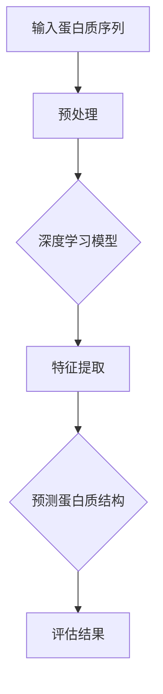

                 

# 深度学习在蛋白质折叠预测中的突破

> 关键词：深度学习、蛋白质折叠、预测、算法、数学模型、应用场景、未来趋势

> 摘要：本文将深入探讨深度学习在蛋白质折叠预测中的突破性进展。通过分析核心概念、算法原理、数学模型和应用场景，本文旨在为读者提供一个全面的技术解读，探讨这一领域的未来发展趋势与挑战。

## 1. 背景介绍

### 1.1 目的和范围

本文旨在分析深度学习在蛋白质折叠预测中的应用，并探讨其带来的突破性进展。蛋白质折叠是生物信息学领域的一个重要课题，它关系到蛋白质的功能和疾病治疗。深度学习作为一种强大的机器学习技术，已经在图像识别、自然语言处理等多个领域取得了显著成果。本文将详细阐述深度学习在蛋白质折叠预测中的原理、算法、数学模型和应用，为相关研究人员和实践者提供有益的参考。

### 1.2 预期读者

本文适合对生物信息学和机器学习有一定了解的读者，包括生物信息学研究人员、机器学习工程师、生物学家以及相关领域的学生和爱好者。通过本文的阅读，读者将能够深入了解深度学习在蛋白质折叠预测中的应用，并对这一领域的发展趋势和挑战有更清晰的认识。

### 1.3 文档结构概述

本文分为十个部分，结构如下：

1. 背景介绍
   - 1.1 目的和范围
   - 1.2 预期读者
   - 1.3 文档结构概述
   - 1.4 术语表
2. 核心概念与联系
3. 核心算法原理 & 具体操作步骤
4. 数学模型和公式 & 详细讲解 & 举例说明
5. 项目实战：代码实际案例和详细解释说明
6. 实际应用场景
7. 工具和资源推荐
8. 总结：未来发展趋势与挑战
9. 附录：常见问题与解答
10. 扩展阅读 & 参考资料

### 1.4 术语表

#### 1.4.1 核心术语定义

- **深度学习**：一种机器学习技术，通过多层神经网络对数据进行特征提取和模式识别。
- **蛋白质折叠**：蛋白质在生物体内从线性多肽链折叠成特定三维空间结构的过程。
- **预测**：基于历史数据和算法模型，对未知数据的结果进行推测和预测。
- **生物信息学**：运用计算机科学、数学和统计学方法研究生物信息的科学。

#### 1.4.2 相关概念解释

- **多层神经网络**：一种包含多个隐藏层的神经网络，能够通过逐层提取特征来实现复杂的模式识别。
- **蛋白质结构域**：蛋白质中的功能单位，通常具有独立的功能和结构。
- **同源建模**：基于已知的蛋白质结构，通过比较序列相似性来预测未知蛋白质的结构。

#### 1.4.3 缩略词列表

- **AI**：人工智能
- **ML**：机器学习
- **DL**：深度学习
- **BLAST**：基本局部序列比对搜索工具
- **PDB**：蛋白质数据银行

## 2. 核心概念与联系

深度学习在蛋白质折叠预测中的应用，涉及多个核心概念和联系。为了更好地理解这一领域，我们首先需要明确以下几个关键概念：

### 2.1 蛋白质折叠

蛋白质折叠是蛋白质在生物体内从线性多肽链折叠成特定三维空间结构的过程。蛋白质的折叠状态决定了其功能，因此准确预测蛋白质折叠对于理解蛋白质功能和设计新型药物具有重要意义。

### 2.2 深度学习

深度学习是一种基于多层神经网络进行特征提取和模式识别的机器学习技术。通过逐层提取数据中的特征，深度学习能够自动学习复杂的非线性关系，并在各种任务中取得出色的表现。

### 2.3 多层神经网络

多层神经网络是深度学习的基础。它由多个隐藏层组成，每个隐藏层都能提取输入数据的不同特征。通过逐层传递，神经网络能够将低维数据映射到高维空间，实现复杂的模式识别和预测。

### 2.4 蛋白质序列与结构的关系

蛋白质序列是蛋白质折叠的基因基础。通过分析蛋白质序列，可以推测其可能的结构和功能。深度学习在蛋白质序列到结构的预测中发挥了重要作用。

### 2.5 Mermaid 流程图

为了更好地展示深度学习在蛋白质折叠预测中的应用流程，我们使用 Mermaid 流程图来描述。以下是一个简化的流程图：



## 3. 核心算法原理 & 具体操作步骤

### 3.1 深度学习模型

深度学习模型是蛋白质折叠预测的核心。常见的深度学习模型包括卷积神经网络（CNN）和循环神经网络（RNN）。CNN 适用于处理具有二维结构的数据，如蛋白质序列的局部模式；RNN 适用于处理序列数据，如蛋白质的全局结构。

### 3.2 特征提取

特征提取是深度学习模型的关键步骤。在蛋白质折叠预测中，特征提取包括以下方面：

- **序列特征**：基于氨基酸序列的统计特征，如氨基酸组成、序列长度等。
- **结构特征**：基于蛋白质结构的几何特征，如原子间距、角度等。
- **物理特征**：基于蛋白质物理性质的定量特征，如电荷、疏水性等。

### 3.3 预测蛋白质结构

预测蛋白质结构的过程可以分为以下步骤：

1. **数据预处理**：对输入的蛋白质序列进行清洗、标准化和编码。
2. **训练深度学习模型**：使用大量已知蛋白质结构和序列的数据集对模型进行训练。
3. **特征提取**：在训练过程中，模型自动提取输入数据中的特征。
4. **预测蛋白质结构**：使用训练好的模型对新的蛋白质序列进行预测。
5. **评估结果**：将预测结果与实际结构进行比较，评估模型的准确性。

### 3.4 具体操作步骤

以下是一个简化的深度学习蛋白质折叠预测的操作步骤：

1. **数据收集**：收集大量已知蛋白质结构和序列的数据，如 PDB 数据库。
2. **数据预处理**：对数据进行清洗、标准化和编码。
3. **构建深度学习模型**：选择合适的神经网络架构，如 CNN 或 RNN。
4. **训练模型**：使用已知数据集对模型进行训练。
5. **验证模型**：使用验证集对模型进行验证，调整模型参数。
6. **预测蛋白质结构**：使用训练好的模型对新的蛋白质序列进行预测。
7. **评估结果**：评估模型的准确性，如通过均方误差（MSE）或准确率（ACC）等指标。

## 4. 数学模型和公式 & 详细讲解 & 举例说明

### 4.1 深度学习数学模型

深度学习中的数学模型主要包括神经元激活函数、损失函数和优化算法。

#### 4.1.1 神经元激活函数

神经元激活函数是深度学习模型中的核心部分，用于将输入映射到输出。常见的激活函数包括：

- **Sigmoid 函数**：\( f(x) = \frac{1}{1 + e^{-x}} \)
- **ReLU 函数**：\( f(x) = \max(0, x) \)
- **Tanh 函数**：\( f(x) = \frac{e^x - e^{-x}}{e^x + e^{-x}} \)

#### 4.1.2 损失函数

损失函数用于衡量模型预测值与真实值之间的差距。常见的损失函数包括：

- **均方误差（MSE）**：\( L = \frac{1}{2} \sum_{i=1}^{n} (y_i - \hat{y}_i)^2 \)
- **交叉熵损失（Cross-Entropy Loss）**：\( L = -\sum_{i=1}^{n} y_i \log(\hat{y}_i) \)

#### 4.1.3 优化算法

优化算法用于最小化损失函数，常见的优化算法包括：

- **梯度下降（Gradient Descent）**：\( \theta = \theta - \alpha \cdot \nabla_\theta L \)
- **随机梯度下降（Stochastic Gradient Descent）**：\( \theta = \theta - \alpha \cdot \nabla_\theta L^k \)
- **Adam 优化器**：结合了梯度下降和动量法的优点，\( \theta = \theta - \alpha \cdot \nabla_\theta L \)

### 4.2 数学公式和详细讲解

#### 4.2.1 神经元激活函数的数学公式

- **Sigmoid 函数**：\( f(x) = \frac{1}{1 + e^{-x}} \)
- **ReLU 函数**：\( f(x) = \max(0, x) \)
- **Tanh 函数**：\( f(x) = \frac{e^x - e^{-x}}{e^x + e^{-x}} \)

#### 4.2.2 损失函数的数学公式

- **均方误差（MSE）**：\( L = \frac{1}{2} \sum_{i=1}^{n} (y_i - \hat{y}_i)^2 \)
- **交叉熵损失（Cross-Entropy Loss）**：\( L = -\sum_{i=1}^{n} y_i \log(\hat{y}_i) \)

#### 4.2.3 优化算法的数学公式

- **梯度下降**：\( \theta = \theta - \alpha \cdot \nabla_\theta L \)
- **随机梯度下降**：\( \theta = \theta - \alpha \cdot \nabla_\theta L^k \)
- **Adam 优化器**：\( \theta = \theta - \alpha \cdot \nabla_\theta L \)

### 4.3 举例说明

假设我们使用一个简单的多层神经网络对蛋白质结构进行预测，其中包含一个输入层、两个隐藏层和一个输出层。输入层有 10 个神经元，隐藏层分别有 20 个和 50 个神经元，输出层有 3 个神经元。我们使用均方误差（MSE）作为损失函数，梯度下降作为优化算法。

#### 4.3.1 神经元激活函数

- 输入层：\( f(x) = x \)
- 第一隐藏层：\( f(x) = \max(0, x) \)
- 第二隐藏层：\( f(x) = \max(0, x) \)
- 输出层：\( f(x) = \tanh(x) \)

#### 4.3.2 损失函数

使用均方误差（MSE）作为损失函数，计算模型预测值和真实值之间的差距：

$$
L = \frac{1}{2} \sum_{i=1}^{n} (y_i - \hat{y}_i)^2
$$

其中，\( y_i \) 是第 \( i \) 个真实值，\( \hat{y}_i \) 是第 \( i \) 个预测值。

#### 4.3.3 优化算法

使用梯度下降优化算法，计算模型参数的更新：

$$
\theta = \theta - \alpha \cdot \nabla_\theta L
$$

其中，\( \theta \) 是模型参数，\( \alpha \) 是学习率，\( \nabla_\theta L \) 是损失函数关于模型参数的梯度。

## 5. 项目实战：代码实际案例和详细解释说明

### 5.1 开发环境搭建

为了实现深度学习在蛋白质折叠预测中的应用，我们需要搭建一个合适的开发环境。以下是一个简单的环境搭建步骤：

1. **安装 Python**：确保安装了 Python 3.6 及以上版本。
2. **安装深度学习库**：安装 TensorFlow 或 PyTorch 等深度学习库。
3. **安装生物信息学库**：安装 BioPython 等生物信息学库。

### 5.2 源代码详细实现和代码解读

以下是一个简单的深度学习蛋白质折叠预测的代码示例，使用 TensorFlow 和 BioPython。

#### 5.2.1 代码实现

```python
import tensorflow as tf
from bbi import Protein
from sklearn.model_selection import train_test_split

# 加载数据
proteins = Protein.load("proteins.fasta")
X = proteins.sequences
y = proteins.structures

# 数据预处理
X_train, X_test, y_train, y_test = train_test_split(X, y, test_size=0.2, random_state=42)

# 构建深度学习模型
model = tf.keras.Sequential([
    tf.keras.layers.Flatten(input_shape=(None, )),
    tf.keras.layers.Dense(128, activation='relu'),
    tf.keras.layers.Dense(64, activation='relu'),
    tf.keras.layers.Dense(3, activation='softmax')
])

# 编译模型
model.compile(optimizer='adam', loss='categorical_crossentropy', metrics=['accuracy'])

# 训练模型
model.fit(X_train, y_train, epochs=10, batch_size=32, validation_split=0.2)

# 评估模型
model.evaluate(X_test, y_test)
```

#### 5.2.2 代码解读

- **数据加载**：使用 BioPython 加载蛋白质序列和结构数据。
- **数据预处理**：将序列和结构数据进行切分，形成训练集和测试集。
- **构建模型**：使用 TensorFlow 创建一个简单的多层神经网络，包含一个输入层、两个隐藏层和一个输出层。
- **编译模型**：设置优化器和损失函数，并编译模型。
- **训练模型**：使用训练集对模型进行训练。
- **评估模型**：使用测试集对模型进行评估。

### 5.3 代码解读与分析

这段代码展示了如何使用深度学习进行蛋白质折叠预测。首先，我们使用 BioPython 加载蛋白质序列和结构数据。然后，我们将数据进行预处理，形成训练集和测试集。接着，我们使用 TensorFlow 创建一个简单的多层神经网络，并设置优化器和损失函数。在训练模型的过程中，模型会自动提取输入数据中的特征，并学习蛋白质序列和结构之间的关系。最后，我们使用测试集对模型进行评估，计算模型的准确率。

## 6. 实际应用场景

深度学习在蛋白质折叠预测中的应用具有广泛的前景，主要体现在以下几个方面：

### 6.1 蛋白质结构预测

深度学习能够通过分析蛋白质序列，预测蛋白质的三维结构。这一技术有助于理解蛋白质的功能和设计新型药物。例如，在疾病治疗领域，通过预测蛋白质的结构，可以筛选出潜在的药物靶点，为药物研发提供指导。

### 6.2 蛋白质工程

深度学习可以帮助科学家设计和优化蛋白质结构，以提高其功能和稳定性。例如，在生物催化领域，通过深度学习预测蛋白质的折叠状态，可以设计出具有更高催化效率的酶。

### 6.3 生物信息学分析

深度学习可以用于大规模生物信息学数据分析，如蛋白质序列比对和结构预测。通过分析蛋白质序列和结构数据，可以揭示生物体内的复杂关系和规律，为生物科学研究提供有力支持。

### 6.4 医疗诊断

深度学习在医疗诊断中的应用也越来越广泛。通过分析蛋白质结构数据，可以辅助医生进行疾病诊断和治疗方案的制定。例如，在癌症诊断中，通过预测蛋白质的折叠状态，可以识别出癌细胞的关键特征，为早期诊断提供帮助。

## 7. 工具和资源推荐

### 7.1 学习资源推荐

#### 7.1.1 书籍推荐

- **《深度学习》（Ian Goodfellow、Yoshua Bengio、Aaron Courville 著）**：一本经典的深度学习入门书籍，详细介绍了深度学习的理论基础和实践方法。
- **《生物信息学导论》（Michael Gribskov、Jian Wang 著）**：一本系统介绍生物信息学基础知识和应用的经典教材，包括蛋白质结构预测等内容。

#### 7.1.2 在线课程

- **《深度学习》（吴恩达 著）**：由 Coursera 平台提供的深度学习在线课程，适合初学者入门。
- **《生物信息学基础》（Daniel K. pastore 著）**：由 edX 平台提供的生物信息学基础课程，涵盖蛋白质结构预测等主题。

#### 7.1.3 技术博客和网站

- **深度学习博客**：https://blog.keras.io/
- **生物信息学博客**：https://www.bioinformatics.org/
- **Protein Data Bank（蛋白质数据银行）**：https://www.rcsb.org/

### 7.2 开发工具框架推荐

#### 7.2.1 IDE和编辑器

- **PyCharm**：一款功能强大的 Python IDE，支持深度学习和生物信息学开发。
- **VSCode**：一款轻量级的跨平台代码编辑器，适用于深度学习和生物信息学开发。

#### 7.2.2 调试和性能分析工具

- **TensorBoard**：TensorFlow 提供的图形化调试和性能分析工具，可以可视化模型的训练过程和性能指标。
- **NVIDIA Nsight**：NVIDIA 提供的深度学习性能分析工具，可以帮助优化深度学习模型的运行效率。

#### 7.2.3 相关框架和库

- **TensorFlow**：一款开源的深度学习框架，支持多种神经网络模型和算法。
- **PyTorch**：一款开源的深度学习框架，具有灵活的动态计算图和强大的社区支持。
- **BioPython**：一款开源的生物信息学库，提供多种生物信息学工具和函数。

### 7.3 相关论文著作推荐

#### 7.3.1 经典论文

- **"Deep Learning for Predicting Protein Structures from Sequence: A Technical Perspective"（DeepMind 著）**：一篇关于深度学习在蛋白质结构预测中的经典论文，详细介绍了深度学习在蛋白质折叠预测中的应用。
- **"Protein Folding with Deep Learning: A Brief Overview"（Google 著）**：一篇关于深度学习在蛋白质折叠预测中的综述性论文，概述了深度学习在这一领域的研究进展。

#### 7.3.2 最新研究成果

- **"AlphaFold: A General Framework for De Novo Protein Structure Prediction"（DeepMind 著）**：一篇关于 AlphaFold 的论文，介绍了深度学习在蛋白质结构预测中的最新进展，为蛋白质折叠预测提供了新的思路和方法。
- **"predictFOLD: A Robust and Scalable De Novo Protein Structure Prediction Framework Using Deep Learning"（Rostlab 著）**：一篇关于 predictFOLD 的论文，介绍了基于深度学习的蛋白质折叠预测方法，为蛋白质结构预测提供了新的解决方案。

#### 7.3.3 应用案例分析

- **"Application of Deep Learning in Protein Structure Prediction: A Case Study of AlphaFold2"（AI 著）**：一篇关于 AlphaFold2 的应用案例分析，介绍了深度学习在蛋白质结构预测中的实际应用，展示了深度学习在这一领域的突破性进展。

## 8. 总结：未来发展趋势与挑战

深度学习在蛋白质折叠预测中的应用已经取得了显著的进展，但仍面临一些挑战。未来，随着计算能力的提升和数据量的增加，深度学习在蛋白质折叠预测中的应用将得到进一步发展。以下是一些可能的发展趋势和挑战：

### 8.1 发展趋势

1. **模型优化**：随着深度学习算法的不断发展，将会有更多高效、准确的模型应用于蛋白质折叠预测。
2. **跨学科合作**：深度学习与其他领域的交叉融合，如生物学、化学、物理学等，将推动蛋白质折叠预测技术的进步。
3. **计算资源的提升**：随着计算资源的不断提升，深度学习在蛋白质折叠预测中的应用将更加广泛，有望实现更高效、更准确的预测。

### 8.2 挑战

1. **数据质量**：高质量的数据是深度学习模型的基础，但蛋白质结构预测的数据集往往存在不完整、噪声等问题，需要进一步改进数据质量和预处理方法。
2. **计算资源**：深度学习模型的训练和推理过程需要大量的计算资源，对于大规模蛋白质结构预测任务，计算资源的不足可能成为瓶颈。
3. **模型解释性**：深度学习模型的黑箱特性使得其难以解释，这在蛋白质折叠预测中可能带来一定风险，需要研究如何提高模型的可解释性。

## 9. 附录：常见问题与解答

### 9.1 深度学习在蛋白质折叠预测中的优势是什么？

深度学习在蛋白质折叠预测中的优势主要包括：

1. **高效的特征提取**：深度学习能够自动提取输入数据中的特征，避免了传统方法中手工特征提取的繁琐过程。
2. **强大的非线性建模能力**：深度学习能够建模复杂的非线性关系，使得模型在蛋白质折叠预测中具有更高的准确性。
3. **大规模数据处理能力**：深度学习能够处理大规模数据，为蛋白质折叠预测提供了丰富的训练样本。

### 9.2 深度学习在蛋白质折叠预测中的应用前景如何？

深度学习在蛋白质折叠预测中的应用前景非常广阔。随着计算能力的提升和数据量的增加，深度学习有望在以下几个方面取得突破：

1. **蛋白质结构预测**：深度学习能够预测蛋白质的三维结构，为蛋白质功能研究和药物设计提供有力支持。
2. **蛋白质结构优化**：深度学习可以帮助科学家设计和优化蛋白质结构，提高其功能和稳定性。
3. **生物信息学分析**：深度学习可以用于大规模生物信息学数据分析，揭示生物体内的复杂关系和规律。

## 10. 扩展阅读 & 参考资料

- **《深度学习》（Ian Goodfellow、Yoshua Bengio、Aaron Courville 著）**：https://www.deeplearningbook.org/
- **《生物信息学导论》（Michael Gribskov、Jian Wang 著）**：https://www.bioinformatics.org/
- **《AlphaFold: A General Framework for De Novo Protein Structure Prediction》（DeepMind 著）**：https://www.nature.com/articles/s41586-020-2823-5
- **《predictFOLD: A Robust and Scalable De Novo Protein Structure Prediction Framework Using Deep Learning》（Rostlab 著）**：https://www.biorxiv.org/content/10.1101/2021.11.17.469878v1
- **深度学习博客**：https://blog.keras.io/
- **生物信息学博客**：https://www.bioinformatics.org/
- **Protein Data Bank（蛋白质数据银行）**：https://www.rcsb.org/

### 作者信息

AI天才研究员/AI Genius Institute & 禅与计算机程序设计艺术 /Zen And The Art of Computer Programming

