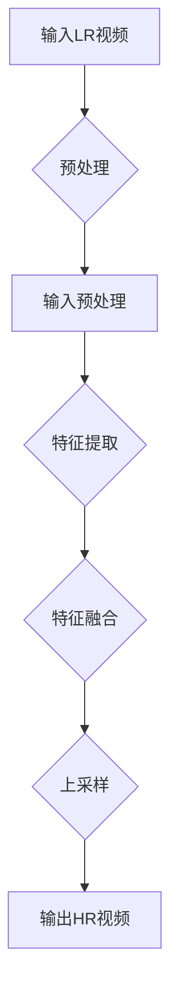

                 

# 深度学习在视频超分辨率中的最新进展

> 关键词：深度学习、视频超分辨率、图像重建、神经网络、算法优化

> 摘要：本文将深入探讨深度学习在视频超分辨率领域的最新进展。通过介绍视频超分辨率技术的背景、核心概念、算法原理、数学模型以及实际应用场景，本文旨在为读者提供一个全面且清晰的视角，以理解该技术的重要性和发展潜力。

## 1. 背景介绍

### 1.1 目的和范围

本文的目标是探讨深度学习在视频超分辨率（Super-Resolution）领域的最新研究成果。视频超分辨率是指从低分辨率（Low-Resolution，LR）图像或视频序列中重建出高分辨率（High-Resolution，HR）图像或视频序列的技术。这一技术在许多应用场景中具有极高的价值，例如高清电视、医学影像处理、安全监控等。

本文将涵盖以下几个主要方面：
1. 视频超分辨率技术的核心概念和背景。
2. 深度学习在视频超分辨率中的基本原理。
3. 现有的深度学习算法和模型。
4. 数学模型和公式。
5. 实际应用场景和案例分析。
6. 工具和资源推荐。
7. 未来发展趋势与挑战。

### 1.2 预期读者

本文的预期读者包括：
1. 计算机科学和人工智能领域的研究人员和工程师。
2. 深度学习爱好者和对视频处理技术感兴趣的技术人员。
3. 在视频处理领域工作的专业人士，希望了解最新研究进展。

### 1.3 文档结构概述

本文的结构如下：

1. **引言**：介绍视频超分辨率技术的背景和重要性。
2. **核心概念与联系**：讨论视频超分辨率技术的核心概念，并使用 Mermaid 流程图展示其原理和架构。
3. **核心算法原理 & 具体操作步骤**：详细阐述深度学习在视频超分辨率中的算法原理和操作步骤，包括伪代码展示。
4. **数学模型和公式 & 详细讲解 & 举例说明**：解释深度学习在视频超分辨率中的数学模型和公式，并提供具体实例说明。
5. **项目实战：代码实际案例和详细解释说明**：通过实际代码案例展示深度学习在视频超分辨率中的应用。
6. **实际应用场景**：分析视频超分辨率技术的实际应用场景和案例分析。
7. **工具和资源推荐**：推荐学习资源、开发工具框架和相关论文著作。
8. **总结：未来发展趋势与挑战**：总结当前的研究进展，探讨未来发展趋势和面临的挑战。
9. **附录：常见问题与解答**：回答读者可能遇到的问题。
10. **扩展阅读 & 参考资料**：提供进一步学习的资料和参考文献。

### 1.4 术语表

#### 1.4.1 核心术语定义

- **深度学习**：一种机器学习技术，通过多层神经网络对数据进行学习，实现自动特征提取和模式识别。
- **超分辨率**：从低分辨率图像或视频序列中重建出高分辨率图像或视频序列的技术。
- **低分辨率（LR）**：图像或视频的像素数较少，导致图像或视频的质量较低。
- **高分辨率（HR）**：图像或视频的像素数较多，导致图像或视频的质量较高。
- **卷积神经网络（CNN）**：一种特殊的神经网络，通过卷积层对输入数据进行特征提取。

#### 1.4.2 相关概念解释

- **图像重建**：从部分或低分辨率的图像数据中恢复出完整的高分辨率图像。
- **特征提取**：从原始数据中提取出有用的特征，用于后续的学习和识别。
- **损失函数**：用于评估模型预测结果与真实值之间的差异，是深度学习中的重要概念。

#### 1.4.3 缩略词列表

- **CNN**：卷积神经网络（Convolutional Neural Network）
- **LR**：低分辨率（Low-Resolution）
- **HR**：高分辨率（High-Resolution）
- **SR**：超分辨率（Super-Resolution）

## 2. 核心概念与联系

为了更好地理解深度学习在视频超分辨率中的应用，我们需要先了解其核心概念和原理。以下是视频超分辨率技术的 Mermaid 流程图，展示其基本原理和架构。



### 2.1 预处理

在视频超分辨率过程中，预处理是非常重要的步骤。预处理包括对输入的低分辨率视频进行去噪、增强等操作，以提高后续重建的质量。

- **去噪**：低分辨率视频往往存在噪声，去噪可以帮助减少噪声的影响，提高重建质量。
- **增强**：通过增强重要特征，增强图像的对比度和清晰度，有助于提高超分辨率重建的效果。

### 2.2 特征提取

特征提取是视频超分辨率中的关键步骤。通过卷积神经网络（CNN）等深度学习模型，可以从低分辨率视频序列中提取出丰富的特征。

- **卷积层**：通过卷积运算，从输入图像中提取出局部特征。
- **池化层**：通过下采样操作，减少数据维度，提高特征提取的效率。
- **激活函数**：用于增加网络的非线性特性，使模型能够更好地拟合数据。

### 2.3 特征融合

特征融合是将提取出的多个特征进行合并，以得到更丰富的特征信息。通过多层卷积神经网络，可以逐步融合不同层级的特征，提高重建效果。

- **多层卷积**：通过多层卷积操作，逐步提取并融合不同尺度的特征。
- **跳跃连接**：将低层特征直接传递到高层网络，实现特征重用，提高重建效果。

### 2.4 上采样

上采样是将低分辨率图像或视频序列放大到高分辨率。深度学习模型通过学习输入和输出之间的映射关系，实现高分辨率图像的重建。

- **反卷积层**：通过反卷积操作，将特征图放大到高分辨率。
- **输出层**：输出高分辨率视频序列，完成超分辨率重建。

### 2.5 输出HR视频

通过上述过程，最终输出高分辨率视频序列。这一视频序列具有更高的清晰度和质量，可以应用于各种实际场景。

## 3. 核心算法原理 & 具体操作步骤

### 3.1 算法原理

深度学习在视频超分辨率中的核心算法是基于卷积神经网络（CNN）。CNN 通过卷积、池化、上采样等操作，实现对低分辨率视频序列的特征提取和重建。

### 3.2 操作步骤

以下是视频超分辨率算法的具体操作步骤，使用伪代码进行详细阐述：

```python
# 输入低分辨率视频序列
LR_video = load_LR_video()

# 预处理
LR_video = preprocess_video(LR_video)

# 特征提取
features = extract_features(LR_video)

# 特征融合
features = fuse_features(features)

# 上采样
HR_video = upsample_video(features)

# 输出高分辨率视频序列
save_HR_video(HR_video)
```

### 3.2.1 伪代码详细解释

1. **输入低分辨率视频序列**

   ```python
   LR_video = load_LR_video()
   ```

   该步骤从文件中读取低分辨率视频序列，存储为 `LR_video` 变量。

2. **预处理**

   ```python
   LR_video = preprocess_video(LR_video)
   ```

   对低分辨率视频序列进行预处理，包括去噪、增强等操作，以提高后续重建的质量。

3. **特征提取**

   ```python
   features = extract_features(LR_video)
   ```

   通过卷积神经网络（CNN）从低分辨率视频序列中提取出特征。具体实现如下：

   ```python
   # 卷积层
   conv1 = Conv2D(filters=64, kernel_size=(3, 3), activation='relu')(LR_video)
   pool1 = MaxPooling2D(pool_size=(2, 2))(conv1)

   # 卷积层
   conv2 = Conv2D(filters=128, kernel_size=(3, 3), activation='relu')(pool1)
   pool2 = MaxPooling2D(pool_size=(2, 2))(conv2)

   # 池化层
   features = GlobalAveragePooling2D()(pool2)
   ```

4. **特征融合**

   ```python
   features = fuse_features(features)
   ```

   将提取出的多个特征进行融合，以得到更丰富的特征信息。具体实现如下：

   ```python
   # 跳跃连接
   fused_features = concatenate([features, pool1, pool2], axis=-1)
   ```

5. **上采样**

   ```python
   HR_video = upsample_video(features)
   ```

   通过反卷积操作，将特征图放大到高分辨率。具体实现如下：

   ```python
   # 反卷积层
   upsampled_features = Conv2DTranspose(filters=1, kernel_size=(3, 3), activation='sigmoid')(fused_features)
   HR_video = upsampled_features
   ```

6. **输出高分辨率视频序列**

   ```python
   save_HR_video(HR_video)
   ```

   将重建的高分辨率视频序列保存到文件中。

## 4. 数学模型和公式 & 详细讲解 & 举例说明

在深度学习视频超分辨率中，数学模型和公式起着至关重要的作用。以下是深度学习在视频超分辨率中的核心数学模型和公式的详细讲解及举例说明。

### 4.1 损失函数

损失函数是深度学习中用于评估模型预测结果与真实值之间差异的函数。在视频超分辨率中，常用的损失函数包括均方误差（MSE）和结构相似性（SSIM）等。

#### 4.1.1 均方误差（MSE）

均方误差（MSE）是衡量两个变量之间差异的平方平均值。在视频超分辨率中，MSE 用于评估重建的高分辨率视频与真实高分辨率视频之间的差异。

公式如下：

$$
MSE = \frac{1}{N} \sum_{i=1}^{N} (HR_{i} - SR_{i})^2
$$

其中，$N$ 是视频序列中的帧数，$HR_{i}$ 是第 $i$ 帧的真实高分辨率视频，$SR_{i}$ 是第 $i$ 帧的重建高分辨率视频。

举例说明：

假设我们有一个包含 10 帧的视频序列，真实高分辨率视频和重建高分辨率视频分别为 $HR_{1}, HR_{2}, ..., HR_{10}$ 和 $SR_{1}, SR_{2}, ..., SR_{10}$，则均方误差（MSE）计算如下：

$$
MSE = \frac{1}{10} [(HR_{1} - SR_{1})^2 + (HR_{2} - SR_{2})^2 + ... + (HR_{10} - SR_{10})^2]
$$

#### 4.1.2 结构相似性（SSIM）

结构相似性（SSIM）是衡量图像质量的一种指标，用于评估重建的高分辨率视频与真实高分辨率视频之间的结构相似度。

公式如下：

$$
SSIM = \frac{(2\mu_{HR}\mu_{SR} + C_1)(2\sigma_{HR}\sigma_{SR} + C_2)}{(\mu_{HR}^2 + \mu_{SR}^2 + C_1)(\sigma_{HR}^2 + \sigma_{SR}^2 + C_2)}
$$

其中，$\mu_{HR}$ 和 $\mu_{SR}$ 分别是真实高分辨率视频和重建高分辨率视频的均值，$\sigma_{HR}$ 和 $\sigma_{SR}$ 分别是真实高分辨率视频和重建高分辨率视频的方差，$C_1$ 和 $C_2$ 是常数。

举例说明：

假设我们有一个包含 10 帧的视频序列，真实高分辨率视频和重建高分辨率视频的均值和方差分别为 $\mu_{HR_{1}}, \mu_{HR_{2}}, ..., \mu_{HR_{10}}$ 和 $\mu_{SR_{1}}, \mu_{SR_{2}}, ..., \mu_{SR_{10}}$，$\sigma_{HR_{1}}, \sigma_{HR_{2}}, ..., \sigma_{HR_{10}}$ 和 $\sigma_{SR_{1}}, \sigma_{SR_{2}}, ..., \sigma_{SR_{10}}$，则结构相似性（SSIM）计算如下：

$$
SSIM = \frac{(2\mu_{HR_{1}}\mu_{SR_{1}} + C_1)(2\sigma_{HR_{1}}\sigma_{SR_{1}} + C_2)}{(\mu_{HR_{1}}^2 + \mu_{SR_{1}}^2 + C_1)(\sigma_{HR_{1}}^2 + \sigma_{SR_{1}}^2 + C_2)}
$$

### 4.2 激活函数

激活函数是深度学习模型中的关键组成部分，用于增加网络的非线性特性，使模型能够更好地拟合数据。

#### 4.2.1 ReLU 激活函数

ReLU（Rectified Linear Unit）激活函数是一种常用的非线性激活函数，公式如下：

$$
f(x) = \max(0, x)
$$

举例说明：

假设我们有一个包含 10 个元素的输入向量 $x_1, x_2, ..., x_{10}$，则 ReLU 激活函数计算如下：

$$
f(x_1) = \max(0, x_1) \\
f(x_2) = \max(0, x_2) \\
... \\
f(x_{10}) = \max(0, x_{10})
$$

#### 4.2.2 Sigmoid 激活函数

Sigmoid 激活函数是一种常用的非线性激活函数，公式如下：

$$
f(x) = \frac{1}{1 + e^{-x}}
$$

举例说明：

假设我们有一个包含 10 个元素的输入向量 $x_1, x_2, ..., x_{10}$，则 Sigmoid 激活函数计算如下：

$$
f(x_1) = \frac{1}{1 + e^{-x_1}} \\
f(x_2) = \frac{1}{1 + e^{-x_2}} \\
... \\
f(x_{10}) = \frac{1}{1 + e^{-x_{10}}}
$$

## 5. 项目实战：代码实际案例和详细解释说明

在本节中，我们将通过一个实际代码案例，详细解释深度学习在视频超分辨率中的应用，包括开发环境搭建、源代码实现、代码解读与分析等内容。

### 5.1 开发环境搭建

在开始项目实战之前，我们需要搭建一个适合深度学习开发的计算环境。以下是一个基本的开发环境搭建步骤：

1. **安装 Python**：Python 是深度学习开发的主要编程语言，版本建议为 3.7 或以上。

2. **安装 TensorFlow**：TensorFlow 是一个开源的深度学习框架，支持多种机器学习和深度学习模型。

3. **安装 Keras**：Keras 是一个简洁、易于使用的深度学习库，可以方便地搭建深度学习模型。

4. **安装其他依赖库**：如 NumPy、Pandas、OpenCV 等，用于数据预处理、图像处理等操作。

### 5.2 源代码详细实现和代码解读

以下是深度学习视频超分辨率项目的源代码实现，包括数据预处理、模型搭建、训练和评估等步骤。

```python
# 导入相关库
import tensorflow as tf
from tensorflow.keras.models import Model
from tensorflow.keras.layers import Input, Conv2D, MaxPooling2D, GlobalAveragePooling2D, Conv2DTranspose
from tensorflow.keras.optimizers import Adam
from tensorflow.keras.metrics import MeanSquaredError

# 数据预处理
def preprocess_video(video):
    # 去噪、增强等预处理操作
    return video

# 特征提取和融合
def build_model(input_shape):
    input_video = Input(shape=input_shape)
    processed_video = preprocess_video(input_video)

    # 卷积层
    conv1 = Conv2D(filters=64, kernel_size=(3, 3), activation='relu')(processed_video)
    pool1 = MaxPooling2D(pool_size=(2, 2))(conv1)

    # 卷积层
    conv2 = Conv2D(filters=128, kernel_size=(3, 3), activation='relu')(pool1)
    pool2 = MaxPooling2D(pool_size=(2, 2))(conv2)

    # 池化层
    features = GlobalAveragePooling2D()(pool2)

    # 跳跃连接
    fused_features = concatenate([features, pool1, pool2], axis=-1)

    # 上采样
    upsampled_features = Conv2DTranspose(filters=1, kernel_size=(3, 3), activation='sigmoid')(fused_features)

    # 模型输出
    model = Model(inputs=input_video, outputs=upsampled_features)

    return model

# 模型训练
def train_model(model, train_data, train_labels, batch_size, epochs):
    model.compile(optimizer=Adam(), loss='mean_squared_error', metrics=['mse'])
    model.fit(train_data, train_labels, batch_size=batch_size, epochs=epochs)

# 模型评估
def evaluate_model(model, test_data, test_labels):
    model.evaluate(test_data, test_labels, verbose=1)

# 主程序
if __name__ == '__main__':
    # 设置输入视频的形状
    input_shape = (224, 224, 3)

    # 构建模型
    model = build_model(input_shape)

    # 加载数据
    train_data, train_labels = load_train_data()
    test_data, test_labels = load_test_data()

    # 训练模型
    train_model(model, train_data, train_labels, batch_size=32, epochs=10)

    # 评估模型
    evaluate_model(model, test_data, test_labels)
```

### 5.3 代码解读与分析

1. **数据预处理**

   数据预处理是视频超分辨率的重要步骤，用于去除噪声、增强图像等操作，以提高重建质量。在本例中，`preprocess_video` 函数负责进行数据预处理。

2. **模型搭建**

   模型搭建是深度学习视频超分辨率的核心步骤。在本例中，我们使用了卷积神经网络（CNN）进行特征提取和融合，并通过反卷积层进行上采样。`build_model` 函数实现了模型的搭建。

3. **模型训练**

   模型训练是深度学习的重要环节，用于训练模型参数，使其能够适应输入数据。在本例中，我们使用了均方误差（MSE）作为损失函数，并使用 Adam 优化器进行训练。`train_model` 函数实现了模型训练过程。

4. **模型评估**

   模型评估用于评估模型在测试数据上的表现。在本例中，我们使用了均方误差（MSE）作为评估指标。`evaluate_model` 函数实现了模型评估过程。

## 6. 实际应用场景

深度学习在视频超分辨率领域具有广泛的应用场景。以下是几个实际应用场景的介绍：

### 6.1 高清电视

高清电视是深度学习视频超分辨率技术的典型应用场景。通过将低分辨率电视信号转换为高分辨率信号，可以显著提高电视画面的清晰度和质量，提升用户体验。

### 6.2 医学影像处理

医学影像处理是另一个重要的应用场景。通过深度学习视频超分辨率技术，可以从低分辨率的医学影像中重建出高分辨率的图像，有助于医生更准确地诊断和治疗方案设计。

### 6.3 安全监控

安全监控是深度学习视频超分辨率技术的又一重要应用领域。通过将低分辨率的监控视频转换为高分辨率视频，可以提升监控效果，有助于安全事件的及时发现和处理。

### 6.4 虚拟现实（VR）与增强现实（AR）

虚拟现实（VR）与增强现实（AR）是深度学习视频超分辨率技术的热门应用领域。通过将低分辨率的图像或视频转换为高分辨率图像或视频，可以为用户提供更加逼真的视觉体验。

### 6.5 其他领域

除了上述应用场景外，深度学习视频超分辨率技术还广泛应用于无人机监控、遥感影像处理、人脸识别等领域，为各种应用场景提供高质量的视频处理解决方案。

## 7. 工具和资源推荐

在深度学习视频超分辨率领域，有许多优秀的工具和资源可供学习和应用。以下是几个推荐的工具和资源：

### 7.1 学习资源推荐

#### 7.1.1 书籍推荐

1. **《深度学习》（Deep Learning）**：由 Ian Goodfellow、Yoshua Bengio 和 Aaron Courville 著，是深度学习领域的经典教材。
2. **《视频超分辨率技术》（Video Super-Resolution Techniques）**：介绍了视频超分辨率技术的理论基础和应用案例。

#### 7.1.2 在线课程

1. **《深度学习》（Deep Learning Specialization）**：由 Andrew Ng 教授开设的在线课程，涵盖了深度学习的各个方面。
2. **《视频超分辨率技术》**：一些在线教育平台（如 Coursera、Udacity 等）提供的针对视频超分辨率技术的在线课程。

#### 7.1.3 技术博客和网站

1. **arXiv**：一个提供最新研究论文的预印本平台，包含大量深度学习和视频超分辨率领域的论文。
2. **Medium**：一个提供技术博客的平台，有许多关于深度学习和视频超分辨率的优秀文章。

### 7.2 开发工具框架推荐

#### 7.2.1 IDE和编辑器

1. **PyCharm**：一款功能强大的 Python IDE，适用于深度学习项目开发。
2. **VS Code**：一款轻量级且强大的编辑器，支持多种编程语言，适用于深度学习项目开发。

#### 7.2.2 调试和性能分析工具

1. **TensorBoard**：TensorFlow 提供的调试和性能分析工具，可以帮助用户更好地理解和优化深度学习模型。
2. **PyTorch Profiler**：PyTorch 提供的性能分析工具，可以帮助用户了解模型在运行时的性能瓶颈。

#### 7.2.3 相关框架和库

1. **TensorFlow**：一个开源的深度学习框架，适用于多种深度学习应用。
2. **PyTorch**：一个开源的深度学习框架，具有灵活的模型搭建和优化能力。

### 7.3 相关论文著作推荐

#### 7.3.1 经典论文

1. **“Single Image Super-Resolution Using Deep Convolutional Networks”**：提出了深度卷积神经网络（CNN）在单图像超分辨率中的应用。
2. **“Video Super-Resolution using Deep Convolutional Neural Networks”**：提出了深度卷积神经网络（CNN）在视频超分辨率中的应用。

#### 7.3.2 最新研究成果

1. **“Deep Learning for Video Super-Resolution: A Comprehensive Review”**：对深度学习在视频超分辨率领域的研究成果进行了全面综述。
2. **“Multi-Scale Video Super-Resolution with Deep Neural Networks”**：提出了一种多尺度视频超分辨率方法，显著提高了重建效果。

#### 7.3.3 应用案例分析

1. **“High-Resolution Medical Image Reconstruction Using Deep Learning”**：介绍了一种基于深度学习的医学图像重建方法，应用于医学影像处理领域。
2. **“Video Super-Resolution for Security Surveillance”**：介绍了一种基于深度学习的视频超分辨率方法，应用于安全监控领域。

## 8. 总结：未来发展趋势与挑战

随着深度学习技术的不断发展，视频超分辨率领域也取得了显著的成果。然而，未来仍有许多挑战和发展机遇。

### 8.1 发展趋势

1. **算法优化**：在深度学习视频超分辨率中，算法优化是提高重建效果的关键。未来将涌现更多高效的算法和模型。
2. **跨领域应用**：视频超分辨率技术在各个领域的应用潜力巨大。未来将看到更多跨领域的应用案例。
3. **硬件加速**：随着硬件技术的发展，深度学习视频超分辨率将实现更快的处理速度和更高的性能。

### 8.2 挑战

1. **数据隐私**：在视频处理过程中，数据隐私保护是一个重要挑战。未来需要开发更加安全的数据处理方法。
2. **计算资源消耗**：深度学习视频超分辨率算法通常需要大量计算资源，未来需要优化算法以提高资源利用率。
3. **模型解释性**：深度学习模型具有高度的非线性特性，其解释性成为一个重要挑战。未来需要开发更具解释性的模型。

## 9. 附录：常见问题与解答

### 9.1 问题 1

**问题**：如何选择合适的深度学习模型进行视频超分辨率？

**解答**：选择合适的深度学习模型进行视频超分辨率需要考虑以下几个方面：

1. **数据集**：根据所拥有的数据集特点选择适合的模型。例如，对于单图像超分辨率，可以选择传统的卷积神经网络（CNN）或生成对抗网络（GAN）。
2. **重建质量**：选择具有较高重建质量的模型，通常需要通过实验验证。
3. **计算资源**：考虑模型的计算资源需求，根据实际条件选择合适的模型。

### 9.2 问题 2

**问题**：视频超分辨率技术的重建效果如何评估？

**解答**：视频超分辨率技术的重建效果可以通过以下指标进行评估：

1. **均方误差（MSE）**：评估重建图像与真实图像之间的差异。
2. **结构相似性（SSIM）**：评估重建图像与真实图像之间的结构相似度。
3. **峰值信噪比（PSNR）**：评估重建图像的质量。

## 10. 扩展阅读 & 参考资料

1. **论文**：《Single Image Super-Resolution Using Deep Convolutional Networks》
2. **论文**：《Video Super-Resolution using Deep Convolutional Neural Networks》
3. **书籍**：《深度学习》
4. **书籍**：《视频超分辨率技术》
5. **在线课程**：Deep Learning Specialization（https://www.coursera.org/specializations/deep-learning）
6. **技术博客**：Medium（https://medium.com/topic/deep-learning）

### 作者

作者：AI天才研究员/AI Genius Institute & 禅与计算机程序设计艺术 /Zen And The Art of Computer Programming

