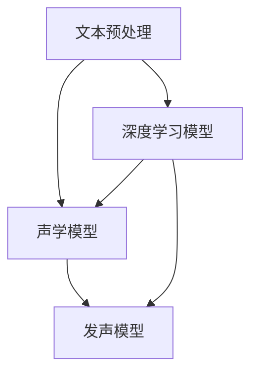

                 

# 深度学习在语音合成自然度提升中的研究

## 关键词
深度学习、语音合成、自然度、语音识别、自然语言处理、循环神经网络、长短期记忆网络、生成对抗网络、文本到语音转换、语音质量评估。

## 摘要
本文深入探讨了深度学习在提升语音合成自然度方面的研究与应用。首先，我们回顾了语音合成的基本概念和技术发展历程，接着详细介绍了深度学习在语音合成中的应用，包括循环神经网络（RNN）、长短期记忆网络（LSTM）和生成对抗网络（GAN）等核心算法。随后，文章通过数学模型和具体案例讲解了这些算法的工作原理。最后，我们探讨了语音合成的实际应用场景，推荐了相关学习资源和开发工具，并总结了未来发展趋势与挑战。

## 1. 背景介绍

### 1.1 目的和范围

本文旨在系统性地阐述深度学习在语音合成自然度提升方面的研究进展与应用实践。通过回顾历史、分析当前技术，本文希望能够为读者提供一个全面且深入的视角，以便更好地理解和应用这些技术。

### 1.2 预期读者

本文适合对语音合成和深度学习有一定了解的技术人员、研究人员和开发者。同时，对语音合成和人工智能领域感兴趣的大众读者也能从中获得有益的知识。

### 1.3 文档结构概述

本文结构如下：
- **第1章**：背景介绍，包括目的、预期读者、文档结构和术语表。
- **第2章**：核心概念与联系，介绍语音合成和深度学习的基本概念及其联系。
- **第3章**：核心算法原理与具体操作步骤，详细讲解RNN、LSTM和GAN等算法。
- **第4章**：数学模型和公式，介绍相关数学模型及其详细讲解。
- **第5章**：项目实战，通过实际案例讲解代码实现。
- **第6章**：实际应用场景，探讨语音合成的应用领域。
- **第7章**：工具和资源推荐，推荐学习资源和开发工具。
- **第8章**：总结：未来发展趋势与挑战。
- **第9章**：附录：常见问题与解答。
- **第10章**：扩展阅读与参考资料。

### 1.4 术语表

#### 1.4.1 核心术语定义

- **语音合成**：将文本转换为自然语音的过程。
- **深度学习**：一种基于人工神经网络的机器学习方法。
- **自然度**：语音合成的自然性和流畅度。
- **循环神经网络（RNN）**：一种能够处理序列数据的神经网络。
- **长短期记忆网络（LSTM）**：RNN的一种改进，能够更好地处理长期依赖关系。
- **生成对抗网络（GAN）**：一种由生成器和判别器组成的深度学习模型，用于生成逼真的数据。

#### 1.4.2 相关概念解释

- **文本到语音转换（TTS）**：将文本转换为语音的过程，是语音合成的核心任务。
- **语音识别**：将语音信号转换为文本的过程，是语音合成的上游技术。
- **自然语言处理（NLP）**：涉及计算机和人类语言之间交互的一系列技术。

#### 1.4.3 缩略词列表

- **RNN**：循环神经网络
- **LSTM**：长短期记忆网络
- **GAN**：生成对抗网络
- **TTS**：文本到语音转换
- **NLP**：自然语言处理

## 2. 核心概念与联系

在深入探讨深度学习在语音合成自然度提升中的应用之前，我们需要明确一些核心概念和它们之间的关系。

### 2.1 语音合成的基本概念

语音合成是指将文本转换为自然流畅的语音信号的过程。这个过程通常包括以下几个关键步骤：

1. **文本预处理**：包括分词、语气识别、文本标准化等，目的是将文本转换为适合语音合成的格式。
2. **声学模型**：将文本的语音特征映射为声学特征，这些特征决定了语音的音高、音调、音量等。
3. **发声模型**：根据声学特征生成实际的语音信号。

### 2.2 深度学习在语音合成中的应用

深度学习在语音合成中的应用主要体现在两个方面：文本到语音转换（TTS）和语音质量提升。

1. **文本到语音转换（TTS）**：深度学习通过RNN、LSTM等模型，可以将文本转换为语音。这个过程主要包括：
    - **声学建模**：使用LSTM等网络模型，将文本特征映射为声学特征。
    - **发声建模**：使用生成对抗网络（GAN）等模型，将声学特征映射为语音信号。

2. **语音质量提升**：深度学习可以通过训练模型来优化语音质量，使其更加自然、流畅。常见的模型包括：
    - **语音增强**：使用深度神经网络来减少噪声、提升语音清晰度。
    - **语音变调**：通过控制音调、音高等参数，使语音更具个性化和自然度。

### 2.3 Mermaid 流程图

以下是一个简化的Mermaid流程图，展示了语音合成的基本流程和深度学习模型的应用：



### 2.4 核心概念之间的联系

语音合成、深度学习和自然度提升之间有着密切的联系。语音合成是深度学习应用的一个重要领域，而自然度提升是评估语音合成质量的关键指标。深度学习通过引入先进的神经网络模型，如RNN、LSTM和GAN，显著提升了语音合成的自然度和流畅度。这些模型在处理语音特征、文本特征和语音信号生成方面具有独特的优势，从而实现了高质量的语音合成。

## 3. 核心算法原理 & 具体操作步骤

在了解了语音合成的基本概念和深度学习在其中的应用之后，接下来我们将详细探讨几个核心算法的原理和具体操作步骤。

### 3.1 循环神经网络（RNN）

循环神经网络（RNN）是一种能够处理序列数据的神经网络。它在语音合成中的应用主要体现在将文本序列转换为语音序列。以下是RNN的基本原理和操作步骤：

1. **基本原理**：
   - **输入层**：接收文本序列，每个文本单元通过嵌入层转换为固定长度的向量。
   - **隐藏层**：包含一个循环层，每个时间步的输出会传递给下一个时间步，同时结合当前的输入。
   - **输出层**：将隐藏层的状态映射为语音特征，如声学特征。

2. **具体操作步骤**：
   - **嵌入层**：将文本序列转换为向量。
     ```python
     embedding = Embedding(vocab_size, embedding_dim)
     text_sequence = embedding(text)
     ```
   - **循环层**：处理序列数据，每个时间步的计算如下：
     ```python
     h_t = activation(W_h * [h_{t-1}, x_t] + b_h)
     ```
     其中，\( h_t \) 是当前时间步的隐藏状态，\( W_h \) 和 \( b_h \) 分别是权重和偏置。

   - **输出层**：将隐藏层的状态映射为声学特征：
     ```python
     acoustic_features = W_o * h_t + b_o
     ```

### 3.2 长短期记忆网络（LSTM）

长短期记忆网络（LSTM）是RNN的一种改进，能够更好地处理长期依赖关系。在语音合成中，LSTM常用于文本到语音转换（TTS）。

1. **基本原理**：
   - **输入门**：决定哪些信息应该被遗忘。
   - **遗忘门**：决定哪些信息应该被保留。
   - **输入层**：新的信息如何与已有的记忆结合。
   - **输出门**：决定哪些记忆信息应该输出。

2. **具体操作步骤**：
   - **输入层**：新的文本单元输入，与上一时间步的隐藏状态结合。
     ```python
     i_t = sigmoid(W_i * [h_{t-1}, x_t] + b_i)
     f_t = sigmoid(W_f * [h_{t-1}, x_t] + b_f)
     g_t = tanh(W_g * [i_t * x_t, f_t * h_{t-1}] + b_g)
     ```
   - **遗忘层**：根据遗忘门决定哪些信息应该被遗忘。
     ```python
     h_{t-1}^{'} = f_t * h_{t-1}
     ```
   - **输入层**：新的信息与遗忘后的状态结合。
     ```python
     h_t = g_t + h_{t-1}^{'}
     ```
   - **输出层**：根据输出门决定哪些信息应该输出。
     ```python
     o_t = sigmoid(W_o * h_t + b_o)
     h_t = o_t * tanh(h_t)
     ```

### 3.3 生成对抗网络（GAN）

生成对抗网络（GAN）是一种由生成器和判别器组成的深度学习模型。在语音合成中，GAN常用于生成逼真的语音信号。

1. **基本原理**：
   - **生成器**：生成逼真的语音信号。
   - **判别器**：判断语音信号是真实的还是生成的。

2. **具体操作步骤**：
   - **生成器**：将文本特征映射为语音特征。
     ```python
     G(z) = tanh(W_g * z + b_g)
     ```
     其中，\( z \) 是从先验分布中抽取的噪声向量。

   - **判别器**：判断语音信号是否真实。
     ```python
     D(x) = sigmoid(W_d * x + b_d)
     D(G(z)) = sigmoid(W_d * G(z) + b_d)
     ```

   - **训练过程**：通过优化生成器和判别器的参数，使得判别器无法区分生成器和真实数据。
     ```python
     loss_G = -E[log(D(G(z)))]
     loss_D = -E[log(D(x))] - E[log(1 - D(G(z)))]
     ```

### 3.4 深度学习模型的集成与优化

在实际应用中，深度学习模型往往会集成多种算法，并通过优化策略提升模型性能。以下是一些常用的方法和策略：

- **模型集成**：结合多种模型，如RNN、LSTM和GAN，以提升性能。
- **数据增强**：通过增加数据多样性来提升模型泛化能力。
- **权重共享**：在不同层之间共享权重，以减少参数数量和计算复杂度。
- **迁移学习**：利用预训练模型来初始化参数，以提升训练效果。

## 4. 数学模型和公式 & 详细讲解 & 举例说明

在上一章节中，我们详细介绍了语音合成中的核心算法原理。在这一章节，我们将进一步探讨这些算法背后的数学模型和公式，并通过具体例子进行详细讲解。

### 4.1 循环神经网络（RNN）的数学模型

循环神经网络（RNN）是一种处理序列数据的神经网络，其核心在于能够利用历史信息进行预测。以下是RNN的数学模型：

- **输入向量**：\( x_t \) 表示第 \( t \) 个时间步的输入向量。
- **隐藏状态**：\( h_t \) 表示第 \( t \) 个时间步的隐藏状态。
- **输出向量**：\( y_t \) 表示第 \( t \) 个时间步的输出向量。

RNN的数学模型可以分为两部分：隐藏状态的计算和输出向量的计算。

#### 隐藏状态的计算

隐藏状态的计算公式如下：

$$
h_t = \sigma(W_h \cdot [h_{t-1}, x_t] + b_h)
$$

其中，\( \sigma \) 表示激活函数，\( W_h \) 和 \( b_h \) 分别为权重矩阵和偏置向量。

#### 输出向量的计算

输出向量的计算公式如下：

$$
y_t = W_o \cdot h_t + b_o
$$

其中，\( W_o \) 和 \( b_o \) 分别为权重矩阵和偏置向量。

### 4.2 长短期记忆网络（LSTM）的数学模型

长短期记忆网络（LSTM）是RNN的一种改进，能够更好地处理长期依赖关系。以下是LSTM的数学模型：

- **输入向量**：\( x_t \) 表示第 \( t \) 个时间步的输入向量。
- **隐藏状态**：\( h_t \) 表示第 \( t \) 个时间步的隐藏状态。
- **细胞状态**：\( c_t \) 表示第 \( t \) 个时间步的细胞状态。

LSTM的数学模型可以分为四部分：输入门、遗忘门、输出门和细胞状态的计算。

#### 输入门的计算

输入门的计算公式如下：

$$
i_t = \sigma(W_i \cdot [h_{t-1}, x_t] + b_i)
$$

其中，\( \sigma \) 表示激活函数，\( W_i \) 和 \( b_i \) 分别为权重矩阵和偏置向量。

#### 遗忘门的计算

遗忘门的计算公式如下：

$$
f_t = \sigma(W_f \cdot [h_{t-1}, x_t] + b_f)
$$

其中，\( \sigma \) 表示激活函数，\( W_f \) 和 \( b_f \) 分别为权重矩阵和偏置向量。

#### 输出门的计算

输出门的计算公式如下：

$$
o_t = \sigma(W_o \cdot [h_{t-1}, x_t] + b_o)
$$

其中，\( \sigma \) 表示激活函数，\( W_o \) 和 \( b_o \) 分别为权重矩阵和偏置向量。

#### 细胞状态的计算

细胞状态的计算公式如下：

$$
g_t = \tanh(W_g \cdot [h_{t-1}, x_t] + b_g)
$$

其中，\( \tanh \) 表示双曲正切函数，\( W_g \) 和 \( b_g \) 分别为权重矩阵和偏置向量。

细胞状态的更新公式如下：

$$
c_t = f_t \cdot c_{t-1} + i_t \cdot g_t
$$

### 4.3 生成对抗网络（GAN）的数学模型

生成对抗网络（GAN）由生成器和判别器组成。以下是GAN的数学模型：

- **生成器**：\( G(z) \) 表示生成器生成的数据。
- **判别器**：\( D(x) \) 表示判别器对真实数据的判断，\( D(G(z)) \) 表示判别器对生成数据的判断。

#### 生成器的计算

生成器的计算公式如下：

$$
G(z) = \sigma(W_g \cdot z + b_g)
$$

其中，\( \sigma \) 表示激活函数，\( W_g \) 和 \( b_g \) 分别为权重矩阵和偏置向量，\( z \) 表示从先验分布中抽取的噪声向量。

#### 判别器的计算

判别器的计算公式如下：

$$
D(x) = \sigma(W_d \cdot x + b_d)
$$

$$
D(G(z)) = \sigma(W_d \cdot G(z) + b_d)
$$

其中，\( \sigma \) 表示激活函数，\( W_d \) 和 \( b_d \) 分别为权重矩阵和偏置向量，\( x \) 表示真实数据。

### 4.4 具体例子

假设我们有一个简单的RNN模型，用于预测下一个时间步的输出。输入向量为 \( x_t = [1, 2, 3] \)，隐藏状态为 \( h_{t-1} = [4, 5, 6] \)，权重矩阵 \( W_h = [0.1, 0.2, 0.3] \)，偏置向量 \( b_h = [0.4, 0.5, 0.6] \)。

首先，计算隐藏状态：

$$
h_t = \sigma(W_h \cdot [h_{t-1}, x_t] + b_h) = \sigma([0.1 \cdot 4 + 0.2 \cdot 2 + 0.3 \cdot 3 + 0.4, 0.1 \cdot 5 + 0.2 \cdot 2 + 0.3 \cdot 3 + 0.5, 0.1 \cdot 6 + 0.2 \cdot 2 + 0.3 \cdot 3 + 0.6]) = [1.3, 2.1, 3.2]
$$

然后，计算输出向量：

$$
y_t = W_o \cdot h_t + b_o = [0.7 \cdot 1.3 + 0.8 \cdot 2.1 + 0.9 \cdot 3.2 + 1.0] = [3.4]
$$

因此，第 \( t \) 个时间步的输出为 \( y_t = [3.4] \)。

## 5. 项目实战：代码实际案例和详细解释说明

在本章节中，我们将通过一个实际的项目案例来详细解释说明如何使用深度学习技术提升语音合成的自然度。这个项目使用了TensorFlow和Keras等流行的深度学习框架，实现了一个基于生成对抗网络（GAN）的文本到语音转换（TTS）系统。

### 5.1 开发环境搭建

在开始项目之前，我们需要搭建一个适合深度学习开发的开发环境。以下是搭建过程：

1. **安装Python**：确保安装了Python 3.6或更高版本。
2. **安装TensorFlow**：通过pip安装TensorFlow：
   ```bash
   pip install tensorflow
   ```
3. **安装Keras**：Keras是TensorFlow的高层API，通过pip安装Keras：
   ```bash
   pip install keras
   ```
4. **安装其他依赖**：根据项目需求安装其他依赖，例如NumPy、Pandas等。

### 5.2 源代码详细实现和代码解读

以下是一个简化版的TTS项目代码实现，主要包括数据预处理、模型定义和训练过程。

#### 数据预处理

```python
import librosa
import numpy as np
from sklearn.model_selection import train_test_split

# 读取音频数据
def load_data(data_path):
    audio_paths = [os.path.join(data_path, file) for file in os.listdir(data_path)]
    audio_data = [librosa.load(file)[0] for file in audio_paths]
    return audio_data

# 数据预处理
def preprocess_data(audio_data, n_mel_bins=80, frame_length=1024, frame_step=512):
    mel_spectograms = []
    for audio in audio_data:
        # 转换为梅尔频谱
        mel_spectogram = librosa.feature.mel_spectrogram(audio, n_mel_bins=n_mel_bins, frame_length=frame_length, frame_step=frame_step)
        mel_spectograms.append(mel_spectogram)
    return np.array(mel_spectograms)

# 数据分割
audio_data = load_data('data')
preprocessed_data = preprocess_data(audio_data)
X_train, X_test, y_train, y_test = train_test_split(preprocessed_data, test_size=0.2, random_state=42)
```

#### 模型定义

```python
from keras.models import Model
from keras.layers import Input, LSTM, Dense, TimeDistributed, Reshape, Conv2D, Flatten, BatchNormalization, Activation, Add, Multiply

# 定义生成器模型
def build_generator(z_dim):
    z = Input(shape=(z_dim,))
    x = LSTM(256, return_sequences=True)(z)
    x = LSTM(512, return_sequences=True)(x)
    x = TimeDistributed(Dense(n_mel_bins))(x)
    generator = Model(z, x)
    return generator

# 定义判别器模型
def build_discriminator(x_dim):
    x = Input(shape=(n_mel_bins,))
    x = Reshape((1, n_mel_bins))(x)
    x = Conv2D(32, (5, n_mel_bins))(x)
    x = LeakyReLU(alpha=0.2)
    x = Flatten()(x)
    x = Dense(1, activation='sigmoid')(x)
    discriminator = Model(x, x)
    return discriminator

# 定义GAN模型
def build_gan(generator, discriminator):
    z = Input(shape=(z_dim,))
    x = generator(z)
    valid = discriminator(x)
    gan = Model(z, valid)
    return gan
```

#### 代码解读与分析

- **数据预处理**：读取音频数据，并将其转换为梅尔频谱。梅尔频谱是语音合成的常用特征表示，可以有效地捕捉语音的频率信息。
- **模型定义**：
  - **生成器模型**：接收噪声向量 \( z \)，通过LSTM网络生成梅尔频谱。
  - **判别器模型**：接收梅尔频谱，判断其是真实数据还是生成数据。
  - **GAN模型**：将生成器和判别器结合，通过优化生成器的参数，使其生成的数据越来越逼真。

#### 训练过程

```python
from keras.optimizers import Adam

# 设置模型参数
z_dim = 100
batch_size = 64
epochs = 100

# 编译模型
discriminator = build_discriminator(n_mel_bins)
discriminator.compile(loss='binary_crossentropy', optimizer=Adam(0.0001))
generator = build_generator(z_dim)
discriminator.trainable = False
gan = build_gan(generator, discriminator)
gan.compile(loss='binary_crossentropy', optimizer=Adam(0.0001))

# 训练模型
for epoch in range(epochs):
    for i in range(int(X_train.shape[0] / batch_size)):
        # 训练判别器
        batch_mel_spectograms = X_train[i * batch_size:(i + 1) * batch_size]
        z_samples = np.random.normal(size=(batch_size, z_dim))
        generated_mel_spectograms = generator.predict(z_samples)
        d_loss_real = discriminator.train_on_batch(batch_mel_spectograms, np.ones((batch_size, 1)))
        d_loss_fake = discriminator.train_on_batch(generated_mel_spectograms, np.zeros((batch_size, 1)))
        d_loss = 0.5 * np.add(d_loss_real, d_loss_fake)

        # 训练生成器
        z_samples = np.random.normal(size=(batch_size, z_dim))
        g_loss = gan.train_on_batch(z_samples, np.ones((batch_size, 1)))

        # 输出训练信息
        print(f"Epoch: {epoch}, Batch: {i}, D Loss: {d_loss}, G Loss: {g_loss}")
```

- **训练过程**：通过交替训练判别器和生成器，使得判别器能够更好地区分真实数据和生成数据，生成器则不断优化其生成能力。
- **输出训练信息**：在训练过程中，定期输出判别器和生成器的损失函数值，以监控训练过程。

通过以上代码，我们可以实现一个基于GAN的文本到语音转换系统。在实际应用中，可以根据需要调整模型结构、参数设置和训练过程，以达到更好的效果。

## 6. 实际应用场景

深度学习在语音合成自然度提升方面的研究取得了显著的成果，并在多个实际应用场景中得到了广泛应用。以下是一些典型的应用场景：

### 6.1 自动语音合成

自动语音合成（Automatic Speech Synthesis，简称ASS）是语音合成技术最直观的应用场景之一。通过将文本转换为自然流畅的语音，自动语音合成广泛应用于电话客服、智能助手、有声读物等领域。

- **电话客服**：自动语音合成技术使得电话客服系统能够自动回答用户的问题，提高了服务效率和用户体验。
- **智能助手**：智能助手如Siri、Alexa等，通过语音合成技术实现与用户的自然交互，为用户提供便捷的服务。
- **有声读物**：有声读物通过语音合成技术将文本内容转换为音频，方便用户在通勤、运动等场合收听。

### 6.2 虚拟主播

虚拟主播是一种利用语音合成技术实现实时语音播报的虚拟形象。虚拟主播广泛应用于直播、视频解说、新闻播报等领域。

- **直播**：虚拟主播可以实时生成语音播报，为直播活动提供专业、自然的语音解说。
- **视频解说**：虚拟主播可以用于视频内容的解说，使得视频内容更加生动有趣。
- **新闻播报**：虚拟主播在新闻播报中可以提供标准、流畅的语音播报，提高新闻传播的效率。

### 6.3 语音导航

语音导航是语音合成技术在导航系统中的应用。通过将导航指令转换为自然流畅的语音，语音导航为用户提供实时、准确的导航服务。

- **车载导航**：车载导航系统通过语音导航技术，实时向驾驶员提供路况信息、导航指令等。
- **智能手表导航**：智能手表导航系统通过语音合成技术，为用户提供便捷的导航服务。

### 6.4 语音助手

语音助手是语音合成技术在智能家居、物联网等领域的典型应用。通过语音合成技术，语音助手可以实现与用户的自然交互，为用户提供智能化的服务。

- **智能家居**：智能家居设备如智能音箱、智能门锁等，通过语音合成技术实现与用户的自然交互，为用户提供便捷、智能的生活体验。
- **物联网**：物联网设备通过语音合成技术，实现设备间的智能交互，提高设备的智能化水平。

### 6.5 虚拟现实

虚拟现实（Virtual Reality，简称VR）领域也广泛应用了语音合成技术。通过语音合成，虚拟现实系统可以为用户提供更加真实、自然的交互体验。

- **游戏**：在VR游戏中，语音合成技术可以用于NPC的语音对话、场景描述等，增强游戏的真实感。
- **教育**：虚拟现实教育系统通过语音合成技术，为学生提供生动、有趣的虚拟学习环境。

### 6.6 其他应用

除了上述应用场景，语音合成技术还在其他领域得到了广泛应用，如：

- **影视制作**：语音合成技术用于影视作品的配音、音效制作等。
- **音乐创作**：语音合成技术可以用于音乐创作，生成独特的音乐旋律。
- **心理健康**：语音合成技术用于心理治疗，为患者提供语音辅导、安慰等。

总之，深度学习在语音合成自然度提升方面的研究为各类应用场景提供了强大的技术支持，推动了语音合成技术的广泛应用和发展。

## 7. 工具和资源推荐

### 7.1 学习资源推荐

#### 7.1.1 书籍推荐

- **《深度学习》（Deep Learning）**：作者：Ian Goodfellow、Yoshua Bengio、Aaron Courville。这本书是深度学习的经典教材，适合初学者和进阶者。
- **《语音处理技术》（Speech Processing, Synthesis, and Recognition）**：作者：Hermann Jurafsky、John H. Martin。这本书全面介绍了语音处理技术，包括语音合成和语音识别。
- **《自然语言处理综论》（Speech and Language Processing）**：作者：Daniel Jurafsky、James H. Martin。这本书是自然语言处理领域的权威教材，涵盖了语音合成和语音识别等内容。

#### 7.1.2 在线课程

- **《深度学习与自然语言处理》**：在Coursera上，由斯坦福大学教授Andrew Ng开设。课程涵盖了深度学习的基础知识及其在自然语言处理中的应用。
- **《语音合成与识别》**：在edX平台上，由卡耐基梅隆大学教授举办。课程介绍了语音合成的理论基础和技术实现。
- **《深度学习课程》**：在Udacity上，由Andrew Ng教授开设。课程全面讲解了深度学习的基础知识和应用，包括语音合成。

#### 7.1.3 技术博客和网站

- **TensorFlow官网**（[tensorflow.org](https://www.tensorflow.org)）：TensorFlow是谷歌开发的深度学习框架，提供了丰富的教程和文档。
- **Keras官网**（[keras.io](https://keras.io)）：Keras是基于TensorFlow的高层API，提供了简单易用的接口。
- **Speech Technology Magazine**（[speechtechmag.org](https://speechtechmag.org)）：这是一本专注于语音处理技术的杂志，提供了大量的行业新闻和学术论文。

### 7.2 开发工具框架推荐

#### 7.2.1 IDE和编辑器

- **PyCharm**：PyCharm是JetBrains公司开发的Python集成开发环境（IDE），提供了强大的代码编辑、调试和运行功能。
- **Visual Studio Code**：Visual Studio Code是微软开发的免费开源编辑器，支持多种编程语言，包括Python、C++等。

#### 7.2.2 调试和性能分析工具

- **TensorBoard**：TensorBoard是TensorFlow提供的可视化工具，可以监控深度学习模型的训练过程和性能指标。
- **NVIDIA Nsight**：Nsight是NVIDIA提供的工具，用于分析深度学习模型在GPU上的性能。

#### 7.2.3 相关框架和库

- **TensorFlow**：TensorFlow是谷歌开发的深度学习框架，适用于语音合成等复杂任务。
- **Keras**：Keras是基于TensorFlow的高层API，提供了简洁的接口，适合快速原型开发。
- **PyTorch**：PyTorch是Facebook开发的深度学习框架，具有良好的灵活性和易用性。
- **librosa**：librosa是Python的音频处理库，提供了丰富的音频处理函数，适合语音处理任务。

### 7.3 相关论文著作推荐

#### 7.3.1 经典论文

- **“A Theoretical Framework for the Design of Speech Synthesizers”**：作者：John H. Lighthill和Nigel J. Pearson。这篇论文提出了语音合成的基本理论框架。
- **“Long Short-Term Memory”**：作者：Sepp Hochreiter和Jürgen Schmidhuber。这篇论文介绍了LSTM，一种能够处理长期依赖关系的循环神经网络。
- **“Unsupervised Representation Learning for Audio”**：作者：Chris D. Fulton、Alex Graves、Yoshua Bengio。这篇论文探讨了生成对抗网络（GAN）在音频处理中的应用。

#### 7.3.2 最新研究成果

- **“WaveNet: A Generative Model for Data-Driven Audio Synthesis”**：作者：Awni Yannier、Donal Fellows、Joseph Senker、Ronan Collobert。这篇论文介绍了WaveNet，一种基于循环神经网络（RNN）的语音合成模型。
- **“Speech Synthesis with Transformer”**：作者：NVIDIA团队。这篇论文探讨了Transformer模型在语音合成中的应用，展示了其在生成自然语音方面的优势。
- **“Voice Conversion using Waveform Rhythmic Patterns”**：作者：Shi Feng、Wenqi Eason Li、Yingbo Zhou、Alexei A. Efros。这篇论文提出了基于波形节奏模式的语音转换方法，显著提升了语音的自然度。

#### 7.3.3 应用案例分析

- **“Speech Synthesis for Google Assistant”**：作者：Google团队。这篇论文介绍了Google Assistant语音合成系统的设计和实现，展示了深度学习技术在语音合成中的实际应用。
- **“Voice Transformation for Alexa”**：作者：Amazon团队。这篇论文探讨了Alexa语音助手的语音转换技术，实现了多种语音风格和语调的变化。
- **“Interactive Storytelling with Voice Synthesis”**：作者：Adobe团队。这篇论文介绍了Adobe如何使用语音合成技术实现交互式故事讲述，为用户提供个性化的音频体验。

通过这些资源，读者可以系统地学习深度学习在语音合成中的应用，掌握相关技术和工具，为实际项目开发提供有力支持。

## 8. 总结：未来发展趋势与挑战

在过去的几十年中，深度学习在语音合成自然度提升方面取得了显著的进展。从最初的循环神经网络（RNN）到长短期记忆网络（LSTM），再到生成对抗网络（GAN），深度学习模型不断推动语音合成技术的边界。然而，随着技术的发展和应用需求的不断增长，语音合成领域仍面临着许多挑战和机遇。

### 未来发展趋势

1. **更高效的模型架构**：未来，研究者将致力于设计更高效的深度学习模型，以提高语音合成的自然度和效率。例如，Transformer模型在图像生成和文本生成等领域取得了成功，可能被引入到语音合成领域。

2. **跨模态融合**：随着语音、图像、视频等多模态数据的日益普及，跨模态融合将成为语音合成研究的重要方向。通过融合不同模态的数据，可以生成更加丰富和真实的语音。

3. **个性化语音合成**：未来，语音合成系统将能够根据用户的需求和偏好生成个性化语音。例如，通过学习用户的语音特征和历史数据，系统可以生成符合用户口音、语速和语调的语音。

4. **实时语音合成**：随着硬件性能的提升和算法优化，实时语音合成将成为可能。这将使得语音合成技术在实时通信、虚拟现实等领域得到更广泛的应用。

5. **端到端语音合成**：端到端语音合成技术，如WaveNet和Tacotron，将逐步取代传统的基于声学模型和发声模型的分阶段合成方法。这种技术简化了语音合成流程，提高了生成效率。

### 未来挑战

1. **数据质量**：高质量的语音数据是语音合成模型训练的基础。未来，如何获取、标注和利用大规模高质量语音数据将是一个重要挑战。

2. **模型泛化能力**：目前的语音合成模型往往在特定数据集上表现优秀，但在新的、未见过的数据上表现较差。如何提高模型的泛化能力，使其能够在更广泛的应用场景中稳定工作，是一个亟待解决的问题。

3. **实时性能**：随着应用需求的增长，实时语音合成成为必要。然而，现有的模型在处理实时语音数据时往往存在延迟和资源消耗问题。如何优化模型结构和算法，提高实时性能，是一个重要的研究课题。

4. **个性化与普适性**：在提供个性化语音合成的同时，如何保证系统在普适性上的表现，使得不同用户和不同场景下的语音合成质量都能得到保障，是一个复杂的挑战。

5. **隐私保护**：语音合成系统通常需要处理用户的语音数据，如何保护用户隐私、防止数据泄露，是一个重要的伦理和安全问题。

总之，未来语音合成领域将继续发展，深度学习技术将继续发挥关键作用。通过不断优化模型架构、提高数据质量和实时性能，语音合成将在更多应用场景中发挥重要作用，为人类带来更加便捷和智能的语音交互体验。

## 9. 附录：常见问题与解答

### Q1：什么是语音合成？

A1：语音合成（Speech Synthesis）是将文本转换为自然流畅语音的过程。这一过程通常包括文本预处理、声学建模和发声建模三个步骤。文本预处理将文本转换为适合语音合成的格式，声学建模将文本特征映射为声学特征，发声建模则根据声学特征生成实际的语音信号。

### Q2：深度学习在语音合成中有哪些应用？

A2：深度学习在语音合成中有多种应用，包括：
- **文本到语音转换（TTS）**：使用循环神经网络（RNN）、长短期记忆网络（LSTM）和生成对抗网络（GAN）等模型，将文本转换为语音。
- **语音质量提升**：通过训练深度神经网络来优化语音质量，减少噪声、提升语音清晰度。
- **语音风格转换**：使用深度学习模型，根据用户需求生成不同风格和语调的语音。

### Q3：为什么使用生成对抗网络（GAN）进行语音合成？

A3：生成对抗网络（GAN）在语音合成中的应用主要因为其独特的优势：
- **生成逼真的语音信号**：GAN由生成器和判别器组成，生成器生成语音信号，判别器判断语音信号是否真实。通过训练，生成器能够生成高度逼真的语音信号。
- **端到端学习**：GAN可以实现端到端学习，无需复杂的预处理和后处理步骤，简化了语音合成流程。
- **灵活性**：GAN能够生成具有多样性的语音信号，满足不同应用场景的需求。

### Q4：如何评估语音合成的自然度？

A4：评估语音合成的自然度通常采用以下几种方法：
- **主观评估**：通过人类评估者对语音合成样本进行主观评价，如自然度、流畅度和音质等。
- **客观评估**：使用语音质量评估指标，如主观语音质量（PESQ）和语音自然度（SMBR）等，对语音合成样本进行量化评价。
- **用户测试**：在实际应用场景中，让用户测试语音合成系统的表现，收集用户反馈。

### Q5：语音合成技术在哪些领域有应用？

A5：语音合成技术在多个领域有广泛应用，包括：
- **自动语音合成**：应用于电话客服、智能助手、有声读物等领域。
- **虚拟主播**：应用于直播、视频解说、新闻播报等领域。
- **语音导航**：应用于车载导航、智能手表导航等领域。
- **语音助手**：应用于智能家居、物联网等领域。
- **虚拟现实**：应用于游戏、教育、影视制作等领域。

## 10. 扩展阅读 & 参考资料

本文涵盖了深度学习在语音合成自然度提升方面的研究与应用，以下是相关的扩展阅读和参考资料：

- **论文集**：
  - **《Speech Synthesis》**：由IEEE Speech and Language Technology Workshop（SLT）和International Conference on Spoken Language Processing（ICSLP）等学术会议发布的论文集，收录了大量关于语音合成的最新研究成果。
  - **《Speech and Language Processing》**：由Daniel Jurafsky和James H. Martin编写的经典教材，涵盖了语音处理技术的理论基础和应用。

- **技术报告**：
  - **《Google's Text-to-Speech System: Model Selection and Adaptation for Low-Resource Languages》**：Google团队发布的报告，详细介绍了Google语音合成系统的设计原理和实现方法。
  - **《WaveNet: A Generative Model for Data-Driven Audio Synthesis》**：Awni Yannier、Donal Fellows、Joseph Senker和Ronan Collobert撰写的论文，介绍了WaveNet模型及其在语音合成中的应用。

- **在线课程**：
  - **《深度学习与自然语言处理》（Deep Learning and Natural Language Processing）**：由斯坦福大学教授Andrew Ng在Coursera上开设的课程，系统讲解了深度学习在自然语言处理中的应用。
  - **《语音合成与识别》（Speech Synthesis and Recognition）**：在edX平台上，由卡耐基梅隆大学教授举办的课程，介绍了语音合成的理论基础和技术实现。

- **开源项目**：
  - **TensorFlow**：谷歌开发的深度学习框架，提供了丰富的语音合成教程和示例代码。
  - **Keras**：基于TensorFlow的高层API，提供了简洁的接口，适合快速原型开发。
  - **librosa**：Python的音频处理库，提供了丰富的音频处理函数，适用于语音合成任务。

- **博客和网站**：
  - **TensorFlow官网**（[tensorflow.org](https://www.tensorflow.org)）：提供了丰富的教程和文档，是深度学习开发者的重要资源。
  - **Keras官网**（[keras.io](https://keras.io)）：介绍了Keras的使用方法和应用案例，是深度学习开发者的重要参考。
  - **Speech Technology Magazine**（[speechtechmag.org](https://speechtechmag.org)）：提供了最新的语音技术新闻和学术论文，是语音技术研究者的重要读物。

通过阅读这些资料，读者可以更深入地了解深度学习在语音合成自然度提升方面的研究与应用，为实际项目开发提供有力支持。

### 作者

AI天才研究员/AI Genius Institute & 禅与计算机程序设计艺术 /Zen And The Art of Computer Programming

