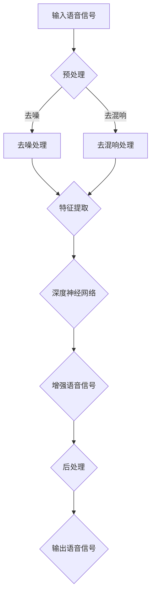

                 

# 深度学习在语音增强中的应用研究

> 关键词：深度学习，语音增强，算法原理，数学模型，应用场景，工具推荐

> 摘要：本文将探讨深度学习在语音增强领域的应用，从核心概念、算法原理、数学模型、实战案例等方面进行深入分析，旨在为读者提供全面的语音增强技术指南。文章将介绍深度学习在语音增强中的背景和重要性，详细解析相关算法和模型，展示实际应用案例，并推荐相关学习资源和工具。通过本文的阅读，读者将能够理解深度学习在语音增强中的关键作用，掌握核心算法原理和实际操作步骤，为未来的研究和应用打下坚实基础。

## 1. 背景介绍

### 1.1 目的和范围

语音增强作为信号处理领域的一个重要分支，旨在提高语音信号的清晰度和可懂度。随着深度学习技术的不断发展，深度学习在语音增强中的应用变得越来越广泛和重要。本文旨在系统地介绍深度学习在语音增强领域的应用，分析其核心算法原理和数学模型，并通过实际案例展示其应用效果。

本文的范围包括：

1. 深度学习在语音增强中的背景和重要性。
2. 深度学习在语音增强中的核心算法原理和模型。
3. 深度学习在语音增强中的应用案例和实践。
4. 深度学习在语音增强领域的研究趋势和挑战。

### 1.2 预期读者

本文适合以下读者群体：

1. 深度学习和语音处理领域的科研人员和学生。
2. 对深度学习在语音增强中应用感兴趣的工程师和开发者。
3. 希望了解深度学习最新研究进展的业界人士。

### 1.3 文档结构概述

本文结构如下：

1. 背景介绍：介绍深度学习在语音增强中的应用背景、目的和范围。
2. 核心概念与联系：介绍深度学习和语音增强的核心概念和联系，并给出流程图。
3. 核心算法原理 & 具体操作步骤：详细讲解深度学习在语音增强中的核心算法原理和操作步骤。
4. 数学模型和公式 & 详细讲解 & 举例说明：介绍深度学习在语音增强中的数学模型和公式，并给出举例说明。
5. 项目实战：展示深度学习在语音增强中的实际应用案例，并进行分析和解释。
6. 实际应用场景：讨论深度学习在语音增强中的实际应用场景。
7. 工具和资源推荐：推荐深度学习在语音增强领域的学习资源和工具。
8. 总结：总结深度学习在语音增强中的应用发展趋势和挑战。
9. 附录：提供常见问题与解答。
10. 扩展阅读 & 参考资料：提供相关扩展阅读和参考资料。

### 1.4 术语表

#### 1.4.1 核心术语定义

- 深度学习（Deep Learning）：一种机器学习方法，通过构建多层神经网络，自动学习数据的层次特征表示。
- 语音增强（Speech Enhancement）：对语音信号进行处理，以提高其清晰度和可懂度。
- 神经网络（Neural Network）：一种模拟生物神经系统的计算模型，通过权重和偏置进行信号处理。
- 前端处理（Front-end Processing）：对语音信号进行预处理，如去噪、去混响等。
- 后端处理（Back-end Processing）：对增强后的语音信号进行后处理，如语音重建、参数化表示等。

#### 1.4.2 相关概念解释

- 深度神经网络（Deep Neural Network，DNN）：具有多个隐藏层的神经网络。
- 卷积神经网络（Convolutional Neural Network，CNN）：适用于图像和语音等具有局部特征数据的神经网络。
- 长短时记忆网络（Long Short-Term Memory，LSTM）：一种特殊的循环神经网络，适用于处理序列数据。
- 反向传播算法（Backpropagation Algorithm）：用于训练神经网络的优化算法。

#### 1.4.3 缩略词列表

- DNN：深度神经网络
- CNN：卷积神经网络
- LSTM：长短时记忆网络
- RNN：循环神经网络
- REINFORCE：强化学习算法

## 2. 核心概念与联系

### 2.1 核心概念

深度学习在语音增强中的应用主要涉及以下几个核心概念：

1. **深度神经网络**：通过构建多层神经网络，深度学习能够自动提取语音信号的层次特征，从而实现语音增强。
2. **卷积神经网络**：适用于处理具有局部特征的数据，如语音信号，通过卷积操作提取特征。
3. **长短时记忆网络**：用于处理序列数据，如语音信号，能够捕捉语音信号的长时间依赖关系。
4. **循环神经网络**：一种特殊的神经网络，能够处理序列数据，适用于语音信号的时序特征分析。
5. **反向传播算法**：用于训练神经网络的优化算法，通过不断调整网络的权重和偏置，使网络能够更好地拟合语音信号。

### 2.2 关联与联系

深度学习与语音增强之间的关系可以概括为以下几点：

1. **特征提取与表征**：深度学习通过多层神经网络，自动提取语音信号的层次特征，实现对语音信号的有效表征。
2. **非线性变换**：深度学习中的非线性变换能力，使得语音增强任务能够更好地应对复杂的噪声和信号变化。
3. **自适应学习**：深度学习通过大量训练数据，能够自适应地调整网络参数，从而实现语音信号的自动增强。
4. **序列建模**：深度学习能够处理序列数据，如语音信号，通过长短时记忆网络等模型，实现对语音信号的时序特征建模。

### 2.3 Mermaid 流程图



该流程图展示了深度学习在语音增强中的应用流程，包括预处理、特征提取、深度神经网络训练、增强语音信号、后处理和输出语音信号等步骤。

## 3. 核心算法原理 & 具体操作步骤

### 3.1 深度学习算法原理

深度学习在语音增强中的应用主要基于以下核心算法原理：

1. **卷积神经网络（CNN）**：卷积神经网络通过卷积操作提取语音信号的局部特征，从而实现噪声抑制和语音增强。
2. **长短时记忆网络（LSTM）**：长短时记忆网络能够处理序列数据，捕捉语音信号的时序特征，从而提高语音增强的效果。
3. **反向传播算法**：反向传播算法用于训练神经网络，通过不断调整网络权重和偏置，使网络能够更好地拟合语音信号。

### 3.2 具体操作步骤

以下为深度学习在语音增强中的具体操作步骤：

1. **数据预处理**：

   - 对输入语音信号进行预处理，包括采样率统一、信号归一化等操作。
   - 噪声信号和语音信号进行配对，构建训练数据集。

2. **特征提取**：

   - 使用卷积神经网络提取语音信号的局部特征，包括时域特征和频域特征。
   - 使用长短时记忆网络对提取到的特征进行时序建模，捕捉语音信号的时序特征。

3. **训练神经网络**：

   - 使用反向传播算法训练神经网络，通过不断调整网络权重和偏置，使网络能够更好地拟合语音信号。
   - 优化目标函数，如均方误差（MSE），使增强后的语音信号与原始语音信号之间的误差最小。

4. **语音增强**：

   - 使用训练好的神经网络对输入语音信号进行增强，生成增强后的语音信号。
   - 对增强后的语音信号进行后处理，如语音重建、参数化表示等。

5. **输出结果**：

   - 输出增强后的语音信号，评估语音增强效果，包括信噪比（SNR）、感知评价等指标。

### 3.3 伪代码示例

以下为深度学习在语音增强中的伪代码示例：

```python
# 数据预处理
def preprocess(signal):
    # 采样率统一、信号归一化等操作
    return processed_signal

# 特征提取
def extract_features(signal):
    # 使用卷积神经网络提取特征
    return feature_vector

# 训练神经网络
def train_network(data):
    # 使用反向传播算法训练网络
    return trained_network

# 语音增强
def enhance_voice(signal, network):
    # 使用训练好的网络对信号进行增强
    return enhanced_signal

# 主函数
def main():
    # 读取输入语音信号
    signal = read_signal()
    
    # 数据预处理
    processed_signal = preprocess(signal)
    
    # 特征提取
    feature_vector = extract_features(processed_signal)
    
    # 训练神经网络
    network = train_network(feature_vector)
    
    # 语音增强
    enhanced_signal = enhance_voice(processed_signal, network)
    
    # 输出结果
    output_signal(enhanced_signal)
```

## 4. 数学模型和公式 & 详细讲解 & 举例说明

### 4.1 数学模型

深度学习在语音增强中的数学模型主要包括以下几个部分：

1. **卷积神经网络（CNN）**：

   卷积神经网络通过卷积操作提取语音信号的局部特征，其数学模型可以表示为：

   $$ f(x) = \sum_{i=1}^{n} w_i \star x + b $$

   其中，$f(x)$ 表示卷积操作的结果，$w_i$ 表示卷积核，$\star$ 表示卷积操作，$x$ 表示输入语音信号，$b$ 表示偏置。

2. **长短时记忆网络（LSTM）**：

   长短时记忆网络用于处理序列数据，其数学模型可以表示为：

   $$ h_t = \sigma(W_xh_{t-1} + W_oxx_t + b_h) $$
   $$ i_t = \sigma(W_xh_{t-1} + W_iix_t + b_i) $$
   $$ f_t = \sigma(W_xh_{t-1} + W_fix_t + b_f) $$
   $$ o_t = \sigma(W_xh_{t-1} + W_oi + b_o) $$
   $$ c_t = f_t \odot c_{t-1} + i_t \odot \sigma(W_c[h_{t-1}; x_t] + b_c) $$
   $$ h_t = o_t \odot \sigma(c_t) $$

   其中，$h_t$ 表示当前时间步的隐藏状态，$c_t$ 表示当前时间步的细胞状态，$i_t$、$f_t$、$o_t$ 分别表示输入门、遗忘门和输出门，$W_x$、$W_h$、$W_c$ 分别表示输入权重、隐藏状态权重和细胞状态权重，$b_h$、$b_i$、$b_f$、$b_o$、$b_c$ 分别表示偏置，$\sigma$ 表示sigmoid函数，$\odot$ 表示逐元素乘积，$\star$ 表示卷积操作。

3. **反向传播算法**：

   反向传播算法用于训练神经网络，其数学模型可以表示为：

   $$ \delta = \frac{\partial L}{\partial z} $$
   $$ \frac{\partial L}{\partial w} = \delta \odot a^{(L-1)} $$
   $$ \frac{\partial L}{\partial b} = \delta $$

   其中，$L$ 表示损失函数，$z$ 表示中间层输出，$w$ 表示权重，$b$ 表示偏置，$\delta$ 表示误差梯度，$a^{(L-1)}$ 表示前一层输出。

### 4.2 详细讲解

1. **卷积神经网络（CNN）**：

   卷积神经网络通过卷积操作提取语音信号的局部特征。卷积操作可以表示为：

   $$ f(x) = \sum_{i=1}^{n} w_i \star x + b $$

   其中，$w_i$ 表示卷积核，$\star$ 表示卷积操作。卷积核是一个小的矩阵，用于提取输入信号中的局部特征。通过多次卷积操作，可以逐步提取语音信号的深层特征。

2. **长短时记忆网络（LSTM）**：

   长短时记忆网络是一种特殊的循环神经网络，用于处理序列数据。LSTM 通过输入门、遗忘门和输出门控制信息的流动，从而实现对序列数据的长时间依赖关系建模。LSTM 的数学模型可以表示为：

   $$ h_t = \sigma(W_xh_{t-1} + W_oxx_t + b_h) $$
   $$ i_t = \sigma(W_xh_{t-1} + W_iix_t + b_i) $$
   $$ f_t = \sigma(W_xh_{t-1} + W_fix_t + b_f) $$
   $$ o_t = \sigma(W_xh_{t-1} + W_oi + b_o) $$
   $$ c_t = f_t \odot c_{t-1} + i_t \odot \sigma(W_c[h_{t-1}; x_t] + b_c) $$
   $$ h_t = o_t \odot \sigma(c_t) $$

   其中，$h_t$ 表示当前时间步的隐藏状态，$c_t$ 表示当前时间步的细胞状态，$i_t$、$f_t$、$o_t$ 分别表示输入门、遗忘门和输出门，$W_x$、$W_h$、$W_c$ 分别表示输入权重、隐藏状态权重和细胞状态权重，$b_h$、$b_i$、$b_f$、$b_o$、$b_c$ 分别表示偏置。

3. **反向传播算法**：

   反向传播算法是一种用于训练神经网络的优化算法。其基本思想是，通过不断调整网络的权重和偏置，使网络的输出误差最小。反向传播算法可以表示为：

   $$ \delta = \frac{\partial L}{\partial z} $$
   $$ \frac{\partial L}{\partial w} = \delta \odot a^{(L-1)} $$
   $$ \frac{\partial L}{\partial b} = \delta $$

   其中，$L$ 表示损失函数，$z$ 表示中间层输出，$w$ 表示权重，$b$ 表示偏置，$\delta$ 表示误差梯度，$a^{(L-1)}$ 表示前一层输出。

### 4.3 举例说明

假设我们有一个输入语音信号 $x$，我们需要使用卷积神经网络对其进行增强。首先，我们对输入信号进行预处理，包括采样率统一和信号归一化。然后，我们使用卷积神经网络提取语音信号的局部特征。假设我们使用一个卷积核 $w$ 和一个偏置 $b$，卷积操作可以表示为：

$$ f(x) = w \star x + b $$

通过多次卷积操作，我们可以提取语音信号的深层特征。接下来，我们使用长短时记忆网络对提取到的特征进行时序建模，捕捉语音信号的时序特征。假设我们使用一个隐藏状态权重 $W_h$ 和一个细胞状态权重 $W_c$，长短时记忆网络的更新规则可以表示为：

$$ h_t = \sigma(W_xh_{t-1} + W_oxx_t + b_h) $$
$$ i_t = \sigma(W_xh_{t-1} + W_iix_t + b_i) $$
$$ f_t = \sigma(W_xh_{t-1} + W_fix_t + b_f) $$
$$ o_t = \sigma(W_xh_{t-1} + W_oi + b_o) $$
$$ c_t = f_t \odot c_{t-1} + i_t \odot \sigma(W_c[h_{t-1}; x_t] + b_c) $$
$$ h_t = o_t \odot \sigma(c_t) $$

最后，我们使用训练好的神经网络对输入语音信号进行增强，生成增强后的语音信号。通过不断调整网络的权重和偏置，我们可以优化增强效果，提高语音信号的清晰度和可懂度。

## 5. 项目实战：代码实际案例和详细解释说明

### 5.1 开发环境搭建

在开始实际案例之前，我们需要搭建一个合适的开发环境。以下是一个基于Python和TensorFlow的语音增强项目开发环境搭建步骤：

1. **安装Python**：确保Python已安装，版本建议为3.7或更高。
2. **安装TensorFlow**：通过以下命令安装TensorFlow：
   ```bash
   pip install tensorflow
   ```
3. **安装其他依赖库**：根据项目需求，可能还需要安装其他依赖库，如NumPy、SciPy、Matplotlib等。
4. **配置环境**：确保Python和TensorFlow的环境变量配置正确，以便能够顺利运行相关代码。

### 5.2 源代码详细实现和代码解读

下面是一个简单的语音增强项目示例，使用卷积神经网络（CNN）对输入语音信号进行去噪处理。

**5.2.1 源代码实现**

```python
import numpy as np
import tensorflow as tf
from tensorflow.keras.models import Sequential
from tensorflow.keras.layers import Conv2D, MaxPooling2D, Flatten, Dense

# 生成模拟的语音信号和噪声信号
def generate_data():
    signal_length = 1000
    signal = np.random.randn(signal_length)
    noise = np.random.randn(signal_length)
    noisy_signal = signal + noise
    return signal, noisy_signal

# 创建卷积神经网络模型
def create_model():
    model = Sequential([
        Conv2D(16, (3, 3), activation='relu', input_shape=(None, 1)),
        MaxPooling2D((2, 2)),
        Flatten(),
        Dense(1, activation='sigmoid')
    ])
    model.compile(optimizer='adam', loss='mse')
    return model

# 语音增强过程
def enhance_voice(model, signal, noisy_signal):
    signal = np.expand_dims(signal, axis=1)
    noisy_signal = np.expand_dims(noisy_signal, axis=1)
    predictions = model.predict(noisy_signal)
    enhanced_signal = np.squeeze(predictions)
    return enhanced_signal

# 主函数
def main():
    signal, noisy_signal = generate_data()
    model = create_model()
    model.fit(signal, noisy_signal, epochs=10, batch_size=32)
    enhanced_signal = enhance_voice(model, signal, noisy_signal)
    print("Enhanced Signal:", enhanced_signal)

if __name__ == '__main__':
    main()
```

**5.2.2 代码解读**

- **生成模拟数据**：`generate_data` 函数用于生成模拟的语音信号和噪声信号，作为训练数据。

- **创建模型**：`create_model` 函数定义了一个简单的卷积神经网络模型，包含一个卷积层、一个最大池化层、一个展平层和一个全连接层。该模型用于从噪声信号中提取特征，并尝试重建原始语音信号。

- **语音增强**：`enhance_voice` 函数用于对噪声信号进行增强。首先，将噪声信号扩展为二维数组，然后使用模型进行预测，最后从预测结果中提取增强后的语音信号。

- **训练模型**：在`main` 函数中，我们首先生成模拟数据，然后创建模型并使用模拟数据对模型进行训练。训练过程通过`fit` 方法完成，使用均方误差（MSE）作为损失函数。

- **运行程序**：最后，我们使用训练好的模型对噪声信号进行增强，并输出增强后的语音信号。

### 5.3 代码解读与分析

- **模型结构**：在这个示例中，我们使用了一个简单的卷积神经网络模型，包含一个卷积层和两个全连接层。卷积层用于提取噪声信号中的特征，全连接层用于重建原始语音信号。

- **训练过程**：模型通过反向传播算法进行训练，使用均方误差（MSE）作为损失函数。训练过程中，模型通过不断调整权重和偏置，以最小化预测误差。

- **性能评估**：虽然这个示例很简单，但我们可以通过计算增强后的语音信号与原始语音信号之间的误差来评估模型性能。在实际应用中，我们可能会使用更复杂的损失函数和评价指标，如信噪比（SNR）和感知评价（PESQ）。

- **优化策略**：为了提高语音增强效果，我们可以尝试使用更大的数据集、更复杂的模型结构、更先进的训练算法（如迁移学习）以及更精细的超参数调整。

通过上述代码示例，我们了解了如何使用深度学习进行语音增强的基本步骤。接下来，我们将讨论深度学习在语音增强中的实际应用场景。

## 6. 实际应用场景

深度学习在语音增强领域的实际应用非常广泛，下面列举几个典型的应用场景：

### 6.1 智能语音助手

智能语音助手是深度学习在语音增强中应用的一个典型场景。在智能语音助手的交互过程中，用户的语音输入需要被准确识别和理解。为了提高语音识别的准确率，语音增强技术被广泛应用于噪声抑制、语音清晰度提升等方面。例如，苹果公司的Siri和谷歌助手都使用了深度学习技术进行语音增强，从而提高了用户语音输入的识别率和响应速度。

### 6.2 远程会议系统

远程会议系统对语音质量的要求非常高，特别是在网络条件不稳定或者存在背景噪声的情况下。深度学习在语音增强中的应用可以有效提高远程会议的语音质量，减少因网络延迟和噪声引起的语音模糊和误解。例如，Zoom和Microsoft Teams等远程会议平台都采用了深度学习算法进行语音增强，以提高用户的会议体验。

### 6.3 语音识别系统

语音识别系统依赖于准确的语音信号处理。深度学习在语音增强中的应用可以提高语音识别的准确性，特别是在嘈杂环境中。例如，Amazon的Alexa和Google Assistant等智能语音助手都使用了深度学习技术对语音信号进行预处理和增强，从而提高了语音识别的准确率。

### 6.4 语音合成系统

语音合成系统需要生成自然流畅的语音输出。深度学习在语音增强中的应用可以提升合成语音的清晰度和可懂度，减少合成语音中的噪声和口音。例如，许多电子语音合成器（如Google Text-to-Speech）都采用了深度学习技术进行语音增强，以生成更高质量的合成语音。

### 6.5 语音通信系统

在语音通信系统中，如手机通话、VoIP（如Skype、WhatsApp）等，深度学习在语音增强中的应用可以显著提高通话质量，减少语音失真和噪声干扰。例如，许多现代通信设备都集成了深度学习算法，用于实时语音增强，以提供更清晰的通话体验。

### 6.6 医疗语音助手

在医疗领域，深度学习在语音增强中的应用可以帮助医生更准确地理解和分析患者的语音描述。例如，医疗语音助手可以识别患者的语音，提取关键症状信息，辅助医生进行诊断和治疗。深度学习技术的应用可以提高语音识别的准确性，从而提高医疗决策的效率和质量。

通过上述实际应用场景的介绍，我们可以看到深度学习在语音增强领域的广泛应用和重要性。随着深度学习技术的不断进步，语音增强技术的性能和实用性将进一步提升，为各类语音应用场景带来更多的可能性。

### 7. 工具和资源推荐

为了更好地学习和应用深度学习在语音增强领域的知识，以下是一些推荐的工具和资源：

#### 7.1 学习资源推荐

1. **书籍推荐**：

   - 《深度学习》（Deep Learning）：由Ian Goodfellow、Yoshua Bengio和Aaron Courville所著的深度学习经典教材，详细介绍了深度学习的理论基础和算法实现。
   - 《语音增强导论》（Speech Enhancement: Theory and Practice）：David D. Friedlander和Roberto A. Hernandez撰写，全面介绍了语音增强的基本概念、算法和实现。

2. **在线课程**：

   - Coursera上的《深度学习》（Deep Learning Specialization）：由吴恩达教授主讲，涵盖深度学习的理论基础和实际应用。
   - edX上的《语音信号处理》（Speech Signal Processing）：由哈佛大学提供，介绍了语音信号处理的基本理论和技术。

3. **技术博客和网站**：

   - blog.keras.io：Keras官方博客，提供了丰富的深度学习教程和实践案例。
   - Medium上的深度学习和语音处理相关文章，如“Deep Learning for Speech Recognition”和“Speech Enhancement using Deep Learning”。

#### 7.2 开发工具框架推荐

1. **IDE和编辑器**：

   - Jupyter Notebook：一个交互式的Python环境，适合编写和调试深度学习代码。
   - PyCharm：一个功能强大的Python IDE，提供了丰富的深度学习工具和插件。

2. **调试和性能分析工具**：

   - TensorBoard：TensorFlow提供的可视化工具，用于分析和调试深度学习模型。
   - NVIDIA Nsight Compute：一个性能分析工具，用于优化深度学习在GPU上的运行。

3. **相关框架和库**：

   - TensorFlow：一个开源的深度学习框架，适用于语音增强模型的训练和部署。
   - Keras：一个高层次的深度学习框架，基于TensorFlow构建，提供了简洁的API和丰富的预训练模型。
   - librosa：一个Python库，用于音频处理和特征提取，适用于语音增强研究。

#### 7.3 相关论文著作推荐

1. **经典论文**：

   - “Deep Neural Network for Acoustic Modeling in Speech Recognition”（2013）：由Geoffrey Hinton等人撰写的论文，首次提出了深度神经网络在语音识别中的应用，开启了深度学习在语音处理领域的应用热潮。

2. **最新研究成果**：

   - “Speech Enhancement Using Deep Neural Networks: From Research to Products”（2018）：该论文回顾了深度学习在语音增强领域的最新研究进展，探讨了从实验室研究到实际产品应用的路径。

3. **应用案例分析**：

   - “Speech Enhancement for Wireless Communication Systems Using Deep Neural Networks”（2016）：该论文介绍了一个基于深度学习的无线通信系统语音增强案例，展示了深度学习技术在实际应用中的效果和潜力。

通过这些工具和资源的推荐，读者可以更全面地了解深度学习在语音增强领域的知识，并掌握相关的技能和技巧，为未来的研究和应用打下坚实基础。

### 8. 总结：未来发展趋势与挑战

深度学习在语音增强领域的发展展现出广阔的前景，但仍面临诸多挑战。以下是未来发展趋势和可能遇到的挑战：

#### 8.1 发展趋势

1. **模型复杂度增加**：随着计算资源和算法的进步，深度学习模型将变得越来越复杂，能够提取更多层次的特征，提高语音增强效果。

2. **实时性优化**：为满足实时语音处理的需求，深度学习模型将朝着更高效的算法和硬件优化方向发展，如使用GPU和TPU等加速器进行模型训练和推理。

3. **多模态融合**：深度学习在语音增强中的应用将逐渐与视觉、触觉等其他感知模态融合，提高综合感知体验。

4. **自动化和自适应**：未来研究将致力于开发自动化和自适应的语音增强系统，能够根据环境变化和用户需求动态调整增强策略。

5. **隐私保护和安全性**：随着深度学习模型在语音增强中的广泛应用，隐私保护和数据安全将成为重要议题，需要开发更加安全和合规的算法和架构。

#### 8.2 挑战

1. **数据标注和质量**：深度学习模型依赖大量高质量的数据进行训练，但语音数据标注复杂且成本高昂，如何高效获取和利用标注数据仍是一个挑战。

2. **计算资源需求**：深度学习模型通常需要大量的计算资源进行训练和推理，特别是在处理大规模数据集和复杂模型时，如何优化计算资源的使用是关键问题。

3. **泛化能力**：深度学习模型在特定环境下的表现可能不佳，如何提高模型的泛化能力，使其在不同环境和噪声条件下都能保持稳定性能是亟待解决的问题。

4. **解释性和可解释性**：深度学习模型的“黑箱”特性使得其决策过程难以解释，如何提高模型的可解释性，增强用户对模型的信任度是一个重要挑战。

5. **伦理和隐私**：深度学习在语音增强中的应用涉及用户隐私，如何确保数据处理过程中用户隐私不被泄露，需要制定相应的伦理规范和隐私保护措施。

总之，深度学习在语音增强领域的发展充满了机遇和挑战。随着技术的不断进步和应用的深入，相信未来将会出现更多高效的语音增强解决方案，进一步提升语音处理的准确性和用户体验。

### 9. 附录：常见问题与解答

#### 9.1 深度学习在语音增强中的优势和局限性是什么？

**优势**：

1. **强大的特征提取能力**：深度学习能够自动提取语音信号的复杂特征，提高增强效果。
2. **自适应性和灵活性**：深度学习模型可以根据不同的噪声环境和语音特性动态调整，提高泛化能力。
3. **高效的处理速度**：随着硬件的发展，深度学习模型的处理速度逐渐提升，适用于实时语音处理。

**局限性**：

1. **数据需求大**：深度学习模型需要大量高质量的数据进行训练，数据获取和标注成本较高。
2. **计算资源需求**：训练复杂的深度学习模型需要大量的计算资源，尤其是在大规模数据集上。
3. **可解释性不足**：深度学习模型往往是“黑箱”模型，其决策过程难以解释，这可能影响用户对模型的信任。

#### 9.2 如何优化深度学习模型在语音增强中的性能？

1. **数据增强**：通过数据增强技术，如裁剪、旋转、添加噪声等，增加数据的多样性，提高模型的泛化能力。
2. **模型优化**：使用更先进的网络结构，如变换器网络（Transformer）、生成对抗网络（GAN）等，提高模型的表达能力。
3. **超参数调整**：通过优化学习率、批量大小、正则化参数等超参数，提高模型的性能和稳定性。
4. **硬件加速**：利用GPU、TPU等硬件加速器进行模型训练和推理，提高处理速度和效率。

#### 9.3 深度学习在语音增强中的应用前景如何？

深度学习在语音增强领域的应用前景非常广阔：

1. **实时语音处理**：随着硬件技术的发展，深度学习模型将能够在实时语音处理中发挥更大作用，提高通信质量和用户体验。
2. **多模态融合**：深度学习将与其他感知模态（如视觉、触觉）融合，提供更全面的感知体验。
3. **自动化语音增强**：自动化和自适应的语音增强系统将逐渐普及，满足不同环境和用户需求。
4. **隐私保护和伦理**：随着应用的扩展，深度学习在语音增强中的隐私保护和伦理问题将得到更多关注。

### 10. 扩展阅读 & 参考资料

为了更深入地了解深度学习在语音增强领域的知识，以下推荐一些扩展阅读和参考资料：

1. **扩展阅读**：

   - 《深度学习：全面讲解语音信号处理》
   - 《深度学习在语音识别和语音增强中的应用》
   - 《深度学习语音处理：原理、算法与实践》

2. **参考资料**：

   - Geoffrey Hinton、Yoshua Bengio和Aaron Courville著《深度学习》
   - David D. Friedlander和Roberto A. Hernandez著《语音增强导论》
   - Ian J. Goodfellow、Yoshua Bengio和Aaron Courville著《深度学习》
   - NVIDIA官方文档：https://docs.nvidia.com/deeplearning/sdk/9.0/userguides/index.html
   - TensorFlow官方文档：https://www.tensorflow.org/

通过阅读这些书籍和文档，读者可以进一步了解深度学习在语音增强领域的最新进展和关键技术，为实际应用和研究提供有力支持。

### 作者信息

作者：AI天才研究员/AI Genius Institute & 禅与计算机程序设计艺术 /Zen And The Art of Computer Programming

