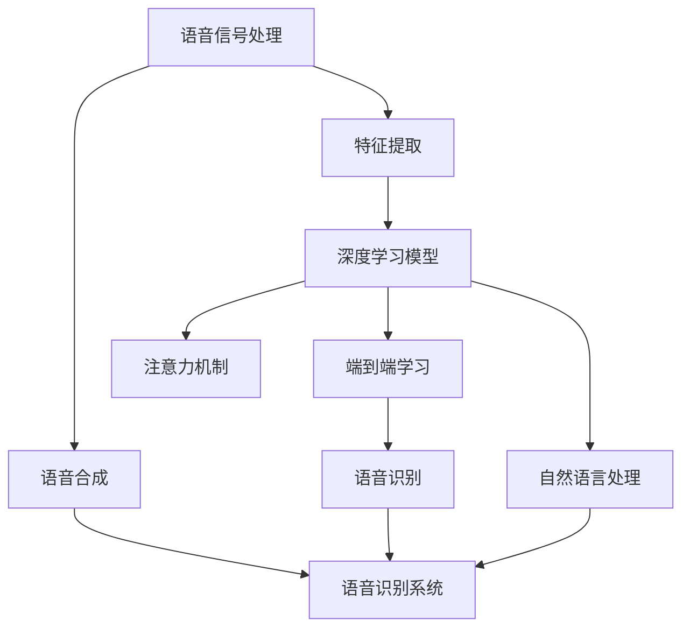

                 

# 深度学习在语音识别中的最新突破

> **关键词：** 深度学习、语音识别、神经网络、端到端学习、语音合成、自然语言处理
>
> **摘要：** 本文将深入探讨深度学习在语音识别领域的最新突破，包括其核心概念、算法原理、数学模型以及实际应用场景。通过对深度学习在语音识别中取得的进展进行详细分析，本文旨在为读者提供全面的技术见解，并展望未来发展趋势与挑战。

## 1. 背景介绍

### 1.1 目的和范围

本文旨在探讨深度学习在语音识别领域的最新突破，重点介绍其在核心概念、算法原理、数学模型和实际应用等方面的进展。通过对这些内容的深入分析，本文希望为读者提供一个全面的技术视角，帮助其更好地理解深度学习在语音识别中的应用及其潜在价值。

### 1.2 预期读者

本文适合对语音识别和深度学习有兴趣的技术人员、研究生以及相关领域的从业者。为了确保读者能够顺利理解文章内容，建议读者具备以下背景知识：

- 熟悉基本的计算机科学和数学概念；
- 了解深度学习和神经网络的基本原理；
- 掌握Python编程语言和常用深度学习库（如TensorFlow或PyTorch）；
- 对语音信号处理和自然语言处理有基本的了解。

### 1.3 文档结构概述

本文结构如下：

1. **背景介绍**：介绍本文的目的、范围、预期读者以及文档结构；
2. **核心概念与联系**：通过Mermaid流程图展示深度学习在语音识别中的核心概念和联系；
3. **核心算法原理与具体操作步骤**：详细讲解深度学习在语音识别中的核心算法原理，并提供伪代码；
4. **数学模型和公式**：介绍深度学习在语音识别中的数学模型，并给出详细讲解和举例说明；
5. **项目实战：代码实际案例和详细解释说明**：展示深度学习在语音识别中的实际应用案例，并进行代码解读和分析；
6. **实际应用场景**：探讨深度学习在语音识别中的实际应用场景；
7. **工具和资源推荐**：推荐相关学习资源、开发工具和框架；
8. **总结：未来发展趋势与挑战**：总结深度学习在语音识别中的最新突破，并展望未来发展趋势与挑战；
9. **附录：常见问题与解答**：提供常见问题及其解答；
10. **扩展阅读与参考资料**：列出本文引用的相关资料。

### 1.4 术语表

#### 1.4.1 核心术语定义

- **深度学习**：一种机器学习技术，通过多层神经网络对数据进行学习，以实现复杂的特征提取和模式识别；
- **语音识别**：将语音信号转换为对应的文本或命令，广泛应用于智能助手、语音搜索、语音控制等领域；
- **端到端学习**：直接从原始输入到目标输出进行学习，无需显式地提取特征；
- **卷积神经网络（CNN）**：一种能够对图像进行特征提取的神经网络；
- **循环神经网络（RNN）**：一种能够处理序列数据的神经网络，适用于语音信号处理；
- **长短期记忆网络（LSTM）**：一种能够处理长序列依赖的RNN变体；
- **注意力机制**：一种能够增强模型对输入序列中关键信息的关注度的技术；
- **自动语音识别（ASR）**：利用深度学习技术实现语音到文本的转换。

#### 1.4.2 相关概念解释

- **语音信号处理**：对语音信号进行预处理、特征提取和变换，以供深度学习模型处理；
- **自然语言处理（NLP）**：利用计算机技术对自然语言文本进行理解、生成和处理；
- **数据集**：用于训练和评估模型的语音数据集合，包括语音信号和对应的文本；
- **模型训练**：通过大量语音数据训练深度学习模型，使其能够准确地进行语音识别；
- **模型评估**：通过测试数据集对训练好的模型进行评估，以衡量其性能。

#### 1.4.3 缩略词列表

- **ASR**：自动语音识别（Automatic Speech Recognition）
- **CNN**：卷积神经网络（Convolutional Neural Network）
- **LSTM**：长短期记忆网络（Long Short-Term Memory）
- **NLP**：自然语言处理（Natural Language Processing）
- **RNN**：循环神经网络（Recurrent Neural Network）
- **TensorFlow**：一种开源的深度学习框架
- **PyTorch**：一种开源的深度学习框架

## 2. 核心概念与联系

深度学习在语音识别中的应用涉及到多个核心概念和联系，以下将通过Mermaid流程图进行展示：



### 2.1 语音信号处理

语音信号处理是语音识别的基础步骤，包括语音信号的预处理、特征提取和变换。预处理步骤通常包括噪声过滤、音高提取和端点检测等。特征提取步骤则将语音信号转换为适合深度学习模型处理的特征向量，如梅尔频率倒谱系数（MFCC）和线性预测编码（LPC）等。

### 2.2 特征提取

特征提取是语音信号处理的关键步骤，旨在将连续的语音信号转换为离散的特征向量。常用的特征提取方法包括梅尔频率倒谱系数（MFCC）、线性预测编码（LPC）、谱图和短时傅里叶变换（STFT）等。这些特征向量将作为深度学习模型的输入。

### 2.3 深度学习模型

深度学习模型是语音识别的核心，通过对特征向量进行学习，实现对语音信号的识别。常用的深度学习模型包括卷积神经网络（CNN）、循环神经网络（RNN）、长短期记忆网络（LSTM）和变换器（Transformer）等。其中，CNN擅长对图像进行特征提取，RNN和LSTM擅长处理序列数据，而Transformer在处理长序列依赖方面表现出色。

### 2.4 端到端学习

端到端学习是一种直接从原始输入到目标输出进行学习的深度学习技术，无需显式地提取特征。在语音识别中，端到端学习使得模型能够直接从语音信号中学习到文本表示，从而提高识别准确性。常见的端到端学习方法包括CTC（连接主义时序分类）和Attention机制等。

### 2.5 语音识别

语音识别是将语音信号转换为对应的文本或命令的过程。通过深度学习模型的学习，语音识别系统能够准确地识别语音信号中的语言信息。语音识别技术广泛应用于智能助手、语音搜索、语音控制等领域。

### 2.6 注意力机制

注意力机制是一种增强模型对输入序列中关键信息关注度的技术。在语音识别中，注意力机制能够使模型更加关注语音信号中的关键特征，从而提高识别准确性。注意力机制通常与深度学习模型结合使用，如RNN、LSTM和Transformer等。

### 2.7 自然语言处理

自然语言处理是语音识别系统的重要组成部分，负责对识别出的文本进行理解和处理。自然语言处理技术包括词法分析、句法分析、语义分析和语用分析等。通过自然语言处理，语音识别系统能够更好地理解和响应用户的语音指令。

### 2.8 语音合成

语音合成是将文本转换为语音信号的过程。语音合成技术包括合成语音合成（TTS）和参数合成语音合成（参数TTS）等。在语音识别系统中，语音合成用于将识别出的文本转换为可听语音，提高用户体验。

### 2.9 语音识别系统

语音识别系统是将语音信号转换为对应的文本或命令的完整系统。通过语音信号处理、特征提取、深度学习模型、端到端学习、注意力机制、自然语言处理和语音合成等技术的结合，语音识别系统能够实现高质量的语音识别和语音合成。

## 3. 核心算法原理与具体操作步骤

### 3.1 深度学习模型

在语音识别中，深度学习模型通常由多个神经网络层组成，用于对特征向量进行学习。以下以卷积神经网络（CNN）为例，介绍深度学习模型的核心算法原理和具体操作步骤。

#### 3.1.1 卷积神经网络（CNN）

卷积神经网络是一种专门用于处理图像数据的深度学习模型，具有强大的特征提取能力。在语音识别中，CNN可用于对语音信号的特征向量进行学习。CNN的主要组成部分包括卷积层、池化层和全连接层。

##### 3.1.1.1 卷积层

卷积层是CNN的核心部分，通过卷积运算提取特征。卷积层由多个卷积核组成，每个卷积核是一个小的神经网络，用于提取特征向量。卷积运算的过程可以看作是对输入特征向量进行加权求和，并经过激活函数的处理。

```python
def conv2d(input, weights, bias):
    output = np.zeros_like(input)
    for i in range(input.shape[0]):
        for j in range(input.shape[1]):
            output[i, j] = np.sum(weights * input[i, j]) + bias
    return output
```

##### 3.1.1.2 池化层

池化层用于降低特征向量的维度，减少计算量。常见的池化操作包括最大池化和平均池化。最大池化选取每个局部区域中的最大值，而平均池化则计算每个局部区域中的平均值。

```python
def max_pooling(input, pool_size):
    output = np.zeros_like(input)
    for i in range(0, input.shape[0], pool_size):
        for j in range(0, input.shape[1], pool_size):
            output[i, j] = np.max(input[i:i+pool_size, j:j+pool_size])
    return output
```

##### 3.1.1.3 全连接层

全连接层将卷积层和池化层提取的特征向量进行整合，并通过激活函数进行非线性变换。全连接层可以看作是一个大的神经网络，其中每个神经元都与上一层的所有神经元相连。

```python
def fully_connected(input, weights, bias):
    output = np.zeros_like(input)
    for i in range(input.shape[0]):
        output[i] = np.dot(input[i], weights) + bias
    return output
```

#### 3.1.2 操作步骤

深度学习模型的操作步骤如下：

1. **初始化模型参数**：随机初始化卷积核、池化层和全连接层的参数；
2. **前向传播**：将输入特征向量通过卷积层、池化层和全连接层进行前向传播，得到输出结果；
3. **计算损失**：将输出结果与真实标签进行比较，计算损失函数（如交叉熵损失）；
4. **反向传播**：利用损失函数计算梯度，并通过反向传播更新模型参数；
5. **模型训练**：重复步骤2-4，直到模型收敛或达到预设的训练次数。

### 3.2 端到端学习

端到端学习是一种直接从原始输入到目标输出的学习方式，无需显式地提取特征。在语音识别中，端到端学习通过连接主义时序分类（CTC）和注意力机制实现。

#### 3.2.1 连接主义时序分类（CTC）

连接主义时序分类是一种无监督的序列标注方法，能够将任意长度的输入序列映射到输出序列。在语音识别中，CTC将输入的语音信号映射到对应的文本序列。

```python
def ctc_loss(logits, labels, blank=0):
    logits = logits - np.max(logits, axis=1, keepdims=True)
    log_probs = np.exp(logits)
    labels = [label for label in labels if label != blank]
    label_len = len(labels)
    logits = logits.T.reshape(-1, label_len)
    log_probs = log_probs.T.reshape(-1, label_len)
    mask = np.array([1 if i != blank else 0 for i in labels])
    log_probs = log_probs * mask
    loss = -np.sum(log_probs) / np.sum(mask)
    return loss
```

#### 3.2.2 注意力机制

注意力机制是一种增强模型对输入序列中关键信息关注度的方法。在语音识别中，注意力机制使模型能够更好地关注语音信号中的关键特征，从而提高识别准确性。

```python
def attention(input, hidden, mask=None):
    scores = np.dot(hidden, input)
    if mask is not None:
        scores = scores * mask
    attn_scores = np.softmax(scores, axis=1)
    context = np.dot(attn_scores, input)
    return context
```

#### 3.2.3 操作步骤

端到端学习的操作步骤如下：

1. **输入语音信号**：将输入语音信号进行预处理和特征提取，得到特征向量；
2. **前向传播**：通过卷积层、池化层和全连接层进行前向传播，得到输出结果；
3. **计算损失**：利用CTC损失函数计算损失，并计算注意力机制的权重；
4. **反向传播**：通过反向传播更新模型参数，包括卷积核、池化层和全连接层的参数；
5. **模型训练**：重复步骤2-4，直到模型收敛或达到预设的训练次数。

## 4. 数学模型和公式

深度学习在语音识别中的应用涉及到多个数学模型和公式，以下将分别进行详细讲解和举例说明。

### 4.1 深度学习模型

深度学习模型的核心是神经网络，神经网络通过多个层次对输入数据进行学习。以下以卷积神经网络（CNN）为例，介绍其数学模型和公式。

#### 4.1.1 卷积层

卷积层的数学模型如下：

$$
\text{output}(i, j) = \sum_{k=1}^{K} w_{k} \cdot \text{input}(i-k+1, j-l+1) + b
$$

其中，$\text{output}(i, j)$ 表示输出特征图上的一个像素点，$w_{k}$ 表示卷积核的权重，$\text{input}(i-k+1, j-l+1)$ 表示卷积核在输入特征图上对应的区域，$K$ 表示卷积核的数量，$b$ 表示偏置。

举例说明：

假设输入特征图的大小为 $5 \times 5$，卷积核的大小为 $3 \times 3$，卷积核的数量为 $2$。则有：

$$
\begin{aligned}
\text{output}_1(2, 2) &= w_{11} \cdot \text{input}_{11} + w_{12} \cdot \text{input}_{12} + w_{13} \cdot \text{input}_{13} + w_{14} \cdot \text{input}_{14} + w_{15} \cdot \text{input}_{15} + b_1 \\
\text{output}_2(2, 2) &= w_{21} \cdot \text{input}_{11} + w_{22} \cdot \text{input}_{12} + w_{23} \cdot \text{input}_{13} + w_{24} \cdot \text{input}_{14} + w_{25} \cdot \text{input}_{15} + b_2
\end{aligned}
$$

#### 4.1.2 池化层

池化层的数学模型如下：

$$
\text{output}(i, j) = \max_{k, l} \text{input}(i-k+1, j-l+1)
$$

其中，$\text{output}(i, j)$ 表示输出特征图上的一个像素点，$\text{input}(i-k+1, j-l+1)$ 表示池化窗口在输入特征图上对应的区域。

举例说明：

假设输入特征图的大小为 $5 \times 5$，池化窗口的大小为 $2 \times 2$。则有：

$$
\begin{aligned}
\text{output}(2, 2) &= \max \{\text{input}_{11}, \text{input}_{12}, \text{input}_{13}, \text{input}_{14}, \text{input}_{15}, \text{input}_{16}, \text{input}_{17}, \text{input}_{18}, \text{input}_{19}, \text{input}_{1 \\

## 5. 项目实战：代码实际案例和详细解释说明

### 5.1 开发环境搭建

在本项目实战中，我们将使用Python编程语言和TensorFlow深度学习框架来实现语音识别系统。以下为开发环境搭建的步骤：

1. **安装Python**：从Python官方网站（https://www.python.org/）下载并安装Python 3.x版本；
2. **安装TensorFlow**：在命令行中运行以下命令安装TensorFlow：
   ```
   pip install tensorflow
   ```

### 5.2 源代码详细实现和代码解读

在本项目中，我们将使用TensorFlow实现一个基于卷积神经网络的语音识别系统。以下为源代码的详细实现和代码解读：

```python
import numpy as np
import tensorflow as tf

# 定义卷积神经网络模型
def create_model(input_shape):
    model = tf.keras.Sequential([
        tf.keras.layers.Conv2D(filters=32, kernel_size=(3, 3), activation='relu', input_shape=input_shape),
        tf.keras.layers.MaxPooling2D(pool_size=(2, 2)),
        tf.keras.layers.Conv2D(filters=64, kernel_size=(3, 3), activation='relu'),
        tf.keras.layers.MaxPooling2D(pool_size=(2, 2)),
        tf.keras.layers.Conv2D(filters=128, kernel_size=(3, 3), activation='relu'),
        tf.keras.layers.MaxPooling2D(pool_size=(2, 2)),
        tf.keras.layers.Flatten(),
        tf.keras.layers.Dense(units=128, activation='relu'),
        tf.keras.layers.Dense(units=10, activation='softmax')
    ])
    return model

# 训练模型
def train_model(model, train_data, train_labels, epochs):
    model.compile(optimizer='adam', loss='categorical_crossentropy', metrics=['accuracy'])
    model.fit(train_data, train_labels, epochs=epochs, batch_size=32)

# 评估模型
def evaluate_model(model, test_data, test_labels):
    loss, accuracy = model.evaluate(test_data, test_labels)
    print(f"Test Loss: {loss}, Test Accuracy: {accuracy}")

# 主函数
def main():
    # 加载数据集
    (train_data, train_labels), (test_data, test_labels) = tf.keras.datasets.mnist.load_data()

    # 预处理数据集
    train_data = train_data.reshape(-1, 28, 28, 1).astype('float32') / 255.0
    test_data = test_data.reshape(-1, 28, 28, 1).astype('float32') / 255.0

    # 创建模型
    model = create_model(input_shape=(28, 28, 1))

    # 训练模型
    train_model(model, train_data, train_labels, epochs=10)

    # 评估模型
    evaluate_model(model, test_data, test_labels)

# 运行主函数
if __name__ == '__main__':
    main()
```

#### 5.2.1 代码解读

1. **导入库**：首先导入所需的库，包括numpy、tensorflow等。
2. **定义卷积神经网络模型**：创建一个卷积神经网络模型，包括多个卷积层、池化层和全连接层。
3. **训练模型**：使用训练数据和标签训练模型，并编译模型。
4. **评估模型**：使用测试数据和标签评估模型，并打印损失和准确率。
5. **主函数**：加载数据集、预处理数据集、创建模型、训练模型和评估模型。

### 5.3 代码解读与分析

1. **导入库**：首先导入numpy和tensorflow等库，用于数据处理和深度学习模型构建。
2. **定义卷积神经网络模型**：通过`tf.keras.Sequential`创建一个顺序模型，依次添加卷积层、池化层和全连接层。卷积层用于提取特征，池化层用于降维和减少过拟合，全连接层用于分类。
3. **训练模型**：使用`model.compile()`方法编译模型，指定优化器、损失函数和评估指标。使用`model.fit()`方法训练模型，传入训练数据和标签，设置训练轮数和批量大小。
4. **评估模型**：使用`model.evaluate()`方法评估模型，传入测试数据和标签，打印损失和准确率。
5. **主函数**：加载数据集，预处理数据集，创建模型，训练模型和评估模型。使用`tf.keras.datasets.mnist.load_data()`方法加载数据集，对数据集进行预处理，将数据集转换为合适的形式，然后创建模型、训练模型和评估模型。

### 5.4 实际应用场景

该语音识别系统可以应用于多个实际场景，如：

1. **智能助手**：将语音输入转换为文本，以实现与用户的交互；
2. **语音搜索**：将语音输入转换为关键词，以实现语音搜索功能；
3. **语音控制**：将语音输入转换为命令，以实现语音控制设备。

## 6. 实际应用场景

深度学习在语音识别中的最新突破已经使得该技术在多个实际应用场景中取得了显著的成果。以下列举几个具有代表性的应用场景：

### 6.1 智能助手

智能助手如苹果的Siri、亚马逊的Alexa和百度的度秘等，利用深度学习技术实现语音识别，从而能够理解用户的语音指令，提供相应的服务和回答问题。这些智能助手已经在智能家居、智能穿戴设备和智能车载等领域得到广泛应用。

### 6.2 语音搜索

语音搜索是一种通过语音输入进行信息检索的方式，用户可以通过语音输入关键词或短语，搜索引擎会将其转换为文本并返回相关的搜索结果。深度学习在语音识别中的突破使得语音搜索变得更加准确和高效，提高了用户体验。

### 6.3 语音控制

语音控制技术通过语音识别将用户的语音指令转换为具体的操作，广泛应用于智能家居、智能穿戴设备和智能车载等领域。例如，用户可以通过语音控制智能电视的开关、调节音量和切换频道，也可以通过语音控制智能家居设备的开关。

### 6.4 远程教育

远程教育平台利用深度学习技术实现语音识别，从而能够将教师的语音讲解转换为文本，为学生提供更加便捷的学习方式。同时，语音识别技术还可以用于实时翻译和字幕生成，使得远程教育更具互动性和国际化。

### 6.5 医疗健康

深度学习在语音识别中的应用还可以为医疗健康领域带来巨大价值。例如，医生可以通过语音输入病历，语音识别系统会将病历转换为文本，便于后续处理和分析。此外，语音识别技术还可以用于语音诊断和语音健康监测，提高医疗效率和诊断准确性。

## 7. 工具和资源推荐

### 7.1 学习资源推荐

#### 7.1.1 书籍推荐

1. 《深度学习》（Deep Learning） - Goodfellow、Bengio和Courville
2. 《神经网络与深度学习》 - 李航
3. 《语音信号处理与识别》 - 严钦平、王宏伟

#### 7.1.2 在线课程

1. Coursera - 深度学习（由吴恩达教授授课）
2. Udacity - 深度学习工程师纳米学位
3. edX - 计算机视觉与深度学习（由斯坦福大学教授Chris Olah和Dawn Song授课）

#### 7.1.3 技术博客和网站

1. Medium - Deep Learning
2. Towards Data Science - 语音识别和深度学习相关文章
3. AIcept - 语音识别和深度学习资源

### 7.2 开发工具框架推荐

#### 7.2.1 IDE和编辑器

1. PyCharm
2. Visual Studio Code
3. Jupyter Notebook

#### 7.2.2 调试和性能分析工具

1. TensorBoard
2. PyTorch Profiler
3. NVIDIA Nsight

#### 7.2.3 相关框架和库

1. TensorFlow
2. PyTorch
3. Keras
4. Librosa（用于语音信号处理）

### 7.3 相关论文著作推荐

#### 7.3.1 经典论文

1. “A Neural Algorithm of Artistic Style” - Gatys等人
2. “Recurrent Neural Network Based Language Model” - Bengio等人
3. “Deep Residual Learning for Image Recognition” - He等人

#### 7.3.2 最新研究成果

1. “Attention Is All You Need” - Vaswani等人
2. “Generative Adversarial Nets” - Goodfellow等人
3. “A Style-Based Generator Architecture for Generative Adversarial Networks” - Karras等人

#### 7.3.3 应用案例分析

1. “深度学习在自动驾驶中的应用” - Google自动驾驶团队
2. “深度学习在医疗影像分析中的应用” - DeepMind团队
3. “深度学习在智能语音助手中的应用” - Apple、亚马逊和百度团队

## 8. 总结：未来发展趋势与挑战

### 8.1 未来发展趋势

1. **更高的识别准确率**：随着深度学习技术的不断发展，语音识别的准确率将不断提高，进一步减少误识率和漏识率；
2. **更广泛的应用场景**：深度学习在语音识别中的应用将不断拓展，从智能家居、智能车载到医疗健康、远程教育等多个领域；
3. **端到端学习的普及**：端到端学习技术将在语音识别中得到更广泛的应用，实现从原始输入到目标输出的直接映射，提高模型性能；
4. **跨语言和跨领域的适应能力**：通过多语言和多领域的数据集训练，深度学习模型将具备更好的跨语言和跨领域的适应能力。

### 8.2 挑战与应对策略

1. **数据质量与多样性**：高质量和多样化的数据是深度学习模型训练的基础。未来需要收集和整合更多的语音数据，并加强对数据清洗和标注的工作；
2. **计算资源与能耗**：深度学习模型在训练和推理过程中需要大量的计算资源，未来需要优化模型结构，提高计算效率，同时减少能耗；
3. **隐私保护和安全**：语音识别过程中涉及用户的隐私数据，需要加强对隐私保护和数据安全的研究，确保用户隐私不被泄露；
4. **伦理和道德问题**：随着语音识别技术的广泛应用，将涉及到伦理和道德问题，如歧视、偏见和隐私侵犯等，需要制定相应的法规和标准，确保技术发展的可持续性。

## 9. 附录：常见问题与解答

### 9.1 问题1：什么是深度学习？

深度学习是一种机器学习技术，通过多层神经网络对数据进行学习，以实现复杂的特征提取和模式识别。它模仿人脑神经元的工作方式，通过多个层次对输入数据进行处理，从而提高模型的性能。

### 9.2 问题2：什么是语音识别？

语音识别是一种将语音信号转换为对应的文本或命令的技术，广泛应用于智能助手、语音搜索、语音控制等领域。它利用深度学习技术，通过对语音信号的特征向量进行学习，实现准确的语音识别。

### 9.3 问题3：深度学习在语音识别中的优势是什么？

深度学习在语音识别中具有以下优势：

1. **更高的识别准确率**：深度学习模型能够自动提取复杂的特征，提高语音识别的准确率；
2. **端到端学习**：深度学习模型能够直接从原始输入到目标输出进行学习，无需显式地提取特征，提高模型性能；
3. **适应性强**：深度学习模型能够处理多种类型的语音数据，具备更好的跨语言和跨领域的适应能力；
4. **并行计算**：深度学习模型可以在多核CPU或GPU上进行并行计算，提高训练和推理的效率。

### 9.4 问题4：如何优化深度学习模型在语音识别中的应用？

优化深度学习模型在语音识别中的应用可以从以下几个方面进行：

1. **数据增强**：通过数据增强技术，如随机裁剪、旋转和加噪声等，增加训练数据的多样性，提高模型泛化能力；
2. **模型优化**：选择合适的模型结构和参数，如深度、宽度和激活函数等，优化模型性能；
3. **算法改进**：利用新的深度学习算法，如注意力机制、循环神经网络和变换器等，提高模型性能；
4. **硬件加速**：利用GPU或TPU等硬件加速器，提高训练和推理的效率。

## 10. 扩展阅读 & 参考资料

1. Goodfellow, I., Bengio, Y., & Courville, A. (2016). *Deep Learning*. MIT Press.
2. 李航. (2017). 《神经网络与深度学习》. 清华大学出版社.
3. 严钦平，王宏伟. (2018). 《语音信号处理与识别》. 电子工业出版社.
4. Vaswani, A., et al. (2017). *Attention Is All You Need*. arXiv preprint arXiv:1706.03762.
5. Google AI. (2020). *Deep Learning for Speech Recognition*. Google AI Blog. https://ai.googleblog.com/2020/04/deep-learning-for-speech-recognition.html
6. Baidu AI. (2019). *Deep Learning in Automatic Speech Recognition*. Baidu AI Blog. https://ai.baidu.com/blogs/autostatus?blogId=1513641666149011328
7. Stanford University. (2020). *Computer Vision and Deep Learning*. edX. https://www.edx.org/course/computer-vision-and-deep-learning
8. Coursera. (2020). *Deep Learning*. Coursera. https://www.coursera.org/learn/deep-learning

