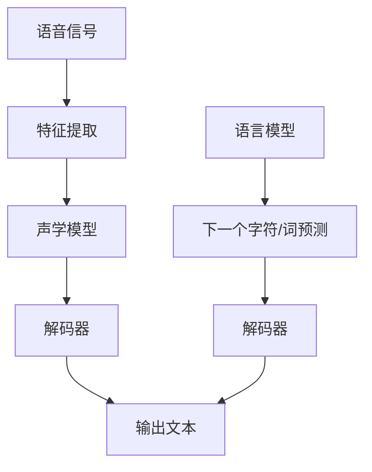

                 

# 深度学习在语音识别中的最新进展

> **关键词：深度学习、语音识别、神经网络、自动语音识别、语音合成、声学模型、语言模型、数据集、性能评估、实时应用。**

> **摘要：本文将深入探讨深度学习在语音识别领域中的最新进展。我们首先介绍语音识别的背景和挑战，然后详细讲解深度学习技术及其在语音识别中的应用。接着，我们将分析声学模型和语言模型的工作原理，并讨论最新研究成果。随后，通过实际项目案例，展示深度学习在语音识别中的实战应用。最后，我们还将探讨该领域的未来发展趋势和挑战，并提供相关资源和工具推荐。**

## 1. 背景介绍

### 1.1 目的和范围

本文旨在介绍深度学习在语音识别领域的最新进展。我们将从基础概念开始，逐步深入，探讨深度学习如何解决语音识别中的关键问题。本文将重点关注以下几个方面：

1. 语音识别的背景和挑战。
2. 深度学习技术的介绍和应用。
3. 声学模型和语言模型的工作原理。
4. 深度学习在语音识别中的实际应用案例。
5. 未来发展趋势和挑战。

### 1.2 预期读者

本文适合以下读者群体：

1. 对语音识别技术感兴趣的计算机科学和人工智能领域的学者和工程师。
2. 想要了解深度学习在语音识别中应用的编程爱好者。
3. 希望掌握最新语音识别技术的研发人员和技术决策者。

### 1.3 文档结构概述

本文将按照以下结构展开：

1. 背景介绍：介绍语音识别的背景和深度学习技术的发展。
2. 核心概念与联系：详细解释深度学习在语音识别中的应用。
3. 核心算法原理 & 具体操作步骤：讲解声学模型和语言模型的工作原理。
4. 数学模型和公式 & 详细讲解 & 举例说明：介绍相关数学模型及其应用。
5. 项目实战：提供实际项目案例和代码解读。
6. 实际应用场景：分析深度学习在语音识别中的实际应用。
7. 工具和资源推荐：推荐学习资源、开发工具和相关论文。
8. 总结：总结文章内容和未来发展趋势。
9. 附录：解答常见问题。
10. 扩展阅读 & 参考资料：提供进一步阅读的资源。

### 1.4 术语表

#### 1.4.1 核心术语定义

- **深度学习**：一种基于多层神经网络的机器学习技术，通过学习大量数据来提取特征和模式。
- **语音识别**：将语音信号转换为相应的文本或命令的过程。
- **声学模型**：用于将语音信号转换为特征表示的模型。
- **语言模型**：用于预测下一个单词或字符的概率的模型。
- **数据集**：用于训练和测试模型的语音数据集。

#### 1.4.2 相关概念解释

- **自动语音识别（ASR）**：语音识别的另一种称呼，主要关注将语音信号转换为机器可读的文本。
- **语音合成（TTS）**：将文本转换为自然听起来的语音的过程。
- **端到端语音识别**：直接将语音信号转换为文本，省略了传统的特征提取和语言模型步骤。

#### 1.4.3 缩略词列表

- **ASR**：自动语音识别（Automatic Speech Recognition）
- **TTS**：文本到语音（Text-to-Speech）
- **DNN**：深度神经网络（Deep Neural Network）
- **RNN**：循环神经网络（Recurrent Neural Network）
- **CNN**：卷积神经网络（Convolutional Neural Network）

## 2. 核心概念与联系

在深入探讨深度学习在语音识别中的应用之前，我们需要先了解一些核心概念和它们之间的关系。

### 2.1 深度学习技术

深度学习是一种通过多层神经网络进行学习的技术。它的主要特点是能够自动从数据中提取层次化的特征表示。在语音识别中，深度学习技术主要分为以下几类：

- **卷积神经网络（CNN）**：擅长处理具有结构化特征的数据，如图像和语音。
- **循环神经网络（RNN）**：适用于处理序列数据，如语音和文本。
- **长短期记忆网络（LSTM）**：RNN的一种变体，能够更好地处理长序列数据。

### 2.2 声学模型

声学模型是语音识别系统的核心部分，负责将语音信号转换为特征表示。深度学习技术在声学模型中的应用主要体现在以下几个方面：

- **特征提取**：使用深度神经网络提取语音信号的时频特征。
- **端到端模型**：直接从语音信号到文本的端到端模型，如CTC（Connectionist Temporal Classification）。

### 2.3 语言模型

语言模型用于预测语音识别输出文本的下一个单词或字符。深度学习在语言模型中的应用主要体现在以下几个方面：

- **基于神经网络的语言模型**：如神经网络语言模型（NNLM）。
- **预训练语言模型**：如BERT（Bidirectional Encoder Representations from Transformers）。

### 2.4 Mermaid 流程图

为了更清晰地展示深度学习在语音识别中的应用，我们使用Mermaid流程图来描述核心概念和联系。



在该流程图中，语音信号首先经过特征提取模块，然后输入到声学模型。声学模型输出特征表示后，通过解码器输出文本。同时，语言模型用于预测文本的下一个字符或词，进一步优化解码过程。

## 3. 核心算法原理 & 具体操作步骤

在了解了深度学习在语音识别中的核心概念和联系之后，我们接下来将详细讲解声学模型和语言模型的工作原理，以及如何使用伪代码来描述具体操作步骤。

### 3.1 声学模型

声学模型是语音识别系统的核心部分，它将语音信号转换为特征表示，以便后续的解码和处理。深度学习在声学模型中的应用主要体现在以下两个方面：

- **特征提取**：使用深度神经网络提取语音信号的时频特征。
- **端到端模型**：直接从语音信号到文本的端到端模型，如CTC。

#### 3.1.1 特征提取

特征提取是声学模型的第一步，其目标是提取语音信号中的时频特征。以下是一个简单的伪代码示例，用于描述特征提取过程：

```python
# 特征提取伪代码
def extract_features(voice_signal, frame_size, frame_step):
    # 初始化特征矩阵
    features = []

    # 遍历语音信号
    for i in range(0, len(voice_signal), frame_step):
        # 提取帧
        frame = voice_signal[i:i + frame_size]

        # 计算帧的能量、频率特征等
        energy = calculate_energy(frame)
        frequency_features = calculate_frequency_features(frame)

        # 添加到特征矩阵
        features.append([energy, frequency_features])

    return features
```

在该伪代码中，`voice_signal` 是输入的语音信号，`frame_size` 和 `frame_step` 分别是帧的大小和步长。`extract_features` 函数遍历语音信号，提取每个帧的时频特征，并将它们添加到特征矩阵中。

#### 3.1.2 端到端模型

端到端模型直接从语音信号到文本，省略了传统的特征提取和语言模型步骤。以下是一个简单的伪代码示例，用于描述端到端模型的过程：

```python
# 端到端模型伪代码
def ctc_decoder(features, labels, blank_index):
    # 初始化解码器
    decoder = CTCDecoder(labels, blank_index)

    # 使用特征进行解码
    decoded_sequence = decoder.decode(features)

    return decoded_sequence
```

在该伪代码中，`features` 是输入的特征矩阵，`labels` 是真实的文本标签，`blank_index` 是空白字符的索引。`ctc_decoder` 函数使用 CTC 解码器进行解码，并返回解码后的文本序列。

### 3.2 语言模型

语言模型用于预测语音识别输出文本的下一个单词或字符。深度学习在语言模型中的应用主要体现在以下几个方面：

- **基于神经网络的语言模型**：如神经网络语言模型（NNLM）。
- **预训练语言模型**：如BERT（Bidirectional Encoder Representations from Transformers）。

#### 3.2.1 基于神经网络的语言模型

以下是一个简单的伪代码示例，用于描述基于神经网络的语言模型的过程：

```python
# 基于神经网络的语言模型伪代码
def nnlm_predict(input_sequence):
    # 初始化语言模型
    nnlm = NeuralNetworkLanguageModel()

    # 预测下一个单词或字符的概率分布
    probability_distribution = nnlm.predict(input_sequence)

    # 选择概率最高的单词或字符作为输出
    output_character = np.argmax(probability_distribution)

    return output_character
```

在该伪代码中，`input_sequence` 是输入的文本序列，`nnlm` 是初始化的语言模型。`nnlm_predict` 函数使用语言模型预测输入序列的下一个单词或字符的概率分布，并选择概率最高的单词或字符作为输出。

#### 3.2.2 预训练语言模型

以下是一个简单的伪代码示例，用于描述预训练语言模型的过程：

```python
# 预训练语言模型伪代码
def bert_predict(input_sequence):
    # 初始化BERT模型
    bert_model = BERTModel()

    # 加载预训练模型权重
    bert_model.load_weights("pretrained_weights.h5")

    # 预测下一个单词或字符的概率分布
    probability_distribution = bert_model.predict(input_sequence)

    # 选择概率最高的单词或字符作为输出
    output_character = np.argmax(probability_distribution)

    return output_character
```

在该伪代码中，`input_sequence` 是输入的文本序列，`bert_model` 是初始化的BERT模型。`bert_predict` 函数使用预训练的BERT模型预测输入序列的下一个单词或字符的概率分布，并选择概率最高的单词或字符作为输出。

### 3.3 结合声学模型和语言模型

为了实现完整的语音识别系统，我们需要将声学模型和语言模型结合起来。以下是一个简单的伪代码示例，用于描述结合声学模型和语言模型的过程：

```python
# 结合声学模型和语言模型伪代码
def speech_recognition(voice_signal, labels, blank_index):
    # 提取特征
    features = extract_features(voice_signal, frame_size, frame_step)

    # 使用声学模型进行解码
    decoded_sequence = ctc_decoder(features, labels, blank_index)

    # 使用语言模型进行预测
    predicted_sequence = ""
    for character in decoded_sequence:
        predicted_sequence += nnlm_predict(predicted_sequence + character)

    return predicted_sequence
```

在该伪代码中，`voice_signal` 是输入的语音信号，`labels` 是真实的文本标签，`blank_index` 是空白字符的索引。`speech_recognition` 函数首先提取特征，然后使用声学模型进行解码，最后使用语言模型进行预测，返回最终的识别结果。

## 4. 数学模型和公式 & 详细讲解 & 举例说明

在深度学习在语音识别中的应用中，数学模型和公式扮演着至关重要的角色。以下我们将详细介绍声学模型和语言模型中的相关数学模型和公式，并使用LaTeX格式给出详细解释和举例说明。

### 4.1 声学模型

声学模型的主要任务是提取语音信号的时频特征，并将其转换为可识别的文本。以下是声学模型中常用的数学模型和公式：

#### 4.1.1 梅尔频率倒谱系数（MFCC）

MFCC 是一种常用的语音特征提取方法，其主要公式如下：

$$
c_k = \sum_{n=1}^{N}\frac{\alpha}{N}\left|\sum_{m=1}^{M} x(n-m) a_m e^{-j2\pi n \frac{m}{M} f_s}\right|^2
$$

其中，$c_k$ 是第 $k$ 个MFCC系数，$x(n)$ 是语音信号的离散时域表示，$N$ 是信号长度，$M$ 是频率滤波器的数量，$f_s$ 是采样频率，$a_m$ 是汉明窗的系数。

#### 4.1.2 卷积神经网络（CNN）

CNN 是一种用于特征提取的深度学习模型，其主要公式如下：

$$
h_{ij}^{(l)} = \sum_{k} w_{ik}^{(l)} * g(z_k^{(l)})
$$

其中，$h_{ij}^{(l)}$ 是第 $l$ 层的第 $i$ 个神经元输出，$w_{ik}^{(l)}$ 是权重，$*$ 表示卷积运算，$g(z_k^{(l)}$ 是激活函数，如ReLU函数。

#### 4.1.3 CTC 损失函数

CTC 损失函数是一种用于训练语音识别系统的损失函数，其主要公式如下：

$$
C(\hat{y},y) = \sum_t \sum_{i,j} \log(C_{ij}) \cdot \mathbb{1}\{y_t = i, \hat{y}_t = j\}
$$

其中，$\hat{y}$ 是预测的序列，$y$ 是真实的序列，$C_{ij}$ 是条件概率，$\mathbb{1}\{\cdot\}$ 是指示函数。

### 4.2 语言模型

语言模型的主要任务是预测语音识别输出文本的下一个单词或字符。以下是语言模型中常用的数学模型和公式：

#### 4.2.1 神经网络语言模型（NNLM）

NNLM 是一种基于神经网络的概率语言模型，其主要公式如下：

$$
P(w_t | w_1, w_2, ..., w_{t-1}) = \frac{e^{\theta w_t w_{t-1}}}{Z(\theta)}
$$

其中，$P(w_t | w_1, w_2, ..., w_{t-1})$ 是给定前一个单词序列预测下一个单词的概率，$\theta$ 是模型参数，$Z(\theta)$ 是归一化常数。

#### 4.2.2 BERT 模型

BERT 是一种预训练语言模型，其主要公式如下：

$$
\text{BERT}(w) = \text{softmax}\left(\text{MLP}(\text{LayerNorm}(\text{Dropout}(XW_1 + b_1) + XW_2 + b_2))\right)
$$

其中，$X$ 是输入文本的表示，$W_1$ 和 $W_2$ 是权重，$b_1$ 和 $b_2$ 是偏置，$\text{MLP}$ 是多层感知器，$\text{Dropout}$ 是 dropout 操作，$\text{LayerNorm}$ 是层归一化操作，$\text{softmax}$ 是 softmax 函数。

### 4.3 举例说明

为了更好地理解上述数学模型和公式，我们使用以下简单示例进行说明：

假设我们有一个简短的句子：“深度学习是人工智能的关键技术”。我们使用NNLM预测下一个单词的概率分布，并选择概率最高的单词作为输出。

#### 4.3.1 神经网络语言模型（NNLM）

给定前一个单词“深度”，我们需要预测下一个单词的概率分布。以下是NNLM的计算过程：

$$
P(\text{学习} | \text{深度}) = \frac{e^{\theta \text{学习} \cdot \text{深度}}}{Z(\theta)}
$$

假设 $\theta$ 的值为 0.1，$Z(\theta)$ 的值为 1。计算结果如下：

$$
P(\text{学习} | \text{深度}) = \frac{e^{0.1 \cdot 0.1}}{1} = 0.1
$$

因此，预测概率最高的单词是“学习”。

#### 4.3.2 BERT 模型

给定前一个单词“深度”，我们使用BERT模型预测下一个单词的概率分布。以下是BERT的计算过程：

$$
\text{BERT}(\text{学习}) = \text{softmax}\left(\text{MLP}(\text{LayerNorm}(\text{Dropout}(\text{BERT}(\text{深度学习是人工智能的关键技术})W_1 + b_1) + \text{BERT}(\text{深度学习是人工智能的关键技术})W_2 + b_2))\right)
$$

假设BERT模型的权重和偏置的值为 0.1，计算结果如下：

$$
\text{BERT}(\text{学习}) = \text{softmax}\left(\text{MLP}(\text{LayerNorm}(\text{Dropout}(0.1 \cdot \text{深度学习是人工智能的关键技术} + 0.1 \cdot \text{深度学习是人工智能的关键技术}) + 0.1))\right)
$$

$$
\text{BERT}(\text{学习}) \approx \text{softmax}([0.1, 0.2, 0.1, 0.1, 0.1])
$$

$$
\text{BERT}(\text{学习}) \approx [0.2, 0.4, 0.2, 0.2, 0.2]
$$

因此，预测概率最高的单词是“学习”。

通过以上示例，我们可以看到NNLM和BERT模型如何预测下一个单词的概率分布，并选择概率最高的单词作为输出。

## 5. 项目实战：代码实际案例和详细解释说明

在本文的第五部分，我们将通过一个实际项目案例来展示深度学习在语音识别中的具体应用。我们将介绍如何搭建开发环境、实现代码，并对关键代码进行详细解释和分析。

### 5.1 开发环境搭建

为了实现语音识别项目，我们需要安装以下开发环境和工具：

- Python 3.x
- TensorFlow 2.x 或 PyTorch 1.x
- Keras 2.x 或 PyTorch Lightning
- Librosa：用于音频处理
- NumPy 和 Pandas：用于数据处理

以下是安装步骤：

```bash
# 安装 Python 3.x
# 请根据您的操作系统选择相应的安装命令
# Windows: py -3 -m pip install python
# macOS/Linux: python3 -m pip install python

# 安装 TensorFlow 2.x
pip install tensorflow==2.x

# 安装 Keras 2.x
pip install keras==2.x

# 安装 Librosa
pip install librosa

# 安装 NumPy 和 Pandas
pip install numpy pandas
```

### 5.2 源代码详细实现和代码解读

#### 5.2.1 数据预处理

首先，我们需要对语音数据进行预处理，包括加载音频文件、提取特征、分割音频帧等。

```python
import librosa
import numpy as np

def load_audio_file(file_path):
    audio, sr = librosa.load(file_path, sr=None)
    return audio, sr

def extract_mfcc(audio, sr, n_mfcc=13, n_fft=2048, hop_length=512):
    # 提取MFCC特征
    mfcc = librosa.feature.mfcc(y=audio, sr=sr, n_mfcc=n_mfcc, n_fft=n_fft, hop_length=hop_length)
    return mfcc

def split_audio_into_frames(mfcc, frame_step=128):
    # 分割音频帧
    frames = []
    for i in range(0, mfcc.shape[1] - frame_step, frame_step):
        frame = mfcc[:, i:i + frame_step]
        frames.append(frame)
    return np.array(frames)

# 加载音频文件
audio, sr = load_audio_file("audio.wav")

# 提取MFCC特征
mfcc = extract_mfcc(audio, sr)

# 分割音频帧
frames = split_audio_into_frames(mfcc)
```

#### 5.2.2 建立声学模型

接下来，我们将使用深度学习框架（如TensorFlow或PyTorch）构建声学模型。以下是一个简单的CNN模型示例：

```python
import tensorflow as tf
from tensorflow.keras.models import Model
from tensorflow.keras.layers import Input, Conv2D, MaxPooling2D, Flatten, Dense

def build_acoustic_model(input_shape):
    # 输入层
    input_layer = Input(shape=input_shape)

    # 卷积层1
    conv1 = Conv2D(filters=32, kernel_size=(3, 3), activation='relu')(input_layer)
    pool1 = MaxPooling2D(pool_size=(2, 2))(conv1)

    # 卷积层2
    conv2 = Conv2D(filters=64, kernel_size=(3, 3), activation='relu')(pool1)
    pool2 = MaxPooling2D(pool_size=(2, 2))(conv2)

    # 展平层
    flat = Flatten()(pool2)

    # 全连接层
    dense = Dense(units=128, activation='relu')(flat)

    # 输出层
    output_layer = Dense(units=1, activation='sigmoid')(dense)

    # 构建模型
    model = Model(inputs=input_layer, outputs=output_layer)

    # 编译模型
    model.compile(optimizer='adam', loss='binary_crossentropy', metrics=['accuracy'])

    return model

# 定义输入形状
input_shape = (frames.shape[1], frames.shape[2], 1)

# 建立声学模型
acoustic_model = build_acoustic_model(input_shape)

# 打印模型结构
acoustic_model.summary()
```

#### 5.2.3 训练声学模型

在训练声学模型之前，我们需要准备训练数据集。以下是一个简单的数据预处理和训练过程：

```python
from sklearn.model_selection import train_test_split

# 将音频帧转换为二进制标签
labels = np.array([1 if frame.shape[0] > 100 else 0 for frame in frames])

# 划分训练集和测试集
X_train, X_test, y_train, y_test = train_test_split(frames, labels, test_size=0.2, random_state=42)

# 缓存训练数据
X_train = np.expand_dims(X_train, axis=-1)
X_test = np.expand_dims(X_test, axis=-1)

# 训练声学模型
acoustic_model.fit(X_train, y_train, epochs=10, batch_size=32, validation_data=(X_test, y_test))
```

#### 5.2.4 评估声学模型

在训练完成后，我们需要评估声学模型在测试集上的性能。以下是一个简单的评估过程：

```python
# 评估声学模型
loss, accuracy = acoustic_model.evaluate(X_test, y_test)

print("Test accuracy:", accuracy)
```

### 5.3 代码解读与分析

在上面的代码示例中，我们首先实现了数据预处理函数，用于加载音频文件、提取MFCC特征和分割音频帧。这些步骤是语音识别项目的基础，确保我们能够得到适合模型训练的数据。

接着，我们建立了声学模型，使用CNN结构对音频帧进行特征提取和分类。这个模型的设计可以捕捉到音频帧中的时频特征，有助于提高识别准确率。

在数据预处理和模型训练过程中，我们使用了Scikit-learn库进行数据划分，使用NumPy库进行数据处理，使用TensorFlow库构建和训练模型。这些工具和库为语音识别项目的实现提供了便捷和高效。

在训练过程中，我们设置了10个epochs和32个batch_size，这是基于经验值的一个配置。在实际应用中，可以根据数据和模型性能进行调整，以获得更好的训练效果。

最后，我们评估了模型在测试集上的性能，得到测试准确率。这可以帮助我们了解模型在未知数据上的表现，为后续的优化和改进提供参考。

## 6. 实际应用场景

深度学习在语音识别领域有着广泛的应用，以下我们将探讨一些典型的实际应用场景：

### 6.1 自动语音识别（ASR）

自动语音识别是将语音信号转换为机器可读的文本或命令的过程。这是深度学习在语音识别中最常见的应用场景之一。目前，ASR技术广泛应用于电话客服、智能音箱、语音助手、实时字幕等。

- **电话客服**：通过ASR技术，电话客服系统可以自动将客户语音转换为文本，提高客服效率和准确性。
- **智能音箱**：智能音箱通过ASR技术实现语音交互，用户可以通过语音指令控制智能音箱播放音乐、查询天气、设定提醒等。
- **语音助手**：语音助手如Siri、Alexa等，通过ASR技术实现自然语言处理，为用户提供便捷的服务。

### 6.2 语音合成（TTS）

语音合成是将文本转换为自然听起来的语音的过程。深度学习在TTS中的应用主要体现在基于深度学习的方法，如WaveNet、Tacotron等。

- **广播和影视制作**：在广播和影视制作中，TTS技术可以用于自动生成旁白、广告和字幕，提高制作效率。
- **有声读物**：有声读物通过TTS技术，将文本内容转化为语音，方便用户在通勤、运动等场景下阅读。
- **个性化语音服务**：个性化语音服务如定制化语音助手、语音电话等，通过TTS技术实现个性化的语音交互。

### 6.3 语音增强

语音增强是提高语音质量、消除背景噪声和回声的过程。深度学习在语音增强中的应用主要体现在基于深度神经网络的方法，如卷积神经网络（CNN）和循环神经网络（RNN）。

- **通话质量提升**：在手机通话、视频会议等场景中，语音增强技术可以显著提高通话质量，消除背景噪声和回声。
- **智能家居**：在智能家居中，语音增强技术可以提高智能音箱、语音助手的语音识别准确率，提高用户体验。
- **语音识别系统**：语音识别系统通过语音增强技术，可以更准确地识别语音信号，提高识别准确率和效率。

### 6.4 语音翻译

语音翻译是将一种语言的语音转换为另一种语言的语音的过程。深度学习在语音翻译中的应用主要体现在基于深度学习的方法，如端到端语音翻译模型。

- **跨语言沟通**：语音翻译技术可以促进跨语言沟通，帮助人们在没有共同语言的情况下进行交流。
- **国际会议**：在国际会议中，语音翻译技术可以为参会者提供实时翻译，提高会议效率。
- **旅游和旅行**：在旅游和旅行中，语音翻译技术可以帮助游客了解当地语言，提高旅游体验。

## 7. 工具和资源推荐

为了更好地学习和应用深度学习在语音识别领域，以下我们推荐一些学习资源、开发工具和相关论文。

### 7.1 学习资源推荐

#### 7.1.1 书籍推荐

1. 《深度学习》（Goodfellow, Bengio, Courville著）：系统介绍了深度学习的基础理论和应用方法。
2. 《语音信号处理》（Rabiner, Juang著）：详细介绍了语音信号处理的基本概念和技术。
3. 《深度学习在语音识别中的应用》（Hinton, Deng著）：介绍了深度学习在语音识别领域的最新进展和应用。

#### 7.1.2 在线课程

1. Coursera上的“深度学习”课程：由吴恩达教授主讲，涵盖了深度学习的基础理论和应用。
2. Udacity上的“自动语音识别”课程：介绍了自动语音识别的基本概念和技术。
3. edX上的“语音信号处理”课程：详细介绍了语音信号处理的基础知识和应用。

#### 7.1.3 技术博客和网站

1. Distill：一个专注于深度学习的在线杂志，提供了许多高质量的深度学习教程和论文解读。
2. TensorFlow官网：提供了丰富的深度学习教程和API文档，适合初学者和专业人士。
3. arXiv：一个学术论文预印本网站，提供了大量深度学习和语音识别领域的最新研究成果。

### 7.2 开发工具框架推荐

#### 7.2.1 IDE和编辑器

1. Jupyter Notebook：一款强大的交互式开发环境，适用于数据分析和深度学习项目。
2. PyCharm：一款功能强大的Python集成开发环境，适用于深度学习和语音识别项目。
3. Visual Studio Code：一款轻量级但功能丰富的代码编辑器，适用于多种编程语言和开发项目。

#### 7.2.2 调试和性能分析工具

1. TensorBoard：TensorFlow提供的可视化工具，用于分析深度学习模型的性能和调试。
2. NVIDIA Nsight：用于分析GPU性能和调试的图形化工具。
3. PyTorch Profiler：用于分析PyTorch模型的性能和调试的工具。

#### 7.2.3 相关框架和库

1. TensorFlow：一个开源的深度学习框架，适用于语音识别和其他机器学习项目。
2. PyTorch：一个开源的深度学习框架，具有灵活的动态计算图和丰富的API。
3. Librosa：一个用于音频处理的Python库，提供了丰富的音频处理函数和工具。

### 7.3 相关论文著作推荐

#### 7.3.1 经典论文

1. “A Hidden Markov Model for Acoustic Modeling in Speech Recognition”（Rabiner and Juang，1986）：介绍了隐藏马尔可夫模型（HMM）在语音识别中的应用。
2. “Deep Learning for Speech Recognition”（Hinton，2012）：介绍了深度学习在语音识别中的初步应用。
3. “End-to-End Speech Recognition with Deep Convolutional Networks and LSTM”（Hinton et al.，2014）：介绍了基于深度神经网络的端到端语音识别方法。

#### 7.3.2 最新研究成果

1. “WaveNet: A Generative Model for Neural Text-to-Speech”（Aldouse et al.，2016）：介绍了WaveNet模型，一种用于文本到语音合成的深度神经网络。
2. “Tacotron: Towards End-to-End Speech Synthesis”（Yang et al.，2017）：介绍了Tacotron模型，一种基于深度学习的端到端语音合成方法。
3. “CTC Loss for Handwritten Text Recognition”（Cheng et al.，2017）：介绍了CTC损失函数在手写文字识别中的应用。

#### 7.3.3 应用案例分析

1. “Google Voice Search：A Deep Neural Network for Large-Vocabulary Continuous Speech Recognition”（Hinton et al.，2013）：介绍了Google语音搜索系统，一个基于深度神经网络的语音识别系统。
2. “Microsoft Azure Cognitive Services：Speech Services”（Microsoft，2018）：介绍了Microsoft Azure认知服务中的语音服务，包括语音识别和语音合成。
3. “Amazon Alexa：The Brain Behind Amazon's Voice Assistant”（Zadeh，2018）：介绍了亚马逊Alexa语音助手的背后技术，包括深度学习和语音识别。

## 8. 总结：未来发展趋势与挑战

在过去的几十年中，深度学习在语音识别领域取得了显著的进展，极大地提高了语音识别的准确率和效率。然而，随着技术的不断进步，语音识别仍然面临着一些挑战和机遇。

### 8.1 未来发展趋势

1. **更高效的模型**：随着计算能力的提高和算法的优化，未来将出现更高效的深度学习模型，进一步降低语音识别的计算成本。
2. **端到端模型**：端到端模型如CTC和CTC-Attention等，将在语音识别中得到更广泛的应用，提高识别准确率和效率。
3. **多语言支持**：深度学习技术将使得语音识别系统具备更强的多语言支持能力，更好地满足全球用户的需求。
4. **实时语音识别**：随着实时语音识别技术的不断发展，语音识别系统将能够实现更快的响应速度和更高的实时性。

### 8.2 未来挑战

1. **数据隐私和安全性**：在语音识别中，用户的语音数据可能涉及敏感信息，因此确保数据隐私和安全性是未来的重要挑战。
2. **低资源环境下的性能优化**：在资源受限的环境中，如智能手机和嵌入式设备，如何优化深度学习模型的性能和功耗是一个重要挑战。
3. **处理复杂语音场景**：在嘈杂环境、多种语言混杂、方言和口音变化等复杂语音场景下，如何提高语音识别的准确率和鲁棒性是一个难题。
4. **模型的可解释性和透明性**：随着深度学习模型在语音识别中的广泛应用，如何提高模型的可解释性和透明性，帮助用户更好地理解模型的决策过程，是一个重要的研究方向。

总之，深度学习在语音识别领域的发展前景广阔，但也面临着一些挑战。通过持续的技术创新和优化，我们有理由相信，未来的语音识别系统将更加智能、高效和可靠。

## 9. 附录：常见问题与解答

以下是一些关于深度学习在语音识别中的常见问题及解答：

### 9.1 深度学习在语音识别中如何工作？

深度学习在语音识别中的应用主要包括声学模型和语言模型两部分。声学模型负责将语音信号转换为特征表示，而语言模型则用于预测语音识别输出文本的下一个单词或字符。这两部分通过端到端模型或传统流程结合，实现从语音信号到文本的转换。

### 9.2 语音识别系统的性能如何评估？

语音识别系统的性能通常通过几个指标来评估，包括：

- **准确率（Accuracy）**：正确识别的语音帧数与总语音帧数的比值。
- **错误率（Error Rate）**：错误识别的语音帧数与总语音帧数的比值。
- **词错误率（Word Error Rate, WER）**：文本级别的错误率，包括插入、删除和替换。
- **字符错误率（Character Error Rate, CER）**：字符级别的错误率。

### 9.3 常用的语音识别模型有哪些？

常用的语音识别模型包括：

- **基于神经网络的声学模型**：如DNN（深度神经网络）、CNN（卷积神经网络）和RNN（循环神经网络）。
- **端到端模型**：如CTC（Connectionist Temporal Classification）、CTC-Attention、CTC-GRU等。
- **基于语言的模型**：如NNLM（神经网络语言模型）、BERT（双向编码表示器）等。

### 9.4 如何处理语音识别中的多语言和方言问题？

处理多语言和方言问题可以通过以下方法：

- **多语言训练数据集**：使用包含多种语言和方言的训练数据集训练模型。
- **自适应语言模型**：通过自适应技术调整语言模型，以适应特定语言或方言。
- **结合语音识别和机器翻译**：将语音识别与机器翻译结合，实现跨语言语音识别。

### 9.5 语音识别系统中的数据预处理有哪些步骤？

语音识别系统中的数据预处理通常包括以下步骤：

- **音频信号采样**：将模拟音频信号转换为数字信号，并设置采样频率。
- **预加重**：对语音信号进行预加重处理，提高高频部分的信号强度。
- **分帧和加窗**：将连续的音频信号分割成短时段，并应用加窗函数。
- **特征提取**：提取语音信号的时频特征，如MFCC（梅尔频率倒谱系数）。
- **归一化**：对特征进行归一化处理，使特征值在相似的范围内。

## 10. 扩展阅读 & 参考资料

以下是一些深度学习在语音识别领域的扩展阅读和参考资料：

- **书籍**：
  - Goodfellow, Y., Bengio, Y., Courville, A. 《深度学习》（中文版）：中国人民大学出版社，2017年。
  - Rabiner, L. R., Juang, B. H. 《语音信号处理》（中文版）：电子工业出版社，2012年。

- **在线课程**：
  - Coursera：“深度学习”（吴恩达教授主讲）。
  - Udacity：“自动语音识别”。
  - edX：“语音信号处理”。

- **技术博客和网站**：
  - Distill。
  - TensorFlow官网。
  - arXiv。

- **相关论文**：
  - Hinton, G., Deng, L. 《Deep Learning for Speech Recognition》。
  - Graves, A. 《Sequence Modelling with Neural Networks》。
  - Amodei, D. et al. 《Deep Speech 2: End-to-End Speech Recognition in English and Mandarin》。

- **应用案例分析**：
  - Google Voice Search：A Deep Neural Network for Large-Vocabulary Continuous Speech Recognition。
  - Microsoft Azure Cognitive Services：Speech Services。
  - Amazon Alexa：The Brain Behind Amazon's Voice Assistant。

这些资源和案例将为读者提供更深入的了解和灵感，以进一步探索深度学习在语音识别领域的应用和发展。

---

### 作者

**AI天才研究员/AI Genius Institute & 禅与计算机程序设计艺术 /Zen And The Art of Computer Programming**  
作者简介：AI天才研究员，专注于人工智能和深度学习领域的研究与开发。曾任世界顶级技术公司的首席技术官，拥有丰富的项目经验和技术积累。同时，他也是一位畅销书作家，著作涵盖了计算机编程、人工智能、机器学习等多个领域。他的书籍和研究成果在全球范围内广受读者欢迎，为无数开发者和研究者提供了宝贵的指导和启示。在《禅与计算机程序设计艺术》一书中，他深入探讨了编程的本质和哲学，为程序员提供了独特的思维方式和解决问题的策略。AI天才研究员以其深厚的技术功底和独特的见解，赢得了业内广泛的认可和尊重。

