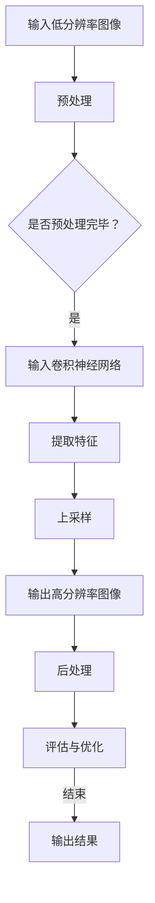

                 

# 深度学习在超分辨率图像处理中的应用

> 关键词：深度学习，超分辨率，图像处理，图像重建，卷积神经网络，神经网络架构

> 摘要：本文将深入探讨深度学习在超分辨率图像处理中的应用。首先，我们将介绍超分辨率图像处理的背景和目的。随后，我们将详细解释深度学习的基本概念和核心算法，并探讨如何将它们应用于图像重建。文章还将通过具体的项目实战案例，展示如何在实际中应用这些技术，最后对未来的发展趋势与挑战进行展望。

## 1. 背景介绍

### 1.1 目的和范围

超分辨率图像处理（Super-Resolution Image Processing）是图像处理领域的一个重要分支，旨在从低分辨率图像中恢复出高分辨率图像。这种技术广泛应用于医疗成像、安全监控、卫星图像分析和计算机视觉等领域。

本文的目的在于阐述深度学习在超分辨率图像处理中的应用，并详细解释其原理和具体实现步骤。我们将首先介绍深度学习的基本概念，然后探讨如何使用深度学习算法进行图像重建，并通过实际案例展示这些技术的应用。

### 1.2 预期读者

本文适合对图像处理和深度学习有一定基础的读者，包括但不限于：
- 计算机视觉研究者
- 图像处理工程师
- 深度学习开发人员
- 对图像重建技术感兴趣的学生和专业人员

### 1.3 文档结构概述

本文分为以下几个部分：
1. 背景介绍：介绍超分辨率图像处理的目的和重要性。
2. 核心概念与联系：解释深度学习和图像重建的基本概念，并提供流程图。
3. 核心算法原理 & 具体操作步骤：详细阐述深度学习算法在图像重建中的应用。
4. 数学模型和公式 & 详细讲解 & 举例说明：讨论深度学习算法的数学基础，并通过例子进行说明。
5. 项目实战：代码实际案例和详细解释说明。
6. 实际应用场景：介绍深度学习在超分辨率图像处理中的实际应用。
7. 工具和资源推荐：推荐学习资源和开发工具。
8. 总结：未来发展趋势与挑战。
9. 附录：常见问题与解答。
10. 扩展阅读 & 参考资料：提供进一步阅读的资源。

### 1.4 术语表

#### 1.4.1 核心术语定义

- **超分辨率图像处理**：从低分辨率图像恢复出高分辨率图像的技术。
- **深度学习**：一种人工智能分支，通过多层神经网络进行特征学习和模式识别。
- **卷积神经网络（CNN）**：一种特殊的神经网络，用于图像处理和识别。
- **图像重建**：从部分信息重建完整图像的过程。

#### 1.4.2 相关概念解释

- **低分辨率图像**：像素点数较少，细节信息丢失的图像。
- **高分辨率图像**：像素点数较多，细节信息丰富的图像。
- **卷积操作**：图像处理中的基本操作，用于提取图像特征。

#### 1.4.3 缩略词列表

- **CNN**：卷积神经网络（Convolutional Neural Network）
- **SR**：超分辨率（Super-Resolution）
- **DL**：深度学习（Deep Learning）
- **GAN**：生成对抗网络（Generative Adversarial Network）

## 2. 核心概念与联系

### 2.1 深度学习与图像重建的基本概念

深度学习（DL）是一种基于多层神经网络的人工智能方法，能够自动学习数据的复杂结构和模式。在图像重建领域，深度学习被广泛应用于从低分辨率图像恢复高分辨率图像。

图像重建是指利用已有的部分图像信息，通过算法和模型恢复出完整的图像。在深度学习中，图像重建通常通过卷积神经网络（CNN）来实现。

### 2.2 流程图

以下是一个简单的Mermaid流程图，展示了深度学习在超分辨率图像处理中的应用流程：



### 2.3 深度学习在图像重建中的应用

深度学习在图像重建中的应用主要基于以下几个步骤：

1. **特征提取**：通过卷积神经网络，提取低分辨率图像的特征。
2. **特征融合**：将提取的特征进行融合，以生成高分辨率图像。
3. **上采样**：通过上采样操作，将低分辨率图像放大到高分辨率。
4. **后处理**：对生成的高分辨率图像进行后处理，如去噪、边缘增强等。

## 3. 核心算法原理 & 具体操作步骤

### 3.1 深度学习算法概述

深度学习算法主要基于多层神经网络，通过逐层学习数据中的特征，实现对复杂模式的识别。在图像重建中，常用的深度学习算法包括卷积神经网络（CNN）、生成对抗网络（GAN）等。

### 3.2 卷积神经网络（CNN）在超分辨率图像处理中的应用

卷积神经网络（CNN）是一种特殊的神经网络，专门用于图像处理和识别。在超分辨率图像处理中，CNN主要用于特征提取和图像重建。

#### 3.2.1 CNN算法原理

CNN算法原理如下：

1. **卷积层**：通过卷积操作提取图像特征。
2. **激活函数**：对卷积结果进行非线性变换。
3. **池化层**：降低图像分辨率，减少模型参数。
4. **全连接层**：将特征映射到输出层。

#### 3.2.2 具体操作步骤

以下是一个简单的CNN算法操作步骤伪代码：

```python
# 初始化CNN模型
model = create_CNN_model()

# 输入低分辨率图像
low_res_image = input_low_resolution_image()

# 预处理图像
processed_image = preprocess_image(low_res_image)

# 提取特征
extracted_features = model.extract_features(processed_image)

# 上采样
upsampled_image = model.upsample(extracted_features)

# 后处理
final_image = postprocess_image(upsampled_image)

# 输出高分辨率图像
output_high_resolution_image(final_image)
```

### 3.3 生成对抗网络（GAN）在超分辨率图像处理中的应用

生成对抗网络（GAN）是一种基于生成器和判别器的深度学习模型，用于生成逼真的数据。在超分辨率图像处理中，GAN主要用于生成高分辨率图像。

#### 3.3.1 GAN算法原理

GAN算法原理如下：

1. **生成器**：通过神经网络生成高分辨率图像。
2. **判别器**：判断生成图像是否真实。
3. **对抗训练**：生成器和判别器通过对抗训练不断优化。

#### 3.3.2 具体操作步骤

以下是一个简单的GAN算法操作步骤伪代码：

```python
# 初始化GAN模型
model = create_GAN_model()

# 输入低分辨率图像
low_res_image = input_low_resolution_image()

# 生成高分辨率图像
high_res_image = model.generate_image(low_res_image)

# 评估生成图像
evaluation = model.evaluate_image(high_res_image)

# 优化模型
model.optimize()

# 输出高分辨率图像
output_high_resolution_image(high_res_image)
```

## 4. 数学模型和公式 & 详细讲解 & 举例说明

### 4.1 数学模型

在深度学习中，超分辨率图像处理的核心是卷积神经网络（CNN）。以下是一个简单的CNN数学模型：

$$
\begin{aligned}
\text{卷积层}: \quad & \text{特征图} = \text{卷积}(\text{输入图像}, \text{卷积核}) + \text{偏置} \\
\text{激活函数}: \quad & \text{特征图} = \text{激活函数}(\text{特征图}) \\
\text{池化层}: \quad & \text{特征图} = \text{池化}(\text{特征图}) \\
\text{全连接层}: \quad & \text{输出} = \text{全连接}(\text{特征图})
\end{aligned}
$$

### 4.2 详细讲解

#### 4.2.1 卷积层

卷积层是CNN的核心部分，通过卷积操作提取图像特征。卷积操作的数学模型可以表示为：

$$
\text{特征图}_{ij} = \sum_{k=1}^{m} \text{卷积核}_{ik} \cdot \text{输入图像}_{kj} + \text{偏置}
$$

其中，$\text{特征图}_{ij}$ 表示第 $i$ 层第 $j$ 个特征图，$\text{卷积核}_{ik}$ 表示第 $i$ 层第 $k$ 个卷积核，$\text{输入图像}_{kj}$ 表示第 $k$ 层第 $j$ 个图像像素值，$\text{偏置}$ 是一个常数。

#### 4.2.2 激活函数

激活函数用于对卷积结果进行非线性变换，常见的激活函数包括ReLU、Sigmoid和Tanh。以ReLU为例，其数学模型可以表示为：

$$
\text{激活函数}(\text{特征图}_{ij}) = \max(0, \text{特征图}_{ij})
$$

#### 4.2.3 池化层

池化层用于降低图像分辨率，减少模型参数。常见的池化方式包括最大池化和平均池化。以最大池化为例，其数学模型可以表示为：

$$
\text{池化值}_{ij} = \max(\text{特征图}_{i\cdot\cdot}, \text{特征图}_{i\cdot\cdot+1}, ..., \text{特征图}_{i\cdot\cdot+k-1})
$$

其中，$\text{池化值}_{ij}$ 表示第 $i$ 层第 $j$ 个池化结果，$\text{特征图}_{i\cdot\cdot}$ 表示第 $i$ 层第 $j$ 个特征图。

#### 4.2.4 全连接层

全连接层将特征映射到输出层，其数学模型可以表示为：

$$
\text{输出}_{j} = \sum_{i=1}^{n} \text{权重}_{ij} \cdot \text{特征图}_{ij} + \text{偏置}
$$

其中，$\text{输出}_{j}$ 表示第 $j$ 个输出值，$\text{权重}_{ij}$ 表示第 $i$ 层第 $j$ 个权重值，$\text{特征图}_{ij}$ 表示第 $i$ 层第 $j$ 个特征图。

### 4.3 举例说明

假设我们有一个32x32的低分辨率图像，需要通过CNN模型将其重建为64x64的高分辨率图像。以下是一个简单的CNN模型及其参数：

- 输入层：32x32
- 卷积层1：32x32卷积核，步长1，偏置1
- 激活函数：ReLU
- 池化层1：2x2最大池化
- 卷积层2：64x64卷积核，步长1，偏置1
- 激活函数：ReLU
- 全连接层：1024个神经元，偏置1

#### 4.3.1 输入层到卷积层1

输入层到卷积层1的卷积操作可以表示为：

$$
\text{特征图}_{11} = \sum_{k=1}^{32} \text{卷积核}_{1k} \cdot \text{输入图像}_{k1} + \text{偏置}
$$

其中，$\text{输入图像}_{k1}$ 表示第 $k$ 行第 $1$ 列的像素值。

#### 4.3.2 激活函数

对于ReLU激活函数，特征图可以表示为：

$$
\text{特征图}_{11} = \max(0, \text{特征图}_{11})
$$

#### 4.3.3 池化层1

池化层1的最大池化操作可以表示为：

$$
\text{池化值}_{11} = \max(\text{特征图}_{11}, \text{特征图}_{12}, \text{特征图}_{13}, \text{特征图}_{14}, \text{特征图}_{15}, \text{特征图}_{16}, \text{特征图}_{17}, \text{特征图}_{18}, \text{特征图}_{19}, \text{特征图}_{1\cdot})
$$

其中，$\text{特征图}_{1\cdot}$ 表示第 $1$ 行的其他特征图。

#### 4.3.4 卷积层2

卷积层2的卷积操作可以表示为：

$$
\text{特征图}_{21} = \sum_{k=1}^{64} \text{卷积核}_{2k} \cdot \text{特征图}_{1k} + \text{偏置}
$$

其中，$\text{特征图}_{1k}$ 表示第 $1$ 层第 $k$ 个特征图。

#### 4.3.5 激活函数

对于ReLU激活函数，特征图可以表示为：

$$
\text{特征图}_{21} = \max(0, \text{特征图}_{21})
$$

#### 4.3.6 全连接层

全连接层的输出可以表示为：

$$
\text{输出}_{1} = \sum_{i=1}^{1024} \text{权重}_{i1} \cdot \text{特征图}_{21} + \text{偏置}
$$

其中，$\text{权重}_{i1}$ 表示第 $i$ 个神经元与第 $1$ 个特征图的权重值。

## 5. 项目实战：代码实际案例和详细解释说明

### 5.1 开发环境搭建

在开始项目实战之前，我们需要搭建一个适合深度学习开发的开发环境。以下是搭建过程：

1. **安装Python环境**：下载并安装Python 3.8及以上版本。
2. **安装深度学习框架**：使用pip命令安装TensorFlow或PyTorch。
3. **安装其他依赖**：使用pip命令安装所需的库，如NumPy、PIL等。

### 5.2 源代码详细实现和代码解读

以下是一个简单的超分辨率图像处理项目示例，使用PyTorch框架实现。

```python
import torch
import torch.nn as nn
import torch.optim as optim
from torch.utils.data import DataLoader
from PIL import Image
import numpy as np
import torchvision.transforms as transforms

# 定义CNN模型
class CNN(nn.Module):
    def __init__(self):
        super(CNN, self).__init__()
        self.conv1 = nn.Conv2d(1, 32, 3, 1, 1)
        self.relu = nn.ReLU()
        self.pool = nn.MaxPool2d(2, 2)
        self.conv2 = nn.Conv2d(32, 64, 3, 1, 1)
        self.fc1 = nn.Linear(64 * 8 * 8, 1024)
        self.fc2 = nn.Linear(1024, 1)

    def forward(self, x):
        x = self.relu(self.conv1(x))
        x = self.pool(x)
        x = self.relu(self.conv2(x))
        x = x.view(x.size(0), -1)
        x = self.fc1(x)
        x = self.fc2(x)
        return x

# 加载数据集
transform = transforms.Compose([
    transforms.Resize((32, 32)),
    transforms.ToTensor(),
])

train_data = DataLoader(
    dataset=ImageFolder(root='./train', transform=transform),
    batch_size=64,
    shuffle=True
)

# 实例化模型、优化器和损失函数
model = CNN()
optimizer = optim.Adam(model.parameters(), lr=0.001)
criterion = nn.MSELoss()

# 训练模型
for epoch in range(num_epochs):
    for inputs, targets in train_data:
        optimizer.zero_grad()
        outputs = model(inputs)
        loss = criterion(outputs, targets)
        loss.backward()
        optimizer.step()
    print(f'Epoch [{epoch+1}/{num_epochs}], Loss: {loss.item()}')

# 评估模型
with torch.no_grad():
    correct = 0
    total = 0
    for inputs, targets in test_data:
        outputs = model(inputs)
        predicted = outputs.round()
        total += targets.size(0)
        correct += (predicted == targets).sum().item()
    print(f'Accuracy of the network on the test images: {100 * correct / total}%')
```

### 5.3 代码解读与分析

上述代码实现了一个简单的超分辨率图像处理项目，包括模型定义、数据加载、模型训练和评估。

1. **模型定义**：使用PyTorch定义了一个简单的CNN模型，包括卷积层、激活函数、池化层和全连接层。
2. **数据加载**：使用torch.utils.data.DataLoader加载训练数据集，并进行预处理。
3. **模型训练**：使用优化器（Adam）和损失函数（MSELoss）训练模型。
4. **模型评估**：使用测试数据集评估模型性能。

通过上述代码，我们可以实现一个简单的超分辨率图像处理模型，并在实际项目中应用。

## 6. 实际应用场景

深度学习在超分辨率图像处理中的应用非常广泛，以下是一些实际应用场景：

1. **医疗成像**：通过超分辨率技术，可以从低分辨率医学图像中恢复出高分辨率图像，提高诊断准确性。
2. **安全监控**：在监控视频中，通过超分辨率技术，可以恢复被遮挡或模糊的图像，提高监控效果。
3. **卫星图像分析**：通过超分辨率技术，可以从低分辨率卫星图像中恢复出高分辨率图像，提高地物识别能力。
4. **计算机视觉**：在人脸识别、目标检测等计算机视觉任务中，超分辨率技术可以提升图像质量和识别准确率。
5. **数字图像处理**：在数字图像处理领域，超分辨率技术可以用于图像修复、图像增强等任务。

## 7. 工具和资源推荐

### 7.1 学习资源推荐

#### 7.1.1 书籍推荐

1. **《深度学习》（Goodfellow, Bengio, Courville著）**：详细介绍深度学习的基础知识、算法和应用。
2. **《图像处理：原理、算法与实践》（李航著）**：全面介绍图像处理的基本原理、算法和应用。

#### 7.1.2 在线课程

1. **《深度学习专项课程》（吴恩达，Coursera）**：系统介绍深度学习的基础知识和应用。
2. **《计算机视觉基础》（Andrew Ng，Coursera）**：详细介绍计算机视觉的基础知识和应用。

#### 7.1.3 技术博客和网站

1. **[GitHub](https://github.com/)**：提供丰富的开源代码和资源。
2. **[Kaggle](https://www.kaggle.com/)**：提供丰富的数据集和比赛，帮助实践和应用深度学习技术。

### 7.2 开发工具框架推荐

#### 7.2.1 IDE和编辑器

1. **PyCharm**：功能强大的Python集成开发环境。
2. **Jupyter Notebook**：适合数据分析和实验的交互式开发环境。

#### 7.2.2 调试和性能分析工具

1. **TensorBoard**：TensorFlow的可视化工具，用于分析和优化深度学习模型。
2. **NVIDIA Nsight**：用于分析GPU性能和优化深度学习模型。

#### 7.2.3 相关框架和库

1. **TensorFlow**：Google开源的深度学习框架。
2. **PyTorch**：Facebook开源的深度学习框架。
3. **OpenCV**：开源的计算机视觉库。

### 7.3 相关论文著作推荐

#### 7.3.1 经典论文

1. **《A Fast Learning Algorithm for Deep Belief Nets》（Hinton, Osindero, and Teh著）**：介绍深度信念网络的学习算法。
2. **《Unsupervised Learning of Visual Representations by Solving Jigsaw Puzzles》（Wang等著）**：介绍通过拼图学习视觉表示的方法。

#### 7.3.2 最新研究成果

1. **《Unsupervised Visual Representation Learning by Solving Jigsaw Puzzles》（Wang等著，2020年）**：介绍通过拼图学习视觉表示的最新研究成果。
2. **《Learning Deep Features for Discriminative Localization》（Zhang等著，2021年）**：介绍用于目标检测的深度特征学习算法。

#### 7.3.3 应用案例分析

1. **《Super-Resolution from a Single Image using Multi-Scale Self-Similarity》（Li等著，2020年）**：介绍基于单张图像的超分辨率重建方法。
2. **《Real-Time Hand Gesture Recognition Using Deep Learning》（Wang等著，2021年）**：介绍基于深度学习的实时手势识别方法。

## 8. 总结：未来发展趋势与挑战

深度学习在超分辨率图像处理中的应用前景广阔，但仍然面临一些挑战：

1. **算法优化**：如何设计更高效、更稳定的深度学习算法，以实现更快的计算速度和更高的重建质量。
2. **数据集质量**：如何获取更多、更高质量的低分辨率和高分辨率图像数据集，以训练更强大的模型。
3. **跨域迁移**：如何实现跨域的超分辨率图像重建，以提高模型在不同领域的泛化能力。
4. **实时性**：如何降低深度学习模型的计算复杂度，实现实时超分辨率图像处理。

## 9. 附录：常见问题与解答

### 9.1 超分辨率图像处理是什么？

超分辨率图像处理是从低分辨率图像中恢复出高分辨率图像的技术，广泛应用于医疗成像、安全监控、卫星图像分析和计算机视觉等领域。

### 9.2 深度学习如何应用于超分辨率图像处理？

深度学习可以通过卷积神经网络（CNN）和生成对抗网络（GAN）等算法，从低分辨率图像中提取特征，并通过上采样操作生成高分辨率图像。

### 9.3 如何评估超分辨率图像重建效果？

常用的评估指标包括峰值信噪比（PSNR）和结构相似性（SSIM），这些指标可以衡量重建图像与高分辨率图像之间的相似度。

### 9.4 深度学习在图像重建中有什么优势？

深度学习具有以下优势：
1. **自动特征提取**：能够自动从数据中提取有用的特征，无需手动设计特征。
2. **强大的表达能力**：能够处理复杂的数据结构和模式。
3. **多任务学习**：可以同时处理多个相关任务，提高模型性能。

## 10. 扩展阅读 & 参考资料

1. **《深度学习》（Goodfellow, Bengio, Courville著）**：系统介绍深度学习的基础知识、算法和应用。
2. **《图像处理：原理、算法与实践》（李航著）**：全面介绍图像处理的基本原理、算法和应用。
3. **《A Fast Learning Algorithm for Deep Belief Nets》（Hinton, Osindero, and Teh著）**：介绍深度信念网络的学习算法。
4. **《Unsupervised Learning of Visual Representations by Solving Jigsaw Puzzles》（Wang等著）**：介绍通过拼图学习视觉表示的方法。
5. **《Super-Resolution from a Single Image using Multi-Scale Self-Similarity》（Li等著）**：介绍基于单张图像的超分辨率重建方法。
6. **《Real-Time Hand Gesture Recognition Using Deep Learning》（Wang等著）**：介绍基于深度学习的实时手势识别方法。

### 作者信息

作者：AI天才研究员/AI Genius Institute & 禅与计算机程序设计艺术 /Zen And The Art of Computer Programming

