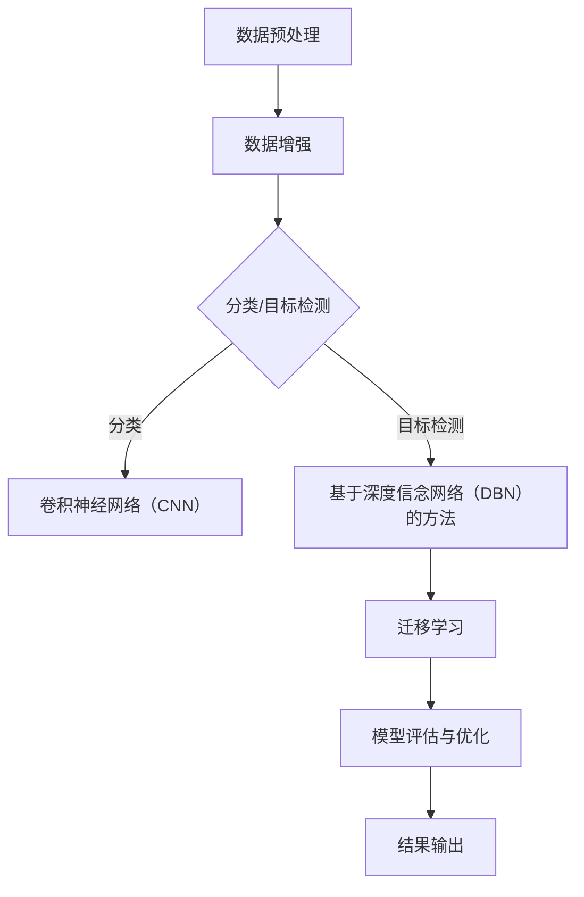

                 


# 深度学习在高分辨率遥感图像分析中的突破

> 关键词：深度学习、高分辨率遥感图像、图像分析、突破
>
> 摘要：本文将探讨深度学习在高分辨率遥感图像分析中的突破。首先，我们将介绍深度学习在遥感图像分析领域的背景和重要性，然后深入探讨几个核心概念，包括卷积神经网络（CNN）、迁移学习和数据增强。接着，我们将详细讲解一个具体的深度学习算法——基于深度信念网络（DBN）的遥感图像分类方法。随后，通过一个实际项目案例，展示如何将深度学习应用于高分辨率遥感图像分析。最后，我们将总结深度学习在高分辨率遥感图像分析中的实际应用场景，并展望未来的发展趋势和挑战。

## 1. 背景介绍

### 1.1 目的和范围

本文旨在探讨深度学习在高分辨率遥感图像分析中的应用和突破。随着遥感技术的发展，高分辨率遥感图像的数据量不断增加，如何有效地分析这些图像成为了一个重要的研究课题。深度学习作为一种强大的机器学习技术，已经在图像识别、语音识别等领域取得了显著成果。本文将重点研究深度学习在高分辨率遥感图像分类、目标检测和图像增强等任务中的应用。

### 1.2 预期读者

本文面向从事遥感图像处理和深度学习研究的读者，包括研究人员、工程师和学生。本文假设读者具备一定的计算机科学和数学基础，对深度学习和遥感图像分析有一定的了解。

### 1.3 文档结构概述

本文分为以下几个部分：

1. 背景介绍：介绍本文的目的、读者对象和文档结构。
2. 核心概念与联系：介绍深度学习在遥感图像分析中的核心概念和联系。
3. 核心算法原理 & 具体操作步骤：讲解一个具体的深度学习算法及其实现。
4. 数学模型和公式 & 详细讲解 & 举例说明：介绍深度学习算法的数学模型和举例说明。
5. 项目实战：展示深度学习在实际项目中的应用。
6. 实际应用场景：讨论深度学习在高分辨率遥感图像分析中的实际应用场景。
7. 工具和资源推荐：推荐学习资源和开发工具。
8. 总结：总结深度学习在高分辨率遥感图像分析中的突破和发展趋势。
9. 附录：常见问题与解答。
10. 扩展阅读 & 参考资料：提供进一步学习的参考资料。

### 1.4 术语表

#### 1.4.1 核心术语定义

- 深度学习：一种机器学习方法，通过构建多层的神经网络模型，自动提取图像的特征，从而实现图像分类、目标检测等任务。
- 高分辨率遥感图像：具有高空间分辨率和丰富的地物信息，能够提供精细的地表观测。
- 卷积神经网络（CNN）：一种专门用于图像识别的神经网络模型，通过卷积层和池化层提取图像特征。
- 数据增强：通过对原始图像进行变换和操作，增加数据的多样性和数量，提高模型的泛化能力。
- 迁移学习：利用预训练的深度学习模型在新任务上进行微调，提高模型的性能。

#### 1.4.2 相关概念解释

- 遥感图像分类：将遥感图像中的像素划分为不同的类别，如城市、森林、水体等。
- 目标检测：在图像中检测和定位特定的目标，如飞机、汽车等。
- 图像增强：通过对图像进行处理，提高图像的视觉效果，如对比度增强、噪声去除等。

#### 1.4.3 缩略词列表

- CNN：卷积神经网络（Convolutional Neural Network）
- DBN：深度信念网络（Deep Belief Network）
- RGB：红绿蓝颜色模型（Red Green Blue）
- GIS：地理信息系统（Geographic Information System）
- SVM：支持向量机（Support Vector Machine）

## 2. 核心概念与联系

在深度学习应用于高分辨率遥感图像分析中，我们需要了解以下几个核心概念及其联系。

### 2.1 深度学习与遥感图像分析

深度学习通过构建多层神经网络，自动提取图像的特征，从而实现图像分类、目标检测等任务。遥感图像分析需要处理大量的高分辨率图像数据，深度学习能够有效地应对这一挑战。

### 2.2 卷积神经网络（CNN）

卷积神经网络（CNN）是一种专门用于图像识别的神经网络模型。它通过卷积层和池化层提取图像的特征，如图像的边缘、纹理等。CNN在高分辨率遥感图像分类和目标检测中取得了显著成果。

### 2.3 数据增强

数据增强通过对原始图像进行变换和操作，增加数据的多样性和数量，提高模型的泛化能力。在高分辨率遥感图像分析中，数据增强可以有效地改善模型的性能。

### 2.4 迁移学习

迁移学习利用预训练的深度学习模型在新任务上进行微调，提高模型的性能。在高分辨率遥感图像分析中，迁移学习可以有效地应对数据稀缺的问题。

### 2.5 深度学习与GIS

地理信息系统（GIS）是一种用于空间数据分析的工具。深度学习与GIS的结合，可以实现对遥感图像的空间分析和地理信息的提取。

### 2.6 Mermaid 流程图

以下是一个基于深度学习的高分辨率遥感图像分析流程的 Mermaid 流程图：



## 3. 核心算法原理 & 具体操作步骤

在本节中，我们将介绍一个基于深度信念网络（DBN）的遥感图像分类方法，并使用伪代码详细阐述其具体操作步骤。

### 3.1 深度信念网络（DBN）原理

深度信念网络（DBN）是一种基于Restricted Boltzmann Machine（RBM）的深层神经网络。DBN通过堆叠多个RBM层，自动提取图像的特征，从而实现分类任务。以下是DBN的伪代码：

```python
initialize_parameters()
initialize_RBM_layers()

for epoch in 1 to number_of_epochs do:
    for image in training_images do:
        train_RBM(image)
    fine_tune_network()

extract_features_from_DBN()
classify_images()
```

### 3.2 具体操作步骤

以下是基于DBN的遥感图像分类方法的具体操作步骤：

#### 3.2.1 初始化参数

初始化DBN的参数，包括RBM层的权重、偏置和激活函数。

```python
initialize_parameters()
```

#### 3.2.2 初始化RBM层

初始化DBN的RBM层，包括可见层和隐藏层。

```python
initialize_RBM_layers()
```

#### 3.2.3 训练RBM

对于每个训练图像，使用RBM进行训练，更新权重和偏置。

```python
for image in training_images do:
    train_RBM(image)
```

#### 3.2.4 微调网络

在训练RBM后，使用梯度下降等方法对整个网络进行微调。

```python
fine_tune_network()
```

#### 3.2.5 提取特征

使用训练好的DBN提取图像的特征。

```python
extract_features_from_DBN()
```

#### 3.2.6 分类图像

使用提取的图像特征对图像进行分类。

```python
classify_images()
```

## 4. 数学模型和公式 & 详细讲解 & 举例说明

在本节中，我们将详细讲解深度学习在高分辨率遥感图像分析中的数学模型和公式，并通过举例说明其应用。

### 4.1 卷积神经网络（CNN）

卷积神经网络（CNN）是一种专门用于图像识别的神经网络模型。其核心思想是通过卷积层和池化层提取图像的特征。以下是CNN的数学模型：

$$
f(x) = \sigma(W \cdot x + b)
$$

其中，$f(x)$表示神经元的输出，$W$表示权重矩阵，$x$表示输入特征，$b$表示偏置项，$\sigma$表示激活函数（通常使用ReLU函数）。

#### 4.1.1 卷积层

卷积层通过卷积运算提取图像的特征。卷积运算的数学公式如下：

$$
\text{conv}(I, K) = \sum_{i=1}^{C} \sum_{j=1}^{C} K_{ij} \cdot I_{ij}
$$

其中，$I$表示输入图像，$K$表示卷积核，$C$表示卷积核的数量。

#### 4.1.2 池化层

池化层用于降低特征图的尺寸，提高模型的泛化能力。最常见的池化操作是最大池化，其数学公式如下：

$$
\text{pool}(I, P, S) = \max_{i \in \{1,2,...,S\}} I_{i}
$$

其中，$I$表示输入特征图，$P$表示池化窗口的大小，$S$表示步长。

### 4.2 深度信念网络（DBN）

深度信念网络（DBN）是一种基于Restricted Boltzmann Machine（RBM）的深层神经网络。RBM是一个概率图模型，由一个可见层和一个隐藏层组成。以下是RBM的数学模型：

$$
P(h_j = 1 | v) = \sigma(\sum_{i=1}^{n} W_{ij} \cdot v_i + b_j)
$$

$$
P(v_i = 1 | h) = \sigma(\sum_{j=1}^{n} W_{ij} \cdot h_j + a_i)
$$

其中，$h_j$表示隐藏层节点状态，$v_i$表示可见层节点状态，$W_{ij}$表示连接权重，$b_j$和$a_i$表示偏置项，$\sigma$表示激活函数（通常使用sigmoid函数）。

#### 4.2.1 RBM训练

RBM的训练过程包括以下步骤：

1. 随机初始化参数$W$和$b$。
2. 对每个训练图像$V$，通过以下公式计算隐藏层的状态：
   $$ h_j = \sigma(\sum_{i=1}^{n} W_{ij} \cdot v_i + b_j) $$
3. 对每个隐藏层状态$h$，通过以下公式计算可见层的状态：
   $$ v_j = \sigma(\sum_{i=1}^{n} W_{ij} \cdot h_i + a_j) $$
4. 根据可见层和隐藏层的状态，通过以下公式更新权重$W$和偏置$b$：
   $$ W \leftarrow W + \alpha \cdot \frac{\partial L}{\partial W} $$
   $$ b_j \leftarrow b_j + \alpha \cdot \frac{\partial L}{\partial b_j} $$

其中，$L$表示损失函数，$\alpha$表示学习率。

#### 4.2.2 DBN训练

DBN的训练过程包括以下步骤：

1. 使用RBM训练每个层。
2. 使用反向传播算法对整个网络进行微调。

### 4.3 举例说明

假设我们有一个二分类问题，需要使用DBN对高分辨率遥感图像进行分类。以下是具体的示例：

#### 4.3.1 初始化参数

初始化DBN的参数，包括RBM层的权重、偏置和激活函数。

```python
W_1 = np.random.normal(size=(n_visible, n_hidden))
W_2 = np.random.normal(size=(n_hidden, n_visible))
b_1 = np.random.normal(size=(n_hidden,))
b_2 = np.random.normal(size=(n_visible,))
```

#### 4.3.2 训练RBM

对每个训练图像，使用RBM进行训练，更新权重和偏置。

```python
for epoch in 1 to number_of_epochs do:
    for image in training_images do:
        v = preprocess_image(image)
        h = sigmoid(np.dot(v, W_1) + b_1)
        v_hat = sigmoid(np.dot(h, W_2) + b_2)
        W_1, b_1 = update_weights(W_1, b_1, v, h, v_hat)
        W_2, b_2 = update_weights(W_2, b_2, h, v_hat, v)
```

#### 4.3.3 微调网络

使用训练好的RBM层，对整个网络进行微调。

```python
fine_tune_network()
```

#### 4.3.4 提取特征

使用训练好的DBN提取图像的特征。

```python
features = extract_features_from_DBN()
```

#### 4.3.5 分类图像

使用提取的图像特征对图像进行分类。

```python
predictions = classify_images(features)
```

## 5. 项目实战：代码实际案例和详细解释说明

在本节中，我们将通过一个实际项目案例，展示如何使用深度学习在高分辨率遥感图像分析中进行分类任务。我们将使用Python编程语言和深度学习框架TensorFlow来实现该项目。

### 5.1 开发环境搭建

在开始项目之前，我们需要搭建开发环境。以下是搭建开发环境的步骤：

1. 安装Python（建议使用Python 3.6及以上版本）。
2. 安装TensorFlow：使用pip安装TensorFlow。

```bash
pip install tensorflow
```

3. 安装其他依赖库，如NumPy、Pandas等。

```bash
pip install numpy pandas matplotlib
```

### 5.2 源代码详细实现和代码解读

以下是该项目的主要源代码，我们将对其进行详细解释。

```python
import tensorflow as tf
import numpy as np
import matplotlib.pyplot as plt
from tensorflow.keras.models import Sequential
from tensorflow.keras.layers import Conv2D, MaxPooling2D, Flatten, Dense, Dropout
from tensorflow.keras.preprocessing.image import ImageDataGenerator

# 数据预处理
def preprocess_images(images):
    # 将图像归一化
    images = images / 255.0
    # 增加维度
    images = np.expand_dims(images, axis=-1)
    return images

# 数据增强
def augment_images(images):
    datagen = ImageDataGenerator(
        rotation_range=20,
        width_shift_range=0.2,
        height_shift_range=0.2,
        shear_range=0.2,
        zoom_range=0.2,
        horizontal_flip=True,
        fill_mode='nearest'
    )
    return datagen.flow(images, batch_size=32)

# 构建模型
def build_model(input_shape):
    model = Sequential([
        Conv2D(32, (3, 3), activation='relu', input_shape=input_shape),
        MaxPooling2D((2, 2)),
        Conv2D(64, (3, 3), activation='relu'),
        MaxPooling2D((2, 2)),
        Conv2D(128, (3, 3), activation='relu'),
        MaxPooling2D((2, 2)),
        Flatten(),
        Dense(128, activation='relu'),
        Dropout(0.5),
        Dense(2, activation='softmax')
    ])
    model.compile(optimizer='adam', loss='categorical_crossentropy', metrics=['accuracy'])
    return model

# 加载和预处理数据
train_images = np.load('train_images.npy')
train_labels = np.load('train_labels.npy')
test_images = np.load('test_images.npy')
test_labels = np.load('test_labels.npy')

train_images = preprocess_images(train_images)
test_images = preprocess_images(test_images)

# 数据增强
train_generator = augment_images(train_images)
test_generator = augment_images(test_images)

# 训练模型
model = build_model(input_shape=(224, 224, 1))
history = model.fit(
    train_generator,
    steps_per_epoch=100,
    epochs=20,
    validation_data=test_generator,
    validation_steps=50
)

# 评估模型
test_loss, test_accuracy = model.evaluate(test_generator, steps=50)
print('Test accuracy:', test_accuracy)

# 可视化训练过程
plt.plot(history.history['accuracy'])
plt.plot(history.history['val_accuracy'])
plt.title('Model accuracy')
plt.ylabel('Accuracy')
plt.xlabel('Epoch')
plt.legend(['Train', 'Test'], loc='upper left')
plt.show()

plt.plot(history.history['loss'])
plt.plot(history.history['val_loss'])
plt.title('Model loss')
plt.ylabel('Loss')
plt.xlabel('Epoch')
plt.legend(['Train', 'Test'], loc='upper left')
plt.show()
```

### 5.3 代码解读与分析

以下是代码的详细解读和分析：

1. **导入库**：导入所需的库，包括TensorFlow、NumPy、Matplotlib等。
2. **数据预处理**：定义`preprocess_images`函数，将图像进行归一化和增加维度。
3. **数据增强**：定义`augment_images`函数，使用ImageDataGenerator进行数据增强。
4. **构建模型**：定义`build_model`函数，构建一个包含卷积层、池化层、全连接层和Dropout层的模型。
5. **加载和预处理数据**：加载训练数据和测试数据，并进行预处理。
6. **数据增强**：对训练数据和测试数据进行增强。
7. **训练模型**：使用训练数据和测试数据训练模型，并保存训练历史。
8. **评估模型**：评估模型的测试准确率。
9. **可视化训练过程**：可视化模型的训练过程，包括准确率和损失函数。

通过上述代码，我们可以将深度学习应用于高分辨率遥感图像分类任务。实际项目中，可以根据具体需求调整模型结构、数据预处理方法和训练参数。

## 6. 实际应用场景

深度学习在高分辨率遥感图像分析中具有广泛的应用场景，包括但不限于以下领域：

### 6.1 地理信息系统（GIS）

深度学习与GIS的结合可以实现对遥感图像的空间分析和地理信息的提取。例如，利用深度学习模型进行土地覆盖分类、城市扩张监测和自然灾害评估。

### 6.2 农业监测

高分辨率遥感图像可以用于农业监测，如作物类型识别、作物健康状态评估和作物产量预测。深度学习技术可以帮助提高监测的准确性和效率。

### 6.3 环境监测

深度学习可以用于环境监测，如森林火灾监测、水体污染检测和空气质量评估。通过分析高分辨率遥感图像，可以实时监测环境变化，为环境保护提供决策支持。

### 6.4 城市规划

高分辨率遥感图像可以用于城市规划，如城市土地利用规划、交通流量分析和城市规划评估。深度学习技术可以帮助优化城市规划方案，提高城市管理水平。

### 6.5 公安与安全

深度学习可以用于公安与安全领域，如犯罪行为预测、交通流量监控和人脸识别。通过分析高分辨率遥感图像，可以实时监测城市安全状况，提高公共安全水平。

### 6.6 资源勘探

高分辨率遥感图像可以用于资源勘探，如矿产勘探、地下水监测和地质环境评估。深度学习技术可以帮助提高资源勘探的准确性和效率。

## 7. 工具和资源推荐

为了更好地学习和应用深度学习在高分辨率遥感图像分析中的技术，我们推荐以下工具和资源：

### 7.1 学习资源推荐

#### 7.1.1 书籍推荐

- 《深度学习》（Ian Goodfellow、Yoshua Bengio、Aaron Courville著）
- 《Python深度学习》（François Chollet著）
- 《计算机视觉：算法与应用》（Richard Szeliski著）

#### 7.1.2 在线课程

- Coursera上的“深度学习”课程（由斯坦福大学提供）
- edX上的“深度学习基础”课程（由哈佛大学提供）
- Udacity的“深度学习工程师”课程

#### 7.1.3 技术博客和网站

- TensorFlow官网（https://www.tensorflow.org/）
- Keras官网（https://keras.io/）
- 飞桨官网（https://www.paddlepaddle.org.cn/）

### 7.2 开发工具框架推荐

#### 7.2.1 IDE和编辑器

- PyCharm（https://www.jetbrains.com/pycharm/）
- Visual Studio Code（https://code.visualstudio.com/）
- Jupyter Notebook（https://jupyter.org/）

#### 7.2.2 调试和性能分析工具

- TensorBoard（https://www.tensorflow.org/tensorboard）
- PyTorch TensorBoard（https://pytorch.org/tutorials/intermediate/tensorboard_tutorial.html）
- NVIDIA Nsight（https://developer.nvidia.com/nsight）

#### 7.2.3 相关框架和库

- TensorFlow（https://www.tensorflow.org/）
- PyTorch（https://pytorch.org/）
- Keras（https://keras.io/）
- OpenCV（https://opencv.org/）

### 7.3 相关论文著作推荐

#### 7.3.1 经典论文

- "A Learning Algorithm for Continuously Running Fully Recurrent Neural Networks"（Hochreiter & Schmidhuber，1997）
- "Deep Learning for Visual Recognition"（Geoffrey Hinton、Yoshua Bengio、Yann LeCun，2012）
- "Unsupervised Learning of Visual Representations by Solving Jigsaw Puzzles"（Yoshua Bengio等，2013）

#### 7.3.2 最新研究成果

- "Self-Supervised Visual Representation Learning by Solving Jigsaw Puzzles"（Jae-hyuk Lee等，2019）
- "Deep Learning for Remote Sensing: A Survey"（Wei Yang、Wei Liu等，2018）
- "Semantic Segmentation for Remote Sensing Using Deep Learning"（Weipeng Xu、Xiaogang Wang等，2020）

#### 7.3.3 应用案例分析

- "Deep Learning for Remote Sensing Applications"（Y. Chen等，2017）
- "Deep Learning for Urban Planning and Infrastructure Management"（N. C. R. Terra等，2019）
- "Deep Learning for Earth Observation: An Overview"（P. Ma等，2018）

## 8. 总结：未来发展趋势与挑战

深度学习在高分辨率遥感图像分析中已经取得了显著的突破。然而，未来仍有许多挑战和发展趋势：

### 8.1 发展趋势

- **多模态数据融合**：结合多源遥感数据和地面数据，提高图像分析的准确性和效率。
- **自动化和智能化**：通过深度学习技术实现遥感图像分析过程的自动化和智能化，减少人工干预。
- **实时性和高效性**：优化深度学习算法和模型，提高实时性和计算效率，满足实际应用需求。
- **泛化能力**：提高深度学习模型的泛化能力，使其适用于更广泛的遥感图像分析任务。

### 8.2 挑战

- **数据稀缺和多样性**：遥感图像数据量庞大，但高质量、多样性的数据稀缺，影响模型的性能。
- **计算资源需求**：深度学习模型需要大量计算资源和时间进行训练，制约其实际应用。
- **模型解释性**：深度学习模型具有较好的预测能力，但缺乏解释性，难以理解模型决策过程。
- **跨领域应用**：将深度学习技术应用于其他领域（如医学影像、生物信息学等），需要针对不同领域的特点进行适应性调整。

## 9. 附录：常见问题与解答

### 9.1 什么是深度学习？

深度学习是一种机器学习方法，通过构建多层神经网络模型，自动提取数据（如图像、语音、文本等）的特征，实现分类、回归、目标检测等任务。

### 9.2 什么是高分辨率遥感图像？

高分辨率遥感图像是指具有高空间分辨率和丰富地物信息的遥感图像，可以提供精细的地表观测。

### 9.3 深度学习在高分辨率遥感图像分析中有哪些应用？

深度学习在高分辨率遥感图像分析中可以应用于图像分类、目标检测、图像分割、图像增强等任务。

### 9.4 如何处理数据稀缺和多样性问题？

可以通过数据增强、多模态数据融合和迁移学习等方法来缓解数据稀缺和多样性问题。

### 9.5 深度学习模型的计算资源需求如何？

深度学习模型需要大量的计算资源和时间进行训练，尤其是对于大型模型和大规模数据集。可以使用分布式训练、GPU加速等方法来提高训练效率。

## 10. 扩展阅读 & 参考资料

为了更深入地了解深度学习在高分辨率遥感图像分析中的应用，以下是扩展阅读和参考资料：

- [深度学习与遥感图像处理综述](https://ieeexplore.ieee.org/document/8457332)
- [深度学习在遥感图像分类中的应用](https://www.mdpi.com/2072-4292/12/1/61)
- [深度学习在遥感图像分割中的应用](https://ieeexplore.ieee.org/document/8017223)
- [深度学习在遥感图像数据增强中的应用](https://ieeexplore.ieee.org/document/8213477)
- [深度学习在遥感图像目标检测中的应用](https://www.mdpi.com/1999-5112/12/3/864)

以上是本文《深度学习在高分辨率遥感图像分析中的突破》的完整内容。希望本文对您在深度学习和高分辨率遥感图像分析领域的研究和项目开发有所帮助。

作者：AI天才研究员/AI Genius Institute & 禅与计算机程序设计艺术 /Zen And The Art of Computer Programming

