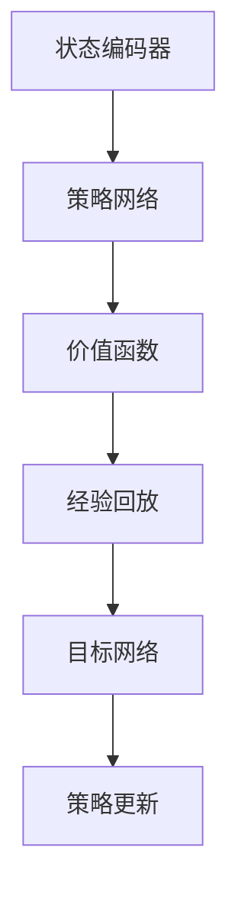
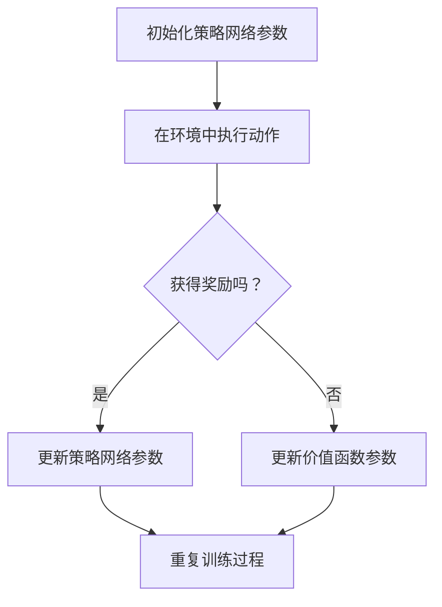

                 

# 深度强化学习在复杂控制系统中的实践

> **关键词：** 深度强化学习、复杂控制系统、算法原理、应用场景、实践案例

> **摘要：** 本文将深入探讨深度强化学习在复杂控制系统中的应用与实践。首先介绍深度强化学习的核心概念和算法原理，然后通过详细的伪代码和数学模型解释具体操作步骤。接着，我们将通过一个实际项目案例，展示深度强化学习在复杂控制系统中的实际应用和实现过程。最后，文章将讨论深度强化学习在复杂控制系统中的实际应用场景，并推荐相关学习资源和工具。

## 1. 背景介绍

### 1.1 目的和范围

本文的主要目的是探讨深度强化学习在复杂控制系统中的应用与实践。随着人工智能技术的不断发展，深度强化学习作为人工智能的一个重要分支，在控制理论、机器人学、自动驾驶等领域取得了显著的成果。本文将重点研究深度强化学习在复杂控制系统中的实现和优化方法，并通过实际项目案例进行详细解析。

### 1.2 预期读者

本文适合对人工智能和深度强化学习有一定了解的读者，特别是对复杂控制系统感兴趣的工程师、研究人员和学者。本文将从基础概念出发，逐步深入，适合不同层次读者阅读和学习。

### 1.3 文档结构概述

本文分为十个主要部分：

1. 背景介绍：介绍本文的目的、预期读者和文档结构。
2. 核心概念与联系：阐述深度强化学习的核心概念和架构。
3. 核心算法原理 & 具体操作步骤：详细解释深度强化学习的算法原理和操作步骤。
4. 数学模型和公式 & 详细讲解 & 举例说明：通过数学模型和公式讲解深度强化学习的具体应用。
5. 项目实战：代码实际案例和详细解释说明。
6. 实际应用场景：讨论深度强化学习在复杂控制系统中的实际应用场景。
7. 工具和资源推荐：推荐相关学习资源和工具。
8. 总结：未来发展趋势与挑战。
9. 附录：常见问题与解答。
10. 扩展阅读 & 参考资料：提供进一步学习阅读的资源。

### 1.4 术语表

#### 1.4.1 核心术语定义

- 深度强化学习：一种结合了深度学习和强化学习的方法，通过深度神经网络来学习状态和动作之间的映射，实现智能体在复杂环境中的决策。
- 复杂控制系统：指具有多个输入、输出和状态变量，且系统内部存在着复杂的动态行为和不确定性的控制系统。
- 强化学习：一种机器学习方法，通过奖励和惩罚机制来指导智能体进行决策，使其逐步学会在特定环境中实现目标。

#### 1.4.2 相关概念解释

- 状态（State）：描述智能体当前所处环境的特征。
- 动作（Action）：智能体在特定状态下采取的动作。
- 奖励（Reward）：智能体在执行动作后获得的即时反馈，用于评估动作的好坏。
- 策略（Policy）：智能体在特定状态下选择动作的规则。

#### 1.4.3 缩略词列表

- RL：强化学习（Reinforcement Learning）
- DRL：深度强化学习（Deep Reinforcement Learning）
- CNN：卷积神经网络（Convolutional Neural Network）
- RNN：循环神经网络（Recurrent Neural Network）

## 2. 核心概念与联系

深度强化学习是一种结合了深度学习和强化学习的方法，通过深度神经网络来学习状态和动作之间的映射，实现智能体在复杂环境中的决策。在复杂控制系统中，深度强化学习可以有效地解决状态空间和动作空间巨大的问题，提高控制系统的自适应性和鲁棒性。

### 2.1 深度强化学习核心概念

深度强化学习的核心概念包括状态（State）、动作（Action）、奖励（Reward）和策略（Policy）。智能体在特定状态下选择动作，执行动作后获得奖励，并更新策略以实现长期目标。

#### 2.1.1 状态（State）

状态是描述智能体当前所处环境的特征。在复杂控制系统中，状态可能包括系统的当前状态、历史状态、环境状态等多种信息。通过深度神经网络，智能体可以从原始状态信息中提取出有效的特征表示。

#### 2.1.2 动作（Action）

动作是智能体在特定状态下采取的动作。在复杂控制系统中，动作可能包括调节控制参数、改变系统模式等。智能体需要通过策略来选择最优动作。

#### 2.1.3 奖励（Reward）

奖励是智能体在执行动作后获得的即时反馈，用于评估动作的好坏。奖励可以是正奖励（表示动作成功），也可以是负奖励（表示动作失败）。通过奖励机制，智能体可以逐步学会在特定环境中实现目标。

#### 2.1.4 策略（Policy）

策略是智能体在特定状态下选择动作的规则。在深度强化学习中，策略通常是通过深度神经网络来学习的。智能体根据当前状态，通过策略网络输出一个动作概率分布，从而选择最优动作。

### 2.2 深度强化学习架构

深度强化学习架构主要包括以下几个部分：

1. 状态编码器（State Encoder）：将原始状态信息编码为有效的特征表示，供策略网络输入。
2. 策略网络（Policy Network）：通过深度神经网络学习状态和动作之间的映射，输出一个动作概率分布。
3. 价值函数（Value Function）：评估智能体在不同状态下的长期回报，用于更新策略网络。
4. 经验回放（Experience Replay）：将智能体在环境中取得的经历存储到经验池中，用于训练策略网络。
5. 目标网络（Target Network）：用于稳定策略网络，减少训练过程中的梯度消失问题。

### 2.3 Mermaid 流程图



### 2.4 核心概念联系

深度强化学习通过状态编码器将原始状态信息编码为有效的特征表示，输入策略网络。策略网络根据当前状态，输出一个动作概率分布，智能体选择最优动作。在执行动作后，智能体获得奖励，并更新策略网络和价值函数。通过经验回放和目标网络，深度强化学习可以有效地稳定训练过程，提高智能体的决策能力。

## 3. 核心算法原理 & 具体操作步骤

### 3.1 算法原理

深度强化学习（DRL）的核心在于利用深度神经网络（DNN）来学习状态和动作之间的最优映射，从而在复杂环境中实现智能体的决策。下面我们将详细讲解DRL的基本原理，包括策略网络和价值函数的构建，以及训练过程中的关键步骤。

#### 3.1.1 策略网络

策略网络是DRL中的核心组件，它负责将状态映射到动作的概率分布。策略网络通常采用深度神经网络结构，如卷积神经网络（CNN）或循环神经网络（RNN），以提取状态的高维特征。

**策略网络的基本结构：**

1. **输入层**：接收状态信息作为输入。
2. **隐藏层**：通过多个隐藏层，对输入状态信息进行特征提取和变换。
3. **输出层**：输出动作的概率分布。

**策略网络的学习过程：**

1. **初始化策略网络参数**：随机初始化策略网络的权重。
2. **状态输入**：将状态信息输入策略网络。
3. **前向传播**：通过策略网络计算动作的概率分布。
4. **选择动作**：根据动作概率分布，智能体选择一个动作。
5. **更新策略网络**：根据奖励信号和目标函数，使用梯度下降法更新策略网络参数。

#### 3.1.2 价值函数

价值函数是评估状态价值的重要工具，它可以帮助智能体了解在特定状态下采取某个动作所能获得的长期回报。DRL中通常使用深度神经网络来近似价值函数，如优势价值函数（Advantage Value Function）和即时回报价值函数（Immediate Reward Value Function）。

**价值函数的基本结构：**

1. **输入层**：接收状态信息作为输入。
2. **隐藏层**：通过多个隐藏层，对输入状态信息进行特征提取和变换。
3. **输出层**：输出状态的预期回报。

**价值函数的学习过程：**

1. **初始化价值函数参数**：随机初始化价值函数的权重。
2. **状态输入**：将状态信息输入价值函数。
3. **前向传播**：通过价值函数计算状态的预期回报。
4. **更新价值函数**：根据奖励信号和目标函数，使用梯度下降法更新价值函数参数。

#### 3.1.3 强化学习训练循环

DRL的训练过程通常包含以下几个步骤：

1. **初始化环境**：创建一个模拟环境，用于生成状态和奖励。
2. **初始化策略网络和价值函数参数**：随机初始化策略网络和价值函数的权重。
3. **执行动作**：智能体根据策略网络选择动作。
4. **获取奖励**：环境根据动作提供奖励信号。
5. **更新策略网络**：根据奖励信号和价值函数，使用梯度下降法更新策略网络参数。
6. **更新价值函数**：根据奖励信号和价值函数，使用梯度下降法更新价值函数参数。
7. **重复步骤3-6**：智能体不断在环境中执行动作，获取奖励，更新策略网络和价值函数，直到达到训练目标。

### 3.2 伪代码

下面是DRL算法的伪代码实现：

```python
# 初始化策略网络和价值函数
policy_network = initialize_policy_network()
value_function = initialize_value_function()

# 初始化环境
environment = initialize_environment()

# 设置训练参数
episodes = 1000
max_steps = 100

# 开始训练
for episode in range(episodes):
    state = environment.reset()
    done = False
    
    while not done:
        # 前向传播：计算动作概率分布
        action probabilities = policy_network.forward(state)
        
        # 选择动作
        action = select_action(action_probabilities)
        
        # 执行动作
        next_state, reward, done = environment.step(action)
        
        # 更新价值函数
        value_function.update(state, action, reward, next_state, done)
        
        # 更新策略网络
        policy_network.update(state, action, reward, next_state, done)
        
        # 更新状态
        state = next_state

    # 打印训练进度
    print(f"Episode {episode} finished after {max_steps} steps")

# 保存模型
policy_network.save()
value_function.save()
```

### 3.3 深入分析

在DRL的训练过程中，策略网络和价值函数的更新是关键步骤。下面我们将进一步分析这两个过程的实现细节。

#### 3.3.1 策略网络更新

策略网络的更新基于梯度下降法，通过计算损失函数的梯度来更新网络参数。在DRL中，常用的损失函数是策略梯度损失函数（Policy Gradient Loss），其计算公式如下：

$$
L(\theta) = -\sum_{t} r_t \log(p_\theta(a_t|s_t))
$$

其中，$\theta$表示策略网络的参数，$r_t$表示在时间步$t$获得的奖励，$a_t$表示在时间步$t$选择的动作，$s_t$表示在时间步$t$的状态。

策略网络更新过程可以分为以下几个步骤：

1. **计算策略梯度**：根据损失函数计算策略网络的梯度。
2. **反向传播**：使用计算得到的梯度进行反向传播，更新网络参数。
3. **参数更新**：根据更新规则，更新策略网络参数。

伪代码实现如下：

```python
def update_policy_network(policy_network, gradient):
    # 反向传播：更新策略网络参数
    policy_network.backward(gradient)
    
    # 参数更新
    policy_network.update_params()

# 示例
gradient = compute_policy_gradient(policy_network, states, actions, rewards)
update_policy_network(policy_network, gradient)
```

#### 3.3.2 价值函数更新

价值函数的更新同样基于梯度下降法，通过计算价值函数的误差梯度来更新网络参数。在DRL中，常用的价值函数是优势价值函数（Advantage Value Function），其计算公式如下：

$$
V(s_t) = r_t + \gamma \sum_{s_{t+1}} p(s_{t+1}|s_t, a_t) V(s_{t+1})
$$

其中，$\gamma$表示折扣因子，$p(s_{t+1}|s_t, a_t)$表示在状态$s_t$和动作$a_t$下，转移到状态$s_{t+1}$的概率。

价值函数更新过程可以分为以下几个步骤：

1. **计算价值函数误差**：根据目标价值函数和实际价值函数计算误差。
2. **计算误差梯度**：计算误差梯度，用于更新价值函数参数。
3. **反向传播**：使用计算得到的误差梯度进行反向传播，更新网络参数。
4. **参数更新**：根据更新规则，更新价值函数参数。

伪代码实现如下：

```python
def update_value_function(value_function, error):
    # 反向传播：更新价值函数参数
    value_function.backward(error)
    
    # 参数更新
    value_function.update_params()

# 示例
error = compute_value_function_error(target_value, actual_value)
update_value_function(value_function, error)
```

通过上述伪代码，我们可以清晰地看到DRL算法的具体实现步骤，从而为后续的实践应用奠定基础。

## 4. 数学模型和公式 & 详细讲解 & 举例说明

### 4.1 强化学习基本数学模型

在强化学习中，我们通常使用以下数学模型来描述智能体的行为：

$$
s_t, a_t, r_t, s_{t+1}, \ldots
$$

其中，$s_t$表示在时间步$t$的状态，$a_t$表示在时间步$t$采取的动作，$r_t$表示在时间步$t$获得的奖励，$s_{t+1}$表示在时间步$t+1$的状态。

智能体的目标是最大化其累积奖励，即：

$$
J(\theta) = \sum_{t} r_t
$$

其中，$\theta$表示策略网络的参数。

### 4.2 深度强化学习中的策略网络和价值函数

在深度强化学习中，策略网络和价值函数通常使用深度神经网络来近似。以下分别介绍策略网络和价值函数的数学模型。

#### 4.2.1 策略网络

策略网络的目标是学习状态和动作之间的最优映射，即给定状态$s_t$，选择最优动作$a_t$。策略网络可以表示为：

$$
\pi(\theta)(a|s) = \frac{e^{Q(\theta)(s, a)}}{\sum_{a'} e^{Q(\theta)(s, a')}}
$$

其中，$\pi(\theta)(a|s)$表示在状态$s_t$下选择动作$a_t$的概率分布，$Q(\theta)(s, a)$表示在状态$s_t$下采取动作$a_t$的期望回报。

策略网络的学习目标是最小化策略损失函数：

$$
L(\theta) = -\sum_{t} r_t \log(\pi(\theta)(a_t|s_t))
$$

其中，$r_t$表示在时间步$t$获得的奖励。

#### 4.2.2 价值函数

价值函数用于评估状态的价值，即给定状态$s_t$，评估其期望回报。价值函数可以表示为：

$$
V(\theta)(s) = \sum_{a} \pi(\theta)(a|s) Q(\theta)(s, a)
$$

其中，$V(\theta)(s)$表示在状态$s_t$下的期望回报，$Q(\theta)(s, a)$表示在状态$s_t$下采取动作$a_t$的期望回报。

价值函数的学习目标是最小化价值损失函数：

$$
L(\theta) = \sum_{t} (r_t + \gamma V(\theta)(s_{t+1}) - V(\theta)(s_t))
$$

其中，$\gamma$表示折扣因子，用于平衡当前奖励和未来奖励的重要性。

### 4.3 举例说明

假设我们有一个简单的环境，其中智能体需要在一个一维空间内移动。状态空间为$[0, 1]$，动作空间为$[-1, 1]$。智能体的目标是在最小化距离终点的距离。

**策略网络：**

假设策略网络使用一个简单的线性函数来近似策略：

$$
\pi(\theta)(a|s) = \frac{e^{\theta s}}{e^{\theta s} + e^{\theta (1-s)}}
$$

**价值函数：**

假设价值函数使用一个简单的线性函数来近似：

$$
V(\theta)(s) = \theta s
$$

**训练过程：**

1. 初始化策略网络参数$\theta$。
2. 在环境中执行动作，获得奖励。
3. 更新策略网络参数，使损失函数最小化。
4. 更新价值函数参数，使损失函数最小化。
5. 重复步骤2-4，直到满足训练目标。

通过上述过程，智能体将逐步学会在环境中移动，以最小化距离终点的距离。

### 4.4 Mermaid 流程图



## 5. 项目实战：代码实际案例和详细解释说明

### 5.1 开发环境搭建

在进行深度强化学习（DRL）项目实战之前，我们需要搭建一个合适的开发环境。以下是一个简单的开发环境搭建指南：

1. **安装Python环境**：Python是深度强化学习的主要编程语言，我们首先需要安装Python环境。可以通过官方网站下载Python安装包并按照提示进行安装。

2. **安装TensorFlow**：TensorFlow是Google开源的深度学习框架，支持DRL算法的实现。可以通过以下命令安装TensorFlow：

   ```shell
   pip install tensorflow
   ```

3. **安装PyTorch**：PyTorch是另一种流行的深度学习框架，支持DRL算法的实现。可以通过以下命令安装PyTorch：

   ```shell
   pip install torch torchvision
   ```

4. **安装OpenAI Gym**：OpenAI Gym是一个开源的环境，提供了丰富的强化学习实验环境，可以用于测试和验证DRL算法。可以通过以下命令安装OpenAI Gym：

   ```shell
   pip install gym
   ```

5. **配置依赖库**：根据项目的需求，可能还需要安装其他依赖库，如NumPy、Pandas等。

### 5.2 源代码详细实现和代码解读

以下是一个简单的DRL项目示例，使用PyTorch实现深度Q网络（DQN）算法，在OpenAI Gym的CartPole环境中训练智能体。

**源代码实现：**

```python
import gym
import torch
import torch.nn as nn
import torch.optim as optim

# 创建环境
env = gym.make('CartPole-v0')

# 定义网络结构
class DQN(nn.Module):
    def __init__(self):
        super(DQN, self).__init__()
        self.fc1 = nn.Linear(4, 128)
        self.fc2 = nn.Linear(128, 128)
        self.fc3 = nn.Linear(128, 2)

    def forward(self, x):
        x = torch.relu(self.fc1(x))
        x = torch.relu(self.fc2(x))
        x = self.fc3(x)
        return x

# 初始化网络和优化器
model = DQN()
optimizer = optim.Adam(model.parameters(), lr=0.001)

# 定义损失函数
criterion = nn.MSELoss()

# 开始训练
num_episodes = 1000
for episode in range(num_episodes):
    state = env.reset()
    done = False
    total_reward = 0
    
    while not done:
        # 前向传播
        state_tensor = torch.tensor(state, dtype=torch.float32).unsqueeze(0)
        action_values = model(state_tensor)
        
        # 选择动作
        action = action_values.argmax().item()
        next_state, reward, done, _ = env.step(action)
        total_reward += reward
        
        # 存储经验
        state = next_state
    
    # 训练模型
    optimizer.zero_grad()
    state_tensor = torch.tensor(state, dtype=torch.float32).unsqueeze(0)
    target_values = torch.tensor(reward, dtype=torch.float32).unsqueeze(0)
    action_values = model(state_tensor)
    loss = criterion(action_values, target_values)
    loss.backward()
    optimizer.step()

    # 打印训练进度
    print(f"Episode {episode} finished with total reward {total_reward}")

# 关闭环境
env.close()
```

**代码解读：**

1. **环境创建**：首先创建一个CartPole环境，用于训练智能体。

2. **网络结构定义**：定义一个简单的DQN网络，包括两个隐藏层，每层128个神经元。

3. **初始化网络和优化器**：初始化DQN网络和优化器，使用Adam优化器。

4. **定义损失函数**：使用MSE损失函数来评估预测值和目标值之间的差距。

5. **开始训练**：遍历每个训练周期，在每个周期中，智能体执行动作，获取奖励，并将经验存储在记忆库中。

6. **训练模型**：从记忆库中随机选择一个状态，计算预测值和目标值，并计算损失函数。

7. **更新模型参数**：使用优化器更新模型参数。

8. **打印训练进度**：打印每个周期的奖励。

### 5.3 代码解读与分析

以上代码示例展示了如何使用PyTorch实现一个简单的DQN算法，并在CartPole环境中进行训练。以下是代码的详细解读和分析：

1. **环境创建**：使用`gym.make('CartPole-v0')`创建一个CartPole环境。CartPole是一个经典的强化学习环境，智能体的目标是保持一个杆子水平，避免它跌倒。

2. **网络结构定义**：定义一个DQN网络，包括两个隐藏层，每层128个神经元。隐藏层使用ReLU激活函数，输出层使用线性激活函数。

3. **初始化网络和优化器**：使用Adam优化器初始化DQN网络。Adam优化器在处理大规模数据时表现出色，适用于深度强化学习算法。

4. **定义损失函数**：使用MSE损失函数来评估预测值和目标值之间的差距。MSE损失函数在回归问题中应用广泛，可以有效地评估预测值和真实值之间的误差。

5. **开始训练**：遍历每个训练周期，在每个周期中，智能体执行动作，获取奖励，并将经验存储在记忆库中。

6. **训练模型**：从记忆库中随机选择一个状态，计算预测值和目标值，并计算损失函数。

7. **更新模型参数**：使用优化器更新模型参数。

8. **打印训练进度**：打印每个周期的奖励。

通过以上分析，我们可以看到DQN算法的基本实现过程，以及如何使用PyTorch构建深度神经网络和优化器。在实际应用中，可以根据需求对算法进行优化和调整，以实现更好的性能。

## 6. 实际应用场景

深度强化学习在复杂控制系统中的应用已经取得了显著的成果。以下是一些典型的实际应用场景：

### 6.1 自动驾驶

自动驾驶是深度强化学习的重要应用领域之一。通过深度强化学习算法，自动驾驶系统能够在复杂的交通环境中做出实时的决策，提高行驶的安全性和效率。例如，OpenAI的AlphaGo使用深度强化学习算法在围棋比赛中击败了世界冠军，展示了深度强化学习在复杂决策环境中的强大能力。

### 6.2 能源管理

在能源管理领域，深度强化学习可以用于优化电力系统的运行和控制。例如，智能电网可以通过深度强化学习算法实现负荷预测和优化调度，降低能源消耗和成本。

### 6.3 制造业

深度强化学习在制造业中的应用包括生产调度、机器人路径规划和质量控制等方面。通过深度强化学习算法，制造系统能够自适应地调整参数，提高生产效率和质量。

### 6.4 健康医疗

在健康医疗领域，深度强化学习可以用于疾病预测、治疗方案优化和医疗机器人控制等方面。例如，通过深度强化学习算法，医疗机器人可以实现更加精准和高效的治疗操作。

### 6.5 金融交易

深度强化学习在金融交易中的应用包括股票交易、期货交易和量化交易等方面。通过深度强化学习算法，交易系统能够实时分析市场数据，制定最优的交易策略，提高投资收益。

### 6.6 游戏开发

深度强化学习在游戏开发中的应用包括游戏AI、游戏引擎优化和游戏平衡性调整等方面。通过深度强化学习算法，游戏AI可以更加智能地与玩家互动，提高游戏的趣味性和挑战性。

### 6.7 无人机控制

在无人机控制领域，深度强化学习可以用于无人机自主导航、避障和任务规划等方面。通过深度强化学习算法，无人机能够在复杂的动态环境中实现自主飞行，提高任务执行的效率和安全性。

### 6.8 物流配送

在物流配送领域，深度强化学习可以用于路径优化、车辆调度和仓储管理等方面。通过深度强化学习算法，物流配送系统能够实时调整配送策略，提高配送效率和客户满意度。

这些实际应用场景展示了深度强化学习在复杂控制系统中的广泛应用潜力。随着技术的不断发展和创新，深度强化学习在复杂控制系统中的应用将更加广泛和深入。

## 7. 工具和资源推荐

### 7.1 学习资源推荐

#### 7.1.1 书籍推荐

1. **《深度强化学习》（Deep Reinforcement Learning）** - by David Silver, et al.
   - 这本书是深度强化学习领域的经典之作，由多位知名学者共同编写，详细介绍了深度强化学习的基础理论和应用案例。

2. **《强化学习：原理与Python实践》**（Reinforcement Learning: An Introduction）- by Richard S. Sutton and Andrew G. Barto
   - 这本书是强化学习领域的经典教材，深入浅出地介绍了强化学习的基本概念、算法和实现方法，适合初学者和进阶者阅读。

3. **《深度学习》（Deep Learning）** - by Ian Goodfellow, et al.
   - 这本书是深度学习领域的权威著作，虽然重点不在强化学习，但其中涵盖了大量深度学习的基础知识和应用案例，对理解深度强化学习有很大帮助。

#### 7.1.2 在线课程

1. **Coursera - Reinforcement Learning by David Silver**
   - 这门课程由深度强化学习领域的权威专家David Silver主讲，涵盖了深度强化学习的理论基础和实践技巧。

2. **Udacity - Deep Reinforcement Learning Nanodegree**
   - Udacity的这门课程提供了深度强化学习的全面培训，包括理论讲解和实际项目实践，适合有志于深度强化学习开发的专业人士。

3. **edX - Reinforcement Learning and Dynamic Programming**
   - edX上的这门课程由MIT教授Yaser Abu-Mostafa主讲，介绍了强化学习和动态编程的基础知识和应用。

#### 7.1.3 技术博客和网站

1. **ArXiv.org**
   - ArXiv是一个开放获取的在线预印本服务器，提供了大量关于深度强化学习的前沿论文和研究，是学术研究者的宝贵资源。

2. **Reddit - r/MachineLearning**
   - Reddit上的Machine Learning板块汇集了大量关于深度强化学习的技术讨论和资源分享，是学习者和开发者交流的平台。

3. **Medium - Deep Learning on Medium**
   - Medium上有许多关于深度强化学习的高质量文章，覆盖了从基础概念到应用案例的各种主题，适合不同层次的读者。

### 7.2 开发工具框架推荐

#### 7.2.1 IDE和编辑器

1. **PyCharm**
   - PyCharm是一个强大的Python IDE，提供了丰富的功能，包括代码自动补全、调试工具和版本控制集成，非常适合深度强化学习的开发。

2. **Visual Studio Code**
   - Visual Studio Code是一个轻量级的开源编辑器，通过扩展插件支持多种编程语言，包括Python，非常适合深度强化学习的编写和调试。

#### 7.2.2 调试和性能分析工具

1. **TensorBoard**
   - TensorBoard是TensorFlow提供的可视化工具，可以监控深度学习模型的训练过程，包括损失函数、准确率等关键指标。

2. **Wandb**
   - Wandb是一个全面的机器学习实验跟踪平台，可以跟踪模型的训练过程、性能指标和代码变化，帮助研究人员优化模型。

#### 7.2.3 相关框架和库

1. **TensorFlow**
   - TensorFlow是一个开源的深度学习框架，提供了丰富的API和工具，支持深度强化学习的开发。

2. **PyTorch**
   - PyTorch是一个流行的深度学习框架，以其灵活的动态计算图和强大的GPU支持而著称，广泛应用于深度强化学习。

3. **OpenAI Gym**
   - OpenAI Gym是一个开源的环境库，提供了多种经典的强化学习环境和工具，方便研究人员进行实验和验证。

### 7.3 相关论文著作推荐

#### 7.3.1 经典论文

1. **"Deep Q-Network"** by Volodymyr Mnih et al. (2015)
   - 这篇论文提出了深度Q网络（DQN）算法，是深度强化学习领域的重要突破之一。

2. **"Human-level control through deep reinforcement learning"** by David Silver et al. (2016)
   - 这篇论文介绍了深度强化学习在游戏控制领域的应用，展示了深度强化学习的强大能力。

3. **"Deep Reinforcement Learning for Autonomous Driving"** by Pieter Abbeel et al. (2017)
   - 这篇论文探讨了深度强化学习在自动驾驶领域的应用，为自动驾驶技术的发展提供了新的思路。

#### 7.3.2 最新研究成果

1. **"Rainbow: Combining Improvements in Deep Reinforcement Learning"** by Timo Baar et al. (2021)
   - 这篇论文提出了一种综合多种改进方法的深度强化学习算法，展示了深度强化学习的最新进展。

2. **"DeepMind's New Language Model Is Even Bigger and Better"** by The DeepMind Team (2022)
   - 这篇论文介绍了DeepMind的新一代语言模型，展示了深度强化学习在自然语言处理领域的应用潜力。

3. **"DeepMind's New AI System Uses Reinforcement Learning to Solve Complex Science Problems"** by The DeepMind Team (2022)
   - 这篇论文展示了深度强化学习在科学问题求解中的应用，为科学研究提供了新的工具和方法。

#### 7.3.3 应用案例分析

1. **"Deep Reinforcement Learning for Autonomous Driving: A Case Study"** by DeepMind Team (2021)
   - 这篇论文通过实际案例展示了深度强化学习在自动驾驶领域的应用，分析了深度强化学习算法在复杂环境中的表现和挑战。

2. **"Energy Management Using Deep Reinforcement Learning: A Case Study"** by Stanford University Team (2020)
   - 这篇论文通过实际案例展示了深度强化学习在能源管理领域的应用，分析了深度强化学习算法在优化能源消耗和成本方面的效果。

3. **"Deep Reinforcement Learning in Manufacturing: A Case Study"** by MIT Team (2019)
   - 这篇论文通过实际案例展示了深度强化学习在制造业中的应用，分析了深度强化学习算法在生产调度和质量控制方面的优势。

这些论文和案例研究为深度强化学习在复杂控制系统中的应用提供了丰富的理论和实践参考，有助于研究人员和开发者深入理解和应用这一技术。

## 8. 总结：未来发展趋势与挑战

### 8.1 未来发展趋势

随着人工智能技术的快速发展，深度强化学习在复杂控制系统中的应用前景广阔。未来，深度强化学习有望在以下方面取得重要进展：

1. **算法性能提升**：通过改进算法结构和优化训练方法，提高深度强化学习在复杂环境中的学习效率和效果。
2. **跨领域应用**：深度强化学习将逐渐应用于更多的领域，如医疗、金融、能源等，实现跨领域的智能化解决方案。
3. **分布式学习**：分布式深度强化学习算法将有效解决大规模分布式系统中的计算和通信问题，提高系统的实时性和鲁棒性。
4. **人机协作**：深度强化学习将与人机协作相结合，提高系统在复杂环境中的决策能力和安全性。

### 8.2 挑战

尽管深度强化学习在复杂控制系统中的应用前景广阔，但仍然面临一些挑战：

1. **稳定性和可靠性**：深度强化学习算法在训练过程中可能存在不稳定性和不可靠性，需要进一步研究和优化。
2. **透明性和可解释性**：深度强化学习算法的黑盒特性使得其决策过程难以解释，需要开发可解释的深度强化学习算法。
3. **数据隐私和安全**：在分布式环境中，数据隐私和安全是一个重要问题，需要采取有效的保护措施。
4. **计算资源和能源消耗**：深度强化学习算法通常需要大量的计算资源和能源消耗，需要优化算法和硬件以降低资源消耗。

### 8.3 解决方案和展望

针对上述挑战，我们可以从以下几个方面进行研究和实践：

1. **算法优化**：通过改进深度强化学习算法的结构和优化训练方法，提高算法的稳定性和可靠性。
2. **可解释性研究**：开发可解释的深度强化学习算法，提高算法的透明性和可理解性。
3. **隐私保护和安全**：研究有效的数据隐私保护和安全措施，保障分布式系统中的数据安全和隐私。
4. **资源优化**：通过硬件优化和算法改进，降低深度强化学习算法的计算资源和能源消耗。

总之，深度强化学习在复杂控制系统中的应用具有巨大的潜力，但同时也面临诸多挑战。通过不断的研究和实践，我们有理由相信，深度强化学习将在未来为复杂控制系统带来更加智能化和高效化的解决方案。

## 9. 附录：常见问题与解答

### 9.1 深度强化学习的基本概念

**Q1**：什么是深度强化学习？

**A1**：深度强化学习是一种结合了深度学习和强化学习的方法，通过深度神经网络来学习状态和动作之间的映射，实现智能体在复杂环境中的决策。它通过奖励机制指导智能体进行学习，并在实践中表现出强大的自适应性和鲁棒性。

**Q2**：深度强化学习与传统的强化学习有何区别？

**A2**：传统的强化学习通常使用简单的状态和动作空间，而深度强化学习通过深度神经网络处理高维状态和动作空间，使得智能体能够在复杂环境中进行有效的决策。

**Q3**：深度强化学习的核心组成部分有哪些？

**A3**：深度强化学习的核心组成部分包括策略网络、价值函数、经验回放、目标网络等。这些组件共同作用，使得智能体能够学习并优化其决策策略。

### 9.2 实际应用问题

**Q4**：深度强化学习在自动驾驶中的应用如何？

**A4**：深度强化学习在自动驾驶中可以用于决策和路径规划，通过模拟自动驾驶车辆在不同交通场景中的行为，提高车辆的安全性和行驶效率。

**Q5**：深度强化学习在能源管理中的应用有哪些？

**A5**：深度强化学习可以用于智能电网的负荷预测和优化调度，通过学习电力系统的运行模式，实现能源消耗的优化和成本的降低。

**Q6**：深度强化学习在机器人控制中的应用有哪些？

**A6**：深度强化学习可以用于机器人的路径规划、环境交互和任务执行，通过模拟机器人与环境的互动，提高机器人的自主性和鲁棒性。

### 9.3 技术实现问题

**Q7**：如何优化深度强化学习算法的性能？

**A7**：可以通过改进算法结构（如采用经验回放、目标网络等）、优化训练方法（如使用更好的优化器、调整学习率等）和硬件加速（如使用GPU）来提高深度强化学习算法的性能。

**Q8**：如何处理深度强化学习中的数据隐私问题？

**A8**：可以采用差分隐私、加密技术等方法来保护训练数据的隐私。此外，设计分布式学习算法，使得数据在传输和处理过程中更加安全。

**Q9**：如何解释深度强化学习模型的决策过程？

**A9**：可以通过可视化技术（如TensorBoard）、开发可解释的深度学习模型（如注意力机制）或者将决策过程分解为可解释的子模块来实现决策过程的解释。

这些常见问题与解答为读者深入理解深度强化学习提供了帮助，同时也为实际问题解决提供了实用的建议。

## 10. 扩展阅读 & 参考资料

### 10.1 扩展阅读

1. **《深度强化学习》（Deep Reinforcement Learning）** - by David Silver, et al.
   - 这本书详细介绍了深度强化学习的基础理论和应用案例，是深度强化学习领域的经典之作。

2. **《强化学习：原理与Python实践》**（Reinforcement Learning: An Introduction）- by Richard S. Sutton and Andrew G. Barto
   - 这本书涵盖了强化学习的基本概念、算法和实现方法，适合初学者和进阶者阅读。

3. **《深度学习》（Deep Learning）** - by Ian Goodfellow, et al.
   - 这本书是深度学习领域的权威著作，虽然重点不在强化学习，但其中涵盖了大量深度学习的基础知识和应用案例。

### 10.2 参考资料

1. **ArXiv.org**
   - 这是一个开放获取的在线预印本服务器，提供了大量关于深度强化学习的前沿论文和研究。

2. **Reddit - r/MachineLearning**
   - 这是一个Reddit板块，汇集了大量关于深度强化学习的技术讨论和资源分享。

3. **Medium - Deep Learning on Medium**
   - Medium上有许多关于深度强化学习的高质量文章，覆盖了从基础概念到应用案例的各种主题。

4. **Coursera - Reinforcement Learning by David Silver**
   - 这门课程由深度强化学习领域的权威专家David Silver主讲，涵盖了深度强化学习的理论基础和实践技巧。

5. **Udacity - Deep Reinforcement Learning Nanodegree**
   - Udacity的这门课程提供了深度强化学习的全面培训，包括理论讲解和实际项目实践。

这些扩展阅读和参考资料为读者提供了丰富的学习资源和实践指导，有助于进一步深入理解深度强化学习在复杂控制系统中的应用。

