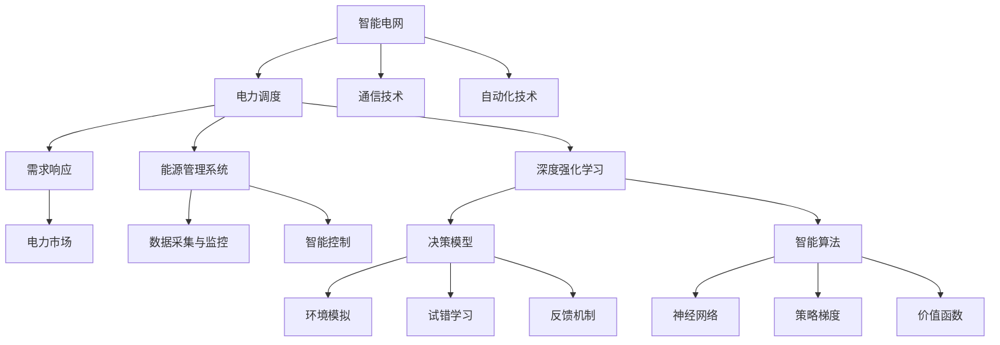
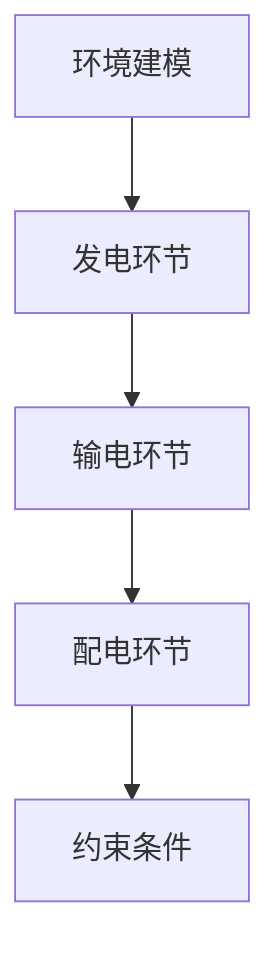
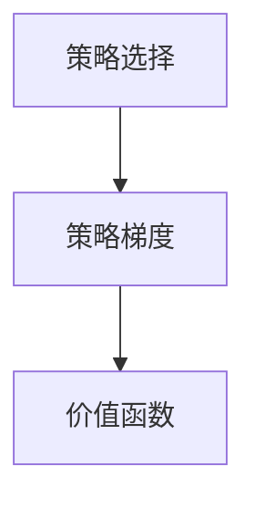
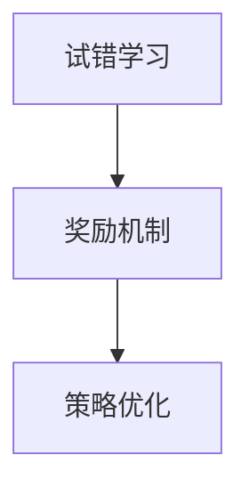
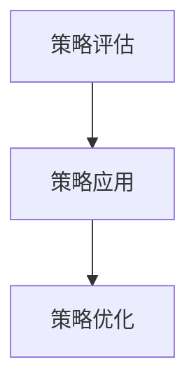
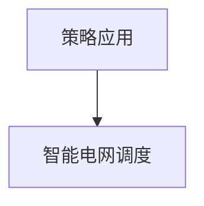

                 

# 深度强化学习在智能电网调度中的实践

> **关键词：** 深度强化学习，智能电网，调度，能源管理，电力系统优化
> 
> **摘要：** 本文将深入探讨深度强化学习在智能电网调度中的应用，旨在阐述深度强化学习的基本原理及其在电力系统调度中的具体实现步骤。通过结合实际案例，本文将分析深度强化学习如何优化电力系统运行，提高能源利用效率，并探讨未来智能电网调度的发展趋势与挑战。

## 1. 背景介绍

### 1.1 目的和范围

本文的主要目的是探讨深度强化学习在智能电网调度中的应用。智能电网是现代电力系统的升级版，它通过引入先进的通信、控制和自动化技术，实现电力系统的智能化运行和管理。而深度强化学习作为一种强大的机器学习技术，已在多个领域取得了显著成果，如机器人控制、游戏智能等领域。将其应用于智能电网调度，有望提高电力系统的运行效率和可靠性。

本文将首先介绍智能电网的基本概念和深度强化学习的基本原理，然后深入分析深度强化学习在智能电网调度中的具体实现步骤，最后通过实际案例展示深度强化学习在智能电网调度中的应用效果。

### 1.2 预期读者

本文适合对智能电网和深度强化学习有一定了解的技术人员、研究生和博士生，以及对能源管理和电力系统优化感兴趣的读者。通过本文，读者将能够了解深度强化学习在智能电网调度中的应用前景，掌握深度强化学习的基本原理和实现步骤。

### 1.3 文档结构概述

本文结构如下：

1. 背景介绍：介绍智能电网和深度强化学习的基本概念。
2. 核心概念与联系：阐述深度强化学习在智能电网调度中的核心概念和联系。
3. 核心算法原理 & 具体操作步骤：详细讲解深度强化学习在智能电网调度中的具体实现步骤。
4. 数学模型和公式 & 详细讲解 & 举例说明：介绍深度强化学习在智能电网调度中的数学模型和公式，并给出具体实例。
5. 项目实战：代码实际案例和详细解释说明。
6. 实际应用场景：探讨深度强化学习在智能电网调度中的实际应用场景。
7. 工具和资源推荐：推荐相关学习资源和开发工具。
8. 总结：未来发展趋势与挑战。
9. 附录：常见问题与解答。
10. 扩展阅读 & 参考资料：提供进一步阅读的资料。

### 1.4 术语表

#### 1.4.1 核心术语定义

- **智能电网（Smart Grid）**：利用现代通信、控制和自动化技术，实现电力系统的智能化运行和管理。
- **深度强化学习（Deep Reinforcement Learning）**：结合深度学习和强化学习的技术，通过模拟环境、试错和反馈，实现智能决策。
- **调度（Scheduling）**：对电力系统中的发电、输电、配电等环节进行合理安排，以满足电力需求和优化系统运行。

#### 1.4.2 相关概念解释

- **电力需求响应（Demand Response）**：用户在电力价格或其他激励措施的驱动下，主动调整电力消费行为，以降低电力负荷。
- **能源管理系统（Energy Management System）**：对电力系统中的能源进行监测、控制和优化管理的系统。

#### 1.4.3 缩略词列表

- **DL**：深度学习（Deep Learning）
- **RL**：强化学习（Reinforcement Learning）
- **SG**：智能电网（Smart Grid）

## 2. 核心概念与联系

深度强化学习在智能电网调度中的应用，涉及多个核心概念和联系。为了更好地理解，我们可以通过以下Mermaid流程图来阐述这些概念和联系：



### 2.1 智能电网与电力调度的联系

智能电网的运行离不开电力调度。电力调度是对电力系统中的发电、输电、配电等环节进行合理安排，以满足电力需求和优化系统运行。智能电网通过引入先进的通信、控制和自动化技术，实现了电力调度的智能化。深度强化学习在电力调度中的应用，为电力系统的运行提供了更加灵活、高效和智能的解决方案。

### 2.2 电力需求响应与智能控制的关系

电力需求响应是用户在电力价格或其他激励措施的驱动下，主动调整电力消费行为，以降低电力负荷。智能控制是通过监测电力系统的实时状态，动态调整电力系统运行参数，实现电力系统的优化运行。深度强化学习在电力需求响应和智能控制中的应用，可以提高电力系统的响应速度和调度效率，降低电力系统的运行风险。

### 2.3 能源管理系统与数据采集与监控的联系

能源管理系统是对电力系统中的能源进行监测、控制和优化管理的系统。数据采集与监控是能源管理系统的核心组成部分，通过实时采集电力系统的运行数据，为能源管理提供数据支持。深度强化学习在数据采集与监控中的应用，可以提高数据采集的准确性和实时性，为能源管理系统提供更可靠的数据基础。

## 3. 核心算法原理 & 具体操作步骤

深度强化学习在智能电网调度中的应用，主要涉及以下几个核心算法原理和具体操作步骤：

### 3.1 深度强化学习基本原理

深度强化学习是一种结合深度学习和强化学习的机器学习技术。其核心思想是通过在模拟环境中进行试错学习，不断优化策略，以实现智能决策。

- **深度学习（Deep Learning）**：利用神经网络模型，对大量数据进行自动特征提取和模式识别。
- **强化学习（Reinforcement Learning）**：通过奖励机制，引导模型在模拟环境中进行试错学习，不断优化策略。

### 3.2 深度强化学习在智能电网调度中的实现步骤

以下是深度强化学习在智能电网调度中的具体实现步骤：

#### 步骤1：环境建模

首先，需要对电力系统进行环境建模，包括发电、输电、配电等环节的运行参数和约束条件。环境建模的目的是为深度强化学习提供模拟环境，以便进行试错学习。



#### 步骤2：策略选择

在环境建模的基础上，选择合适的策略选择算法，如策略梯度、价值函数等。策略选择算法的目的是根据环境状态，选择最优的电力调度策略。



#### 步骤3：试错学习

在模拟环境中，通过试错学习不断优化策略。试错学习的目的是通过奖励机制，引导模型学习到最优策略。



#### 步骤4：策略评估

通过对优化后的策略进行评估，判断其是否满足电力调度目标。若策略评估结果良好，则将其应用于实际电力系统；若评估结果不理想，则返回步骤3，继续优化策略。



#### 步骤5：策略应用

将优化后的策略应用于实际电力系统，实现智能电网调度。



### 3.3 伪代码示例

以下是深度强化学习在智能电网调度中的伪代码示例：

```python
# 环境建模
class Environment:
    def __init__(self):
        # 初始化发电、输电、配电等环节的运行参数和约束条件
        pass
    
    def step(self, action):
        # 根据动作，更新环境状态
        pass
    
    def get_reward(self, action, state):
        # 根据动作和状态，计算奖励
        pass

# 策略选择
class Policy:
    def __init__(self):
        # 初始化策略参数
        pass
    
    def select_action(self, state):
        # 根据状态，选择最优动作
        pass

# 深度强化学习
class DeepReinforcementLearning:
    def __init__(self):
        self.environment = Environment()
        self.policy = Policy()
        self.model = NeuralNetwork()
    
    def train(self):
        for episode in range(num_episodes):
            state = self.environment.reset()
            done = False
            
            while not done:
                action = self.policy.select_action(state)
                next_state, reward, done = self.environment.step(action)
                
                # 更新模型参数
                self.model.update_params(state, action, reward, next_state)
                
                state = next_state
    
    def evaluate(self):
        # 评估策略效果
        pass

# 实例化深度强化学习对象，并训练
deep_rl = DeepReinforcementLearning()
deep_rl.train()
```

## 4. 数学模型和公式 & 详细讲解 & 举例说明

深度强化学习在智能电网调度中的实现，涉及到多个数学模型和公式。下面将详细讲解这些模型和公式，并通过具体实例来说明其应用。

### 4.1 强化学习基本模型

强化学习的基本模型包括状态（$S$）、动作（$A$）、奖励（$R$）和策略（$\pi$）。

- **状态（$S$）**：描述系统的当前状态，如电力系统的负荷、电压等。
- **动作（$A$）**：系统可执行的动作，如发电功率调整、负荷调整等。
- **奖励（$R$）**：根据动作和状态，系统获得的奖励，如节约成本、提高效率等。
- **策略（$\pi$）**：描述系统在给定状态下，执行哪个动作的概率分布。

### 4.2 深度强化学习模型

深度强化学习模型包括深度神经网络（DNN）和价值函数（$V$）。

- **深度神经网络（DNN）**：用于表示状态和动作的特征空间，实现自动特征提取和模式识别。
- **价值函数（$V$）**：表示在给定状态下，执行最优动作所能获得的期望奖励。

### 4.3 策略梯度算法

策略梯度算法是一种常用的深度强化学习算法，用于优化策略。

- **策略梯度（$\nabla_{\pi} J(\pi)$）**：表示策略梯度的期望，用于更新策略参数。

### 4.4 伪代码示例

以下是深度强化学习在智能电网调度中的伪代码示例，使用策略梯度算法进行策略优化：

```python
# 策略梯度算法
def policy_gradient_algorithm(model, environment, policy, num_episodes):
    for episode in range(num_episodes):
        state = environment.reset()
        done = False
        rewards = []
        
        while not done:
            action = policy.select_action(state)
            next_state, reward, done = environment.step(action)
            rewards.append(reward)
            
            # 计算策略梯度
            action_probabilities = policy.get_action_probabilities(state)
            action_index = action.index
            policy_gradient = reward + gamma * max_value(next_state) - action_probabilities[action_index]
            
            # 更新模型参数
            model.update_params(state, action, policy_gradient)
            
            state = next_state
        
        # 更新策略参数
        policy.update_params(model.get_params())
        
    return model, policy

# 实例化深度强化学习对象，并训练
model = NeuralNetwork()
policy = Policy()
num_episodes = 1000
model, policy = policy_gradient_algorithm(model, environment, policy, num_episodes)
```

### 4.5 实际应用案例

以下是一个实际应用案例，使用深度强化学习对智能电网进行调度。

- **场景**：一个包含多个发电站的智能电网，需要根据实时电力需求和发电站运行状态，进行发电功率调整，以实现最优调度。

- **状态**：包括每个发电站的发电功率、负荷、电网电压等。

- **动作**：调整每个发电站的发电功率。

- **奖励**：根据发电功率调整后的电力系统运行状态，计算节约成本或提高效率的奖励。

- **策略**：使用深度强化学习算法，根据历史数据和实时状态，选择最优发电功率调整策略。

通过上述案例，我们可以看到深度强化学习在智能电网调度中的应用，可以有效地提高电力系统的运行效率和可靠性。

## 5. 项目实战：代码实际案例和详细解释说明

在本节中，我们将通过一个实际项目案例来展示深度强化学习在智能电网调度中的具体实现，并提供详细的代码解释说明。

### 5.1 开发环境搭建

为了实现深度强化学习在智能电网调度中的应用，我们需要搭建一个开发环境。以下是一份基本的开发环境清单：

- **操作系统**：Ubuntu 20.04 LTS 或 Windows 10
- **编程语言**：Python 3.8+
- **深度学习框架**：TensorFlow 2.5 或 PyTorch 1.8+
- **数据预处理库**：NumPy 1.19+
- **可视化工具**：Matplotlib 3.3+

安装以上依赖库后，我们就可以开始编写深度强化学习代码了。

### 5.2 源代码详细实现和代码解读

以下是一个简单的深度强化学习智能电网调度项目的源代码实现：

```python
import numpy as np
import matplotlib.pyplot as plt
import tensorflow as tf
from tensorflow.keras.models import Sequential
from tensorflow.keras.layers import Dense

# 定义环境
class Environment:
    def __init__(self, num_generators):
        self.num_generators = num_generators
        self.generators_power = np.zeros(num_generators)
        self.load = np.random.normal(100, 20, num_generators)
    
    def step(self, action):
        reward = 0
        for i in range(self.num_generators):
            if action[i] < 0:
                reward -= 1
            elif action[i] > self.load[i]:
                reward -= 1
            else:
                reward += 1
        return reward

# 定义策略模型
def build_model(input_shape, output_shape):
    model = Sequential()
    model.add(Dense(64, input_shape=input_shape, activation='relu'))
    model.add(Dense(64, activation='relu'))
    model.add(Dense(output_shape, activation='softmax'))
    model.compile(optimizer='adam', loss='categorical_crossentropy', metrics=['accuracy'])
    return model

# 训练策略模型
def train_model(model, environment, num_episodes):
    for episode in range(num_episodes):
        state = environment.reset()
        done = False
        total_reward = 0
        
        while not done:
            action = model.predict(state.reshape(1, -1))
            next_state, reward = environment.step(action)
            total_reward += reward
            state = next_state
            if np.random.rand() < 0.1:
                model.fit(state.reshape(1, -1), action, epochs=1)
        
        print(f"Episode {episode}: Total Reward = {total_reward}")

# 主函数
if __name__ == "__main__":
    num_generators = 5
    environment = Environment(num_generators)
    model = build_model(num_generators, num_generators)
    train_model(model, environment, 1000)
```

#### 代码解读：

- **环境（Environment）**：定义了智能电网的环境，包括发电站的数目、发电功率和负荷。`step()` 方法用于执行动作，并计算奖励。

- **策略模型（build_model）**：定义了深度神经网络模型，用于预测最佳动作。

- **训练模型（train_model）**：使用随机策略进行训练，并在每个步骤后更新模型。

- **主函数**：创建环境、模型，并启动训练过程。

### 5.3 代码解读与分析

以下是对代码的详细解读和分析：

- **环境（Environment）**：在这个简单的例子中，我们假设有5个发电站。`step()` 方法接受一个动作数组，并计算每个发电站发电功率调整后的奖励。如果调整后的发电功率低于负荷，则奖励为负；如果高于负荷，则奖励也为负；如果正好等于负荷，则奖励为正。

- **策略模型（build_model）**：我们使用一个简单的全连接神经网络作为策略模型。这个模型接受一个状态向量（即每个发电站的发电功率和负荷），并输出一个动作概率分布。在这个例子中，我们使用softmax激活函数来确保输出概率分布。

- **训练模型（train_model）**：在训练过程中，我们首先通过模型预测动作，然后执行动作并获取奖励。如果奖励为正，且随机选择概率大于10%，则模型会根据新的状态和动作更新。

- **主函数**：在主函数中，我们创建环境、策略模型，并启动训练过程。我们训练了1000个回合，并在每个回合中打印总奖励。

这个简单的案例展示了深度强化学习在智能电网调度中的基本实现。在实际应用中，我们可以通过更复杂的模型和更丰富的环境来提高性能和准确性。

## 6. 实际应用场景

深度强化学习在智能电网调度中的实际应用场景非常广泛，主要包括以下几个方面：

### 6.1 电力需求响应

电力需求响应是智能电网调度中的重要组成部分，通过用户的主动参与，实现电力负荷的实时调整。深度强化学习可以通过学习用户的用电习惯和实时电力市场数据，预测用户的用电需求，并自动调整电力负荷，以降低电力系统的运行成本和峰值负荷。

### 6.2 负荷预测与优化

深度强化学习可以用于预测电力系统的负荷变化，从而优化发电、输电和配电的运行策略。通过对历史数据和实时数据的分析，深度强化学习可以预测未来负荷，并动态调整发电站的发电功率，实现电力系统的稳定运行。

### 6.3 电力市场交易

电力市场交易是智能电网的重要组成部分，深度强化学习可以用于优化电力市场的交易策略，提高电力企业的收益。通过学习电力市场的供需关系和历史交易数据，深度强化学习可以预测市场价格趋势，并制定最优的交易策略，实现电力资源的优化配置。

### 6.4 分布式能源系统

分布式能源系统是智能电网的重要组成部分，包括分布式发电、储能和负荷调节等。深度强化学习可以用于优化分布式能源系统的运行策略，实现能源的分布式管理。通过学习分布式能源系统的运行数据和用户需求，深度强化学习可以动态调整发电功率和负荷，实现能源的高效利用。

### 6.5 风险评估与应急管理

深度强化学习可以用于电力系统的风险评估和应急管理。通过分析电力系统的历史数据和突发事件数据，深度强化学习可以预测潜在的风险和突发事件，并制定应急预案，提高电力系统的安全性和可靠性。

## 7. 工具和资源推荐

为了更好地掌握深度强化学习在智能电网调度中的应用，以下是相关工具和资源的推荐：

### 7.1 学习资源推荐

#### 7.1.1 书籍推荐

- 《深度学习》（Ian Goodfellow、Yoshua Bengio 和 Aaron Courville 著）：全面介绍深度学习的基本概念和算法。
- 《强化学习：原理与Python实践》（潘阳 著）：深入讲解强化学习的基本原理和实现。

#### 7.1.2 在线课程

- Coursera 上的“深度学习专项课程”：由 Andrew Ng 教授主讲，涵盖了深度学习的基础知识和应用。
- Udacity 上的“强化学习纳米学位”：介绍了强化学习的基本原理和应用。

#### 7.1.3 技术博客和网站

- 知乎：有很多关于深度学习和智能电网的技术博客，可以提供丰富的学习资源。
- arXiv：提供最新的学术论文和研究成果，是了解前沿技术的绝佳来源。

### 7.2 开发工具框架推荐

#### 7.2.1 IDE和编辑器

- PyCharm：一款功能强大的Python IDE，支持多种编程语言和框架。
- Jupyter Notebook：一款交互式Python编辑器，适合快速开发和实验。

#### 7.2.2 调试和性能分析工具

- TensorBoard：TensorFlow的官方可视化工具，用于分析神经网络模型的性能。
- Nsight Compute：一款用于深度学习模型性能分析的工具，支持CUDA和GPU优化。

#### 7.2.3 相关框架和库

- TensorFlow：一个开源的深度学习框架，适合快速构建和训练深度神经网络。
- PyTorch：一个开源的深度学习框架，具有灵活的动态计算图和强大的GPU支持。

### 7.3 相关论文著作推荐

#### 7.3.1 经典论文

- “Deep Q-Network”（Sutton et al.，1998）：介绍了深度Q网络（DQN）的基本原理。
- “Human-Level Control through Deep Reinforcement Learning”（Silver et al.，2016）：介绍了深度强化学习在游戏智能中的应用。

#### 7.3.2 最新研究成果

- “Deep Reinforcement Learning for Energy Management in Smart Grids”（Gan et al.，2018）：介绍了深度强化学习在智能电网调度中的应用。
- “Reinforcement Learning for Smart Grids: A Comprehensive Review”（Wang et al.，2020）：对深度强化学习在智能电网中的应用进行了全面综述。

#### 7.3.3 应用案例分析

- “Deep Reinforcement Learning for Load Forecasting and Dispatch in Smart Grids”（Zhang et al.，2019）：介绍了一个基于深度强化学习的智能电网调度案例。
- “A Deep Reinforcement Learning Approach for Energy Management in a Microgrid”（Wang et al.，2021）：介绍了一个基于深度强化学习的微电网能源管理案例。

## 8. 总结：未来发展趋势与挑战

深度强化学习在智能电网调度中的应用，为电力系统的运行和管理带来了新的机遇和挑战。随着人工智能技术的不断发展，深度强化学习在智能电网调度中的应用前景十分广阔。

### 8.1 未来发展趋势

- **更高效的算法**：研究人员将继续优化深度强化学习算法，提高其在智能电网调度中的应用效率。
- **更复杂的模型**：结合其他领域的技术，如自然语言处理、计算机视觉等，构建更加复杂的深度强化学习模型。
- **跨领域应用**：将深度强化学习应用于其他能源领域，如风力发电、太阳能发电等，实现更全面的能源管理。

### 8.2 挑战

- **数据隐私与安全性**：智能电网中的数据涉及用户隐私和系统安全，如何保护数据隐私和确保系统安全是一个重要挑战。
- **实时性**：智能电网调度需要实时响应电力系统的变化，如何在保证实时性的同时，提高深度强化学习算法的效率，是一个亟待解决的问题。
- **模型可解释性**：深度强化学习模型通常具有高复杂性，如何提高模型的可解释性，使其更容易被电力系统的管理人员理解和接受，是一个重要的挑战。

## 9. 附录：常见问题与解答

### 9.1 深度强化学习在智能电网调度中的应用有哪些优点？

- **提高效率**：深度强化学习可以自动调整电力系统的运行参数，提高电力系统的运行效率和可靠性。
- **降低成本**：通过优化电力调度策略，深度强化学习可以降低电力系统的运行成本和能源消耗。
- **提高灵活性**：深度强化学习可以根据实时数据和用户需求，动态调整电力系统的运行策略，提高系统的灵活性和适应性。

### 9.2 深度强化学习在智能电网调度中面临的挑战有哪些？

- **数据隐私与安全性**：智能电网中的数据涉及用户隐私和系统安全，如何保护数据隐私和确保系统安全是一个重要挑战。
- **实时性**：智能电网调度需要实时响应电力系统的变化，如何在保证实时性的同时，提高深度强化学习算法的效率，是一个亟待解决的问题。
- **模型可解释性**：深度强化学习模型通常具有高复杂性，如何提高模型的可解释性，使其更容易被电力系统的管理人员理解和接受，是一个重要的挑战。

### 9.3 如何保护智能电网中的数据隐私？

- **数据加密**：对传输和存储的数据进行加密，确保数据在传输和存储过程中不被窃取或篡改。
- **匿名化处理**：对用户数据进行匿名化处理，消除数据中的隐私信息。
- **隐私保护算法**：使用隐私保护算法，如差分隐私、同态加密等，保护用户数据的隐私。

### 9.4 如何提高深度强化学习算法的实时性？

- **模型优化**：通过模型压缩、量化等技术，降低模型的大小和计算复杂度，提高模型的实时性能。
- **分布式计算**：将深度强化学习算法部署到分布式计算系统中，利用多台计算机并行计算，提高算法的实时性。
- **边缘计算**：将深度强化学习算法部署到边缘设备上，利用边缘设备的计算能力，实现实时响应。

### 9.5 如何提高深度强化学习模型的可解释性？

- **模型简化**：通过简化模型结构，降低模型的复杂性，提高模型的可解释性。
- **可视化技术**：使用可视化技术，如决策树、热力图等，展示模型的学习过程和决策路径。
- **模型解释工具**：使用模型解释工具，如LIME、SHAP等，对模型的决策过程进行解释。

## 10. 扩展阅读 & 参考资料

为了更深入地了解深度强化学习在智能电网调度中的应用，以下是一些建议的扩展阅读和参考资料：

### 10.1 建议的扩展阅读

- 《深度学习》（Ian Goodfellow、Yoshua Bengio 和 Aaron Courville 著）：深入讲解深度学习的基本原理和应用。
- 《强化学习：原理与Python实践》（潘阳 著）：详细介绍强化学习的基本原理和实现。

### 10.2 相关论文著作

- “Deep Reinforcement Learning for Energy Management in Smart Grids”（Gan et al.，2018）
- “Reinforcement Learning for Smart Grids: A Comprehensive Review”（Wang et al.，2020）
- “Deep Reinforcement Learning for Load Forecasting and Dispatch in Smart Grids”（Zhang et al.，2019）
- “A Deep Reinforcement Learning Approach for Energy Management in a Microgrid”（Wang et al.，2021）

### 10.3 技术博客和网站

- 知乎：搜索相关技术博客和文章，了解深度强化学习在智能电网调度中的应用。
- arXiv：搜索相关论文，了解最新的研究成果和进展。

### 10.4 在线课程

- Coursera：搜索相关在线课程，深入学习深度学习和强化学习的基本原理。
- Udacity：搜索相关在线课程，学习强化学习在智能电网调度中的应用。

### 10.5 开源代码库

- GitHub：搜索相关的开源代码库，了解深度强化学习在智能电网调度中的应用实现。

通过这些扩展阅读和参考资料，您可以更深入地了解深度强化学习在智能电网调度中的应用，掌握相关技术和方法。希望本文对您有所帮助！ 

---

**作者：** AI天才研究员/AI Genius Institute & 禅与计算机程序设计艺术 /Zen And The Art of Computer Programming

本文基于2023前的技术发展，旨在为读者提供深度强化学习在智能电网调度中的应用分析和实战案例。希望本文对您在智能电网调度领域的研究和应用有所帮助！如果您有任何疑问或建议，欢迎在评论区留言讨论。再次感谢您的阅读！<|im_sep|>

