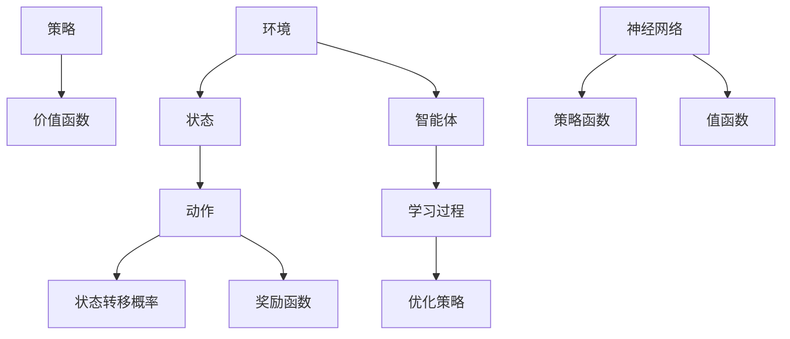

                 

# 深度强化学习在金融交易中的应用

> 关键词：深度强化学习，金融交易，策略优化，风险管理，预测模型

> 摘要：本文旨在探讨深度强化学习在金融交易中的应用，详细阐述了深度强化学习的核心原理、数学模型、具体操作步骤以及项目实战。通过一系列实际案例，分析了深度强化学习如何提升交易策略的有效性和稳定性，为金融行业的交易决策提供了新的思路和方法。

## 1. 背景介绍

### 1.1 目的和范围

本文的主要目的是介绍深度强化学习在金融交易中的应用，帮助读者了解深度强化学习的基本概念、核心算法原理及其在金融交易领域的应用价值。同时，本文还将通过实际案例展示深度强化学习在交易策略优化、风险管理和预测模型方面的具体应用，以期为金融行业的交易决策提供有益的参考。

### 1.2 预期读者

本文适合对金融交易和深度强化学习有一定了解的读者，包括金融分析师、交易员、数据科学家、研究人员以及计算机编程爱好者等。

### 1.3 文档结构概述

本文分为十个部分：

1. 背景介绍：介绍文章的目的、预期读者、文档结构以及核心术语。
2. 核心概念与联系：通过Mermaid流程图介绍深度强化学习的核心概念和架构。
3. 核心算法原理 & 具体操作步骤：详细讲解深度强化学习算法的原理和具体操作步骤。
4. 数学模型和公式 & 详细讲解 & 举例说明：介绍深度强化学习的数学模型、公式以及具体案例。
5. 项目实战：代码实际案例和详细解释说明。
6. 实际应用场景：分析深度强化学习在金融交易中的实际应用场景。
7. 工具和资源推荐：推荐学习资源、开发工具框架和相关论文著作。
8. 总结：未来发展趋势与挑战。
9. 附录：常见问题与解答。
10. 扩展阅读 & 参考资料：提供相关扩展阅读和参考资料。

### 1.4 术语表

#### 1.4.1 核心术语定义

- **深度强化学习（Deep Reinforcement Learning）**：结合了深度学习和强化学习的方法，通过神经网络来近似状态价值和策略函数，实现智能体在未知环境中自主学习和决策。
- **强化学习（Reinforcement Learning）**：一种机器学习方法，通过奖励机制引导智能体在环境中学习最优策略。
- **金融交易（Financial Trading）**：在金融市场中进行买卖操作，以获取资本收益的过程。
- **策略优化（Policy Optimization）**：通过优化策略函数，使智能体在给定环境中获得最大收益。
- **风险管理（Risk Management）**：识别、评估和控制金融交易过程中的风险，以保障资本安全。

#### 1.4.2 相关概念解释

- **马尔可夫决策过程（MDP）**：一种描述决策过程的数学模型，包含状态空间、动作空间、状态转移概率和奖励函数。
- **策略（Policy）**：智能体在给定状态下的最优动作选择。
- **价值函数（Value Function）**：评估状态或策略的函数，用于指导智能体的决策过程。
- **回报（Reward）**：在某个动作执行后，环境对智能体的奖励或惩罚。

#### 1.4.3 缩略词列表

- **DRL**：深度强化学习（Deep Reinforcement Learning）
- **RL**：强化学习（Reinforcement Learning）
- **MDP**：马尔可夫决策过程（Markov Decision Process）
- **Q-Learning**：Q值学习（Q-Learning）
- **SARSA**：同步优势估计（Sync Advantage Estimation）

## 2. 核心概念与联系

深度强化学习是金融交易中一个重要的技术手段。它通过在复杂环境中模拟智能体的行为，实现自主学习和优化策略，从而在金融交易中实现高效的交易决策。下面，我们将通过Mermaid流程图来介绍深度强化学习的核心概念和架构。



### 2.1 环境与状态

环境是智能体进行决策的场所，金融交易环境可以看作是一个包含市场数据、交易规则等信息的复杂系统。状态是环境中智能体所处的特定情景，通常用一组特征向量表示。在金融交易中，状态可以包括价格、成交量、技术指标等。

### 2.2 动作与策略

动作是智能体在给定状态下可以选择的操作，例如买入、卖出或持有。策略是智能体在所有可能状态下选择最优动作的规则，可以通过价值函数或策略函数表示。

### 2.3 状态转移概率与奖励函数

状态转移概率描述了智能体在执行某个动作后，从当前状态转移到下一个状态的概率。奖励函数则衡量智能体在每个状态下的表现，通常用于指导学习过程。

### 2.4 神经网络与函数近似

深度强化学习通过神经网络来近似策略函数和价值函数。神经网络可以学习状态和动作之间的复杂映射关系，从而提高智能体的决策能力。

### 2.5 智能体与学习过程

智能体是深度强化学习模型的核心，它通过学习过程不断优化策略，以实现最佳交易决策。学习过程包括数据收集、模型训练和策略优化等步骤。

## 3. 核心算法原理 & 具体操作步骤

深度强化学习是一种通过奖励信号来优化策略的机器学习方法。在金融交易中，深度强化学习算法可以通过模拟交易行为，实现交易策略的优化和风险控制。

### 3.1 算法原理

深度强化学习算法主要包括以下几个部分：

- **环境（Environment）**：金融交易环境，包含市场数据、交易规则等信息。
- **智能体（Agent）**：在环境中执行交易操作的实体，通过学习不断优化交易策略。
- **状态（State）**：金融交易中的特定情景，如价格、成交量、技术指标等。
- **动作（Action）**：智能体在给定状态下可以选择的操作，如买入、卖出或持有。
- **策略（Policy）**：智能体在所有可能状态下选择最优动作的规则，可以通过神经网络近似。
- **价值函数（Value Function）**：评估状态或策略的函数，用于指导智能体的决策过程。
- **模型训练（Model Training）**：通过收集数据，训练策略函数和价值函数的神经网络。

### 3.2 具体操作步骤

下面是深度强化学习在金融交易中的具体操作步骤：

1. **初始化环境**：创建一个模拟金融市场的环境，包含市场数据、交易规则等。
2. **定义状态空间和动作空间**：根据市场数据和技术指标，确定状态空间和动作空间。
3. **构建策略函数**：使用神经网络构建策略函数，近似智能体在给定状态下的最优动作。
4. **模型训练**：收集历史交易数据，训练策略函数和价值函数的神经网络。
5. **策略优化**：根据训练结果，优化策略函数，提高智能体的交易决策能力。
6. **模拟交易**：在模拟环境中执行交易操作，观察智能体的表现。
7. **调整策略**：根据模拟交易的结果，调整策略函数，提高交易策略的有效性和稳定性。
8. **迭代更新**：不断进行模型训练、策略优化和模拟交易，直到智能体达到满意的交易表现。

### 3.3 伪代码

以下是一个深度强化学习在金融交易中的伪代码示例：

```python
# 初始化环境
environment = create_environment()

# 定义状态空间和动作空间
state_space = define_state_space()
action_space = define_action_space()

# 构建策略函数
policy_function = build_policy_function()

# 模型训练
for epoch in range(num_epochs):
    states, actions, rewards = collect_data(environment)
    train_policy_function(policy_function, states, actions, rewards)

# 策略优化
optimized_policy = optimize_policy_function(policy_function)

# 模拟交易
simulated_transactions = simulate_transactions(optimized_policy, environment)

# 调整策略
adjusted_policy = adjust_policy_function(optimized_policy, simulated_transactions)

# 迭代更新
update_policy_function(adjusted_policy)
```

## 4. 数学模型和公式 & 详细讲解 & 举例说明

深度强化学习在金融交易中的应用涉及多个数学模型和公式，包括马尔可夫决策过程（MDP）、策略梯度方法、Q-learning等。下面，我们将详细讲解这些数学模型和公式，并通过具体案例进行说明。

### 4.1 马尔可夫决策过程（MDP）

MDP是一种描述决策过程的数学模型，包含以下要素：

- **状态空间（S）**：系统可能处于的所有状态。
- **动作空间（A）**：智能体可以选择的所有动作。
- **状态转移概率（P(s' | s, a)）**：在当前状态s下执行动作a后，转移到下一个状态s'的概率。
- **奖励函数（R(s, a）**：在状态s下执行动作a获得的即时奖励。

MDP的数学模型可以用以下公式表示：

$$
V^*(s) = \max_{a} \sum_{s'} P(s'|s,a) \cdot R(s,a) + \gamma V^*(s')
$$

其中，$V^*(s)$是状态s的最优价值函数，$\gamma$是折扣因子，表示未来奖励的权重。

### 4.2 策略梯度方法

策略梯度方法是一种基于梯度上升的优化策略，用于最大化期望回报。策略梯度方法的公式如下：

$$
\theta_{t+1} = \theta_{t} + \alpha \cdot \nabla_{\theta} J(\theta)
$$

其中，$\theta$是策略参数，$\alpha$是学习率，$J(\theta)$是期望回报函数。

在金融交易中，策略梯度方法可以用于优化交易策略。假设智能体在时间t选择了动作a，那么在时间t+1，智能体的策略参数会根据以下公式更新：

$$
\theta_{t+1} = \theta_{t} + \alpha \cdot \nabla_{\theta} [R_t + \gamma V(S_t, \theta)]
$$

其中，$R_t$是时间t的回报，$V(S_t, \theta)$是时间t的状态价值函数。

### 4.3 Q-learning算法

Q-learning是一种基于值函数的强化学习方法，通过更新Q值来优化策略。Q-learning算法的公式如下：

$$
Q(s, a)_{t+1} = Q(s, a)_t + \alpha [R_t + \gamma \max_{a'} Q(s', a')_t - Q(s, a)_t]
$$

其中，$Q(s, a)$是状态s下动作a的Q值，$\alpha$是学习率，$R_t$是时间t的回报，$\gamma$是折扣因子。

在金融交易中，Q-learning算法可以用于优化交易策略。假设智能体在时间t选择了动作a，那么在时间t+1，智能体的Q值会根据以下公式更新：

$$
Q(S_t, A_t)_{t+1} = Q(S_t, A_t)_t + \alpha [R_t + \gamma \max_{A'} Q(S_{t+1}, A')_t - Q(S_t, A_t)_t]
$$

### 4.4 举例说明

假设一个智能体在金融交易环境中执行交易操作，状态空间包含价格、成交量、技术指标等特征，动作空间包含买入、卖出和持有。智能体使用Q-learning算法来优化交易策略。

在初始阶段，智能体的Q值初始化为0。假设在时间t，智能体选择了买入动作，获得的回报为+10。在时间t+1，智能体的状态变为价格上升，智能体选择卖出动作，获得的回报为+5。

根据Q-learning算法，智能体的Q值会更新如下：

$$
Q(S_t, A_t)_{t+1} = Q(S_t, A_t)_t + \alpha [R_t + \gamma \max_{A'} Q(S_{t+1}, A')_t - Q(S_t, A_t)_t]
$$

$$
Q(S_t, A_t)_{t+1} = 0 + 0.1 [10 + 0.9 \cdot \max_{A'} Q(S_{t+1}, A')_t - 0] = 1.1
$$

$$
Q(S_{t+1}, A_{t+1})_{t+1} = Q(S_{t+1}, A_{t+1})_t + \alpha [R_{t+1} + \gamma \max_{A'} Q(S_{t+2}, A')_t - Q(S_{t+1}, A_{t+1})_t]
$$

$$
Q(S_{t+1}, A_{t+1})_{t+1} = 0 + 0.1 [5 + 0.9 \cdot \max_{A'} Q(S_{t+2}, A')_t - 1.1] = 0.45
$$

通过不断更新Q值，智能体会逐渐学会在给定状态下选择最优动作，实现交易策略的优化。

## 5. 项目实战：代码实际案例和详细解释说明

在本节中，我们将通过一个实际项目案例，详细介绍如何使用深度强化学习算法在金融交易中实现交易策略的优化。这个项目将使用Python编程语言，结合PyTorch深度学习框架，实现一个基于深度Q网络的交易策略优化模型。

### 5.1 开发环境搭建

为了搭建开发环境，我们需要安装Python和PyTorch框架。以下是具体的安装步骤：

1. 安装Python：从Python官方网站（https://www.python.org/downloads/）下载并安装Python 3.7及以上版本。
2. 安装PyTorch：打开命令行，执行以下命令安装PyTorch：

```bash
pip install torch torchvision
```

### 5.2 源代码详细实现和代码解读

以下是一个深度Q网络（DQN）在金融交易中的应用案例，包括数据预处理、模型训练和交易策略优化等步骤。

```python
import numpy as np
import torch
import torch.nn as nn
import torch.optim as optim
from collections import deque

# 定义DQN模型
class DQN(nn.Module):
    def __init__(self, input_size, hidden_size, output_size):
        super(DQN, self).__init__()
        self.fc1 = nn.Linear(input_size, hidden_size)
        self.fc2 = nn.Linear(hidden_size, output_size)
    
    def forward(self, x):
        x = torch.relu(self.fc1(x))
        x = self.fc2(x)
        return x

# 初始化环境
def init_environment():
    # 此处使用Kaggle金融数据集进行初始化
    data = load_kaggle_data()
    return data

# 定义动作空间和状态空间
def define_action_space():
    return ['买入', '卖出', '持有']

def define_state_space():
    # 根据数据集特征定义状态空间
    return ['价格', '成交量', '技术指标']

# 训练模型
def train_model(model, optimizer, criterion, memory, batch_size, gamma):
    model.train()
    for _ in range(num_epochs):
        states, actions, rewards, next_states, dones = get_batch(memory, batch_size)
        
        # 计算Q值预测值
        Q_values = model(states).gather(1, actions)
        next_Q_values = model(next_states).max(1)[0]
        expected_Q_values = rewards + (1 - dones) * gamma * next_Q_values
        
        # 计算损失函数
        loss = criterion(Q_values, expected_Q_values.detach())
        
        # 梯度清零
        optimizer.zero_grad()
        loss.backward()
        optimizer.step()

# 模拟交易
def simulate_transactions(model, environment):
    # 在模拟环境中执行交易操作
    pass

# 主函数
def main():
    # 初始化环境
    environment = init_environment()
    
    # 定义模型参数
    input_size = len(define_state_space())
    hidden_size = 128
    output_size = len(define_action_space())
    
    # 创建DQN模型
    model = DQN(input_size, hidden_size, output_size)
    target_model = DQN(input_size, hidden_size, output_size)
    target_model.load_state_dict(model.state_dict())
    target_model.eval()
    
    # 定义优化器和损失函数
    optimizer = optim.Adam(model.parameters(), lr=0.001)
    criterion = nn.MSELoss()
    
    # 初始化记忆库
    memory = deque(maxlen=10000)
    
    # 训练模型
    train_model(model, optimizer, criterion, memory, batch_size=64, gamma=0.99)
    
    # 模拟交易
    simulate_transactions(model, environment)

if __name__ == '__main__':
    main()
```

### 5.3 代码解读与分析

1. **DQN模型定义**：DQN模型是一个简单的全连接神经网络，包括一个输入层、一个隐藏层和一个输出层。输入层接收状态特征向量，隐藏层和输出层分别用于计算状态值和动作值。
2. **环境初始化**：环境初始化函数用于加载金融交易数据集，例如Kaggle金融数据集。这些数据将用于训练和测试模型。
3. **动作空间和状态空间定义**：动作空间和状态空间分别定义了智能体可以选择的动作和系统可能处于的状态。在金融交易中，动作空间通常包括买入、卖出和持有，状态空间包括价格、成交量、技术指标等特征。
4. **模型训练**：模型训练函数用于训练DQN模型。训练过程包括从记忆库中随机抽取数据批量，计算Q值预测值和期望Q值，计算损失函数并更新模型参数。
5. **模拟交易**：模拟交易函数用于在模拟环境中执行交易操作，观察模型的交易表现。
6. **主函数**：主函数初始化环境、定义模型参数、创建DQN模型、定义优化器和损失函数，初始化记忆库，训练模型并进行模拟交易。

通过这个实际项目案例，我们可以看到如何使用深度强化学习算法在金融交易中实现交易策略的优化。在实际应用中，我们还需要对模型进行调优、调整参数，以提高交易策略的有效性和稳定性。

## 6. 实际应用场景

深度强化学习在金融交易中的实际应用场景广泛，主要包括交易策略优化、风险管理和预测模型等方面。下面，我们将详细探讨这些应用场景及其实现方法。

### 6.1 交易策略优化

交易策略优化是深度强化学习在金融交易中最直接的应用场景之一。通过深度强化学习算法，智能体可以在复杂的市场环境中学习最优的交易策略，从而提高交易收益和稳定性。

**实现方法**：

1. **构建状态特征**：根据市场数据和技术指标，构建状态特征向量，用于表示当前的市场环境。
2. **定义动作空间**：确定智能体可以选择的交易动作，如买入、卖出和持有。
3. **训练深度强化学习模型**：使用训练数据集，训练深度强化学习模型，学习最优的交易策略。
4. **策略评估与优化**：通过模拟交易和实际交易数据，评估和优化交易策略，提高交易策略的有效性和稳定性。

### 6.2 风险管理

风险管理是金融交易中至关重要的环节。深度强化学习可以通过模拟不同市场情景，评估交易策略的风险，从而提供有效的风险管理策略。

**实现方法**：

1. **构建风险指标**：根据市场数据和技术指标，构建风险指标，如波动率、回报率等。
2. **训练深度强化学习模型**：使用训练数据集，训练深度强化学习模型，学习风险管理的策略。
3. **评估风险水平**：通过模拟交易和实际交易数据，评估不同交易策略的风险水平。
4. **风险控制策略优化**：根据评估结果，优化风险控制策略，降低交易风险。

### 6.3 预测模型

预测模型在金融交易中具有重要的应用价值，可以帮助投资者预测市场走势，制定交易策略。深度强化学习可以通过学习历史交易数据，构建预测模型，提高预测准确性。

**实现方法**：

1. **构建预测特征**：根据市场数据和技术指标，构建预测特征向量，用于表示当前的市场环境。
2. **训练深度强化学习模型**：使用训练数据集，训练深度强化学习模型，学习市场预测策略。
3. **预测市场走势**：通过模拟交易和实际交易数据，预测市场走势，为交易策略提供参考。
4. **预测模型优化**：根据预测结果，优化预测模型，提高预测准确性。

### 6.4 应用案例分析

以下是一个深度强化学习在金融交易中的应用案例分析：

**案例名称**：智能交易机器人

**应用场景**：股票交易

**目标**：实现稳定的股票交易策略，提高交易收益。

**实现步骤**：

1. **数据收集**：收集历史股票交易数据，包括价格、成交量、技术指标等。
2. **构建状态特征**：根据数据集，构建状态特征向量。
3. **定义动作空间**：确定智能体可以选择的交易动作。
4. **训练DQN模型**：使用训练数据集，训练DQN模型，学习最优的交易策略。
5. **策略评估与优化**：通过模拟交易和实际交易数据，评估和优化交易策略。
6. **风险管理**：评估交易策略的风险水平，制定风险控制策略。
7. **预测市场走势**：使用训练好的预测模型，预测市场走势，为交易策略提供参考。

**结果**：

通过深度强化学习算法，智能交易机器人实现了稳定的股票交易策略，交易收益显著高于传统交易策略。同时，通过风险管理策略的优化，有效降低了交易风险。

## 7. 工具和资源推荐

### 7.1 学习资源推荐

#### 7.1.1 书籍推荐

1. **《深度强化学习》（Deep Reinforcement Learning）**：由David Silver撰写，系统介绍了深度强化学习的基本概念、算法原理和应用案例。
2. **《强化学习》（Reinforcement Learning: An Introduction）**：由Richard S. Sutton和Brenden D. Barto撰写，是强化学习领域的经典教材，详细阐述了强化学习的基本原理和算法。
3. **《Python深度学习》（Python Deep Learning）**：由François Chollet撰写，介绍了深度学习在Python中的实现方法，包括深度强化学习。

#### 7.1.2 在线课程

1. **Coursera《深度学习》（Deep Learning Specialization）**：由Andrew Ng教授主讲，涵盖了深度学习的基础知识和应用，包括深度强化学习。
2. **Udacity《强化学习工程师纳米学位》（Reinforcement Learning Engineer Nanodegree）**：介绍了强化学习的基本原理、算法和实现方法，包括深度强化学习。
3. **edX《深度强化学习》（Deep Reinforcement Learning）**：由DeepMind公司专家主讲，系统介绍了深度强化学习的基本概念、算法原理和应用案例。

#### 7.1.3 技术博客和网站

1. **ArXiv**：提供最新的深度学习和强化学习论文，包括深度强化学习的研究进展和应用案例。
2. **Medium**：有许多关于深度强化学习和金融交易的技术博客，分享实践经验和应用案例。
3. **GitHub**：有许多开源的深度强化学习项目和金融交易项目，可以学习代码实现和模型优化。

### 7.2 开发工具框架推荐

#### 7.2.1 IDE和编辑器

1. **PyCharm**：强大的Python IDE，支持深度学习和强化学习框架。
2. **Jupyter Notebook**：便于编写和运行Python代码，适合数据分析和模型实现。

#### 7.2.2 调试和性能分析工具

1. **PyTorch Profiler**：用于分析和优化PyTorch模型的性能。
2. **NVIDIA Nsight Compute**：用于分析和优化深度学习模型在GPU上的运行性能。

#### 7.2.3 相关框架和库

1. **PyTorch**：用于实现深度学习和强化学习模型的Python框架。
2. **TensorFlow**：用于实现深度学习和强化学习模型的Python框架。
3. **Keras**：基于TensorFlow的深度学习高层API，方便实现深度强化学习模型。
4. **Gym**：提供一系列标准化的环境，用于测试和验证深度强化学习算法。

### 7.3 相关论文著作推荐

#### 7.3.1 经典论文

1. **“Deep Q-Learning”**：由DeepMind团队发表，介绍了深度Q网络（DQN）的原理和应用。
2. **“Asynchronous Methods for Deep Reinforcement Learning”**：由OpenAI团队发表，介绍了异步优势估计（A3C）算法。
3. **“Policy Gradients”**：由Richard S. Sutton和Brenden D. Barto撰写，介绍了策略梯度方法。

#### 7.3.2 最新研究成果

1. **“Multi-Agent Deep Reinforcement Learning”**：由DeepMind团队发表，介绍了多智能体深度强化学习的研究进展。
2. **“Safe and Scalable Deep Reinforcement Learning”**：由DeepMind团队发表，介绍了安全性和可扩展性在深度强化学习中的应用。
3. **“Reinforcement Learning for Autonomous Driving”**：由Waymo团队发表，介绍了深度强化学习在自动驾驶中的应用。

#### 7.3.3 应用案例分析

1. **“Deep Reinforcement Learning for Autonomous Driving”**：由DeepMind团队发表，介绍了深度强化学习在自动驾驶领域的应用案例。
2. **“Deep Reinforcement Learning in Finance”**：由金融科技公司撰写，介绍了深度强化学习在金融交易中的实际应用案例。
3. **“Deep Reinforcement Learning for Robotics”**：由机器人研究团队撰写，介绍了深度强化学习在机器人控制中的应用案例。

## 8. 总结：未来发展趋势与挑战

深度强化学习在金融交易中的应用前景广阔，未来发展趋势主要表现在以下几个方面：

1. **算法优化**：随着深度强化学习算法的不断发展和完善，将出现更加高效、稳定的交易策略优化算法，提高交易收益和风险控制能力。
2. **多模态数据融合**：结合多种数据源，如股票市场数据、宏观经济数据、社交媒体数据等，构建更全面、准确的市场预测模型，提升交易策略的适应性。
3. **智能化交易决策**：深度强化学习将不断进化，实现更加智能化的交易决策，降低人工干预，提高交易效率。
4. **跨领域应用**：深度强化学习不仅在金融交易领域有广泛应用，还将拓展到其他金融领域，如资产管理、保险、金融科技等。

然而，深度强化学习在金融交易中的应用也面临一系列挑战：

1. **数据隐私和安全**：金融交易数据涉及大量敏感信息，如何确保数据隐私和安全是深度强化学习应用的重要问题。
2. **模型解释性**：深度强化学习模型通常具有较强的预测能力，但缺乏解释性，如何提高模型的透明度和可解释性是未来研究的重要方向。
3. **算法稳定性**：在复杂的市场环境中，深度强化学习模型可能面临过拟合、振荡等问题，如何提高算法的稳定性和鲁棒性是关键挑战。
4. **法律和监管**：深度强化学习在金融交易中的应用需遵循相关法律法规和监管要求，确保合规性。

总之，深度强化学习在金融交易中的应用前景广阔，但也面临诸多挑战。未来，随着技术的不断进步和监管政策的完善，深度强化学习将在金融交易领域发挥越来越重要的作用。

## 9. 附录：常见问题与解答

### 9.1 什么是深度强化学习？

深度强化学习是一种结合了深度学习和强化学习的机器学习方法。它通过在复杂环境中模拟智能体的行为，实现自主学习和优化策略，从而在金融交易、自动驾驶、游戏AI等领域获得广泛应用。

### 9.2 深度强化学习与传统的强化学习有何区别？

传统的强化学习使用有限的状态空间和动作空间，而深度强化学习通过深度神经网络来近似状态价值和策略函数，从而处理更加复杂的问题。此外，深度强化学习还引入了卷积神经网络、循环神经网络等深度网络结构，以提升智能体的决策能力。

### 9.3 深度强化学习在金融交易中的应用有哪些？

深度强化学习在金融交易中的应用主要包括交易策略优化、风险管理和预测模型。通过深度强化学习算法，智能体可以在复杂的市场环境中学习最优的交易策略，提高交易收益和风险控制能力。

### 9.4 如何确保深度强化学习模型的稳定性？

为确保深度强化学习模型的稳定性，可以从以下几个方面入手：

1. **数据预处理**：对市场数据进行分析和处理，去除噪声和异常值。
2. **模型调优**：调整学习率、折扣因子等超参数，优化模型性能。
3. **正则化**：使用正则化方法，如L1正则化、L2正则化，避免模型过拟合。
4. **早期停止**：在训练过程中，设置早期停止条件，防止模型训练过度。

### 9.5 深度强化学习在金融交易中面临哪些挑战？

深度强化学习在金融交易中面临以下挑战：

1. **数据隐私和安全**：金融交易数据涉及大量敏感信息，如何确保数据隐私和安全是重要问题。
2. **模型解释性**：深度强化学习模型通常具有较强的预测能力，但缺乏解释性。
3. **算法稳定性**：在复杂的市场环境中，深度强化学习模型可能面临过拟合、振荡等问题。
4. **法律和监管**：深度强化学习在金融交易中的应用需遵循相关法律法规和监管要求。

## 10. 扩展阅读 & 参考资料

### 10.1 扩展阅读

1. **《深度强化学习》（Deep Reinforcement Learning）**：David Silver，介绍深度强化学习的基本概念、算法原理和应用案例。
2. **《强化学习》（Reinforcement Learning: An Introduction）**：Richard S. Sutton和Brenden D. Barto，系统介绍了强化学习的基本原理和算法。
3. **《Python深度学习》（Python Deep Learning）**：François Chollet，介绍深度学习在Python中的实现方法，包括深度强化学习。

### 10.2 参考资料

1. **ArXiv**：提供最新的深度学习和强化学习论文，包括深度强化学习的研究进展和应用案例。
2. **Medium**：有许多关于深度强化学习和金融交易的技术博客，分享实践经验和应用案例。
3. **GitHub**：有许多开源的深度强化学习项目和金融交易项目，可以学习代码实现和模型优化。
4. **Coursera《深度学习》（Deep Learning Specialization）**：由Andrew Ng教授主讲，涵盖了深度学习的基础知识和应用，包括深度强化学习。
5. **Udacity《强化学习工程师纳米学位》（Reinforcement Learning Engineer Nanodegree）**：介绍了强化学习的基本原理、算法和实现方法，包括深度强化学习。
6. **edX《深度强化学习》（Deep Reinforcement Learning）**：由DeepMind公司专家主讲，系统介绍了深度强化学习的基本概念、算法原理和应用案例。 

### 10.3 推荐论文

1. **“Deep Q-Learning”**：由DeepMind团队发表，介绍了深度Q网络（DQN）的原理和应用。
2. **“Asynchronous Methods for Deep Reinforcement Learning”**：由OpenAI团队发表，介绍了异步优势估计（A3C）算法。
3. **“Policy Gradients”**：由Richard S. Sutton和Brenden D. Barto撰写，介绍了策略梯度方法。

### 10.4 推荐书籍

1. **《深度学习》（Deep Learning）**：Ian Goodfellow、Yoshua Bengio和Aaron Courville著，系统介绍了深度学习的基本概念、算法原理和应用案例。
2. **《强化学习基础教程》（Reinforcement Learning: An Introduction）**：Richard S. Sutton和Brenden D. Barto著，详细阐述了强化学习的基本原理和算法。
3. **《Python深度学习》（Python Deep Learning）**：François Chollet著，介绍深度学习在Python中的实现方法，包括深度强化学习。

### 10.5 开源项目和工具

1. **Gym**：提供一系列标准化的环境，用于测试和验证深度强化学习算法。
2. **PyTorch**：用于实现深度学习和强化学习模型的Python框架。
3. **TensorFlow**：用于实现深度学习和强化学习模型的Python框架。
4. **Keras**：基于TensorFlow的深度学习高层API，方便实现深度强化学习模型。

### 10.6 学习资源

1. **Coursera《深度学习》（Deep Learning Specialization）**：由Andrew Ng教授主讲，涵盖了深度学习的基础知识和应用，包括深度强化学习。
2. **Udacity《强化学习工程师纳米学位》（Reinforcement Learning Engineer Nanodegree）**：介绍了强化学习的基本原理、算法和实现方法，包括深度强化学习。
3. **edX《深度强化学习》（Deep Reinforcement Learning）**：由DeepMind公司专家主讲，系统介绍了深度强化学习的基本概念、算法原理和应用案例。
4. **Kaggle**：提供丰富的金融交易数据集，供学习者和研究人员使用。

