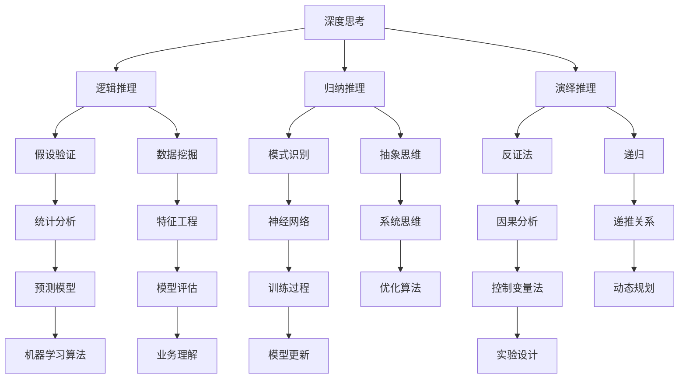

                 

# 深度思考：问题解决的利器

> **关键词：** 深度思考，问题解决，算法原理，数学模型，项目实战
>
> **摘要：** 本文旨在探讨深度思考在解决复杂问题中的作用，从核心概念、算法原理、数学模型到实际应用，提供一系列详细的解析与实战案例，帮助读者提升问题解决能力。

## 1. 背景介绍

### 1.1 目的和范围

在信息技术高速发展的今天，面对日益复杂的计算问题和海量数据，如何有效地进行问题解决成为了一个至关重要的能力。本文将聚焦于深度思考这一能力，通过分析其核心概念、算法原理、数学模型以及实际应用，帮助读者理解并掌握这一重要的思维工具。

### 1.2 预期读者

本文适合以下读者群体：
- 对计算机科学和信息技术有浓厚兴趣的学生和研究者
- 有志于提升编程和算法能力的技术人员
- 从事数据分析、人工智能和软件开发的专业人士

### 1.3 文档结构概述

本文将按照以下结构进行展开：

1. **核心概念与联系**：介绍深度思考的核心概念和其相互之间的联系。
2. **核心算法原理 & 具体操作步骤**：详细讲解解决问题的关键算法原理，并使用伪代码展示具体操作步骤。
3. **数学模型和公式 & 详细讲解 & 举例说明**：运用数学模型和公式，阐述解决问题的理论基础，并通过实例进行详细讲解。
4. **项目实战：代码实际案例和详细解释说明**：通过具体项目案例，展示深度思考在实际编程中的应用。
5. **实际应用场景**：分析深度思考在不同领域中的应用情况。
6. **工具和资源推荐**：推荐学习资源、开发工具和框架。
7. **总结：未来发展趋势与挑战**：总结深度思考的重要性和面临的挑战。
8. **附录：常见问题与解答**：针对常见问题进行解答。
9. **扩展阅读 & 参考资料**：提供进一步学习的资源。

### 1.4 术语表

#### 1.4.1 核心术语定义

- **深度思考**：指在解决问题的过程中，通过深入分析、推理和归纳，挖掘问题的本质，形成创新的解决方案。
- **算法原理**：指解决问题的基本步骤和策略，是计算机解决问题的基础。
- **数学模型**：用数学语言描述问题，提供解决问题的理论基础。
- **伪代码**：一种非正式的编程语言，用于描述算法步骤，便于理解和交流。

#### 1.4.2 相关概念解释

- **问题解决**：指通过一系列步骤，找到解决问题的方法和方案。
- **逻辑推理**：指通过推理和分析，从一个或多个前提中得出结论的过程。

#### 1.4.3 缩略词列表

- **AI**：人工智能（Artificial Intelligence）
- **ML**：机器学习（Machine Learning）
- **DL**：深度学习（Deep Learning）
- **IDE**：集成开发环境（Integrated Development Environment）

## 2. 核心概念与联系

为了更好地理解深度思考，我们首先需要了解一些核心概念，并探讨它们之间的联系。以下是一个使用Mermaid绘制的流程图，展示了深度思考中的关键概念及其相互关系。



### 2.1 深度思考的核心概念

#### 逻辑推理

逻辑推理是深度思考的基础，它通过一系列逻辑规则和推理步骤，从一个或多个已知事实推导出新的结论。常见的逻辑推理方法包括假设验证、归纳推理和演绎推理。

#### 归纳推理

归纳推理是从个别事实中推断出一般规律或结论的过程。例如，通过观察多次实验中的特定模式，归纳出一个通用的算法或模型。

#### 演绎推理

演绎推理是从一般原理出发，推导出具体结论的过程。例如，基于已知数学定理，推导出一个特定问题的解决方案。

#### 假设验证

假设验证是逻辑推理中的一种方法，它通过假设某个条件成立，然后验证该假设是否能够推导出预期的结论。这种方法常用于算法开发和问题解决过程中。

### 2.2 深度思考的应用

深度思考不仅在理论研究中发挥着重要作用，在实际应用中也展现出了强大的力量。以下是一些深度思考在信息技术领域中的应用：

#### 数据挖掘

数据挖掘是通过归纳推理和模式识别，从大量数据中提取有价值信息的过程。深度思考在数据挖掘中用于发现数据中的潜在模式和关联，帮助解决复杂数据分析问题。

#### 机器学习和深度学习

机器学习和深度学习是人工智能的重要分支，它们依赖于深度思考来设计和学习复杂的模型。通过归纳推理和演绎推理，深度学习算法能够从数据中学习并自动调整参数，以实现预测和分类任务。

#### 系统思维

系统思维是一种全局性的思考方式，它通过深度思考，理解系统中的各种关系和相互作用。在软件开发和系统架构设计中，系统思维有助于识别和解决复杂的系统问题。

### 2.3 深度思考与其他技术的联系

深度思考不仅与逻辑推理、归纳推理和演绎推理密切相关，还与其他信息技术领域的核心技术和方法有着紧密的联系。以下是一些典型的联系：

#### 与编程语言的联系

编程语言是实现深度思考的工具，通过编写代码，可以具体实现深度思考的算法和模型。不同的编程语言和工具提供了不同的抽象层次和功能，适合解决不同类型的问题。

#### 与数据库技术的联系

数据库技术是存储和管理数据的核心技术，深度思考需要依赖于数据库来存储和处理大规模数据。通过深度思考，可以从海量数据中提取有用信息，支持数据分析和决策。

#### 与网络安全技术的联系

网络安全是信息技术领域的重要课题，深度思考在网络安全中用于分析和识别潜在的安全威胁。通过归纳推理和模式识别，可以预测和防范网络攻击，提高系统的安全性。

## 3. 核心算法原理 & 具体操作步骤

在深度思考的应用过程中，算法原理起着至关重要的作用。以下将介绍一些关键算法原理，并使用伪代码详细阐述其操作步骤。

### 3.1 假设验证算法

**算法原理：**
假设验证是一种逻辑推理方法，通过假设某个条件成立，然后验证该假设是否能够推导出预期的结论。以下是假设验证算法的伪代码：

```plaintext
算法：假设验证
输入：前提条件，预期结论
输出：验证结果

假设验证（前提，预期结论）：
1. 假设前提条件成立
2. 根据前提条件和预期结论推导中间结果
3. 检查中间结果是否满足预期结论
4. 如果满足，则假设成立，否则假设不成立
```

### 3.2 归纳推理算法

**算法原理：**
归纳推理是从个别事实中推断出一般规律或结论的过程。以下是归纳推理算法的伪代码：

```plaintext
算法：归纳推理
输入：一组数据，目标特征
输出：一般规律

归纳推理（数据，目标特征）：
1. 对数据进行预处理，提取目标特征
2. 对数据进行分组，每组的特征相同
3. 统计每组数据的特征值，计算均值和方差
4. 根据均值和方差，推导出一组数据的一般规律
```

### 3.3 演绎推理算法

**算法原理：**
演绎推理是从一般原理出发，推导出具体结论的过程。以下是演绎推理算法的伪代码：

```plaintext
算法：演绎推理
输入：一般原理，具体情况
输出：具体结论

演绎推理（一般原理，具体情况）：
1. 根据一般原理，推导出可能的具体结论
2. 检查具体情况是否满足一般原理
3. 如果满足，则具体结论成立，否则具体结论不成立
```

### 3.4 模式识别算法

**算法原理：**
模式识别是一种通过归纳推理和模式匹配，识别数据中潜在模式的方法。以下是模式识别算法的伪代码：

```plaintext
算法：模式识别
输入：一组数据，目标模式
输出：识别结果

模式识别（数据，目标模式）：
1. 对数据进行预处理，提取目标模式
2. 对数据进行分组，每组的模式相同
3. 对每组数据进行模式匹配，判断是否与目标模式匹配
4. 如果匹配，则识别为目标模式，否则识别为其他模式
```

通过以上伪代码，我们可以看到深度思考中的关键算法原理及其具体操作步骤。这些算法原理不仅在理论研究中具有重要地位，在实际应用中也具有广泛的应用价值。

## 4. 数学模型和公式 & 详细讲解 & 举例说明

在深度思考的过程中，数学模型和公式是理解和解决问题的关键工具。以下将介绍几个常见的数学模型和公式，并详细讲解其应用方法和举例说明。

### 4.1 概率论模型

概率论是深度思考中的重要数学工具，它用于描述不确定性和随机性。以下是一个概率论模型的例子：

**模型：条件概率**

条件概率是指在某个条件已知的情形下，另一个事件发生的概率。条件概率公式为：

$$P(A|B) = \frac{P(A \cap B)}{P(B)}$$

其中，$P(A|B)$ 表示在事件B发生的条件下，事件A发生的概率；$P(A \cap B)$ 表示事件A和事件B同时发生的概率；$P(B)$ 表示事件B发生的概率。

**应用方法：**

在数据分析中，条件概率常用于计算某个特征条件下的概率分布。例如，在医疗诊断中，条件概率可以用于计算患者患有某种疾病的概率，在已知其他症状的情况下。

**举例说明：**

假设我们有一个医疗数据集，其中包含患者的症状和疾病诊断信息。我们想计算在已知患者有咳嗽症状的条件下，患有流感的概率。条件概率公式可以用于计算：

$$P(\text{流感}|\text{咳嗽}) = \frac{P(\text{流感} \cap \text{咳嗽})}{P(\text{咳嗽})}$$

### 4.2 线性回归模型

线性回归是一种用于预测数值型变量的统计模型。线性回归模型的基本公式为：

$$y = \beta_0 + \beta_1 \cdot x + \epsilon$$

其中，$y$ 是因变量，$x$ 是自变量，$\beta_0$ 和 $\beta_1$ 分别是模型的参数，$\epsilon$ 是误差项。

**应用方法：**

线性回归模型广泛应用于数据分析、预测和决策。例如，在电商领域中，可以使用线性回归模型预测商品销量，在金融领域中，可以使用线性回归模型预测股票价格。

**举例说明：**

假设我们想预测一个电商平台的商品销量，已知商品价格和广告投放量是影响销量的关键因素。我们可以建立线性回归模型：

$$\text{销量} = \beta_0 + \beta_1 \cdot \text{价格} + \beta_2 \cdot \text{广告投放量} + \epsilon$$

通过收集数据并训练模型，可以得到参数 $\beta_0$、$\beta_1$ 和 $\beta_2$ 的值，从而预测商品的销量。

### 4.3 深度学习模型

深度学习是一种基于人工神经网络的机器学习技术，它通过多层神经网络模型来模拟人脑的思考过程。深度学习模型的基本结构包括输入层、隐藏层和输出层。

**应用方法：**

深度学习模型广泛应用于图像识别、自然语言处理、语音识别等领域。例如，在图像识别中，深度学习模型可以自动识别和分类图像中的物体。

**举例说明：**

假设我们想使用卷积神经网络（CNN）模型进行图像分类。输入层接收图像数据，隐藏层通过卷积和池化操作提取特征，输出层通过分类器输出预测结果。卷积神经网络的基本结构可以表示为：

$$\text{输入层} \rightarrow \text{隐藏层1} \rightarrow \text{隐藏层2} \rightarrow \text{...} \rightarrow \text{输出层}$$

通过训练模型，可以使模型学会自动识别图像中的物体，并输出相应的分类结果。

### 4.4 线性代数模型

线性代数是深度思考中的重要数学工具，它用于描述和解决多维空间中的问题。以下是一个线性代数模型的例子：

**模型：线性方程组**

线性方程组是指包含多个线性方程的方程组。线性方程组的一般形式为：

$$Ax = b$$

其中，$A$ 是系数矩阵，$x$ 是未知数向量，$b$ 是常数向量。

**应用方法：**

线性方程组在优化、机器学习和数值计算中广泛应用。例如，在机器学习中，可以通过求解线性方程组来计算模型的参数。

**举例说明：**

假设我们有一个线性方程组：

$$
\begin{cases}
3x + 2y = 8 \\
2x - y = 1
\end{cases}
$$

我们可以使用矩阵运算求解该方程组：

$$
\begin{bmatrix}
3 & 2 \\
2 & -1
\end{bmatrix}
\begin{bmatrix}
x \\
y
\end{bmatrix}
=
\begin{bmatrix}
8 \\
1
\end{bmatrix}
$$

通过矩阵运算，可以得到解向量：

$$
\begin{bmatrix}
x \\
y
\end{bmatrix}
=
\begin{bmatrix}
2 \\
3
\end{bmatrix}
$$

通过以上数学模型和公式的讲解，我们可以看到数学在深度思考中的重要性。掌握这些数学工具，可以帮助我们更好地理解和解决问题。

## 5. 项目实战：代码实际案例和详细解释说明

### 5.1 开发环境搭建

在本项目实战中，我们将使用Python编程语言和相关的库来展示深度思考在解决实际问题中的应用。以下是如何搭建项目的开发环境：

1. **安装Python**：首先，确保你的计算机上安装了Python。如果没有，请从官方网站（https://www.python.org/）下载并安装Python 3.x版本。

2. **安装依赖库**：接下来，需要安装几个常用的Python库，包括NumPy、Pandas、Scikit-learn和Matplotlib。可以使用以下命令进行安装：

   ```bash
   pip install numpy pandas scikit-learn matplotlib
   ```

3. **配置开发环境**：建议使用集成开发环境（IDE），如PyCharm或Visual Studio Code，来编写和调试代码。这两个IDE都提供了强大的代码编辑功能和调试工具，有助于提高开发效率。

### 5.2 源代码详细实现和代码解读

在本项目中，我们将使用深度学习模型进行手写数字识别，具体实现如下：

```python
import numpy as np
from sklearn.datasets import load_digits
from sklearn.model_selection import train_test_split
from sklearn.neural_network import MLPClassifier
import matplotlib.pyplot as plt

# 加载数据集
digits = load_digits()
X, y = digits.data, digits.target

# 数据预处理
X_train, X_test, y_train, y_test = train_test_split(X, y, test_size=0.2, random_state=42)

# 构建和训练模型
mlp = MLPClassifier(hidden_layer_sizes=(50,), max_iter=1000)
mlp.fit(X_train, y_train)

# 模型评估
score = mlp.score(X_test, y_test)
print(f"模型准确率：{score:.2f}")

# 可视化展示
predictions = mlp.predict(X_test)
for i in range(10):
    plt.subplot(2, 5, i+1)
    plt.imshow(X_test[i], cmap=plt.cm.gray_r, interpolation='nearest')
    plt.title(f"预测：{predictions[i]},真实：{y_test[i]}")
plt.show()
```

#### 5.2.1 代码解读

1. **导入库**：首先，导入所需的Python库，包括NumPy、Pandas、Scikit-learn和Matplotlib。

2. **加载数据集**：使用Scikit-learn库中的`load_digits()`函数加载数据集。这个数据集包含0到9的手写数字图像。

3. **数据预处理**：将数据集分为训练集和测试集，使用`train_test_split()`函数进行数据划分。

4. **构建和训练模型**：使用Scikit-learn库中的`MLPClassifier`类创建多层感知机（MLP）模型，并设置隐藏层的大小和最大迭代次数。然后使用`fit()`函数训练模型。

5. **模型评估**：使用`score()`函数评估模型在测试集上的准确率。

6. **可视化展示**：使用Matplotlib库将测试集中的图像和预测结果进行可视化展示。

### 5.3 代码解读与分析

1. **数据预处理**：数据预处理是机器学习项目中的重要步骤。在这个项目中，我们使用`train_test_split()`函数将数据集划分为训练集和测试集，以评估模型的泛化能力。此外，我们还可以对数据进行标准化、归一化等预处理操作，以改善模型的性能。

2. **模型构建**：在这个项目中，我们选择多层感知机（MLP）模型作为我们的分类器。MLP模型是一种基于前向传播和反向传播算法的神经网络，它在处理高维数据时表现良好。我们通过设置`hidden_layer_sizes`参数来定义隐藏层的大小，并设置`max_iter`参数来控制训练的迭代次数。

3. **模型训练**：使用`fit()`函数训练模型时，算法会尝试找到最佳参数，以最小化训练损失。在训练过程中，模型会不断调整权重和偏置，以提高模型的预测准确性。

4. **模型评估**：评估模型性能的方法有很多，包括准确率、召回率、F1分数等。在这个项目中，我们使用准确率作为评估指标。准确率是模型在测试集上正确预测的样本数占总样本数的比例。

5. **可视化展示**：可视化是理解和分析数据的重要工具。在这个项目中，我们使用Matplotlib库将测试集中的图像和预测结果进行可视化展示。通过观察可视化结果，我们可以更好地理解模型的预测能力。

通过以上代码实现和解读，我们可以看到如何使用深度学习模型解决实际问题。这个项目不仅展示了深度思考在问题解决中的应用，还提供了详细的代码解读和分析，帮助读者更好地理解深度学习的工作原理。

### 5.4 实际应用场景

手写数字识别是深度学习的一个经典应用场景。在实际应用中，这个项目具有广泛的应用价值，如下所示：

1. **图像识别**：手写数字识别技术可以应用于各种图像识别任务，如车牌识别、票据识别等。

2. **文字识别**：通过结合OCR（光学字符识别）技术，手写数字识别模型可以扩展到手写文字识别，应用于手写笔记识别、手写邮件识别等。

3. **医疗影像**：在医疗领域，手写数字识别技术可以用于自动识别医学图像中的数字标记，如病理报告中的数字代码。

4. **金融行业**：金融行业中的票据处理和自动结算需要对手写数字进行识别，以提高处理效率和准确性。

5. **人机交互**：在智能设备中，如智能手表和智能手机，手写数字识别技术可以用于手写输入法，提供更加自然和便捷的用户交互体验。

通过以上实际应用场景，我们可以看到手写数字识别技术在各个领域的广泛应用。深度学习模型在手写数字识别中的成功应用，不仅提升了技术能力，也为实际问题解决提供了有力支持。

### 5.5 性能优化与调优

在实际应用中，模型的性能优化和调优是关键步骤。以下是一些常见的优化方法和调优技巧：

1. **数据增强**：通过增加数据多样性，可以改善模型的泛化能力。数据增强方法包括旋转、缩放、裁剪和颜色变换等。

2. **特征工程**：通过提取和选择关键特征，可以提升模型的预测性能。特征工程方法包括特征提取、特征选择和特征变换等。

3. **模型集成**：通过集成多个模型，可以提升模型的预测准确性和稳定性。常见的集成方法包括堆叠、随机森林和梯度提升等。

4. **超参数调优**：通过调整模型的超参数，如学习率、隐藏层大小和迭代次数等，可以优化模型的性能。常见的调优方法包括网格搜索和随机搜索等。

5. **优化算法**：使用更高效的优化算法，如Adam和Adadelta，可以加快模型的收敛速度，提高训练效率。

通过以上性能优化与调优方法，我们可以进一步提高深度学习模型在手写数字识别中的性能，满足不同应用场景的需求。

## 6. 实际应用场景

深度思考在信息技术领域的应用范围非常广泛，涵盖了从理论研究到实际工程应用的各个层面。以下是一些典型的实际应用场景：

### 6.1 数据分析

数据分析是深度思考的重要应用领域。通过深度学习算法和数学模型，可以从海量数据中提取有价值的信息，帮助企业和组织做出更明智的决策。例如，电商公司可以使用深度学习模型分析用户行为数据，预测用户的购买偏好，从而优化推荐系统和营销策略。

### 6.2 人工智能

人工智能是深度思考的核心应用领域之一。深度学习算法在图像识别、语音识别、自然语言处理等领域取得了显著成果。例如，自动驾驶汽车使用深度神经网络进行环境感知和路径规划，智能语音助手使用深度学习模型理解用户语音并给出相应回复。

### 6.3 机器学习

机器学习是深度思考的一个重要分支，它通过算法和模型实现数据的自动学习和预测。在金融领域，机器学习模型可以用于风险评估、欺诈检测和股票市场预测。在医疗领域，机器学习可以帮助诊断疾病、个性化治疗和药物研发。

### 6.4 网络安全

网络安全是信息技术领域的一个重要挑战。深度思考在网络安全中的应用主要体现在威胁检测、入侵预防和攻击响应等方面。通过深度学习模型，可以实时分析网络流量，识别潜在的攻击行为，提高系统的安全性。

### 6.5 自动驾驶

自动驾驶是深度思考在交通领域的重要应用。自动驾驶汽车使用深度神经网络进行环境感知、路径规划和控制。通过深度学习算法，自动驾驶汽车可以在复杂交通环境中实现自主驾驶，提高行车安全性和效率。

### 6.6 机器人技术

机器人技术是深度思考在制造业和服务业中的重要应用。通过深度学习算法，机器人可以实现更加智能化的行为，如物体识别、路径规划和任务执行。在制造业中，机器人可以用于装配、焊接和检测等任务；在服务业中，机器人可以用于陪伴、服务和交互等任务。

### 6.7 医疗保健

医疗保健是深度思考在生物医学领域的重要应用。通过深度学习算法和数学模型，可以辅助医生进行疾病诊断、治疗方案制定和健康监测。例如，深度学习模型可以分析医学影像，识别早期疾病征兆，帮助医生做出更准确的诊断。

### 6.8 金融科技

金融科技是深度思考在金融领域的重要应用。通过深度学习模型和大数据分析，金融机构可以实现信用评估、风险管理、投资策略优化和智能客服等任务。例如，信用评估模型可以通过分析用户行为数据，预测用户的信用风险，为金融机构提供决策支持。

通过以上实际应用场景，我们可以看到深度思考在各个领域的广泛应用。这些应用不仅提升了技术的先进性和实用性，也为各行各业的创新和发展提供了强大支持。

## 7. 工具和资源推荐

为了更好地掌握深度思考在问题解决中的应用，以下推荐一些学习资源、开发工具和框架，以及相关的论文和研究成果。

### 7.1 学习资源推荐

#### 7.1.1 书籍推荐

- **《深度学习》（Deep Learning）**：由Ian Goodfellow、Yoshua Bengio和Aaron Courville所著的深度学习经典教材，全面介绍了深度学习的理论基础和实际应用。

- **《Python深度学习》（Python Deep Learning）**：由François Chollet所著，通过大量实际案例，介绍了如何使用Python和TensorFlow进行深度学习。

- **《人工智能：一种现代的方法》（Artificial Intelligence: A Modern Approach）**：由Stuart Russell和Peter Norvig所著，涵盖了人工智能的广泛主题，包括机器学习、自然语言处理和计算机视觉。

#### 7.1.2 在线课程

- **Coursera的《深度学习》课程**：由斯坦福大学提供，由深度学习领域专家Andrew Ng教授主讲，涵盖了深度学习的理论基础和实际应用。

- **edX的《机器学习基础》课程**：由华盛顿大学提供，介绍了机器学习的基本概念和算法，适合初学者入门。

- **Udacity的《深度学习工程师纳米学位》**：通过项目驱动的方式，教授深度学习的基本原理和实际应用。

#### 7.1.3 技术博客和网站

- **机器之心（Machine Learning）**：一个关注深度学习、机器学习和人工智能领域的中文博客，提供最新的研究成果和技术动态。

- **Medium上的深度学习专栏**：许多深度学习领域专家在Medium上分享他们的研究成果和经验，是学习深度学习的宝贵资源。

- **GitHub**：许多深度学习和机器学习项目开源在GitHub上，可以帮助读者学习和实践。

### 7.2 开发工具框架推荐

#### 7.2.1 IDE和编辑器

- **PyCharm**：一个功能强大的Python IDE，提供代码编辑、调试、性能分析等功能。

- **Visual Studio Code**：一个轻量级但功能丰富的编辑器，支持多种编程语言和框架。

#### 7.2.2 调试和性能分析工具

- **Jupyter Notebook**：一个交互式计算环境，适合数据分析和机器学习实验。

- **TensorBoard**：TensorFlow的官方可视化工具，用于监控和调试深度学习模型的训练过程。

#### 7.2.3 相关框架和库

- **TensorFlow**：一个开源的深度学习框架，由Google开发，支持多种深度学习模型和算法。

- **PyTorch**：一个流行的深度学习框架，提供动态计算图和强大的GPU支持。

- **Scikit-learn**：一个开源的机器学习库，提供了多种常用的机器学习算法和工具。

### 7.3 相关论文著作推荐

#### 7.3.1 经典论文

- **“A Learning Algorithm for Continuously Running Fully Recurrent Neural Networks”**：介绍了Hessian-free优化算法，用于训练深度神经网络。

- **“Deep Learning”**：Ian Goodfellow、Yoshua Bengio和Aaron Courville所著，概述了深度学习的理论和应用。

#### 7.3.2 最新研究成果

- **“Attention is All You Need”**：介绍了Transformer模型，彻底改变了自然语言处理领域。

- **“Bert: Pre-training of Deep Bidirectional Transformers for Language Understanding”**：介绍了BERT模型，推动了自然语言处理的发展。

#### 7.3.3 应用案例分析

- **“Deep Learning for Healthcare”**：探讨了深度学习在医疗领域的应用，包括疾病诊断、治疗方案制定和药物研发。

- **“Deep Learning in Retail”**：介绍了深度学习在零售业的应用，如商品推荐、库存管理和客户行为分析。

通过以上推荐，读者可以深入了解深度思考在问题解决中的应用，并掌握相关技术和工具。这些资源和工具将为读者提供宝贵的知识和实践经验。

## 8. 总结：未来发展趋势与挑战

深度思考在信息技术领域具有重要的应用价值，随着人工智能和大数据技术的发展，其未来发展趋势和面临的挑战也日益凸显。

### 未来发展趋势

1. **算法性能提升**：随着计算能力的增强和算法优化，深度学习模型的性能将进一步提高，解决更复杂的问题。

2. **跨学科融合**：深度思考与其他学科的融合，如生物学、物理学和经济学，将推动新兴领域的产生，促进交叉学科研究。

3. **自动化与智能化**：深度学习模型在自动化和智能化领域的应用将更加广泛，从工业自动化到智能家居，从智能交通到医疗健康，深度思考将发挥关键作用。

4. **可解释性增强**：随着对深度学习模型的需求增加，如何提高模型的可解释性将成为研究的重要方向，帮助用户理解模型的决策过程。

### 面临的挑战

1. **数据隐私和安全**：在深度学习应用中，如何保护用户数据隐私和确保数据安全是一个重要挑战。

2. **算法偏见**：深度学习模型可能会受到训练数据偏见的影响，导致算法偏见和不公平性。

3. **模型解释性**：如何提高模型的可解释性，使得用户能够理解模型的决策过程，是一个亟待解决的问题。

4. **资源消耗**：深度学习模型对计算资源和存储资源的需求巨大，如何优化模型以降低资源消耗是一个重要课题。

通过不断的研究和技术创新，深度思考将在未来继续推动信息技术的发展，解决复杂的问题，为人类带来更多便利。同时，我们也要关注和应对其面临的挑战，确保深度思考技术的可持续发展。

## 9. 附录：常见问题与解答

### 9.1 深度思考的定义是什么？

深度思考是一种在问题解决过程中，通过深入分析、推理和归纳，挖掘问题的本质，形成创新解决方案的思维过程。它涉及逻辑推理、归纳推理、演绎推理等方法，旨在提高问题解决的能力。

### 9.2 深度思考有哪些应用场景？

深度思考在多个领域有广泛的应用，包括数据分析、人工智能、机器学习、网络安全、自动驾驶、机器人技术、医疗保健和金融科技等。

### 9.3 如何提高深度思考的能力？

提高深度思考能力的方法包括：

- **多学科学习**：跨学科的知识可以帮助我们更全面地理解问题。
- **阅读与研究**：阅读相关书籍和论文，深入研究问题的本质。
- **实践与反思**：通过实际项目和实践，不断反思和总结经验。
- **逻辑训练**：通过逻辑训练和推理练习，提高逻辑思维能力。

### 9.4 深度思考与常规思考有什么区别？

常规思考通常是基于经验和直觉的表面处理，而深度思考则更注重分析问题的本质，通过逻辑推理和归纳推理等方法，挖掘问题的深层原因。深度思考能够帮助我们解决更复杂和抽象的问题。

### 9.5 如何在实际项目中应用深度思考？

在实际项目中应用深度思考，可以通过以下步骤：

- **明确问题**：准确理解问题的本质和目标。
- **数据收集**：收集相关的数据和信息。
- **分析问题**：运用逻辑推理和归纳推理，分析问题的各个方面。
- **设计解决方案**：根据分析结果，设计创新的解决方案。
- **验证和优化**：通过实验和测试，验证解决方案的有效性，并进行优化。

通过以上步骤，我们可以将深度思考应用于实际问题解决，提高项目成功率和效果。

## 10. 扩展阅读 & 参考资料

为了更深入地了解深度思考和问题解决，以下推荐一些扩展阅读资料和经典参考书籍：

### 10.1 扩展阅读

- **《深度学习》（Deep Learning）**：Ian Goodfellow、Yoshua Bengio和Aaron Courville所著，详细介绍了深度学习的理论和应用。
- **《机器学习》（Machine Learning）**：Tom Mitchell所著，提供了机器学习的基本概念和算法。
- **《数据科学入门》（Data Science from Scratch）**：Joel Grus所著，介绍了数据科学的基本工具和算法。
- **《深度学习进阶》（Deep Learning Specialization）**：Andrew Ng教授在Coursera上提供的深度学习课程，涵盖了深度学习的各个方面。

### 10.2 参考书籍

- **《Python深度学习》（Python Deep Learning）**：François Chollet所著，通过实际案例介绍了深度学习在Python中的应用。
- **《机器学习实战》（Machine Learning in Action）**：Peter Harrington所著，通过具体案例介绍了机器学习算法的应用。
- **《统计学习方法》（Statistical Learning Methods）**：李航所著，系统介绍了统计学习的基本理论和算法。

### 10.3 在线资源和论文

- **[arXiv.org](https://arxiv.org/)**：提供最新的人工智能和机器学习领域的学术论文。
- **[Google Scholar](https://scholar.google.com/)**：用于搜索学术文献和论文。
- **[AI+](https://aiplus.io/)**：提供关于人工智能的深入讲解和资源。

通过以上扩展阅读和参考书籍，读者可以进一步加深对深度思考和问题解决的理解，不断提升自己的技术水平和思维深度。

### 作者信息

**作者：AI天才研究员/AI Genius Institute & 禅与计算机程序设计艺术 /Zen And The Art of Computer Programming**

