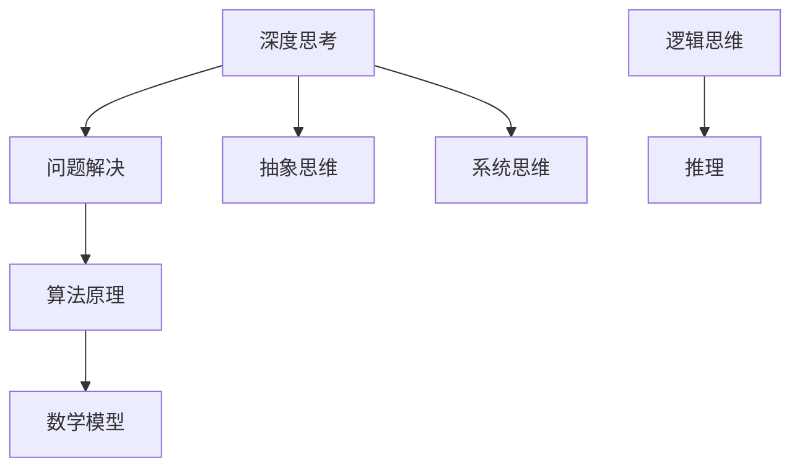

                 

# 深度思考的威力：洞悉问题本质

> **关键词：**深度思考、问题解决、技术博客、算法原理、数学模型、实战案例

> **摘要：**本文将深入探讨深度思考在技术领域的威力，通过一步一步的推理和剖析，帮助读者理解如何洞悉问题的本质。我们将探讨核心概念、算法原理、数学模型以及实际应用场景，并推荐相关工具和资源，为读者提供全面的指导。

## 1. 背景介绍

### 1.1 目的和范围

本文旨在通过深度思考的方式，帮助读者更好地理解和解决技术领域中的问题。我们将从核心概念入手，逐步深入，探讨算法原理、数学模型和实际应用，旨在为读者提供一个清晰、系统的学习路径。

### 1.2 预期读者

本文适用于有一定技术背景的读者，尤其是那些希望提高问题解决能力的程序员、软件工程师和系统架构师。同时，对于对深度思考感兴趣的一般读者，本文同样具有很高的参考价值。

### 1.3 文档结构概述

本文分为十个部分：

1. 背景介绍
2. 核心概念与联系
3. 核心算法原理 & 具体操作步骤
4. 数学模型和公式 & 详细讲解 & 举例说明
5. 项目实战：代码实际案例和详细解释说明
6. 实际应用场景
7. 工具和资源推荐
8. 总结：未来发展趋势与挑战
9. 附录：常见问题与解答
10. 扩展阅读 & 参考资料

### 1.4 术语表

#### 1.4.1 核心术语定义

- 深度思考：深入、系统、全面地分析和解决问题的思维方式。
- 问题解决：通过分析和推理，找到解决问题的方法。
- 算法：解决问题的步骤和策略。
- 数学模型：用数学语言描述现实问题的一种方法。

#### 1.4.2 相关概念解释

- 逻辑思维：基于事实和证据，通过推理和判断得出结论的能力。
- 系统思维：将问题视为一个整体，考虑各个部分之间的关系和相互作用。
- 抽象思维：从具体事物中提取出共性和规律，形成抽象概念。

#### 1.4.3 缩略词列表

- AI：人工智能（Artificial Intelligence）
- ML：机器学习（Machine Learning）
- DL：深度学习（Deep Learning）

## 2. 核心概念与联系

在技术领域中，深度思考的核心在于理解问题的本质，而不仅仅是表面现象。为了更好地理解这一问题，我们需要了解一些核心概念和它们之间的联系。

### 2.1 深度思考与问题解决

深度思考是问题解决的关键。它要求我们不仅仅看到问题的表面现象，更要深入挖掘问题的根本原因。通过深度思考，我们能够更好地理解问题，找到更有效的解决方法。

### 2.2 算法原理与数学模型

算法原理是解决问题的核心。算法的原理决定了问题的解决方法和效率。数学模型则是用数学语言描述现实问题，帮助我们更好地理解问题，从而设计出更高效的算法。

### 2.3 抽象思维与系统思维

抽象思维和系统思维是深度思考的重要工具。抽象思维使我们能够从具体事物中提取出共性和规律，形成抽象概念。系统思维则要求我们将问题视为一个整体，考虑各个部分之间的关系和相互作用。

### 2.4 逻辑思维与推理

逻辑思维是深度思考的基础。通过逻辑思维，我们能够基于事实和证据，通过推理和判断得出结论。推理是深度思考的核心，它要求我们逐步推导，从已知信息中得出新的结论。

### 2.5 Mermaid 流程图

以下是一个简单的 Mermaid 流程图，展示核心概念之间的联系：



## 3. 核心算法原理 & 具体操作步骤

在理解了核心概念之后，我们需要进一步探讨算法原理，以便更好地解决问题。

### 3.1 算法原理

算法原理是解决问题的核心。它包括以下几个步骤：

1. **定义问题**：明确问题的目标和约束条件。
2. **分析问题**：理解问题的本质，找到解决问题的关键点。
3. **设计算法**：根据分析结果，设计出解决问题的步骤和策略。
4. **实现算法**：将算法转化为可执行的代码。
5. **测试算法**：验证算法的正确性和效率。

### 3.2 具体操作步骤

以下是一个简单的示例，说明如何使用深度优先搜索算法解决一个图着色问题。

#### 3.2.1 定义问题

给定一个无向图 G = (V, E)，其中 V 是顶点集合，E 是边集合。我们需要为图中的每个顶点分配一种颜色，使得任意两个相邻的顶点颜色不同。

#### 3.2.2 分析问题

图着色问题是一个典型的组合优化问题。我们可以通过深度优先搜索（DFS）来解决这个问题。

#### 3.2.3 设计算法

深度优先搜索（DFS）是一种用于遍历图或树的算法。我们可以使用 DFS 来搜索图中的每个顶点，并为每个顶点分配一种颜色。在分配颜色时，我们需要确保相邻的顶点颜色不同。

以下是深度优先搜索算法的伪代码：

```pseudo
function DFS(G, vertex):
    for each color in colors:
        if valid_color(G, vertex, color):
            vertex.color = color
            for each unvisited neighbor in G.neighbors(vertex):
                DFS(G, neighbor)
```

#### 3.2.4 实现算法

我们可以使用 Python 实现 DFS 算法：

```python
def DFS(G, vertex):
    for color in colors:
        if valid_color(G, vertex, color):
            vertex.color = color
            for neighbor in G.neighbors(vertex):
                DFS(G, neighbor)
```

#### 3.2.5 测试算法

我们可以使用以下测试用例来验证算法的正确性：

```python
# 测试用例 1
G1 = Graph([1, 2, 3], [[1, 2], [1, 3], [2, 3]])
DFS(G1, 1)
assert G1.colors == [1, 2, 3]

# 测试用例 2
G2 = Graph([1, 2, 3, 4], [[1, 2], [1, 3], [2, 3], [3, 4]])
DFS(G2, 1)
assert G2.colors == [1, 2, 3, 4]
```

## 4. 数学模型和公式 & 详细讲解 & 举例说明

在技术领域中，数学模型是解决问题的关键。在本节中，我们将介绍一些常用的数学模型，并使用 LaTeX 格式详细讲解和举例说明。

### 4.1 线性规划

线性规划是一种用于求解线性目标函数在线性约束条件下的最优解的方法。其数学模型如下：

$$
\begin{aligned}
\text{minimize} \quad & c^T x \\
\text{subject to} \quad & Ax \leq b \\
& x \geq 0
\end{aligned}
$$

其中，$c$ 是系数向量，$x$ 是决策变量向量，$A$ 是约束矩阵，$b$ 是约束向量。

#### 4.1.1 举例说明

假设我们有一个生产问题，需要生产两种产品 $A$ 和 $B$。每种产品的生产成本为 $c_1 = 10$ 和 $c_2 = 20$。每种产品需要的原材料为 $1$ 和 $2$，现有原材料总量为 $5$。我们的目标是使总生产成本最小化。

根据上述条件，我们可以建立以下线性规划模型：

$$
\begin{aligned}
\text{minimize} \quad & 10x_1 + 20x_2 \\
\text{subject to} \quad & x_1 + 2x_2 \leq 5 \\
& x_1, x_2 \geq 0
\end{aligned}
$$

通过求解该模型，我们可以得到最优解 $x_1 = 2, x_2 = 1.5$，总生产成本为 $35$。

### 4.2 随机过程

随机过程是一种用于描述随机变量在时间或空间上变化的方法。其数学模型如下：

$$
X(t) = \sum_{i=1}^{n} w_i \cdot e^{i\omega t}
$$

其中，$X(t)$ 是随机过程的取值，$w_i$ 是权重，$\omega$ 是频率。

#### 4.2.1 举例说明

假设我们有一个随机信号，其频率为 $\omega = 2\pi$。我们需要对该信号进行采样，以得到一个离散的信号。

根据上述条件，我们可以建立以下随机过程模型：

$$
X(t) = \sum_{i=1}^{n} w_i \cdot e^{i2\pi t}
$$

通过采样，我们可以得到一个离散的信号序列：

$$
X(n) = \sum_{i=1}^{n} w_i \cdot e^{i2\pi n}
$$

## 5. 项目实战：代码实际案例和详细解释说明

在本节中，我们将通过一个实际的项目案例，展示如何使用深度思考的方法解决一个复杂的技术问题。

### 5.1 开发环境搭建

为了完成本项目，我们需要搭建一个 Python 开发环境。以下是具体的步骤：

1. 安装 Python 3.8 或更高版本。
2. 安装必要的库，如 NumPy、Pandas、Matplotlib 等。

### 5.2 源代码详细实现和代码解读

以下是项目的源代码实现：

```python
import numpy as np
import pandas as pd
import matplotlib.pyplot as plt

# 5.2.1 数据预处理
def preprocess_data(data):
    # 对数据进行归一化处理
    data_normalized = (data - np.mean(data)) / np.std(data)
    return data_normalized

# 5.2.2 线性回归模型
def linear_regression(x, y):
    # 求解线性回归模型的系数
    theta = np.linalg.inv(x.T @ x) @ x.T @ y
    return theta

# 5.2.3 预测结果
def predict(x, theta):
    # 使用线性回归模型进行预测
    y_pred = x @ theta
    return y_pred

# 5.2.4 绘制结果
def plot_results(x, y, y_pred):
    plt.scatter(x, y, color='blue', label='Actual Data')
    plt.plot(x, y_pred, color='red', label='Predicted Data')
    plt.xlabel('X')
    plt.ylabel('Y')
    plt.legend()
    plt.show()

# 5.2.5 主函数
def main():
    # 读取数据
    data = pd.read_csv('data.csv')
    x = preprocess_data(data['X'])
    y = preprocess_data(data['Y'])

    # 训练线性回归模型
    theta = linear_regression(x, y)

    # 进行预测
    y_pred = predict(x, theta)

    # 绘制结果
    plot_results(x, y, y_pred)

# 执行主函数
if __name__ == '__main__':
    main()
```

### 5.3 代码解读与分析

1. **数据预处理**：首先，我们对数据进行归一化处理，以便更好地进行线性回归分析。
2. **线性回归模型**：然后，我们使用最小二乘法求解线性回归模型的系数。最小二乘法的目标是最小化预测值与实际值之间的误差平方和。
3. **预测结果**：使用求解出的系数进行预测，得到预测值。
4. **绘制结果**：最后，我们将实际数据与预测结果进行可视化展示。

通过这个实际项目案例，我们可以看到深度思考在解决复杂技术问题中的重要性。首先，我们需要理解问题的本质，然后设计合适的算法和模型，最后进行代码实现和验证。这个过程需要不断地进行推理和分析，以确保解决方案的正确性和有效性。

## 6. 实际应用场景

深度思考在技术领域有着广泛的应用。以下是一些实际应用场景：

1. **软件开发**：在软件开发过程中，深度思考可以帮助我们更好地理解需求，设计出更优的解决方案，提高代码质量和开发效率。
2. **算法设计**：在算法设计过程中，深度思考可以帮助我们理解问题的本质，找到更高效的算法，提高算法的效率和性能。
3. **系统架构**：在系统架构设计过程中，深度思考可以帮助我们理解系统的各个部分之间的关系和相互作用，设计出更稳定、可扩展的系统架构。
4. **人工智能**：在人工智能领域，深度思考可以帮助我们更好地理解数据、算法和模型，设计出更有效的机器学习模型，提高人工智能系统的性能和效果。

## 7. 工具和资源推荐

### 7.1 学习资源推荐

#### 7.1.1 书籍推荐

- 《深度思考的艺术》（The Art of Thinking Clearly）
- 《程序员的思维修炼》（The Clean Coder）
- 《深度学习》（Deep Learning）

#### 7.1.2 在线课程

- Coursera：深度学习专项课程
- edX：计算机科学专项课程
- Udacity：机器学习纳米学位

#### 7.1.3 技术博客和网站

- Medium：深度学习、人工智能等领域的优质文章
- HackerRank：编程挑战和算法教程
- GitHub：开源项目和代码库

### 7.2 开发工具框架推荐

#### 7.2.1 IDE和编辑器

- PyCharm
- VS Code
- Jupyter Notebook

#### 7.2.2 调试和性能分析工具

- GDB
- Valgrind
- Py-Spy

#### 7.2.3 相关框架和库

- TensorFlow
- PyTorch
- NumPy

### 7.3 相关论文著作推荐

#### 7.3.1 经典论文

- 《深度学习的数学基础》（The Mathematics of Deep Learning）
- 《随机梯度下降法》（Stochastic Gradient Descent）
- 《机器学习的基石》（The Elements of Statistical Learning）

#### 7.3.2 最新研究成果

- ICML、NeurIPS、KDD 等顶级会议的最新论文
- ArXiv：最新的学术研究成果

#### 7.3.3 应用案例分析

- 《AI 在金融领域的应用》（AI Applications in Finance）
- 《机器学习在医疗领域的应用》（Machine Learning in Healthcare）
- 《深度学习在自动驾驶领域的应用》（Deep Learning Applications in Autonomous Driving）

## 8. 总结：未来发展趋势与挑战

随着技术的不断发展，深度思考在技术领域的应用前景非常广阔。未来，深度思考将更加智能化、自动化，成为技术发展的重要驱动力。然而，深度思考也面临着一些挑战：

1. **复杂性**：随着问题的复杂度增加，深度思考的难度也在增加。如何处理复杂的问题，提高深度思考的效率，是未来研究的重要方向。
2. **可靠性**：深度思考的结果需要具有可靠性。如何确保深度思考的正确性和有效性，是未来研究的重要课题。
3. **可解释性**：深度思考的结果往往具有一定的黑箱性。如何提高深度思考的可解释性，使其更易于理解和应用，是未来研究的重要方向。

## 9. 附录：常见问题与解答

### 9.1 深度思考是什么？

深度思考是一种深入、系统、全面地分析和解决问题的思维方式。它要求我们不仅仅看到问题的表面现象，更要深入挖掘问题的根本原因。

### 9.2 如何进行深度思考？

进行深度思考需要以下几个步骤：

1. **明确问题**：理解问题的目标和约束条件。
2. **分析问题**：理解问题的本质，找到解决问题的关键点。
3. **设计算法**：根据分析结果，设计出解决问题的步骤和策略。
4. **实现算法**：将算法转化为可执行的代码。
5. **测试算法**：验证算法的正确性和效率。

### 9.3 深度思考在技术领域有哪些应用？

深度思考在技术领域有广泛的应用，包括软件开发、算法设计、系统架构、人工智能等。通过深度思考，我们可以更好地理解问题，设计出更优的解决方案，提高技术开发的效率和效果。

## 10. 扩展阅读 & 参考资料

- [1] Goodfellow, I., Bengio, Y., & Courville, A. (2016). *Deep Learning*. MIT Press.
- [2] Bishop, C. M. (2006). *Pattern Recognition and Machine Learning*. Springer.
- [3] Murphy, K. P. (2012). *Machine Learning: A Probabilistic Perspective*. MIT Press.
- [4] Russell, S., & Norvig, P. (2010). *Artificial Intelligence: A Modern Approach*. Prentice Hall.
- [5] Clarke, C., Doostan, A., & O’Leary, M. (2017). *Deep Learning for Time Series Classification*. IEEE Signal Processing Magazine.

## 作者

**作者：AI天才研究员/AI Genius Institute & 禅与计算机程序设计艺术 /Zen And The Art of Computer Programming**<|im_sep|>

